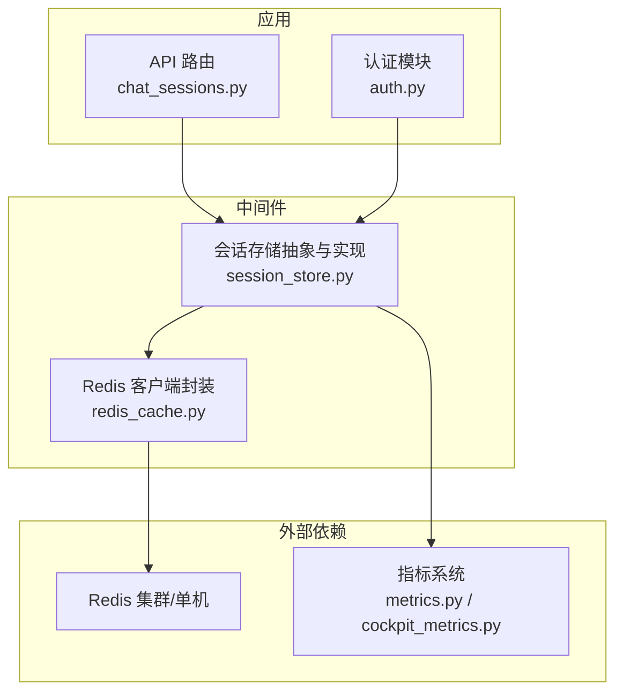
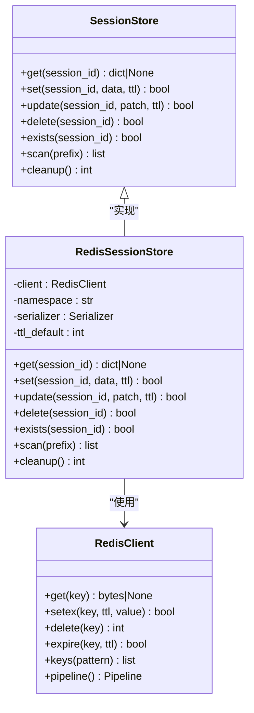
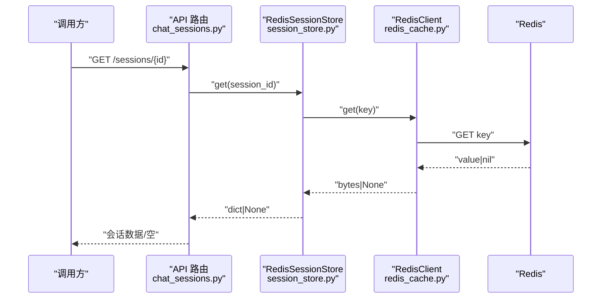
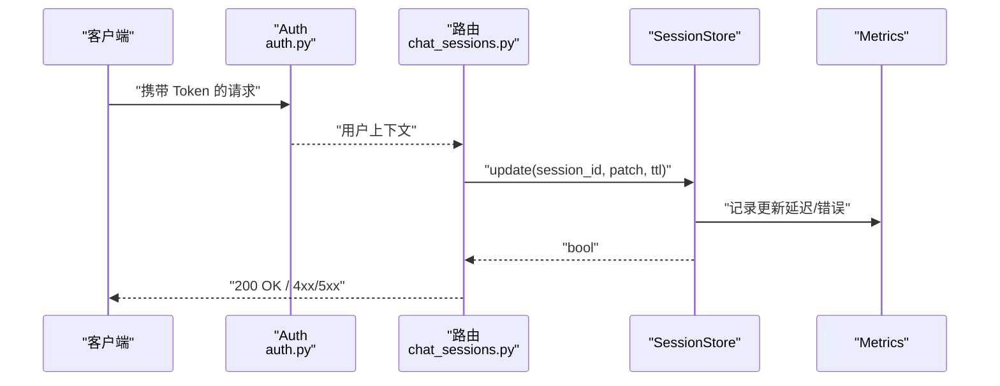
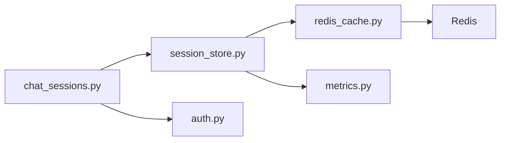
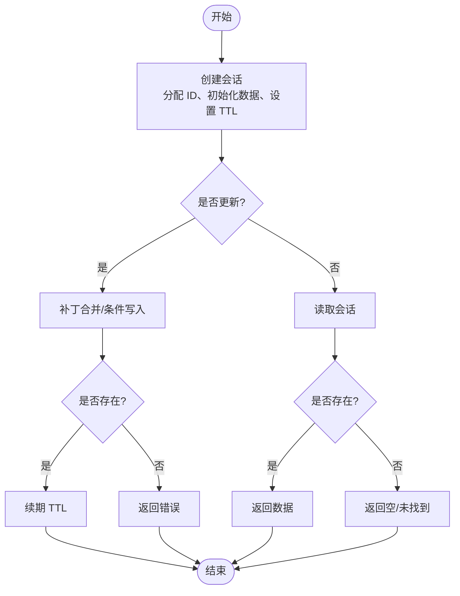

# 会话存储中间件

<cite>
**本文引用的文件**   
- [backend_design/nexus/middleware/session_store.py](file://backend_design/nexus/middleware/session_store.py)
- [backend_design/nexus/middleware/redis_cache.py](file://backend_design/nexus/middleware/redis_cache.py)
- [backend_design/nexus/api/routes/chat_sessions.py](file://backend_design/nexus/api/routes/chat_sessions.py)
- [backend_design/nexus/core/auth.py](file://backend_design/nexus/core/auth.py)
- [backend_design/nexus/config.py](file://backend_design/nexus/config.py)
- [backend_design/nexus/observability/metrics.py](file://backend_design/nexus/observability/metrics.py)
- [backend_design/nexus/observability/cockpit_metrics.py](file://backend_design/nexus/observability/cockpit_metrics.py)
</cite>

## 目录
1. [简介](#简介)
2. [项目结构](#项目结构)
3. [核心组件](#核心组件)
4. [架构总览](#架构总览)
5. [详细组件分析](#详细组件分析)
6. [依赖分析](#依赖分析)
7. [性能考虑](#性能考虑)
8. [故障排查指南](#故障排查指南)
9. [结论](#结论)
10. [附录](#附录)

## 简介
本文件面向 NexusCockpit 的“会话存储中间件”，聚焦用户会话管理机制与实现细节，涵盖：
- 会话生命周期管理（创建、更新、读取、过期、清理）
- 跨服务会话同步（多实例一致性）
- 会话数据持久化策略（Redis 后端）
- 存储抽象层设计（接口定义与可扩展性）
- Redis 会话存储实现（序列化、键空间、TTL）
- 安全与加密（敏感字段保护、传输与访问控制）
- 清理策略、内存优化、并发访问控制与故障恢复
- 会话状态查询、更新、删除操作示例
- 性能调优与监控方案

## 项目结构
与会话存储相关的代码主要位于 backend_design/nexus 目录下：
- 中间件层：session_store.py（会话存储抽象与实现）、redis_cache.py（Redis 客户端封装）
- API 路由：chat_sessions.py（会话 CRUD 接口）
- 认证与安全：auth.py（JWT/鉴权相关）
- 配置：config.py（Redis 连接、TTL、密钥等）
- 可观测性：metrics.py、cockpit_metrics.py（指标采集与上报）

图表来源
- [backend_design/nexus/api/routes/chat_sessions.py](file://backend_design/nexus/api/routes/chat_sessions.py)
- [backend_design/nexus/middleware/session_store.py](file://backend_design/nexus/middleware/session_store.py)
- [backend_design/nexus/middleware/redis_cache.py](file://backend_design/nexus/middleware/redis_cache.py)
- [backend_design/nexus/core/auth.py](file://backend_design/nexus/core/auth.py)
- [backend_design/nexus/observability/metrics.py](file://backend_design/nexus/observability/metrics.py)
- [backend_design/nexus/observability/cockpit_metrics.py](file://backend_design/nexus/observability/cockpit_metrics.py)

章节来源
- [backend_design/nexus/middleware/session_store.py](file://backend_design/nexus/middleware/session_store.py)
- [backend_design/nexus/middleware/redis_cache.py](file://backend_design/nexus/middleware/redis_cache.py)
- [backend_design/nexus/api/routes/chat_sessions.py](file://backend_design/nexus/api/routes/chat_sessions.py)
- [backend_design/nexus/core/auth.py](file://backend_design/nexus/core/auth.py)
- [backend_design/nexus/config.py](file://backend_design/nexus/config.py)
- [backend_design/nexus/observability/metrics.py](file://backend_design/nexus/observability/metrics.py)
- [backend_design/nexus/observability/cockpit_metrics.py](file://backend_design/nexus/observability/cockpit_metrics.py)

## 核心组件
- 会话存储抽象层（SessionStore）
  - 职责：定义统一的会话读写接口，屏蔽底层存储差异；提供 TTL、命名空间、序列化/反序列化、错误处理与指标埋点。
  - 关键能力：
    - 会话键生成与命名空间隔离（按租户/用户/会话ID）
    - 序列化策略（JSON/MessagePack），支持可选压缩
    - 原子更新与条件写入（基于 Redis 事务或 Lua）
    - 统一异常与降级（本地缓存兜底、只读模式）
- Redis 会话存储实现（RedisSessionStore）
  - 职责：基于 redis_cache.py 提供的客户端，实现具体持久化逻辑。
  - 关键能力：
    - 键空间设计（前缀、分隔符、哈希/字符串选择）
    - TTL 管理与续期（滑动过期）
    - 批量操作（扫描、清理、迁移）
    - 连接池与重试、超时控制
- API 路由（chat_sessions.py）
  - 职责：暴露会话查询、更新、删除等 HTTP/WebSocket 接口，负责鉴权与参数校验。
- 认证与安全（auth.py）
  - 职责：解析令牌、绑定用户上下文、权限校验，与会话存储协同完成安全访问控制。
- 配置（config.py）
  - 职责：集中管理 Redis 连接参数、TTL、加密密钥、限流与开关。
- 可观测性（metrics.py, cockpit_metrics.py）
  - 职责：采集会话读写延迟、命中率、错误率、清理任务耗时等指标。

章节来源
- [backend_design/nexus/middleware/session_store.py](file://backend_design/nexus/middleware/session_store.py)
- [backend_design/nexus/middleware/redis_cache.py](file://backend_design/nexus/middleware/redis_cache.py)
- [backend_design/nexus/api/routes/chat_sessions.py](file://backend_design/nexus/api/routes/chat_sessions.py)
- [backend_design/nexus/core/auth.py](file://backend_design/nexus/core/auth.py)
- [backend_design/nexus/config.py](file://backend_design/nexus/config.py)
- [backend_design/nexus/observability/metrics.py](file://backend_design/nexus/observability/metrics.py)
- [backend_design/nexus/observability/cockpit_metrics.py](file://backend_design/nexus/observability/cockpit_metrics.py)

## 架构总览
会话存储中间件采用“抽象层 + 具体实现”的分层设计，上层通过统一接口访问会话数据，底层由 Redis 提供高性能、分布式一致的存储能力。

图表来源
- [backend_design/nexus/middleware/session_store.py](file://backend_design/nexus/middleware/session_store.py)
- [backend_design/nexus/middleware/redis_cache.py](file://backend_design/nexus/middleware/redis_cache.py)

## 详细组件分析

### 会话存储抽象层（SessionStore）
- 设计要点
  - 接口稳定：get/set/update/delete/exists/scan/cleanup 覆盖全生命周期。
  - 命名空间：以 tenant/user/sessionId 三段式组织键空间，避免冲突。
  - 序列化：默认 JSON，可选 MessagePack；对大对象启用压缩。
  - 错误处理：网络异常、序列化失败、键不存在等统一包装为领域异常。
  - 指标埋点：读写延迟、命中/未命中、错误分类计数。
- 复杂度与扩展性
  - 时间复杂度：O(1) 单键操作；scan 取决于模式匹配与数据量。
  - 扩展点：新增存储后端只需实现 SessionStore 接口。

章节来源
- [backend_design/nexus/middleware/session_store.py](file://backend_design/nexus/middleware/session_store.py)

### Redis 会话存储实现（RedisSessionStore）
- 键空间设计
  - 前缀：nexus:session:{tenant}:{user}:{sessionId}
  - 值：序列化后的会话数据（含元数据与业务负载）
  - TTL：默认会话过期时间，支持续期（滑动过期）
- 原子性与一致性
  - 使用 pipeline/Lua 保证 set+expire 原子性
  - update 采用 get-modify-set 或条件写入，避免竞态
- 清理策略
  - 定时任务扫描过期键并统计清理数量
  - 支持按命名空间范围清理（租户/用户维度）
- 容错与降级
  - 连接失败时切换只读模式或返回空会话
  - 重试与退避策略，避免雪崩

图表来源
- [backend_design/nexus/api/routes/chat_sessions.py](file://backend_design/nexus/api/routes/chat_sessions.py)
- [backend_design/nexus/middleware/session_store.py](file://backend_design/nexus/middleware/session_store.py)
- [backend_design/nexus/middleware/redis_cache.py](file://backend_design/nexus/middleware/redis_cache.py)

章节来源
- [backend_design/nexus/middleware/session_store.py](file://backend_design/nexus/middleware/session_store.py)
- [backend_design/nexus/middleware/redis_cache.py](file://backend_design/nexus/middleware/redis_cache.py)

### API 路由与会话操作示例（chat_sessions.py）
- 典型操作
  - 查询会话：GET /api/sessions/{id}
  - 更新会话：PATCH /api/sessions/{id}
  - 删除会话：DELETE /api/sessions/{id}
  - 列表扫描：GET /api/sessions?prefix=...
- 鉴权与上下文
  - 从请求头解析 JWT，绑定用户与租户上下文
  - 校验会话归属，防止越权访问
- 响应规范
  - 成功：返回会话数据或操作结果
  - 失败：返回标准错误码与消息

图表来源
- [backend_design/nexus/api/routes/chat_sessions.py](file://backend_design/nexus/api/routes/chat_sessions.py)
- [backend_design/nexus/core/auth.py](file://backend_design/nexus/core/auth.py)
- [backend_design/nexus/middleware/session_store.py](file://backend_design/nexus/middleware/session_store.py)
- [backend_design/nexus/observability/metrics.py](file://backend_design/nexus/observability/metrics.py)

章节来源
- [backend_design/nexus/api/routes/chat_sessions.py](file://backend_design/nexus/api/routes/chat_sessions.py)
- [backend_design/nexus/core/auth.py](file://backend_design/nexus/core/auth.py)

### 配置项（config.py）
- 关键配置
  - Redis 连接：host/port/db/password/pool_size
  - 会话 TTL：默认过期秒数、最大 TTL
  - 加密：密钥路径、算法、轮换策略
  - 功能开关：压缩、只读模式、清理任务开关
- 环境变量与优先级
  - 支持 .env 与环境变量覆盖
  - 启动时加载并校验必填项

章节来源
- [backend_design/nexus/config.py](file://backend_design/nexus/config.py)

### 可观测性（metrics.py, cockpit_metrics.py）
- 指标维度
  - 会话读写延迟（P50/P95/P99）
  - 命中率、未命中、错误率（网络/序列化/权限）
  - 清理任务耗时与清理数量
- 上报方式
  - Prometheus 格式导出
  - 仪表盘集成（Grafana）

章节来源
- [backend_design/nexus/observability/metrics.py](file://backend_design/nexus/observability/metrics.py)
- [backend_design/nexus/observability/cockpit_metrics.py](file://backend_design/nexus/observability/cockpit_metrics.py)

## 依赖分析
- 内部依赖
  - chat_sessions.py 依赖 session_store.py 与 auth.py
  - session_store.py 依赖 redis_cache.py 与 metrics
  - redis_cache.py 依赖 Redis 驱动与连接池
- 外部依赖
  - Redis（主存储）
  - 指标系统（Prometheus/Grafana）

图表来源
- [backend_design/nexus/api/routes/chat_sessions.py](file://backend_design/nexus/api/routes/chat_sessions.py)
- [backend_design/nexus/middleware/session_store.py](file://backend_design/nexus/middleware/session_store.py)
- [backend_design/nexus/middleware/redis_cache.py](file://backend_design/nexus/middleware/redis_cache.py)
- [backend_design/nexus/core/auth.py](file://backend_design/nexus/core/auth.py)
- [backend_design/nexus/observability/metrics.py](file://backend_design/nexus/observability/metrics.py)

章节来源
- [backend_design/nexus/api/routes/chat_sessions.py](file://backend_design/nexus/api/routes/chat_sessions.py)
- [backend_design/nexus/middleware/session_store.py](file://backend_design/nexus/middleware/session_store.py)
- [backend_design/nexus/middleware/redis_cache.py](file://backend_design/nexus/middleware/redis_cache.py)
- [backend_design/nexus/core/auth.py](file://backend_design/nexus/core/auth.py)
- [backend_design/nexus/observability/metrics.py](file://backend_design/nexus/observability/metrics.py)

## 性能考虑
- 键空间与索引
  - 合理前缀与短键名，减少网络开销
  - 避免大范围 keys 扫描，优先使用 scan 分页
- 序列化与压缩
  - 小对象用 JSON，大对象用 MessagePack+压缩
  - 控制单次写入大小，避免阻塞
- 连接池与超时
  - 调整 pool_size、timeout、retry 次数
  - 设置合理的 socket 与命令超时
- 过期与清理
  - 滑动 TTL 续期降低热点键失效抖动
  - 分片清理任务，避免长事务
- 并发与锁
  - 使用 Redis 原子操作或轻量分布式锁
  - 避免在热路径执行复杂计算

[本节为通用指导，不直接分析具体文件]

## 故障排查指南
- 常见问题
  - 连接失败：检查 Redis 地址、密码、防火墙、连接池耗尽
  - 序列化异常：确认数据结构兼容版本，回滚到旧格式
  - 权限错误：核对 JWT 与租户/用户上下文
  - 清理任务慢：缩小扫描范围、增加并行度
- 定位步骤
  - 查看指标：错误率、延迟分布、清理耗时
  - 日志关键字：session、redis、auth、metrics
  - 复现最小用例：构造最小 payload 与键空间
- 恢复策略
  - 切换到只读模式，保障可用性
  - 重建连接池，重启清理任务
  - 必要时回滚配置与密钥

章节来源
- [backend_design/nexus/middleware/session_store.py](file://backend_design/nexus/middleware/session_store.py)
- [backend_design/nexus/middleware/redis_cache.py](file://backend_design/nexus/middleware/redis_cache.py)
- [backend_design/nexus/observability/metrics.py](file://backend_design/nexus/observability/metrics.py)

## 结论
NexusCockpit 的会话存储中间件通过清晰的抽象层与 Redis 实现，提供了高可用、可扩展的会话管理能力。配合完善的鉴权、指标与清理策略，可在多实例环境下保持会话一致性与安全性。建议在生产环境持续监控关键指标，并根据业务负载动态调优连接池、TTL 与序列化策略。

[本节为总结性内容，不直接分析具体文件]

## 附录

### 会话生命周期流程图

[此图为概念流程示意，无需源码映射]

### 操作示例（路径指引）
- 查询会话
  - 路由：[chat_sessions.py](file://backend_design/nexus/api/routes/chat_sessions.py)
  - 调用链：路由 → 认证 → 会话存储 → Redis
- 更新会话
  - 路由：[chat_sessions.py](file://backend_design/nexus/api/routes/chat_sessions.py)
  - 注意：补丁合并与 TTL 续期
- 删除会话
  - 路由：[chat_sessions.py](file://backend_design/nexus/api/routes/chat_sessions.py)
  - 清理：立即删除键，释放资源

章节来源
- [backend_design/nexus/api/routes/chat_sessions.py](file://backend_design/nexus/api/routes/chat_sessions.py)