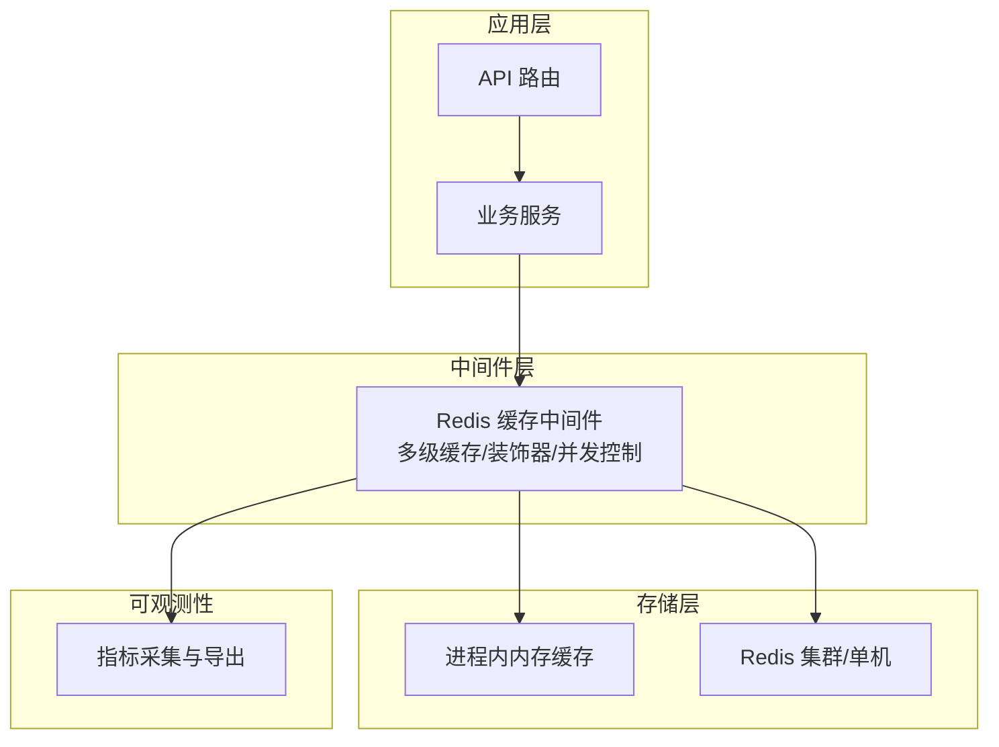
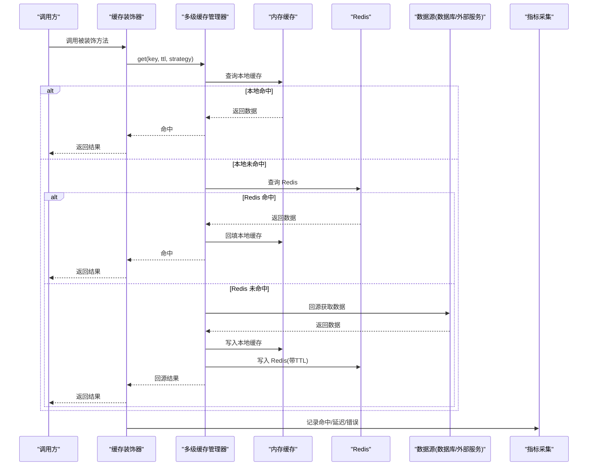
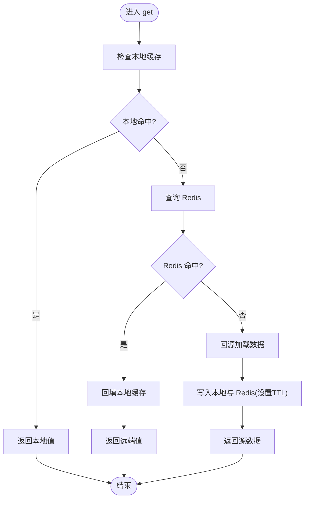
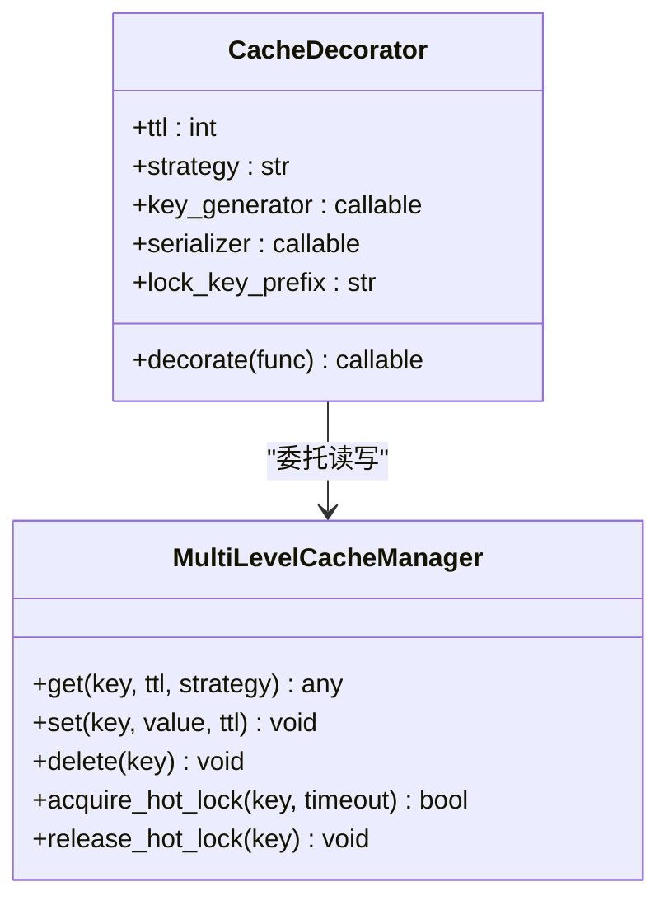
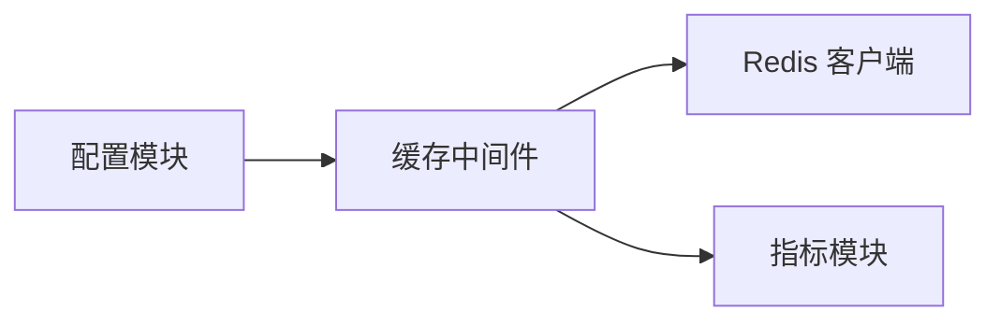

# 缓存中间件

<cite>
**本文引用的文件**   
- [redis_cache.py](file://backend_design/nexus/middleware/redis_cache.py)
- [__init__.py](file://backend_design/nexus/middleware/__init__.py)
- [config.py](file://backend_design/nexus/config.py)
- [cockpit_metrics.py](file://backend_design/nexus/observability/cockpit_metrics.py)
- [metrics.py](file://backend_design/nexus/observability/metrics.py)
</cite>

## 目录
1. [简介](#简介)
2. [项目结构](#项目结构)
3. [核心组件](#核心组件)
4. [架构总览](#架构总览)
5. [详细组件分析](#详细组件分析)
6. [依赖分析](#依赖分析)
7. [性能考量](#性能考量)
8. [故障排查指南](#故障排查指南)
9. [结论](#结论)
10. [附录](#附录)

## 简介
本文件为 NexusCockpit 的 Redis 缓存中间件提供系统化文档，重点覆盖多级缓存架构（内存缓存与 Redis 协同）、失效策略（TTL、LRU、LFU）、热点数据保护、缓存装饰器使用方式、键命名规范、序列化策略与并发控制。同时给出穿透、雪崩、击穿的防护方案与一致性保障机制，并配套性能监控、调试工具与最佳实践建议。

## 项目结构
NexusCockpit 后端采用分层组织，缓存相关能力位于 middleware 层，配置集中于 config，可观测性指标由 observability 模块暴露。

图表来源
- [redis_cache.py:1-200](file://backend_design/nexus/middleware/redis_cache.py#L1-L200)
- [config.py:1-200](file://backend_design/nexus/config.py#L1-L200)
- [cockpit_metrics.py:1-200](file://backend_design/nexus/observability/cockpit_metrics.py#L1-L200)
- [metrics.py:1-200](file://backend_design/nexus/observability/metrics.py#L1-L200)

章节来源
- [redis_cache.py:1-200](file://backend_design/nexus/middleware/redis_cache.py#L1-L200)
- [__init__.py:1-50](file://backend_design/nexus/middleware/__init__.py#L1-L50)
- [config.py:1-200](file://backend_design/nexus/config.py#L1-L200)
- [cockpit_metrics.py:1-200](file://backend_design/nexus/observability/cockpit_metrics.py#L1-L200)
- [metrics.py:1-200](file://backend_design/nexus/observability/metrics.py#L1-L200)

## 核心组件
- 多级缓存管理器：封装本地内存缓存与 Redis 缓存的读写路径，实现两级命中、回源与回填。
- 缓存装饰器：面向函数/方法的声明式缓存注解，支持 TTL、策略选择、键生成、序列化与异常降级。
- 并发控制：针对热点键的防击穿锁与限流，避免缓存击穿导致后端过载。
- 失效策略：TTL 过期、LRU/LFU 淘汰策略在内存层生效；Redis 侧通过过期时间与可选淘汰策略配合。
- 可观测性：命中率、延迟、错误率等指标上报至统一度量系统。

章节来源
- [redis_cache.py:1-200](file://backend_design/nexus/middleware/redis_cache.py#L1-L200)
- [__init__.py:1-50](file://backend_design/nexus/middleware/__init__.py#L1-L50)

## 架构总览
下图展示一次典型读请求的多级缓存流程与关键决策点。

图表来源
- [redis_cache.py:1-200](file://backend_design/nexus/middleware/redis_cache.py#L1-L200)
- [metrics.py:1-200](file://backend_design/nexus/observability/metrics.py#L1-L200)

## 详细组件分析

### 多级缓存管理器
职责
- 统一封装本地与远程缓存访问，屏蔽底层差异。
- 维护两级缓存的一致性：先写本地再写远端，或先写远端再回填本地（根据配置）。
- 管理 TTL 与淘汰策略：本地 LRU/LFU，远端 TTL + 可选淘汰策略。
- 提供并发控制：对热点键加分布式锁或本地互斥，防止缓存击穿。

关键行为
- 读取路径：本地命中优先，否则查 Redis，最后回源并回填两级。
- 写入路径：按策略更新本地与 Redis，必要时删除旧键以保持一致性。
- 失效路径：支持主动失效与被动过期。

图表来源
- [redis_cache.py:1-200](file://backend_design/nexus/middleware/redis_cache.py#L1-L200)

章节来源
- [redis_cache.py:1-200](file://backend_design/nexus/middleware/redis_cache.py#L1-L200)

### 缓存装饰器
功能
- 以注解形式将任意函数/方法纳入缓存体系。
- 支持参数化配置：TTL、策略、键生成器、序列化器、是否允许空值缓存、是否统计指标等。
- 自动处理异常降级：当缓存不可用时，直接走业务逻辑并记录告警。

使用要点
- 键生成：默认基于函数名与入参哈希，可按需自定义以保证唯一性与可读性。
- 序列化：默认 JSON，支持二进制或第三方序列化器，注意跨语言兼容性。
- 并发控制：开启热点键保护时，首次缺失会加锁串行回源，避免击穿。

图表来源
- [redis_cache.py:1-200](file://backend_design/nexus/middleware/redis_cache.py#L1-L200)

章节来源
- [redis_cache.py:1-200](file://backend_design/nexus/middleware/redis_cache.py#L1-L200)

### 失效策略与淘汰
- TTL：所有缓存项均支持过期时间，远端通过 Redis 原生过期，本地在读取时校验过期。
- LRU：本地缓存容量有限时使用最近最少使用淘汰。
- LFU：本地缓存可选择按访问频率淘汰，适合长尾热点场景。
- 远端淘汰：结合 Redis 的 maxmemory-policy 与 key 过期共同作用。

章节来源
- [redis_cache.py:1-200](file://backend_design/nexus/middleware/redis_cache.py#L1-L200)

### 热点数据保护
- 防击穿：对热点键首次缺失时加锁，仅一个线程回源，其余等待后重试命中。
- 防雪崩：随机化 TTL 抖动、批量预热、分级超时与熔断降级。
- 限流：在装饰器层面对高 QPS 热点接口进行快速失败或排队。

章节来源
- [redis_cache.py:1-200](file://backend_design/nexus/middleware/redis_cache.py#L1-L200)

### 缓存键命名规范
建议格式
- 前缀: 模块/领域标识
- 主体: 资源类型与主键
- 维度: 租户、用户、会话、版本等
- 后缀: 哈希或序列号（用于去重）

示例约定
- 领域_资源_主键_维度_v1
- 使用统一的键生成器确保稳定与可读

章节来源
- [redis_cache.py:1-200](file://backend_design/nexus/middleware/redis_cache.py#L1-L200)

### 序列化策略
- 默认 JSON：通用、易读、跨语言友好。
- 二进制：体积更小、速度更快，但需保证两端一致。
- 兼容与迁移：大对象建议分片或压缩，避免网络与内存压力。

章节来源
- [redis_cache.py:1-200](file://backend_design/nexus/middleware/redis_cache.py#L1-L200)

### 并发控制
- 本地互斥：单进程内对热点键加锁，避免重复计算。
- 分布式锁：多实例下通过 Redis 原子操作实现，具备超时与看门狗续期。
- 幂等与重试：回源成功后立即落盘，失败则快速失败并记录指标。

章节来源
- [redis_cache.py:1-200](file://backend_design/nexus/middleware/redis_cache.py#L1-L200)

### 缓存一致性
- 读写分离：读路径优先命中缓存，写路径遵循“先写远端，再删本地”或“先写本地，再写远端”的策略，避免脏读。
- 事件驱动：业务变更发布失效事件，中间件订阅并主动清理相关键。
- 最终一致：对于强一致要求高的场景，建议关闭缓存或缩短 TTL 并加强校验。

章节来源
- [redis_cache.py:1-200](file://backend_design/nexus/middleware/redis_cache.py#L1-L200)

### 可观测性与监控
- 指标维度：命中率、P95/P99 延迟、错误率、回源次数、锁竞争次数。
- 标签维度：键空间、策略、TTL 区间、实例 ID。
- 集成：对接 Prometheus/Grafana 或内部监控系统。

章节来源
- [cockpit_metrics.py:1-200](file://backend_design/nexus/observability/cockpit_metrics.py#L1-L200)
- [metrics.py:1-200](file://backend_design/nexus/observability/metrics.py#L1-L200)

## 依赖分析
- 配置依赖：从配置中心或环境变量加载 Redis 连接、池大小、超时、TLS、键前缀、默认 TTL 等。
- 可观测性依赖：埋点指标上报到 metrics 子系统。
- 中间件装配：在应用启动时注册装饰器与全局管理器。

图表来源
- [config.py:1-200](file://backend_design/nexus/config.py#L1-L200)
- [redis_cache.py:1-200](file://backend_design/nexus/middleware/redis_cache.py#L1-L200)
- [metrics.py:1-200](file://backend_design/nexus/observability/metrics.py#L1-L200)

章节来源
- [config.py:1-200](file://backend_design/nexus/config.py#L1-L200)
- [redis_cache.py:1-200](file://backend_design/nexus/middleware/redis_cache.py#L1-L200)
- [metrics.py:1-200](file://backend_design/nexus/observability/metrics.py#L1-L200)

## 性能考量
- 本地缓存容量与淘汰策略：合理设置容量与 TTL，避免频繁抖动。
- 序列化开销：大对象启用压缩或改用二进制序列化。
- 连接池与超时：调整 Redis 连接池大小与读写超时，避免阻塞。
- 热点键保护：开启锁与限流，降低回源峰值。
- 批量预热：启动阶段预加载高频键，减少冷启动抖动。

[本节为通用指导，不直接分析具体文件]

## 故障排查指南
常见问题
- 命中率低：检查键生成是否唯一、TTL 是否过短、是否存在大量冷数据。
- 延迟升高：关注锁竞争、序列化耗时、网络抖动与连接池耗尽。
- 数据不一致：确认写路径顺序与失效事件是否触发。
- 雪崩风险：检查 TTL 是否集中、是否启用随机抖动与熔断。

定位步骤
- 查看指标：命中率、延迟分布、错误码、回源次数。
- 追踪热点键：统计 Top-K 键的访问频次与 TTL 分布。
- 日志关联：开启装饰器详细日志，记录键、TTL、命中层级与耗时。
- 压测验证：模拟热点与突发流量，观察锁竞争与回源峰值。

章节来源
- [redis_cache.py:1-200](file://backend_design/nexus/middleware/redis_cache.py#L1-L200)
- [cockpit_metrics.py:1-200](file://backend_design/nexus/observability/cockpit_metrics.py#L1-L200)
- [metrics.py:1-200](file://backend_design/nexus/observability/metrics.py#L1-L200)

## 结论
该缓存中间件通过多级缓存、完善的失效策略与并发控制，有效提升了热点数据的读取性能与系统稳定性。配合规范的键命名、序列化策略与可观测性建设，可在复杂业务场景中兼顾性能与一致性。建议在生产环境持续监控命中率与延迟，并结合业务特征调优 TTL 与淘汰策略。

[本节为总结，不直接分析具体文件]

## 附录

### 装饰器使用清单
- 必填：被装饰函数、键生成器（或使用默认）
- 推荐：TTL、策略、序列化器、是否开启热点保护
- 可选：键前缀、指标开关、异常降级策略

章节来源
- [redis_cache.py:1-200](file://backend_design/nexus/middleware/redis_cache.py#L1-L200)

### 键命名示例
- user_profile_{userId}_v1
- vehicle_status_{vehicleId}_{tenantId}_v1
- cockpit_dashboard_{dashboardId}_{locale}_v1

章节来源
- [redis_cache.py:1-200](file://backend_design/nexus/middleware/redis_cache.py#L1-L200)

### 监控看板建议
- 命中率趋势（整体与按键空间）
- P95/P99 延迟（按接口）
- 回源次数与错误率
- 锁竞争与超时次数
- 本地/远端命中率对比

章节来源
- [cockpit_metrics.py:1-200](file://backend_design/nexus/observability/cockpit_metrics.py#L1-L200)
- [metrics.py:1-200](file://backend_design/nexus/observability/metrics.py#L1-L200)