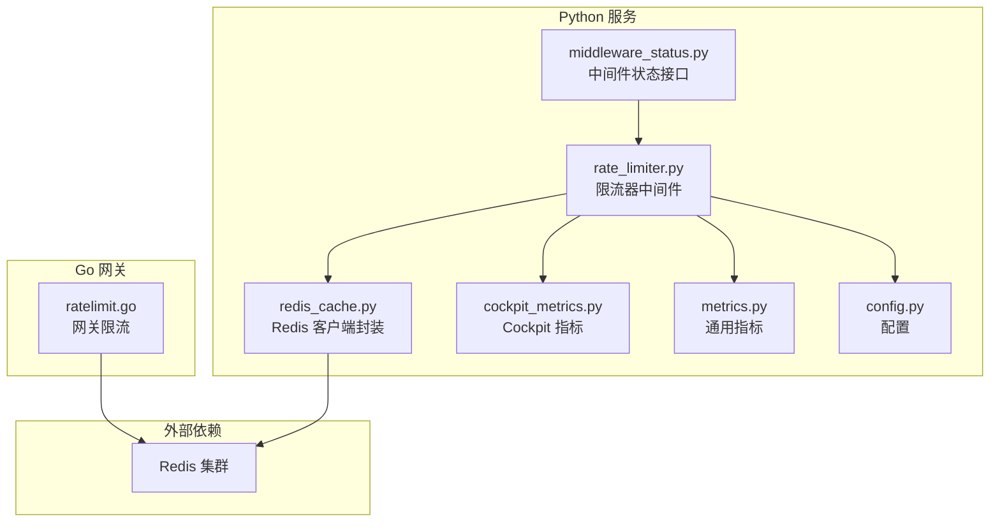
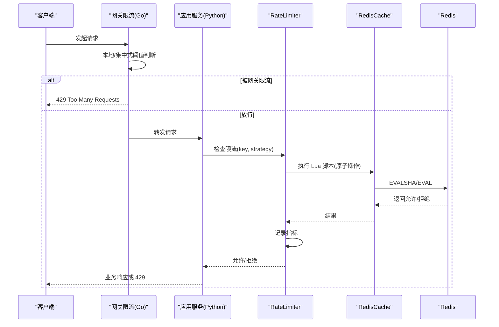
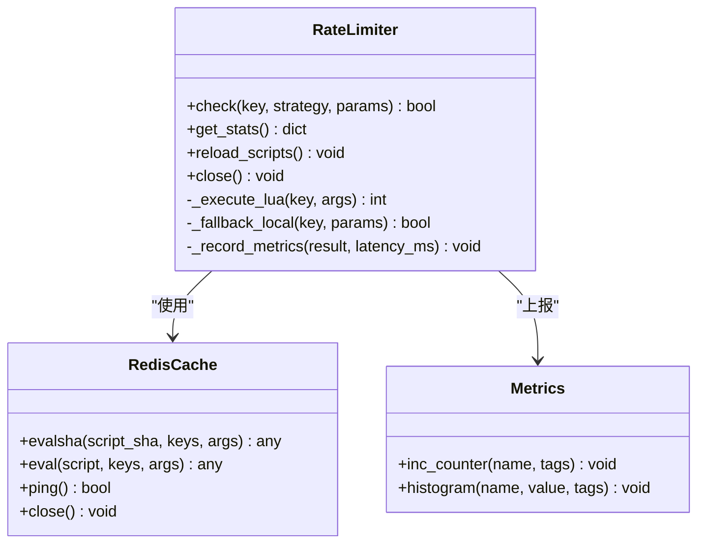
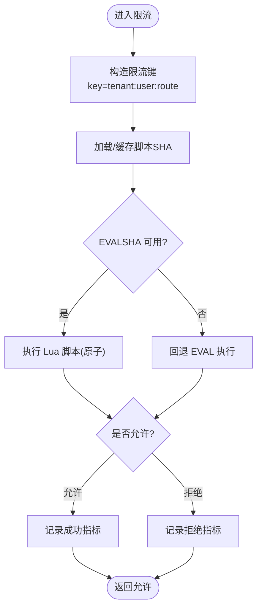
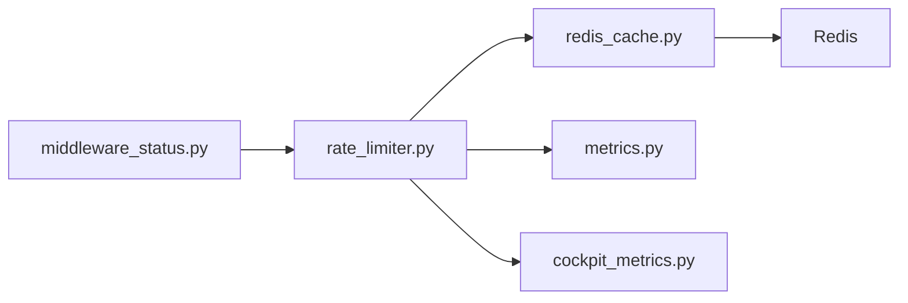

# 限流器中间件

<cite>
**本文引用的文件**   
- [rate_limiter.py](file://backend_design/nexus/middleware/rate_limiter.py)
- [redis_cache.py](file://backend_design/nexus/middleware/redis_cache.py)
- [ratelimit.go](file://backend_design/nexus_gate/internal/ratelimit/ratelimit.go)
- [middleware_status.py](file://backend_design/nexus/api/routes/middleware_status.py)
- [cockpit_metrics.py](file://backend_design/nexus/observability/cockpit_metrics.py)
- [metrics.py](file://backend_design/nexus/observability/metrics.py)
- [config.py](file://backend_design/nexus/config.py)
</cite>

## 目录
1. [简介](#简介)
2. [项目结构](#项目结构)
3. [核心组件](#核心组件)
4. [架构总览](#架构总览)
5. [详细组件分析](#详细组件分析)
6. [依赖关系分析](#依赖关系分析)
7. [性能考虑](#性能考虑)
8. [故障排查指南](#故障排查指南)
9. [结论](#结论)
10. [附录](#附录)

## 简介
本文件为 NexusCockpit 的限流器中间件提供系统化文档，重点覆盖基于 Redis 的分布式限流实现、原子性滑动窗口算法与 Lua 脚本优化、令牌桶与滑动窗口两种策略、RateLimiter 类的设计模式（连接管理、脚本预加载 EVALSHA、降级与错误处理）、配置参数、性能调优、监控指标与故障排查，并给出使用示例与集成方式。

## 项目结构
限流相关代码主要分布在以下位置：
- Python 后端中间件：backend_design/nexus/middleware/rate_limiter.py、backend_design/nexus/middleware/redis_cache.py
- Go 网关侧限流：backend_design/nexus_gate/internal/ratelimit/ratelimit.go
- 中间件状态接口：backend_design/nexus/api/routes/middleware_status.py
- 可观测性与指标：backend_design/nexus/observability/cockpit_metrics.py、backend_design/nexus/observability/metrics.py
- 配置入口：backend_design/nexus/config.py

图表来源
- [rate_limiter.py](file://backend_design/nexus/middleware/rate_limiter.py)
- [redis_cache.py](file://backend_design/nexus/middleware/redis_cache.py)
- [ratelimit.go](file://backend_design/nexus_gate/internal/ratelimit/ratelimit.go)
- [middleware_status.py](file://backend_design/nexus/api/routes/middleware_status.py)
- [cockpit_metrics.py](file://backend_design/nexus/observability/cockpit_metrics.py)
- [metrics.py](file://backend_design/nexus/observability/metrics.py)
- [config.py](file://backend_design/nexus/config.py)

章节来源
- [rate_limiter.py](file://backend_design/nexus/middleware/rate_limiter.py)
- [redis_cache.py](file://backend_design/nexus/middleware/redis_cache.py)
- [ratelimit.go](file://backend_design/nexus_gate/internal/ratelimit/ratelimit.go)
- [middleware_status.py](file://backend_design/nexus/api/routes/middleware_status.py)
- [cockpit_metrics.py](file://backend_design/nexus/observability/cockpit_metrics.py)
- [metrics.py](file://backend_design/nexus/observability/metrics.py)
- [config.py](file://backend_design/nexus/config.py)

## 核心组件
- RateLimiter（Python）：提供统一的限流能力，支持令牌桶与滑动窗口两种策略；负责 Redis 连接管理、Lua 脚本预加载与执行、指标上报、降级与异常处理。
- RedisCache（Python）：对 Redis 客户端进行封装，统一连接池、重试与错误处理，供限流器调用。
- 网关限流（Go）：在网关层提供轻量级限流，作为第一道防线，减少进入后端的流量压力。
- 中间件状态接口：暴露限流器运行状态与统计信息，便于运维查看。
- 指标体系：将限流结果、延迟、失败等关键指标输出到监控系统。

章节来源
- [rate_limiter.py](file://backend_design/nexus/middleware/rate_limiter.py)
- [redis_cache.py](file://backend_design/nexus/middleware/redis_cache.py)
- [ratelimit.go](file://backend_design/nexus_gate/internal/ratelimit/ratelimit.go)
- [middleware_status.py](file://backend_design/nexus/api/routes/middleware_status.py)
- [cockpit_metrics.py](file://backend_design/nexus/observability/cockpit_metrics.py)
- [metrics.py](file://backend_design/nexus/observability/metrics.py)

## 架构总览
整体采用“网关 + 应用”双层限流架构：
- 网关层（Go）：快速拒绝超阈请求，降低后端负载。
- 应用层（Python）：基于 Redis 的分布式限流，支持细粒度键空间与多策略。
- 可观测性：通过指标与状态接口对外暴露运行态数据。

图表来源
- [ratelimit.go](file://backend_design/nexus_gate/internal/ratelimit/ratelimit.go)
- [rate_limiter.py](file://backend_design/nexus/middleware/rate_limiter.py)
- [redis_cache.py](file://backend_design/nexus/middleware/redis_cache.py)

## 详细组件分析

### RateLimiter 类设计
- 设计要点
  - 策略抽象：令牌桶与滑动窗口两种策略，通过策略选择器统一接入。
  - 原子性保证：所有计数与时间窗更新均在 Redis 中通过 Lua 脚本完成，避免竞态条件。
  - 脚本预加载：启动时 SCRIPT LOAD 脚本，运行时优先 EVALSHA，失败回退 EVAL，减少网络开销。
  - 连接管理：基于 RedisCache 的连接池与生命周期管理，支持重连与优雅关闭。
  - 降级策略：当 Redis 不可用时，按配置切换为本地内存限流或直接放行，保障可用性。
  - 错误处理：区分网络错误、脚本执行错误、超时等，记录日志并上报指标。
  - 指标上报：成功/拒绝次数、延迟分位、脚本回退次数、降级触发次数等。

图表来源
- [rate_limiter.py](file://backend_design/nexus/middleware/rate_limiter.py)
- [redis_cache.py](file://backend_design/nexus/middleware/redis_cache.py)
- [metrics.py](file://backend_design/nexus/observability/metrics.py)

章节来源
- [rate_limiter.py](file://backend_design/nexus/middleware/rate_limiter.py)
- [redis_cache.py](file://backend_design/nexus/middleware/redis_cache.py)
- [metrics.py](file://backend_design/nexus/observability/metrics.py)

### 原子性滑动窗口算法与 Lua 脚本优化
- 滑动窗口实现思路
  - 以固定大小的时间片划分窗口，维护每个时间片的计数。
  - 查询时计算当前窗口及相邻历史窗口，累加得到滑动窗口内的总量，并与阈值比较。
  - 写入时使用 ZSET 或 INCR 组合，确保原子性。
- Lua 脚本优化
  - 将“读取-计算-写入”合并为单条 Lua 脚本，由 Redis 原子执行，避免并发竞争。
  - 启动阶段 SCRIPT LOAD 脚本，获取 SHA；运行时 EVALSHA 执行，失败则回退 EVAL。
  - 通过最小化 KEYS 和 ARGV 数量，降低序列化与传输成本。
- 复杂度与一致性
  - 时间复杂度近似 O(1)~O(k)，k 为窗口片段数，通常较小。
  - 强一致：同一 key 的多次请求在 Redis 串行化执行，保证全局计数准确。

图表来源
- [rate_limiter.py](file://backend_design/nexus/middleware/rate_limiter.py)
- [redis_cache.py](file://backend_design/nexus/middleware/redis_cache.py)

章节来源
- [rate_limiter.py](file://backend_design/nexus/middleware/rate_limiter.py)
- [redis_cache.py](file://backend_design/nexus/middleware/redis_cache.py)

### 令牌桶策略
- 核心思想
  - 以固定速率向桶中添加令牌，每次请求消耗一个或多个令牌。
  - 若桶中令牌不足则拒绝，达到平滑突发流量的效果。
- 实现要点
  - 使用 Redis 存储桶剩余令牌与上次更新时间戳。
  - 通过 Lua 脚本原子计算补充令牌与扣减逻辑，避免时钟漂移问题。
  - 支持每桶容量、填充速率、初始令牌等参数。
- 适用场景
  - 需要稳定吞吐、抑制突发的场景，如 LLM 调用、TTS 合成等。

章节来源
- [rate_limiter.py](file://backend_design/nexus/middleware/rate_limiter.py)

### 滑动窗口策略
- 核心思想
  - 将时间轴切分为多个小窗口，统计最近 N 个窗口的累计请求量。
  - 超过阈值即拒绝，适合精确控制单位时间内的最大请求数。
- 实现要点
  - 使用有序集合或计数器数组维护各窗口计数。
  - 通过 Lua 脚本一次性完成窗口滚动、计数累加与阈值判定。
- 适用场景
  - 严格限制 QPS 的场景，如 API 配额、租户级配额。

章节来源
- [rate_limiter.py](file://backend_design/nexus/middleware/rate_limiter.py)

### 连接管理与脚本预加载
- 连接管理
  - 初始化时创建连接池，设置最大连接数、超时、重试次数。
  - 健康检查：周期性 PING，异常时触发重连或降级。
- 脚本预加载
  - 启动时执行 SCRIPT LOAD 并缓存 SHA；运行时优先 EVALSHA。
  - 若 EVALSHA 失败（脚本未加载），自动回退 EVAL 并重新 LOAD。
- 优雅关闭
  - 停止接收新请求，等待正在执行的 Lua 脚本完成后释放连接。

章节来源
- [rate_limiter.py](file://backend_design/nexus/middleware/rate_limiter.py)
- [redis_cache.py](file://backend_design/nexus/middleware/redis_cache.py)

### 降级策略与错误处理
- 降级路径
  - Redis 不可用：切换到本地内存限流（进程内计数），或根据配置直接放行。
  - 脚本执行失败：回退 EVAL 并重试一次，仍失败则走降级。
- 错误分类
  - 网络错误、超时、脚本语法错误、键空间冲突等，分别记录不同指标与日志。
- 恢复机制
  - 指数退避重试，定期探测 Redis 可用性，恢复后自动切回主路径。

章节来源
- [rate_limiter.py](file://backend_design/nexus/middleware/rate_limiter.py)

### 监控指标与状态接口
- 指标项
  - 限流结果：允许/拒绝计数、拒绝率。
  - 性能：限流耗时分布（P50/P95/P99）。
  - 稳定性：脚本回退次数、降级触发次数、连接错误次数。
- 状态接口
  - 提供限流器运行状态、策略配置摘要、近期统计快照。
- 可视化
  - 指标可通过 Prometheus/Grafana 展示，结合 Cockpit 仪表盘观察趋势。

章节来源
- [cockpit_metrics.py](file://backend_design/nexus/observability/cockpit_metrics.py)
- [metrics.py](file://backend_design/nexus/observability/metrics.py)
- [middleware_status.py](file://backend_design/nexus/api/routes/middleware_status.py)

## 依赖关系分析
- 模块耦合
  - RateLimiter 依赖 RedisCache 与 Metrics，职责清晰，内聚度高。
  - middleware_status 仅依赖 RateLimiter 的只读接口，低耦合。
- 外部依赖
  - Redis：限流状态存储与原子执行环境。
  - 监控系统：指标采集与告警。
- 潜在循环依赖
  - 当前无循环依赖迹象，建议保持 RateLimiter 不反向依赖上层路由。

图表来源
- [rate_limiter.py](file://backend_design/nexus/middleware/rate_limiter.py)
- [redis_cache.py](file://backend_design/nexus/middleware/redis_cache.py)
- [metrics.py](file://backend_design/nexus/observability/metrics.py)
- [cockpit_metrics.py](file://backend_design/nexus/observability/cockpit_metrics.py)
- [middleware_status.py](file://backend_design/nexus/api/routes/middleware_status.py)

章节来源
- [rate_limiter.py](file://backend_design/nexus/middleware/rate_limiter.py)
- [redis_cache.py](file://backend_design/nexus/middleware/redis_cache.py)
- [metrics.py](file://backend_design/nexus/observability/metrics.py)
- [cockpit_metrics.py](file://backend_design/nexus/observability/cockpit_metrics.py)
- [middleware_status.py](file://backend_design/nexus/api/routes/middleware_status.py)

## 性能考虑
- 网络与序列化
  - 优先 EVALSHA，减少脚本体积传输；压缩 KEYS/ARGV 列表。
- 键空间设计
  - 合理拆分 key（租户/用户/路由），避免热点键导致单节点瓶颈。
- 窗口大小与片段数
  - 滑动窗口片段数不宜过大，平衡精度与内存占用。
- 令牌桶参数
  - 桶容量与填充速率需与上游网关限流协同，避免过度抖动。
- 连接池与超时
  - 调整连接池大小与读写超时，匹配 Redis 集群规模与 QPS。
- 降级开关
  - 在高可用模式下，开启本地降级以降低 Redis 单点风险。

[本节为通用指导，无需源码引用]

## 故障排查指南
- 常见问题
  - Redis 连接失败：检查网络连通性、认证信息与 ACL 权限。
  - 脚本未加载：确认启动阶段 SCRIPT LOAD 成功，必要时手动加载。
  - 高延迟：评估 Redis 集群负载、网络 RTT、Lua 脚本复杂度。
  - 误拒绝：核对 key 维度与阈值配置，检查是否存在共享键冲突。
- 定位步骤
  - 查看中间件状态接口，确认策略与统计。
  - 检查指标面板中的拒绝率与延迟分位。
  - 抓取 Redis 慢查询与命令统计，定位热点键。
- 恢复措施
  - 临时放宽阈值或切换降级策略，保障业务可用性。
  - 扩容 Redis 实例或增加副本，提升吞吐与容灾能力。

章节来源
- [middleware_status.py](file://backend_design/nexus/api/routes/middleware_status.py)
- [cockpit_metrics.py](file://backend_design/nexus/observability/cockpit_metrics.py)
- [metrics.py](file://backend_design/nexus/observability/metrics.py)

## 结论
NexusCockpit 的限流器中间件通过 Redis 原子操作与 Lua 脚本实现了高性能、强一致的分布式限流，支持令牌桶与滑动窗口双策略，具备完善的连接管理、脚本预加载、降级与错误处理能力。配合网关层限流与完善的监控指标，可在复杂生产环境中提供稳定可靠的流量治理方案。

[本节为总结，无需源码引用]

## 附录

### 配置参数说明
- 通用
  - redis_host / redis_port / redis_password：Redis 连接信息。
  - redis_max_connections：连接池上限。
  - redis_timeout_ms：读写超时。
- 限流策略
  - strategy：token_bucket 或 sliding_window。
  - window_seconds：滑动窗口时长。
  - window_buckets：窗口片段数。
  - rate：令牌桶填充速率。
  - capacity：令牌桶容量。
  - max_requests：滑动窗口阈值。
- 降级与回退
  - fallback_enabled：是否启用降级。
  - fallback_mode：local 或 allow_all。
  - eval_fallback：脚本回退开关。
- 键空间
  - key_prefix：键前缀，用于隔离租户/环境。
  - key_dimensions：参与构建 key 的维度（如 tenant、user、route）。

章节来源
- [config.py](file://backend_design/nexus/config.py)

### 使用示例与集成方式
- 在路由层引入限流中间件
  - 为特定路由注册限流器，指定 key 维度与策略参数。
- 动态调整
  - 通过配置中心或状态接口热更新阈值与策略。
- 网关协同
  - 网关层设置粗粒度限流，应用层设置细粒度限流，形成双层防护。

章节来源
- [middleware_status.py](file://backend_design/nexus/api/routes/middleware_status.py)
- [rate_limiter.py](file://backend_design/nexus/middleware/rate_limiter.py)