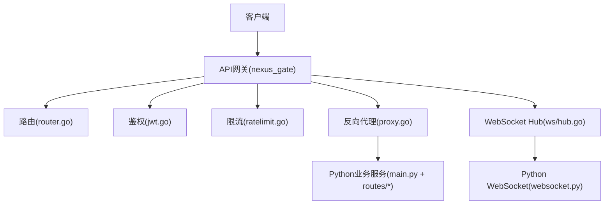
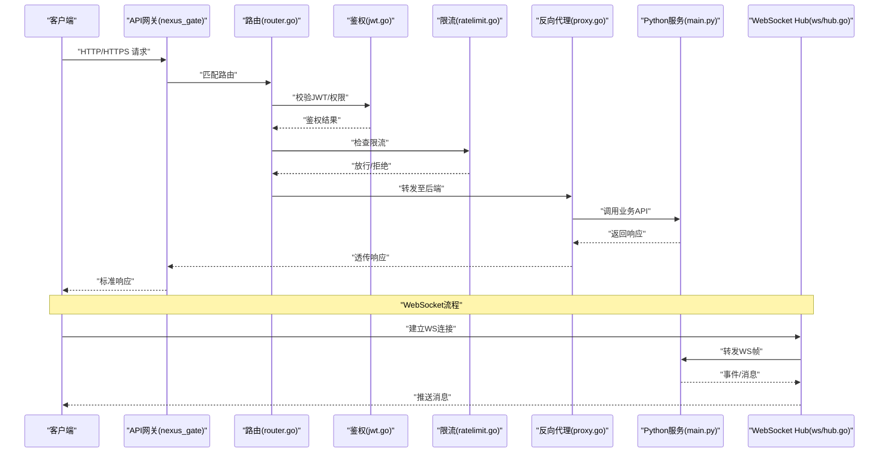
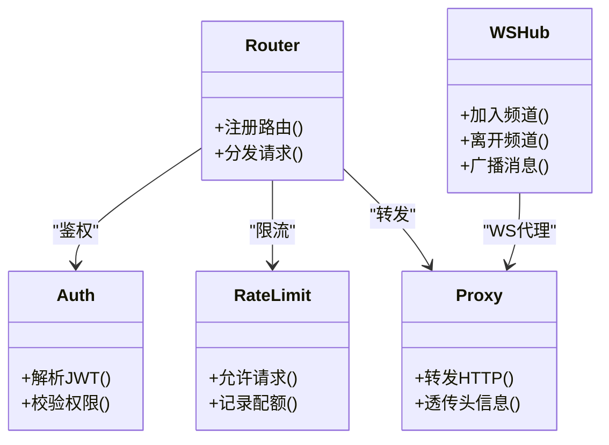
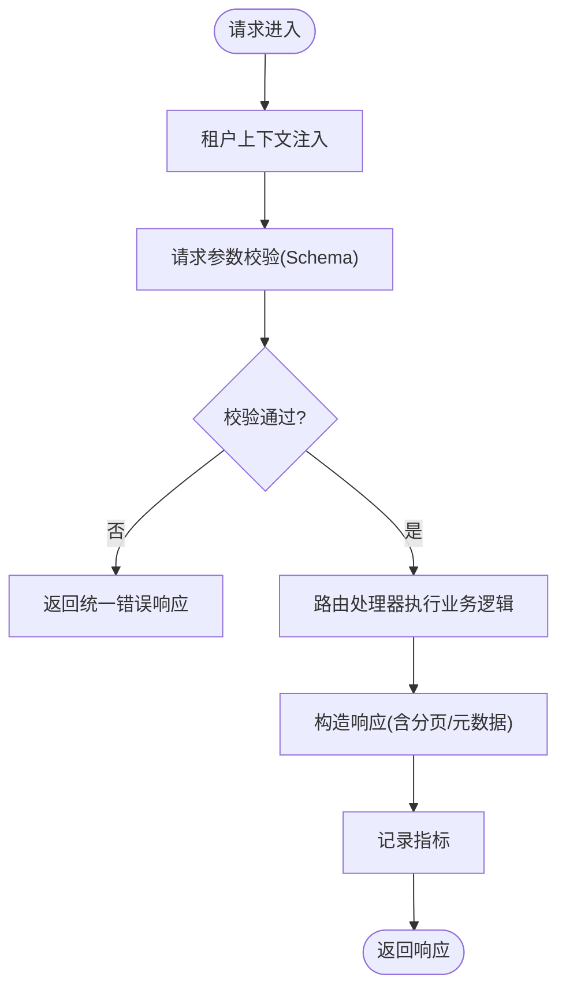
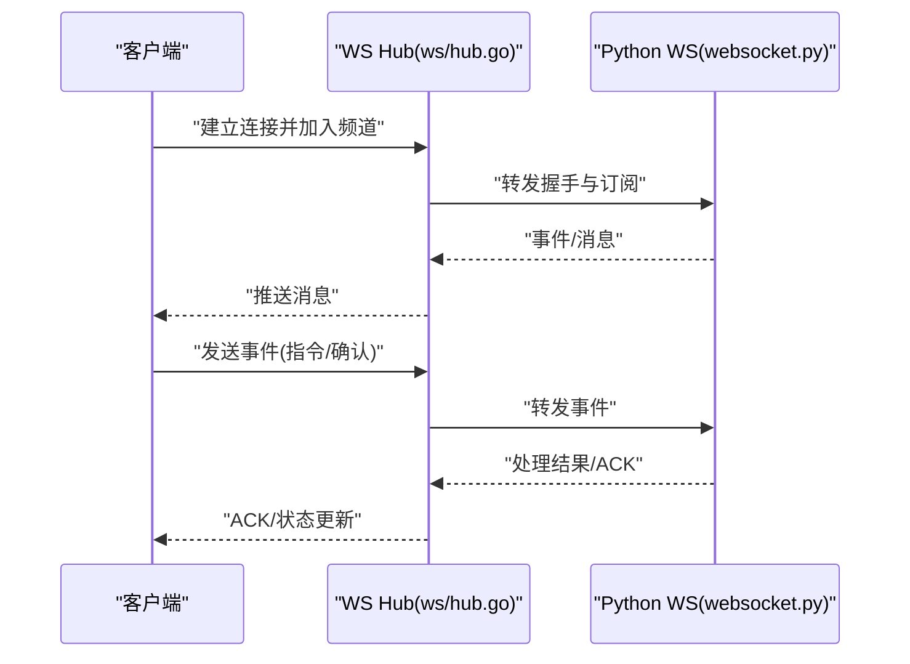
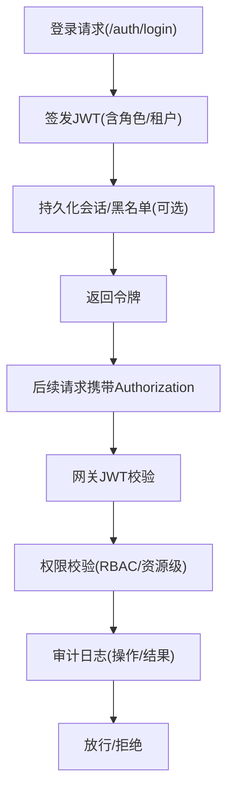
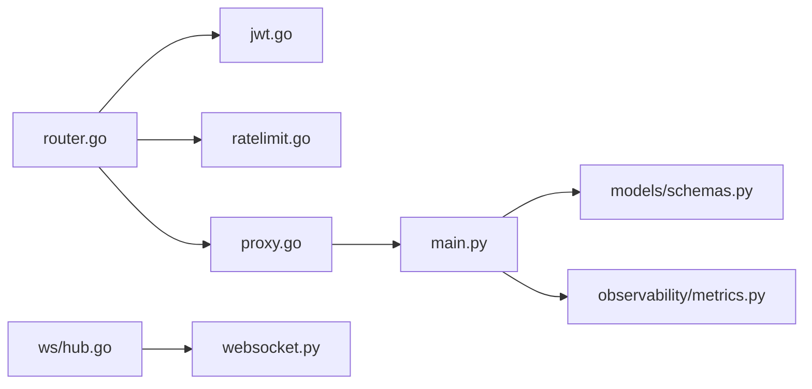

# L6 API层

<cite>
**本文引用的文件**   
- [backend_design/nexus/api/__init__.py](file://backend_design/nexus/api/__init__.py)
- [backend_design/nexus/api/routes/__init__.py](file://backend_design/nexus/api/routes/__init__.py)
- [backend_design/nexus/api/routes/auth.py](file://backend_design/nexus/api/routes/auth.py)
- [backend_design/nexus/api/routes/chat.py](file://backend_design/nexus/api/routes/chat.py)
- [backend_design/nexus/api/routes/chat_sessions.py](file://backend_design/nexus/api/routes/chat_sessions.py)
- [backend_design/nexus/api/routes/cockpit.py](file://backend_design/nexus/api/routes/cockpit.py)
- [backend_design/nexus/api/routes/dataplatform.py](file://backend_design/nexus/api/routes/dataplatform.py)
- [backend_design/nexus/api/routes/health.py](file://backend_design/nexus/api/routes/health.py)
- [backend_design/nexus/api/routes/middleware_status.py](file://backend_design/nexus/api/routes/middleware_status.py)
- [backend_design/nexus/api/routes/settings.py](file://backend_design/nexus/api/routes/settings.py)
- [backend_design/nexus/api/routes/vehicle.py](file://backend_design/nexus/api/routes/vehicle.py)
- [backend_design/nexus/api/websocket.py](file://backend_design/nexus/api/websocket.py)
- [backend_design/nexus/core/auth.py](file://backend_design/nexus/core/auth.py)
- [backend_design/nexus/core/exceptions.py](file://backend_design/nexus/core/exceptions.py)
- [backend_design/nexus/core/logger.py](file://backend_design/nexus/core/logger.py)
- [backend_design/nexus/core/personalization.py](file://backend_design/nexus/core/personalization.py)
- [backend_design/nexus/core/tenant_context.py](file://backend_design/nexus/core/tenant_context.py)
- [backend_design/nexus/models/schemas.py](file://backend_design/nexus/models/schemas.py)
- [backend_design/nexus/middleware/rate_limiter.py](file://backend_design/nexus/middleware/rate_limiter.py)
- [backend_design/nexus/middleware/redis_cache.py](file://backend_design/nexus/middleware/redis_cache.py)
- [backend_design/nexus/middleware/session_store.py](file://backend_design/nexus/middleware/session_store.py)
- [backend_design/nexus/middleware/task_queue.py](file://backend_design/nexus/middleware/task_queue.py)
- [backend_design/nexus/observability/metrics.py](file://backend_design/nexus/observability/metrics.py)
- [backend_design/nexus/observability/cockpit_metrics.py](file://backend_design/nexus/observability/cockpit_metrics.py)
- [backend_design/nexus/main.py](file://backend_design/nexus/main.py)
- [backend_design/nexus_gate/internal/router/router.go](file://backend_design/nexus_gate/internal/router/router.go)
- [backend_design/nexus_gate/internal/handlers/handlers.go](file://backend_design/nexus_gate/internal/handlers/handlers.go)
- [backend_design/nexus_gate/internal/ws/hub.go](file://backend_design/nexus_gate/internal/ws/hub.go)
- [backend_design/nexus_gate/internal/proxy/proxy.go](file://backend_design/nexus_gate/internal/proxy/proxy.go)
- [backend_design/nexus_gate/internal/auth/jwt.go](file://backend_design/nexus_gate/internal/auth/jwt.go)
- [backend_design/nexus_gate/internal/ratelimit/ratelimit.go](file://backend_design/nexus_gate/internal/ratelimit/ratelimit.go)
- [backend_design/nexus_gate/cmd/main.go](file://backend_design/nexus_gate/cmd/main.go)
- [backend_design/nexus_gate/proto/nexus.proto](file://backend_design/nexus_gate/proto/nexus.proto)
- [docs/architecture/L6-api.md](file://docs/architecture/L6-api.md)
</cite>

## 目录
1. [简介](#简介)
2. [项目结构](#项目结构)
3. [核心组件](#核心组件)
4. [架构总览](#架构总览)
5. [详细组件分析](#详细组件分析)
6. [依赖分析](#依赖分析)
7. [性能考虑](#性能考虑)
8. [故障排查指南](#故障排查指南)
9. [结论](#结论)
10. [附录](#附录)

## 简介
本章节面向 NexusCockpit 的 L6 API层，聚焦于API网关与接口设计。内容涵盖：
- RESTful API规范（路由组织、请求响应格式、错误码定义）
- WebSocket实时通信（连接管理、消息协议、事件驱动）
- 认证授权机制（JWT令牌、权限控制、安全审计）
- API版本管理、请求验证、响应转换与性能优化
- API文档生成、测试策略与监控指标
- 客户端集成指南与最佳实践

## 项目结构
L6 API层由两部分组成：
- Go实现的API网关（nexus_gate），负责外部接入、鉴权、限流、转发与WebSocket代理
- Python实现的业务API服务（nexus），提供REST与WebSocket业务能力

图示来源
- [backend_design/nexus_gate/cmd/main.go](file://backend_design/nexus_gate/cmd/main.go)
- [backend_design/nexus_gate/internal/router/router.go](file://backend_design/nexus_gate/internal/router/router.go)
- [backend_design/nexus_gate/internal/auth/jwt.go](file://backend_design/nexus_gate/internal/auth/jwt.go)
- [backend_design/nexus_gate/internal/ratelimit/ratelimit.go](file://backend_design/nexus_gate/internal/ratelimit/ratelimit.go)
- [backend_design/nexus_gate/internal/proxy/proxy.go](file://backend_design/nexus_gate/internal/proxy/proxy.go)
- [backend_design/nexus_gate/internal/ws/hub.go](file://backend_design/nexus_gate/internal/ws/hub.go)
- [backend_design/nexus/main.py](file://backend_design/nexus/main.py)
- [backend_design/nexus/api/websocket.py](file://backend_design/nexus/api/websocket.py)

章节来源
- [docs/architecture/L6-api.md](file://docs/architecture/L6-api.md)
- [backend_design/nexus/main.py](file://backend_design/nexus/main.py)
- [backend_design/nexus_gate/cmd/main.go](file://backend_design/nexus_gate/cmd/main.go)

## 核心组件
- API网关（Go）
  - 入口与生命周期管理
  - 路由分发与路径前缀
  - JWT鉴权与权限校验
  - 限流与熔断保护
  - 反向代理到Python服务
  - WebSocket Hub与消息广播
- Python业务API
  - FastAPI应用初始化与中间件挂载
  - 路由模块按领域划分（auth、chat、cockpit、vehicle等）
  - 统一异常处理与日志
  - 模型与Schema定义
  - 可观测性指标暴露
- 中间件与工具
  - 速率限制、Redis缓存、会话存储、任务队列
  - 租户上下文、个性化配置、语音识别/合成相关辅助

章节来源
- [backend_design/nexus_gate/internal/router/router.go](file://backend_design/nexus_gate/internal/router/router.go)
- [backend_design/nexus_gate/internal/auth/jwt.go](file://backend_design/nexus_gate/internal/auth/jwt.go)
- [backend_design/nexus_gate/internal/ratelimit/ratelimit.go](file://backend_design/nexus_gate/internal/ratelimit/ratelimit.go)
- [backend_design/nexus_gate/internal/proxy/proxy.go](file://backend_design/nexus_gate/internal/proxy/proxy.go)
- [backend_design/nexus_gate/internal/ws/hub.go](file://backend_design/nexus_gate/internal/ws/hub.go)
- [backend_design/nexus/main.py](file://backend_design/nexus/main.py)
- [backend_design/nexus/api/__init__.py](file://backend_design/nexus/api/__init__.py)
- [backend_design/nexus/api/routes/__init__.py](file://backend_design/nexus/api/routes/__init__.py)
- [backend_design/nexus/core/exceptions.py](file://backend_design/nexus/core/exceptions.py)
- [backend_design/nexus/core/logger.py](file://backend_design/nexus/core/logger.py)
- [backend_design/nexus/models/schemas.py](file://backend_design/nexus/models/schemas.py)
- [backend_design/nexus/middleware/rate_limiter.py](file://backend_design/nexus/middleware/rate_limiter.py)
- [backend_design/nexus/middleware/redis_cache.py](file://backend_design/nexus/middleware/redis_cache.py)
- [backend_design/nexus/middleware/session_store.py](file://backend_design/nexus/middleware/session_store.py)
- [backend_design/nexus/middleware/task_queue.py](file://backend_design/nexus/middleware/task_queue.py)
- [backend_design/nexus/observability/metrics.py](file://backend_design/nexus/observability/metrics.py)
- [backend_design/nexus/observability/cockpit_metrics.py](file://backend_design/nexus/observability/cockpit_metrics.py)

## 架构总览
整体采用“网关+微服务”的分层模式：
- 网关层（Go）承担安全、流量治理与协议适配职责
- 业务层（Python）专注领域逻辑与数据访问
- 通过HTTP/JSON与gRPC/Proto进行内部通信
- WebSocket用于实时事件推送与双向交互

图示来源
- [backend_design/nexus_gate/internal/router/router.go](file://backend_design/nexus_gate/internal/router/router.go)
- [backend_design/nexus_gate/internal/auth/jwt.go](file://backend_design/nexus_gate/internal/auth/jwt.go)
- [backend_design/nexus_gate/internal/ratelimit/ratelimit.go](file://backend_design/nexus_gate/internal/ratelimit/ratelimit.go)
- [backend_design/nexus_gate/internal/proxy/proxy.go](file://backend_design/nexus_gate/internal/proxy/proxy.go)
- [backend_design/nexus_gate/internal/ws/hub.go](file://backend_design/nexus_gate/internal/ws/hub.go)
- [backend_design/nexus/main.py](file://backend_design/nexus/main.py)

## 详细组件分析

### API网关（Go）
- 路由与转发
  - 集中式路由表，支持路径前缀与子路由
  - 反向代理将请求转发至Python服务，保持头部与查询参数一致
- 鉴权与安全
  - JWT解析与校验，支持自定义Claim映射
  - 基于角色的访问控制（RBAC）或资源级权限
- 限流与保护
  - 基于IP/用户维度的令牌桶/漏桶算法
  - 全局与路由级限流策略
- WebSocket代理
  - Hub维护连接集合，支持房间/频道广播
  - 与Python侧WS端点桥接，实现事件驱动

图示来源
- [backend_design/nexus_gate/internal/router/router.go](file://backend_design/nexus_gate/internal/router/router.go)
- [backend_design/nexus_gate/internal/auth/jwt.go](file://backend_design/nexus_gate/internal/auth/jwt.go)
- [backend_design/nexus_gate/internal/ratelimit/ratelimit.go](file://backend_design/nexus_gate/internal/ratelimit/ratelimit.go)
- [backend_design/nexus_gate/internal/proxy/proxy.go](file://backend_design/nexus_gate/internal/proxy/proxy.go)
- [backend_design/nexus_gate/internal/ws/hub.go](file://backend_design/nexus_gate/internal/ws/hub.go)

章节来源
- [backend_design/nexus_gate/internal/router/router.go](file://backend_design/nexus_gate/internal/router/router.go)
- [backend_design/nexus_gate/internal/auth/jwt.go](file://backend_design/nexus_gate/internal/auth/jwt.go)
- [backend_design/nexus_gate/internal/ratelimit/ratelimit.go](file://backend_design/nexus_gate/internal/ratelimit/ratelimit.go)
- [backend_design/nexus_gate/internal/proxy/proxy.go](file://backend_design/nexus_gate/internal/proxy/proxy.go)
- [backend_design/nexus_gate/internal/ws/hub.go](file://backend_design/nexus_gate/internal/ws/hub.go)
- [backend_design/nexus_gate/cmd/main.go](file://backend_design/nexus_gate/cmd/main.go)

### Python业务API
- 应用初始化与中间件
  - 启动FastAPI应用，挂载日志、异常、租户上下文、个性化等中间件
  - 统一错误处理器，标准化响应体
- 路由组织
  - 按领域拆分：认证、聊天、座舱、车辆、数据平台、健康检查、中间件状态、设置等
  - 统一前缀与版本化路径（如 /api/v1）
- 模型与Schema
  - 使用Pydantic定义请求/响应结构，保证类型安全与自动校验
- 可观测性
  - 暴露Prometheus指标，记录QPS、延迟、错误率、业务关键指标

图示来源
- [backend_design/nexus/main.py](file://backend_design/nexus/main.py)
- [backend_design/nexus/api/routes/__init__.py](file://backend_design/nexus/api/routes/__init__.py)
- [backend_design/nexus/core/tenant_context.py](file://backend_design/nexus/core/tenant_context.py)
- [backend_design/nexus/core/personalization.py](file://backend_design/nexus/core/personalization.py)
- [backend_design/nexus/models/schemas.py](file://backend_design/nexus/models/schemas.py)
- [backend_design/nexus/observability/metrics.py](file://backend_design/nexus/observability/metrics.py)

章节来源
- [backend_design/nexus/main.py](file://backend_design/nexus/main.py)
- [backend_design/nexus/api/routes/__init__.py](file://backend_design/nexus/api/routes/__init__.py)
- [backend_design/nexus/core/tenant_context.py](file://backend_design/nexus/core/tenant_context.py)
- [backend_design/nexus/core/personalization.py](file://backend_design/nexus/core/personalization.py)
- [backend_design/nexus/models/schemas.py](file://backend_design/nexus/models/schemas.py)
- [backend_design/nexus/observability/metrics.py](file://backend_design/nexus/observability/metrics.py)
- [backend_design/nexus/observability/cockpit_metrics.py](file://backend_design/nexus/observability/cockpit_metrics.py)

### RESTful API规范
- 路由组织
  - 统一前缀：/api/v1
  - 领域分组：/auth、/chat、/chat-sessions、/cockpit、/vehicle、/dataplatform、/settings、/health、/middleware-status
- 请求/响应格式
  - Content-Type: application/json
  - 成功响应包含数据与元信息（分页、时间戳、追踪ID）
  - 失败响应包含错误码、错误消息与可选详情
- 错误码定义
  - 使用HTTP状态码为主，结合业务错误码字段
  - 常见错误：参数校验失败、未授权、资源不存在、系统错误
- 版本管理
  - 路径版本化（/v1、/v2）
  - 兼容策略：向后兼容变更，废弃字段标记与迁移期

章节来源
- [backend_design/nexus/api/routes/auth.py](file://backend_design/nexus/api/routes/auth.py)
- [backend_design/nexus/api/routes/chat.py](file://backend_design/nexus/api/routes/chat.py)
- [backend_design/nexus/api/routes/chat_sessions.py](file://backend_design/nexus/api/routes/chat_sessions.py)
- [backend_design/nexus/api/routes/cockpit.py](file://backend_design/nexus/api/routes/cockpit.py)
- [backend_design/nexus/api/routes/vehicle.py](file://backend_design/nexus/api/routes/vehicle.py)
- [backend_design/nexus/api/routes/dataplatform.py](file://backend_design/nexus/api/routes/dataplatform.py)
- [backend_design/nexus/api/routes/settings.py](file://backend_design/nexus/api/routes/settings.py)
- [backend_design/nexus/api/routes/health.py](file://backend_design/nexus/api/routes/health.py)
- [backend_design/nexus/api/routes/middleware_status.py](file://backend_design/nexus/api/routes/middleware_status.py)
- [backend_design/nexus/core/exceptions.py](file://backend_design/nexus/core/exceptions.py)
- [backend_design/nexus/models/schemas.py](file://backend_design/nexus/models/schemas.py)

### WebSocket实时通信
- 连接管理
  - 客户端通过/ws建立长连接
  - 支持房间/频道订阅与发布
- 消息协议
  - 文本帧承载JSON消息，包含类型、载荷、时间戳与追踪ID
  - 心跳保活与断线重连策略
- 事件驱动
  - 服务端事件（如车辆状态、聊天增量、系统告警）主动推送
  - 客户端事件（如操作指令、确认回执）上行处理

图示来源
- [backend_design/nexus_gate/internal/ws/hub.go](file://backend_design/nexus_gate/internal/ws/hub.go)
- [backend_design/nexus/api/websocket.py](file://backend_design/nexus/api/websocket.py)

章节来源
- [backend_design/nexus/api/websocket.py](file://backend_design/nexus/api/websocket.py)
- [backend_design/nexus_gate/internal/ws/hub.go](file://backend_design/nexus_gate/internal/ws/hub.go)

### 认证授权机制
- JWT令牌
  - 签发与刷新流程，支持过期与黑名单
  - Claim中包含用户标识、角色与租户信息
- 权限控制
  - 网关层校验JWT签名与基本Claim
  - 业务层执行细粒度权限校验（资源/动作）
- 安全审计
  - 记录登录、登出、敏感操作与鉴权失败
  - 关联追踪ID便于问题定位

图示来源
- [backend_design/nexus_gate/internal/auth/jwt.go](file://backend_design/nexus_gate/internal/auth/jwt.go)
- [backend_design/nexus/api/routes/auth.py](file://backend_design/nexus/api/routes/auth.py)
- [backend_design/nexus/core/auth.py](file://backend_design/nexus/core/auth.py)
- [backend_design/nexus/core/logger.py](file://backend_design/nexus/core/logger.py)

章节来源
- [backend_design/nexus_gate/internal/auth/jwt.go](file://backend_design/nexus_gate/internal/auth/jwt.go)
- [backend_design/nexus/api/routes/auth.py](file://backend_design/nexus/api/routes/auth.py)
- [backend_design/nexus/core/auth.py](file://backend_design/nexus/core/auth.py)
- [backend_design/nexus/core/logger.py](file://backend_design/nexus/core/logger.py)

### API版本管理、请求验证、响应转换与性能优化
- 版本管理
  - 路径版本化（/v1、/v2），废弃字段与兼容性矩阵
- 请求验证
  - Schema强制校验，缺失/非法字段快速失败
- 响应转换
  - 统一包装器添加元数据（分页、追踪ID、时间戳）
- 性能优化
  - 网关层：连接复用、超时控制、压缩
  - 业务层：缓存（Redis）、异步任务（队列）、分页与懒加载
  - 可观测性：指标采集与慢请求告警

章节来源
- [backend_design/nexus/middleware/redis_cache.py](file://backend_design/nexus/middleware/redis_cache.py)
- [backend_design/nexus/middleware/task_queue.py](file://backend_design/nexus/middleware/task_queue.py)
- [backend_design/nexus/models/schemas.py](file://backend_design/nexus/models/schemas.py)
- [backend_design/nexus/observability/metrics.py](file://backend_design/nexus/observability/metrics.py)

### API文档生成、测试策略与监控指标
- 文档生成
  - OpenAPI/Swagger自动生成，覆盖所有路由与Schema
- 测试策略
  - 单元测试：Schema与业务函数
  - 集成测试：端到端HTTP/WS用例
  - 压测：网关与业务层并发与吞吐
- 监控指标
  - QPS、延迟分位、错误率、连接数、缓存命中率、队列积压

章节来源
- [backend_design/nexus/observability/metrics.py](file://backend_design/nexus/observability/metrics.py)
- [backend_design/nexus/observability/cockpit_metrics.py](file://backend_design/nexus/observability/cockpit_metrics.py)

### 客户端集成指南与最佳实践
- HTTP客户端
  - 统一基础URL与版本前缀
  - 自动附加Authorization头与重试退避
  - 解析统一响应结构，处理错误码
- WebSocket客户端
  - 连接建立后订阅频道，处理心跳与断线重连
  - 消息序列化/反序列化为强类型对象
- 安全与合规
  - 最小权限原则，定期轮换令牌
  - 敏感操作二次确认与审计留痕

[本节为概念性指导，不直接分析具体文件]

## 依赖分析
- 组件耦合
  - 网关对路由、鉴权、限流、代理与WS Hub存在直接依赖
  - Python服务对中间件（缓存、会话、任务队列）与可观测性模块有依赖
- 外部依赖
  - Redis（缓存与会话）
  - Prometheus（指标）
  - gRPC/Proto（内部通信）

图示来源
- [backend_design/nexus_gate/internal/router/router.go](file://backend_design/nexus_gate/internal/router/router.go)
- [backend_design/nexus_gate/internal/auth/jwt.go](file://backend_design/nexus_gate/internal/auth/jwt.go)
- [backend_design/nexus_gate/internal/ratelimit/ratelimit.go](file://backend_design/nexus_gate/internal/ratelimit/ratelimit.go)
- [backend_design/nexus_gate/internal/proxy/proxy.go](file://backend_design/nexus_gate/internal/proxy/proxy.go)
- [backend_design/nexus/main.py](file://backend_design/nexus/main.py)
- [backend_design/nexus/api/websocket.py](file://backend_design/nexus/api/websocket.py)
- [backend_design/nexus/models/schemas.py](file://backend_design/nexus/models/schemas.py)
- [backend_design/nexus/observability/metrics.py](file://backend_design/nexus/observability/metrics.py)

章节来源
- [backend_design/nexus_gate/proto/nexus.proto](file://backend_design/nexus_gate/proto/nexus.proto)
- [backend_design/nexus/main.py](file://backend_design/nexus/main.py)

## 性能考虑
- 网关层
  - 合理设置超时与并发上限，避免雪崩
  - 启用连接池与HTTP/2
- 业务层
  - 热点数据缓存（Redis），注意一致性
  - 异步任务解耦耗时操作（队列）
  - 分页与字段裁剪减少传输体积
- 可观测性
  - 采集关键指标，设置阈值告警
  - 慢请求采样与链路追踪

[本节为通用性能建议，不直接分析具体文件]

## 故障排查指南
- 常见问题
  - 鉴权失败：检查JWT签名、过期时间与Claim映射
  - 限流触发：查看配额与策略配置
  - WS断连：检查心跳与重连逻辑
- 诊断手段
  - 统一错误响应与审计日志
  - 指标面板与链路追踪
  - 压测复现与瓶颈定位

章节来源
- [backend_design/nexus/core/exceptions.py](file://backend_design/nexus/core/exceptions.py)
- [backend_design/nexus/core/logger.py](file://backend_design/nexus/core/logger.py)
- [backend_design/nexus/observability/metrics.py](file://backend_design/nexus/observability/metrics.py)

## 结论
L6 API层通过Go网关与Python服务的分层协作，实现了高可用、可扩展且安全的接口体系。统一的REST规范、完善的WebSocket事件通道、健壮的鉴权与限流机制，以及全面的可观测性与测试策略，为NexusCockpit提供了稳定的对外服务能力。

[本节为总结性内容，不直接分析具体文件]

## 附录
- 参考文档
  - L6 API层架构说明
- 相关文件清单
  - 网关：router、auth、ratelimit、proxy、ws
  - 业务：routes、core、models、middleware、observability

章节来源
- [docs/architecture/L6-api.md](file://docs/architecture/L6-api.md)