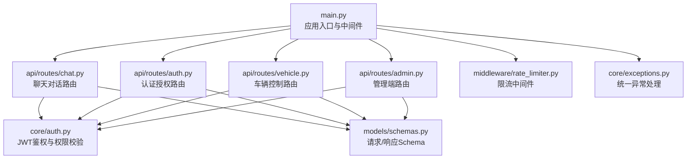
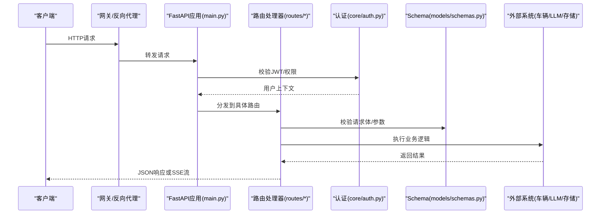
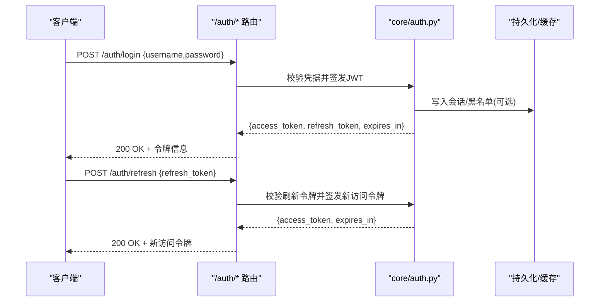
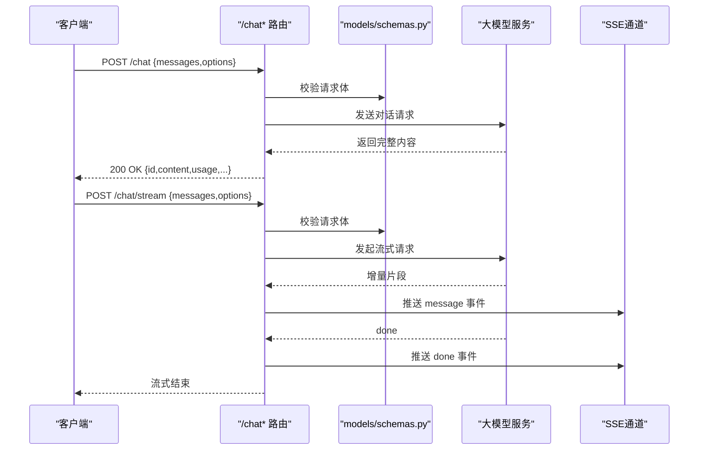
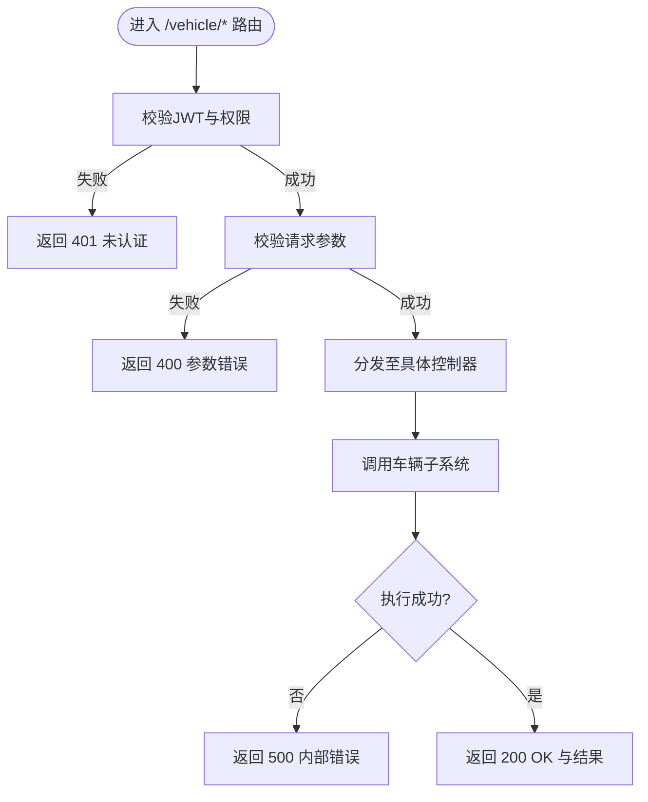
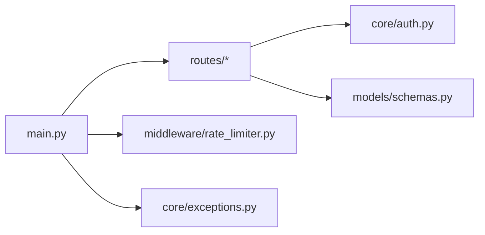

# REST API接口

<cite>
**本文引用的文件**   
- [backend_design/nexus/api/routes/chat.py](file://backend_design/nexus/api/routes/chat.py)
- [backend_design/nexus/api/routes/auth.py](file://backend_design/nexus/api/routes/auth.py)
- [backend_design/nexus/api/routes/vehicle.py](file://backend_design/nexus/api/routes/vehicle.py)
- [backend_design/nexus/api/routes/admin.py](file://backend_design/nexus/api/routes/admin.py)
- [backend_design/nexus/core/auth.py](file://backend_design/nexus/core/auth.py)
- [backend_design/nexus/models/schemas.py](file://backend_design/nexus/models/schemas.py)
- [backend_design/nexus/main.py](file://backend_design/nexus/main.py)
- [backend_design/nexus/middleware/rate_limiter.py](file://backend_design/nexus/middleware/rate_limiter.py)
- [backend_design/nexus/core/exceptions.py](file://backend_design/nexus/core/exceptions.py)
</cite>

## 目录
1. [简介](#简介)
2. [项目结构](#项目结构)
3. [核心组件](#核心组件)
4. [架构总览](#架构总览)
5. [详细组件分析](#详细组件分析)
6. [依赖分析](#依赖分析)
7. [性能考虑](#性能考虑)
8. [故障排查指南](#故障排查指南)
9. [结论](#结论)
10. [附录](#附录)

## 简介
本文件为 NexusCockpit 的 REST API 接口文档，覆盖以下能力：
- 聊天对话API：POST /chat、POST /chat/stream
- 车辆控制API：GET/POST /vehicle/*
- 认证授权API：POST /auth/*
- 管理员API：/admin/*（按路由注册）

文档包含HTTP方法、URL模式、请求与响应Schema、状态码定义、错误处理机制、JWT令牌认证流程、请求验证规则、响应格式转换与性能优化策略，并提供完整的调用示例与客户端集成最佳实践。

## 项目结构
后端采用模块化分层设计，REST路由位于 backend_design/nexus/api/routes 下，认证逻辑在 core/auth.py，数据模型与校验Schema在 models/schemas.py，应用入口与中间件挂载在 main.py。

图表来源
- [backend_design/nexus/main.py](file://backend_design/nexus/main.py)
- [backend_design/nexus/api/routes/chat.py](file://backend_design/nexus/api/routes/chat.py)
- [backend_design/nexus/api/routes/auth.py](file://backend_design/nexus/api/routes/auth.py)
- [backend_design/nexus/api/routes/vehicle.py](file://backend_design/nexus/api/routes/vehicle.py)
- [backend_design/nexus/api/routes/admin.py](file://backend_design/nexus/api/routes/admin.py)
- [backend_design/nexus/core/auth.py](file://backend_design/nexus/core/auth.py)
- [backend_design/nexus/models/schemas.py](file://backend_design/nexus/models/schemas.py)
- [backend_design/nexus/middleware/rate_limiter.py](file://backend_design/nexus/middleware/rate_limiter.py)
- [backend_design/nexus/core/exceptions.py](file://backend_design/nexus/core/exceptions.py)

章节来源
- [backend_design/nexus/main.py](file://backend_design/nexus/main.py)
- [backend_design/nexus/api/routes/chat.py](file://backend_design/nexus/api/routes/chat.py)
- [backend_design/nexus/api/routes/auth.py](file://backend_design/nexus/api/routes/auth.py)
- [backend_design/nexus/api/routes/vehicle.py](file://backend_design/nexus/api/routes/vehicle.py)
- [backend_design/nexus/api/routes/admin.py](file://backend_design/nexus/api/routes/admin.py)
- [backend_design/nexus/core/auth.py](file://backend_design/nexus/core/auth.py)
- [backend_design/nexus/models/schemas.py](file://backend_design/nexus/models/schemas.py)
- [backend_design/nexus/middleware/rate_limiter.py](file://backend_design/nexus/middleware/rate_limiter.py)
- [backend_design/nexus/core/exceptions.py](file://backend_design/nexus/core/exceptions.py)

## 核心组件
- 路由层：负责HTTP方法映射、路径参数解析、请求体校验与响应封装。
- 认证层：基于JWT的无状态鉴权，提供登录签发、令牌刷新、权限校验等能力。
- 模型与Schema：使用Pydantic进行请求/响应结构的强类型校验与序列化。
- 中间件：全局限流、统一异常处理、日志与可观测性接入点。

章节来源
- [backend_design/nexus/api/routes/chat.py](file://backend_design/nexus/api/routes/chat.py)
- [backend_design/nexus/api/routes/auth.py](file://backend_design/nexus/api/routes/auth.py)
- [backend_design/nexus/api/routes/vehicle.py](file://backend_design/nexus/api/routes/vehicle.py)
- [backend_design/nexus/api/routes/admin.py](file://backend_design/nexus/api/routes/admin.py)
- [backend_design/nexus/core/auth.py](file://backend_design/nexus/core/auth.py)
- [backend_design/nexus/models/schemas.py](file://backend_design/nexus/models/schemas.py)
- [backend_design/nexus/middleware/rate_limiter.py](file://backend_design/nexus/middleware/rate_limiter.py)
- [backend_design/nexus/core/exceptions.py](file://backend_design/nexus/core/exceptions.py)

## 架构总览
整体调用链路：客户端 -> 网关/反向代理 -> FastAPI应用 -> 路由处理器 -> 业务服务 -> 外部系统（LLM/车辆总线/存储）。

图表来源
- [backend_design/nexus/main.py](file://backend_design/nexus/main.py)
- [backend_design/nexus/api/routes/chat.py](file://backend_design/nexus/api/routes/chat.py)
- [backend_design/nexus/api/routes/auth.py](file://backend_design/nexus/api/routes/auth.py)
- [backend_design/nexus/api/routes/vehicle.py](file://backend_design/nexus/api/routes/vehicle.py)
- [backend_design/nexus/core/auth.py](file://backend_design/nexus/core/auth.py)
- [backend_design/nexus/models/schemas.py](file://backend_design/nexus/models/schemas.py)

## 详细组件分析

### 认证授权API（POST /auth/*）
- 典型端点
  - POST /auth/login：用户名密码登录，返回访问令牌与刷新令牌。
  - POST /auth/refresh：使用刷新令牌换取新的访问令牌。
  - POST /auth/logout：注销当前会话（可选，服务端记录黑名单或清理本地状态）。
- 认证流程
  - 客户端提交凭据，服务端校验后签发JWT访问令牌与刷新令牌。
  - 后续受保护接口需在请求头携带Authorization: Bearer <access_token>。
  - 访问令牌过期时，使用刷新令牌获取新令牌。
- 安全建议
  - 使用HTTPS传输。
  - 合理设置令牌有效期与刷新窗口。
  - 对敏感操作增加二次确认或额外签名。

图表来源
- [backend_design/nexus/api/routes/auth.py](file://backend_design/nexus/api/routes/auth.py)
- [backend_design/nexus/core/auth.py](file://backend_design/nexus/core/auth.py)

章节来源
- [backend_design/nexus/api/routes/auth.py](file://backend_design/nexus/api/routes/auth.py)
- [backend_design/nexus/core/auth.py](file://backend_design/nexus/core/auth.py)

### 聊天对话API（POST /chat、POST /chat/stream）
- 端点说明
  - POST /chat：一次性对话请求，返回完整文本响应。
  - POST /chat/stream：流式对话，服务端通过SSE推送增量片段直至完成。
- 通用请求头
  - Authorization: Bearer <access_token>
  - Content-Type: application/json
- 请求体字段（示例）
  - messages：消息历史数组，每条包含角色与内容。
  - session_id：会话标识（可选），用于关联上下文。
  - options：高级选项（如温度、最大长度、是否启用记忆等，可选）。
- 响应体字段（非流式）
  - id：响应唯一标识。
  - content：完整回复内容。
  - usage：用量统计（token计数等，可选）。
  - metadata：附加元数据（可选）。
- 流式响应（SSE）
  - 事件类型：message（增量片段）、done（完成）、error（错误）。
  - 每个事件包含data字段，客户端需拼接增量以构建最终文本。
- 错误处理
  - 400：请求体校验失败。
  - 401：未认证或令牌无效。
  - 429：触发限流。
  - 500：内部错误。

图表来源
- [backend_design/nexus/api/routes/chat.py](file://backend_design/nexus/api/routes/chat.py)
- [backend_design/nexus/models/schemas.py](file://backend_design/nexus/models/schemas.py)

章节来源
- [backend_design/nexus/api/routes/chat.py](file://backend_design/nexus/api/routes/chat.py)
- [backend_design/nexus/models/schemas.py](file://backend_design/nexus/models/schemas.py)

### 车辆控制API（GET/POST /vehicle/*）
- 端点说明
  - GET /vehicle/status：查询车辆状态（电量、里程、门窗、空调等）。
  - POST /vehicle/climate/set：设置空调目标温度/风量/模式。
  - POST /vehicle/window/control：控制车窗开合。
  - POST /vehicle/seat/adjust：调节座椅位置/加热/通风。
  - POST /vehicle/media/play：媒体播放控制（播放/暂停/切歌）。
  - POST /vehicle/nav/start：导航启动（目的地、路线偏好）。
- 权限与安全
  - 所有车辆控制接口均需Bearer令牌。
  - 建议结合用户角色与车辆绑定关系进行细粒度授权。
- 请求/响应Schema要点
  - 请求体严格校验，缺失必填字段返回400。
  - 响应包含操作结果、状态码、时间戳及可选的错误详情。
- 错误处理
  - 400：参数非法或缺失。
  - 401：未认证。
  - 403：无权限操作该车辆。
  - 404：车辆不存在。
  - 429：触发限流。
  - 500：内部错误或车辆通信失败。

图表来源
- [backend_design/nexus/api/routes/vehicle.py](file://backend_design/nexus/api/routes/vehicle.py)
- [backend_design/nexus/core/auth.py](file://backend_design/nexus/core/auth.py)

章节来源
- [backend_design/nexus/api/routes/vehicle.py](file://backend_design/nexus/api/routes/vehicle.py)
- [backend_design/nexus/core/auth.py](file://backend_design/nexus/core/auth.py)

### 管理员API（/admin/*）
- 常见能力
  - 用户管理：创建/更新/禁用用户、重置密码。
  - 系统配置：查看/修改运行时配置、功能开关。
  - 监控与审计：查看运行指标、访问日志、错误追踪。
- 权限要求
  - 需要管理员角色或更高权限。
  - 建议开启IP白名单与双因素认证（可选）。
- 错误处理
  - 401/403：未认证或无管理员权限。
  - 400：参数校验失败。
  - 404：资源不存在。
  - 429：触发限流。
  - 500：内部错误。

章节来源
- [backend_design/nexus/api/routes/admin.py](file://backend_design/nexus/api/routes/admin.py)
- [backend_design/nexus/core/auth.py](file://backend_design/nexus/core/auth.py)

## 依赖分析
- 路由与认证耦合
  - 各路由模块依赖 core/auth.py 进行JWT校验与权限判断。
- 模型与校验
  - 所有请求/响应均通过 models/schemas.py 中的Pydantic模型进行强类型校验与序列化。
- 中间件
  - main.py 中注册全局中间件，包括限流、异常处理、日志等。

图表来源
- [backend_design/nexus/main.py](file://backend_design/nexus/main.py)
- [backend_design/nexus/api/routes/chat.py](file://backend_design/nexus/api/routes/chat.py)
- [backend_design/nexus/api/routes/auth.py](file://backend_design/nexus/api/routes/auth.py)
- [backend_design/nexus/api/routes/vehicle.py](file://backend_design/nexus/api/routes/vehicle.py)
- [backend_design/nexus/api/routes/admin.py](file://backend_design/nexus/api/routes/admin.py)
- [backend_design/nexus/core/auth.py](file://backend_design/nexus/core/auth.py)
- [backend_design/nexus/models/schemas.py](file://backend_design/nexus/models/schemas.py)
- [backend_design/nexus/middleware/rate_limiter.py](file://backend_design/nexus/middleware/rate_limiter.py)
- [backend_design/nexus/core/exceptions.py](file://backend_design/nexus/core/exceptions.py)

章节来源
- [backend_design/nexus/main.py](file://backend_design/nexus/main.py)
- [backend_design/nexus/api/routes/chat.py](file://backend_design/nexus/api/routes/chat.py)
- [backend_design/nexus/api/routes/auth.py](file://backend_design/nexus/api/routes/auth.py)
- [backend_design/nexus/api/routes/vehicle.py](file://backend_design/nexus/api/routes/vehicle.py)
- [backend_design/nexus/api/routes/admin.py](file://backend_design/nexus/api/routes/admin.py)
- [backend_design/nexus/core/auth.py](file://backend_design/nexus/core/auth.py)
- [backend_design/nexus/models/schemas.py](file://backend_design/nexus/models/schemas.py)
- [backend_design/nexus/middleware/rate_limiter.py](file://backend_design/nexus/middleware/rate_limiter.py)
- [backend_design/nexus/core/exceptions.py](file://backend_design/nexus/core/exceptions.py)

## 性能考虑
- 连接复用与超时
  - 客户端应复用HTTP连接，合理设置超时与重试退避。
- 流式响应
  - 优先使用 /chat/stream 降低首字节延迟，提升用户体验。
- 缓存与幂等
  - 对只读接口（如 /vehicle/status）启用缓存；对写操作实现幂等键避免重复执行。
- 限流与熔断
  - 利用 middleware/rate_limiter.py 限制高频请求；对下游服务引入熔断与降级策略。
- 压缩与分页
  - 启用Gzip压缩；列表接口支持分页与字段裁剪。

[本节为通用指导，不直接分析具体文件]

## 故障排查指南
- 常见问题
  - 401未认证：检查Authorization头是否正确携带Bearer令牌。
  - 400参数错误：核对请求体字段是否符合Schema定义。
  - 429限流：降低请求频率或申请配额提升。
  - 500内部错误：查看服务端日志与异常堆栈。
- 定位步骤
  - 确认网关与后端连通性。
  - 检查JWT签发与校验逻辑。
  - 审查限流策略与阈值。
  - 查看统一异常处理输出。

章节来源
- [backend_design/nexus/core/exceptions.py](file://backend_design/nexus/core/exceptions.py)
- [backend_design/nexus/middleware/rate_limiter.py](file://backend_design/nexus/middleware/rate_limiter.py)

## 结论
NexusCockpit的REST API遵循清晰的模块化设计与严格的Schema校验，结合JWT认证与全局中间件，提供了稳定、可扩展的接口能力。建议在客户端侧做好令牌管理、错误重试与流式处理，以获得更佳的交互体验与系统稳定性。

[本节为总结，不直接分析具体文件]

## 附录

### 统一响应格式
- 成功响应
  - code：业务状态码（例如0表示成功）。
  - data：业务数据。
  - message：提示信息。
  - timestamp：服务器时间戳。
- 错误响应
  - code：错误码。
  - message：人类可读的错误描述。
  - details：可选，结构化错误详情。

章节来源
- [backend_design/nexus/models/schemas.py](file://backend_design/nexus/models/schemas.py)
- [backend_design/nexus/core/exceptions.py](file://backend_design/nexus/core/exceptions.py)

### 客户端集成指南与最佳实践
- 令牌管理
  - 登录后保存access_token与refresh_token。
  - 在请求拦截器自动注入Authorization头。
  - 捕获401时尝试刷新令牌，失败则引导重新登录。
- 流式处理
  - 使用SSE客户端库监听message与done事件。
  - 增量拼接文本，并在done后渲染最终结果。
- 错误与重试
  - 对网络错误与5xx进行指数退避重试。
  - 对400/401/403不进行重试，直接提示用户。
- 安全与合规
  - 仅通过HTTPS访问。
  - 不在前端明文存储敏感信息。
  - 对关键操作增加二次确认。

[本节为通用指导，不直接分析具体文件]