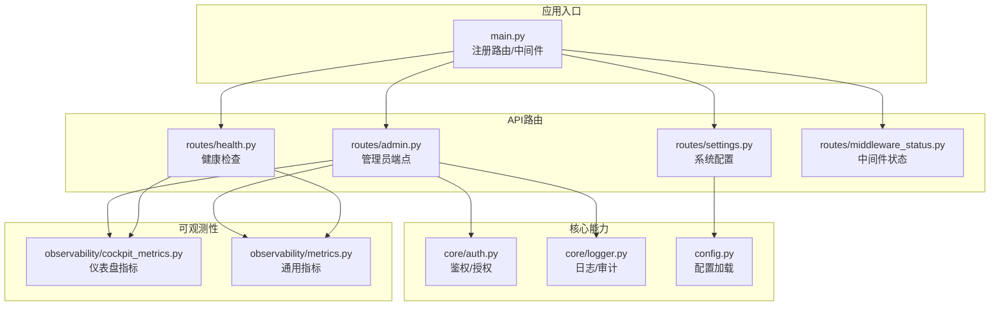
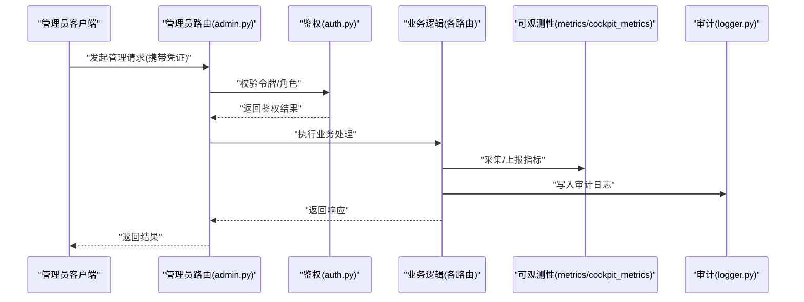
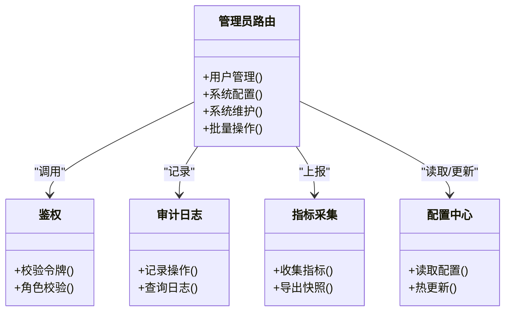

# 管理员API

<cite>
**本文引用的文件**   
- [admin.py](file://backend_design/nexus/api/routes/admin.py)
- [auth.py](file://backend_design/nexus/core/auth.py)
- [health.py](file://backend_design/nexus/api/routes/health.py)
- [settings.py](file://backend_design/nexus/api/routes/settings.py)
- [middleware_status.py](file://backend_design/nexus/api/routes/middleware_status.py)
- [cockpit_metrics.py](file://backend_design/nexus/observability/cockpit_metrics.py)
- [metrics.py](file://backend_design/nexus/observability/metrics.py)
- [logger.py](file://backend_design/nexus/core/logger.py)
- [config.py](file://backend_design/nexus/config.py)
- [main.py](file://backend_design/nexus/main.py)
</cite>

## 目录
1. [简介](#简介)
2. [项目结构](#项目结构)
3. [核心组件](#核心组件)
4. [架构总览](#架构总览)
5. [详细组件分析](#详细组件分析)
6. [依赖分析](#依赖分析)
7. [性能考虑](#性能考虑)
8. [故障排查指南](#故障排查指南)
9. [结论](#结论)
10. [附录](#附录)

## 简介
本文件为 NexusCockpit 的管理员API提供系统化文档，覆盖系统管理相关的REST端点、权限验证、审计日志与数据访问控制机制。内容包含：
- 用户管理与角色控制
- 系统配置读写
- 监控指标查看与导出
- 日志查询与检索
- 系统维护与健康检查
- 批量操作接口
- 安全使用指南与最佳实践

## 项目结构
后端采用模块化路由组织方式，管理员相关能力集中在 routes 层，鉴权与日志等横切关注点在 core 层，可观测性在 observability 层。

图表来源
- [main.py](file://backend_design/nexus/main.py)
- [admin.py](file://backend_design/nexus/api/routes/admin.py)
- [health.py](file://backend_design/nexus/api/routes/health.py)
- [settings.py](file://backend_design/nexus/api/routes/settings.py)
- [middleware_status.py](file://backend_design/nexus/api/routes/middleware_status.py)
- [auth.py](file://backend_design/nexus/core/auth.py)
- [logger.py](file://backend_design/nexus/core/logger.py)
- [config.py](file://backend_design/nexus/config.py)
- [cockpit_metrics.py](file://backend_design/nexus/observability/cockpit_metrics.py)
- [metrics.py](file://backend_design/nexus/observability/metrics.py)

章节来源
- [main.py](file://backend_design/nexus/main.py)
- [admin.py](file://backend_design/nexus/api/routes/admin.py)
- [health.py](file://backend_design/nexus/api/routes/health.py)
- [settings.py](file://backend_design/nexus/api/routes/settings.py)
- [middleware_status.py](file://backend_design/nexus/api/routes/middleware_status.py)
- [auth.py](file://backend_design/nexus/core/auth.py)
- [logger.py](file://backend_design/nexus/core/logger.py)
- [config.py](file://backend_design/nexus/config.py)
- [cockpit_metrics.py](file://backend_design/nexus/observability/cockpit_metrics.py)
- [metrics.py](file://backend_design/nexus/observability/metrics.py)

## 核心组件
- 管理员路由模块：集中实现用户管理、系统配置、监控指标、日志查询与维护类接口。
- 鉴权与授权：基于令牌的角色校验与最小权限原则。
- 审计日志：对关键管理操作进行不可篡改记录。
- 可观测性：统一暴露系统运行指标与仪表盘数据。
- 配置中心：集中读取与热更新系统配置项。

章节来源
- [admin.py](file://backend_design/nexus/api/routes/admin.py)
- [auth.py](file://backend_design/nexus/core/auth.py)
- [logger.py](file://backend_design/nexus/core/logger.py)
- [metrics.py](file://backend_design/nexus/observability/metrics.py)
- [cockpit_metrics.py](file://backend_design/nexus/observability/cockpit_metrics.py)
- [config.py](file://backend_design/nexus/config.py)

## 架构总览
管理员API的请求路径遵循“网关/入口 -> 路由 -> 鉴权 -> 业务逻辑 -> 可观测性/存储”的链路。

图表来源
- [admin.py](file://backend_design/nexus/api/routes/admin.py)
- [auth.py](file://backend_design/nexus/core/auth.py)
- [logger.py](file://backend_design/nexus/core/logger.py)
- [metrics.py](file://backend_design/nexus/observability/metrics.py)
- [cockpit_metrics.py](file://backend_design/nexus/observability/cockpit_metrics.py)

## 详细组件分析

### 管理员路由（用户管理、配置、维护）
- 职责
  - 提供用户CRUD、角色与权限分配、会话管理等接口。
  - 提供系统配置的读取、更新与回滚能力。
  - 提供系统维护操作（如缓存清理、索引重建、任务队列管理）。
  - 提供批量操作接口（批量启用/禁用用户、批量更新配置等）。
- 安全与审计
  - 所有写操作需具备管理员角色；敏感操作强制二次确认或审批流。
  - 每次变更均记录审计日志，包含操作人、时间、资源、变更前后值摘要。
- 典型端点（概念说明）
  - 用户管理：创建/更新/删除/查询用户、重置密码、分配角色。
  - 系统配置：获取配置清单、按命名空间查询、更新配置项、批量导入/导出。
  - 系统维护：清理临时文件、重启服务子进程、刷新缓存、重建索引。
  - 批量操作：批量启停、批量赋权、批量迁移数据。
- 错误处理
  - 参数校验失败返回明确错误码与字段提示。
  - 权限不足返回未授权/禁止访问。
  - 并发冲突采用乐观锁或幂等键避免重复提交。

章节来源
- [admin.py](file://backend_design/nexus/api/routes/admin.py)
- [auth.py](file://backend_design/nexus/core/auth.py)
- [logger.py](file://backend_design/nexus/core/logger.py)

### 鉴权与授权（auth.py）
- 职责
  - 解析并校验访问令牌，提取用户身份与角色。
  - 提供基于角色的访问控制（RBAC）校验。
  - 支持多租户上下文隔离（如需）。
- 设计要点
  - 无状态校验优先，必要时结合缓存提升性能。
  - 细粒度权限点（资源+动作）映射到路由装饰器或中间件。
  - 失败路径快速返回，避免泄露内部信息。

章节来源
- [auth.py](file://backend_design/nexus/core/auth.py)

### 健康检查（health.py）
- 职责
  - 暴露系统健康探针，包括服务存活、依赖可用性（数据库、向量库、消息队列等）。
  - 提供就绪/存活两种探针，便于编排平台调度。
- 输出
  - 健康状态、依赖检查结果、版本信息与启动时间。
- 用途
  - 负载均衡与健康探测、自动扩缩容决策依据。

章节来源
- [health.py](file://backend_design/nexus/api/routes/health.py)

### 系统配置（settings.py）
- 职责
  - 提供配置项的只读与受控写入能力。
  - 支持按命名空间分组、默认值与校验规则。
- 安全
  - 仅管理员可写；敏感字段加密存储；变更需审计。
- 热更新
  - 部分配置支持运行时生效，无需重启。

章节来源
- [settings.py](file://backend_design/nexus/api/routes/settings.py)
- [config.py](file://backend_design/nexus/config.py)

### 中间件状态（middleware_status.py）
- 职责
  - 暴露中间件运行状态（限流、缓存、会话、任务队列等）。
  - 提供开关与阈值调整（受限管理员权限）。
- 用途
  - 运维排障、容量规划与动态调优。

章节来源
- [middleware_status.py](file://backend_design/nexus/api/routes/middleware_status.py)

### 监控指标与导出（metrics.py / cockpit_metrics.py）
- 职责
  - 暴露标准指标（请求量、延迟、错误率、资源使用等）。
  - 提供仪表盘专用指标聚合与快照导出。
- 格式
  - 兼容主流监控系统抓取格式；支持分页与时间窗口过滤。
- 性能
  - 指标采集异步化，避免阻塞主流程；导出时按需采样。

章节来源
- [metrics.py](file://backend_design/nexus/observability/metrics.py)
- [cockpit_metrics.py](file://backend_design/nexus/observability/cockpit_metrics.py)

### 日志与审计（logger.py）
- 职责
  - 结构化日志输出，包含请求ID、用户、耗时、状态码等。
  - 审计日志独立落盘/远端存储，防篡改与可追溯。
- 查询
  - 提供按时间范围、资源、操作类型、用户等维度的检索接口。
- 保留策略
  - 支持按级别与命名空间设置保留周期与轮转策略。

章节来源
- [logger.py](file://backend_design/nexus/core/logger.py)

## 依赖分析
管理员API对核心能力的依赖关系如下：

图表来源
- [admin.py](file://backend_design/nexus/api/routes/admin.py)
- [auth.py](file://backend_design/nexus/core/auth.py)
- [logger.py](file://backend_design/nexus/core/logger.py)
- [metrics.py](file://backend_design/nexus/observability/metrics.py)
- [cockpit_metrics.py](file://backend_design/nexus/observability/cockpit_metrics.py)
- [config.py](file://backend_design/nexus/config.py)

章节来源
- [admin.py](file://backend_design/nexus/api/routes/admin.py)
- [auth.py](file://backend_design/nexus/core/auth.py)
- [logger.py](file://backend_design/nexus/core/logger.py)
- [metrics.py](file://backend_design/nexus/observability/metrics.py)
- [cockpit_metrics.py](file://backend_design/nexus/observability/cockpit_metrics.py)
- [config.py](file://backend_design/nexus/config.py)

## 性能考虑
- 指标采集与日志写入应异步化，避免影响主线程。
- 批量操作建议分片执行，配合幂等键与重试机制。
- 大对象导出（指标/日志）支持分页与压缩传输。
- 配置热更新需保证原子性与一致性，失败自动回滚。

[本节为通用指导，不直接分析具体文件]

## 故障排查指南
- 健康检查异常
  - 检查依赖服务连通性与认证配置。
  - 查看健康探针返回的依赖状态明细。
- 鉴权失败
  - 核对令牌有效期、签名算法与角色映射。
  - 确认路由是否要求管理员角色。
- 指标缺失或延迟高
  - 检查指标采集开关与采样频率。
  - 观察下游存储与网络状况。
- 日志无法查询
  - 确认日志级别与保留策略。
  - 检查查询条件是否过宽导致超时。

章节来源
- [health.py](file://backend_design/nexus/api/routes/health.py)
- [auth.py](file://backend_design/nexus/core/auth.py)
- [metrics.py](file://backend_design/nexus/observability/metrics.py)
- [logger.py](file://backend_design/nexus/core/logger.py)

## 结论
NexusCockpit 的管理员API以清晰的分层与职责划分，提供了完善的安全、可观测性与运维能力。通过统一的鉴权与审计机制，确保管理操作可控可追溯；借助指标与日志体系，支撑高效排障与持续优化。建议在生产环境严格遵循最小权限原则，并对批量与高危操作实施审批与双人复核。

[本节为总结性内容，不直接分析具体文件]

## 附录

### 管理员操作示例（概念步骤）
- 登录并获取管理员令牌
- 查询当前用户角色与权限
- 创建新用户并分配角色
- 更新系统配置项并验证生效
- 导出监控指标快照
- 查询最近的管理操作审计日志
- 执行一次安全的系统维护（如清理缓存）

[本节为概念性示例，不直接分析具体文件]

### 安全使用指南
- 令牌管理
  - 使用短期令牌与刷新机制；禁止硬编码与明文存储。
- 权限控制
  - 仅授予必要的最小权限；定期审查角色与权限映射。
- 审计与合规
  - 开启全量审计；对敏感操作增加二次确认与审批。
- 数据安全
  - 敏感配置加密存储；传输全程TLS；导出文件脱敏。
- 变更管理
  - 配置变更走灰度与回滚流程；重大变更双人复核。

[本节为通用安全建议，不直接分析具体文件]