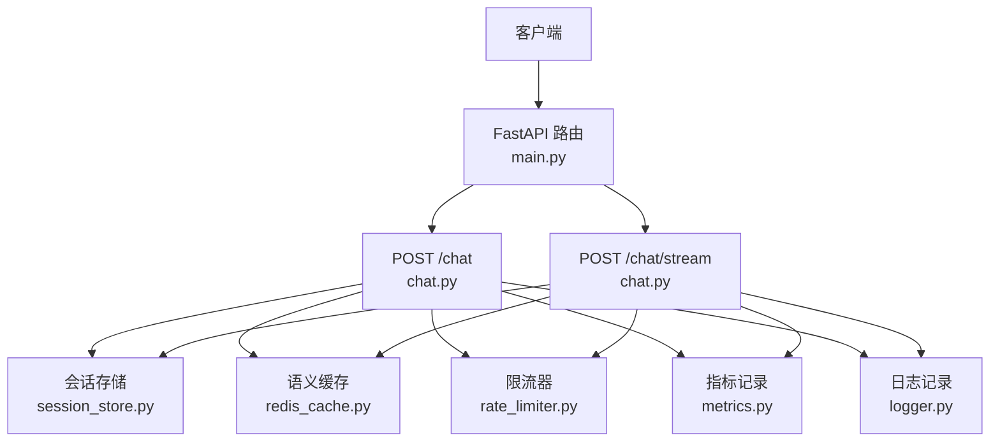
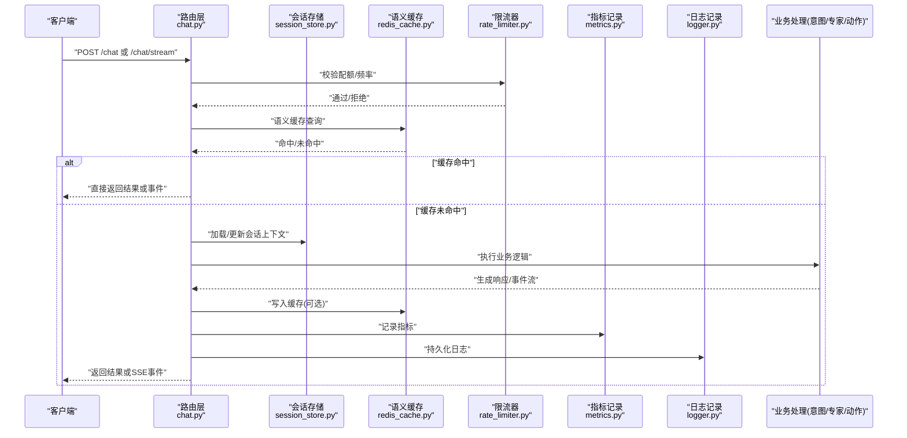
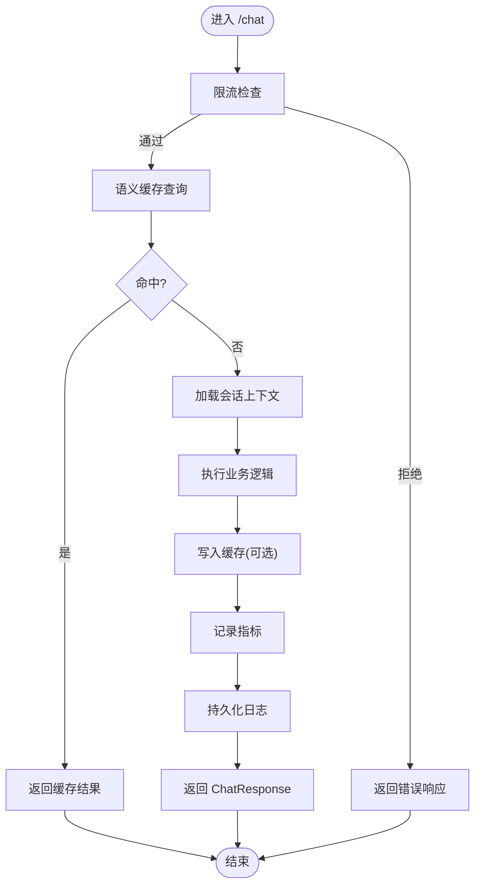
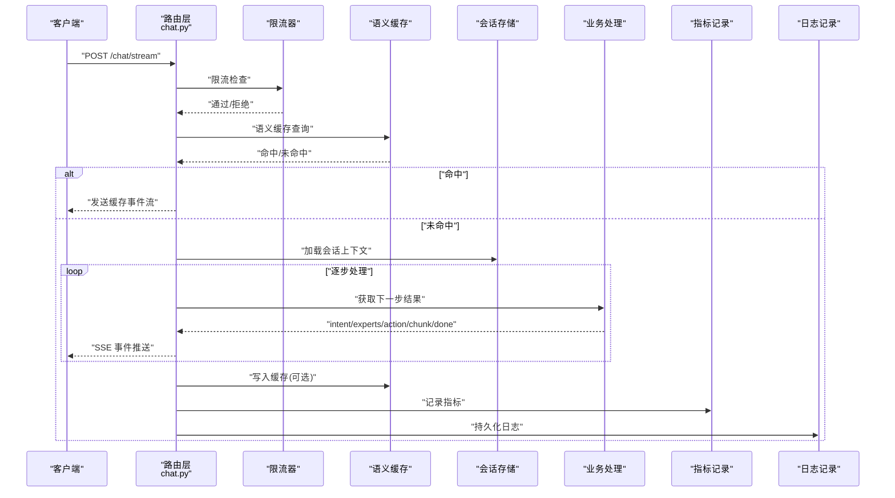
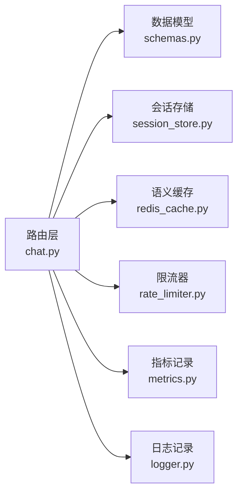

# 聊天对话API

<cite>
**本文引用的文件**   
- [backend_design/nexus/api/routes/chat.py](file://backend_design/nexus/api/routes/chat.py)
- [backend_design/nexus/api/routes/chat_sessions.py](file://backend_design/nexus/api/routes/chat_sessions.py)
- [backend_design/nexus/models/schemas.py](file://backend_design/nexus/models/schemas.py)
- [backend_design/nexus/middleware/session_store.py](file://backend_design/nexus/middleware/session_store.py)
- [backend_design/nexus/middleware/redis_cache.py](file://backend_design/nexus/middleware/redis_cache.py)
- [backend_design/nexus/middleware/rate_limiter.py](file://backend_design/nexus/middleware/rate_limiter.py)
- [backend_design/nexus/observability/metrics.py](file://backend_design/nexus/observability/metrics.py)
- [backend_design/nexus/core/logger.py](file://backend_design/nexus/core/logger.py)
- [backend_design/nexus/core/exceptions.py](file://backend_design/nexus/core/exceptions.py)
- [backend_design/nexus/main.py](file://backend_design/nexus/main.py)
</cite>

## 目录
1. [简介](#简介)
2. [项目结构](#项目结构)
3. [核心组件](#核心组件)
4. [架构总览](#架构总览)
5. [详细组件分析](#详细组件分析)
6. [依赖关系分析](#依赖关系分析)
7. [性能考虑](#性能考虑)
8. [故障排查指南](#故障排查指南)
9. [结论](#结论)
10. [附录](#附录)

## 简介
本文件为 NexusCockpit 的聊天对话 API 提供完整的技术文档，重点覆盖以下两个端点：
- POST /chat：一次性返回完整响应的非流式接口
- POST /chat/stream：基于 SSE（Server-Sent Events）的流式接口，按事件类型逐步推送结果

文档将深入解析请求参数、响应模型、SSE 事件类型、错误处理机制，并说明会话管理、语义缓存、限流控制、指标记录与日志持久化的端到端流程。同时提供调用示例、客户端集成建议与最佳实践。

## 项目结构
与聊天对话 API 相关的后端代码主要位于 backend_design/nexus 目录下，关键路径如下：
- API 路由定义：api/routes/chat.py、api/routes/chat_sessions.py
- 数据模型与 Schema：models/schemas.py
- 中间件：middleware/session_store.py、middleware/redis_cache.py、middleware/rate_limiter.py
- 可观测性与日志：observability/metrics.py、core/logger.py、core/exceptions.py
- 应用入口与挂载：main.py

图表来源
- [backend_design/nexus/main.py](file://backend_design/nexus/main.py)
- [backend_design/nexus/api/routes/chat.py](file://backend_design/nexus/api/routes/chat.py)
- [backend_design/nexus/middleware/session_store.py](file://backend_design/nexus/middleware/session_store.py)
- [backend_design/nexus/middleware/redis_cache.py](file://backend_design/nexus/middleware/redis_cache.py)
- [backend_design/nexus/middleware/rate_limiter.py](file://backend_design/nexus/middleware/rate_limiter.py)
- [backend_design/nexus/observability/metrics.py](file://backend_design/nexus/observability/metrics.py)
- [backend_design/nexus/core/logger.py](file://backend_design/nexus/core/logger.py)

章节来源
- [backend_design/nexus/main.py](file://backend_design/nexus/main.py)
- [backend_design/nexus/api/routes/chat.py](file://backend_design/nexus/api/routes/chat.py)
- [backend_design/nexus/api/routes/chat_sessions.py](file://backend_design/nexus/api/routes/chat_sessions.py)
- [backend_design/nexus/models/schemas.py](file://backend_design/nexus/models/schemas.py)
- [backend_design/nexus/middleware/session_store.py](file://backend_design/nexus/middleware/session_store.py)
- [backend_design/nexus/middleware/redis_cache.py](file://backend_design/nexus/middleware/redis_cache.py)
- [backend_design/nexus/middleware/rate_limiter.py](file://backend_design/nexus/middleware/rate_limiter.py)
- [backend_design/nexus/observability/metrics.py](file://backend_design/nexus/observability/metrics.py)
- [backend_design/nexus/core/logger.py](file://backend_design/nexus/core/logger.py)

## 核心组件
- 路由层
  - POST /chat：接收文本与上下文信息，返回完整的 ChatResponse
  - POST /chat/stream：以 SSE 形式逐步推送事件，包括意图识别、专家选择、动作执行、文本分块与完成信号
- 数据模型
  - ChatRequest：包含 text、user_id、session_id 等字段
  - ChatResponse：统一响应结构，包含消息体、元数据与状态码
- 中间件
  - 会话存储：维护用户会话上下文与历史摘要
  - 语义缓存：对相似查询进行缓存命中，降低 LLM 调用成本
  - 限流器：防止滥用与过载
- 可观测性
  - 指标：QPS、延迟、缓存命中率、错误率等
  - 日志：结构化日志，持久化到外部系统
  - 异常：统一的错误模型与错误码

章节来源
- [backend_design/nexus/api/routes/chat.py](file://backend_design/nexus/api/routes/chat.py)
- [backend_design/nexus/models/schemas.py](file://backend_design/nexus/models/schemas.py)
- [backend_design/nexus/middleware/session_store.py](file://backend_design/nexus/middleware/session_store.py)
- [backend_design/nexus/middleware/redis_cache.py](file://backend_design/nexus/middleware/redis_cache.py)
- [backend_design/nexus/middleware/rate_limiter.py](file://backend_design/nexus/middleware/rate_limiter.py)
- [backend_design/nexus/observability/metrics.py](file://backend_design/nexus/observability/metrics.py)
- [backend_design/nexus/core/logger.py](file://backend_design/nexus/core/logger.py)
- [backend_design/nexus/core/exceptions.py](file://backend_design/nexus/core/exceptions.py)

## 架构总览
下图展示了从客户端发起请求到服务端处理、缓存、限流、指标与日志记录的完整链路。

图表来源
- [backend_design/nexus/api/routes/chat.py](file://backend_design/nexus/api/routes/chat.py)
- [backend_design/nexus/middleware/session_store.py](file://backend_design/nexus/middleware/session_store.py)
- [backend_design/nexus/middleware/redis_cache.py](file://backend_design/nexus/middleware/redis_cache.py)
- [backend_design/nexus/middleware/rate_limiter.py](file://backend_design/nexus/middleware/rate_limiter.py)
- [backend_design/nexus/observability/metrics.py](file://backend_design/nexus/observability/metrics.py)
- [backend_design/nexus/core/logger.py](file://backend_design/nexus/core/logger.py)

## 详细组件分析

### 端点一：POST /chat（非流式）
- 功能概述
  - 接收用户输入与上下文，返回一次性的完整响应
- 请求参数
  - text：用户输入文本
  - user_id：用户标识
  - session_id：会话标识
- 响应格式
  - ChatResponse：包含消息内容、元数据与状态码
- 处理流程
  - 限流检查 → 语义缓存查询 → 会话上下文加载 → 业务处理 → 缓存写入（可选）→ 指标记录 → 日志持久化 → 返回 ChatResponse

图表来源
- [backend_design/nexus/api/routes/chat.py](file://backend_design/nexus/api/routes/chat.py)
- [backend_design/nexus/middleware/rate_limiter.py](file://backend_design/nexus/middleware/rate_limiter.py)
- [backend_design/nexus/middleware/redis_cache.py](file://backend_design/nexus/middleware/redis_cache.py)
- [backend_design/nexus/middleware/session_store.py](file://backend_design/nexus/middleware/session_store.py)
- [backend_design/nexus/observability/metrics.py](file://backend_design/nexus/observability/metrics.py)
- [backend_design/nexus/core/logger.py](file://backend_design/nexus/core/logger.py)

章节来源
- [backend_design/nexus/api/routes/chat.py](file://backend_design/nexus/api/routes/chat.py)
- [backend_design/nexus/models/schemas.py](file://backend_design/nexus/models/schemas.py)
- [backend_design/nexus/middleware/rate_limiter.py](file://backend_design/nexus/middleware/rate_limiter.py)
- [backend_design/nexus/middleware/redis_cache.py](file://backend_design/nexus/middleware/redis_cache.py)
- [backend_design/nexus/middleware/session_store.py](file://backend_design/nexus/middleware/session_store.py)
- [backend_design/nexus/observability/metrics.py](file://backend_design/nexus/observability/metrics.py)
- [backend_design/nexus/core/logger.py](file://backend_design/nexus/core/logger.py)

### 端点二：POST /chat/stream（SSE 流式）
- 功能概述
  - 使用 Server-Sent Events 逐步推送结果，提升交互体验
- 事件类型
  - intent：意图识别结果
  - experts：选中的专家列表
  - action：计划执行的动作
  - chunk：文本分块增量
  - done：流结束标志
- 处理流程
  - 限流检查 → 语义缓存查询 → 会话上下文加载 → 业务处理 → 逐条发送事件 → 缓存写入（可选）→ 指标记录 → 日志持久化 → 关闭连接

图表来源
- [backend_design/nexus/api/routes/chat.py](file://backend_design/nexus/api/routes/chat.py)
- [backend_design/nexus/middleware/rate_limiter.py](file://backend_design/nexus/middleware/rate_limiter.py)
- [backend_design/nexus/middleware/redis_cache.py](file://backend_design/nexus/middleware/redis_cache.py)
- [backend_design/nexus/middleware/session_store.py](file://backend_design/nexus/middleware/session_store.py)
- [backend_design/nexus/observability/metrics.py](file://backend_design/nexus/observability/metrics.py)
- [backend_design/nexus/core/logger.py](file://backend_design/nexus/core/logger.py)

章节来源
- [backend_design/nexus/api/routes/chat.py](file://backend_design/nexus/api/routes/chat.py)
- [backend_design/nexus/models/schemas.py](file://backend_design/nexus/models/schemas.py)
- [backend_design/nexus/middleware/rate_limiter.py](file://backend_design/nexus/middleware/rate_limiter.py)
- [backend_design/nexus/middleware/redis_cache.py](file://backend_design/nexus/middleware/redis_cache.py)
- [backend_design/nexus/middleware/session_store.py](file://backend_design/nexus/middleware/session_store.py)
- [backend_design/nexus/observability/metrics.py](file://backend_design/nexus/observability/metrics.py)
- [backend_design/nexus/core/logger.py](file://backend_design/nexus/core/logger.py)

### 数据模型与响应结构
- ChatRequest
  - text：用户输入文本
  - user_id：用户标识
  - session_id：会话标识
- ChatResponse
  - 包含消息内容、元数据与状态码
- SSE 事件
  - intent：意图识别结果
  - experts：专家选择
  - action：动作执行
  - chunk：文本分块
  - done：完成信号

章节来源
- [backend_design/nexus/models/schemas.py](file://backend_design/nexus/models/schemas.py)
- [backend_design/nexus/api/routes/chat.py](file://backend_design/nexus/api/routes/chat.py)

### 会话管理
- 会话上下文加载与更新
  - 根据 session_id 读取历史与偏好
  - 在每次请求后更新摘要与状态
- 会话生命周期
  - 创建、扩展、清理与过期策略

章节来源
- [backend_design/nexus/middleware/session_store.py](file://backend_design/nexus/middleware/session_store.py)
- [backend_design/nexus/api/routes/chat_sessions.py](file://backend_design/nexus/api/routes/chat_sessions.py)

### 语义缓存
- 缓存键生成
  - 基于 text、user_id、session_id 的规范化哈希
- 命中策略
  - 命中则直接返回结果或事件流
  - 未命中则执行业务逻辑并回填缓存
- 失效与更新
  - 支持 TTL 与主动失效

章节来源
- [backend_design/nexus/middleware/redis_cache.py](file://backend_design/nexus/middleware/redis_cache.py)

### 限流控制
- 令牌桶/滑动窗口实现
  - 基于 user_id 或 IP 维度限制 QPS
- 拒绝策略
  - 返回标准错误码与重试提示

章节来源
- [backend_design/nexus/middleware/rate_limiter.py](file://backend_design/nexus/middleware/rate_limiter.py)

### 指标记录与日志持久化
- 指标
  - 请求量、延迟、缓存命中率、错误率
- 日志
  - 结构化 JSON 日志，包含 trace_id、user_id、session_id、耗时、状态码
- 异常
  - 统一错误模型与错误码映射

章节来源
- [backend_design/nexus/observability/metrics.py](file://backend_design/nexus/observability/metrics.py)
- [backend_design/nexus/core/logger.py](file://backend_design/nexus/core/logger.py)
- [backend_design/nexus/core/exceptions.py](file://backend_design/nexus/core/exceptions.py)

## 依赖关系分析
- 路由层依赖中间件与模型
- 中间件之间相对独立，但共享配置与上下文
- 可观测性模块贯穿各层

图表来源
- [backend_design/nexus/api/routes/chat.py](file://backend_design/nexus/api/routes/chat.py)
- [backend_design/nexus/models/schemas.py](file://backend_design/nexus/models/schemas.py)
- [backend_design/nexus/middleware/session_store.py](file://backend_design/nexus/middleware/session_store.py)
- [backend_design/nexus/middleware/redis_cache.py](file://backend_design/nexus/middleware/redis_cache.py)
- [backend_design/nexus/middleware/rate_limiter.py](file://backend_design/nexus/middleware/rate_limiter.py)
- [backend_design/nexus/observability/metrics.py](file://backend_design/nexus/observability/metrics.py)
- [backend_design/nexus/core/logger.py](file://backend_design/nexus/core/logger.py)

章节来源
- [backend_design/nexus/api/routes/chat.py](file://backend_design/nexus/api/routes/chat.py)
- [backend_design/nexus/models/schemas.py](file://backend_design/nexus/models/schemas.py)
- [backend_design/nexus/middleware/session_store.py](file://backend_design/nexus/middleware/session_store.py)
- [backend_design/nexus/middleware/redis_cache.py](file://backend_design/nexus/middleware/redis_cache.py)
- [backend_design/nexus/middleware/rate_limiter.py](file://backend_design/nexus/middleware/rate_limiter.py)
- [backend_design/nexus/observability/metrics.py](file://backend_design/nexus/observability/metrics.py)
- [backend_design/nexus/core/logger.py](file://backend_design/nexus/core/logger.py)

## 性能考虑
- 优先命中语义缓存，减少 LLM 调用
- 流式输出降低首字节延迟
- 合理设置会话摘要长度与缓存 TTL
- 限流保护峰值流量，避免雪崩
- 指标与日志异步写入，避免阻塞主流程

[本节为通用指导，不直接分析具体文件]

## 故障排查指南
- 常见错误
  - 限流拒绝：检查 user_id/IP 配额与时间窗口
  - 缓存不可用：确认 Redis 连通性与键空间
  - 会话缺失：验证 session_id 是否有效与会话服务可用性
  - 指标/日志失败：检查可观测性后端健康状态
- 定位方法
  - 通过 trace_id 关联请求全链路日志
  - 查看指标面板中的错误率与延迟分布
  - 复现时开启调试日志级别

章节来源
- [backend_design/nexus/core/exceptions.py](file://backend_design/nexus/core/exceptions.py)
- [backend_design/nexus/observability/metrics.py](file://backend_design/nexus/observability/metrics.py)
- [backend_design/nexus/core/logger.py](file://backend_design/nexus/core/logger.py)

## 结论
NexusCockpit 的聊天对话 API 通过清晰的分层设计与完善的中间件体系，实现了高性能、可扩展且可观测的对话能力。非流式与流式两种模式满足不同场景需求，结合语义缓存与会话管理显著提升用户体验与资源利用率。建议在集成时遵循限流与错误处理的最佳实践，并充分利用指标与日志进行运维监控。

[本节为总结性内容，不直接分析具体文件]

## 附录

### API 调用示例
- 非流式请求
  - 方法：POST
  - 路径：/chat
  - 请求体：包含 text、user_id、session_id
  - 响应：ChatResponse
- 流式请求
  - 方法：POST
  - 路径：/chat/stream
  - 请求体：包含 text、user_id、session_id
  - 事件：intent、experts、action、chunk、done

章节来源
- [backend_design/nexus/api/routes/chat.py](file://backend_design/nexus/api/routes/chat.py)
- [backend_design/nexus/models/schemas.py](file://backend_design/nexus/models/schemas.py)

### 客户端集成建议
- 使用 HTTP 客户端库发起请求
- 对于流式接口，建立 SSE 监听器并按事件类型处理
- 实现重试与退避策略，应对限流与网络抖动
- 携带 user_id 与 session_id 以维持上下文一致性

章节来源
- [backend_design/nexus/api/routes/chat.py](file://backend_design/nexus/api/routes/chat.py)

### 最佳实践
- 合理设计会话 ID 与用户 ID 的绑定关系
- 对高频重复问题启用语义缓存
- 为流式输出设置超时与取消机制
- 持续监控指标并优化阈值

[本节为通用指导，不直接分析具体文件]