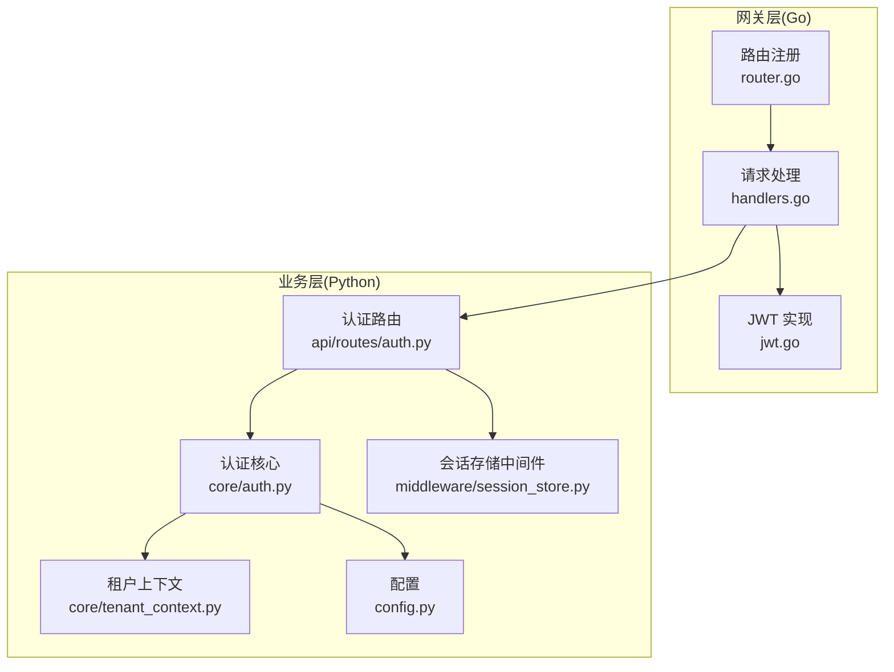
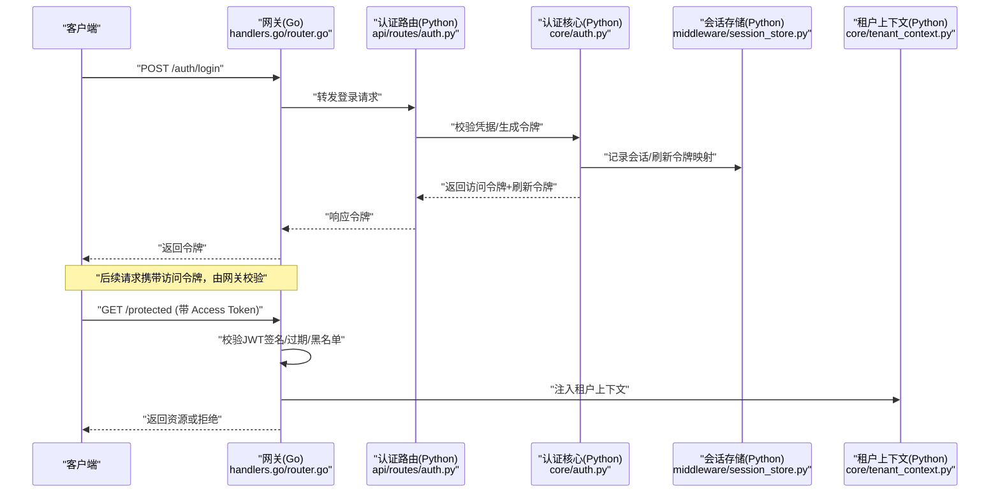
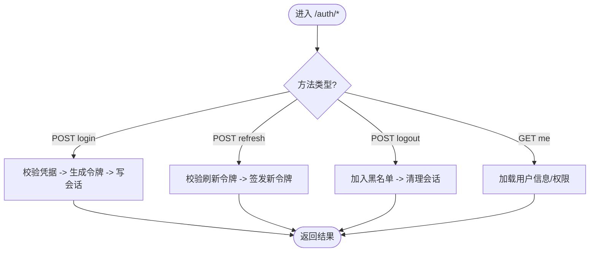
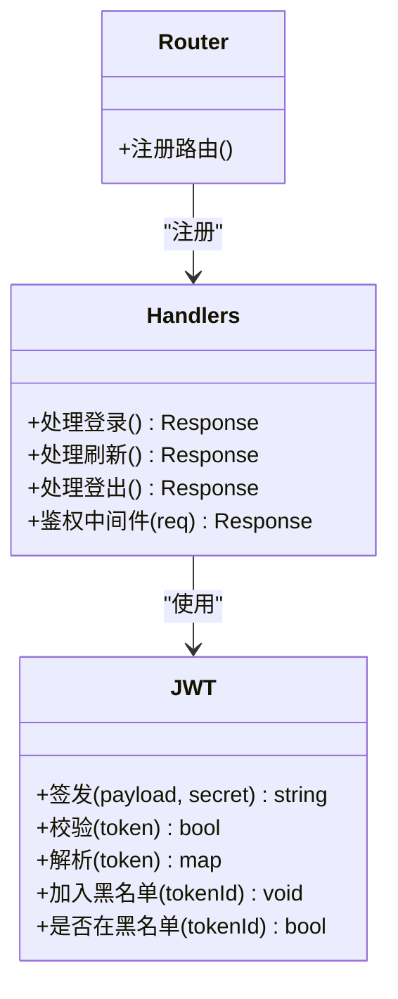
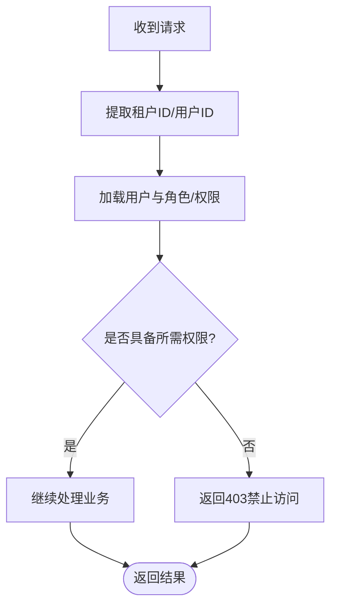
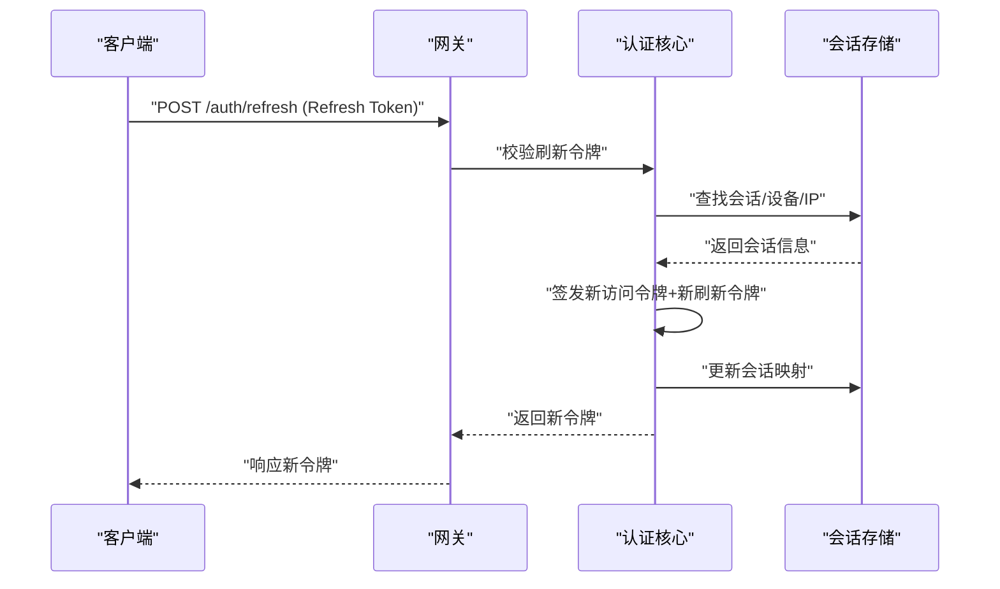
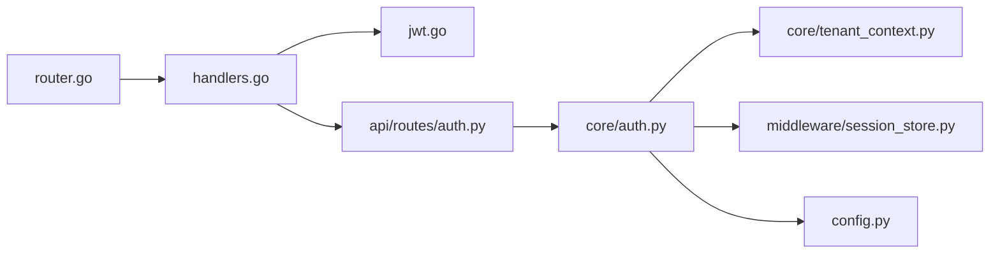

# 认证授权API

<cite>
**本文引用的文件**   
- [backend_design/nexus/api/routes/auth.py](file://backend_design/nexus/api/routes/auth.py)
- [backend_design/nexus/core/auth.py](file://backend_design/nexus/core/auth.py)
- [backend_design/nexus/core/tenant_context.py](file://backend_design/nexus/core/tenant_context.py)
- [backend_design/nexus/middleware/session_store.py](file://backend_design/nexus/middleware/session_store.py)
- [backend_design/nexus_gate/internal/auth/jwt.go](file://backend_design/nexus_gate/internal/auth/jwt.go)
- [backend_design/nexus_gate/internal/handlers/handlers.go](file://backend_design/nexus_gate/internal/handlers/handlers.go)
- [backend_design/nexus_gate/internal/router/router.go](file://backend_design/nexus_gate/internal/router/router.go)
- [backend_design/nexus/config.py](file://backend_design/nexus/config.py)
</cite>

## 目录
1. [简介](#简介)
2. [项目结构](#项目结构)
3. [核心组件](#核心组件)
4. [架构总览](#架构总览)
5. [详细组件分析](#详细组件分析)
6. [依赖关系分析](#依赖关系分析)
7. [性能考虑](#性能考虑)
8. [故障排查指南](#故障排查指南)
9. [结论](#结论)
10. [附录](#附录)

## 简介
本文件为 NexusCockpit 的认证与授权 API 提供系统化文档，覆盖以下要点：
- JWT 令牌认证流程：用户登录、令牌刷新、登出、用户信息管理
- JWT 令牌结构与签名验证机制
- 权限控制与会话管理策略
- 多租户隔离与角色权限校验
- 完整认证流程示例与客户端集成指南

NexusCockpit 采用“网关鉴权 + 业务服务上下文”的分层设计：
- 网关（Go）负责统一路由、JWT 签发/校验、限流与转发
- 业务服务（Python）基于中间件注入当前租户与用户上下文，进行细粒度权限控制与会话管理

## 项目结构
与认证授权相关的核心代码分布在如下位置：
- 网关层（Go）
  - 路由注册与处理器：[router.go](file://backend_design/nexus_gate/internal/router/router.go)、[handlers.go](file://backend_design/nexus_gate/internal/handlers/handlers.go)
  - JWT 实现：[jwt.go](file://backend_design/nexus_gate/internal/auth/jwt.go)
- 业务层（Python）
  - 认证路由与接口：[auth.py](file://backend_design/nexus/api/routes/auth.py)
  - 认证核心逻辑与工具：[auth.py](file://backend_design/nexus/core/auth.py)
  - 多租户上下文：[tenant_context.py](file://backend_design/nexus/core/tenant_context.py)
  - 会话存储中间件：[session_store.py](file://backend_design/nexus/middleware/session_store.py)
  - 配置项：[config.py](file://backend_design/nexus/config.py)

**图示来源**
- [backend_design/nexus_gate/internal/router/router.go](file://backend_design/nexus_gate/internal/router/router.go)
- [backend_design/nexus_gate/internal/handlers/handlers.go](file://backend_design/nexus_gate/internal/handlers/handlers.go)
- [backend_design/nexus_gate/internal/auth/jwt.go](file://backend_design/nexus_gate/internal/auth/jwt.go)
- [backend_design/nexus/api/routes/auth.py](file://backend_design/nexus/api/routes/auth.py)
- [backend_design/nexus/core/auth.py](file://backend_design/nexus/core/auth.py)
- [backend_design/nexus/core/tenant_context.py](file://backend_design/nexus/core/tenant_context.py)
- [backend_design/nexus/middleware/session_store.py](file://backend_design/nexus/middleware/session_store.py)
- [backend_design/nexus/config.py](file://backend_design/nexus/config.py)

**章节来源**
- [backend_design/nexus_gate/internal/router/router.go](file://backend_design/nexus_gate/internal/router/router.go)
- [backend_design/nexus_gate/internal/handlers/handlers.go](file://backend_design/nexus_gate/internal/handlers/handlers.go)
- [backend_design/nexus_gate/internal/auth/jwt.go](file://backend_design/nexus_gate/internal/auth/jwt.go)
- [backend_design/nexus/api/routes/auth.py](file://backend_design/nexus/api/routes/auth.py)
- [backend_design/nexus/core/auth.py](file://backend_design/nexus/core/auth.py)
- [backend_design/nexus/core/tenant_context.py](file://backend_design/nexus/core/tenant_context.py)
- [backend_design/nexus/middleware/session_store.py](file://backend_design/nexus/middleware/session_store.py)
- [backend_design/nexus/config.py](file://backend_design/nexus/config.py)

## 核心组件
- 网关 JWT 模块（Go）
  - 负责令牌的签发、校验、过期检查与载荷解析
  - 在请求进入业务服务前完成身份与租户上下文注入
- 业务认证路由（Python）
  - 暴露 /auth/login、/auth/refresh、/auth/logout 等接口
  - 调用认证核心完成凭据校验、会话创建/销毁、用户信息读取
- 认证核心（Python）
  - 封装密码校验、令牌生成/刷新、黑名单/撤销、权限计算等
- 租户上下文（Python）
  - 从请求头或网关注入的上下文中提取 tenant_id，并绑定到当前请求
- 会话存储中间件（Python）
  - 维护短期会话状态（如刷新令牌映射、设备指纹、IP 白名单等）
- 配置（Python）
  - 集中管理密钥、令牌有效期、刷新策略、租户开关等

**章节来源**
- [backend_design/nexus_gate/internal/auth/jwt.go](file://backend_design/nexus_gate/internal/auth/jwt.go)
- [backend_design/nexus/api/routes/auth.py](file://backend_design/nexus/api/routes/auth.py)
- [backend_design/nexus/core/auth.py](file://backend_design/nexus/core/auth.py)
- [backend_design/nexus/core/tenant_context.py](file://backend_design/nexus/core/tenant_context.py)
- [backend_design/nexus/middleware/session_store.py](file://backend_design/nexus/middleware/session_store.py)
- [backend_design/nexus/config.py](file://backend_design/nexus/config.py)

## 架构总览
下图展示一次典型认证的端到端流程：客户端通过网关发起登录，网关将凭据转发至业务服务；业务服务校验成功后返回访问令牌与刷新令牌；后续受保护资源由网关校验 JWT 后放行。

**图示来源**
- [backend_design/nexus_gate/internal/handlers/handlers.go](file://backend_design/nexus_gate/internal/handlers/handlers.go)
- [backend_design/nexus_gate/internal/router/router.go](file://backend_design/nexus_gate/internal/router/router.go)
- [backend_design/nexus/api/routes/auth.py](file://backend_design/nexus/api/routes/auth.py)
- [backend_design/nexus/core/auth.py](file://backend_design/nexus/core/auth.py)
- [backend_design/nexus/middleware/session_store.py](file://backend_design/nexus/middleware/session_store.py)
- [backend_design/nexus/core/tenant_context.py](file://backend_design/nexus/core/tenant_context.py)

## 详细组件分析

### 认证路由与接口（/auth/*）
- 登录 POST /auth/login
  - 输入：用户名/邮箱、密码、可选设备标识与租户标识
  - 处理：校验凭据、生成访问令牌与刷新令牌、写入会话映射
  - 输出：访问令牌、刷新令牌、过期时间、用户基本信息
- 刷新 POST /auth/refresh
  - 输入：刷新令牌、可选设备/IP 校验
  - 处理：校验刷新令牌有效性、更新会话、签发新访问令牌
  - 输出：新的访问令牌与刷新令牌（可轮换）
- 登出 POST /auth/logout
  - 输入：访问令牌或刷新令牌
  - 处理：加入令牌黑名单、清理会话、撤销刷新令牌映射
  - 输出：成功状态
- 用户信息 GET /auth/me
  - 输入：有效访问令牌
  - 处理：从会话/数据库加载用户详情与权限集合
  - 输出：用户信息与权限列表

**图示来源**
- [backend_design/nexus/api/routes/auth.py](file://backend_design/nexus/api/routes/auth.py)
- [backend_design/nexus/core/auth.py](file://backend_design/nexus/core/auth.py)
- [backend_design/nexus/middleware/session_store.py](file://backend_design/nexus/middleware/session_store.py)

**章节来源**
- [backend_design/nexus/api/routes/auth.py](file://backend_design/nexus/api/routes/auth.py)
- [backend_design/nexus/core/auth.py](file://backend_design/nexus/core/auth.py)
- [backend_design/nexus/middleware/session_store.py](file://backend_design/nexus/middleware/session_store.py)

### JWT 令牌结构与签名验证（Go）
- 令牌结构
  - Header：算法、类型
  - Payload：子标识、租户标识、角色/权限集合、签发时间、过期时间、刷新令牌指纹等
  - Signature：使用配置的对称或非对称密钥签名
- 签名验证
  - 网关在每次请求时校验签名、过期时间与黑名单
  - 支持按租户隔离的密钥或命名空间，避免跨租户越权
- 刷新令牌策略
  - 短生命周期访问令牌 + 长生命周期刷新令牌
  - 刷新令牌可轮换、可吊销，支持设备/IP 绑定增强安全

**图示来源**
- [backend_design/nexus_gate/internal/auth/jwt.go](file://backend_design/nexus_gate/internal/auth/jwt.go)
- [backend_design/nexus_gate/internal/handlers/handlers.go](file://backend_design/nexus_gate/internal/handlers/handlers.go)
- [backend_design/nexus_gate/internal/router/router.go](file://backend_design/nexus_gate/internal/router/router.go)

**章节来源**
- [backend_design/nexus_gate/internal/auth/jwt.go](file://backend_design/nexus_gate/internal/auth/jwt.go)
- [backend_design/nexus_gate/internal/handlers/handlers.go](file://backend_design/nexus_gate/internal/handlers/handlers.go)
- [backend_design/nexus_gate/internal/router/router.go](file://backend_design/nexus_gate/internal/router/router.go)

### 多租户隔离与权限控制（Python）
- 租户上下文
  - 从请求头或网关注入的上下文获取 tenant_id
  - 所有数据查询与缓存键均包含租户前缀，确保数据隔离
- 权限模型
  - 用户-角色-权限三元组，结合资源路径与方法进行授权判断
  - 支持按租户维度扩展角色定义与权限范围
- 会话管理
  - 会话存储中间件维护刷新令牌映射、设备指纹、最近活跃时间
  - 支持并发登录限制与异常登录检测

**图示来源**
- [backend_design/nexus/core/tenant_context.py](file://backend_design/nexus/core/tenant_context.py)
- [backend_design/nexus/core/auth.py](file://backend_design/nexus/core/auth.py)
- [backend_design/nexus/middleware/session_store.py](file://backend_design/nexus/middleware/session_store.py)

**章节来源**
- [backend_design/nexus/core/tenant_context.py](file://backend_design/nexus/core/tenant_context.py)
- [backend_design/nexus/core/auth.py](file://backend_design/nexus/core/auth.py)
- [backend_design/nexus/middleware/session_store.py](file://backend_design/nexus/middleware/session_store.py)

### 会话管理与刷新策略
- 刷新令牌轮换
  - 每次刷新可颁发新的刷新令牌，旧令牌立即失效
- 设备/IP 绑定
  - 会话中记录设备指纹与最近IP，异常变更触发重新认证
- 黑名单与撤销
  - 登出时将令牌加入黑名单，网关侧快速拒绝
- 超时与清理
  - 定期清理过期会话与黑名单条目，降低存储压力

**图示来源**
- [backend_design/nexus/api/routes/auth.py](file://backend_design/nexus/api/routes/auth.py)
- [backend_design/nexus/core/auth.py](file://backend_design/nexus/core/auth.py)
- [backend_design/nexus/middleware/session_store.py](file://backend_design/nexus/middleware/session_store.py)

**章节来源**
- [backend_design/nexus/api/routes/auth.py](file://backend_design/nexus/api/routes/auth.py)
- [backend_design/nexus/core/auth.py](file://backend_design/nexus/core/auth.py)
- [backend_design/nexus/middleware/session_store.py](file://backend_design/nexus/middleware/session_store.py)

## 依赖关系分析
- 网关对 JWT 模块强依赖，用于统一鉴权与上下文注入
- 业务认证路由依赖认证核心与会话存储
- 认证核心依赖租户上下文与配置
- 配置集中管理密钥、有效期、刷新策略等敏感参数

**图示来源**
- [backend_design/nexus_gate/internal/router/router.go](file://backend_design/nexus_gate/internal/router/router.go)
- [backend_design/nexus_gate/internal/handlers/handlers.go](file://backend_design/nexus_gate/internal/handlers/handlers.go)
- [backend_design/nexus_gate/internal/auth/jwt.go](file://backend_design/nexus_gate/internal/auth/jwt.go)
- [backend_design/nexus/api/routes/auth.py](file://backend_design/nexus/api/routes/auth.py)
- [backend_design/nexus/core/auth.py](file://backend_design/nexus/core/auth.py)
- [backend_design/nexus/core/tenant_context.py](file://backend_design/nexus/core/tenant_context.py)
- [backend_design/nexus/middleware/session_store.py](file://backend_design/nexus/middleware/session_store.py)
- [backend_design/nexus/config.py](file://backend_design/nexus/config.py)

**章节来源**
- [backend_design/nexus_gate/internal/router/router.go](file://backend_design/nexus_gate/internal/router/router.go)
- [backend_design/nexus_gate/internal/handlers/handlers.go](file://backend_design/nexus_gate/internal/handlers/handlers.go)
- [backend_design/nexus_gate/internal/auth/jwt.go](file://backend_design/nexus_gate/internal/auth/jwt.go)
- [backend_design/nexus/api/routes/auth.py](file://backend_design/nexus/api/routes/auth.py)
- [backend_design/nexus/core/auth.py](file://backend_design/nexus/core/auth.py)
- [backend_design/nexus/core/tenant_context.py](file://backend_design/nexus/core/tenant_context.py)
- [backend_design/nexus/middleware/session_store.py](file://backend_design/nexus/middleware/session_store.py)
- [backend_design/nexus/config.py](file://backend_design/nexus/config.py)

## 性能考虑
- 网关侧无状态校验，减少业务服务负载
- 刷新令牌轮换与黑名单需使用高性能存储（如内存/Redis），注意键空间隔离与过期策略
- 会话存储建议设置合理的 TTL 与清理周期，避免膨胀
- 租户上下文提取应轻量，避免频繁 I/O

## 故障排查指南
- 常见错误码
  - 401 未认证：缺少或无效访问令牌
  - 403 禁止访问：无权限或租户不匹配
  - 408/429 超时/限流：网关限流或上游超时
- 排查步骤
  - 确认网关日志中的 JWT 校验结果（签名、过期、黑名单）
  - 检查会话存储中是否存在对应刷新令牌映射
  - 核对租户上下文是否正确注入
  - 查看业务服务认证核心日志，定位权限判定失败原因
- 关键日志点
  - 网关：JWT 校验、黑名单命中、租户注入
  - 业务：凭据校验、会话创建/更新、权限判定

**章节来源**
- [backend_design/nexus_gate/internal/handlers/handlers.go](file://backend_design/nexus_gate/internal/handlers/handlers.go)
- [backend_design/nexus_gate/internal/auth/jwt.go](file://backend_design/nexus_gate/internal/auth/jwt.go)
- [backend_design/nexus/api/routes/auth.py](file://backend_design/nexus/api/routes/auth.py)
- [backend_design/nexus/core/auth.py](file://backend_design/nexus/core/auth.py)
- [backend_design/nexus/middleware/session_store.py](file://backend_design/nexus/middleware/session_store.py)

## 结论
NexusCockpit 的认证授权体系以网关为中心，结合业务层的租户上下文与权限模型，实现了高可用、可扩展且安全的认证方案。通过短生命周期访问令牌与可轮换刷新令牌，配合黑名单与会话存储，既保证了用户体验，又强化了安全性。建议在部署时严格管理密钥、启用最小权限原则，并结合监控与审计完善整体安全治理。

## 附录

### 客户端集成指南
- 登录
  - 调用 POST /auth/login，提交凭据与可选设备标识
  - 保存返回的访问令牌与刷新令牌
- 受保护资源访问
  - 在请求头携带访问令牌（例如 Authorization: Bearer <token>）
  - 若网关返回 401，尝试刷新
- 刷新令牌
  - 调用 POST /auth/refresh，提交刷新令牌
  - 替换本地保存的访问令牌与刷新令牌
- 登出
  - 调用 POST /auth/logout，提交访问令牌或刷新令牌
  - 清除本地令牌与会话信息
- 最佳实践
  - 使用 HTTPS 传输
  - 合理设置令牌有效期与刷新策略
  - 记录设备指纹与 IP，异常时强制重新认证
  - 前端避免将令牌持久化到不安全存储

**章节来源**
- [backend_design/nexus/api/routes/auth.py](file://backend_design/nexus/api/routes/auth.py)
- [backend_design/nexus_gate/internal/handlers/handlers.go](file://backend_design/nexus_gate/internal/handlers/handlers.go)
- [backend_design/nexus_gate/internal/auth/jwt.go](file://backend_design/nexus_gate/internal/auth/jwt.go)