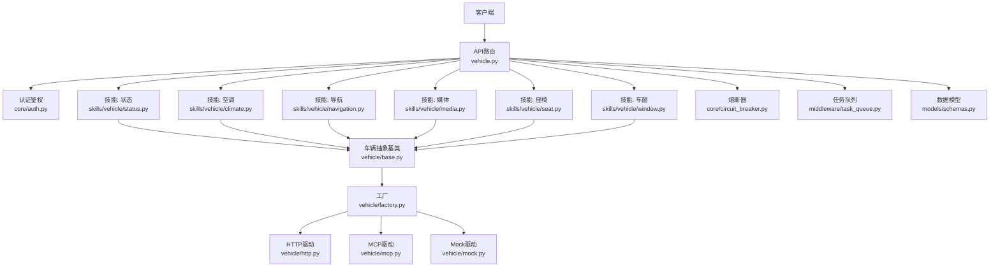
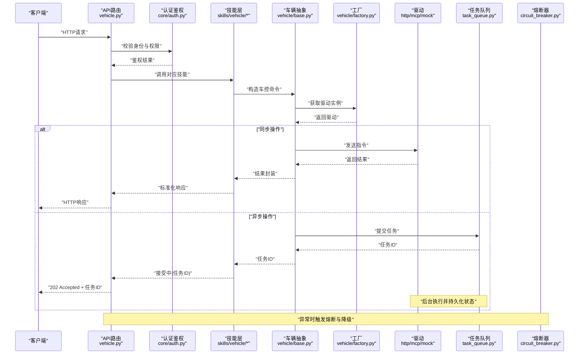
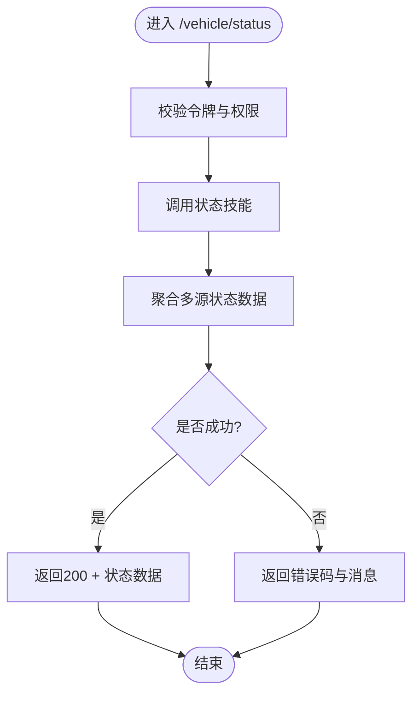
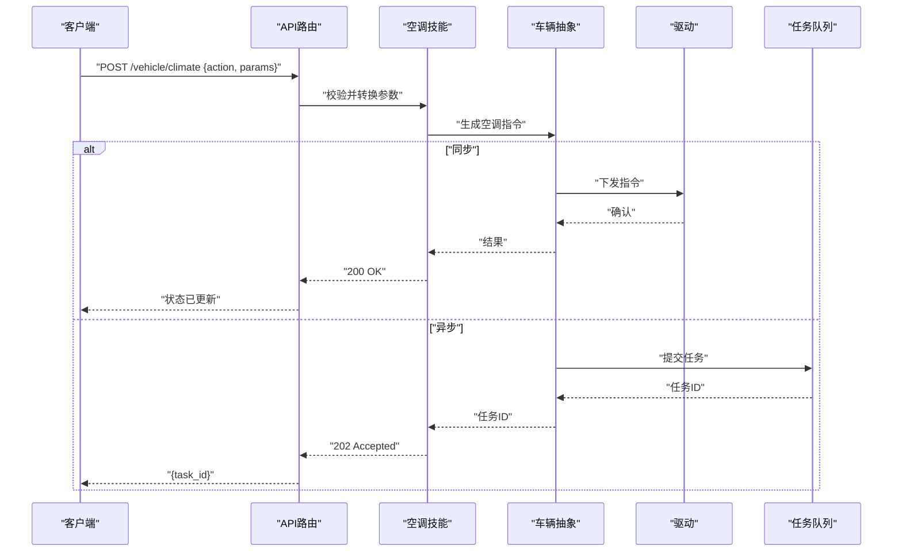
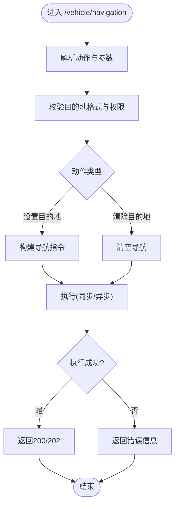
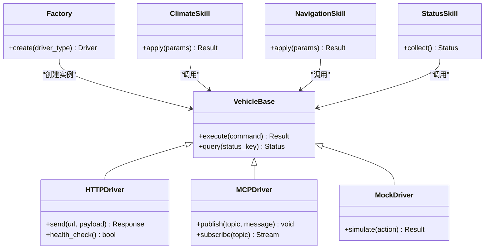

# 车辆控制API

<cite>
**本文引用的文件**   
- [backend_design/nexus/api/routes/vehicle.py](file://backend_design/nexus/api/routes/vehicle.py)
- [backend_design/nexus/skills/vehicle/status.py](file://backend_design/nexus/skills/vehicle/status.py)
- [backend_design/nexus/skills/vehicle/climate.py](file://backend_design/nexus/skills/vehicle/climate.py)
- [backend_design/nexus/skills/vehicle/navigation.py](file://backend_design/nexus/skills/vehicle/navigation.py)
- [backend_design/nexus/skills/vehicle/media.py](file://backend_design/nexus/skills/vehicle/media.py)
- [backend_design/nexus/skills/vehicle/seat.py](file://backend_design/nexus/skills/vehicle/seat.py)
- [backend_design/nexus/skills/vehicle/window.py](file://backend_design/nexus/skills/vehicle/window.py)
- [backend_design/nexus/vehicle/base.py](file://backend_design/nexus/vehicle/base.py)
- [backend_design/nexus/vehicle/factory.py](file://backend_design/nexus/vehicle/factory.py)
- [backend_design/nexus/vehicle/http.py](file://backend_design/nexus/vehicle/http.py)
- [backend_design/nexus/vehicle/mcp.py](file://backend_design/nexus/vehicle/mcp.py)
- [backend_design/nexus/vehicle/mock.py](file://backend_design/nexus/vehicle/mock.py)
- [backend_design/nexus/core/auth.py](file://backend_design/nexus/core/auth.py)
- [backend_design/nexus/core/circuit_breaker.py](file://backend_design/nexus/core/circuit_breaker.py)
- [backend_design/nexus/models/schemas.py](file://backend_design/nexus/models/schemas.py)
- [backend_design/nexus/middleware/task_queue.py](file://backend_design/nexus/middleware/task_queue.py)
- [backend_design/nexus/intent/router.py](file://backend_design/nexus/intent/router.py)
- [backend_design/nexus/main.py](file://backend_design/nexus/main.py)
</cite>

## 目录
1. [简介](#简介)
2. [项目结构](#项目结构)
3. [核心组件](#核心组件)
4. [架构总览](#架构总览)
5. [详细组件分析](#详细组件分析)
6. [依赖关系分析](#依赖关系分析)
7. [性能考虑](#性能考虑)
8. [故障排查指南](#故障排查指南)
9. [结论](#结论)
10. [附录](#附录)

## 简介
本文件为 NexusCockpit 的车辆控制API提供权威、可操作的文档。内容覆盖：
- REST端点设计：车辆状态查询（GET /vehicle/status）、设备控制（POST /vehicle/climate、POST /vehicle/navigation等）
- HTTP方法、URL模式、请求与响应Schema
- 权限验证与安全控制机制
- 车控指令的异步执行流程、状态同步机制与错误恢复策略
- 完整API调用示例与集成指南

## 项目结构
与车辆控制API相关的代码主要分布在以下模块：
- API路由层：定义REST端点，处理HTTP请求与响应
- 技能层（Skills）：封装具体车控能力（空调、导航、媒体、座椅、车窗、状态等）
- 车辆抽象层（Vehicle Abstraction）：统一对外部车控系统的访问接口（HTTP/MCP/Mock）
- 安全与中间件：认证鉴权、熔断保护、任务队列等
- 模型与Schema：统一的请求/响应数据结构定义

图表来源
- [backend_design/nexus/api/routes/vehicle.py](file://backend_design/nexus/api/routes/vehicle.py)
- [backend_design/nexus/core/auth.py](file://backend_design/nexus/core/auth.py)
- [backend_design/nexus/skills/vehicle/status.py](file://backend_design/nexus/skills/vehicle/status.py)
- [backend_design/nexus/skills/vehicle/climate.py](file://backend_design/nexus/skills/vehicle/climate.py)
- [backend_design/nexus/skills/vehicle/navigation.py](file://backend_design/nexus/skills/vehicle/navigation.py)
- [backend_design/nexus/skills/vehicle/media.py](file://backend_design/nexus/skills/vehicle/media.py)
- [backend_design/nexus/skills/vehicle/seat.py](file://backend_design/nexus/skills/vehicle/seat.py)
- [backend_design/nexus/skills/vehicle/window.py](file://backend_design/nexus/skills/vehicle/window.py)
- [backend_design/nexus/vehicle/base.py](file://backend_design/nexus/vehicle/base.py)
- [backend_design/nexus/vehicle/factory.py](file://backend_design/nexus/vehicle/factory.py)
- [backend_design/nexus/vehicle/http.py](file://backend_design/nexus/vehicle/http.py)
- [backend_design/nexus/vehicle/mcp.py](file://backend_design/nexus/vehicle/mcp.py)
- [backend_design/nexus/vehicle/mock.py](file://backend_design/nexus/vehicle/mock.py)
- [backend_design/nexus/core/circuit_breaker.py](file://backend_design/nexus/core/circuit_breaker.py)
- [backend_design/nexus/middleware/task_queue.py](file://backend_design/nexus/middleware/task_queue.py)
- [backend_design/nexus/models/schemas.py](file://backend_design/nexus/models/schemas.py)

章节来源
- [backend_design/nexus/api/routes/vehicle.py](file://backend_design/nexus/api/routes/vehicle.py)
- [backend_design/nexus/main.py](file://backend_design/nexus/main.py)

## 核心组件
- API路由层
  - 负责注册REST端点，解析请求参数，调用对应技能，并返回标准化响应
  - 关键路径：/vehicle/status、/vehicle/climate、/vehicle/navigation、/vehicle/media、/vehicle/seat、/vehicle/window
- 技能层（Skills）
  - 将业务语义映射到具体的车控操作，如温度设置、目的地下发、媒体播放控制等
  - 每个技能实现统一的输入校验、参数转换与结果封装
- 车辆抽象层
  - 通过基类定义统一接口，工厂根据配置选择HTTP/MCP/Mock驱动
  - 屏蔽底层差异，便于扩展与测试
- 安全与中间件
  - 认证鉴权：基于JWT或会话令牌的身份校验
  - 熔断器：对不稳定外部服务进行快速失败与降级
  - 任务队列：用于异步执行耗时车控指令，支持状态跟踪与重试
- 数据模型
  - 集中定义请求/响应的Schema，确保前后端一致性与类型安全

章节来源
- [backend_design/nexus/api/routes/vehicle.py](file://backend_design/nexus/api/routes/vehicle.py)
- [backend_design/nexus/skills/vehicle/status.py](file://backend_design/nexus/skills/vehicle/status.py)
- [backend_design/nexus/skills/vehicle/climate.py](file://backend_design/nexus/skills/vehicle/climate.py)
- [backend_design/nexus/skills/vehicle/navigation.py](file://backend_design/nexus/skills/vehicle/navigation.py)
- [backend_design/nexus/vehicle/base.py](file://backend_design/nexus/vehicle/base.py)
- [backend_design/nexus/vehicle/factory.py](file://backend_design/nexus/vehicle/factory.py)
- [backend_design/nexus/core/auth.py](file://backend_design/nexus/core/auth.py)
- [backend_design/nexus/core/circuit_breaker.py](file://backend_design/nexus/core/circuit_breaker.py)
- [backend_design/nexus/middleware/task_queue.py](file://backend_design/nexus/middleware/task_queue.py)
- [backend_design/nexus/models/schemas.py](file://backend_design/nexus/models/schemas.py)

## 架构总览
下图展示了从客户端发起请求到最终执行车控指令的整体流程，包括认证、路由分发、技能调用、驱动选择与异步执行。

图表来源
- [backend_design/nexus/api/routes/vehicle.py](file://backend_design/nexus/api/routes/vehicle.py)
- [backend_design/nexus/core/auth.py](file://backend_design/nexus/core/auth.py)
- [backend_design/nexus/skills/vehicle/status.py](file://backend_design/nexus/skills/vehicle/status.py)
- [backend_design/nexus/skills/vehicle/climate.py](file://backend_design/nexus/skills/vehicle/climate.py)
- [backend_design/nexus/skills/vehicle/navigation.py](file://backend_design/nexus/skills/vehicle/navigation.py)
- [backend_design/nexus/vehicle/base.py](file://backend_design/nexus/vehicle/base.py)
- [backend_design/nexus/vehicle/factory.py](file://backend_design/nexus/vehicle/factory.py)
- [backend_design/nexus/vehicle/http.py](file://backend_design/nexus/vehicle/http.py)
- [backend_design/nexus/vehicle/mcp.py](file://backend_design/nexus/vehicle/mcp.py)
- [backend_design/nexus/vehicle/mock.py](file://backend_design/nexus/vehicle/mock.py)
- [backend_design/nexus/middleware/task_queue.py](file://backend_design/nexus/middleware/task_queue.py)
- [backend_design/nexus/core/circuit_breaker.py](file://backend_design/nexus/core/circuit_breaker.py)

## 详细组件分析

### 车辆状态查询 GET /vehicle/status
- 功能说明
  - 获取当前车辆综合状态，包括电池、里程、车门锁、车窗、空调、导航等
- 方法与路径
  - 方法：GET
  - 路径：/vehicle/status
- 请求参数
  - 无路径参数；可选查询参数用于过滤字段（由路由层解析）
- 响应Schema
  - 包含标准字段：状态码、消息、数据体（status对象）
  - 数据体字段示例：电量百分比、剩余里程、车门状态、车窗开合度、空调温度与模式、导航目标等
- 权限与安全
  - 需要有效用户令牌；支持租户隔离
- 错误处理
  - 未授权：返回401
  - 参数非法：返回400
  - 服务不可用：返回503（熔断触发）
- 异步与同步
  - 通常为同步读取；若状态聚合耗时，可走任务队列返回202并接受轮询

图表来源
- [backend_design/nexus/api/routes/vehicle.py](file://backend_design/nexus/api/routes/vehicle.py)
- [backend_design/nexus/skills/vehicle/status.py](file://backend_design/nexus/skills/vehicle/status.py)

章节来源
- [backend_design/nexus/api/routes/vehicle.py](file://backend_design/nexus/api/routes/vehicle.py)
- [backend_design/nexus/skills/vehicle/status.py](file://backend_design/nexus/skills/vehicle/status.py)
- [backend_design/nexus/models/schemas.py](file://backend_design/nexus/models/schemas.py)

### 空调控制 POST /vehicle/climate
- 功能说明
  - 设置空调温度、风量、模式、分区控制等
- 方法与路径
  - 方法：POST
  - 路径：/vehicle/climate
- 请求Schema
  - 必填字段：action（如 set_temperature、set_mode、set_fan_speed）
  - 可选字段：temperature（数值）、fan_level（枚举）、zone（前/后排）、auto（布尔）
- 响应Schema
  - 成功：200或202（异步），包含任务ID或最新状态
  - 失败：400/401/503等
- 权限与安全
  - 需要具备“车辆控制”权限；支持IP白名单与速率限制
- 异步执行与状态同步
  - 复杂指令可能异步执行；返回任务ID后，前端可通过任务查询接口轮询
- 错误恢复
  - 重试策略：指数退避；熔断开启时返回降级提示

图表来源
- [backend_design/nexus/api/routes/vehicle.py](file://backend_design/nexus/api/routes/vehicle.py)
- [backend_design/nexus/skills/vehicle/climate.py](file://backend_design/nexus/skills/vehicle/climate.py)
- [backend_design/nexus/vehicle/base.py](file://backend_design/nexus/vehicle/base.py)
- [backend_design/nexus/vehicle/factory.py](file://backend_design/nexus/vehicle/factory.py)
- [backend_design/nexus/middleware/task_queue.py](file://backend_design/nexus/middleware/task_queue.py)

章节来源
- [backend_design/nexus/api/routes/vehicle.py](file://backend_design/nexus/api/routes/vehicle.py)
- [backend_design/nexus/skills/vehicle/climate.py](file://backend_design/nexus/skills/vehicle/climate.py)
- [backend_design/nexus/models/schemas.py](file://backend_design/nexus/models/schemas.py)

### 导航控制 POST /vehicle/navigation
- 功能说明
  - 设置导航目的地、路线偏好、语音播报开关等
- 方法与路径
  - 方法：POST
  - 路径：/vehicle/navigation
- 请求Schema
  - 必填字段：action（如 set_destination、clear_destination）
  - 可选字段：destination（地址或坐标）、route_preference（最快/最短/避开拥堵）、voice_enabled（布尔）
- 响应Schema
  - 成功：200或202（异步）
  - 失败：400/401/503
- 权限与安全
  - 需具备“导航控制”权限；支持地理围栏校验（可选）
- 异步执行与状态同步
  - 导航下发通常异步；返回任务ID，前端轮询或订阅事件

图表来源
- [backend_design/nexus/api/routes/vehicle.py](file://backend_design/nexus/api/routes/vehicle.py)
- [backend_design/nexus/skills/vehicle/navigation.py](file://backend_design/nexus/skills/vehicle/navigation.py)

章节来源
- [backend_design/nexus/api/routes/vehicle.py](file://backend_design/nexus/api/routes/vehicle.py)
- [backend_design/nexus/skills/vehicle/navigation.py](file://backend_design/nexus/skills/vehicle/navigation.py)
- [backend_design/nexus/models/schemas.py](file://backend_design/nexus/models/schemas.py)

### 媒体控制 POST /vehicle/media
- 功能说明
  - 控制媒体播放：播放、暂停、切歌、音量调节、列表切换等
- 方法与路径
  - 方法：POST
  - 路径：/vehicle/media
- 请求Schema
  - 必填字段：action（play/pause/next/prev/set_volume）
  - 可选字段：volume（数值0-100）、source（蓝牙/USB/在线）
- 响应Schema
  - 成功：200或202
  - 失败：400/401/503
- 权限与安全
  - 需具备“媒体控制”权限；支持用户上下文绑定（避免误操作他人账户）

章节来源
- [backend_design/nexus/api/routes/vehicle.py](file://backend_design/nexus/api/routes/vehicle.py)
- [backend_design/nexus/skills/vehicle/media.py](file://backend_design/nexus/skills/vehicle/media.py)
- [backend_design/nexus/models/schemas.py](file://backend_design/nexus/models/schemas.py)

### 座椅控制 POST /vehicle/seat
- 功能说明
  - 调整座椅位置、加热、通风、按摩等功能
- 方法与路径
  - 方法：POST
  - 路径：/vehicle/seat
- 请求Schema
  - 必填字段：action（move/heating/ventilation/massage）
  - 可选字段：position（前/后/高/低）、level（强度等级）
- 响应Schema
  - 成功：200或202
  - 失败：400/401/503
- 权限与安全
  - 需具备“座椅控制”权限；支持驾驶员/乘客区分

章节来源
- [backend_design/nexus/api/routes/vehicle.py](file://backend_design/nexus/api/routes/vehicle.py)
- [backend_design/nexus/skills/vehicle/seat.py](file://backend_design/nexus/skills/vehicle/seat.py)
- [backend_design/nexus/models/schemas.py](file://backend_design/nexus/models/schemas.py)

### 车窗控制 POST /vehicle/window
- 功能说明
  - 控制车窗开合、防夹、一键升降等
- 方法与路径
  - 方法：POST
  - 路径：/vehicle/window
- 请求Schema
  - 必填字段：action（open/close/set_position）
  - 可选字段：position（百分比）、side（左/右/全部）
- 响应Schema
  - 成功：200或202
  - 失败：400/401/503
- 权限与安全
  - 需具备“车窗控制”权限；支持儿童锁联动

章节来源
- [backend_design/nexus/api/routes/vehicle.py](file://backend_design/nexus/api/routes/vehicle.py)
- [backend_design/nexus/skills/vehicle/window.py](file://backend_design/nexus/skills/vehicle/window.py)
- [backend_design/nexus/models/schemas.py](file://backend_design/nexus/models/schemas.py)

### 故障诊断与系统信息
- 功能说明
  - 获取系统健康状态、日志摘要、最近错误、资源使用率等
- 方法与路径
  - 方法：GET
  - 路径：/vehicle/system/info（示例）
- 请求参数
  - 可选：detail（true/false）
- 响应Schema
  - 包含系统版本、运行时间、错误计数、资源指标等
- 权限与安全
  - 管理员或运维角色；严格限流

章节来源
- [backend_design/nexus/api/routes/vehicle.py](file://backend_design/nexus/api/routes/vehicle.py)

## 依赖关系分析
- 组件耦合
  - 路由层强依赖技能层；技能层依赖车辆抽象层；抽象层通过工厂选择驱动
  - 安全与熔断作为横切关注点，贯穿各层
- 外部依赖
  - HTTP驱动：对接车载网关或云端车控服务
  - MCP驱动：对接内部消息总线
  - Mock驱动：用于开发与测试
- 潜在循环依赖
  - 通过抽象层与工厂解耦，避免直接循环引用

图表来源
- [backend_design/nexus/vehicle/base.py](file://backend_design/nexus/vehicle/base.py)
- [backend_design/nexus/vehicle/http.py](file://backend_design/nexus/vehicle/http.py)
- [backend_design/nexus/vehicle/mcp.py](file://backend_design/nexus/vehicle/mcp.py)
- [backend_design/nexus/vehicle/mock.py](file://backend_design/nexus/vehicle/mock.py)
- [backend_design/nexus/vehicle/factory.py](file://backend_design/nexus/vehicle/factory.py)
- [backend_design/nexus/skills/vehicle/climate.py](file://backend_design/nexus/skills/vehicle/climate.py)
- [backend_design/nexus/skills/vehicle/navigation.py](file://backend_design/nexus/skills/vehicle/navigation.py)
- [backend_design/nexus/skills/vehicle/status.py](file://backend_design/nexus/skills/vehicle/status.py)

章节来源
- [backend_design/nexus/vehicle/base.py](file://backend_design/nexus/vehicle/base.py)
- [backend_design/nexus/vehicle/factory.py](file://backend_design/nexus/vehicle/factory.py)
- [backend_design/nexus/skills/vehicle/climate.py](file://backend_design/nexus/skills/vehicle/climate.py)
- [backend_design/nexus/skills/vehicle/navigation.py](file://backend_design/nexus/skills/vehicle/navigation.py)
- [backend_design/nexus/skills/vehicle/status.py](file://backend_design/nexus/skills/vehicle/status.py)

## 性能考虑
- 缓存热点状态
  - 对频繁读取的状态（如电量、车门锁）引入短期缓存，降低外部调用压力
- 异步批量执行
  - 对多个设备控制指令进行批处理，减少网络往返
- 连接池与超时
  - HTTP驱动使用连接池；合理设置超时与重试次数
- 熔断与降级
  - 当外部服务异常率升高时快速失败，返回本地缓存或默认值
- 限流与背压
  - 针对高频控制接口实施限流，防止雪崩

[本节为通用指导，不直接分析具体文件]

## 故障排查指南
- 常见问题
  - 401未授权：检查令牌有效性、租户上下文与权限范围
  - 400参数错误：核对请求Schema必填字段与取值范围
  - 503服务不可用：查看熔断器状态与下游服务健康检查
  - 202接受中：确认任务ID是否正确，轮询间隔与最大重试次数
- 定位步骤
  - 查看路由层日志与请求ID
  - 检查技能层参数校验与转换逻辑
  - 观察驱动层网络请求与响应
  - 审查任务队列状态与重试记录
- 恢复策略
  - 自动重试：指数退避与抖动
  - 手动干预：重置熔断器、清理卡住的任务

章节来源
- [backend_design/nexus/core/auth.py](file://backend_design/nexus/core/auth.py)
- [backend_design/nexus/core/circuit_breaker.py](file://backend_design/nexus/core/circuit_breaker.py)
- [backend_design/nexus/middleware/task_queue.py](file://backend_design/nexus/middleware/task_queue.py)

## 结论
NexusCockpit 的车辆控制API通过清晰的分层设计与统一的抽象，实现了稳定、可扩展的车控能力。结合认证鉴权、熔断保护与任务队列，既保证了安全性与可靠性，又提供了良好的用户体验。建议在生产环境启用监控与告警，持续优化性能与稳定性。

[本节为总结性内容，不直接分析具体文件]

## 附录

### API调用示例
- 获取车辆状态
  - 方法：GET
  - 路径：/vehicle/status
  - 预期响应：200 + 状态数据
- 设置空调温度
  - 方法：POST
  - 路径：/vehicle/climate
  - 请求体：{ "action": "set_temperature", "temperature": 22 }
  - 预期响应：200或202（含任务ID）
- 设置导航目的地
  - 方法：POST
  - 路径：/vehicle/navigation
  - 请求体：{ "action": "set_destination", "destination": "北京市朝阳区xxx路" }
  - 预期响应：200或202（含任务ID）

[本节为概念性示例，不直接分析具体文件]

### 集成指南
- 前置条件
  - 获取有效的用户令牌与租户标识
  - 配置后端服务地址与超时参数
- 接入步骤
  - 初始化HTTP客户端，设置鉴权头
  - 调用状态接口获取初始数据
  - 按业务场景调用控制接口，处理202异步响应
  - 实现轮询或事件订阅以同步状态
- 最佳实践
  - 幂等性：对重复请求进行去重
  - 容错：捕获网络异常与服务异常，执行重试与降级
  - 监控：上报关键指标与错误日志

[本节为概念性指导，不直接分析具体文件]