# WebSocket实时通信

<cite>
**本文引用的文件**   
- [backend_design/nexus/api/websocket.py](file://backend_design/nexus/api/websocket.py)
- [backend_design/nexus/core/cockpit_manager.py](file://backend_design/nexus/core/cockpit_manager.py)
- [backend_design/nexus/models/schemas.py](file://backend_design/nexus/models/schemas.py)
- [backend_design/nexus/middleware/session_store.py](file://backend_design/nexus/middleware/session_store.py)
- [backend_design/nexus/observability/cockpit_metrics.py](file://backend_design/nexus/observability/cockpit_metrics.py)
- [backend_design/nexus_gate/internal/ws/hub.go](file://backend_design/nexus_gate/internal/ws/hub.go)
- [backend_design/nexus_gate/internal/proxy/proxy.go](file://backend_design/nexus_gate/internal/proxy/proxy.go)
- [backend_design/nexus_gate/internal/auth/jwt.go](file://backend_design/nexus_gate/internal/auth/jwt.go)
- [backend_design/nexus_gate/proto/nexus.proto](file://backend_design/nexus_gate/proto/nexus.proto)
- [frontend_design/src/lib/vehicle-events.ts](file://frontend_design/src/lib/vehicle-events.ts)
</cite>

## 目录
1. [简介](#简介)
2. [项目结构](#项目结构)
3. [核心组件](#核心组件)
4. [架构总览](#架构总览)
5. [详细组件分析](#详细组件分析)
6. [依赖关系分析](#依赖关系分析)
7. [性能考虑](#性能考虑)
8. [故障排查指南](#故障排查指南)
9. [结论](#结论)
10. [附录](#附录)

## 简介
本文件面向 NexusCockpit 的 WebSocket 实时通信子系统，系统性阐述连接管理、消息协议设计、事件驱动架构与关键流程。内容覆盖：
- 连接建立与鉴权
- 心跳检测与断线重连策略
- 消息路由规则与会话管理
- 实时车辆状态推送、语音交互流式传输、广播通知
- 客户端实现指南、错误处理与性能监控方案

## 项目结构
WebSocket 能力由网关层（Go）与应用服务层（Python）协同提供：
- 网关层负责长连接接入、鉴权、转发与跨进程/跨实例广播
- 应用服务层负责业务逻辑、会话管理、指标上报与领域事件发布

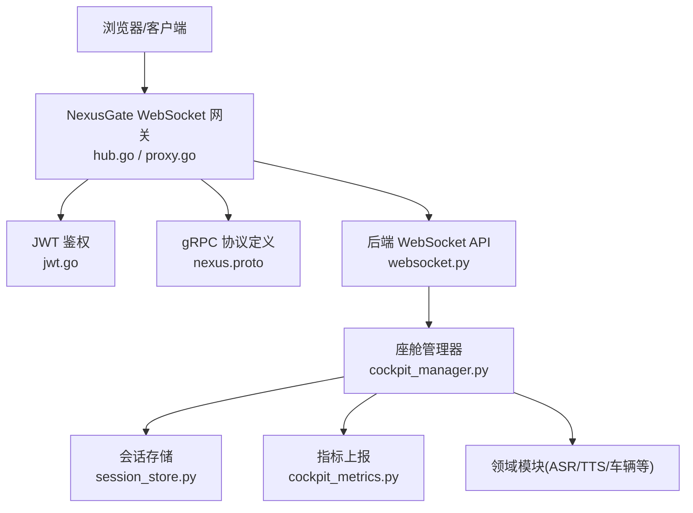

图表来源
- [backend_design/nexus_gate/internal/ws/hub.go](file://backend_design/nexus_gate/internal/ws/hub.go)
- [backend_design/nexus_gate/internal/proxy/proxy.go](file://backend_design/nexus_gate/internal/proxy/proxy.go)
- [backend_design/nexus_gate/internal/auth/jwt.go](file://backend_design/nexus_gate/internal/auth/jwt.go)
- [backend_design/nexus_gate/proto/nexus.proto](file://backend_design/nexus_gate/proto/nexus.proto)
- [backend_design/nexus/api/websocket.py](file://backend_design/nexus/api/websocket.py)
- [backend_design/nexus/core/cockpit_manager.py](file://backend_design/nexus/core/cockpit_manager.py)
- [backend_design/nexus/middleware/session_store.py](file://backend_design/nexus/middleware/session_store.py)
- [backend_design/nexus/observability/cockpit_metrics.py](file://backend_design/nexus/observability/cockpit_metrics.py)

章节来源
- [backend_design/nexus/api/websocket.py](file://backend_design/nexus/api/websocket.py)
- [backend_design/nexus/core/cockpit_manager.py](file://backend_design/nexus/core/cockpit_manager.py)
- [backend_design/nexus_gate/internal/ws/hub.go](file://backend_design/nexus_gate/internal/ws/hub.go)
- [backend_design/nexus_gate/internal/proxy/proxy.go](file://backend_design/nexus_gate/internal/proxy/proxy.go)
- [backend_design/nexus_gate/internal/auth/jwt.go](file://backend_design/nexus_gate/internal/auth/jwt.go)
- [backend_design/nexus_gate/proto/nexus.proto](file://backend_design/nexus_gate/proto/nexus.proto)

## 核心组件
- 网关 Hub：维护连接集合、订阅/广播、心跳探测与清理
- 代理 Proxy：将 WebSocket 帧转换为内部 gRPC 调用，完成鉴权与路由
- 后端 WebSocket API：接收业务消息、编排领域处理、回写响应或推送事件
- 座舱管理器 CockpitManager：统一会话上下文、资源生命周期、事件分发与指标采集
- 会话存储 SessionStore：持久化/缓存用户会话与路由信息
- 指标 CockpitMetrics：连接数、消息吞吐、延迟、错误率等观测数据

章节来源
- [backend_design/nexus_gate/internal/ws/hub.go](file://backend_design/nexus_gate/internal/ws/hub.go)
- [backend_design/nexus_gate/internal/proxy/proxy.go](file://backend_design/nexus_gate/internal/proxy/proxy.go)
- [backend_design/nexus/api/websocket.py](file://backend_design/nexus/api/websocket.py)
- [backend_design/nexus/core/cockpit_manager.py](file://backend_design/nexus/core/cockpit_manager.py)
- [backend_design/nexus/middleware/session_store.py](file://backend_design/nexus/middleware/session_store.py)
- [backend_design/nexus/observability/cockpit_metrics.py](file://backend_design/nexus/observability/cockpit_metrics.py)

## 架构总览
整体采用“网关接入 + 应用服务”的双层架构。前端通过 WebSocket 接入网关，网关完成鉴权后将请求转发至后端 WebSocket 端点；后端基于事件驱动模型进行消息路由与广播，并通过指标系统对外暴露可观测性数据。

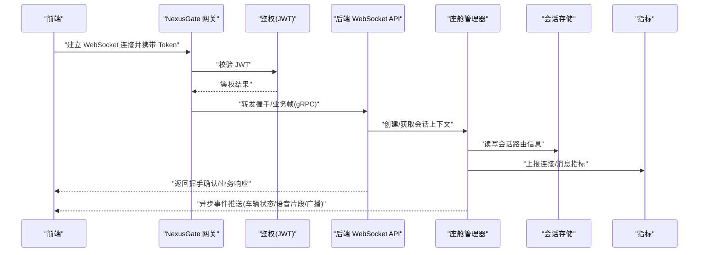

图表来源
- [backend_design/nexus_gate/internal/ws/hub.go](file://backend_design/nexus_gate/internal/ws/hub.go)
- [backend_design/nexus_gate/internal/proxy/proxy.go](file://backend_design/nexus_gate/internal/proxy/proxy.go)
- [backend_design/nexus_gate/internal/auth/jwt.go](file://backend_design/nexus_gate/internal/auth/jwt.go)
- [backend_design/nexus/api/websocket.py](file://backend_design/nexus/api/websocket.py)
- [backend_design/nexus/core/cockpit_manager.py](file://backend_design/nexus/core/cockpit_manager.py)
- [backend_design/nexus/middleware/session_store.py](file://backend_design/nexus/middleware/session_store.py)
- [backend_design/nexus/observability/cockpit_metrics.py](file://backend_design/nexus/observability/cockpit_metrics.py)

## 详细组件分析

### 连接管理与鉴权
- 连接建立：前端在 URL 中附带鉴权令牌，网关解析并验证后建立会话映射
- 会话绑定：后端根据用户/租户维度创建会话上下文，记录连接标识与路由信息
- 连接生命周期：心跳超时、异常关闭触发清理，释放资源并更新指标

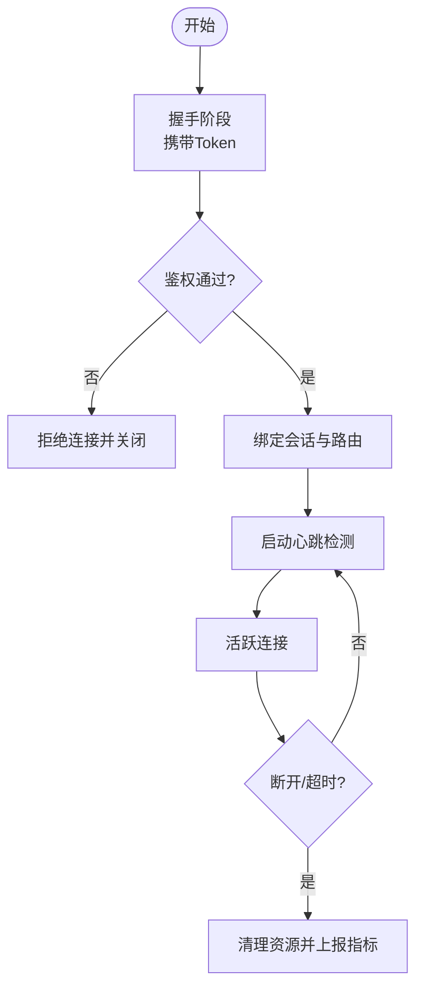

图表来源
- [backend_design/nexus_gate/internal/ws/hub.go](file://backend_design/nexus_gate/internal/ws/hub.go)
- [backend_design/nexus_gate/internal/auth/jwt.go](file://backend_design/nexus_gate/internal/auth/jwt.go)
- [backend_design/nexus/api/websocket.py](file://backend_design/nexus/api/websocket.py)
- [backend_design/nexus/core/cockpit_manager.py](file://backend_design/nexus/core/cockpit_manager.py)

章节来源
- [backend_design/nexus_gate/internal/ws/hub.go](file://backend_design/nexus_gate/internal/ws/hub.go)
- [backend_design/nexus_gate/internal/auth/jwt.go](file://backend_design/nexus_gate/internal/auth/jwt.go)
- [backend_design/nexus/api/websocket.py](file://backend_design/nexus/api/websocket.py)
- [backend_design/nexus/core/cockpit_manager.py](file://backend_design/nexus/core/cockpit_manager.py)

### 消息协议设计与路由规则
- 协议载体：网关与后端之间使用 gRPC 承载二进制/文本帧，保证高效序列化与类型约束
- 消息类型：包含握手、业务指令、事件推送、控制帧（心跳、重连协商）等
- 路由规则：按会话ID/房间/主题进行定向投递或广播；支持多路复用与优先级

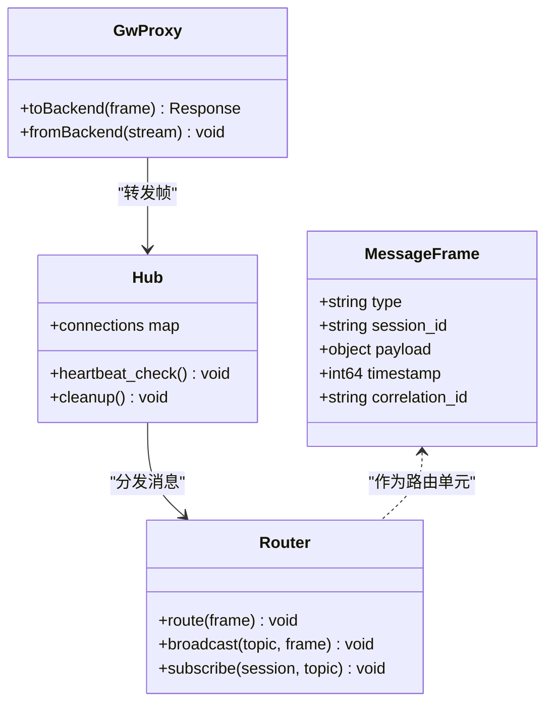

图表来源
- [backend_design/nexus_gate/internal/ws/hub.go](file://backend_design/nexus_gate/internal/ws/hub.go)
- [backend_design/nexus_gate/internal/proxy/proxy.go](file://backend_design/nexus_gate/internal/proxy/proxy.go)
- [backend_design/nexus_gate/proto/nexus.proto](file://backend_design/nexus_gate/proto/nexus.proto)
- [backend_design/nexus/models/schemas.py](file://backend_design/nexus/models/schemas.py)

章节来源
- [backend_design/nexus_gate/internal/ws/hub.go](file://backend_design/nexus_gate/internal/ws/hub.go)
- [backend_design/nexus_gate/internal/proxy/proxy.go](file://backend_design/nexus_gate/internal/proxy/proxy.go)
- [backend_design/nexus_gate/proto/nexus.proto](file://backend_design/nexus_gate/proto/nexus.proto)
- [backend_design/nexus/models/schemas.py](file://backend_design/nexus/models/schemas.py)

### 心跳检测机制
- 心跳帧：客户端周期性发送心跳帧，服务端记录最近活跃时间
- 超时判定：超过阈值未收到心跳则视为离线，触发清理与重连提示
- 自适应调整：可根据网络质量动态调整心跳间隔与超时阈值

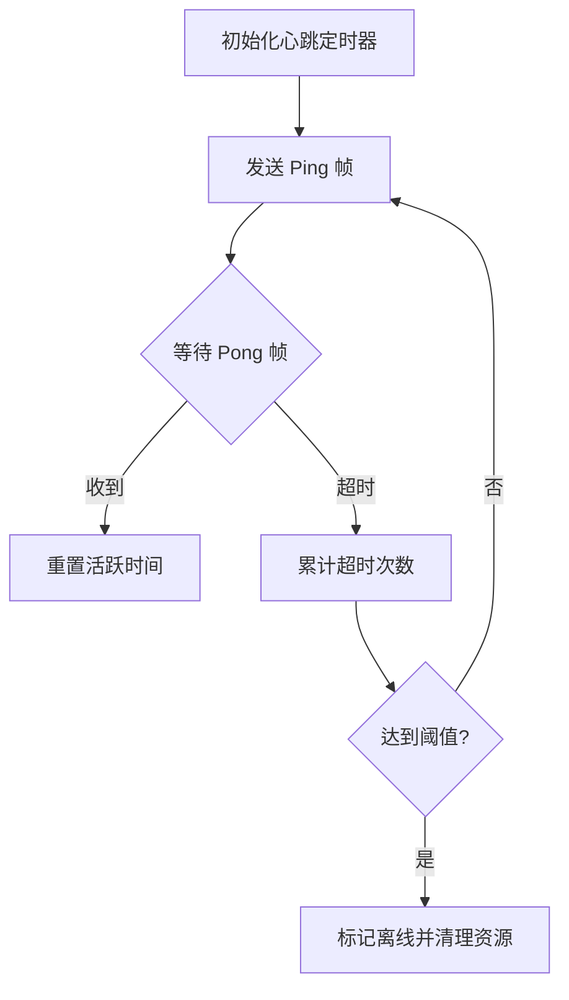

图表来源
- [backend_design/nexus_gate/internal/ws/hub.go](file://backend_design/nexus_gate/internal/ws/hub.go)

章节来源
- [backend_design/nexus_gate/internal/ws/hub.go](file://backend_design/nexus_gate/internal/ws/hub.go)

### 断线重连策略
- 指数退避：首次快速重试，随后逐步增大间隔，避免雪崩
- 抖动随机：在间隔中加入随机抖动，降低集中重连风险
- 幂等恢复：重连后携带上次会话上下文，确保状态一致

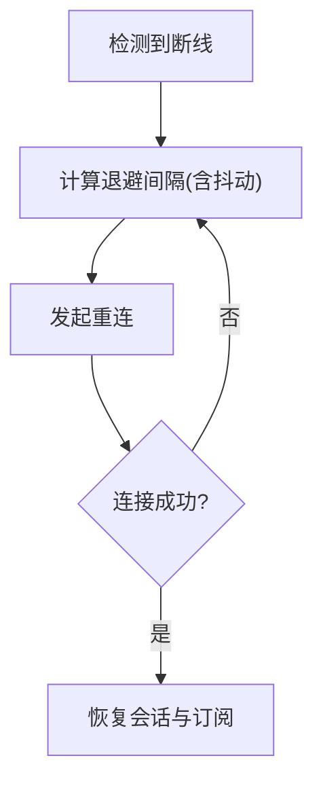

图表来源
- [backend_design/nexus_gate/internal/ws/hub.go](file://backend_design/nexus_gate/internal/ws/hub.go)
- [backend_design/nexus/api/websocket.py](file://backend_design/nexus/api/websocket.py)

章节来源
- [backend_design/nexus_gate/internal/ws/hub.go](file://backend_design/nexus_gate/internal/ws/hub.go)
- [backend_design/nexus/api/websocket.py](file://backend_design/nexus/api/websocket.py)

### 实时车辆状态推送
- 事件源：车辆遥测、诊断、控制反馈等事件经领域模块处理后进入事件总线
- 订阅模型：前端按车辆ID/房间订阅，服务端定向推送最新状态快照
- 去抖合并：高频状态变更在服务端做合并与节流，减少带宽占用

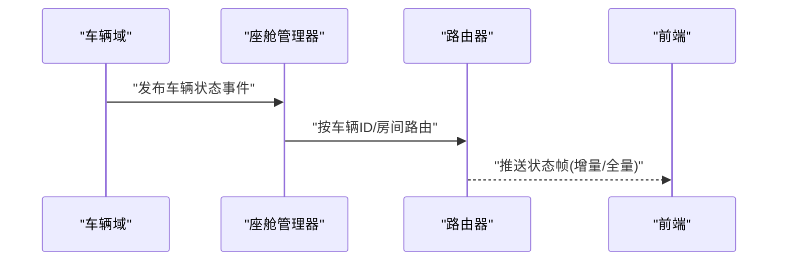

图表来源
- [backend_design/nexus/core/cockpit_manager.py](file://backend_design/nexus/core/cockpit_manager.py)
- [backend_design/nexus/models/schemas.py](file://backend_design/nexus/models/schemas.py)
- [frontend_design/src/lib/vehicle-events.ts](file://frontend_design/src/lib/vehicle-events.ts)

章节来源
- [backend_design/nexus/core/cockpit_manager.py](file://backend_design/nexus/core/cockpit_manager.py)
- [backend_design/nexus/models/schemas.py](file://backend_design/nexus/models/schemas.py)
- [frontend_design/src/lib/vehicle-events.ts](file://frontend_design/src/lib/vehicle-events.ts)

### 语音交互流式传输
- 上行：前端以分片音频流上传，网关透传至后端 ASR 引擎
- 下行：TTS 生成音频片段流式返回，前端边收边播
- 同步：通过关联ID对齐上下行片段，保障时序一致性

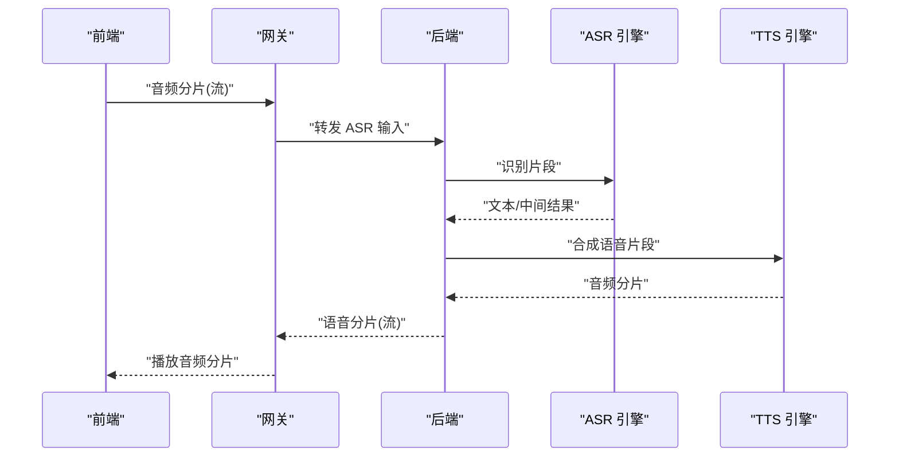

图表来源
- [backend_design/nexus_gate/internal/proxy/proxy.go](file://backend_design/nexus_gate/internal/proxy/proxy.go)
- [backend_design/nexus/api/websocket.py](file://backend_design/nexus/api/websocket.py)
- [backend_design/nexus_gate/proto/nexus.proto](file://backend_design/nexus_gate/proto/nexus.proto)

章节来源
- [backend_design/nexus_gate/internal/proxy/proxy.go](file://backend_design/nexus_gate/internal/proxy/proxy.go)
- [backend_design/nexus/api/websocket.py](file://backend_design/nexus/api/websocket.py)
- [backend_design/nexus_gate/proto/nexus.proto](file://backend_design/nexus_gate/proto/nexus.proto)

### 多用户会话管理
- 会话隔离：每个用户/租户拥有独立会话上下文，防止数据泄露
- 并发控制：同一会话内串行化处理敏感操作，避免竞态
- 资源回收：会话过期或主动退出时释放所有资源并清理订阅

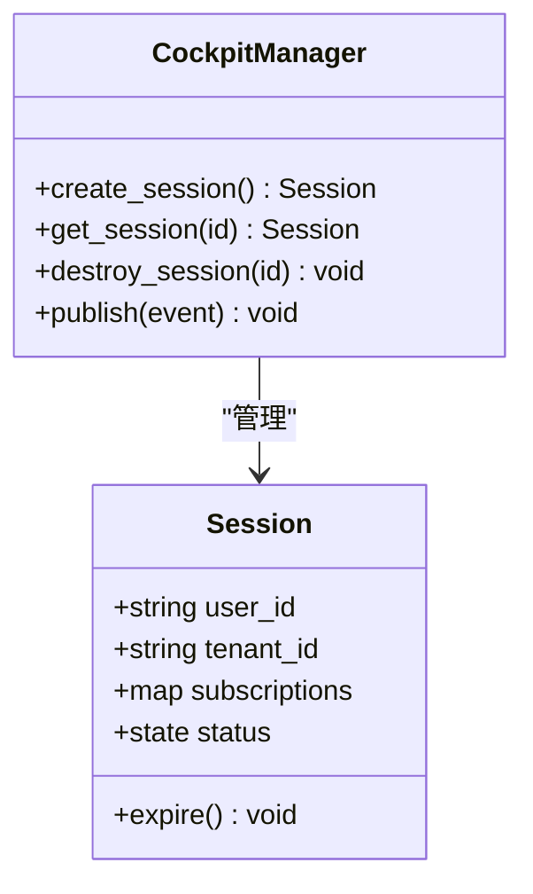

图表来源
- [backend_design/nexus/core/cockpit_manager.py](file://backend_design/nexus/core/cockpit_manager.py)
- [backend_design/nexus/middleware/session_store.py](file://backend_design/nexus/middleware/session_store.py)

章节来源
- [backend_design/nexus/core/cockpit_manager.py](file://backend_design/nexus/core/cockpit_manager.py)
- [backend_design/nexus/middleware/session_store.py](file://backend_design/nexus/middleware/session_store.py)

### 广播通知功能
- 房间模型：按场景/任务划分房间，支持一对多广播
- 权限控制：仅允许具备权限的用户加入或向房间发送消息
- 可靠性：失败重试与死信队列兜底，确保重要通知可达

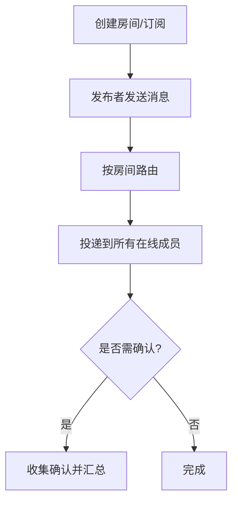

图表来源
- [backend_design/nexus_gate/internal/ws/hub.go](file://backend_design/nexus_gate/internal/ws/hub.go)
- [backend_design/nexus/api/websocket.py](file://backend_design/nexus/api/websocket.py)

章节来源
- [backend_design/nexus_gate/internal/ws/hub.go](file://backend_design/nexus_gate/internal/ws/hub.go)
- [backend_design/nexus/api/websocket.py](file://backend_design/nexus/api/websocket.py)

### 客户端实现指南
- 连接参数：指定 WebSocket 地址、携带鉴权令牌、设置子协议
- 消息封装：遵循协议类型字段、会话ID、关联ID与时间戳约定
- 重连策略：指数退避+抖动，结合心跳超时信号触发
- 错误处理：区分网络错误、鉴权失败、业务错误，分别采取不同恢复动作
- 性能优化：批量发送、压缩大负载、按需订阅减少冗余流量

章节来源
- [backend_design/nexus_gate/internal/ws/hub.go](file://backend_design/nexus_gate/internal/ws/hub.go)
- [backend_design/nexus/api/websocket.py](file://backend_design/nexus/api/websocket.py)
- [backend_design/nexus/models/schemas.py](file://backend_design/nexus/models/schemas.py)

### 错误处理策略
- 连接级错误：网络抖动、证书问题、端口不可达，采用重连与告警
- 鉴权错误：Token 过期/无效，引导刷新并重试
- 业务错误：参数校验失败、权限不足、资源不存在，返回明确错误码与修复建议
- 优雅降级：当下游服务不可用时，返回缓存或默认值，保障用户体验

章节来源
- [backend_design/nexus_gate/internal/auth/jwt.go](file://backend_design/nexus_gate/internal/auth/jwt.go)
- [backend_design/nexus/api/websocket.py](file://backend_design/nexus/api/websocket.py)

### 性能监控方案
- 指标项：连接数、消息吞吐、端到端延迟、错误率、CPU/内存占用
- 采集点：网关握手、后端处理、领域模块执行、I/O 读写
- 可视化：通过 Grafana 面板展示趋势与告警阈值
- 采样与降采样：对高频指标进行聚合与采样，降低存储压力

章节来源
- [backend_design/nexus/observability/cockpit_metrics.py](file://backend_design/nexus/observability/cockpit_metrics.py)

## 依赖关系分析
- 网关依赖鉴权与 gRPC 协议定义，负责高并发接入与转发
- 后端依赖会话存储与指标系统，负责业务编排与可观测性
- 前端依赖事件库进行订阅与渲染，关注体验与稳定性

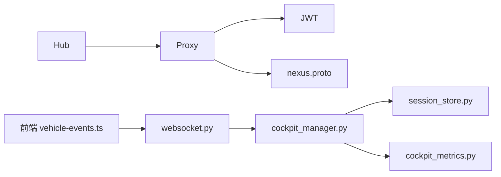

图表来源
- [backend_design/nexus_gate/internal/ws/hub.go](file://backend_design/nexus_gate/internal/ws/hub.go)
- [backend_design/nexus_gate/internal/proxy/proxy.go](file://backend_design/nexus_gate/internal/proxy/proxy.go)
- [backend_design/nexus_gate/internal/auth/jwt.go](file://backend_design/nexus_gate/internal/auth/jwt.go)
- [backend_design/nexus_gate/proto/nexus.proto](file://backend_design/nexus_gate/proto/nexus.proto)
- [backend_design/nexus/api/websocket.py](file://backend_design/nexus/api/websocket.py)
- [backend_design/nexus/core/cockpit_manager.py](file://backend_design/nexus/core/cockpit_manager.py)
- [backend_design/nexus/middleware/session_store.py](file://backend_design/nexus/middleware/session_store.py)
- [backend_design/nexus/observability/cockpit_metrics.py](file://backend_design/nexus/observability/cockpit_metrics.py)
- [frontend_design/src/lib/vehicle-events.ts](file://frontend_design/src/lib/vehicle-events.ts)

章节来源
- [backend_design/nexus_gate/internal/ws/hub.go](file://backend_design/nexus_gate/internal/ws/hub.go)
- [backend_design/nexus_gate/internal/proxy/proxy.go](file://backend_design/nexus_gate/internal/proxy/proxy.go)
- [backend_design/nexus_gate/internal/auth/jwt.go](file://backend_design/nexus_gate/internal/auth/jwt.go)
- [backend_design/nexus_gate/proto/nexus.proto](file://backend_design/nexus_gate/proto/nexus.proto)
- [backend_design/nexus/api/websocket.py](file://backend_design/nexus/api/websocket.py)
- [backend_design/nexus/core/cockpit_manager.py](file://backend_design/nexus/core/cockpit_manager.py)
- [backend_design/nexus/middleware/session_store.py](file://backend_design/nexus/middleware/session_store.py)
- [backend_design/nexus/observability/cockpit_metrics.py](file://backend_design/nexus/observability/cockpit_metrics.py)
- [frontend_design/src/lib/vehicle-events.ts](file://frontend_design/src/lib/vehicle-events.ts)

## 性能考虑
- 连接池与复用：合理设置最大连接数与空闲回收策略
- 背压与限流：在高负载下限制消息速率，保护后端稳定
- 批处理与合并：对高频小消息进行合并，降低序列化与网络开销
- 压缩与编码：对大负载启用压缩，权衡 CPU 与带宽
- 水平扩展：网关无状态化，后端通过会话存储共享路由信息

[本节为通用指导，不直接分析具体文件]

## 故障排查指南
- 连接失败：检查鉴权令牌有效性、网络连通性与证书配置
- 心跳超时：确认客户端心跳发送频率与服务端阈值匹配
- 消息丢失：核对订阅关系、房间权限与路由规则
- 性能瓶颈：观察指标面板，定位热点路径与慢查询
- 日志定位：结合会话ID与关联ID追踪完整链路

章节来源
- [backend_design/nexus_gate/internal/auth/jwt.go](file://backend_design/nexus_gate/internal/auth/jwt.go)
- [backend_design/nexus_gate/internal/ws/hub.go](file://backend_design/nexus_gate/internal/ws/hub.go)
- [backend_design/nexus/api/websocket.py](file://backend_design/nexus/api/websocket.py)
- [backend_design/nexus/observability/cockpit_metrics.py](file://backend_design/nexus/observability/cockpit_metrics.py)

## 结论
NexusCockpit 的 WebSocket 实时通信通过网关与应用服务的分层协作，实现了高可靠、可扩展的实时能力。其事件驱动架构与完善的监控体系，为车辆状态推送、语音流式交互与多用户协作提供了坚实基础。建议在后续迭代中持续优化心跳与重连策略、完善错误语义与可观测性，以提升整体稳定性与用户体验。

[本节为总结性内容，不直接分析具体文件]

## 附录
- 协议参考：nexus.proto 定义了网关与后端之间的消息结构与类型
- 前端事件库：vehicle-events.ts 提供订阅与渲染的便捷接口
- 指标面板：cockpit_metrics.py 暴露关键指标，便于可视化与告警

章节来源
- [backend_design/nexus_gate/proto/nexus.proto](file://backend_design/nexus_gate/proto/nexus.proto)
- [frontend_design/src/lib/vehicle-events.ts](file://frontend_design/src/lib/vehicle-events.ts)
- [backend_design/nexus/observability/cockpit_metrics.py](file://backend_design/nexus/observability/cockpit_metrics.py)