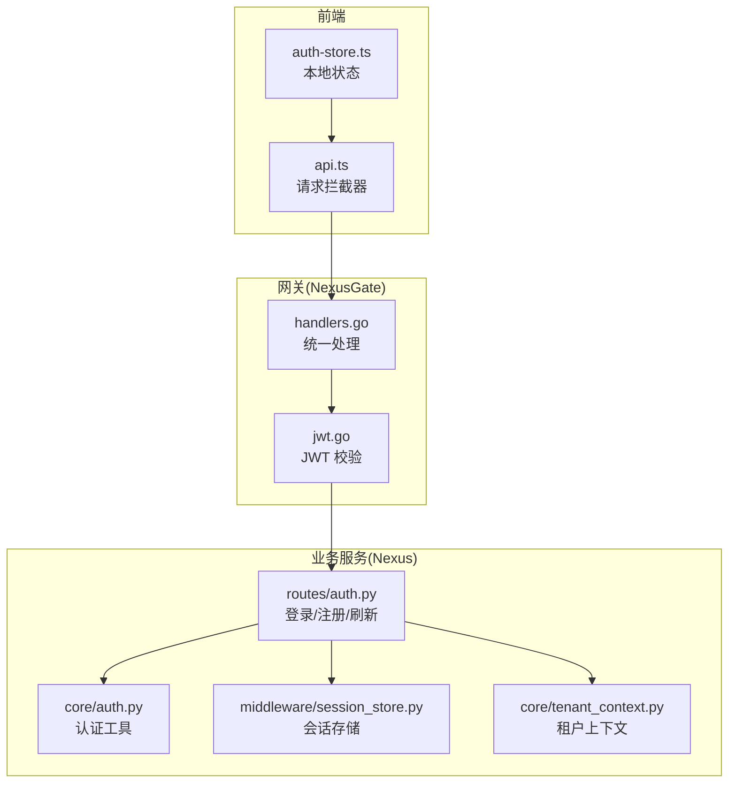
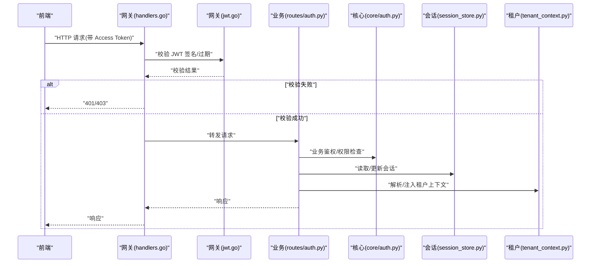
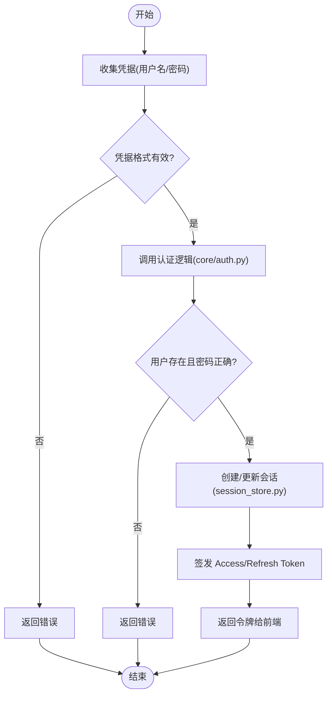
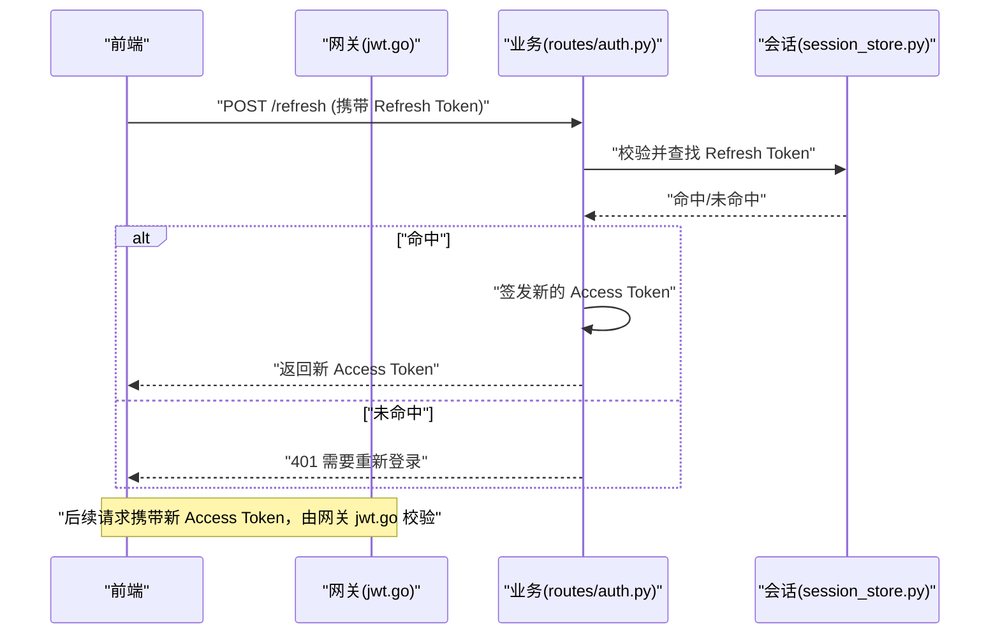
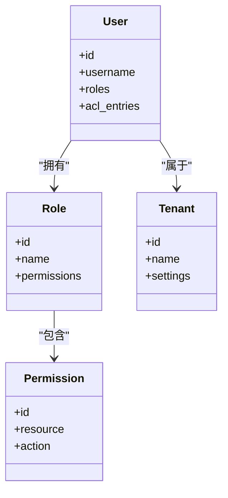
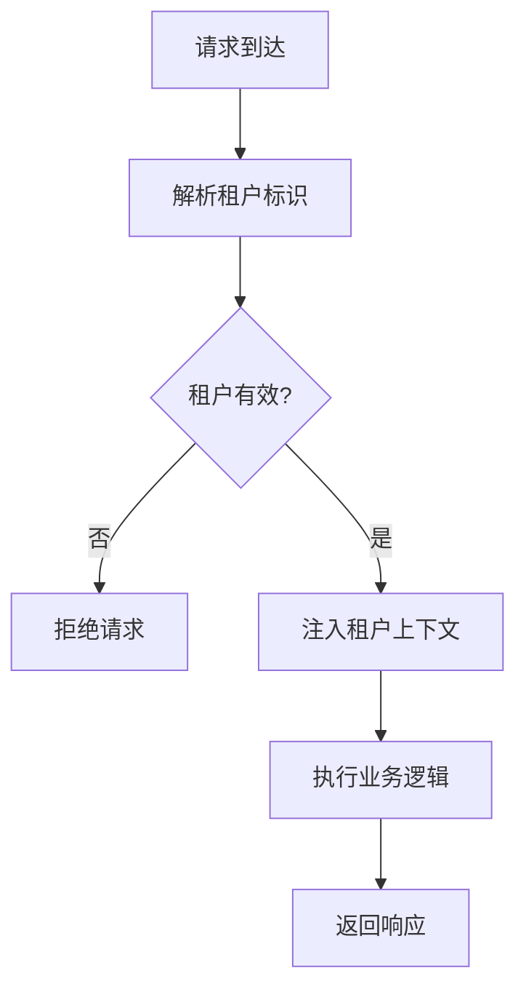
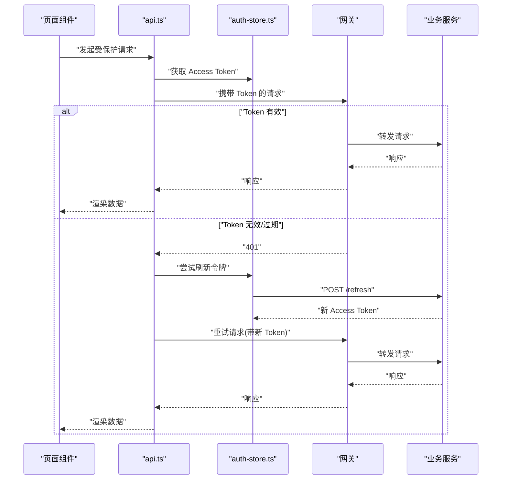
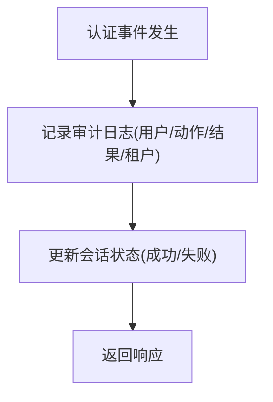
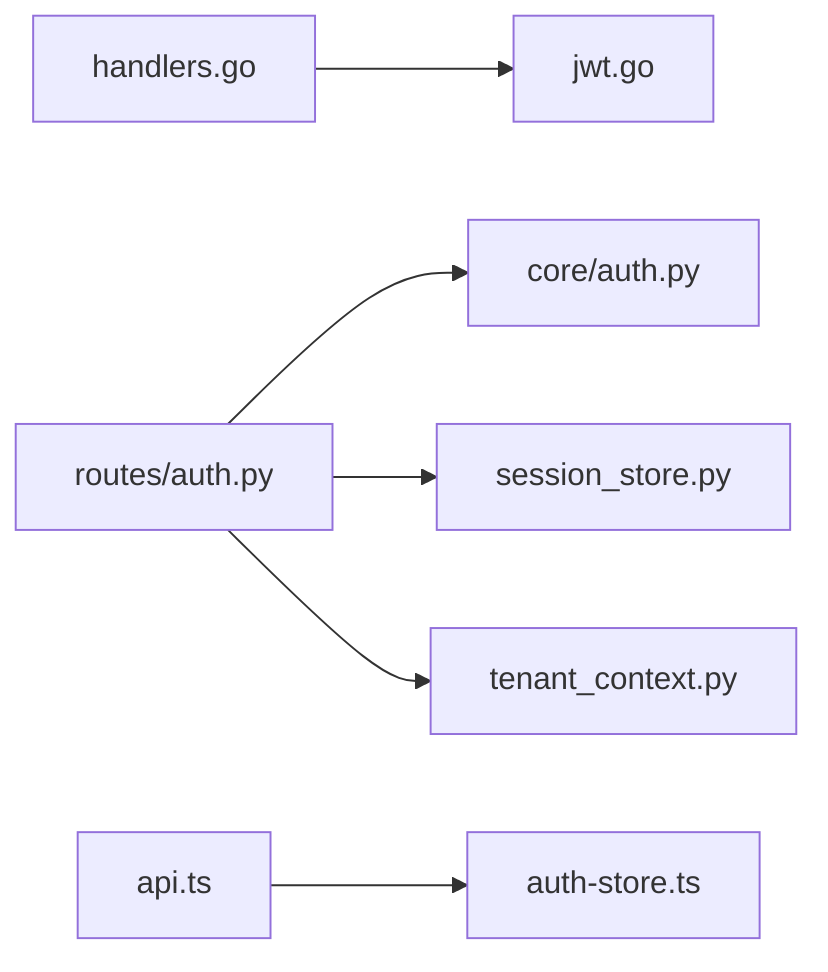

# 认证与授权

<cite>
**本文引用的文件**   
- [backend_design/nexus/api/routes/auth.py](file://backend_design/nexus/api/routes/auth.py)
- [backend_design/nexus/core/auth.py](file://backend_design/nexus/core/auth.py)
- [backend_design/nexus/core/tenant_context.py](file://backend_design/nexus/core/tenant_context.py)
- [backend_design/nexus/middleware/session_store.py](file://backend_design/nexus/middleware/session_store.py)
- [backend_design/nexus_gate/internal/auth/jwt.go](file://backend_design/nexus_gate/internal/auth/jwt.go)
- [backend_design/nexus_gate/internal/handlers/handlers.go](file://backend_design/nexus_gate/internal/handlers/handlers.go)
- [frontend_design/src/stores/auth-store.ts](file://frontend_design/src/stores/auth-store.ts)
- [frontend_design/src/lib/api.ts](file://frontend_design/src/lib/api.ts)
</cite>

## 目录
1. [简介](#简介)
2. [项目结构](#项目结构)
3. [核心组件](#核心组件)
4. [架构总览](#架构总览)
5. [详细组件分析](#详细组件分析)
6. [依赖关系分析](#依赖关系分析)
7. [性能考虑](#性能考虑)
8. [故障排查指南](#故障排查指南)
9. [结论](#结论)
10. [附录](#附录)

## 简介
本文件面向 NexusCockpit 的认证与授权体系，覆盖以下主题：
- JWT 令牌的生成、校验与刷新策略
- 用户身份认证流程（登录/注册）
- 权限控制模型与访问控制列表（ACL）
- 多租户隔离机制
- 前端鉴权拦截器与后端中间件实现
- 安全审计日志与安全配置建议
- 常见安全问题防护与合规性要求

## 项目结构
认证与授权相关代码主要分布在以下位置：
- 网关层（Go）：负责入口鉴权、JWT 校验与转发
  - backend_design/nexus_gate/internal/auth/jwt.go
  - backend_design/nexus_gate/internal/handlers/handlers.go
- 业务服务层（Python/FastAPI）：提供认证 API、会话存储、租户上下文等
  - backend_design/nexus/api/routes/auth.py
  - backend_design/nexus/core/auth.py
  - backend_design/nexus/middleware/session_store.py
  - backend_design/nexus/core/tenant_context.py
- 前端（Next.js）：本地状态管理、请求拦截与令牌注入
  - frontend_design/src/stores/auth-store.ts
  - frontend_design/src/lib/api.ts

**图表来源**
- [backend_design/nexus_gate/internal/handlers/handlers.go](file://backend_design/nexus_gate/internal/handlers/handlers.go)
- [backend_design/nexus_gate/internal/auth/jwt.go](file://backend_design/nexus_gate/internal/auth/jwt.go)
- [backend_design/nexus/api/routes/auth.py](file://backend_design/nexus/api/routes/auth.py)
- [backend_design/nexus/core/auth.py](file://backend_design/nexus/core/auth.py)
- [backend_design/nexus/middleware/session_store.py](file://backend_design/nexus/middleware/session_store.py)
- [backend_design/nexus/core/tenant_context.py](file://backend_design/nexus/core/tenant_context.py)
- [frontend_design/src/lib/api.ts](file://frontend_design/src/lib/api.ts)
- [frontend_design/src/stores/auth-store.ts](file://frontend_design/src/stores/auth-store.ts)

**章节来源**
- [backend_design/nexus/api/routes/auth.py](file://backend_design/nexus/api/routes/auth.py)
- [backend_design/nexus/core/auth.py](file://backend_design/nexus/core/auth.py)
- [backend_design/nexus/core/tenant_context.py](file://backend_design/nexus/core/tenant_context.py)
- [backend_design/nexus/middleware/session_store.py](file://backend_design/nexus/middleware/session_store.py)
- [backend_design/nexus_gate/internal/auth/jwt.go](file://backend_design/nexus_gate/internal/auth/jwt.go)
- [backend_design/nexus_gate/internal/handlers/handlers.go](file://backend_design/nexus_gate/internal/handlers/handlers.go)
- [frontend_design/src/stores/auth-store.ts](file://frontend_design/src/stores/auth-store.ts)
- [frontend_design/src/lib/api.ts](file://frontend_design/src/lib/api.ts)

## 核心组件
- 网关鉴权（NexusGate）
  - 职责：接收前端请求，校验 JWT，必要时转发至业务服务；对未认证请求进行拒绝或重定向。
  - 关键文件：
    - [backend_design/nexus_gate/internal/auth/jwt.go](file://backend_design/nexus_gate/internal/auth/jwt.go)
    - [backend_design/nexus_gate/internal/handlers/handlers.go](file://backend_design/nexus_gate/internal/handlers/handlers.go)
- 认证路由（Nexus 业务服务）
  - 职责：提供登录、注册、令牌刷新等接口；维护会话与用户信息；写入审计日志。
  - 关键文件：
    - [backend_design/nexus/api/routes/auth.py](file://backend_design/nexus/api/routes/auth.py)
    - [backend_design/nexus/core/auth.py](file://backend_design/nexus/core/auth.py)
- 会话存储
  - 职责：持久化会话数据（如刷新令牌、黑名单），支撑无状态 JWT 的扩展能力。
  - 关键文件：
    - [backend_design/nexus/middleware/session_store.py](file://backend_design/nexus/middleware/session_store.py)
- 租户上下文
  - 职责：解析并注入当前租户标识，确保数据与资源的多租户隔离。
  - 关键文件：
    - [backend_design/nexus/core/tenant_context.py](file://backend_design/nexus/core/tenant_context.py)
- 前端鉴权
  - 职责：在请求前附加令牌、处理 401/403、刷新令牌、维护本地登录态。
  - 关键文件：
    - [frontend_design/src/lib/api.ts](file://frontend_design/src/lib/api.ts)
    - [frontend_design/src/stores/auth-store.ts](file://frontend_design/src/stores/auth-store.ts)

**章节来源**
- [backend_design/nexus_gate/internal/auth/jwt.go](file://backend_design/nexus_gate/internal/auth/jwt.go)
- [backend_design/nexus_gate/internal/handlers/handlers.go](file://backend_design/nexus_gate/internal/handlers/handlers.go)
- [backend_design/nexus/api/routes/auth.py](file://backend_design/nexus/api/routes/auth.py)
- [backend_design/nexus/core/auth.py](file://backend_design/nexus/core/auth.py)
- [backend_design/nexus/middleware/session_store.py](file://backend_design/nexus/middleware/session_store.py)
- [backend_design/nexus/core/tenant_context.py](file://backend_design/nexus/core/tenant_context.py)
- [frontend_design/src/lib/api.ts](file://frontend_design/src/lib/api.ts)
- [frontend_design/src/stores/auth-store.ts](file://frontend_design/src/stores/auth-store.ts)

## 架构总览
整体认证链路如下：
- 前端通过 api.ts 发起请求，自动携带 Access Token。
- 网关 handlers.go 将请求路由到 jwt.go 进行签名与过期校验。
- 校验通过后进入业务服务 routes/auth.py，结合 core/auth.py 完成业务鉴权。
- 会话与刷新令牌由 session_store.py 管理。
- tenant_context.py 为每个请求注入租户上下文，实现多租户隔离。

**图表来源**
- [backend_design/nexus_gate/internal/handlers/handlers.go](file://backend_design/nexus_gate/internal/handlers/handlers.go)
- [backend_design/nexus_gate/internal/auth/jwt.go](file://backend_design/nexus_gate/internal/auth/jwt.go)
- [backend_design/nexus/api/routes/auth.py](file://backend_design/nexus/api/routes/auth.py)
- [backend_design/nexus/core/auth.py](file://backend_design/nexus/core/auth.py)
- [backend_design/nexus/middleware/session_store.py](file://backend_design/nexus/middleware/session_store.py)
- [backend_design/nexus/core/tenant_context.py](file://backend_design/nexus/core/tenant_context.py)

## 详细组件分析

### 登录与注册流程
- 前端调用登录/注册接口，提交用户名/密码或其他凭据。
- 网关放行认证端点，进入业务服务 routes/auth.py。
- 业务服务使用 core/auth.py 验证凭据，创建或更新会话（session_store.py）。
- 返回 Access Token（及可选 Refresh Token），前端存入 auth-store.ts 并在后续请求中携带。

**图表来源**
- [backend_design/nexus/api/routes/auth.py](file://backend_design/nexus/api/routes/auth.py)
- [backend_design/nexus/core/auth.py](file://backend_design/nexus/core/auth.py)
- [backend_design/nexus/middleware/session_store.py](file://backend_design/nexus/middleware/session_store.py)
- [frontend_design/src/stores/auth-store.ts](file://frontend_design/src/stores/auth-store.ts)

**章节来源**
- [backend_design/nexus/api/routes/auth.py](file://backend_design/nexus/api/routes/auth.py)
- [backend_design/nexus/core/auth.py](file://backend_design/nexus/core/auth.py)
- [backend_design/nexus/middleware/session_store.py](file://backend_design/nexus/middleware/session_store.py)
- [frontend_design/src/stores/auth-store.ts](file://frontend_design/src/stores/auth-store.ts)

### JWT 令牌生成与验证
- 生成：业务服务在认证成功时签发 Access Token（短生命周期）与可选 Refresh Token（长生命周期）。
- 验证：网关层 jwt.go 对每次请求进行签名与过期校验，避免业务服务重复校验。
- 刷新：前端在 Access Token 过期前或收到 401 时，使用 Refresh Token 换取新 Access Token。

**图表来源**
- [backend_design/nexus/api/routes/auth.py](file://backend_design/nexus/api/routes/auth.py)
- [backend_design/nexus/middleware/session_store.py](file://backend_design/nexus/middleware/session_store.py)
- [backend_design/nexus_gate/internal/auth/jwt.go](file://backend_design/nexus_gate/internal/auth/jwt.go)

**章节来源**
- [backend_design/nexus/api/routes/auth.py](file://backend_design/nexus/api/routes/auth.py)
- [backend_design/nexus/middleware/session_store.py](file://backend_design/nexus/middleware/session_store.py)
- [backend_design/nexus_gate/internal/auth/jwt.go](file://backend_design/nexus_gate/internal/auth/jwt.go)

### 权限控制模型与访问控制列表（ACL）
- 角色与权限：基于角色的访问控制（RBAC），用户具备若干角色，角色绑定一组权限。
- ACL：在资源级别定义访问控制列表，用于细粒度控制（如按租户、部门、项目）。
- 鉴权流程：在业务层 core/auth.py 中根据当前用户角色与 ACL 规则判断是否允许访问。

**图表来源**
- [backend_design/nexus/core/auth.py](file://backend_design/nexus/core/auth.py)
- [backend_design/nexus/core/tenant_context.py](file://backend_design/nexus/core/tenant_context.py)

**章节来源**
- [backend_design/nexus/core/auth.py](file://backend_design/nexus/core/auth.py)
- [backend_design/nexus/core/tenant_context.py](file://backend_design/nexus/core/tenant_context.py)

### 多租户隔离机制
- 租户识别：从请求头、子域名或路径参数解析租户标识。
- 上下文注入：tenant_context.py 将租户 ID 注入到当前请求上下文，供后续查询与操作使用。
- 数据隔离：所有数据库查询与资源访问需带上租户过滤条件，防止跨租户数据泄露。

**图表来源**
- [backend_design/nexus/core/tenant_context.py](file://backend_design/nexus/core/tenant_context.py)

**章节来源**
- [backend_design/nexus/core/tenant_context.py](file://backend_design/nexus/core/tenant_context.py)

### 前端鉴权拦截器
- 请求拦截：api.ts 在发送请求前自动附加 Access Token。
- 错误处理：捕获 401/403，触发刷新令牌或跳转登录页。
- 本地状态：auth-store.ts 管理登录态、令牌缓存与过期时间。

**图表来源**
- [frontend_design/src/lib/api.ts](file://frontend_design/src/lib/api.ts)
- [frontend_design/src/stores/auth-store.ts](file://frontend_design/src/stores/auth-store.ts)
- [backend_design/nexus/api/routes/auth.py](file://backend_design/nexus/api/routes/auth.py)
- [backend_design/nexus_gate/internal/handlers/handlers.go](file://backend_design/nexus_gate/internal/handlers/handlers.go)

**章节来源**
- [frontend_design/src/lib/api.ts](file://frontend_design/src/lib/api.ts)
- [frontend_design/src/stores/auth-store.ts](file://frontend_design/src/stores/auth-store.ts)
- [backend_design/nexus/api/routes/auth.py](file://backend_design/nexus/api/routes/auth.py)
- [backend_design/nexus_gate/internal/handlers/handlers.go](file://backend_design/nexus_gate/internal/handlers/handlers.go)

### 后端中间件与审计日志
- 中间件：session_store.py 负责会话存取、黑名单管理与刷新令牌校验。
- 审计日志：在认证关键事件（登录成功/失败、刷新、注销）记录结构化日志，便于追踪与合规审计。

**图表来源**
- [backend_design/nexus/middleware/session_store.py](file://backend_design/nexus/middleware/session_store.py)
- [backend_design/nexus/api/routes/auth.py](file://backend_design/nexus/api/routes/auth.py)

**章节来源**
- [backend_design/nexus/middleware/session_store.py](file://backend_design/nexus/middleware/session_store.py)
- [backend_design/nexus/api/routes/auth.py](file://backend_design/nexus/api/routes/auth.py)

## 依赖关系分析
- 网关依赖：
  - handlers.go 依赖 jwt.go 进行令牌校验。
- 业务服务依赖：
  - routes/auth.py 依赖 core/auth.py 进行认证与权限判定。
  - routes/auth.py 依赖 session_store.py 进行会话与刷新令牌管理。
  - routes/auth.py 依赖 tenant_context.py 注入租户上下文。
- 前端依赖：
  - api.ts 依赖 auth-store.ts 管理令牌与登录态。

**图表来源**
- [backend_design/nexus_gate/internal/handlers/handlers.go](file://backend_design/nexus_gate/internal/handlers/handlers.go)
- [backend_design/nexus_gate/internal/auth/jwt.go](file://backend_design/nexus_gate/internal/auth/jwt.go)
- [backend_design/nexus/api/routes/auth.py](file://backend_design/nexus/api/routes/auth.py)
- [backend_design/nexus/core/auth.py](file://backend_design/nexus/core/auth.py)
- [backend_design/nexus/middleware/session_store.py](file://backend_design/nexus/middleware/session_store.py)
- [backend_design/nexus/core/tenant_context.py](file://backend_design/nexus/core/tenant_context.py)
- [frontend_design/src/lib/api.ts](file://frontend_design/src/lib/api.ts)
- [frontend_design/src/stores/auth-store.ts](file://frontend_design/src/stores/auth-store.ts)

**章节来源**
- [backend_design/nexus_gate/internal/handlers/handlers.go](file://backend_design/nexus_gate/internal/handlers/handlers.go)
- [backend_design/nexus_gate/internal/auth/jwt.go](file://backend_design/nexus_gate/internal/auth/jwt.go)
- [backend_design/nexus/api/routes/auth.py](file://backend_design/nexus/api/routes/auth.py)
- [backend_design/nexus/core/auth.py](file://backend_design/nexus/core/auth.py)
- [backend_design/nexus/middleware/session_store.py](file://backend_design/nexus/middleware/session_store.py)
- [backend_design/nexus/core/tenant_context.py](file://backend_design/nexus/core/tenant_context.py)
- [frontend_design/src/lib/api.ts](file://frontend_design/src/lib/api.ts)
- [frontend_design/src/stores/auth-store.ts](file://frontend_design/src/stores/auth-store.ts)

## 性能考虑
- 网关层集中校验 JWT，减少业务服务重复计算。
- 刷新令牌采用短时缓存与快速查找，降低会话存储压力。
- 前端在令牌即将过期前主动刷新，避免频繁 401 重试。
- 审计日志异步写入，避免阻塞主流程。

[本节为通用指导，不直接分析具体文件]

## 故障排查指南
- 401 未认证
  - 检查前端是否在请求头携带 Access Token。
  - 确认网关 jwt.go 是否成功校验签名与过期时间。
  - 若刷新失败，检查 session_store.py 中 Refresh Token 是否存在且未被吊销。
- 403 无权限
  - 检查用户角色与 ACL 配置是否正确。
  - 确认 tenant_context.py 注入的租户上下文是否与资源归属一致。
- 登录失败
  - 核对 core/auth.py 中的凭据校验逻辑与用户数据一致性。
  - 查看审计日志定位失败原因（如密码错误、账户锁定）。

**章节来源**
- [backend_design/nexus_gate/internal/auth/jwt.go](file://backend_design/nexus_gate/internal/auth/jwt.go)
- [backend_design/nexus/middleware/session_store.py](file://backend_design/nexus/middleware/session_store.py)
- [backend_design/nexus/core/auth.py](file://backend_design/nexus/core/auth.py)
- [backend_design/nexus/core/tenant_context.py](file://backend_design/nexus/core/tenant_context.py)

## 结论
NexusCockpit 的认证与授权体系以网关层 JWT 校验为核心，结合业务层的 RBAC/ACL 与多租户上下文注入，实现了高可用、可扩展的安全访问控制。前端拦截器与会话存储共同保障令牌生命周期管理与用户体验。建议在生产环境强化密钥管理、限流与审计，以满足合规与运维需求。

[本节为总结性内容，不直接分析具体文件]

## 附录
- 安全配置建议
  - 使用强随机密钥与合理过期时间（Access Token 短、Refresh Token 长）。
  - 启用 HTTPS 与严格的安全头（HSTS、CSP、X-Frame-Options）。
  - 限制登录与刷新接口的速率，防止暴力破解。
  - 定期轮换密钥与清理过期会话。
- 常见安全问题防护
  - 防 CSRF：对敏感操作使用 SameSite Cookie 与双重提交令牌。
  - 防 XSS：输入输出编码与 CSP 策略。
  - 防重放：引入 nonce 或时间戳校验。
- 合规性要求
  - 最小权限原则与数据隔离（多租户）。
  - 完整的审计日志与可追溯性。
  - 隐私保护与数据保留策略。

[本节为通用指导，不直接分析具体文件]