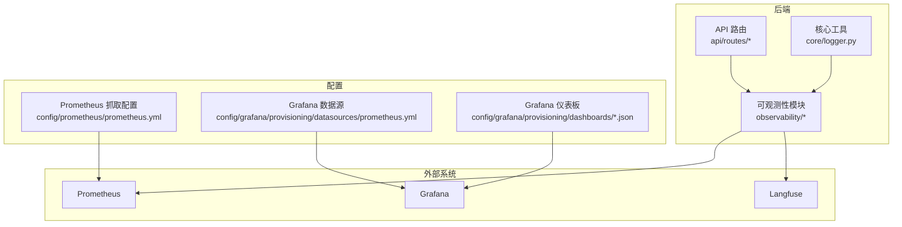
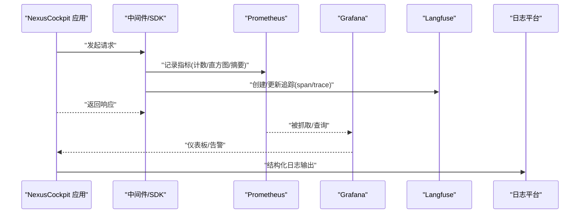
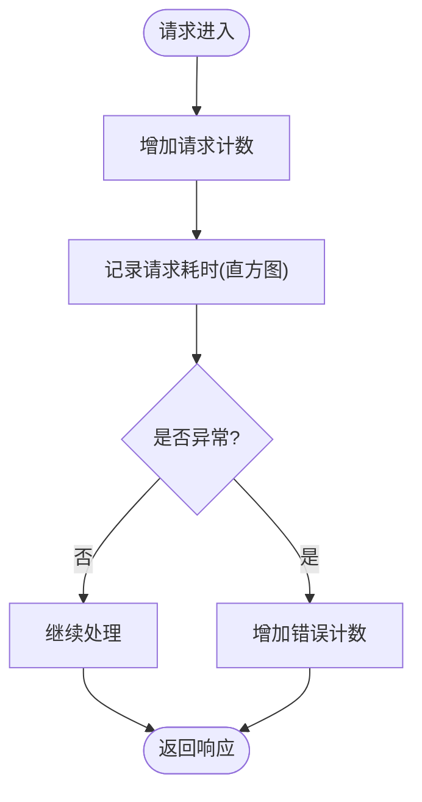
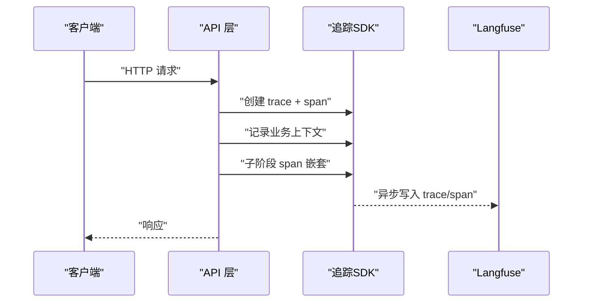
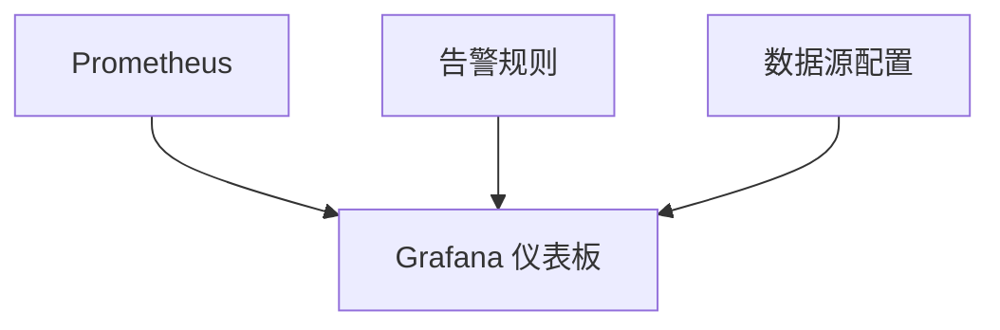
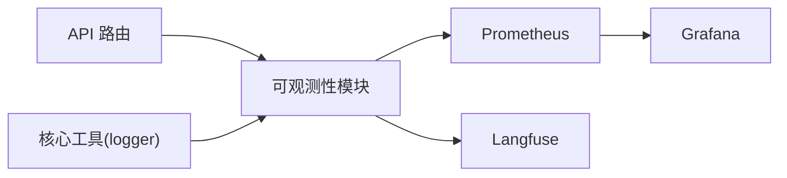

# L7 可观测性层

<cite>
**本文引用的文件**   
- [L7-observability.md](file://docs/architecture/L7-observability.md)
- [cockpit_metrics.py](file://backend_design/nexus/observability/cockpit_metrics.py)
- [metrics.py](file://backend_design/nexus/observability/metrics.py)
- [langfuse.py](file://backend_design/nexus/observability/langfuse.py)
- [data_retention.py](file://backend_design/nexus/observability/data_retention.py)
- [prometheus.yml](file://config/prometheus/prometheus.yml)
- [nexuscockpit-overview.json](file://config/grafana/provisioning/dashboards/nexuscockpit-overview.json)
- [dashboards.yml](file://config/grafana/provisioning/dashboards/dashboards.yml)
- [prometheus_datasource.yml](file://config/grafana/provisioning/datasources/prometheus.yml)
- [main.py](file://backend_design/nexus/main.py)
- [logger.py](file://backend_design/nexus/core/logger.py)
- [middleware_status.py](file://backend_design/nexus/api/routes/middleware_status.py)
</cite>

## 目录
1. [简介](#简介)
2. [项目结构](#项目结构)
3. [核心组件](#核心组件)
4. [架构总览](#架构总览)
5. [详细组件分析](#详细组件分析)
6. [依赖关系分析](#依赖关系分析)
7. [性能考量](#性能考量)
8. [故障诊断指南](#故障诊断指南)
9. [结论](#结论)
10. [附录：自定义监控指标开发指南](#附录自定义监控指标开发指南)

## 简介
本章节面向 NexusCockpit 的 L7 可观测性层，目标是构建一套覆盖“指标采集、分布式追踪、日志聚合、可视化与告警”的全链路可观测体系。该层以 Prometheus 作为指标存储与抓取中心，结合 Grafana 进行可视化与告警；通过 Langfuse 集成实现大模型调用链路的端到端追踪；在业务侧提供统一的指标与日志埋点能力，并配套数据保留策略与容量规划建议，帮助团队快速定位问题、评估系统健康度与演进趋势。

## 项目结构
L7 可观测性层涉及后端代码、配置与文档三大部分：
- 后端可观测性模块：位于 backend_design/nexus/observability 下，包含指标定义、Langfuse 集成、数据保留策略等。
- 配置：Prometheus 抓取配置、Grafana 数据源与仪表板预置。
- 文档：架构文档中专门描述 L7 层的整体设计思路与要点。

图表来源
- [main.py:1-200](file://backend_design/nexus/main.py#L1-L200)
- [prometheus.yml:1-200](file://config/prometheus/prometheus.yml#L1-L200)
- [prometheus_datasource.yml:1-200](file://config/grafana/provisioning/datasources/prometheus.yml#L1-L200)
- [nexuscockpit-overview.json:1-200](file://config/grafana/provisioning/dashboards/nexuscockpit-overview.json#L1-L200)

章节来源
- [L7-observability.md:1-200](file://docs/architecture/L7-observability.md#L1-L200)
- [main.py:1-200](file://backend_design/nexus/main.py#L1-L200)
- [prometheus.yml:1-200](file://config/prometheus/prometheus.yml#L1-L200)
- [prometheus_datasource.yml:1-200](file://config/grafana/provisioning/datasources/prometheus.yml#L1-L200)
- [nexuscockpit-overview.json:1-200](file://config/grafana/provisioning/dashboards/nexuscockpit-overview.json#L1-L200)

## 核心组件
本节聚焦可观测性层的关键模块与职责划分：
- 指标子系统：统一封装 Prometheus 指标（应用级、业务级、性能统计），并提供便捷埋点 API。
- 分布式追踪：基于 Langfuse 的大模型调用链路追踪，支持请求上下文透传与延迟分析。
- 日志聚合：结构化日志输出，便于后续接入 Loki/ELK 等日志平台。
- 数据保留策略：对指标与追踪数据进行生命周期管理，控制存储成本与查询性能。
- 可视化与告警：Grafana 仪表板与 Prometheus 告警规则，支撑日常巡检与异常发现。

章节来源
- [cockpit_metrics.py:1-200](file://backend_design/nexus/observability/cockpit_metrics.py#L1-L200)
- [metrics.py:1-200](file://backend_design/nexus/observability/metrics.py#L1-L200)
- [langfuse.py:1-200](file://backend_design/nexus/observability/langfuse.py#L1-L200)
- [data_retention.py:1-200](file://backend_design/nexus/observability/data_retention.py#L1-L200)
- [logger.py:1-200](file://backend_design/nexus/core/logger.py#L1-L200)

## 架构总览
下图展示了 L7 可观测性层的数据流与组件交互：应用服务通过中间件与 SDK 埋点，将指标上报至 Prometheus，追踪数据写入 Langfuse；Grafana 从 Prometheus 拉取指标进行展示与告警；日志经统一格式输出后由日志平台聚合。

图表来源
- [main.py:1-200](file://backend_design/nexus/main.py#L1-L200)
- [prometheus.yml:1-200](file://config/prometheus/prometheus.yml#L1-L200)
- [prometheus_datasource.yml:1-200](file://config/grafana/provisioning/datasources/prometheus.yml#L1-L200)
- [nexuscockpit-overview.json:1-200](file://config/grafana/provisioning/dashboards/nexuscockpit-overview.json#L1-L200)

## 详细组件分析

### 指标子系统（Prometheus 指标与业务指标）
- 职责
  - 提供统一的指标注册与上报接口，包括计数器、直方图、摘要等类型。
  - 暴露标准 /metrics 端点供 Prometheus 抓取。
  - 封装常用业务指标（如请求量、错误率、耗时分布、队列长度等）。
- 关键流程
  - 启动时初始化指标集合与 HTTP 服务器。
  - 业务逻辑通过 SDK 方法埋点，自动附加标签（如租户、版本、区域）。
  - Prometheus 按周期抓取，Grafana 进行可视化与告警。
- 复杂度与优化
  - 高基数标签需审慎使用，避免 Cardinality 爆炸。
  - 直方图分桶策略应贴合业务延迟分布，减少内存占用与查询开销。
- 错误处理
  - 指标上报失败采用降级策略（本地缓冲或丢弃），确保主流程不受影响。

图表来源
- [cockpit_metrics.py:1-200](file://backend_design/nexus/observability/cockpit_metrics.py#L1-L200)
- [metrics.py:1-200](file://backend_design/nexus/observability/metrics.py#L1-L200)

章节来源
- [cockpit_metrics.py:1-200](file://backend_design/nexus/observability/cockpit_metrics.py#L1-L200)
- [metrics.py:1-200](file://backend_design/nexus/observability/metrics.py#L1-L200)

### 分布式追踪（Langfuse 集成）
- 职责
  - 为每次请求生成 trace/span，记录关键节点（网关、意图识别、RAG、LLM、TTS/ASR、车辆控制等）。
  - 关联业务上下文（用户、会话、租户、设备信息）。
  - 支持延迟分析与根因定位。
- 关键流程
  - 入口创建 trace，跨服务传递 trace_id。
  - 各阶段创建 span，记录输入输出摘要、耗时与状态码。
  - 完成后关闭 span，异步批量写入 Langfuse。
- 最佳实践
  - 仅记录必要字段，避免敏感信息泄露。
  - 合理设置采样率，平衡可观测性与成本。
  - 为关键路径添加语义化标签，便于检索与聚合。

图表来源
- [langfuse.py:1-200](file://backend_design/nexus/observability/langfuse.py#L1-L200)

章节来源
- [langfuse.py:1-200](file://backend_design/nexus/observability/langfuse.py#L1-L200)

### 日志聚合与错误追踪
- 职责
  - 统一日志格式（JSON），包含时间戳、级别、trace_id、span_id、业务键等。
  - 支持分级输出（debug/info/warn/error），便于不同环境差异化打印。
  - 与错误追踪系统集成，自动附带堆栈与上下文。
- 关键点
  - 日志脱敏：避免记录密码、密钥、PII 等敏感信息。
  - 采样与轮转：控制磁盘与网络开销。
  - 与追踪联动：通过 trace_id 串联日志与追踪。

章节来源
- [logger.py:1-200](file://backend_design/nexus/core/logger.py#L1-L200)

### 数据保留策略与容量规划
- 职责
  - 定义指标与追踪数据的保留周期、归档与清理策略。
  - 根据增长速率与查询需求，规划存储规模与索引策略。
- 建议
  - 指标：短期热数据（天/周）高精度，长期冷数据（月/季）降采样。
  - 追踪：按 trace_id 生命周期管理，过期自动清理。
  - 容量：结合 QPS、P99 延迟、标签基数估算存储与 CPU 消耗。

章节来源
- [data_retention.py:1-200](file://backend_design/nexus/observability/data_retention.py#L1-L200)

### 可视化看板与告警
- 职责
  - 提供 Grafana 仪表板，涵盖系统概览、API 性能、业务指标、资源使用等视图。
  - 配置 Prometheus 告警规则，覆盖错误率、延迟、饱和度、资源水位等维度。
- 关键配置
  - Prometheus 抓取目标与间隔。
  - Grafana 数据源指向 Prometheus。
  - 仪表板 JSON 模板与变量绑定。

图表来源
- [prometheus.yml:1-200](file://config/prometheus/prometheus.yml#L1-L200)
- [prometheus_datasource.yml:1-200](file://config/grafana/provisioning/datasources/prometheus.yml#L1-L200)
- [nexuscockpit-overview.json:1-200](file://config/grafana/provisioning/dashboards/nexuscockpit-overview.json#L1-L200)
- [dashboards.yml:1-200](file://config/grafana/provisioning/dashboards/dashboards.yml#L1-L200)

章节来源
- [prometheus.yml:1-200](file://config/prometheus/prometheus.yml#L1-L200)
- [prometheus_datasource.yml:1-200](file://config/grafana/provisioning/datasources/prometheus.yml#L1-L200)
- [nexuscockpit-overview.json:1-200](file://config/grafana/provisioning/dashboards/nexuscockpit-overview.json#L1-L200)
- [dashboards.yml:1-200](file://config/grafana/provisioning/dashboards/dashboards.yml#L1-L200)

### 中间件状态与健康检查
- 职责
  - 暴露中间件运行状态（缓存、限流、任务队列等）与基础健康检查。
  - 辅助运维快速判断子系统可用性。
- 关键点
  - 指标与状态同步刷新，避免读取陈旧数据。
  - 健康检查区分就绪与存活探针。

章节来源
- [middleware_status.py:1-200](file://backend_design/nexus/api/routes/middleware_status.py#L1-L200)

## 依赖关系分析
- 内部依赖
  - 可观测性模块被 API 路由与核心工具引用，形成“埋点—上报—可视化”的闭环。
- 外部依赖
  - Prometheus：指标抓取与存储。
  - Grafana：可视化与告警。
  - Langfuse：分布式追踪与调试。
- 耦合与内聚
  - 指标与追踪解耦，便于独立扩展与替换。
  - 日志与追踪通过 trace_id 关联，提升排障效率。

图表来源
- [main.py:1-200](file://backend_design/nexus/main.py#L1-L200)
- [cockpit_metrics.py:1-200](file://backend_design/nexus/observability/cockpit_metrics.py#L1-L200)
- [langfuse.py:1-200](file://backend_design/nexus/observability/langfuse.py#L1-L200)
- [prometheus.yml:1-200](file://config/prometheus/prometheus.yml#L1-L200)
- [prometheus_datasource.yml:1-200](file://config/grafana/provisioning/datasources/prometheus.yml#L1-L200)

章节来源
- [main.py:1-200](file://backend_design/nexus/main.py#L1-L200)
- [cockpit_metrics.py:1-200](file://backend_design/nexus/observability/cockpit_metrics.py#L1-L200)
- [langfuse.py:1-200](file://backend_design/nexus/observability/langfuse.py#L1-L200)
- [prometheus.yml:1-200](file://config/prometheus/prometheus.yml#L1-L200)
- [prometheus_datasource.yml:1-200](file://config/grafana/provisioning/datasources/prometheus.yml#L1-L200)

## 性能考量
- 指标采集
  - 控制标签基数，避免高基数字段（如用户 ID）直接作为标签。
  - 合理设置直方图分桶，减少内存与查询压力。
  - 批量上报与异步写入，降低主流程阻塞。
- 分布式追踪
  - 采样策略：在高流量场景下按比例采样，保留关键路径全量。
  - Span 粒度：避免过细导致数据膨胀，聚焦关键节点。
- 日志聚合
  - 分级输出与采样，生产环境默认 INFO 及以上。
  - 结构化 JSON 输出，便于解析与过滤。
- 容量规划
  - 依据 QPS、P99 延迟、标签基数估算存储与 CPU。
  - 冷热分层：短期高精度、长期降采样。

[本节为通用指导，不直接分析具体文件]

## 故障诊断指南
- 常见问题
  - 指标缺失：检查 /metrics 端点可达性与 Prometheus 抓取配置。
  - 追踪丢失：确认 trace_id 透传与 Langfuse 写入成功。
  - 日志未聚合：校验日志格式与日志平台连接。
- 排查步骤
  - 通过 Grafana 查看错误率与延迟曲线，定位异常时段。
  - 在 Langfuse 中按 trace_id 检索，分析关键 span 耗时与错误。
  - 使用结构化日志过滤 trace_id，获取完整上下文。
- 工具与技巧
  - 使用 Prometheus 查询语言进行多维聚合与对比。
  - 在 Grafana 中创建临时面板，快速验证假设。
  - 结合中间件状态接口，判断子系统健康。

章节来源
- [middleware_status.py:1-200](file://backend_design/nexus/api/routes/middleware_status.py#L1-L200)
- [logger.py:1-200](file://backend_design/nexus/core/logger.py#L1-L200)
- [langfuse.py:1-200](file://backend_design/nexus/observability/langfuse.py#L1-L200)
- [prometheus.yml:1-200](file://config/prometheus/prometheus.yml#L1-L200)
- [nexuscockpit-overview.json:1-200](file://config/grafana/provisioning/dashboards/nexuscockpit-overview.json#L1-L200)

## 结论
L7 可观测性层通过指标、追踪、日志三位一体的体系，为 NexusCockpit 提供了全面、可操作的可观测能力。配合 Grafana 与 Prometheus 的可视化与告警，以及 Langfuse 的链路追踪，团队能够快速定位问题、评估性能瓶颈并进行容量规划。遵循本文的最佳实践与开发指南，可进一步提升系统的稳定性与可维护性。

[本节为总结性内容，不直接分析具体文件]

## 附录：自定义监控指标开发指南
- 指标命名规范
  - 使用清晰的前缀与层级，如 nexus_cockpit_api_request_total。
  - 避免使用动态值作为标签名，防止基数爆炸。
- 埋点位置
  - 在 API 入口与出口分别埋点，计算请求量与耗时。
  - 在关键业务分支埋点，记录成功率与错误分类。
- 标签设计
  - 选择稳定的维度（如租户、版本、区域），避免高频变化字段。
- 直方图与摘要
  - 针对延迟类指标使用直方图，合理设置分桶边界。
  - 对需要精确百分位且低吞吐的场景考虑摘要。
- 测试与验证
  - 使用压测脚本验证指标准确性与性能影响。
  - 在 Grafana 中创建临时面板，确认数据可见与聚合正确。
- 上线与回滚
  - 灰度发布新指标，观察 Prometheus 与 Grafana 表现。
  - 准备回滚方案，确保主流程不受影响。

章节来源
- [cockpit_metrics.py:1-200](file://backend_design/nexus/observability/cockpit_metrics.py#L1-L200)
- [metrics.py:1-200](file://backend_design/nexus/observability/metrics.py#L1-L200)
- [prometheus.yml:1-200](file://config/prometheus/prometheus.yml#L1-L200)
- [nexuscockpit-overview.json:1-200](file://config/grafana/provisioning/dashboards/nexuscockpit-overview.json#L1-L200)