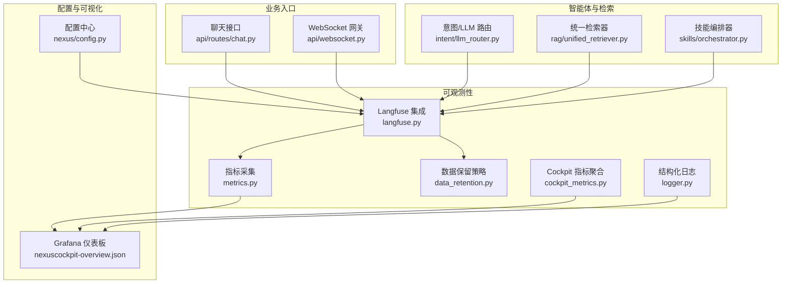
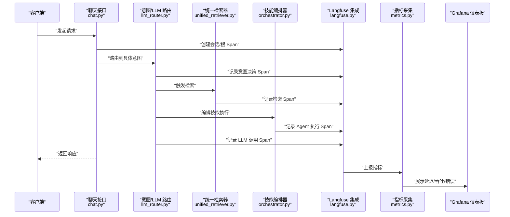
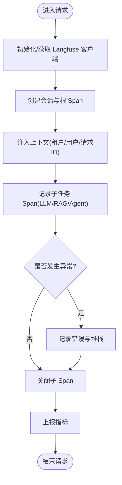
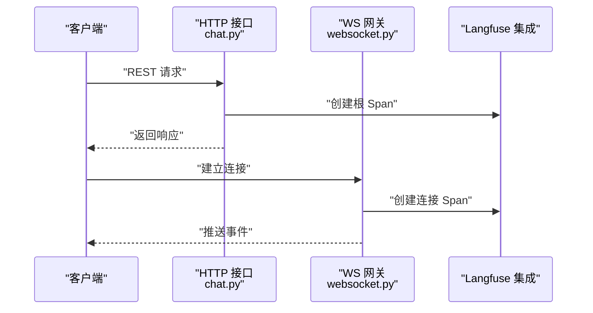
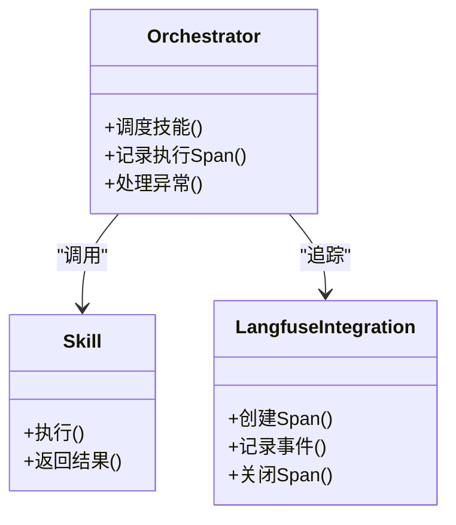
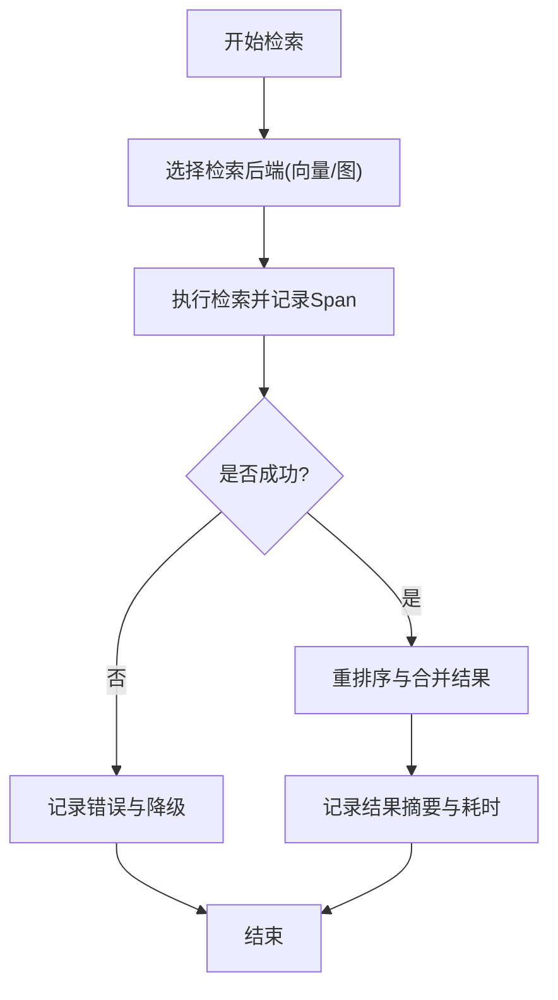
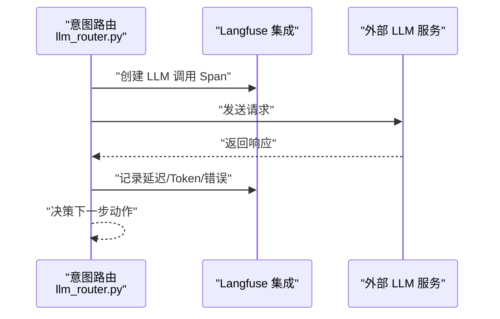
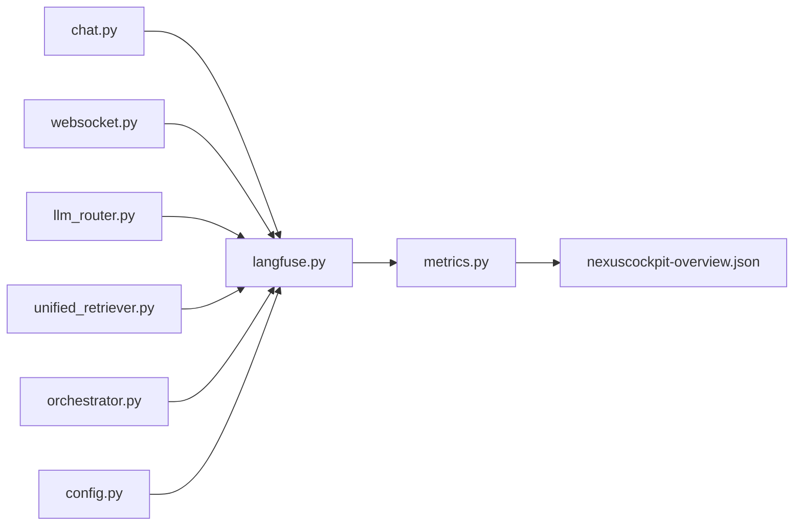

# 分布式追踪系统

<cite>
**本文引用的文件**   
- [backend_design/nexus/observability/langfuse.py](file://backend_design/nexus/observability/langfuse.py)
- [backend_design/nexus/observability/metrics.py](file://backend_design/nexus/observability/metrics.py)
- [backend_design/nexus/observability/data_retention.py](file://backend_design/nexus/observability/data_retention.py)
- [backend_design/nexus/observability/cockpit_metrics.py](file://backend_design/nexus/observability/cockpit_metrics.py)
- [backend_design/nexus/core/logger.py](file://backend_design/nexus/core/logger.py)
- [backend_design/nexus/api/routes/chat.py](file://backend_design/nexus/api/routes/chat.py)
- [backend_design/nexus/api/websocket.py](file://backend_design/nexus/api/websocket.py)
- [backend_design/nexus/intent/llm_router.py](file://backend_design/nexus/intent/llm_router.py)
- [backend_design/nexus/rag/unified_retriever.py](file://backend_design/nexus/rag/unified_retriever.py)
- [backend_design/nexus/skills/orchestrator.py](file://backend_design/nexus/skills/orchestrator.py)
- [backend_design/nexus/config.py](file://backend_design/nexus/config.py)
- [config/grafana/provisioning/dashboards/nexuscockpit-overview.json](file://config/grafana/provisioning/dashboards/nexuscockpit-overview.json)
</cite>

## 目录
1. [简介](#简介)
2. [项目结构](#项目结构)
3. [核心组件](#核心组件)
4. [架构总览](#架构总览)
5. [详细组件分析](#详细组件分析)
6. [依赖关系分析](#依赖关系分析)
7. [性能考量](#性能考量)
8. [故障排查指南](#故障排查指南)
9. [结论](#结论)
10. [附录](#附录)

## 简介
本文件面向 NexusCockpit 的分布式追踪系统，聚焦于与 Langfuse 的集成方案与落地实践。文档覆盖以下关键主题：
- 请求链路追踪、Agent 执行追踪、RAG 检索追踪、LLM 调用追踪
- 追踪数据模型、上下文传递机制、延迟分析与错误追踪
- 追踪配置、采样策略、数据保留与查询分析
- 自定义追踪点添加指南与性能分析方法

目标是帮助开发者快速理解并扩展追踪能力，同时为运维提供可观测性保障。

## 项目结构
NexusCockpit 的可观测性与追踪相关代码集中在 backend_design/nexus/observability 目录下，并与 API、意图路由、RAG、技能编排等模块协作，形成端到端追踪闭环。

图表来源
- [backend_design/nexus/observability/langfuse.py](file://backend_design/nexus/observability/langfuse.py)
- [backend_design/nexus/observability/metrics.py](file://backend_design/nexus/observability/metrics.py)
- [backend_design/nexus/observability/data_retention.py](file://backend_design/nexus/observability/data_retention.py)
- [backend_design/nexus/observability/cockpit_metrics.py](file://backend_design/nexus/observability/cockpit_metrics.py)
- [backend_design/nexus/core/logger.py](file://backend_design/nexus/core/logger.py)
- [backend_design/nexus/api/routes/chat.py](file://backend_design/nexus/api/routes/chat.py)
- [backend_design/nexus/api/websocket.py](file://backend_design/nexus/api/websocket.py)
- [backend_design/nexus/intent/llm_router.py](file://backend_design/nexus/intent/llm_router.py)
- [backend_design/nexus/rag/unified_retriever.py](file://backend_design/nexus/rag/unified_retriever.py)
- [backend_design/nexus/skills/orchestrator.py](file://backend_design/nexus/skills/orchestrator.py)
- [backend_design/nexus/config.py](file://backend_design/nexus/config.py)
- [config/grafana/provisioning/dashboards/nexuscockpit-overview.json](file://config/grafana/provisioning/dashboards/nexuscockpit-overview.json)

章节来源
- [backend_design/nexus/observability/langfuse.py](file://backend_design/nexus/observability/langfuse.py)
- [backend_design/nexus/observability/metrics.py](file://backend_design/nexus/observability/metrics.py)
- [backend_design/nexus/observability/data_retention.py](file://backend_design/nexus/observability/data_retention.py)
- [backend_design/nexus/observability/cockpit_metrics.py](file://backend_design/nexus/observability/cockpit_metrics.py)
- [backend_design/nexus/core/logger.py](file://backend_design/nexus/core/logger.py)
- [backend_design/nexus/api/routes/chat.py](file://backend_design/nexus/api/routes/chat.py)
- [backend_design/nexus/api/websocket.py](file://backend_design/nexus/api/websocket.py)
- [backend_design/nexus/intent/llm_router.py](file://backend_design/nexus/intent/llm_router.py)
- [backend_design/nexus/rag/unified_retriever.py](file://backend_design/nexus/rag/unified_retriever.py)
- [backend_design/nexus/skills/orchestrator.py](file://backend_design/nexus/skills/orchestrator.py)
- [backend_design/nexus/config.py](file://backend_design/nexus/config.py)
- [config/grafana/provisioning/dashboards/nexuscockpit-overview.json](file://config/grafana/provisioning/dashboards/nexuscockpit-overview.json)

## 核心组件
- Langfuse 集成层：负责创建和管理追踪会话、Span、事件，以及将业务上下文注入到追踪中。
- 指标采集：在关键路径埋点，输出延迟、吞吐、错误率等指标，供 Prometheus/Grafana 消费。
- 数据保留策略：定义追踪数据的生命周期管理（如按租户、时间窗口、采样率进行清理）。
- Cockpit 指标聚合：汇总各子系统指标，提供统一的监控视图。
- 结构化日志：与追踪关联，便于问题定位与根因分析。

章节来源
- [backend_design/nexus/observability/langfuse.py](file://backend_design/nexus/observability/langfuse.py)
- [backend_design/nexus/observability/metrics.py](file://backend_design/nexus/observability/metrics.py)
- [backend_design/nexus/observability/data_retention.py](file://backend_design/nexus/observability/data_retention.py)
- [backend_design/nexus/observability/cockpit_metrics.py](file://backend_design/nexus/observability/cockpit_metrics.py)
- [backend_design/nexus/core/logger.py](file://backend_design/nexus/core/logger.py)

## 架构总览
下图展示了从 HTTP/WebSocket 入口到 LLM/RAG/Agent 的完整追踪链路，以及指标与可视化的汇聚路径。

图表来源
- [backend_design/nexus/api/routes/chat.py](file://backend_design/nexus/api/routes/chat.py)
- [backend_design/nexus/intent/llm_router.py](file://backend_design/nexus/intent/llm_router.py)
- [backend_design/nexus/rag/unified_retriever.py](file://backend_design/nexus/rag/unified_retriever.py)
- [backend_design/nexus/skills/orchestrator.py](file://backend_design/nexus/skills/orchestrator.py)
- [backend_design/nexus/observability/langfuse.py](file://backend_design/nexus/observability/langfuse.py)
- [backend_design/nexus/observability/metrics.py](file://backend_design/nexus/observability/metrics.py)
- [config/grafana/provisioning/dashboards/nexuscockpit-overview.json](file://config/grafana/provisioning/dashboards/nexuscockpit-overview.json)

## 详细组件分析

### Langfuse 集成层
职责
- 初始化与连接管理：根据配置加载 Langfuse 客户端参数，建立连接池或单例实例。
- 会话与 Span 管理：为每次请求创建会话与会话级 Span，并在子任务中创建子 Span。
- 上下文传递：将租户、用户、会话 ID、请求 ID 等上下文注入到追踪事件中。
- 错误与异常捕获：自动记录异常堆栈、状态码、错误类型，并标记失败 Span。
- 采样与节流：支持按请求维度或全局采样率控制追踪开销。

关键流程
- 请求进入时创建根 Span，并在退出时关闭；子任务通过上下文传播创建子 Span。
- 对 LLM 调用、RAG 检索、Agent 执行分别打点，记录输入摘要、输出摘要、耗时、错误信息。
- 将关键指标上报至指标采集层，用于外部监控。

图表来源
- [backend_design/nexus/observability/langfuse.py](file://backend_design/nexus/observability/langfuse.py)
- [backend_design/nexus/observability/metrics.py](file://backend_design/nexus/observability/metrics.py)

章节来源
- [backend_design/nexus/observability/langfuse.py](file://backend_design/nexus/observability/langfuse.py)
- [backend_design/nexus/observability/metrics.py](file://backend_design/nexus/observability/metrics.py)

### 请求链路追踪（HTTP/WebSocket）
- HTTP 聊天接口在入口处创建根 Span，贯穿意图路由、检索、编排与 LLM 调用。
- WebSocket 网关在连接建立与消息处理阶段创建对应 Span，确保长连接的追踪连续性。
- 通过中间件或装饰器模式注入追踪上下文，避免侵入业务逻辑。

图表来源
- [backend_design/nexus/api/routes/chat.py](file://backend_design/nexus/api/routes/chat.py)
- [backend_design/nexus/api/websocket.py](file://backend_design/nexus/api/websocket.py)
- [backend_design/nexus/observability/langfuse.py](file://backend_design/nexus/observability/langfuse.py)

章节来源
- [backend_design/nexus/api/routes/chat.py](file://backend_design/nexus/api/routes/chat.py)
- [backend_design/nexus/api/websocket.py](file://backend_design/nexus/api/websocket.py)
- [backend_design/nexus/observability/langfuse.py](file://backend_design/nexus/observability/langfuse.py)

### Agent 执行追踪
- 技能编排器在调度每个技能时创建执行 Span，记录技能名称、参数摘要、结果摘要与耗时。
- 对于并行执行的技能，使用并发安全的 Span 管理，避免上下文污染。
- 当某个技能失败时，记录错误类型与重试次数，便于后续优化。

图表来源
- [backend_design/nexus/skills/orchestrator.py](file://backend_design/nexus/skills/orchestrator.py)
- [backend_design/nexus/observability/langfuse.py](file://backend_design/nexus/observability/langfuse.py)

章节来源
- [backend_design/nexus/skills/orchestrator.py](file://backend_design/nexus/skills/orchestrator.py)
- [backend_design/nexus/observability/langfuse.py](file://backend_design/nexus/observability/langfuse.py)

### RAG 检索追踪
- 统一检索器在执行向量检索、图检索、重排序等步骤时分别打点，记录召回数量、相似度阈值、重排序耗时。
- 对检索失败或超时场景进行错误追踪，并记录降级策略的执行情况。

图表来源
- [backend_design/nexus/rag/unified_retriever.py](file://backend_design/nexus/rag/unified_retriever.py)
- [backend_design/nexus/observability/langfuse.py](file://backend_design/nexus/observability/langfuse.py)

章节来源
- [backend_design/nexus/rag/unified_retriever.py](file://backend_design/nexus/rag/unified_retriever.py)
- [backend_design/nexus/observability/langfuse.py](file://backend_design/nexus/observability/langfuse.py)

### LLM 调用追踪
- 意图路由在调用 LLM 前后记录输入摘要、模型名称、版本、Token 用量、延迟与错误。
- 支持多模型切换与回退策略的追踪，便于评估不同模型的稳定性与成本。

图表来源
- [backend_design/nexus/intent/llm_router.py](file://backend_design/nexus/intent/llm_router.py)
- [backend_design/nexus/observability/langfuse.py](file://backend_design/nexus/observability/langfuse.py)

章节来源
- [backend_design/nexus/intent/llm_router.py](file://backend_design/nexus/intent/llm_router.py)
- [backend_design/nexus/observability/langfuse.py](file://backend_design/nexus/observability/langfuse.py)

### 追踪数据模型与上下文传递
- 数据模型：会话、Span、事件、标签、元数据、错误信息、指标快照。
- 上下文传递：通过请求级上下文对象在各组件间传播，确保 Span 父子关系正确。
- 安全与隐私：敏感字段脱敏，仅记录必要摘要，避免泄露用户隐私。

章节来源
- [backend_design/nexus/observability/langfuse.py](file://backend_design/nexus/observability/langfuse.py)
- [backend_design/nexus/core/logger.py](file://backend_design/nexus/core/logger.py)

### 延迟分析与错误追踪
- 延迟分析：在关键路径记录起止时间，计算端到端与各子任务的延迟分布。
- 错误追踪：捕获异常类型、堆栈、错误码，结合上下文快速定位根因。
- 告警联动：当错误率或延迟超过阈值时，触发告警并生成诊断报告。

章节来源
- [backend_design/nexus/observability/metrics.py](file://backend_design/nexus/observability/metrics.py)
- [backend_design/nexus/observability/langfuse.py](file://backend_design/nexus/observability/langfuse.py)

### 追踪配置、采样策略、数据保留与查询分析
- 配置项：服务端地址、认证密钥、默认标签、采样率、批量上报大小、超时与重试策略。
- 采样策略：按租户、用户、请求类型进行分层采样，平衡可观测性与开销。
- 数据保留：按时间窗口与租户维度清理历史数据，降低存储压力。
- 查询分析：基于索引与标签进行高效检索，支持按会话、Span、错误类型过滤。

章节来源
- [backend_design/nexus/config.py](file://backend_design/nexus/config.py)
- [backend_design/nexus/observability/data_retention.py](file://backend_design/nexus/observability/data_retention.py)
- [backend_design/nexus/observability/langfuse.py](file://backend_design/nexus/observability/langfuse.py)

### 自定义追踪点添加指南
- 确定追踪点：识别关键业务方法或外部调用边界。
- 创建 Span：在进入时创建 Span，退出时关闭，并记录输入/输出摘要与异常。
- 注入上下文：确保 Span 与当前请求上下文绑定，保持父子关系。
- 上报指标：在必要时将关键指标上报至指标采集层。
- 验证与测试：通过本地调试与压测验证追踪准确性与性能影响。

章节来源
- [backend_design/nexus/observability/langfuse.py](file://backend_design/nexus/observability/langfuse.py)
- [backend_design/nexus/observability/metrics.py](file://backend_design/nexus/observability/metrics.py)

### 性能分析方法
- 热点识别：通过延迟分位数与错误率定位慢调用与不稳定环节。
- 根因分析：结合错误堆栈与上下文，缩小问题范围。
- 容量规划：依据吞吐与资源利用率评估扩容需求。
- 回归检测：对比新版本与基线的追踪指标，及时发现性能退化。

章节来源
- [backend_design/nexus/observability/metrics.py](file://backend_design/nexus/observability/metrics.py)
- [config/grafana/provisioning/dashboards/nexuscockpit-overview.json](file://config/grafana/provisioning/dashboards/nexuscockpit-overview.json)

## 依赖关系分析
- 低耦合高内聚：追踪层通过接口与业务解耦，便于替换实现与扩展。
- 直接依赖：API 与路由依赖追踪层；RAG 与编排器依赖追踪层；指标层依赖追踪层。
- 间接依赖：Grafana 仪表板依赖指标层；配置中心影响追踪行为。

图表来源
- [backend_design/nexus/api/routes/chat.py](file://backend_design/nexus/api/routes/chat.py)
- [backend_design/nexus/api/websocket.py](file://backend_design/nexus/api/websocket.py)
- [backend_design/nexus/intent/llm_router.py](file://backend_design/nexus/intent/llm_router.py)
- [backend_design/nexus/rag/unified_retriever.py](file://backend_design/nexus/rag/unified_retriever.py)
- [backend_design/nexus/skills/orchestrator.py](file://backend_design/nexus/skills/orchestrator.py)
- [backend_design/nexus/observability/langfuse.py](file://backend_design/nexus/observability/langfuse.py)
- [backend_design/nexus/observability/metrics.py](file://backend_design/nexus/observability/metrics.py)
- [backend_design/nexus/config.py](file://backend_design/nexus/config.py)
- [config/grafana/provisioning/dashboards/nexuscockpit-overview.json](file://config/grafana/provisioning/dashboards/nexuscockpit-overview.json)

章节来源
- [backend_design/nexus/api/routes/chat.py](file://backend_design/nexus/api/routes/chat.py)
- [backend_design/nexus/api/websocket.py](file://backend_design/nexus/api/websocket.py)
- [backend_design/nexus/intent/llm_router.py](file://backend_design/nexus/intent/llm_router.py)
- [backend_design/nexus/rag/unified_retriever.py](file://backend_design/nexus/rag/unified_retriever.py)
- [backend_design/nexus/skills/orchestrator.py](file://backend_design/nexus/skills/orchestrator.py)
- [backend_design/nexus/observability/langfuse.py](file://backend_design/nexus/observability/langfuse.py)
- [backend_design/nexus/observability/metrics.py](file://backend_design/nexus/observability/metrics.py)
- [backend_design/nexus/config.py](file://backend_design/nexus/config.py)
- [config/grafana/provisioning/dashboards/nexuscockpit-overview.json](file://config/grafana/provisioning/dashboards/nexuscockpit-overview.json)

## 性能考量
- 采样与节流：在高负载下启用自适应采样，避免追踪开销放大。
- 异步上报：采用批量与异步方式上报追踪数据，减少主线程阻塞。
- 摘要与脱敏：仅记录必要摘要，避免大对象序列化带来的性能损耗。
- 资源隔离：为追踪组件分配独立资源，防止影响核心业务。

[本节为通用指导，不直接分析具体文件]

## 故障排查指南
- 常见问题：
  - 追踪丢失：检查上下文传播是否正确，确认 Span 创建与关闭时机。
  - 延迟飙升：查看关键 Span 的耗时分布，定位慢调用与瓶颈。
  - 错误频发：结合错误堆栈与标签筛选，快速定位根因。
- 诊断工具：
  - 利用 Grafana 仪表板观察趋势与异常。
  - 使用结构化日志与追踪事件交叉验证。
- 恢复策略：
  - 临时提高采样率以获取更多诊断数据。
  - 针对不稳定组件启用熔断与降级。

章节来源
- [backend_design/nexus/observability/metrics.py](file://backend_design/nexus/observability/metrics.py)
- [backend_design/nexus/observability/langfuse.py](file://backend_design/nexus/observability/langfuse.py)
- [config/grafana/provisioning/dashboards/nexuscockpit-overview.json](file://config/grafana/provisioning/dashboards/nexuscockpit-overview.json)

## 结论
通过 Langfuse 集成与系统化埋点，NexusCockpit 实现了端到端的分布式追踪能力。该体系不仅覆盖了请求链路、Agent 执行、RAG 检索与 LLM 调用，还提供了延迟分析、错误追踪、采样策略与数据保留等关键特性。配合 Grafana 可视化与结构化日志，团队能够快速定位问题、优化性能并保障系统稳定性。

[本节为总结性内容，不直接分析具体文件]

## 附录
- 术语表：
  - 会话：一次请求或交互的生命周期载体。
  - Span：表示一段有边界的执行单元。
  - 事件：在 Span 生命周期内记录的离散信息。
  - 标签与元数据：用于分类与检索的键值对。
- 最佳实践：
  - 明确追踪边界，避免过度细粒度导致噪声。
  - 合理设置采样率，兼顾可观测性与开销。
  - 定期审查追踪数据，清理无用标签与冗余事件。

[本节为概念性内容，不直接分析具体文件]