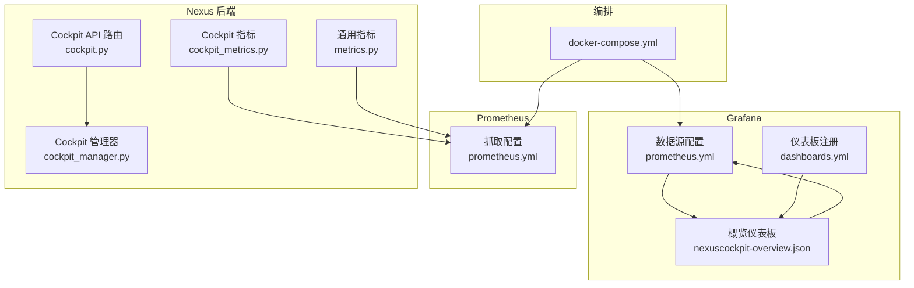
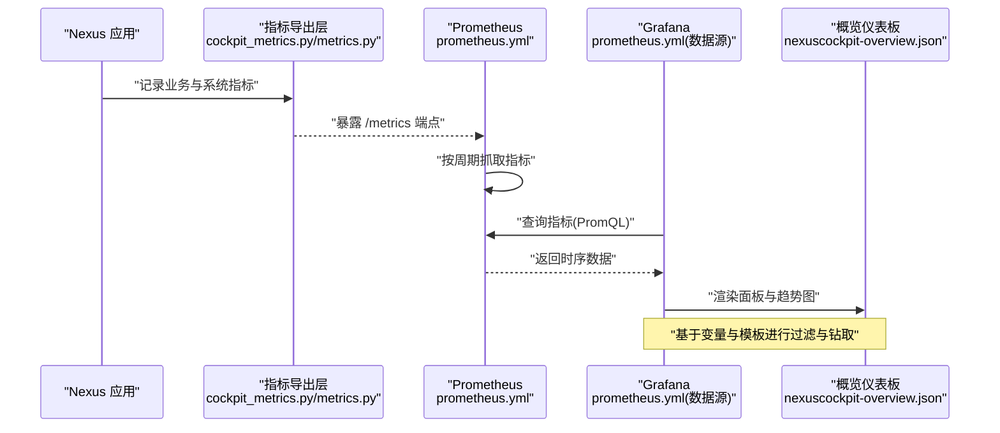
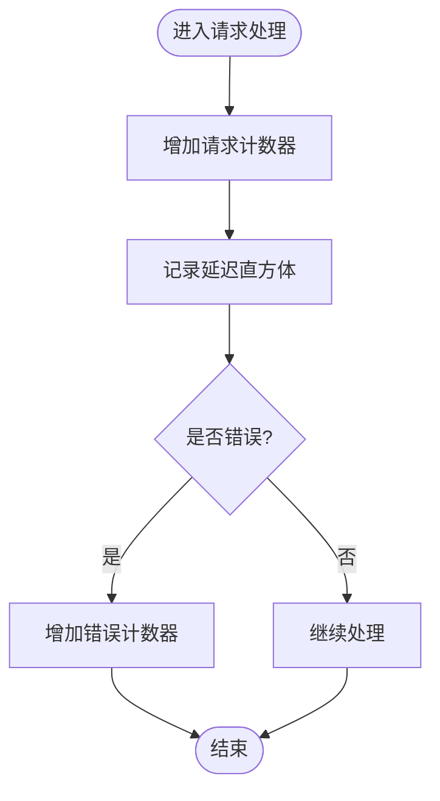
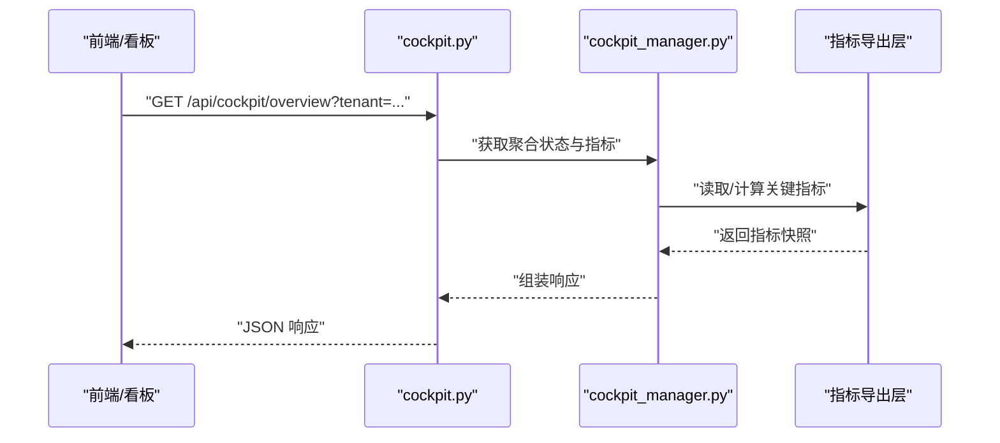
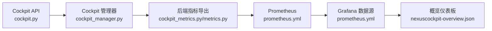

# 可视化看板系统

<cite>
**本文引用的文件**   
- [config/grafana/provisioning/dashboards/nexuscockpit-overview.json](file://config/grafana/provisioning/dashboards/nexuscockpit-overview.json)
- [config/grafana/provisioning/datasources/prometheus.yml](file://config/grafana/provisioning/datasources/prometheus.yml)
- [config/grafana/provisioning/dashboards/dashboards.yml](file://config/grafana/provisioning/dashboards/dashboards.yml)
- [config/prometheus/prometheus.yml](file://config/prometheus/prometheus.yml)
- [backend_design/nexus/observability/cockpit_metrics.py](file://backend_design/nexus/observability/cockpit_metrics.py)
- [backend_design/nexus/observability/metrics.py](file://backend_design/nexus/observability/metrics.py)
- [backend_design/nexus/api/routes/cockpit.py](file://backend_design/nexus/api/routes/cockpit.py)
- [backend_design/nexus/core/cockpit_manager.py](file://backend_design/nexus/core/cockpit_manager.py)
- [docker-compose.yml](file://docker-compose.yml)
</cite>

## 目录
1. [简介](#简介)
2. [项目结构](#项目结构)
3. [核心组件](#核心组件)
4. [架构总览](#架构总览)
5. [详细组件分析](#详细组件分析)
6. [依赖关系分析](#依赖关系分析)
7. [性能考虑](#性能考虑)
8. [故障诊断指南](#故障诊断指南)
9. [结论](#结论)
10. [附录](#附录)

## 简介
本文件面向 NexusCockpit 的可视化看板系统，聚焦 Grafana 仪表板与 Prometheus 数据源的集成、指标采集与展示、告警规则与通知策略，以及自定义仪表板的开发流程。文档覆盖以下关键主题：
- 预配置的概览仪表板（nexuscockpit-overview.json）及其面板组成
- Prometheus 数据源配置与指标暴露
- 关键监控面板：系统健康状态、性能指标、业务指标、告警规则与趋势分析
- 自定义仪表板开发与最佳实践
- 告警规则配置与通知策略
- 故障诊断流程与容量规划建议

## 项目结构
与可视化看板相关的核心目录与文件如下：
- Grafana 配置
  - 数据源：config/grafana/provisioning/datasources/prometheus.yml
  - 仪表板注册：config/grafana/provisioning/dashboards/dashboards.yml
  - 预置仪表板定义：config/grafana/provisioning/dashboards/nexuscockpit-overview.json
- Prometheus 配置
  - 抓取与持久化：config/prometheus/prometheus.yml
- 后端指标与接口
  - 指标导出：backend_design/nexus/observability/cockpit_metrics.py、metrics.py
  - Cockpit API 路由：backend_design/nexus/api/routes/cockpit.py
  - Cockpit 管理逻辑：backend_design/nexus/core/cockpit_manager.py
- 编排与部署
  - docker-compose.yml

图表来源
- [config/grafana/provisioning/datasources/prometheus.yml](file://config/grafana/provisioning/datasources/prometheus.yml)
- [config/grafana/provisioning/dashboards/dashboards.yml](file://config/grafana/provisioning/dashboards/dashboards.yml)
- [config/grafana/provisioning/dashboards/nexuscockpit-overview.json](file://config/grafana/provisioning/dashboards/nexuscockpit-overview.json)
- [config/prometheus/prometheus.yml](file://config/prometheus/prometheus.yml)
- [backend_design/nexus/observability/cockpit_metrics.py](file://backend_design/nexus/observability/cockpit_metrics.py)
- [backend_design/nexus/observability/metrics.py](file://backend_design/nexus/observability/metrics.py)
- [backend_design/nexus/api/routes/cockpit.py](file://backend_design/nexus/api/routes/cockpit.py)
- [backend_design/nexus/core/cockpit_manager.py](file://backend_design/nexus/core/cockpit_manager.py)
- [docker-compose.yml](file://docker-compose.yml)

章节来源
- [config/grafana/provisioning/datasources/prometheus.yml](file://config/grafana/provisioning/datasources/prometheus.yml)
- [config/grafana/provisioning/dashboards/dashboards.yml](file://config/grafana/provisioning/dashboards/dashboards.yml)
- [config/grafana/provisioning/dashboards/nexuscockpit-overview.json](file://config/grafana/provisioning/dashboards/nexuscockpit-overview.json)
- [config/prometheus/prometheus.yml](file://config/prometheus/prometheus.yml)
- [backend_design/nexus/observability/cockpit_metrics.py](file://backend_design/nexus/observability/cockpit_metrics.py)
- [backend_design/nexus/observability/metrics.py](file://backend_design/nexus/observability/metrics.py)
- [backend_design/nexus/api/routes/cockpit.py](file://backend_design/nexus/api/routes/cockpit.py)
- [backend_design/nexus/core/cockpit_manager.py](file://backend_design/nexus/core/cockpit_manager.py)
- [docker-compose.yml](file://docker-compose.yml)

## 核心组件
- Grafana 概览仪表板（nexuscockpit-overview.json）
  - 提供系统健康、性能、业务指标与趋势分析的可视化面板集合
  - 通过变量与模板实现时间范围、租户、服务实例等筛选
- Prometheus 数据源（prometheus.yml）
  - 定义对后端 /metrics 端点的抓取目标、标签与保留策略
- 指标导出模块（cockpit_metrics.py、metrics.py）
  - 暴露系统运行态指标（如请求计数、延迟分布、错误率、资源使用）
  - 为业务指标与健康检查提供可观测性基础
- Cockpit API 与管理器（cockpit.py、cockpit_manager.py）
  - 提供仪表盘相关查询与聚合能力，支撑复杂面板的数据需求

章节来源
- [config/grafana/provisioning/dashboards/nexuscockpit-overview.json](file://config/grafana/provisioning/dashboards/nexuscockpit-overview.json)
- [config/grafana/provisioning/datasources/prometheus.yml](file://config/grafana/provisioning/datasources/prometheus.yml)
- [backend_design/nexus/observability/cockpit_metrics.py](file://backend_design/nexus/observability/cockpit_metrics.py)
- [backend_design/nexus/observability/metrics.py](file://backend_design/nexus/observability/metrics.py)
- [backend_design/nexus/api/routes/cockpit.py](file://backend_design/nexus/api/routes/cockpit.py)
- [backend_design/nexus/core/cockpit_manager.py](file://backend_design/nexus/core/cockpit_manager.py)

## 架构总览
下图展示了从后端指标到 Grafana 可视化的端到端链路，包括数据源、仪表板与告警的关系。

图表来源
- [backend_design/nexus/observability/cockpit_metrics.py](file://backend_design/nexus/observability/cockpit_metrics.py)
- [backend_design/nexus/observability/metrics.py](file://backend_design/nexus/observability/metrics.py)
- [config/prometheus/prometheus.yml](file://config/prometheus/prometheus.yml)
- [config/grafana/provisioning/datasources/prometheus.yml](file://config/grafana/provisioning/datasources/prometheus.yml)
- [config/grafana/provisioning/dashboards/nexuscockpit-overview.json](file://config/grafana/provisioning/dashboards/nexuscockpit-overview.json)

## 详细组件分析

### 概览仪表板（nexuscockpit-overview.json）
- 面板类型与用途
  - 系统健康状态：服务可用性、关键依赖健康、错误率与失败比例
  - 性能指标：QPS、P95/P99 延迟、CPU/内存/GC 等运行时指标
  - 业务指标：会话数、技能调用次数、意图识别成功率、车辆控制成功率等
  - 趋势分析：多时间窗口对比、同比环比、异常检测
- 变量与模板
  - 支持按租户、服务实例、区域等维度筛选
  - 时间范围与刷新频率可调
- 查询语句组织
  - 统一命名规范与标签约定，便于跨面板复用
  - 常用函数：rate、irate、histogram_quantile、increase、avg_over_time 等

章节来源
- [config/grafana/provisioning/dashboards/nexuscockpit-overview.json](file://config/grafana/provisioning/dashboards/nexuscockpit-overview.json)

### Prometheus 数据源配置（prometheus.yml）
- 抓取目标
  - 指向后端 /metrics 端点，设置 scrape_interval、scrape_timeout
  - 可选全局标签（如环境、集群、租户）
- 存储与保留
  - 指定 TSDB 路径、保留时长与压缩策略
- 安全与认证
  - 如需基本认证或 TLS，可在数据源中配置

章节来源
- [config/grafana/provisioning/datasources/prometheus.yml](file://config/grafana/provisioning/datasources/prometheus.yml)
- [config/prometheus/prometheus.yml](file://config/prometheus/prometheus.yml)

### 指标导出与采集（cockpit_metrics.py、metrics.py）
- 指标分类
  - 计数器（Counter）：请求总数、错误数、技能调用次数
  - 直方体（Histogram）：延迟分布、分位数计算
  - 度量（Gauge）：当前并发、队列长度、缓存命中率
  - 摘要（Summary）：精确分位数（按需启用）
- 标签设计
  - 统一 key：service、tenant、instance、method、status、skill、intent
  - 避免高基数标签导致存储膨胀
- 暴露端点
  - 标准 /metrics 路径，供 Prometheus 抓取

图表来源
- [backend_design/nexus/observability/cockpit_metrics.py](file://backend_design/nexus/observability/cockpit_metrics.py)
- [backend_design/nexus/observability/metrics.py](file://backend_design/nexus/observability/metrics.py)

章节来源
- [backend_design/nexus/observability/cockpit_metrics.py](file://backend_design/nexus/observability/cockpit_metrics.py)
- [backend_design/nexus/observability/metrics.py](file://backend_design/nexus/observability/metrics.py)

### Cockpit API 与管理器（cockpit.py、cockpit_manager.py）
- 职责边界
  - cockpit.py：对外暴露 REST/WebSocket 接口，用于仪表盘数据聚合与实时推送
  - cockpit_manager.py：内部协调各子系统状态、汇总健康信息、生成聚合结果
- 典型调用链
  - 前端请求 -> API 路由 -> 管理器聚合 -> 返回结构化数据
  - 支持分页、过滤与排序参数

图表来源
- [backend_design/nexus/api/routes/cockpit.py](file://backend_design/nexus/api/routes/cockpit.py)
- [backend_design/nexus/core/cockpit_manager.py](file://backend_design/nexus/core/cockpit_manager.py)
- [backend_design/nexus/observability/cockpit_metrics.py](file://backend_design/nexus/observability/cockpit_metrics.py)

章节来源
- [backend_design/nexus/api/routes/cockpit.py](file://backend_design/nexus/api/routes/cockpit.py)
- [backend_design/nexus/core/cockpit_manager.py](file://backend_design/nexus/core/cockpit_manager.py)

### 告警规则与通知策略
- 告警规则
  - 在 Prometheus 侧定义规则文件，包含条件表达式、阈值、持续时间、标签与注解
  - 常见规则：错误率突增、延迟超阈、资源耗尽、健康检查失败
- 通知渠道
  - 支持邮件、企业微信、钉钉、Slack、Webhook 等
  - 建议分级：P0 立即通知，P1 快速响应，P2 常规处理
- 抑制与静默
  - 利用抑制规则减少风暴；维护静默列表应对变更窗口

章节来源
- [config/prometheus/prometheus.yml](file://config/prometheus/prometheus.yml)

### 自定义仪表板开发指南
- 步骤
  - 准备数据源：确保 Grafana 已正确配置 Prometheus 数据源
  - 新建仪表板：添加面板，选择 Prometheus 作为数据源
  - 编写 PromQL：遵循命名与标签规范，使用 rate/histogram_quantile 等函数
  - 设置变量：为租户、实例、方法等创建模板变量
  - 保存并注册：将 JSON 导出或通过 dashboards.yml 自动注册
- 最佳实践
  - 统一颜色与单位，保持可读性
  - 合理设置刷新间隔与时间范围
  - 使用注释与描述标注关键面板含义
  - 避免高基数标签与过度聚合

章节来源
- [config/grafana/provisioning/dashboards/dashboards.yml](file://config/grafana/provisioning/dashboards/dashboards.yml)
- [config/grafana/provisioning/datasources/prometheus.yml](file://config/grafana/provisioning/datasources/prometheus.yml)
- [config/grafana/provisioning/dashboards/nexuscockpit-overview.json](file://config/grafana/provisioning/dashboards/nexuscockpit-overview.json)

## 依赖关系分析
- 组件耦合
  - Grafana 依赖 Prometheus 数据源；仪表板依赖数据源中的指标
  - 后端指标导出层被 Prometheus 抓取；API 与管理器为复杂面板提供聚合数据
- 外部依赖
  - Prometheus 抓取与存储
  - Grafana 渲染与告警引擎
- 潜在循环依赖
  - 指标导出不反向依赖 Grafana；API 仅消费指标导出层，无循环

图表来源
- [backend_design/nexus/observability/cockpit_metrics.py](file://backend_design/nexus/observability/cockpit_metrics.py)
- [backend_design/nexus/observability/metrics.py](file://backend_design/nexus/observability/metrics.py)
- [config/prometheus/prometheus.yml](file://config/prometheus/prometheus.yml)
- [config/grafana/provisioning/datasources/prometheus.yml](file://config/grafana/provisioning/datasources/prometheus.yml)
- [config/grafana/provisioning/dashboards/nexuscockpit-overview.json](file://config/grafana/provisioning/dashboards/nexuscockpit-overview.json)
- [backend_design/nexus/api/routes/cockpit.py](file://backend_design/nexus/api/routes/cockpit.py)
- [backend_design/nexus/core/cockpit_manager.py](file://backend_design/nexus/core/cockpit_manager.py)

章节来源
- [backend_design/nexus/observability/cockpit_metrics.py](file://backend_design/nexus/observability/cockpit_metrics.py)
- [backend_design/nexus/observability/metrics.py](file://backend_design/nexus/observability/metrics.py)
- [config/prometheus/prometheus.yml](file://config/prometheus/prometheus.yml)
- [config/grafana/provisioning/datasources/prometheus.yml](file://config/grafana/provisioning/datasources/prometheus.yml)
- [config/grafana/provisioning/dashboards/nexuscockpit-overview.json](file://config/grafana/provisioning/dashboards/nexuscockpit-overview.json)
- [backend_design/nexus/api/routes/cockpit.py](file://backend_design/nexus/api/routes/cockpit.py)
- [backend_design/nexus/core/cockpit_manager.py](file://backend_design/nexus/core/cockpit_manager.py)

## 性能考虑
- 指标粒度与采样
  - 合理设置 scrape_interval，避免过密抓取造成存储压力
  - 使用 histogram 而非 summary 以减轻服务端开销
- 标签基数控制
  - 避免在高基数字段（如用户 ID）上打标签
  - 对热点维度采用抽样或聚合
- 查询优化
  - 优先使用 rate/irate 与时间窗口聚合
  - 限制面板默认时间范围，避免全量扫描
- 存储与保留
  - 根据业务需求调整 TSDB 保留期与压缩级别
  - 冷热分层：短期高精度、长期低精度

[本节为通用指导，无需特定文件引用]

## 故障诊断指南
- 常见问题定位
  - 指标缺失：检查后端 /metrics 是否可达、标签是否正确、Prometheus 抓取日志
  - 面板空白：确认数据源连通性、PromQL 语法与时间范围
  - 告警风暴：检查抑制规则与静默配置，评估阈值与持续时间
- 诊断步骤
  - 验证数据源：在 Grafana 中测试 Prometheus 连接
  - 校验指标：在 Prometheus UI 中查询目标指标是否存在
  - 复现问题：缩小时间范围与维度，逐步定位异常
  - 查看日志：结合后端日志与指标，交叉验证根因
- 恢复建议
  - 临时扩容与降级策略
  - 回滚变更与关闭非关键功能
  - 清理高基数标签与过期数据

章节来源
- [config/grafana/provisioning/datasources/prometheus.yml](file://config/grafana/provisioning/datasources/prometheus.yml)
- [config/prometheus/prometheus.yml](file://config/prometheus/prometheus.yml)
- [backend_design/nexus/observability/cockpit_metrics.py](file://backend_design/nexus/observability/cockpit_metrics.py)
- [backend_design/nexus/observability/metrics.py](file://backend_design/nexus/observability/metrics.py)

## 结论
NexusCockpit 的可视化看板系统以 Prometheus 为指标中枢、Grafana 为可视化与告警平台，结合后端指标导出与 Cockpit API，形成完整的可观测性与运营能力。通过规范的指标命名、合理的标签设计与告警策略，可实现对系统健康、性能与业务的全面监控。建议在持续演进中完善自定义仪表板、优化查询与存储策略，并建立完善的故障诊断与容量规划流程。

[本节为总结性内容，无需特定文件引用]

## 附录
- 部署参考
  - docker-compose.yml 中定义了 Grafana、Prometheus 与后端的编排关系，便于本地与生产环境快速启动
- 扩展建议
  - 引入分布式追踪与日志聚合（如 Loki），增强根因定位能力
  - 构建统一的指标字典与文档，提升团队协作效率

章节来源
- [docker-compose.yml](file://docker-compose.yml)