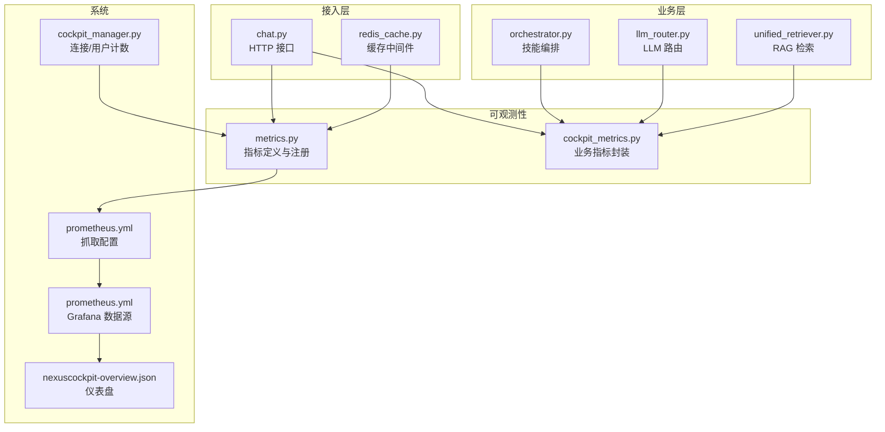
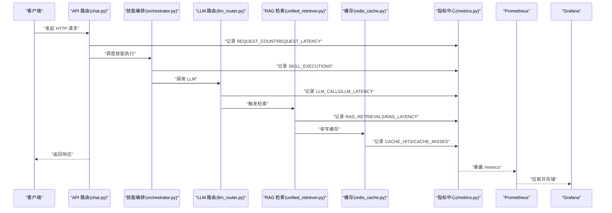
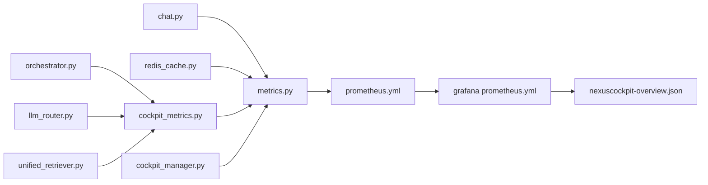

# 指标采集系统

<cite>
**本文引用的文件**   
- [backend_design/nexus/observability/metrics.py](file://backend_design/nexus/observability/metrics.py)
- [backend_design/nexus/observability/cockpit_metrics.py](file://backend_design/nexus/observability/cockpit_metrics.py)
- [backend_design/nexus/api/routes/chat.py](file://backend_design/nexus/api/routes/chat.py)
- [backend_design/nexus/skills/orchestrator.py](file://backend_design/nexus/skills/orchestrator.py)
- [backend_design/nexus/middleware/redis_cache.py](file://backend_design/nexus/middleware/redis_cache.py)
- [backend_design/nexus/rag/unified_retriever.py](file://backend_design/nexus/rag/unified_retriever.py)
- [backend_design/nexus/intent/llm_router.py](file://backend_design/nexus/intent/llm_router.py)
- [config/prometheus/prometheus.yml](file://config/prometheus/prometheus.yml)
- [config/grafana/provisioning/datasources/prometheus.yml](file://config/grafana/provisioning/datasources/prometheus.yml)
- [config/grafana/provisioning/dashboards/nexuscockpit-overview.json](file://config/grafana/provisioning/dashboards/nexuscockpit-overview.json)
- [backend_design/nexus/core/cockpit_manager.py](file://backend_design/nexus/core/cockpit_manager.py)
</cite>

## 目录
1. [简介](#简介)
2. [项目结构](#项目结构)
3. [核心组件](#核心组件)
4. [架构总览](#架构总览)
5. [详细组件分析](#详细组件分析)
6. [依赖关系分析](#依赖关系分析)
7. [性能考量](#性能考量)
8. [故障排查指南](#故障排查指南)
9. [结论](#结论)
10. [附录](#附录)

## 简介
本文件面向 NexusCockpit 的指标采集系统，系统性梳理 Prometheus 指标体系与落地实现。文档覆盖应用信息、请求、Agent、技能执行、缓存、RAG 检索、LLM 调用以及系统级指标的类型设计、标签规范、采集频率与存储策略，并提供自定义指标开发指南、性能优化建议与监控最佳实践，帮助读者快速理解并扩展观测能力。

## 项目结构
NexusCockpit 的可观测性相关代码主要位于后端 Python 服务中，围绕 observability 模块进行统一注册与暴露；API 路由、中间件、RAG 检索、意图路由与技能编排等子系统按需埋点；Prometheus 抓取配置与 Grafana 数据源/仪表盘在 config 目录下集中管理。

图表来源
- [backend_design/nexus/observability/metrics.py](file://backend_design/nexus/observability/metrics.py)
- [backend_design/nexus/observability/cockpit_metrics.py](file://backend_design/nexus/observability/cockpit_metrics.py)
- [backend_design/nexus/api/routes/chat.py](file://backend_design/nexus/api/routes/chat.py)
- [backend_design/nexus/middleware/redis_cache.py](file://backend_design/nexus/middleware/redis_cache.py)
- [backend_design/nexus/skills/orchestrator.py](file://backend_design/nexus/skills/orchestrator.py)
- [backend_design/nexus/intent/llm_router.py](file://backend_design/nexus/intent/llm_router.py)
- [backend_design/nexus/rag/unified_retriever.py](file://backend_design/nexus/rag/unified_retriever.py)
- [config/prometheus/prometheus.yml](file://config/prometheus/prometheus.yml)
- [config/grafana/provisioning/datasources/prometheus.yml](file://config/grafana/provisioning/datasources/prometheus.yml)
- [config/grafana/provisioning/dashboards/nexuscockpit-overview.json](file://config/grafana/provisioning/dashboards/nexuscockpit-overview.json)
- [backend_design/nexus/core/cockpit_manager.py](file://backend_design/nexus/core/cockpit_manager.py)

章节来源
- [backend_design/nexus/observability/metrics.py](file://backend_design/nexus/observability/metrics.py)
- [backend_design/nexus/observability/cockpit_metrics.py](file://backend_design/nexus/observability/cockpit_metrics.py)
- [config/prometheus/prometheus.yml](file://config/prometheus/prometheus.yml)
- [config/grafana/provisioning/datasources/prometheus.yml](file://config/grafana/provisioning/datasources/prometheus.yml)
- [config/grafana/provisioning/dashboards/nexuscockpit-overview.json](file://config/grafana/provisioning/dashboards/nexuscockpit-overview.json)

## 核心组件
- 指标定义与注册中心：负责声明所有 Counter/Gauge/Histogram 指标、默认标签（如应用版本、实例标识）与采集周期，提供统一的注册入口与导出端点。
- 业务指标封装：将具体业务场景（请求、Agent、技能、缓存、RAG、LLM）的埋点逻辑封装为易用的函数或装饰器，屏蔽底层细节。
- 系统状态上报：维护活跃连接数、活跃用户数等 Gauge 指标，随心跳或事件更新。
- 外部集成：通过标准 /metrics 端点暴露给 Prometheus 抓取；Grafana 使用同一数据源展示仪表盘。

章节来源
- [backend_design/nexus/observability/metrics.py](file://backend_design/nexus/observability/metrics.py)
- [backend_design/nexus/observability/cockpit_metrics.py](file://backend_design/nexus/observability/cockpit_metrics.py)
- [backend_design/nexus/core/cockpit_manager.py](file://backend_design/nexus/core/cockpit_manager.py)

## 架构总览
下图展示了从请求进入、业务处理到指标采集与持久化的完整链路。

图表来源
- [backend_design/nexus/api/routes/chat.py](file://backend_design/nexus/api/routes/chat.py)
- [backend_design/nexus/skills/orchestrator.py](file://backend_design/nexus/skills/orchestrator.py)
- [backend_design/nexus/intent/llm_router.py](file://backend_design/nexus/intent/llm_router.py)
- [backend_design/nexus/rag/unified_retriever.py](file://backend_design/nexus/rag/unified_retriever.py)
- [backend_design/nexus/middleware/redis_cache.py](file://backend_design/nexus/middleware/redis_cache.py)
- [backend_design/nexus/observability/metrics.py](file://backend_design/nexus/observability/metrics.py)
- [config/prometheus/prometheus.yml](file://config/prometheus/prometheus.yml)
- [config/grafana/provisioning/datasources/prometheus.yml](file://config/grafana/provisioning/datasources/prometheus.yml)

## 详细组件分析

### 应用信息指标 APP_INFO
- 类型：Gauge
- 用途：描述应用版本、运行环境、实例标识等静态/半静态信息，便于按实例维度聚合与过滤。
- 标签设计：
  - app_version：应用版本号
  - instance_id：进程/容器实例标识
  - env：运行环境（dev/staging/prod）
  - region：部署区域
- 采集频率：启动时设置一次，必要时在热重载或健康检查中刷新。
- 存储策略：作为低基数标签的 Gauge，长期保留即可。

章节来源
- [backend_design/nexus/observability/metrics.py](file://backend_design/nexus/observability/metrics.py)

### 请求指标 REQUEST_COUNT 与 REQUEST_LATENCY
- 类型：
  - REQUEST_COUNT：Counter
  - REQUEST_LATENCY：Histogram
- 用途：统计 HTTP 请求总量与延迟分布，支撑 QPS、错误率与 P95/P99 延迟监控。
- 标签设计：
  - method：HTTP 方法
  - path：路由路径
  - status_code：响应状态码
  - tenant_id：租户标识（可选）
- 采集频率：每个请求完成时递增与采样。
- 存储策略：Histogram 需合理设置分桶边界以平衡精度与存储成本。

章节来源
- [backend_design/nexus/api/routes/chat.py](file://backend_design/nexus/api/routes/chat.py)
- [backend_design/nexus/observability/metrics.py](file://backend_design/nexus/observability/metrics.py)

### Agent 指标 AGENT_INVOCATIONS 与 AGENT_LATENCY
- 类型：
  - AGENT_INVOCATIONS：Counter
  - AGENT_LATENCY：Histogram
- 用途：度量 Agent 编排调用次数与耗时，用于评估编排效率与瓶颈定位。
- 标签设计：
  - agent_name：Agent 名称
  - mode：模式（同步/异步）
  - outcome：结果（success/error）
- 采集频率：每次 Agent 调用开始/结束记录。
- 存储策略：按 agent_name/outcome 维度聚合，注意控制标签基数。

章节来源
- [backend_design/nexus/skills/orchestrator.py](file://backend_design/nexus/skills/orchestrator.py)
- [backend_design/nexus/observability/metrics.py](file://backend_design/nexus/observability/metrics.py)

### 技能执行指标 SKILL_EXECUTIONS
- 类型：Counter
- 用途：统计各技能被调用的次数，辅助容量规划与热点识别。
- 标签设计：
  - skill_name：技能名
  - category：技能分类（车辆/健康/导航等）
  - result：执行结果
- 采集频率：每次技能执行完成时递增。
- 存储策略：按 skill_name 聚合，避免过多细粒度标签导致高基数。

章节来源
- [backend_design/nexus/skills/orchestrator.py](file://backend_design/nexus/skills/orchestrator.py)
- [backend_design/nexus/observability/metrics.py](file://backend_design/nexus/observability/metrics.py)

### 缓存指标 CACHE_HITS 与 CACHE_MISSES
- 类型：Counter
- 用途：衡量缓存命中率与未命中情况，指导缓存策略优化。
- 标签设计：
  - cache_key_prefix：键前缀（用于区分不同业务域）
  - operation：操作类型（get/set/delete）
- 采集频率：每次缓存访问后根据命中与否递增。
- 存储策略：按 key_prefix 聚合，避免将完整键作为标签。

章节来源
- [backend_design/nexus/middleware/redis_cache.py](file://backend_design/nexus/middleware/redis_cache.py)
- [backend_design/nexus/observability/metrics.py](file://backend_design/nexus/observability/metrics.py)

### RAG 检索指标 RAG_RETRIEVALS 与 RAG_LATENCY
- 类型：
  - RAG_RETRIEVALS：Counter
  - RAG_LATENCY：Histogram
- 用途：统计检索调用次数与延迟，评估检索质量与性能。
- 标签设计：
  - retriever_type：检索器类型（向量/图/混合）
  - top_k：返回条数
  - source：数据来源（知识库/图谱）
- 采集频率：每次检索完成后记录。
- 存储策略：按 retriever_type/source 聚合，top_k 建议离散化以减少基数。

章节来源
- [backend_design/nexus/rag/unified_retriever.py](file://backend_design/nexus/rag/unified_retriever.py)
- [backend_design/nexus/observability/metrics.py](file://backend/design/nexus/observability/metrics.py)

### LLM 调用指标 LLM_CALLS 与 LLM_LATENCY
- 类型：
  - LLM_CALLS：Counter
  - LLM_LATENCY：Histogram
- 用途：统计模型调用次数与耗时，支持多模型对比与成本核算。
- 标签设计：
  - model_name：模型名称
  - provider：供应商
  - task：任务类型（生成/补全/嵌入）
  - status：调用状态（success/error）
- 采集频率：每次 LLM 调用完成时记录。
- 存储策略：按 model_name/provider 聚合，避免将 prompt 内容作为标签。

章节来源
- [backend_design/nexus/intent/llm_router.py](file://backend_design/nexus/intent/llm_router.py)
- [backend_design/nexus/observability/metrics.py](file://backend_design/nexus/observability/metrics.py)

### 系统指标 ACTIVE_CONNECTIONS 与 ACTIVE_USERS
- 类型：Gauge
- 用途：反映当前活跃连接数与活跃用户数，用于容量与健康度监控。
- 标签设计：
  - connection_type：连接类型（ws/http）
  - user_id：用户标识（可选，注意基数）
- 采集频率：连接建立/断开或心跳更新时调整。
- 存储策略：低基数的 Gauge，适合长期保留。

章节来源
- [backend_design/nexus/core/cockpit_manager.py](file://backend_design/nexus/core/cockpit_manager.py)
- [backend_design/nexus/observability/metrics.py](file://backend_design/nexus/observability/metrics.py)

### 指标类型与标签设计要点
- 类型选择原则：
  - 累计量用 Counter（如请求数、调用次数）
  - 瞬时值用 Gauge（如连接数、内存占用）
  - 分布值用 Histogram（如延迟、大小）
- 标签设计原则：
  - 控制基数：避免将高基数字段（如用户 ID、完整 URL）直接作为标签
  - 语义清晰：标签名与取值应具可读性与一致性
  - 分层聚合：优先按粗粒度（租户、模块、模型）聚合，再下钻

章节来源
- [backend_design/nexus/observability/metrics.py](file://backend_design/nexus/observability/metrics.py)

### 采集频率与存储策略
- 采集频率：
  - 请求级指标：请求完成即记录
  - 系统级指标：连接事件或定时心跳更新
  - 应用信息：启动时设置，必要时热更新
- 存储策略：
  - 合理设置 Histogram 分桶，兼顾精度与存储
  - 对高基数标签做去重或离散化处理
  - 结合 Prometheus 保留策略与降采样规则

章节来源
- [backend_design/nexus/observability/metrics.py](file://backend_design/nexus/observability/metrics.py)
- [config/prometheus/prometheus.yml](file://config/prometheus/prometheus.yml)

## 依赖关系分析
- 模块耦合：
  - API 路由与中间件依赖指标中心进行埋点
  - 业务层（技能编排、LLM 路由、RAG 检索）通过业务封装调用指标中心
  - 系统状态由 Cockpit Manager 驱动更新
- 外部依赖：
  - Prometheus 通过 /metrics 抓取
  - Grafana 通过数据源读取 Prometheus 时序数据并渲染仪表盘

图表来源
- [backend_design/nexus/api/routes/chat.py](file://backend_design/nexus/api/routes/chat.py)
- [backend_design/nexus/middleware/redis_cache.py](file://backend_design/nexus/middleware/redis_cache.py)
- [backend_design/nexus/skills/orchestrator.py](file://backend_design/nexus/skills/orchestrator.py)
- [backend_design/nexus/intent/llm_router.py](file://backend_design/nexus/intent/llm_router.py)
- [backend_design/nexus/rag/unified_retriever.py](file://backend_design/nexus/rag/unified_retriever.py)
- [backend_design/nexus/observability/metrics.py](file://backend_design/nexus/observability/metrics.py)
- [backend_design/nexus/observability/cockpit_metrics.py](file://backend_design/nexus/observability/cockpit_metrics.py)
- [backend_design/nexus/core/cockpit_manager.py](file://backend_design/nexus/core/cockpit_manager.py)
- [config/prometheus/prometheus.yml](file://config/prometheus/prometheus.yml)
- [config/grafana/provisioning/datasources/prometheus.yml](file://config/grafana/provisioning/datasources/prometheus.yml)
- [config/grafana/provisioning/dashboards/nexuscockpit-overview.json](file://config/grafana/provisioning/dashboards/nexuscockpit-overview.json)

章节来源
- [backend_design/nexus/observability/metrics.py](file://backend_design/nexus/observability/metrics.py)
- [backend_design/nexus/observability/cockpit_metrics.py](file://backend_design/nexus/observability/cockpit_metrics.py)
- [config/prometheus/prometheus.yml](file://config/prometheus/prometheus.yml)
- [config/grafana/provisioning/datasources/prometheus.yml](file://config/grafana/provisioning/datasources/prometheus.yml)
- [config/grafana/provisioning/dashboards/nexuscockpit-overview.json](file://config/grafana/provisioning/dashboards/nexuscockpit-overview.json)

## 性能考量
- 标签基数控制：避免将用户 ID、会话 ID、完整 URL 等作为标签；必要时采用哈希或分组前缀。
- Histogram 分桶：针对延迟分布选择合适的分桶边界，减少不必要的桶数量以降低存储与查询开销。
- 批量与合并：在高吞吐场景下，可对高频指标进行批量化写入或合并上报，降低 I/O 压力。
- 采样策略：对非关键路径的指标可采用概率采样，平衡准确性与性能。
- 资源隔离：将指标计算与核心业务逻辑解耦，避免阻塞主流程。

[本节为通用性能建议，不直接分析具体文件]

## 故障排查指南
- 指标缺失或未更新：
  - 确认 /metrics 端点可达且未被防火墙拦截
  - 检查 Prometheus 抓取目标状态与日志
  - 验证对应埋点是否被正确触发
- 指标基数过高：
  - 审查标签设计，移除高基数字段或进行离散化
  - 使用聚合视图替代明细查询
- 延迟异常：
  - 检查 Histogram 分桶是否合理
  - 关注上游依赖（数据库、缓存、LLM）的延迟与错误率
- 连接/用户数异常：
  - 核对连接生命周期管理与心跳更新逻辑
  - 检查是否存在连接泄漏或长时间空闲连接

章节来源
- [config/prometheus/prometheus.yml](file://config/prometheus/prometheus.yml)
- [backend_design/nexus/core/cockpit_manager.py](file://backend_design/nexus/core/cockpit_manager.py)
- [backend_design/nexus/observability/metrics.py](file://backend_design/nexus/observability/metrics.py)

## 结论
NexusCockpit 的指标采集系统以统一的指标中心为核心，贯穿 API、中间件与业务层，形成端到端的观测闭环。通过合理的类型选择、标签设计与采集策略，既能满足实时监控需求，又能在高并发场景下保持良好性能。配合 Prometheus 与 Grafana，可实现从采集、存储到可视化的完整监控体系。

[本节为总结性内容，不直接分析具体文件]

## 附录

### 自定义指标开发指南
- 步骤概览：
  - 在指标中心新增指标定义（Counter/Gauge/Histogram），明确标签集合与默认值
  - 在业务模块中引入业务封装或直接调用指标中心进行埋点
  - 确保标签取值可控，避免高基数
  - 在本地验证 /metrics 输出是否符合预期
  - 在 Prometheus 中编写查询语句并在 Grafana 中创建面板
- 最佳实践：
  - 命名规范：使用大写下划线分隔，体现领域与动作（如 REQUEST_LATENCY）
  - 标签最小化：仅保留必要维度，必要时通过查询聚合
  - 文档化：为每个指标补充说明、单位与示例查询

章节来源
- [backend_design/nexus/observability/metrics.py](file://backend_design/nexus/observability/metrics.py)
- [backend_design/nexus/observability/cockpit_metrics.py](file://backend_design/nexus/observability/cockpit_metrics.py)

### 监控最佳实践
- 告警策略：
  - 基于 SLO 设定阈值（如 P99 延迟、错误率）
  - 对关键业务指标设置多级告警（警告/严重）
- 可视化：
  - 使用 Grafana 仪表盘聚合多维度指标
  - 提供全局概览与下钻视图
- 数据治理：
  - 定期清理无用指标与面板
  - 统一标签字典与命名规范

章节来源
- [config/grafana/provisioning/datasources/prometheus.yml](file://config/grafana/provisioning/datasources/prometheus.yml)
- [config/grafana/provisioning/dashboards/nexuscockpit-overview.json](file://config/grafana/provisioning/dashboards/nexuscockpit-overview.json)