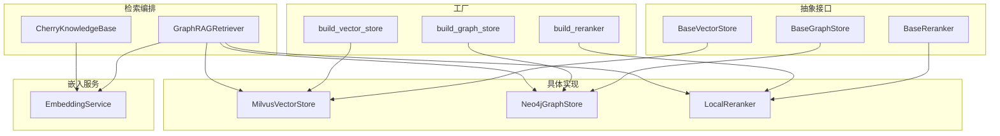
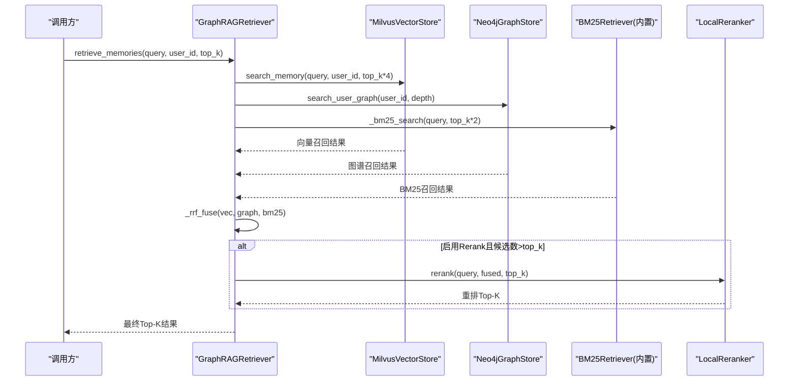
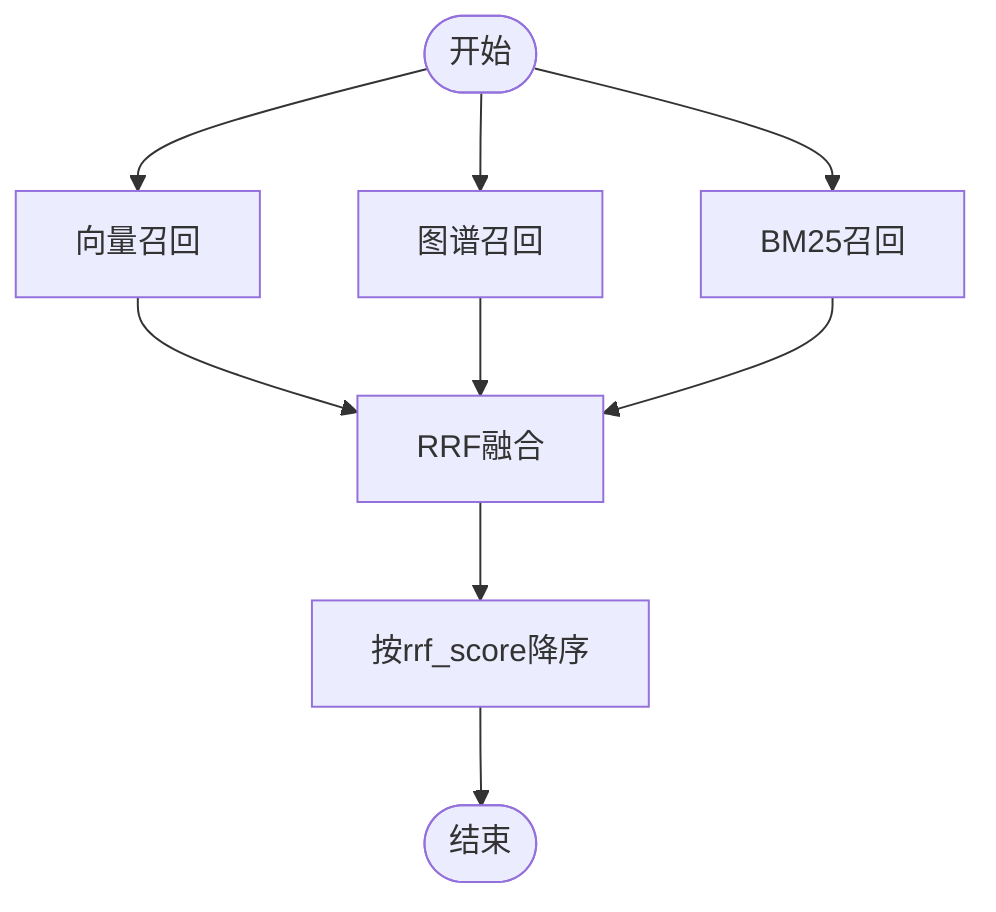
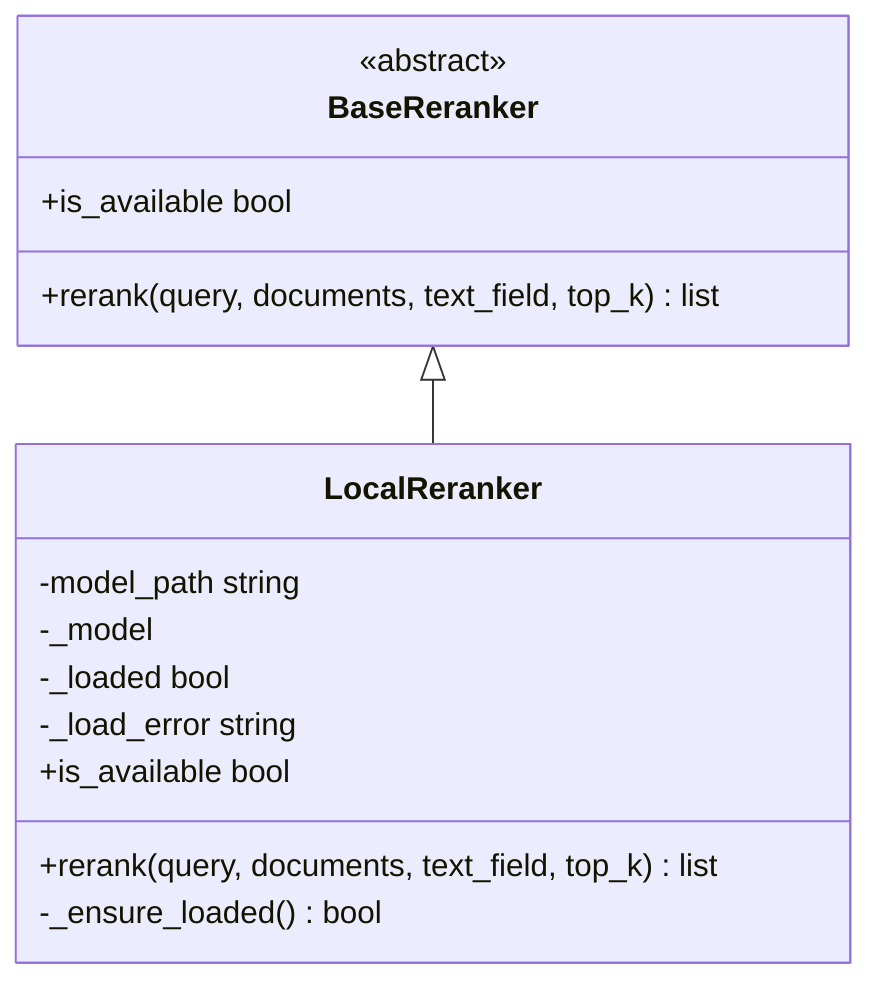
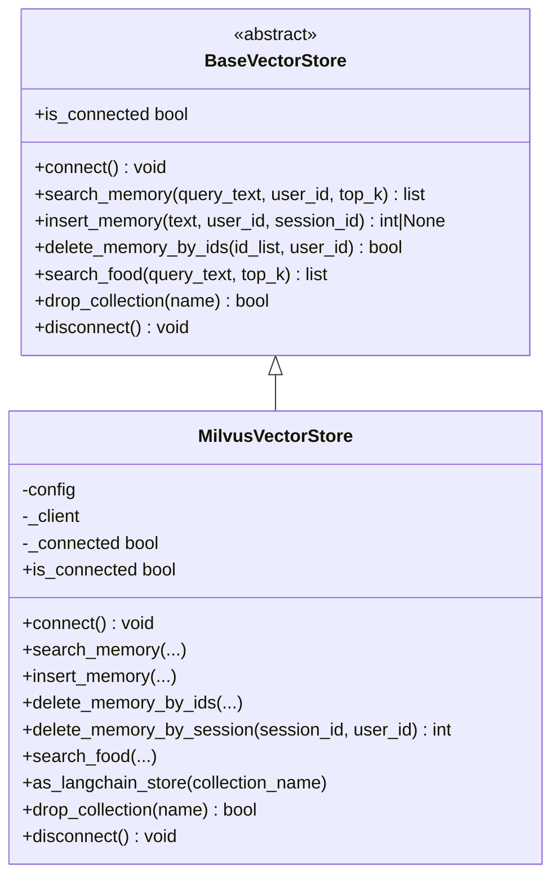
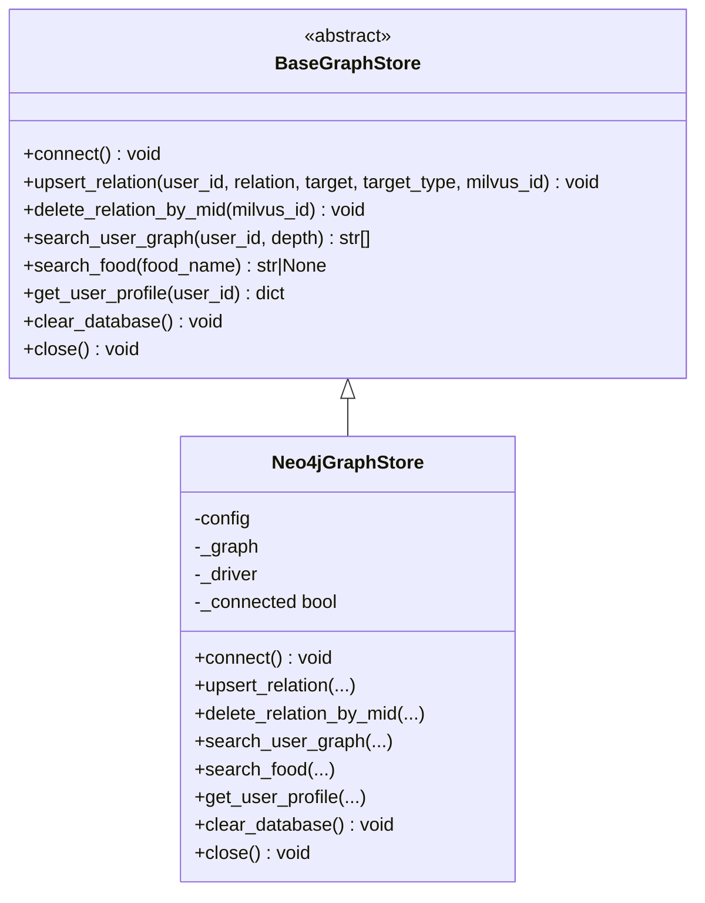
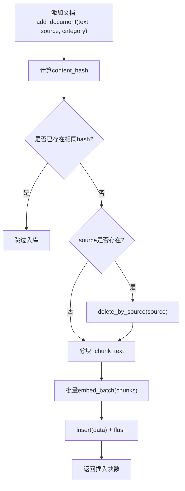
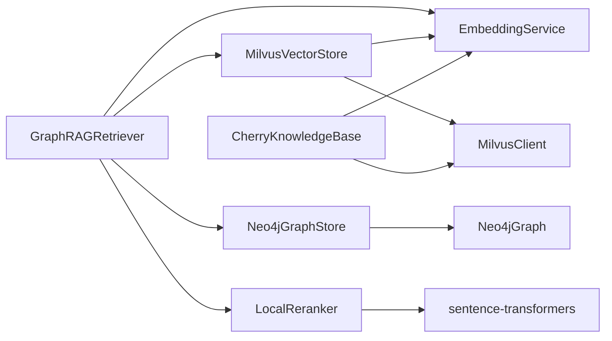

# GraphRAG检索架构

<cite>
**本文引用的文件**   
- [retriever.py](file://backend_design/nexus/rag/retriever.py)
- [vector_store.py](file://backend_design/nexus/rag/vector_store.py)
- [graph_store.py](file://backend_design/nexus/rag/graph_store.py)
- [cherry_kb.py](file://backend_design/nexus/rag/cherry_kb.py)
- [reranker.py](file://backend_design/nexus/rag/reranker.py)
- [reranker_base.py](file://backend_design/nexus/rag/reranker_base.py)
- [reranker_factory.py](file://backend_design/nexus/rag/reranker_factory.py)
- [embedding.py](file://backend_design/nexus/rag/embedding.py)
- [vector_base.py](file://backend_design/nexus/rag/vector_base.py)
- [graph_base.py](file://backend_design/nexus/rag/graph_base.py)
- [vector_factory.py](file://backend_design/nexus/rag/vector_factory.py)
- [graph_factory.py](file://backend_design/nexus/rag/graph_factory.py)
- [providers.py](file://backend_design/nexus/config/providers.py)
- [llm.py](file://backend_design/nexus/config/llm.py)
</cite>

## 目录
1. [引言](#引言)
2. [项目结构](#项目结构)
3. [核心组件](#核心组件)
4. [架构总览](#架构总览)
5. [详细组件分析](#详细组件分析)
6. [依赖关系分析](#依赖关系分析)
7. [性能考量与优化](#性能考量与优化)
8. [故障排查指南](#故障排查指南)
9. [结论](#结论)
10. [附录：API调用示例与基准测试要点](#附录api调用示例与基准测试要点)

## 引言
本文件面向 NexusCockpit 的 GraphRAG 三路融合检索架构，系统性阐述向量搜索（Milvus）、图谱查询（Neo4j）与 BM25 全文检索的融合策略；深入解释 RRF（Reciprocal Rank Fusion）算法的实现原理与参数调优；说明 Rerank 重排机制如何提升检索精度；描述 CherryKB 文档型知识库的架构设计与索引构建维护流程；并提供数据流图、检索流程图、性能优化策略、嵌入模型选择与配置、以及 API 调用示例与基准测试要点。

## 项目结构
GraphRAG 检索相关代码集中在 backend_design/nexus/rag 目录下，采用“抽象基类 + 工厂 + 具体实现”的分层设计：
- 抽象接口层：BaseVectorStore、BaseGraphStore、BaseReranker
- 具体实现层：MilvusVectorStore、Neo4jGraphStore、LocalReranker
- 工厂层：build_vector_store、build_graph_store、build_reranker
- 检索编排层：GraphRAGRetriever（三路召回 + RRF 融合 + Rerank）
- 文档知识库：CherryKnowledgeBase（Milvus 文档向量集合）
- 配置与嵌入：EmbeddingService、LLMConfig、ProvidersConfig

图表来源 
- [vector_base.py:22-76](file://backend_design/nexus/rag/vector_base.py#L22-L76)
- [graph_base.py:17-61](file://backend_design/nexus/rag/graph_base.py#L17-L61)
- [reranker_base.py:17-50](file://backend_design/nexus/rag/reranker_base.py#L17-L50)
- [vector_store.py:36-417](file://backend_design/nexus/rag/vector_store.py#L36-L417)
- [graph_store.py:26-184](file://backend_design/nexus/rag/graph_store.py#L26-L184)
- [reranker.py:34-148](file://backend_design/nexus/rag/reranker.py#L34-L148)
- [vector_factory.py:21-34](file://backend_design/nexus/rag/vector_factory.py#L21-L34)
- [graph_factory.py:20-28](file://backend_design/nexus/rag/graph_factory.py#L20-L28)
- [reranker_factory.py:25-59](file://backend_design/nexus/rag/reranker_factory.py#L25-L59)
- [retriever.py:48-189](file://backend_design/nexus/rag/retriever.py#L48-L189)
- [cherry_kb.py:53-383](file://backend_design/nexus/rag/cherry_kb.py#L53-L383)
- [embedding.py:23-63](file://backend_design/nexus/rag/embedding.py#L23-L63)

章节来源
- [vector_base.py:22-76](file://backend_design/nexus/rag/vector_base.py#L22-L76)
- [graph_base.py:17-61](file://backend_design/nexus/rag/graph_base.py#L17-L61)
- [reranker_base.py:17-50](file://backend_design/nexus/rag/reranker_base.py#L17-L50)
- [vector_store.py:36-417](file://backend_design/nexus/rag/vector_store.py#L36-L417)
- [graph_store.py:26-184](file://backend_design/nexus/rag/graph_store.py#L26-L184)
- [reranker.py:34-148](file://backend_design/nexus/rag/reranker.py#L34-L148)
- [vector_factory.py:21-34](file://backend_design/nexus/rag/vector_factory.py#L21-L34)
- [graph_factory.py:20-28](file://backend_design/nexus/rag/graph_factory.py#L20-L28)
- [reranker_factory.py:25-59](file://backend_design/nexus/rag/reranker_factory.py#L25-L59)
- [retriever.py:48-189](file://backend_design/nexus/rag/retriever.py#L48-L189)
- [cherry_kb.py:53-383](file://backend_design/nexus/rag/cherry_kb.py#L53-L383)
- [embedding.py:23-63](file://backend_design/nexus/rag/embedding.py#L23-L63)

## 核心组件
- GraphRAGRetriever：三路召回（向量、图谱、BM25）+ RRF 融合 + Rerank 重排的统一检索入口。
- MilvusVectorStore：基于 Milvus 的向量存储与检索，管理 Food_List 与 User_Memory 两个集合。
- Neo4jGraphStore：基于 Neo4j 的知识图谱存储与查询，支持用户画像、关系遍历与食材匹配。
- LocalReranker：本地 BGE CrossEncoder 重排器，对 Top-N 结果进行二次排序。
- EmbeddingService：统一文本向量化服务，内部委托 LangChain OpenAIEmbeddings（或本地兼容端点）。
- CherryKnowledgeBase：文档型知识库，基于 Milvus 存储长文档分块向量，支持增量更新与分类检索。

章节来源
- [retriever.py:48-189](file://backend_design/nexus/rag/retriever.py#L48-L189)
- [vector_store.py:36-417](file://backend_design/nexus/rag/vector_store.py#L36-L417)
- [graph_store.py:26-184](file://backend_design/nexus/rag/graph_store.py#L26-L184)
- [reranker.py:34-148](file://backend_design/nexus/rag/reranker.py#L34-L148)
- [embedding.py:23-63](file://backend_design/nexus/rag/embedding.py#L23-L63)
- [cherry_kb.py:53-383](file://backend_design/nexus/rag/cherry_kb.py#L53-L383)

## 架构总览
GraphRAG 检索流程由三个并行召回通道组成，随后通过 RRF 融合排序，再经 Rerank 精排输出最终 Top-K。

图表来源 
- [retriever.py:128-140](file://backend_design/nexus/rag/retriever.py#L128-L140)
- [vector_store.py:201-231](file://backend_design/nexus/rag/vector_store.py#L201-L231)
- [graph_store.py:102-132](file://backend_design/nexus/rag/graph_store.py#L102-L132)
- [reranker.py:79-139](file://backend_design/nexus/rag/reranker.py#L79-L139)

## 详细组件分析

### 三路召回与RRF融合
- 向量路：Milvus 语义相似度召回，按 COSINE 度量返回 Top-K。
- 图谱路：Neo4j 用户关系路径与实体名称匹配，返回结构化字符串片段。
- BM25路：langchain_community.BM25Retriever 全文匹配，使用自定义中文分词（jieba 优先，降级按字切分）。
- RRF融合：对三路结果的排名取倒数和作为融合分数，k=60 为平滑项，避免极端排名影响。

图表来源 
- [retriever.py:150-182](file://backend_design/nexus/rag/retriever.py#L150-L182)

章节来源
- [retriever.py:34-46](file://backend_design/nexus/rag/retriever.py#L34-L46)
- [retriever.py:128-182](file://backend_design/nexus/rag/retriever.py#L128-L182)

### Rerank重排机制
- 使用 BAAI/bge-reranker-v2-m3 的 CrossEncoder 对 query-doc 对进行相关性打分。
- 首次调用延迟加载模型，CPU 推理约 200ms/20条，支持 GPU/CPU。
- 失败时回退到原始顺序前 top_k 条，保证可用性。

图表来源 
- [reranker_base.py:17-50](file://backend_design/nexus/rag/reranker_base.py#L17-L50)
- [reranker.py:34-148](file://backend_design/nexus/rag/reranker.py#L34-L148)

章节来源
- [reranker.py:79-139](file://backend_design/nexus/rag/reranker.py#L79-L139)
- [reranker_factory.py:25-59](file://backend_design/nexus/rag/reranker_factory.py#L25-L59)

### 向量存储（Milvus）
- 管理两个集合：Food_List（食材库）与 User_Memory（用户记忆，含 user_id/session_id 字段）。
- 自动检测维度不匹配并重建集合；Trie 索引加速 user_id/session_id 过滤。
- 提供会话级清理 delete_memory_by_session，确保跨用户安全删除。

图表来源 
- [vector_base.py:22-76](file://backend_design/nexus/rag/vector_base.py#L22-L76)
- [vector_store.py:36-417](file://backend_design/nexus/rag/vector_store.py#L36-L417)

章节来源
- [vector_store.py:106-199](file://backend_design/nexus/rag/vector_store.py#L106-L199)
- [vector_store.py:201-324](file://backend_design/nexus/rag/vector_store.py#L201-L324)
- [vector_store.py:326-358](file://backend_design/nexus/rag/vector_store.py#L326-L358)

### 知识图谱（Neo4j）
- 使用 langchain_neo4j.Neo4jGraph 管理连接池与 Cypher 执行。
- 初始化约束与索引（User.id 唯一、Entity.name 索引）。
- 支持 upsert_relation（绑定 Milvus ID）、search_user_graph（N阶关系）、search_food、get_user_profile。

图表来源 
- [graph_base.py:17-61](file://backend_design/nexus/rag/graph_base.py#L17-L61)
- [graph_store.py:26-184](file://backend_design/nexus/rag/graph_store.py#L26-L184)

章节来源
- [graph_store.py:60-68](file://backend_design/nexus/rag/graph_store.py#L60-L68)
- [graph_store.py:73-132](file://backend_design/nexus/rag/graph_store.py#L73-L132)
- [graph_store.py:134-166](file://backend_design/nexus/rag/graph_store.py#L134-L166)

### CherryKB 文档知识库
- 基于 Milvus 的文档向量集合（nexus_kb_docs），字段包含 id/text/source/category/content_hash/vector。
- 分块策略：RecursiveCharacterTextSplitter（段落→句子→字符），默认 chunk_size=500，overlap=50。
- 增量更新：MD5 content_hash 去重，相同 source 下 hash 不变则跳过；不同则先删旧后插新。
- 检索：按 category 过滤，COSINE 相似度搜索。

图表来源 
- [cherry_kb.py:140-208](file://backend_design/nexus/rag/cherry_kb.py#L140-L208)
- [cherry_kb.py:286-309](file://backend_design/nexus/rag/cherry_kb.py#L286-L309)
- [cherry_kb.py:311-365](file://backend_design/nexus/rag/cherry_kb.py#L311-L365)

章节来源
- [cherry_kb.py:53-139](file://backend_design/nexus/rag/cherry_kb.py#L53-L139)
- [cherry_kb.py:140-208](file://backend_design/nexus/rag/cherry_kb.py#L140-L208)
- [cherry_kb.py:210-284](file://backend_design/nexus/rag/cherry_kb.py#L210-L284)
- [cherry_kb.py:286-309](file://backend_design/nexus/rag/cherry_kb.py#L286-L309)
- [cherry_kb.py:311-365](file://backend_design/nexus/rag/cherry_kb.py#L311-L365)

### 嵌入模型与配置
- EmbeddingService 内部使用 LangChain OpenAIEmbeddings（或本地兼容端点），支持异步与批量。
- LLMConfig 中 embedding_model 与 embedding_dim 控制模型与维度（默认 bge-m3，1024维）。
- ProvidersConfig 控制 reranker 等组件 provider（local/none）。

章节来源
- [embedding.py:23-63](file://backend_design/nexus/rag/embedding.py#L23-L63)
- [llm.py:15-72](file://backend_design/nexus/config/llm.py#L15-L72)
- [providers.py:15-47](file://backend_design/nexus/config/providers.py#L15-L47)

## 依赖关系分析
- GraphRAGRetriever 依赖 MilvusVectorStore、Neo4jGraphStore、EmbeddingService、LocalReranker。
- MilvusVectorStore 依赖 EmbeddingService 与 MilvusClient。
- Neo4jGraphStore 依赖 Neo4jGraph（langchain_neo4j）。
- LocalReranker 依赖 sentence-transformers CrossEncoder。
- CherryKnowledgeBase 依赖 EmbeddingService 与 MilvusClient。

图表来源 
- [retriever.py:48-87](file://backend_design/nexus/rag/retriever.py#L48-L87)
- [vector_store.py:36-57](file://backend_design/nexus/rag/vector_store.py#L36-L57)
- [graph_store.py:40-58](file://backend_design/nexus/rag/graph_store.py#L40-L58)
- [reranker.py:34-77](file://backend_design/nexus/rag/reranker.py#L34-L77)
- [cherry_kb.py:64-98](file://backend_design/nexus/rag/cherry_kb.py#L64-L98)

章节来源
- [retriever.py:48-87](file://backend_design/nexus/rag/retriever.py#L48-L87)
- [vector_store.py:36-57](file://backend_design/nexus/rag/vector_store.py#L36-L57)
- [graph_store.py:40-58](file://backend_design/nexus/rag/graph_store.py#L40-L58)
- [reranker.py:34-77](file://backend_design/nexus/rag/reranker.py#L34-L77)
- [cherry_kb.py:64-98](file://backend_design/nexus/rag/cherry_kb.py#L64-L98)

## 性能考量与优化
- 向量检索
  - 指标与索引：COSINE 度量，IVF_FLAT（nlist=128）用于文档集合；HNSW（M=8, efConstruction=64）用于记忆集合；user_id/session_id 使用 Trie 索引加速过滤。
  - 搜索参数：nprobe=10（文档集合），可根据召回率/延迟权衡调整。
- BM25
  - 中文分词：jieba 优先，缺失时按字切分；英文按空格。
  - 延迟初始化：仅在需要时构建 BM25 索引，避免冷启动开销。
- RRF
  - k=60 平滑项，避免极端排名主导；可依据业务分布微调。
- Rerank
  - 本地模型首次加载约2秒，后续推理 CPU 约200ms/20条；可用 NoneReranker 禁用以节省资源。
- 增量更新
  - CherryKB 使用 MD5 content_hash 去重，减少重复入库；按 source 幂等删除旧块。
- 会话清理
  - Milvus 支持 delete_memory_by_session，确保会话级数据隔离与清理。

[本节为通用性能指导，不直接分析具体文件]

## 故障排查指南
- 连接问题
  - Milvus 连接失败：检查 uri、集合维度是否匹配（自动重建逻辑会记录警告）。
  - Neo4j 连接失败：检查 url/username/password，确认约束与索引创建成功。
- 嵌入失败
  - EmbeddingService 抛出异常时记录错误日志；确保 embedding_model 与 embedding_dim 一致。
- BM25 不可用
  - 未安装 langchain-community 将禁用 BM25；检查依赖安装。
- Rerank 模型加载失败
  - 模型路径不存在或依赖缺失将回退原序；检查 models/reranker/bge-reranker-v2-m3 路径与依赖。
- 增量更新无效
  - 检查 content_hash 计算与查询逻辑；确认 source 存在性判断。

章节来源
- [vector_store.py:45-57](file://backend_design/nexus/rag/vector_store.py#L45-L57)
- [graph_store.py:40-58](file://backend_design/nexus/rag/graph_store.py#L40-L58)
- [embedding.py:36-44](file://backend_design/nexus/rag/embedding.py#L36-L44)
- [retriever.py:90-108](file://backend_design/nexus/rag/retriever.py#L90-L108)
- [reranker.py:52-77](file://backend_design/nexus/rag/reranker.py#L52-L77)
- [cherry_kb.py:140-208](file://backend_design/nexus/rag/cherry_kb.py#L140-L208)

## 结论
GraphRAG 三路融合检索通过向量、图谱与 BM25 互补召回，结合 RRF 融合与 Rerank 重排，显著提升检索精度与鲁棒性。Milvus 与 Neo4j 的解耦设计便于扩展与替换；CherryKB 提供高效的文档知识库管理能力。整体架构在性能、可维护性与可扩展性方面具备良好平衡。

[本节为总结性内容，不直接分析具体文件]

## 附录：API调用示例与基准测试要点
- 检索记忆
  - 调用 GraphRAGRetriever.retrieve_memories(query, user_id, top_k, graph_depth)
  - 返回融合后的 Top-K 结果，包含 rrf_score 与 rerank_score（若启用）。
- 检索食材
  - 调用 GraphRAGRetriever.retrieve_food(query, top_k)
  - 优先返回向量结果，若图谱精确匹配则插入首位。
- 文档知识库
  - CherryKnowledgeBase.add_document(text, source, category) 增量入库
  - CherryKnowledgeBase.search(query, top_k, category) 分类检索
- 基准测试要点
  - 向量检索：记录 nprobe、nlist、M、efConstruction 对延迟与召回的影响。
  - BM25：评估分词质量与索引构建时间。
  - RRF：调整 k 值观察排序稳定性。
  - Rerank：对比启用/禁用对精度与延迟的影响。
  - 增量更新：统计重复入库比例与删除效率。

[本节为概念性指导，不直接分析具体文件]