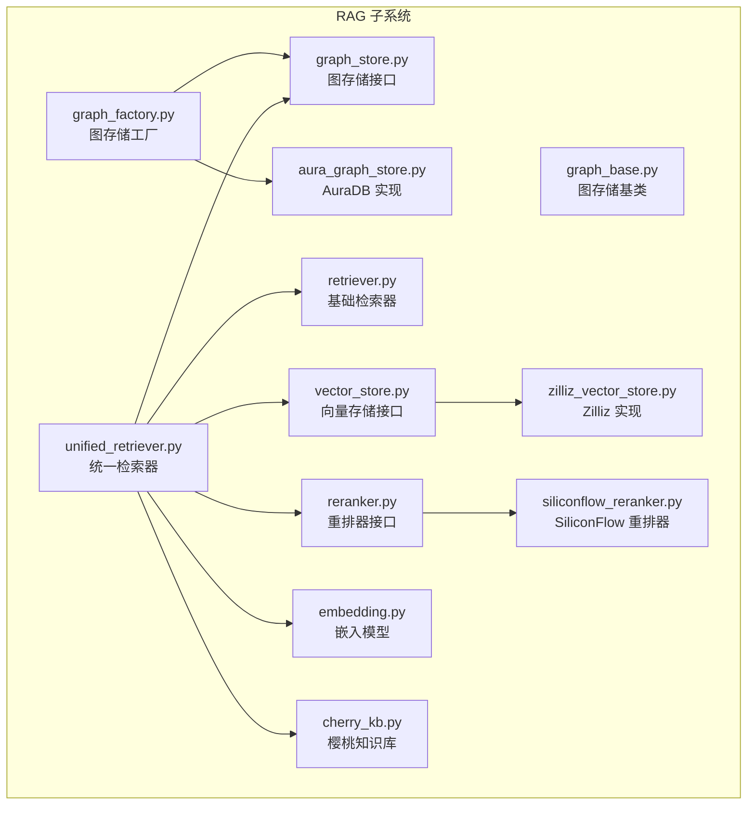
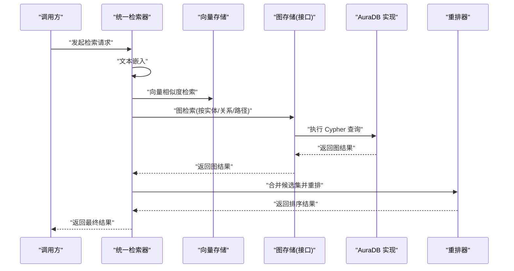
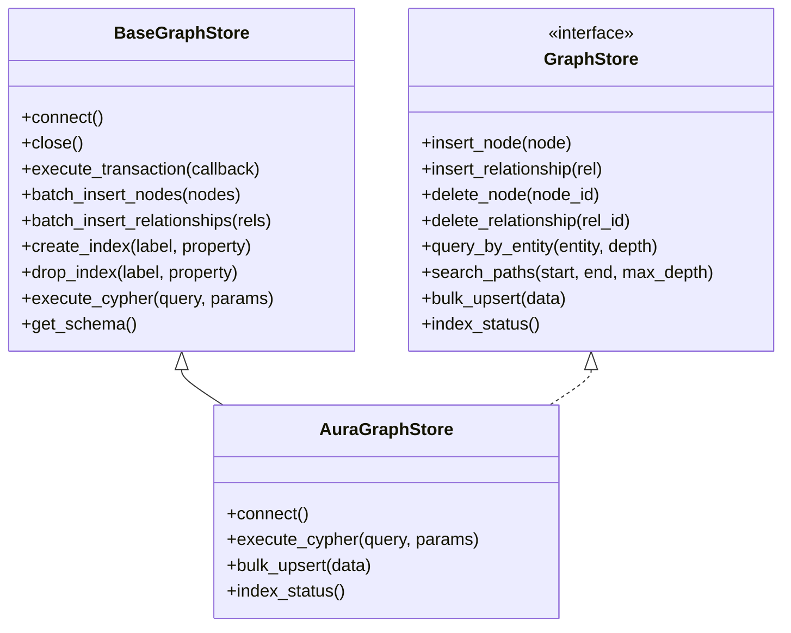
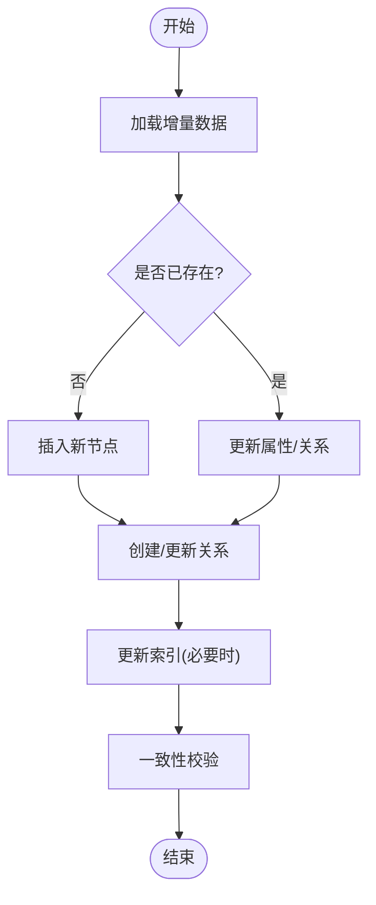
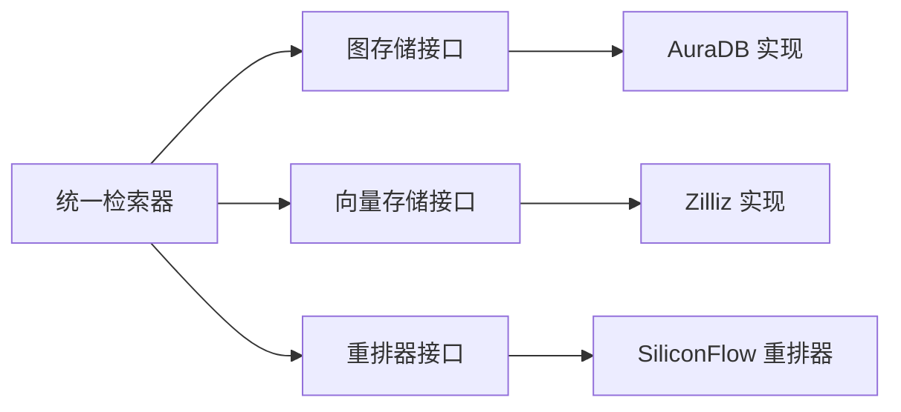

# GraphRAG核心架构

<cite>
**本文引用的文件**   
- [backend_design/nexus/rag/graph_base.py](file://backend_design/nexus/rag/graph_base.py)
- [backend_design/nexus/rag/graph_store.py](file://backend_design/nexus/rag/graph_store.py)
- [backend_design/nexus/rag/aura_graph_store.py](file://backend_design/nexus/rag/aura_graph_store.py)
- [backend_design/nexus/rag/graph_factory.py](file://backend_design/nexus/rag/graph_factory.py)
- [backend_design/nexus/rag/unified_retriever.py](file://backend_design/nexus/rag/unified_retriever.py)
- [backend_design/nexus/rag/retriever.py](file://backend_design/nexus/rag/retriever.py)
- [backend_design/nexus/rag/embedding.py](file://backend_design/nexus/rag/embedding.py)
- [backend_design/nexus/rag/vector_store.py](file://backend_design/nexus/rag/vector_store.py)
- [backend_design/nexus/rag/zilliz_vector_store.py](file://backend_design/nexus/rag/zilliz_vector_store.py)
- [backend_design/nexus/rag/reranker.py](file://backend_design/nexus/rag/reranker.py)
- [backend_design/nexus/rag/siliconflow_reranker.py](file://backend_design/nexus/rag/siliconflow_reranker.py)
- [backend_design/nexus/rag/cherry_kb.py](file://backend_design/nexus/rag/cherry_kb.py)
- [scripts/init_neo4j.py](file://scripts/init_neo4j.py)
- [backend_design/nexus/config.py](file://backend_design/nexus/config.py)
- [backend_design/nexus/core/logger.py](file://backend_design/nexus/core/logger.py)
- [backend_design/nexus/observability/metrics.py](file://backend_design/nexus/observability/metrics.py)
</cite>

## 目录
1. [简介](#简介)
2. [项目结构](#项目结构)
3. [核心组件](#核心组件)
4. [架构总览](#架构总览)
5. [详细组件分析](#详细组件分析)
6. [依赖关系分析](#依赖关系分析)
7. [性能考量](#性能考量)
8. [故障排查指南](#故障排查指南)
9. [结论](#结论)
10. [附录](#附录)

## 简介
本技术文档聚焦于 NexusCockpit 的 GraphRAG 核心架构，围绕图数据库抽象层设计、图谱数据结构与建模、查询优化策略、索引构建与增量更新、Schema 设计与 Cypher 模板、故障恢复策略、自定义适配器开发以及监控指标定义展开。目标是帮助开发者快速理解并扩展图检索增强生成（GraphRAG）能力，同时为运维提供可观测性与稳定性保障。

## 项目结构
GraphRAG 相关代码位于 backend_design/nexus/rag 目录下，采用“接口+实现+工厂”的分层组织方式：
- 抽象层：定义统一的图存储接口与通用基类
- 实现层：Neo4j/AuraDB 的具体适配
- 工厂层：根据配置动态创建具体图存储实例
- 检索层：统一检索器整合向量与图检索结果
- 辅助模块：嵌入模型、重排器、外部知识库等

图表来源
- [backend_design/nexus/rag/graph_base.py](file://backend_design/nexus/rag/graph_base.py)
- [backend_design/nexus/rag/graph_store.py](file://backend_design/nexus/rag/graph_store.py)
- [backend_design/nexus/rag/aura_graph_store.py](file://backend_design/nexus/rag/aura_graph_store.py)
- [backend_design/nexus/rag/graph_factory.py](file://backend_design/nexus/rag/graph_factory.py)
- [backend_design/nexus/rag/unified_retriever.py](file://backend_design/nexus/rag/unified_retriever.py)
- [backend_design/nexus/rag/retriever.py](file://backend_design/nexus/rag/retriever.py)
- [backend_design/nexus/rag/embedding.py](file://backend_design/nexus/rag/embedding.py)
- [backend_design/nexus/rag/vector_store.py](file://backend_design/nexus/rag/vector_store.py)
- [backend_design/nexus/rag/zilliz_vector_store.py](file://backend_design/nexus/rag/zilliz_vector_store.py)
- [backend_design/nexus/rag/reranker.py](file://backend_design/nexus/rag/reranker.py)
- [backend_design/nexus/rag/siliconflow_reranker.py](file://backend_design/nexus/rag/siliconflow_reranker.py)
- [backend_design/nexus/rag/cherry_kb.py](file://backend_design/nexus/rag/cherry_kb.py)

章节来源
- [backend_design/nexus/rag/graph_base.py](file://backend_design/nexus/rag/graph_base.py)
- [backend_design/nexus/rag/graph_store.py](file://backend_design/nexus/rag/graph_store.py)
- [backend_design/nexus/rag/aura_graph_store.py](file://backend_design/nexus/rag/aura_graph_store.py)
- [backend_design/nexus/rag/graph_factory.py](file://backend_design/nexus/rag/graph_factory.py)
- [backend_design/nexus/rag/unified_retriever.py](file://backend_design/nexus/rag/unified_retriever.py)
- [backend_design/nexus/rag/retriever.py](file://backend_design/nexus/rag/retriever.py)
- [backend_design/nexus/rag/embedding.py](file://backend_design/nexus/rag/embedding.py)
- [backend_design/nexus/rag/vector_store.py](file://backend_design/nexus/rag/vector_store.py)
- [backend_design/nexus/rag/zilliz_vector_store.py](file://backend_design/nexus/rag/zilliz_vector_store.py)
- [backend_design/nexus/rag/reranker.py](file://backend_design/nexus/rag/reranker.py)
- [backend_design/nexus/rag/siliconflow_reranker.py](file://backend_design/nexus/rag/siliconflow_reranker.py)
- [backend_design/nexus/rag/cherry_kb.py](file://backend_design/nexus/rag/cherry_kb.py)

## 核心组件
- 图存储接口与基类
  - 定义统一的增删改查、事务、批量写入、索引管理、查询执行等能力
  - 提供连接池、重试、超时、错误分类等通用逻辑
- 具体实现
  - AuraDB 实现：基于云托管 Neo4j 的连接与操作封装
  - 可扩展其他实现（如本地 Neo4j、内存图等）
- 工厂模式
  - 依据配置选择具体图存储实现，支持运行时切换
- 统一检索器
  - 融合向量检索与图检索，结合重排器输出最终候选集
- 嵌入与向量存储
  - 文本到向量的转换与持久化，支持多后端
- 重排器
  - 对候选结果进行相关性重排序，支持外部服务

章节来源
- [backend_design/nexus/rag/graph_store.py](file://backend_design/nexus/rag/graph_store.py)
- [backend_design/nexus/rag/graph_base.py](file://backend_design/nexus/rag/graph_base.py)
- [backend_design/nexus/rag/aura_graph_store.py](file://backend_design/nexus/rag/aura_graph_store.py)
- [backend_design/nexus/rag/graph_factory.py](file://backend_design/nexus/rag/graph_factory.py)
- [backend_design/nexus/rag/unified_retriever.py](file://backend_design/nexus/rag/unified_retriever.py)
- [backend_design/nexus/rag/retriever.py](file://backend_design/nexus/rag/retriever.py)
- [backend_design/nexus/rag/embedding.py](file://backend_design/nexus/rag/embedding.py)
- [backend_design/nexus/rag/vector_store.py](file://backend_design/nexus/rag/vector_store.py)
- [backend_design/nexus/rag/zilliz_vector_store.py](file://backend_design/nexus/rag/zilliz_vector_store.py)
- [backend_design/nexus/rag/reranker.py](file://backend_design/nexus/rag/reranker.py)
- [backend_design/nexus/rag/siliconflow_reranker.py](file://backend_design/nexus/rag/siliconflow_reranker.py)

## 架构总览
GraphRAG 的整体流程包括：
- 数据入库：将结构化与非结构化数据转换为节点与关系，写入图数据库；同步或异步构建图索引
- 检索阶段：用户查询经嵌入后并行触发向量检索与图检索，合并候选集
- 重排与输出：使用重排器对候选集排序，返回最终答案或上下文

图表来源
- [backend_design/nexus/rag/unified_retriever.py](file://backend_design/nexus/rag/unified_retriever.py)
- [backend_design/nexus/rag/vector_store.py](file://backend_design/nexus/rag/vector_store.py)
- [backend_design/nexus/rag/graph_store.py](file://backend_design/nexus/rag/graph_store.py)
- [backend_design/nexus/rag/aura_graph_store.py](file://backend_design/nexus/rag/aura_graph_store.py)
- [backend_design/nexus/rag/reranker.py](file://backend_design/nexus/rag/reranker.py)

## 详细组件分析

### 图数据库抽象层设计
- BaseGraphStore 基类
  - 职责：封装连接生命周期、重试与回退、日志与指标上报、事务边界、批量写入优化
  - 关键方法：连接建立/关闭、事务执行、批量插入、索引管理、查询执行
- GraphStore 接口
  - 职责：定义统一的图操作契约，包括节点/关系的增删改查、批量写入、索引创建与维护、Cypher 执行、元数据查询
  - 约束：所有实现必须遵循一致的参数与返回值约定，确保上层无侵入式替换

图表来源
- [backend_design/nexus/rag/graph_base.py](file://backend_design/nexus/rag/graph_base.py)
- [backend_design/nexus/rag/graph_store.py](file://backend_design/nexus/rag/graph_store.py)
- [backend_design/nexus/rag/aura_graph_store.py](file://backend_design/nexus/rag/aura_graph_store.py)

章节来源
- [backend_design/nexus/rag/graph_base.py](file://backend_design/nexus/rag/graph_base.py)
- [backend_design/nexus/rag/graph_store.py](file://backend_design/nexus/rag/graph_store.py)
- [backend_design/nexus/rag/aura_graph_store.py](file://backend_design/nexus/rag/aura_graph_store.py)

### 图谱数据结构设计与建模
- 节点类型建议
  - 实体节点：人物、地点、事件、产品、概念等
  - 属性字段：唯一标识、名称、描述、时间戳、版本、来源等
- 关系类型建议
  - 语义关系：属于、关联、影响、包含、派生等
  - 时序关系：发生时间、持续时间、先后顺序
- 标签与属性规范
  - 标签命名采用小写下划线，属性键名保持一致风格
  - 避免在高频查询路径上放置大对象属性，必要时拆分到独立节点
- 示例 Schema（概念性）
  - 实体节点：Entity(id, name, description, created_at, updated_at)
  - 关系节点：Relation(type, strength, source_id, target_id, timestamp)

[本节为概念性说明，不直接分析具体文件]

### 查询优化策略
- 索引策略
  - 针对常用过滤条件（如 label、id、name）建立单属性索引
  - 复合索引用于多条件组合查询（若后端支持）
- 查询模板
  - 预编译 Cypher 模板，减少解析开销
  - 限制遍历深度与返回条数，避免全图扫描
- 批处理与事务
  - 批量写入时使用事务边界，降低锁竞争
  - 分片写入与幂等键避免重复插入
- 缓存与去重
  - 热点查询结果短期缓存
  - 写入前进行存在性检查，减少冗余

章节来源
- [backend_design/nexus/rag/graph_store.py](file://backend_design/nexus/rag/graph_store.py)
- [backend_design/nexus/rag/graph_base.py](file://backend_design/nexus/rag/graph_base.py)
- [scripts/init_neo4j.py](file://scripts/init_neo4j.py)

### 图索引构建过程与增量更新机制
- 初始构建
  - 从源数据导出节点与关系，批量写入图数据库
  - 构建必要索引，验证完整性
- 增量更新
  - 基于变更日志或时间戳识别新增/修改/删除的数据
  - 使用幂等键与 Upsert 逻辑保证一致性
  - 后台任务定期执行增量同步，避免阻塞主流程
- 校验与修复
  - 周期性运行一致性检查脚本，修复断裂关系与缺失属性

图表来源
- [backend_design/nexus/rag/graph_base.py](file://backend_design/nexus/rag/graph_base.py)
- [backend_design/nexus/rag/graph_store.py](file://backend_design/nexus/rag/graph_store.py)
- [scripts/init_neo4j.py](file://scripts/init_neo4j.py)

章节来源
- [backend_design/nexus/rag/graph_base.py](file://backend_design/nexus/rag/graph_base.py)
- [backend_design/nexus/rag/graph_store.py](file://backend_design/nexus/rag/graph_store.py)
- [scripts/init_neo4j.py](file://scripts/init_neo4j.py)

### 故障恢复策略
- 连接失败
  - 指数退避重试，最大重试次数与超时控制
  - 熔断器保护，避免雪崩效应
- 事务异常
  - 捕获死锁与冲突，自动回滚并重新提交
  - 记录失败详情与上下文，便于定位
- 数据不一致
  - 提供一致性校验工具，发现并修复断裂关系
  - 支持快照回滚与增量补录

章节来源
- [backend_design/nexus/rag/graph_base.py](file://backend_design/nexus/rag/graph_base.py)
- [backend_design/nexus/rag/aura_graph_store.py](file://backend_design/nexus/rag/aura_graph_store.py)
- [backend_design/nexus/core/logger.py](file://backend_design/nexus/core/logger.py)

### 自定义图存储适配器开发指南
- 步骤
  - 实现 GraphStore 接口，覆盖所有必需方法
  - 继承 BaseGraphStore 以复用连接、重试、事务等通用逻辑
  - 在 graph_factory 中注册新的实现，并通过配置启用
- 注意事项
  - 保持接口契约一致，确保上层无需改动
  - 完善日志与指标上报，便于问题追踪
  - 编写单元测试与集成测试，覆盖正常与异常路径

章节来源
- [backend_design/nexus/rag/graph_store.py](file://backend_design/nexus/rag/graph_store.py)
- [backend_design/nexus/rag/graph_base.py](file://backend_design/nexus/rag/graph_base.py)
- [backend_design/nexus/rag/graph_factory.py](file://backend_design/nexus/rag/graph_factory.py)

### 监控指标定义
- 可用性
  - 连接成功率、失败率、平均延迟
- 吞吐
  - 每秒写入/读取量、批量大小分布
- 质量
  - 索引命中率、查询耗时 P95/P99、错误分类占比
- 资源
  - 连接池占用、内存与 CPU 使用率
- 业务
  - 检索召回率、重排提升度、端到端时延

章节来源
- [backend_design/nexus/observability/metrics.py](file://backend_design/nexus/observability/metrics.py)
- [backend_design/nexus/core/logger.py](file://backend_design/nexus/core/logger.py)

## 依赖关系分析
- 内部依赖
  - 统一检索器依赖图存储接口与向量存储接口
  - 重排器作为可选组件，通过工厂注入
- 外部依赖
  - Neo4j/AuraDB 驱动
  - 向量数据库（如 Zilliz）
  - 外部重排服务（如 SiliconFlow）

图表来源
- [backend_design/nexus/rag/unified_retriever.py](file://backend_design/nexus/rag/unified_retriever.py)
- [backend_design/nexus/rag/graph_store.py](file://backend_design/nexus/rag/graph_store.py)
- [backend_design/nexus/rag/aura_graph_store.py](file://backend_design/nexus/rag/aura_graph_store.py)
- [backend_design/nexus/rag/vector_store.py](file://backend_design/nexus/rag/vector_store.py)
- [backend_design/nexus/rag/zilliz_vector_store.py](file://backend_design/nexus/rag/zilliz_vector_store.py)
- [backend_design/nexus/rag/reranker.py](file://backend_design/nexus/rag/reranker.py)
- [backend_design/nexus/rag/siliconflow_reranker.py](file://backend_design/nexus/rag/siliconflow_reranker.py)

章节来源
- [backend_design/nexus/rag/unified_retriever.py](file://backend_design/nexus/rag/unified_retriever.py)
- [backend_design/nexus/rag/graph_store.py](file://backend_design/nexus/rag/graph_store.py)
- [backend_design/nexus/rag/vector_store.py](file://backend_design/nexus/rag/vector_store.py)
- [backend_design/nexus/rag/reranker.py](file://backend_design/nexus/rag/reranker.py)

## 性能考量
- 写入优化
  - 批量写入与事务合并，减少网络往返
  - 幂等键与去重，避免重复计算
- 查询优化
  - 合理设置遍历深度与返回上限
  - 利用索引与预编译模板
- 并发与资源
  - 连接池大小与超时调优
  - 背压与限流，防止过载
- 缓存与分层
  - 热点结果短期缓存
  - 向量与图结果融合时的去重与剪枝

[本节提供一般性指导，不直接分析具体文件]

## 故障排查指南
- 常见问题
  - 连接失败：检查认证、网络、端口与防火墙
  - 查询超时：评估数据规模与索引命中情况
  - 写入冲突：确认幂等键与事务隔离级别
- 诊断手段
  - 查看日志与指标，定位瓶颈与异常
  - 运行一致性校验脚本，修复数据问题
- 恢复步骤
  - 回滚最近变更，重建索引
  - 增量补录与校验

章节来源
- [backend_design/nexus/core/logger.py](file://backend_design/nexus/core/logger.py)
- [backend_design/nexus/observability/metrics.py](file://backend_design/nexus/observability/metrics.py)
- [scripts/init_neo4j.py](file://scripts/init_neo4j.py)

## 结论
GraphRAG 的核心在于清晰的抽象层设计与可扩展的实现体系。通过统一的图存储接口与基类，系统能够灵活接入不同图数据库后端；结合向量检索与重排器，形成高效的检索增强链路。完善的索引策略、增量更新与故障恢复机制，保障了系统的稳定与性能。未来可进一步探索更细粒度的路由策略、自适应阈值与在线学习以提升整体效果。

## 附录
- 配置项参考
  - 图数据库连接参数、重试与超时、连接池大小
  - 向量存储与重排器配置
- 初始化脚本
  - 图数据库初始化与索引构建脚本位置与用法

章节来源
- [backend_design/nexus/config.py](file://backend_design/nexus/config.py)
- [scripts/init_neo4j.py](file://scripts/init_neo4j.py)