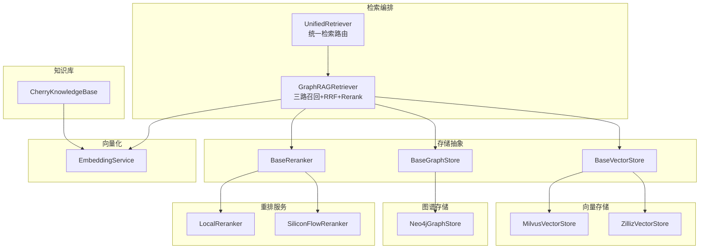
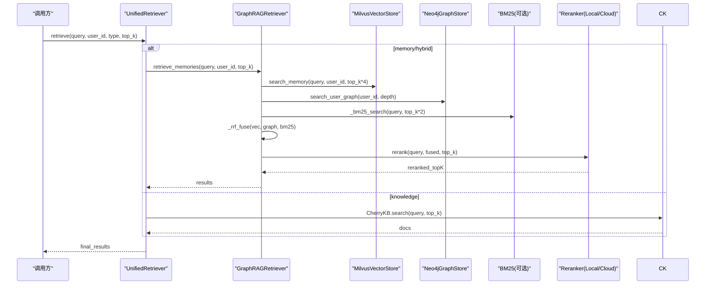
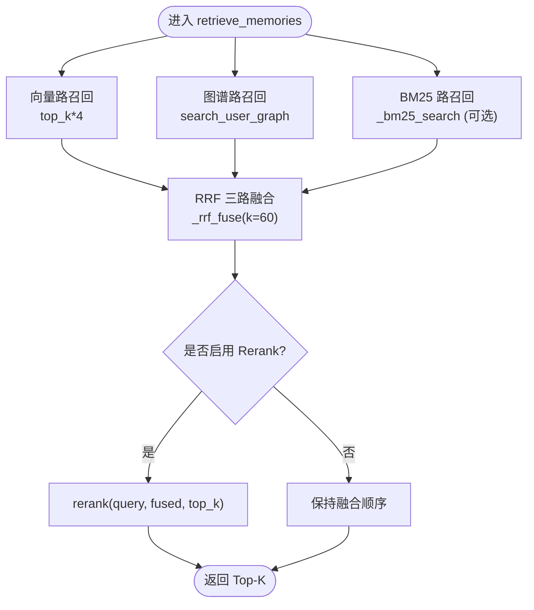
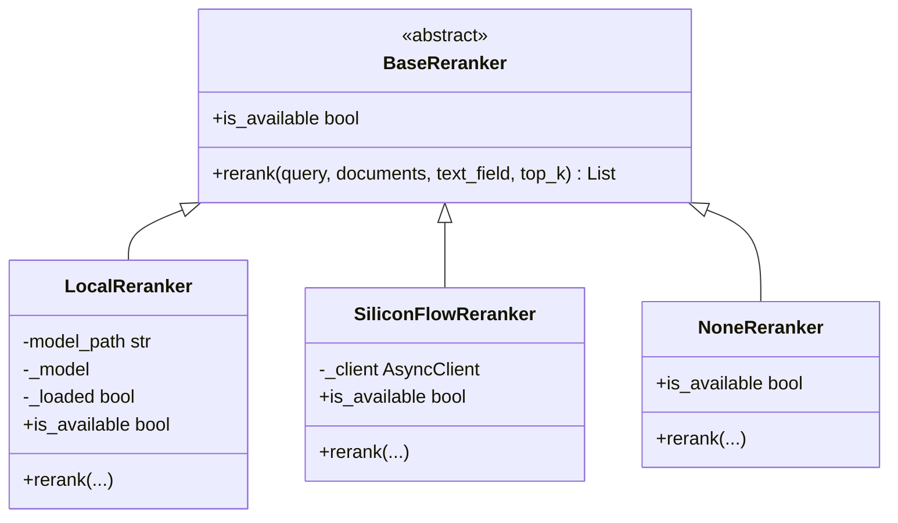
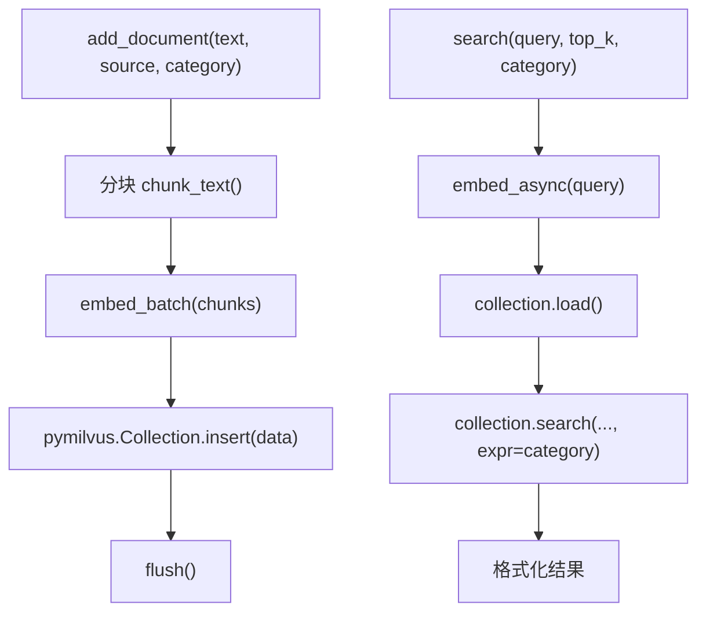
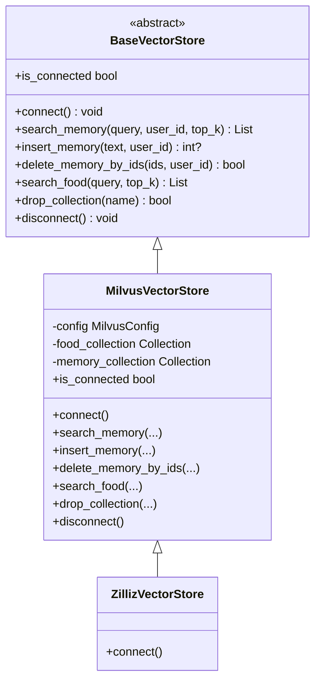
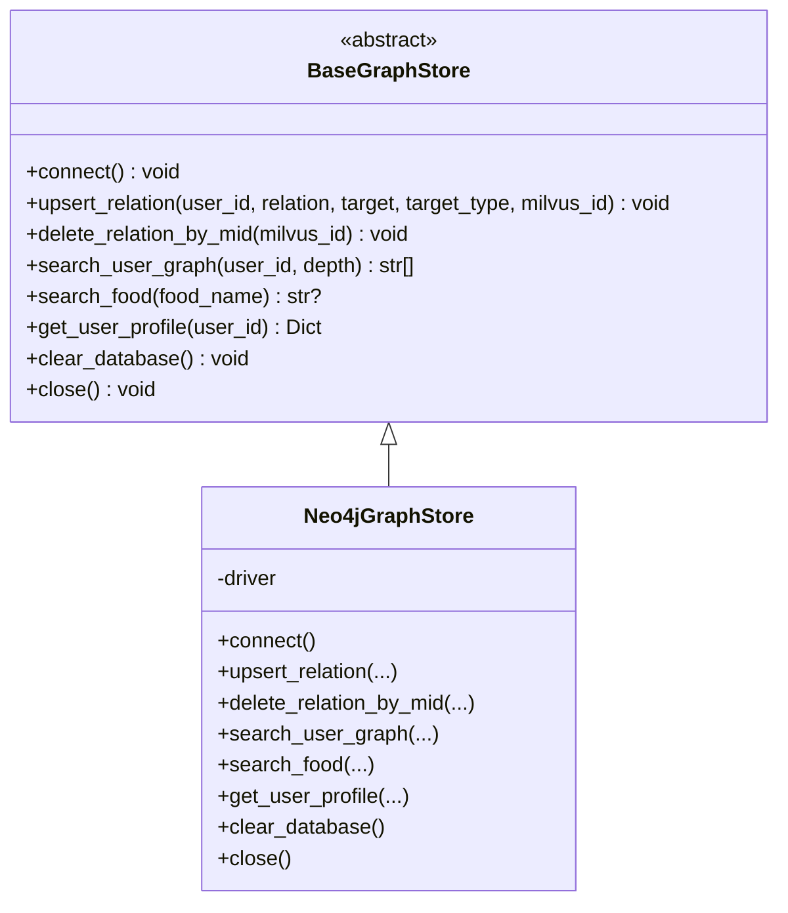
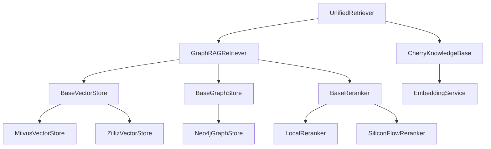

# GraphRAG检索架构

<cite>
**本文引用的文件**   
- [unified_retriever.py](file://backend_design/nexus/rag/unified_retriever.py)
- [retriever.py](file://backend_design/nexus/rag/retriever.py)
- [cherry_kb.py](file://backend_design/nexus/rag/cherry_kb.py)
- [reranker.py](file://backend_design/nexus/rag/reranker.py)
- [siliconflow_reranker.py](file://backend_design/nexus/rag/siliconflow_reranker.py)
- [reranker_factory.py](file://backend_design/nexus/rag/reranker_factory.py)
- [embedding.py](file://backend_design/nexus/rag/embedding.py)
- [vector_store.py](file://backend_design/nexus/rag/vector_store.py)
- [zilliz_vector_store.py](file://backend_design/nexus/rag/zilliz_vector_store.py)
- [graph_store.py](file://backend_design/nexus/rag/graph_store.py)
- [vector_base.py](file://backend_design/nexus/rag/vector_base.py)
- [graph_base.py](file://backend_design/nexus/rag/graph_base.py)
- [config.py](file://backend_design/nexus/config.py)
</cite>

## 目录
1. [引言](#引言)
2. [项目结构](#项目结构)
3. [核心组件](#核心组件)
4. [架构总览](#架构总览)
5. [详细组件分析](#详细组件分析)
6. [依赖关系分析](#依赖关系分析)
7. [性能与优化](#性能与优化)
8. [故障排查指南](#故障排查指南)
9. [结论](#结论)
10. [附录](#附录)

## 引言
本文件为 NexusCockpit 的 GraphRAG 检索系统提供系统化、可落地的架构文档。重点覆盖：
- 三路融合检索（向量检索 + 图谱检索 + BM25 全文检索）
- RRF 融合算法与重排序机制
- CherryKB 知识库管理（分块、向量化、Milvus 存储与检索）
- Milvus 向量数据库与 Neo4j 图数据库集成方案
- Embedding 模型选择与向量化策略
- 检索质量评估指标、性能优化与缓存策略
- 检索流程图、数据索引结构与查询优化方案
- 自定义检索器开发指南与故障排查方法

## 项目结构
GraphRAG 相关代码集中在 backend_design/nexus/rag 目录下，采用“抽象接口 + 工厂模式 + 多后端实现”的分层设计：
- 抽象接口层：BaseVectorStore、BaseGraphStore、BaseReranker
- 后端实现层：MilvusVectorStore/ZillizVectorStore、Neo4jGraphStore、LocalReranker/SiliconFlowReranker
- 编排与路由层：GraphRAGRetriever（三路召回+RRF+Rerank）、UnifiedRetriever（记忆/知识混合路由）
- 知识库管理：CherryKnowledgeBase（文档入库、分块、检索）
- 配置中心：config.py（统一加载 .env，暴露 LLM/Milvus/Neo4j/Providers 等配置）

图表来源
- [unified_retriever.py:1-155](file://backend_design/nexus/rag/unified_retriever.py#L1-L155)
- [retriever.py:1-252](file://backend_design/nexus/rag/retriever.py#L1-L252)
- [vector_store.py:1-271](file://backend_design/nexus/rag/vector_store.py#L1-L271)
- [zilliz_vector_store.py:1-46](file://backend_design/nexus/rag/zilliz_vector_store.py#L1-L46)
- [graph_store.py:1-190](file://backend_design/nexus/rag/graph_store.py#L1-L190)
- [reranker.py:1-151](file://backend_design/nexus/rag/reranker.py#L1-L151)
- [siliconflow_reranker.py:1-112](file://backend_design/nexus/rag/siliconflow_reranker.py#L1-L112)
- [cherry_kb.py:1-287](file://backend_design/nexus/rag/cherry_kb.py#L1-L287)
- [embedding.py:1-137](file://backend_design/nexus/rag/embedding.py#L1-L137)

章节来源
- [unified_retriever.py:1-155](file://backend_design/nexus/rag/unified_retriever.py#L1-L155)
- [retriever.py:1-252](file://backend_design/nexus/rag/retriever.py#L1-L252)
- [cherry_kb.py:1-287](file://backend_design/nexus/rag/cherry_kb.py#L1-L287)
- [config.py:167-211](file://backend_design/nexus/config.py#L167-L211)

## 核心组件
- GraphRAGRetriever：实现三路召回（向量/图谱/BM25），RRF 融合，可选 Rerank 重排；支持用户记忆检索与食材检索。
- UnifiedRetriever：根据 query_type 分发到 GraphRAG（记忆）或 Cherry KB（手册/FAQ/保养），支持 hybrid 并行合并与 rerank。
- CherryKnowledgeBase：文档分块（递归字符分割器优先，降级滑动窗口）、批量向量化、Milvus 集合创建与检索。
- MilvusVectorStore / ZillizVectorStore：封装 Milvus 连接、集合初始化、HNSW/IVF_FLAT 索引、ANN 搜索。
- Neo4jGraphStore：用户画像关系图谱、双向绑定 Milvus ID、N 阶路径检索。
- LocalReranker / SiliconFlowReranker：本地 CrossEncoder 或云端 Rerank API，输出统一 rerank_score。
- EmbeddingService：调用 Ark API 获取 embedding，内置熔断与重试，支持批量并行。
- 配置中心 config.py：集中管理 LLM/Milvus/Neo4j/Providers 等参数，支持 local/cloud 双模式切换。

章节来源
- [retriever.py:38-178](file://backend_design/nexus/rag/retriever.py#L38-L178)
- [unified_retriever.py:33-155](file://backend_design/nexus/rag/unified_retriever.py#L33-L155)
- [cherry_kb.py:49-287](file://backend_design/nexus/rag/cherry_kb.py#L49-L287)
- [vector_store.py:38-271](file://backend_design/nexus/rag/vector_store.py#L38-L271)
- [zilliz_vector_store.py:24-46](file://backend_design/nexus/rag/zilliz_vector_store.py#L24-L46)
- [graph_store.py:24-190](file://backend_design/nexus/rag/graph_store.py#L24-L190)
- [reranker.py:34-151](file://backend_design/nexus/rag/reranker.py#L34-L151)
- [siliconflow_reranker.py:31-112](file://backend_design/nexus/rag/siliconflow_reranker.py#L31-L112)
- [embedding.py:32-137](file://backend_design/nexus/rag/embedding.py#L32-L137)
- [config.py:167-211](file://backend_design/nexus/config.py#L167-L211)

## 架构总览
GraphRAG 检索链路以“召回→融合→重排”为主线：
- 召回阶段：向量路（Milvus ANN）、图谱路（Neo4j 关系遍历）、BM25 路（关键词匹配）
- 融合阶段：RRF 三路融合，按 1/(k+rank) 累加分数
- 重排阶段：bge-reranker-v2-m3（本地或云端）对 Top-N 重排至 Top-K

图表来源
- [unified_retriever.py:63-155](file://backend_design/nexus/rag/unified_retriever.py#L63-L155)
- [retriever.py:141-178](file://backend_design/nexus/rag/retriever.py#L141-L178)
- [vector_store.py:134-168](file://backend_design/nexus/rag/vector_store.py#L134-L168)
- [graph_store.py:98-133](file://backend_design/nexus/rag/graph_store.py#L98-L133)
- [reranker.py:79-139](file://backend_design/nexus/rag/reranker.py#L79-L139)
- [siliconflow_reranker.py:49-107](file://backend_design/nexus/rag/siliconflow_reranker.py#L49-L107)

## 详细组件分析

### 三路召回与 RRF 融合
- 向量路：Milvus HNSW/IVF_FLAT 索引，余弦相似度搜索，返回带距离分数的候选集。
- 图谱路：Neo4j 基于用户节点进行 1~N 阶关系遍历，生成结构化文本片段参与融合。
- BM25 路：可选，使用 rank_bm25 对中文/英文混合文本进行分词与打分。
- RRF 融合：对三路结果按 1/(k+rank) 累计得分，去重后排序，得到融合候选。

图表来源
- [retriever.py:141-178](file://backend_design/nexus/rag/retriever.py#L141-L178)
- [retriever.py:192-245](file://backend_design/nexus/rag/retriever.py#L192-L245)

章节来源
- [retriever.py:85-178](file://backend_design/nexus/rag/retriever.py#L85-L178)
- [retriever.py:192-245](file://backend_design/nexus/rag/retriever.py#L192-L245)

### 重排序机制（Rerank）
- 本地模式：加载 BAAI/bge-reranker-v2-m3（CrossEncoder），CPU 推理约 200ms/20条，首次加载约 2s。
- 云端模式：硅基流动 Rerank API，复用 ARK_API_KEY/ARK_BASE_URL，返回 relevance_score。
- 空模式：NoneReranker 直接返回前 top_k 条，不重排。

图表来源
- [reranker_base.py:17-50](file://backend_design/nexus/rag/reranker_base.py#L17-L50)
- [reranker.py:34-151](file://backend_design/nexus/rag/reranker.py#L34-L151)
- [siliconflow_reranker.py:31-112](file://backend_design/nexus/rag/siliconflow_reranker.py#L31-L112)
- [reranker_factory.py:27-65](file://backend_design/nexus/rag/reranker_factory.py#L27-L65)

章节来源
- [reranker.py:34-151](file://backend_design/nexus/rag/reranker.py#L34-L151)
- [siliconflow_reranker.py:31-112](file://backend_design/nexus/rag/siliconflow_reranker.py#L31-L112)
- [reranker_factory.py:47-65](file://backend_design/nexus/rag/reranker_factory.py#L47-L65)

### CherryKB 知识库管理
- 分块策略：优先 langchain_text_splitters.RecursiveCharacterTextSplitter（多级分隔符），否则降级为滑动窗口。
- 向量化：批量调用 EmbeddingService.embed_batch，减少网络往返。
- 存储：Milvus 集合 nexus_kb_docs，字段包含 id/text/source/category/vector，IVF_FLAT 索引。
- 检索：按 category 过滤，COSINE 相似度搜索，返回 text/source/category/score。

图表来源
- [cherry_kb.py:134-182](file://backend_design/nexus/rag/cherry_kb.py#L134-L182)
- [cherry_kb.py:184-207](file://backend_design/nexus/rag/cherry_kb.py#L184-L207)
- [cherry_kb.py:209-266](file://backend_design/nexus/rag/cherry_kb.py#L209-L266)

章节来源
- [cherry_kb.py:49-287](file://backend_design/nexus/rag/cherry_kb.py#L49-L287)

### Milvus 向量库集成
- 集合：Food_List（食材）、User_Memory（用户记忆）；nexus_kb_docs（CherryKB）。
- 索引：HNSW（高召回率场景）与 IVF_FLAT（文档集合），度量 IP/COSINE。
- 搜索：通过 embedding_service 将查询转向量，执行 ANN 近似搜索，支持 user_id 过滤。

图表来源
- [vector_base.py:22-70](file://backend_design/nexus/rag/vector_base.py#L22-L70)
- [vector_store.py:38-271](file://backend_design/nexus/rag/vector_store.py#L38-L271)
- [zilliz_vector_store.py:24-46](file://backend_design/nexus/rag/zilliz_vector_store.py#L24-L46)

章节来源
- [vector_store.py:52-132](file://backend_design/nexus/rag/vector_store.py#L52-L132)
- [vector_store.py:134-245](file://backend_design/nexus/rag/vector_store.py#L134-L245)
- [zilliz_vector_store.py:31-46](file://backend_design/nexus/rag/zilliz_vector_store.py#L31-L46)

### Neo4j 图谱库集成
- 约束与索引：User.id 唯一约束、Entity.name 索引。
- 关系建模：(User)-[:RELATION {mid: milvus_id}]->(Entity)，支持 N 阶路径检索。
- 双向绑定：Milvus 主键 mid 写入关系属性，便于跨库关联。

图表来源
- [graph_base.py:17-61](file://backend_design/nexus/rag/graph_base.py#L17-L61)
- [graph_store.py:24-190](file://backend_design/nexus/rag/graph_store.py#L24-L190)

章节来源
- [graph_store.py:31-133](file://backend_design/nexus/rag/graph_store.py#L31-L133)

### Embedding 模型与向量化策略
- 模型选择：默认 Qwen/Qwen3-Embedding-4B，维度 2560，可通过配置切换。
- 向量化策略：单条 embed 与批量 embed_batch 并行处理，失败回退零向量；HTTP 客户端复用，超时 30s。
- 容错：CircuitBreaker 连续失败 3 次熔断 15s；tenacity 指数退避重试最多 3 次。

章节来源
- [embedding.py:32-137](file://backend_design/nexus/rag/embedding.py#L32-L137)
- [config.py:97-164](file://backend_design/nexus/config.py#L97-L164)

### 统一检索路由（UnifiedRetriever）
- 路由策略：memory/knowledge/hybrid/auto；auto 基于关键词启发式判断。
- Hybrid 模式：并行检索 GraphRAG 与 Cherry KB，合并后 rerank，最终截断 top_k。

章节来源
- [unified_retriever.py:33-155](file://backend_design/nexus/rag/unified_retriever.py#L33-L155)

## 依赖关系分析
- 组件耦合：
  - GraphRAGRetriever 依赖 BaseVectorStore/BaseGraphStore/BaseReranker 抽象，降低后端替换成本。
  - CherryKB 依赖 EmbeddingService 与 Milvus 客户端，独立于 GraphRAG。
  - UnifiedRetriever 组合 GraphRAG 与 CherryKB，屏蔽差异。
- 外部依赖：
  - Milvus（本地 Docker 或 Zilliz Cloud）
  - Neo4j（本地或 AuraDB）
  - Ark API（Embedding/Rerank）
  - 可选：rank_bm25、jieba、langchain_text_splitters

图表来源
- [retriever.py:38-84](file://backend_design/nexus/rag/retriever.py#L38-L84)
- [unified_retriever.py:33-62](file://backend_design/nexus/rag/unified_retriever.py#L33-L62)
- [cherry_kb.py:49-98](file://backend_design/nexus/rag/cherry_kb.py#L49-L98)
- [vector_store.py:38-70](file://backend_design/nexus/rag/vector_store.py#L38-L70)
- [graph_store.py:24-43](file://backend_design/nexus/rag/graph_store.py#L24-L43)
- [reranker.py:34-50](file://backend_design/nexus/rag/reranker.py#L34-L50)
- [siliconflow_reranker.py:31-47](file://backend_design/nexus/rag/siliconflow_reranker.py#L31-L47)

章节来源
- [retriever.py:38-84](file://backend_design/nexus/rag/retriever.py#L38-L84)
- [unified_retriever.py:33-62](file://backend_design/nexus/rag/unified_retriever.py#L33-L62)
- [cherry_kb.py:49-98](file://backend_design/nexus/rag/cherry_kb.py#L49-L98)

## 性能与优化
- 召回规模控制：
  - 向量路召回 top_k*4，BM25 路 top_k*2，RRF 融合后再 Rerank 至 top_k，兼顾召回率与延迟。
- 索引与搜索参数：
  - Milvus HNSW：M=16, efConstruction=200；搜索 ef=64；文档集合使用 IVF_FLAT nlist=128，nprobe=10。
- 并发与批处理：
  - EmbeddingService 批量嵌入，线程池并发；Hybrid 检索使用 asyncio.gather 并行。
- 可选 BM25：
  - 未安装 rank_bm25/jieba 时自动降级，避免阻塞启动。
- 重排开关：
  - 通过 ProvidersConfig.reranker 选择 none/local/cloud，按需关闭以提升吞吐。
- 缓存策略（语义缓存）：
  - Redis 语义缓存阈值、TTL 由配置控制，命中则跳过 LLM/检索链路（见配置项）。

章节来源
- [retriever.py:141-178](file://backend_design/nexus/rag/retriever.py#L141-L178)
- [vector_store.py:91-132](file://backend_design/nexus/rag/vector_store.py#L91-L132)
- [cherry_kb.py:121-130](file://backend_design/nexus/rag/cherry_kb.py#L121-L130)
- [embedding.py:74-105](file://backend_design/nexus/rag/embedding.py#L74-L105)
- [unified_retriever.py:126-155](file://backend_design/nexus/rag/unified_retriever.py#L126-L155)
- [config.py:214-247](file://backend_design/nexus/config.py#L214-L247)

## 故障排查指南
- 连接问题
  - Milvus 连接失败：检查 MILVUS_URI/MILVUS_TOKEN 与集合是否存在；查看日志中 VectorStoreError。
  - Neo4j 连接失败：核对 NEO4J_URI/USER/PASSWORD；确认驱动连通性。
- 模型与依赖
  - Reranker 不可用：确认本地模型路径 ./models/reranker/bge-reranker-v2-m3 存在，或云端 ARK_API_KEY 有效。
  - BM25 禁用：未安装 rank_bm25/jieba 会降级，不影响主流程。
- 检索为空
  - 向量检索为空：检查 embedding_dim 与集合维度一致；确认 collection.load() 成功。
  - 图谱检索为空：确认 User 节点与关系已建立，user_id 正确。
- 性能异常
  - 延迟过高：调小 top_k、ef、nprobe；关闭 Rerank 或切换到 none。
  - 内存占用：降低 batch_size 或关闭 BM25。

章节来源
- [vector_store.py:52-70](file://backend_design/nexus/rag/vector_store.py#L52-L70)
- [graph_store.py:31-43](file://backend_design/nexus/rag/graph_store.py#L31-L43)
- [reranker.py:52-77](file://backend_design/nexus/rag/reranker.py#L52-L77)
- [retriever.py:85-101](file://backend_design/nexus/rag/retriever.py#L85-L101)
- [cherry_kb.py:209-266](file://backend_design/nexus/rag/cherry_kb.py#L209-L266)

## 结论
GraphRAG 检索系统通过“向量+图谱+BM25”三路召回与 RRF 融合，结合 bge-reranker-v2-m3 重排，在准确性与效率之间取得平衡。CherryKB 提供文档型知识的稳定召回，Milvus/Neo4j 作为可扩展的后端，配合统一的抽象与工厂模式，使系统在本地与云端环境间平滑迁移。通过合理的索引与搜索参数、并发批处理与可选的重排/全文检索，可在不同部署场景下获得稳定的检索质量与性能表现。

## 附录

### 数据索引结构（Milvus）
- Food_List：id(INT64), vector(FLOAT_VECTOR), item_name, category_name, cate_1_name, cate_2_name, cate_3_name
- User_Memory：id(INT64), user_id(VARCHAR), vector(FLOAT_VECTOR), text(VARCHAR), timestamp(INT64)
- nexus_kb_docs：id(VARCHAR), text(VARCHAR), source(VARCHAR), category(VARCHAR), vector(FLOAT_VECTOR)

章节来源
- [vector_store.py:72-132](file://backend_design/nexus/rag/vector_store.py#L72-L132)
- [cherry_kb.py:110-130](file://backend_design/nexus/rag/cherry_kb.py#L110-L130)

### 查询优化方案
- 调整 top_k 与 k（RRF 平滑常数）：增大召回规模提升召回率，但会增加 Rerank 开销。
- 调整 HNSW ef 与 IVF nprobe：提高精度或速度，需权衡延迟。
- 分类过滤：CherryKB 支持 category 过滤，缩小搜索空间。
- 关闭 BM25：在资源紧张或无需关键词精确匹配时禁用。

章节来源
- [retriever.py:192-245](file://backend_design/nexus/rag/retriever.py#L192-L245)
- [cherry_kb.py:209-266](file://backend_design/nexus/rag/cherry_kb.py#L209-L266)

### 检索质量评估指标
- 召回率/准确率：Top-K 命中率、相关性评分分布。
- 重排增益：对比 RRF 与 Rerank 后的 NDCG@K、MRR@K。
- 端到端延迟：P95/P99 延迟，各阶段耗时占比（向量/图谱/BM25/融合/重排）。
- 稳定性：熔断/重试成功率、错误率。

[本节为通用指导，不直接分析具体文件]

### 自定义检索器开发指南
- 新增向量后端：继承 BaseVectorStore，实现 connect/search_memory/insert_memory/delete_memory_by_ids/search_food/drop_collection/disconnect/is_connected，并在 vector_factory 中注册。
- 新增图谱后端：继承 BaseGraphStore，实现 upsert_relation/search_user_graph/get_user_profile 等方法，并在 graph_factory 中注册。
- 新增重排后端：继承 BaseReranker，实现 rerank/is_available，并在 reranker_factory 中注册。
- 接入 GraphRAGRetriever：确保新后端兼容现有输入输出约定（text/source/score/rerank_score）。

章节来源
- [vector_base.py:22-70](file://backend_design/nexus/rag/vector_base.py#L22-L70)
- [graph_base.py:17-61](file://backend_design/nexus/rag/graph_base.py#L17-L61)
- [reranker_base.py:17-50](file://backend_design/nexus/rag/reranker_base.py#L17-L50)
- [reranker_factory.py:47-65](file://backend_design/nexus/rag/reranker_factory.py#L47-L65)
- [vector_factory.py:25-45](file://backend_design/nexus/rag/vector_factory.py#L25-L45)