# 向量检索系统

<cite>
**本文引用的文件**   
- [backend_design/nexus/rag/vector_base.py](file://backend_design/nexus/rag/vector_base.py)
- [backend_design/nexus/rag/vector_store.py](file://backend_design/nexus/rag/vector_store.py)
- [backend_design/nexus/rag/zilliz_vector_store.py](file://backend_design/nexus/rag/zilliz_vector_store.py)
- [backend_design/nexus/rag/embedding.py](file://backend_design/nexus/rag/embedding.py)
- [backend_design/nexus/rag/retriever.py](file://backend_design/nexus/rag/retriever.py)
- [backend_design/nexus/rag/unified_retriever.py](file://backend_design/nexus/rag/unified_retriever.py)
- [backend_design/nexus/rag/reranker.py](file://backend_design/nexus/rag/reranker.py)
- [backend_design/nexus/rag/siliconflow_reranker.py](file://backend_design/nexus/rag/siliconflow_reranker.py)
- [backend_design/nexus/config.py](file://backend_design/nexus/config.py)
- [scripts/init_milvus.py](file://scripts/init_milvus.py)
</cite>

## 目录
1. [简介](#简介)
2. [项目结构](#项目结构)
3. [核心组件](#核心组件)
4. [架构总览](#架构总览)
5. [详细组件分析](#详细组件分析)
6. [依赖关系分析](#依赖关系分析)
7. [性能考虑](#性能考虑)
8. [故障排查指南](#故障排查指南)
9. [结论](#结论)
10. [附录](#附录)

## 简介
本技术文档聚焦于 NexusCockpit 的向量检索子系统，围绕以下目标展开：
- 向量数据库抽象层设计：BaseVectorStore 接口规范与 Milvus/Zilliz Cloud 的具体实现。
- Embedding 模型集成方案：文本向量化策略、模型选择与批量处理优化。
- 索引构建算法、相似度计算与召回优化：包括索引类型、度量方式、TopK 与重排策略。
- 数据生命周期管理：增量索引更新、缓存策略与一致性保障。
- 性能调优与扩展：面向生产环境的参数建议与自定义存储适配器开发方法。

## 项目结构
向量检索相关代码位于后端 RAG 模块中，关键文件如下：
- 抽象与工厂
  - vector_base.py：定义 BaseVectorStore 抽象接口（集合管理、写入、查询、删除等）。
  - vector_store.py：提供统一入口与配置解析，负责实例化具体向量存储。
- 具体实现
  - zilliz_vector_store.py：基于 Milvus/Zilliz Cloud SDK 的实现。
- Embedding 与检索
  - embedding.py：封装文本到向量的转换逻辑，支持多种后端与批处理。
  - retriever.py：基础检索器，组合 Embedding 与向量存储进行相似性搜索。
  - unified_retriever.py：统一检索编排，串联多源检索与重排。
- 重排器
  - reranker.py：重排基类与通用逻辑。
  - siliconflow_reranker.py：基于 SiliconFlow 的重排实现。
- 配置与初始化
  - config.py：集中式配置加载（含向量库与 Embedding 配置项）。
  - scripts/init_milvus.py：Milvus/Zilliz 集合与索引初始化脚本。

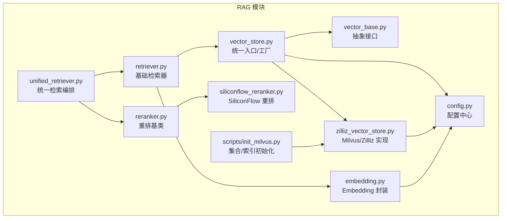

图表来源
- [backend_design/nexus/rag/vector_base.py](file://backend_design/nexus/rag/vector_base.py)
- [backend_design/nexus/rag/vector_store.py](file://backend_design/nexus/rag/vector_store.py)
- [backend_design/nexus/rag/zilliz_vector_store.py](file://backend_design/nexus/rag/zilliz_vector_store.py)
- [backend_design/nexus/rag/embedding.py](file://backend_design/nexus/rag/embedding.py)
- [backend_design/nexus/rag/retriever.py](file://backend_design/nexus/rag/retriever.py)
- [backend_design/nexus/rag/unified_retriever.py](file://backend_design/nexus/rag/unified_retriever.py)
- [backend_design/nexus/rag/reranker.py](file://backend_design/nexus/rag/reranker.py)
- [backend_design/nexus/rag/siliconflow_reranker.py](file://backend_design/nexus/rag/siliconflow_reranker.py)
- [backend_design/nexus/config.py](file://backend_design/nexus/config.py)
- [scripts/init_milvus.py](file://scripts/init_milvus.py)

章节来源
- [backend_design/nexus/rag/vector_base.py](file://backend_design/nexus/rag/vector_base.py)
- [backend_design/nexus/rag/vector_store.py](file://backend_design/nexus/rag/vector_store.py)
- [backend_design/nexus/rag/zilliz_vector_store.py](file://backend_design/nexus/rag/zilliz_vector_store.py)
- [backend_design/nexus/rag/embedding.py](file://backend_design/nexus/rag/embedding.py)
- [backend_design/nexus/rag/retriever.py](file://backend_design/nexus/rag/retriever.py)
- [backend_design/nexus/rag/unified_retriever.py](file://backend_design/nexus/rag/unified_retriever.py)
- [backend_design/nexus/rag/reranker.py](file://backend_design/nexus/rag/reranker.py)
- [backend_design/nexus/rag/siliconflow_reranker.py](file://backend_design/nexus/rag/siliconflow_reranker.py)
- [backend_design/nexus/config.py](file://backend_design/nexus/config.py)
- [scripts/init_milvus.py](file://scripts/init_milvus.py)

## 核心组件
- BaseVectorStore 抽象接口
  - 职责：定义集合创建/存在检查、插入/批量插入、删除、按向量或标量过滤检索、元数据字段管理等能力。
  - 典型方法：集合管理、upsert、query_by_vector、delete_by_id、list_collections、describe_collection 等。
- VectorStore 统一入口
  - 职责：从配置中选择并实例化具体向量存储；对外暴露一致的 API。
- Zilliz/Milvus 实现
  - 职责：对接 Milvus/Zilliz Cloud SDK，完成连接、集合与索引管理、向量写入与检索。
- Embedding 封装
  - 职责：将文本转换为向量，支持本地/远程模型、批处理、错误重试与降级。
- Retriever 与 UnifiedRetriever
  - 职责：组合 Embedding 与向量存储执行相似性检索；统一编排多路召回与重排。
- Reranker 与 SiliconFlow 重排
  - 职责：对召回结果进行相关性重排序，提升最终答案质量。
- 配置与初始化
  - 职责：集中加载向量库、Embedding、重排器等配置；提供 Milvus 集合与索引初始化脚本。

章节来源
- [backend_design/nexus/rag/vector_base.py](file://backend_design/nexus/rag/vector_base.py)
- [backend_design/nexus/rag/vector_store.py](file://backend_design/nexus/rag/vector_store.py)
- [backend_design/nexus/rag/zilliz_vector_store.py](file://backend_design/nexus/rag/zilliz_vector_store.py)
- [backend_design/nexus/rag/embedding.py](file://backend_design/nexus/rag/embedding.py)
- [backend_design/nexus/rag/retriever.py](file://backend_design/nexus/rag/retriever.py)
- [backend_design/nexus/rag/unified_retriever.py](file://backend_design/nexus/rag/unified_retriever.py)
- [backend_design/nexus/rag/reranker.py](file://backend_design/nexus/rag/reranker.py)
- [backend_design/nexus/rag/siliconflow_reranker.py](file://backend_design/nexus/rag/siliconflow_reranker.py)
- [backend_design/nexus/config.py](file://backend_design/nexus/config.py)
- [scripts/init_milvus.py](file://scripts/init_milvus.py)

## 架构总览
整体流程：用户查询进入统一检索编排，先通过 Embedding 将查询转为向量，再调用向量存储进行近似最近邻检索，最后经重排器输出高质量结果。

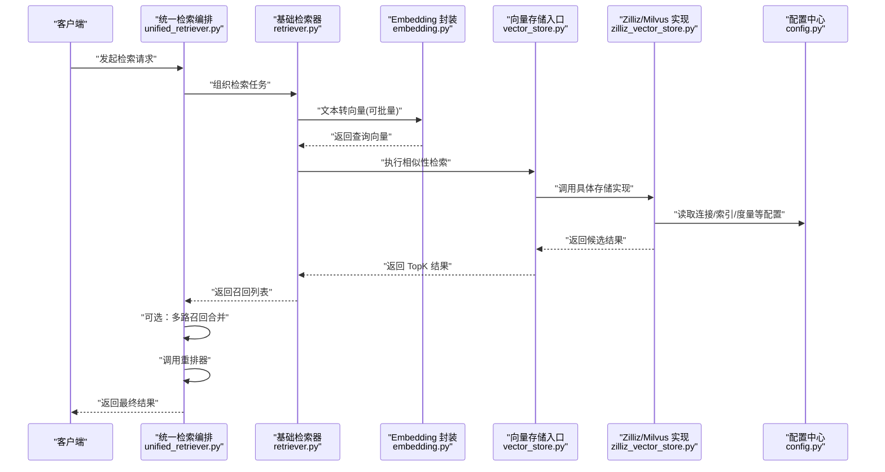

图表来源
- [backend_design/nexus/rag/unified_retriever.py](file://backend_design/nexus/rag/unified_retriever.py)
- [backend_design/nexus/rag/retriever.py](file://backend_design/nexus/rag/retriever.py)
- [backend_design/nexus/rag/embedding.py](file://backend_design/nexus/rag/embedding.py)
- [backend_design/nexus/rag/vector_store.py](file://backend_design/nexus/rag/vector_store.py)
- [backend_design/nexus/rag/zilliz_vector_store.py](file://backend_design/nexus/rag/zilliz_vector_store.py)
- [backend_design/nexus/config.py](file://backend_design/nexus/config.py)

## 详细组件分析

### 向量数据库抽象层：BaseVectorStore 接口
- 设计要点
  - 以集合为维度隔离数据，支持集合存在性检查与创建。
  - 提供 upsert/insert/delete/query 等标准操作，屏蔽底层差异。
  - 支持标量字段与向量字段的描述与约束，便于动态 schema 管理。
- 关键方法（概念）
  - 集合管理：create_collection、has_collection、list_collections、describe_collection
  - 数据写入：upsert、insert、delete_by_id
  - 检索：query_by_vector、query_by_scalar、hybrid_query
  - 元数据：get_field_schema、update_field_schema
- 异常与一致性
  - 幂等写入：upsert 保证重复插入不产生冲突。
  - 失败回滚：批量写入时部分失败应记录并返回明细。
  - 超时与重试：对网络抖动与远端服务波动具备容错。

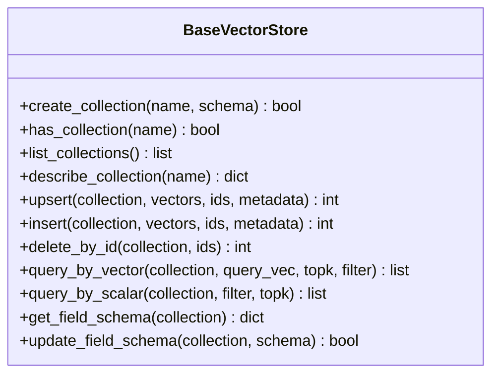

图表来源
- [backend_design/nexus/rag/vector_base.py](file://backend_design/nexus/rag/vector_base.py)

章节来源
- [backend_design/nexus/rag/vector_base.py](file://backend_design/nexus/rag/vector_base.py)

### Milvus/Zilliz Cloud 实现：ZillizVectorStore
- 职责
  - 基于 Milvus/Zilliz Cloud SDK 实现 BaseVectorStore 接口。
  - 管理连接池、集合与索引生命周期。
  - 根据配置选择索引类型与相似度度量（如 HNSW、IVF_FLAT、IP/COSINE）。
- 关键流程
  - 连接与认证：从配置读取地址、令牌、集合名、索引参数。
  - 集合与索引：首次启动或按需初始化集合与索引。
  - 写入与检索：批量 upsert、向量检索、标量过滤。
- 注意事项
  - 向量维度需与 Embedding 输出一致。
  - 索引构建耗时与内存占用需结合数据规模评估。
  - 大规模场景建议分区/分片策略与冷热数据分层。

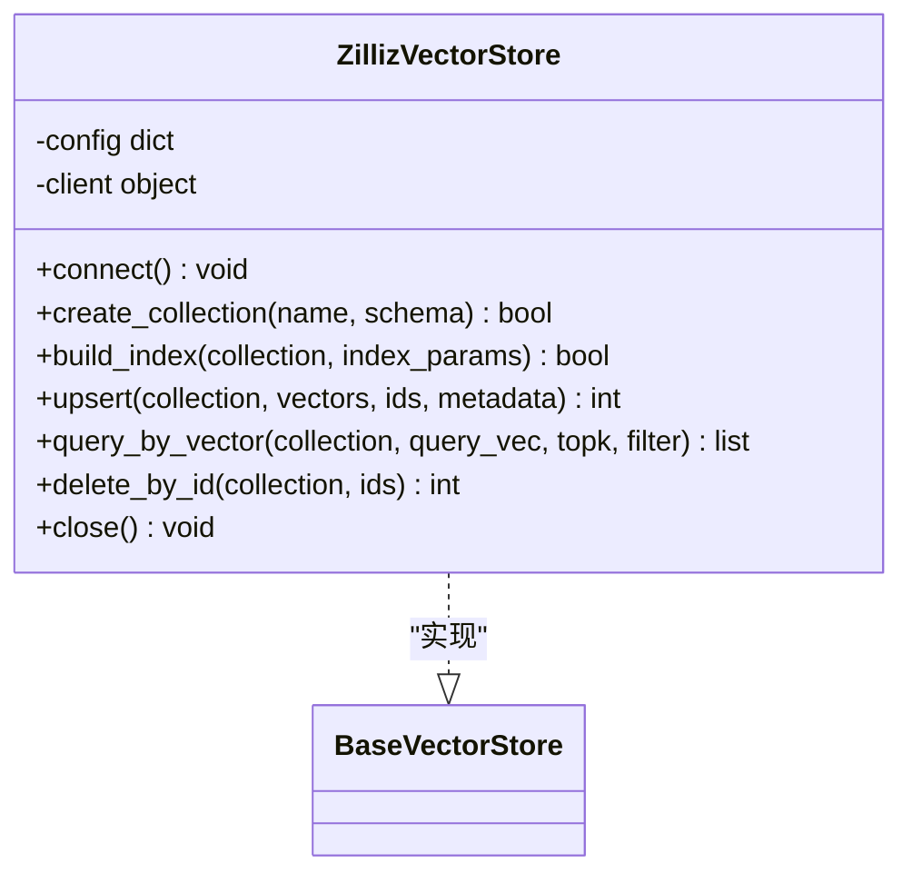

图表来源
- [backend_design/nexus/rag/zilliz_vector_store.py](file://backend_design/nexus/rag/zilliz_vector_store.py)
- [backend_design/nexus/rag/vector_base.py](file://backend_design/nexus/rag/vector_base.py)

章节来源
- [backend_design/nexus/rag/zilliz_vector_store.py](file://backend_design/nexus/rag/zilliz_vector_store.py)
- [backend_design/nexus/rag/vector_base.py](file://backend_design/nexus/rag/vector_base.py)

### 统一入口与工厂：VectorStore
- 职责
  - 解析配置，选择并实例化具体向量存储实现。
  - 对外暴露统一的 create/get 接口，隐藏实现细节。
- 使用模式
  - 应用启动时加载配置，构造默认实例。
  - 运行时可按租户/环境切换不同后端。

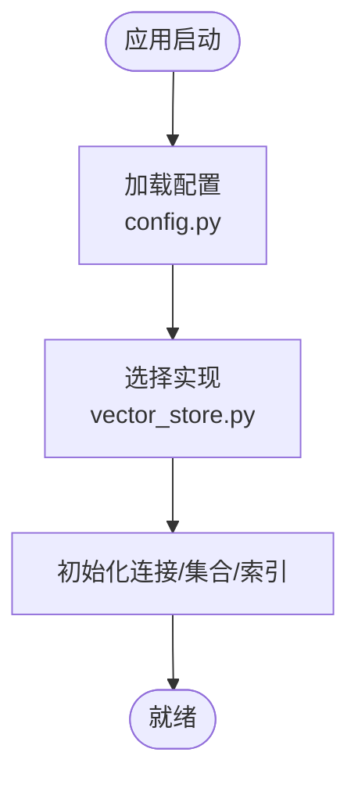

图表来源
- [backend_design/nexus/rag/vector_store.py](file://backend_design/nexus/rag/vector_store.py)
- [backend_design/nexus/config.py](file://backend_design/nexus/config.py)

章节来源
- [backend_design/nexus/rag/vector_store.py](file://backend_design/nexus/rag/vector_store.py)
- [backend_design/nexus/config.py](file://backend_design/nexus/config.py)

### Embedding 模型集成方案
- 文本向量化策略
  - 单条与批量：优先批量以减少网络往返与模型预热开销。
  - 分块与去重：长文本按语义切块，重复内容去重后再嵌入。
  - 维度对齐：确保输出维度与向量库 schema 一致。
- 模型选择
  - 本地模型：低延迟、可控成本，适合内网部署。
  - 云端 API：高可用、免运维，注意带宽与费用。
- 批处理优化
  - 动态批大小：根据 GPU/CPU 资源与延迟目标自适应调整。
  - 并发控制：限制并发数避免过载。
  - 错误重试与降级：网络抖动自动重试，失败时回退至备用模型或缓存。
- 缓存策略
  - 文本指纹哈希作为键，命中则直接返回向量，减少重复计算。
  - 缓存失效：当上游文本变更或版本升级时清理对应条目。

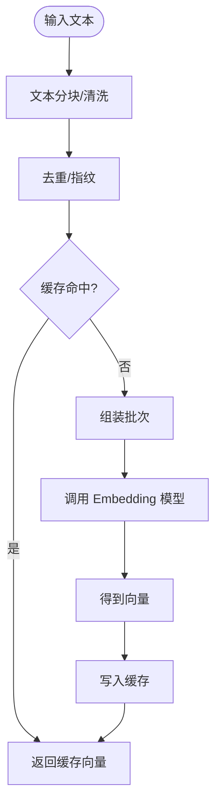

章节来源
- [backend_design/nexus/rag/embedding.py](file://backend_design/nexus/rag/embedding.py)
- [backend_design/nexus/config.py](file://backend_design/nexus/config.py)

### 检索与重排：Retriever 与 UnifiedRetriever
- Retriever
  - 将查询文本经 Embedding 转为向量后，调用向量存储进行 TopK 检索。
  - 支持标量过滤（如时间范围、标签、租户 ID）。
- UnifiedRetriever
  - 多路召回：并行调用多个检索源（不同集合/不同模型），合并候选集。
  - 重排：调用 Reranker 对候选集进行精排，输出最终结果。
  - 降级：当某路不可用时，自动跳过并继续其他路。

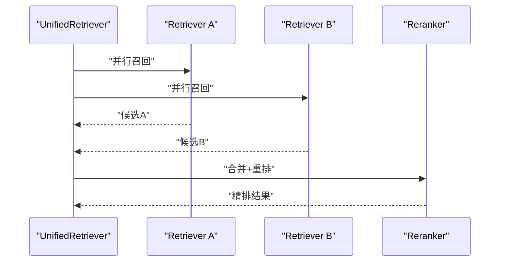

图表来源
- [backend_design/nexus/rag/unified_retriever.py](file://backend_design/nexus/rag/unified_retriever.py)
- [backend_design/nexus/rag/retriever.py](file://backend_design/nexus/rag/retriever.py)
- [backend_design/nexus/rag/reranker.py](file://backend_design/nexus/rag/reranker.py)
- [backend_design/nexus/rag/siliconflow_reranker.py](file://backend_design/nexus/rag/siliconflow_reranker.py)

章节来源
- [backend_design/nexus/rag/retriever.py](file://backend_design/nexus/rag/retriever.py)
- [backend_design/nexus/rag/unified_retriever.py](file://backend_design/nexus/rag/unified_retriever.py)
- [backend_design/nexus/rag/reranker.py](file://backend_design/nexus/rag/reranker.py)
- [backend_design/nexus/rag/siliconflow_reranker.py](file://backend_design/nexus/rag/siliconflow_reranker.py)

### 索引构建与相似度计算
- 索引类型
  - HNSW：适合高维向量、低延迟检索，内存占用较高。
  - IVF_FLAT：适合中等规模、可调节 nlist/nprobe 平衡精度与速度。
  - DiskANN：适合超大规模、磁盘友好但构建较慢。
- 相似度度量
  - IP（内积）：适用于归一化向量。
  - COSINE：常用于 L2 归一化后的余弦相似度。
  - L2：欧氏距离，适合未归一化向量。
- 构建流程
  - 确定向量维度与度量。
  - 选择索引类型与参数（如 M、efConstruction、nlist、nprobe）。
  - 预填充数据后构建索引，监控构建时间与内存峰值。
  - 上线前进行基准测试，验证 P95/P99 延迟与召回率。

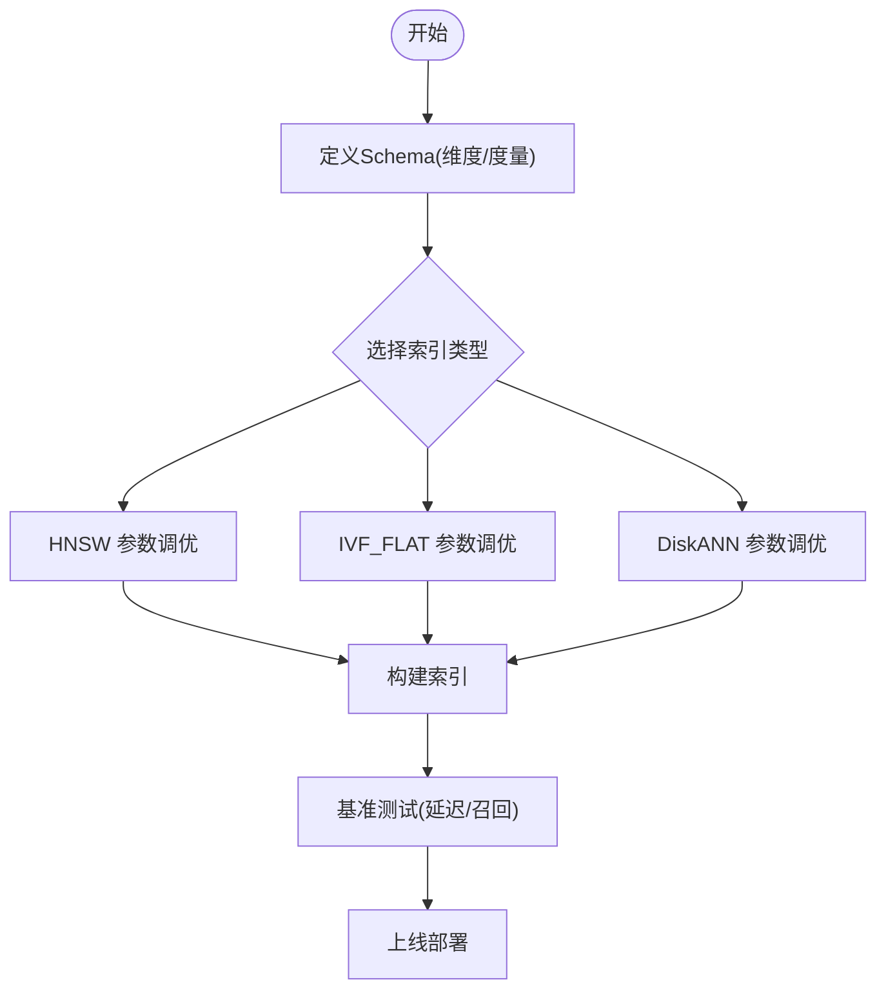

图表来源
- [backend_design/nexus/rag/zilliz_vector_store.py](file://backend_design/nexus/rag/zilliz_vector_store.py)
- [scripts/init_milvus.py](file://scripts/init_milvus.py)

章节来源
- [backend_design/nexus/rag/zilliz_vector_store.py](file://backend_design/nexus/rag/zilliz_vector_store.py)
- [scripts/init_milvus.py](file://scripts/init_milvus.py)

### 数据生命周期管理与增量更新
- 生命周期
  - 写入：upsert 支持幂等更新，避免重复数据。
  - 检索：TopK 检索配合标量过滤，提高精准度。
  - 删除：按主键删除，支持批量删除。
  - 归档：冷数据迁移至低成本存储或历史集合。
- 增量更新
  - 事件驱动：新增/修改/删除事件触发增量 upsert/delete。
  - 批处理窗口：定时聚合小批量变更，降低频繁 IO。
  - 幂等与去重：基于业务主键与版本号保证一致性。
- 缓存策略
  - 向量缓存：按文本指纹缓存向量，命中直接返回。
  - 结果缓存：短 TTL 缓存高频查询结果，减轻下游压力。
  - 失效策略：数据变更或模型版本升级时主动失效。

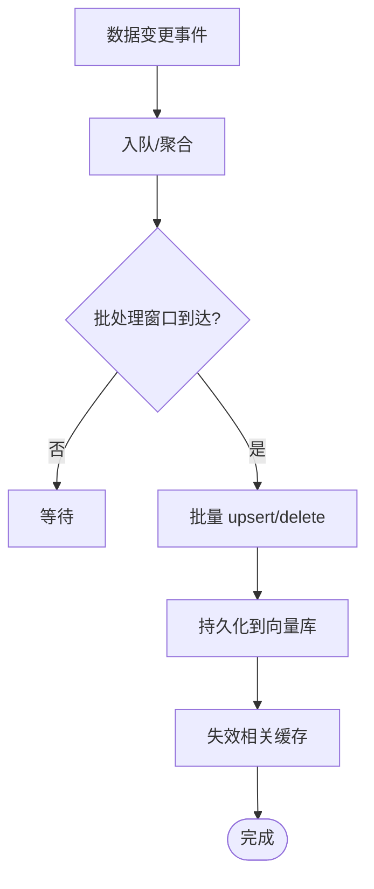

章节来源
- [backend_design/nexus/rag/vector_base.py](file://backend_design/nexus/rag/vector_base.py)
- [backend_design/nexus/rag/zilliz_vector_store.py](file://backend_design/nexus/rag/zilliz_vector_store.py)
- [backend_design/nexus/rag/embedding.py](file://backend_design/nexus/rag/embedding.py)

### 自定义向量存储适配器开发方法
- 步骤
  - 继承 BaseVectorStore，实现所有抽象方法。
  - 在 VectorStore 工厂中注册新实现，并通过配置切换。
  - 编写单元测试覆盖集合管理、写入、检索、删除路径。
  - 压测验证延迟、吞吐与资源占用，必要时引入连接池与限流。
- 注意事项
  - 严格遵循接口契约（参数、返回值、异常）。
  - 幂等写入与错误码规范。
  - 兼容现有索引与度量配置。

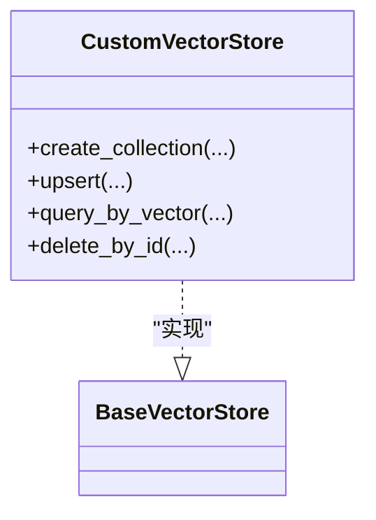

图表来源
- [backend_design/nexus/rag/vector_base.py](file://backend_design/nexus/rag/vector_base.py)
- [backend_design/nexus/rag/vector_store.py](file://backend_design/nexus/rag/vector_store.py)

章节来源
- [backend_design/nexus/rag/vector_base.py](file://backend_design/nexus/rag/vector_base.py)
- [backend_design/nexus/rag/vector_store.py](file://backend_design/nexus/rag/vector_store.py)

## 依赖关系分析
- 内部依赖
  - UnifiedRetriever 依赖 Retriever 与 Reranker。
  - Retriever 依赖 Embedding 与 VectorStore。
  - VectorStore 依赖具体实现（ZillizVectorStore）。
  - 各组件均依赖配置中心获取连接与参数。
- 外部依赖
  - Milvus/Zilliz Cloud SDK。
  - Embedding 模型提供方（本地或云端 API）。
  - 重排器（如 SiliconFlow）。

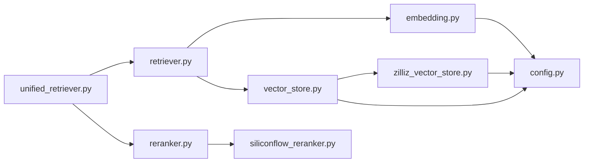

图表来源
- [backend_design/nexus/rag/unified_retriever.py](file://backend_design/nexus/rag/unified_retriever.py)
- [backend_design/nexus/rag/retriever.py](file://backend_design/nexus/rag/retriever.py)
- [backend_design/nexus/rag/embedding.py](file://backend_design/nexus/rag/embedding.py)
- [backend_design/nexus/rag/vector_store.py](file://backend_design/nexus/rag/vector_store.py)
- [backend_design/nexus/rag/zilliz_vector_store.py](file://backend_design/nexus/rag/zilliz_vector_store.py)
- [backend_design/nexus/rag/reranker.py](file://backend_design/nexus/rag/reranker.py)
- [backend_design/nexus/rag/siliconflow_reranker.py](file://backend_design/nexus/rag/siliconflow_reranker.py)
- [backend_design/nexus/config.py](file://backend_design/nexus/config.py)

章节来源
- [backend_design/nexus/rag/unified_retriever.py](file://backend_design/nexus/rag/unified_retriever.py)
- [backend_design/nexus/rag/retriever.py](file://backend_design/nexus/rag/retriever.py)
- [backend_design/nexus/rag/embedding.py](file://backend_design/nexus/rag/embedding.py)
- [backend_design/nexus/rag/vector_store.py](file://backend_design/nexus/rag/vector_store.py)
- [backend_design/nexus/rag/zilliz_vector_store.py](file://backend_design/nexus/rag/zilliz_vector_store.py)
- [backend_design/nexus/rag/reranker.py](file://backend_design/nexus/rag/reranker.py)
- [backend_design/nexus/rag/siliconflow_reranker.py](file://backend_design/nexus/rag/siliconflow_reranker.py)
- [backend_design/nexus/config.py](file://backend_design/nexus/config.py)

## 性能考虑
- 索引与度量
  - 高维向量优先 HNSW，合理设置 M 与 efConstruction。
  - 中等规模用 IVF_FLAT，调节 nlist 与 nprobe 平衡速度与精度。
  - 度量选择与向量归一化策略保持一致。
- 批处理与并发
  - Embedding 批量大小按资源动态调整，避免 OOM。
  - 向量写入采用批量 upsert，减少网络往返。
- 缓存与降级
  - 文本向量缓存命中率目标 > 80%。
  - 重排器与 Embedding 服务具备超时与熔断降级。
- 监控与压测
  - 关注 P95/P99 延迟、QPS、错误率与资源利用率。
  - 定期回归测试，确保变更后性能稳定。

[本节为通用指导，无需特定文件引用]

## 故障排查指南
- 常见问题
  - 连接失败：检查地址、端口、令牌与网络连通性。
  - 维度不匹配：确认 Embedding 输出维度与集合 schema 一致。
  - 索引未构建：确认初始化脚本是否成功执行。
  - 缓存未命中：检查缓存键生成规则与失效策略。
- 定位步骤
  - 查看配置是否正确加载。
  - 核对集合是否存在及索引状态。
  - 检查日志中的异常堆栈与重试次数。
  - 使用最小数据集复现问题，逐步缩小范围。

章节来源
- [backend_design/nexus/config.py](file://backend_design/nexus/config.py)
- [scripts/init_milvus.py](file://scripts/init_milvus.py)
- [backend_design/nexus/rag/zilliz_vector_store.py](file://backend_design/nexus/rag/zilliz_vector_store.py)
- [backend_design/nexus/rag/embedding.py](file://backend_design/nexus/rag/embedding.py)

## 结论
NexusCockpit 的向量检索系统通过清晰的抽象层与可扩展实现，提供了稳定的向量存储接入、灵活的 Embedding 集成与高效的检索重排链路。在生产环境中，建议结合数据规模选择合适的索引与度量，完善批处理与缓存策略，建立完善的监控与压测体系，并预留自定义存储适配器的扩展点以满足多样化需求。

[本节为总结，无需特定文件引用]

## 附录
- 术语
  - 向量：高维数值表示，用于近似最近邻检索。
  - 索引：加速向量检索的数据结构。
  - 相似度度量：衡量向量间相似性的数学方法。
  - 重排：对召回结果进行相关性精排以提升质量。
- 参考
  - 集合与索引初始化脚本：scripts/init_milvus.py
  - 配置中心：backend_design/nexus/config.py

[本节为补充信息，无需特定文件引用]