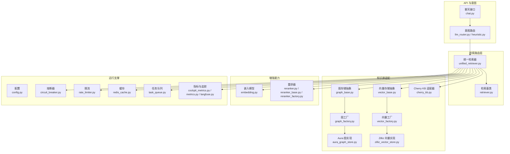
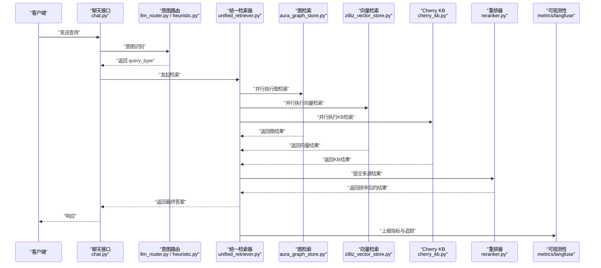
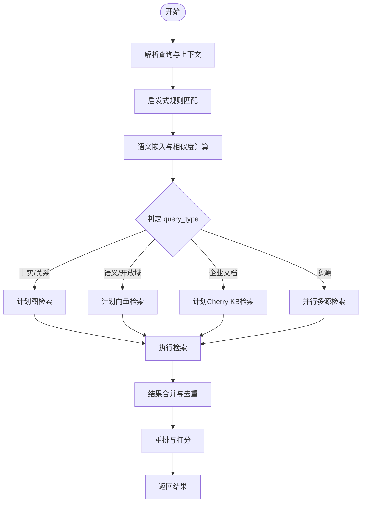
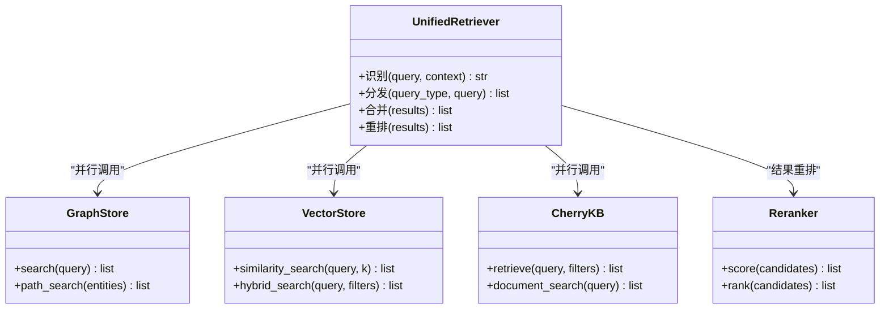
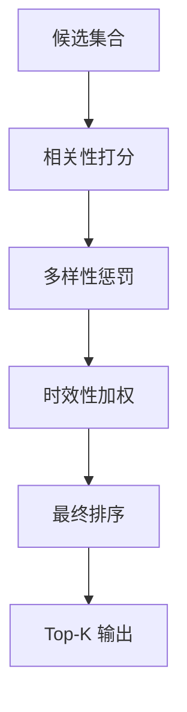
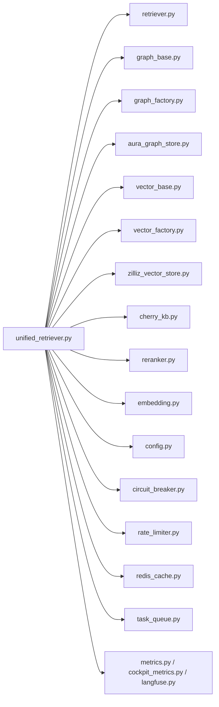

# 统一检索路由

<cite>
**本文引用的文件**
- [unified_retriever.py](file://backend_design/nexus/rag/unified_retriever.py)
- [retriever.py](file://backend_design/nexus/rag/retriever.py)
- [graph_base.py](file://backend_design/nexus/rag/graph_base.py)
- [graph_factory.py](file://backend_design/nexus/rag/graph_factory.py)
- [aura_graph_store.py](file://backend_design/nexus/rag/aura_graph_store.py)
- [cherry_kb.py](file://backend_design/nexus/rag/cherry_kb.py)
- [vector_base.py](file://backend_design/nexus/rag/vector_base.py)
- [vector_factory.py](file://backend_design/nexus/rag/vector_factory.py)
- [zilliz_vector_store.py](file://backend_design/nexus/rag/zilliz_vector_store.py)
- [reranker.py](file://backend_design/nexus/rag/reranker.py)
- [reranker_base.py](file://backend_design/nexus/rag/reranker_base.py)
- [reranker_factory.py](file://backend_design/nexus/rag/reranker_factory.py)
- [embedding.py](file://backend_design/nexus/rag/embedding.py)
- [config.py](file://backend_design/nexus/config.py)
- [circuit_breaker.py](file://backend_design/nexus/core/circuit_breaker.py)
- [cockpit_metrics.py](file://backend_design/nexus/observability/cockpit_metrics.py)
- [metrics.py](file://backend_design/nexus/observability/metrics.py)
- [langfuse.py](file://backend_design/nexus/observability/langfuse.py)
- [rate_limiter.py](file://backend_design/nexus/middleware/rate_limiter.py)
- [redis_cache.py](file://backend_design/nexus/middleware/redis_cache.py)
- [session_store.py](file://backend_design/nexus/middleware/session_store.py)
- [task_queue.py](file://backend_design/nexus/middleware/task_queue.py)
- [chat.py](file://backend_design/nexus/api/routes/chat.py)
- [llm_router.py](file://backend_design/nexus/intent/llm_router.py)
- [heuristic.py](file://backend_design/nexus/intent/heuristic.py)
- [degradation-strategy.md](file://docs/architecture/degradation-strategy.md)
</cite>

## 目录
1. [简介](#简介)
2. [项目结构](#项目结构)
3. [核心组件](#核心组件)
4. [架构总览](#架构总览)
5. [详细组件分析](#详细组件分析)
6. [依赖关系分析](#依赖关系分析)
7. [性能考量](#性能考量)
8. [故障排查指南](#故障排查指南)
9. [结论](#结论)
10. [附录](#附录)

## 简介
本技术文档聚焦于 NexusCockpit 的统一检索路由系统，围绕 UnifiedRetriever 路由层展开，系统性阐述以下主题：
- query_type 自动识别算法与多知识库分发策略
- GraphRAG 与 Cherry KB 的协同工作模式（混合检索、并行查询优化、异常处理）
- 结果合并机制与检索质量评估体系（相关性评分、多样性保证、时效性考虑）
- 路由策略配置、负载均衡与降级方案
- 检索链路监控、性能分析与故障诊断工具使用指南

## 项目结构
统一检索相关代码主要位于 backend_design/nexus/rag 目录，配合 core、middleware、observability 等模块提供运行时支撑。整体组织遵循“分层+可插拔”的设计：
- 路由与编排层：unified_retriever.py、retriever.py
- 知识源适配层：graph_base.py、graph_factory.py、aura_graph_store.py；vector_base.py、vector_factory.py、zilliz_vector_store.py；cherry_kb.py
- 重排与嵌入：reranker*.py、embedding.py
- 配置与可观测性：config.py、cockpit_metrics.py、metrics.py、langfuse.py
- 中间件与容错：rate_limiter.py、redis_cache.py、session_store.py、task_queue.py、circuit_breaker.py
- 上层入口与意图路由：api/routes/chat.py、intent/llm_router.py、intent/heuristic.py

图表来源
- [unified_retriever.py](file://backend_design/nexus/rag/unified_retriever.py)
- [retriever.py](file://backend_design/nexus/rag/retriever.py)
- [graph_base.py](file://backend_design/nexus/rag/graph_base.py)
- [graph_factory.py](file://backend_design/nexus/rag/graph_factory.py)
- [aura_graph_store.py](file://backend_design/nexus/rag/aura_graph_store.py)
- [vector_base.py](file://backend_design/nexus/rag/vector_base.py)
- [vector_factory.py](file://backend_design/nexus/rag/vector_factory.py)
- [zilliz_vector_store.py](file://backend_design/nexus/rag/zilliz_vector_store.py)
- [cherry_kb.py](file://backend_design/nexus/rag/cherry_kb.py)
- [reranker.py](file://backend_design/nexus/rag/reranker.py)
- [reranker_base.py](file://backend_design/nexus/rag/reranker_base.py)
- [reranker_factory.py](file://backend_design/nexus/rag/reranker_factory.py)
- [embedding.py](file://backend_design/nexus/rag/embedding.py)
- [config.py](file://backend_design/nexus/config.py)
- [circuit_breaker.py](file://backend_design/nexus/core/circuit_breaker.py)
- [rate_limiter.py](file://backend_design/nexus/middleware/rate_limiter.py)
- [redis_cache.py](file://backend_design/nexus/middleware/redis_cache.py)
- [task_queue.py](file://backend_design/nexus/middleware/task_queue.py)
- [cockpit_metrics.py](file://backend_design/nexus/observability/cockpit_metrics.py)
- [metrics.py](file://backend_design/nexus/observability/metrics.py)
- [langfuse.py](file://backend_design/nexus/observability/langfuse.py)
- [chat.py](file://backend_design/nexus/api/routes/chat.py)
- [llm_router.py](file://backend_design/nexus/intent/llm_router.py)
- [heuristic.py](file://backend_design/nexus/intent/heuristic.py)

章节来源
- [unified_retriever.py](file://backend_design/nexus/rag/unified_retriever.py)
- [retriever.py](file://backend_design/nexus/rag/retriever.py)
- [graph_base.py](file://backend_design/nexus/rag/graph_base.py)
- [graph_factory.py](file://backend_design/nexus/rag/graph_factory.py)
- [aura_graph_store.py](file://backend_design/nexus/rag/aura_graph_store.py)
- [vector_base.py](file://backend_design/nexus/rag/vector_base.py)
- [vector_factory.py](file://backend_design/nexus/rag/vector_factory.py)
- [zilliz_vector_store.py](file://backend_design/nexus/rag/zilliz_vector_store.py)
- [cherry_kb.py](file://backend_design/nexus/rag/cherry_kb.py)
- [reranker.py](file://backend_design/nexus/rag/reranker.py)
- [reranker_base.py](file://backend_design/nexus/rag/reranker_base.py)
- [reranker_factory.py](file://backend_design/nexus/rag/reranker_factory.py)
- [embedding.py](file://backend_design/nexus/rag/embedding.py)
- [config.py](file://backend_design/nexus/config.py)
- [circuit_breaker.py](file://backend_design/nexus/core/circuit_breaker.py)
- [rate_limiter.py](file://backend_design/nexus/middleware/rate_limiter.py)
- [redis_cache.py](file://backend_design/nexus/middleware/redis_cache.py)
- [task_queue.py](file://backend_design/nexus/middleware/task_queue.py)
- [cockpit_metrics.py](file://backend_design/nexus/observability/cockpit_metrics.py)
- [metrics.py](file://backend_design/nexus/observability/metrics.py)
- [langfuse.py](file://backend_design/nexus/observability/langfuse.py)
- [chat.py](file://backend_design/nexus/api/routes/chat.py)
- [llm_router.py](file://backend_design/nexus/intent/llm_router.py)
- [heuristic.py](file://backend_design/nexus/intent/heuristic.py)

## 核心组件
- 统一检索器（UnifiedRetriever）
  - 职责：接收用户查询，进行 query_type 自动识别，按策略分发到图检索、向量检索或 Cherry KB，并负责结果合并与排序。
  - 关键能力：并行调度、熔断保护、缓存命中、指标上报、降级回退。
- 检索基类（Retriever）
  - 职责：定义统一的检索接口与通用流程（预处理、后处理、错误收敛）。
- 图检索适配层
  - graph_base.py：图存储抽象接口
  - graph_factory.py：根据配置选择具体图后端
  - aura_graph_store.py：基于 Aura 的图实现
- 向量检索适配层
  - vector_base.py：向量存储抽象接口
  - vector_factory.py：根据配置选择具体向量后端
  - zilliz_vector_store.py：基于 Zilliz 的向量实现
- Cherry KB 适配器
  - cherry_kb.py：封装外部知识库检索接口，支持参数映射与结果归一化
- 重排与嵌入
  - reranker*.py：跨源结果重排与打分
  - embedding.py：文本向量化与语义表示
- 运行支撑
  - config.py：全局配置加载与校验
  - circuit_breaker.py：熔断器，防止雪崩
  - rate_limiter.py：限流
  - redis_cache.py：缓存
  - task_queue.py：异步任务
  - cockpit_metrics.py、metrics.py、langfuse.py：指标、日志与链路追踪

章节来源
- [unified_retriever.py](file://backend_design/nexus/rag/unified_retriever.py)
- [retriever.py](file://backend_design/nexus/rag/retriever.py)
- [graph_base.py](file://backend_design/nexus/rag/graph_base.py)
- [graph_factory.py](file://backend_design/nexus/rag/graph_factory.py)
- [aura_graph_store.py](file://backend_design/nexus/rag/aura_graph_store.py)
- [vector_base.py](file://backend_design/nexus/rag/vector_base.py)
- [vector_factory.py](file://backend_design/nexus/rag/vector_factory.py)
- [zilliz_vector_store.py](file://backend_design/nexus/rag/zilliz_vector_store.py)
- [cherry_kb.py](file://backend_design/nexus/rag/cherry_kb.py)
- [reranker.py](file://backend_design/nexus/rag/reranker.py)
- [reranker_base.py](file://backend_design/nexus/rag/reranker_base.py)
- [reranker_factory.py](file://backend_design/nexus/rag/reranker_factory.py)
- [embedding.py](file://backend_design/nexus/rag/embedding.py)
- [config.py](file://backend_design/nexus/config.py)
- [circuit_breaker.py](file://backend_design/nexus/core/circuit_breaker.py)
- [rate_limiter.py](file://backend_design/nexus/middleware/rate_limiter.py)
- [redis_cache.py](file://backend_design/nexus/middleware/redis_cache.py)
- [task_queue.py](file://backend_design/nexus/middleware/task_queue.py)
- [cockpit_metrics.py](file://backend_design/nexus/observability/cockpit_metrics.py)
- [metrics.py](file://backend_design/nexus/observability/metrics.py)
- [langfuse.py](file://backend_design/nexus/observability/langfuse.py)

## 架构总览
统一检索路由采用“意图识别 + 路由编排 + 多源并行 + 重排融合”的分层架构。请求从 API 进入，经意图路由确定 query_type，再由统一检索器并行调用图检索、向量检索与 Cherry KB，最终通过重排器输出高质量答案。

图表来源
- [chat.py](file://backend_design/nexus/api/routes/chat.py)
- [llm_router.py](file://backend_design/nexus/intent/llm_router.py)
- [heuristic.py](file://backend_design/nexus/intent/heuristic.py)
- [unified_retriever.py](file://backend_design/nexus/rag/unified_retriever.py)
- [aura_graph_store.py](file://backend_design/nexus/rag/aura_graph_store.py)
- [zilliz_vector_store.py](file://backend_design/nexus/rag/zilliz_vector_store.py)
- [cherry_kb.py](file://backend_design/nexus/rag/cherry_kb.py)
- [reranker.py](file://backend_design/nexus/rag/reranker.py)
- [metrics.py](file://backend_design/nexus/observability/metrics.py)
- [langfuse.py](file://backend_design/nexus/observability/langfuse.py)

## 详细组件分析

### UnifiedRetriever 路由层设计
- query_type 自动识别算法
  - 输入：原始查询、上下文信息（会话、用户偏好）、可选历史对话
  - 决策依据：关键词启发式规则、语义相似度阈值、领域词典匹配、时间敏感词检测
  - 输出：query_type（如“事实问答”、“导航/车辆控制”、“健康建议”、“闲聊”等），用于后续分发
- 多知识库分发策略
  - 图检索：适合实体关系推理、路径规划、结构化知识
  - 向量检索：适合语义相似召回、开放域知识
  - Cherry KB：适合企业私有知识库、文档片段检索
  - 组合策略：单路直达、双路并行、三路并行，由配置与 query_type 共同决定
- 结果合并机制
  - 去重：基于内容指纹与实体对齐
  - 融合：加权聚合（权重来自各源置信度、时效性、多样性惩罚）
  - 重排：reranker 对候选集进行打分与排序
  - 截断：按 top-k 输出，保留来源元数据以便溯源

图表来源
- [unified_retriever.py](file://backend_design/nexus/rag/unified_retriever.py)
- [heuristic.py](file://backend_design/nexus/intent/heuristic.py)
- [llm_router.py](file://backend_design/nexus/intent/llm_router.py)
- [reranker.py](file://backend_design/nexus/rag/reranker.py)

章节来源
- [unified_retriever.py](file://backend_design/nexus/rag/unified_retriever.py)
- [heuristic.py](file://backend_design/nexus/intent/heuristic.py)
- [llm_router.py](file://backend_design/nexus/intent/llm_router.py)
- [reranker.py](file://backend_design/nexus/rag/reranker.py)

### GraphRAG 与 Cherry KB 协同工作模式
- 混合检索实现
  - 图检索产出结构化三元组与路径片段，向量检索产出语义相近片段，Cherry KB 产出文档片段
  - 在合并阶段引入“来源类型权重”，对不同来源的结果进行差异化处理
- 并行查询优化
  - 使用并发执行框架，限制最大并发数，避免下游过载
  - 短路与超时控制：任一源失败不影响其他源，整体设置超时上限
- 异常处理策略
  - 熔断：当某源连续失败超过阈值，临时隔离该源，走降级路径
  - 重试：对瞬时错误进行有限次重试，指数退避
  - 降级：优先返回可用源结果，必要时返回缓存或默认回答

图表来源
- [unified_retriever.py](file://backend_design/nexus/rag/unified_retriever.py)
- [graph_base.py](file://backend_design/nexus/rag/graph_base.py)
- [aura_graph_store.py](file://backend_design/nexus/rag/aura_graph_store.py)
- [vector_base.py](file://backend_design/nexus/rag/vector_base.py)
- [zilliz_vector_store.py](file://backend_design/nexus/rag/zilliz_vector_store.py)
- [cherry_kb.py](file://backend_design/nexus/rag/cherry_kb.py)
- [reranker.py](file://backend_design/nexus/rag/reranker.py)

章节来源
- [unified_retriever.py](file://backend_design/nexus/rag/unified_retriever.py)
- [graph_base.py](file://backend_design/nexus/rag/graph_base.py)
- [aura_graph_store.py](file://backend_design/nexus/rag/aura_graph_store.py)
- [vector_base.py](file://backend_design/nexus/rag/vector_base.py)
- [zilliz_vector_store.py](file://backend_design/nexus/rag/zilliz_vector_store.py)
- [cherry_kb.py](file://backend_design/nexus/rag/cherry_kb.py)
- [reranker.py](file://backend_design/nexus/rag/reranker.py)

### 检索质量评估体系
- 相关性评分
  - 基于重排器的交叉编码器或双塔打分，结合查询-文档相似度与实体匹配度
  - 引入来源可信度与用户偏好权重
- 多样性保证
  - 对候选集进行去重与多样性惩罚，避免同一来源或同义片段过度集中
  - 使用覆盖度指标衡量不同知识源的贡献
- 时效性考虑
  - 为结果附加时间戳与版本信息，近期内容获得更高权重
  - 对热点话题启用动态权重调整

[此图为概念流程图，不直接映射具体源码文件]

章节来源
- [reranker.py](file://backend_design/nexus/rag/reranker.py)
- [reranker_base.py](file://backend_design/nexus/rag/reranker_base.py)
- [reranker_factory.py](file://backend_design/nexus/rag/reranker_factory.py)

### 路由策略配置、负载均衡与降级方案
- 路由策略配置
  - 通过 config.py 管理各知识源开关、权重、阈值与并发参数
  - 支持按 query_type 的动态路由表与条件分支
- 负载均衡机制
  - 多实例部署时，结合限流与熔断，避免热点节点过载
  - 向量与图后端支持读写分离与副本池
- 降级方案
  - 单源失败：自动切换至其他可用源
  - 全源不可用：返回缓存或默认回答，保障可用性
  - 参考降级策略文档进行调优

章节来源
- [config.py](file://backend_design/nexus/config.py)
- [rate_limiter.py](file://backend_design/nexus/middleware/rate_limiter.py)
- [circuit_breaker.py](file://backend_design/nexus/core/circuit_breaker.py)
- [degradation-strategy.md](file://docs/architecture/degradation-strategy.md)

### 检索链路监控、性能分析与故障诊断
- 监控指标
  - 请求量、延迟分布、成功率、熔断触发次数、缓存命中率、重排耗时
  - 各源独立指标：图/向量/Cherry KB 的 QPS、P95/P99 延迟、错误码分布
- 链路追踪
  - 使用 Langfuse 记录端到端 trace，包含 query_type、路由决策、各源耗时、重排分数
- 性能分析
  - 定位瓶颈：嵌入生成、向量检索、图遍历、重排打分
  - 容量规划：根据峰值 QPS 与 P99 延迟调整并发与副本数
- 故障诊断
  - 查看熔断器状态与重试统计
  - 检查限流与队列积压情况
  - 对比不同 query_type 的表现差异

章节来源
- [cockpit_metrics.py](file://backend_design/nexus/observability/cockpit_metrics.py)
- [metrics.py](file://backend_design/nexus/observability/metrics.py)
- [langfuse.py](file://backend_design/nexus/observability/langfuse.py)
- [circuit_breaker.py](file://backend_design/nexus/core/circuit_breaker.py)
- [rate_limiter.py](file://backend_design/nexus/middleware/rate_limiter.py)
- [task_queue.py](file://backend_design/nexus/middleware/task_queue.py)

## 依赖关系分析
统一检索器依赖多个适配层与运行支撑模块，形成松耦合的可插拔架构。下图展示关键依赖关系：

图表来源
- [unified_retriever.py](file://backend_design/nexus/rag/unified_retriever.py)
- [retriever.py](file://backend_design/nexus/rag/retriever.py)
- [graph_base.py](file://backend_design/nexus/rag/graph_base.py)
- [graph_factory.py](file://backend_design/nexus/rag/graph_factory.py)
- [aura_graph_store.py](file://backend_design/nexus/rag/aura_graph_store.py)
- [vector_base.py](file://backend_design/nexus/rag/vector_base.py)
- [vector_factory.py](file://backend_design/nexus/rag/vector_factory.py)
- [zilliz_vector_store.py](file://backend_design/nexus/rag/zilliz_vector_store.py)
- [cherry_kb.py](file://backend_design/nexus/rag/cherry_kb.py)
- [reranker.py](file://backend_design/nexus/rag/reranker.py)
- [embedding.py](file://backend_design/nexus/rag/embedding.py)
- [config.py](file://backend_design/nexus/config.py)
- [circuit_breaker.py](file://backend_design/nexus/core/circuit_breaker.py)
- [rate_limiter.py](file://backend_design/nexus/middleware/rate_limiter.py)
- [redis_cache.py](file://backend_design/nexus/middleware/redis_cache.py)
- [task_queue.py](file://backend_design/nexus/middleware/task_queue.py)
- [metrics.py](file://backend_design/nexus/observability/metrics.py)
- [cockpit_metrics.py](file://backend_design/nexus/observability/cockpit_metrics.py)
- [langfuse.py](file://backend_design/nexus/observability/langfuse.py)

章节来源
- [unified_retriever.py](file://backend_design/nexus/rag/unified_retriever.py)
- [retriever.py](file://backend_design/nexus/rag/retriever.py)
- [graph_base.py](file://backend_design/nexus/rag/graph_base.py)
- [graph_factory.py](file://backend_design/nexus/rag/graph_factory.py)
- [aura_graph_store.py](file://backend_design/nexus/rag/aura_graph_store.py)
- [vector_base.py](file://backend_design/nexus/rag/vector_base.py)
- [vector_factory.py](file://backend_design/nexus/rag/vector_factory.py)
- [zilliz_vector_store.py](file://backend_design/nexus/rag/zilliz_vector_store.py)
- [cherry_kb.py](file://backend_design/nexus/rag/cherry_kb.py)
- [reranker.py](file://backend_design/nexus/rag/reranker.py)
- [embedding.py](file://backend_design/nexus/rag/embedding.py)
- [config.py](file://backend_design/nexus/config.py)
- [circuit_breaker.py](file://backend_design/nexus/core/circuit_breaker.py)
- [rate_limiter.py](file://backend_design/nexus/middleware/rate_limiter.py)
- [redis_cache.py](file://backend_design/nexus/middleware/redis_cache.py)
- [task_queue.py](file://backend_design/nexus/middleware/task_queue.py)
- [metrics.py](file://backend_design/nexus/observability/metrics.py)
- [cockpit_metrics.py](file://backend_design/nexus/observability/cockpit_metrics.py)
- [langfuse.py](file://backend_design/nexus/observability/langfuse.py)

## 性能考量
- 并发与超时
  - 合理设置并行度与超时阈值，避免长尾请求拖慢整体吞吐
- 缓存命中
  - 对高频查询与稳定知识进行缓存，降低重复计算与 I/O 压力
- 重排成本
  - 控制候选集规模，采用轻量级预筛选再重排的策略
- 资源隔离
  - 将图、向量、Cherry KB 的调用隔离在不同线程池或进程池，避免相互影响

[本节为通用指导，无需特定源码引用]

## 故障排查指南
- 常见问题
  - 熔断频繁触发：检查下游服务健康与重试策略
  - 缓存未命中：确认缓存键设计与过期策略
  - 重排耗时过高：缩小候选集或更换更轻量的重排模型
- 诊断步骤
  - 查看 Langfuse Trace，定位慢点与错误来源
  - 检查指标面板中的 P95/P99 延迟与错误率
  - 核对配置项与路由表是否与实际环境一致
- 恢复措施
  - 临时关闭低优先级源，提升主通路稳定性
  - 扩容或迁移问题节点，观察指标变化

章节来源
- [circuit_breaker.py](file://backend_design/nexus/core/circuit_breaker.py)
- [redis_cache.py](file://backend_design/nexus/middleware/redis_cache.py)
- [metrics.py](file://backend_design/nexus/observability/metrics.py)
- [langfuse.py](file://backend_design/nexus/observability/langfuse.py)

## 结论
统一检索路由通过清晰的层次划分与可插拔设计，实现了多知识源的灵活编排与高效协同。借助自动化的 query_type 识别、并行检索与重排融合，系统在准确性、多样性与时效性之间取得良好平衡。配合完善的监控与降级策略，可在复杂生产环境中保持稳定与高性能。

[本节为总结性内容，无需特定源码引用]

## 附录
- 术语说明
  - GraphRAG：基于图结构的检索增强生成
  - Cherry KB：企业私有知识库检索服务
  - 重排器：对候选结果进行二次打分与排序的模块
- 参考文档
  - 降级策略：degradation-strategy.md

[本节为补充信息，无需特定源码引用]