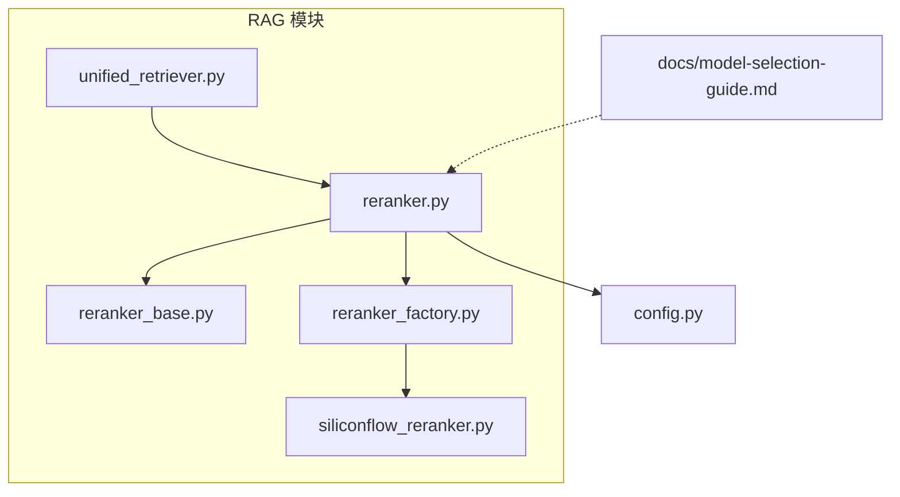
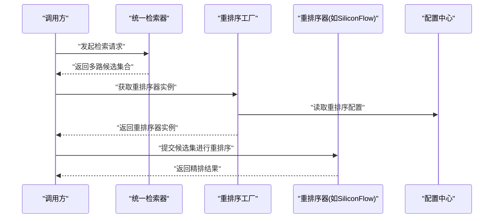
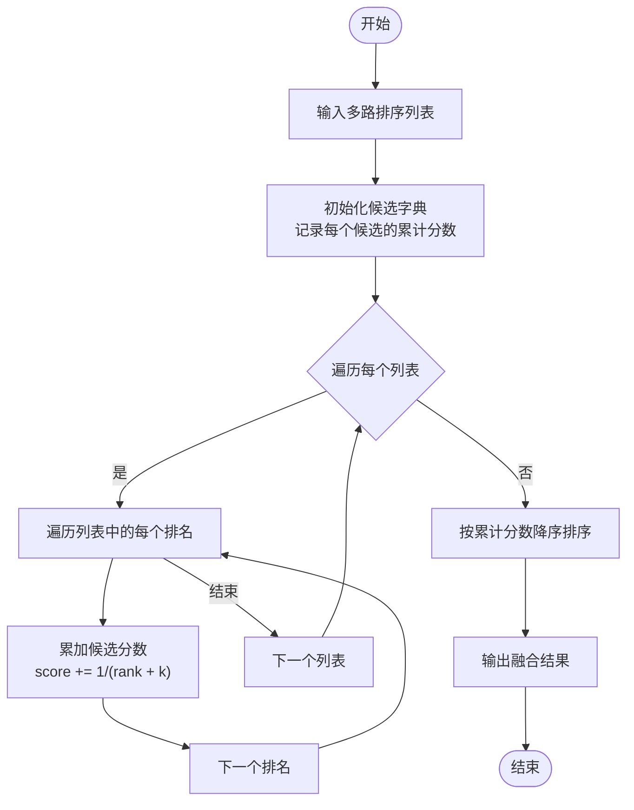
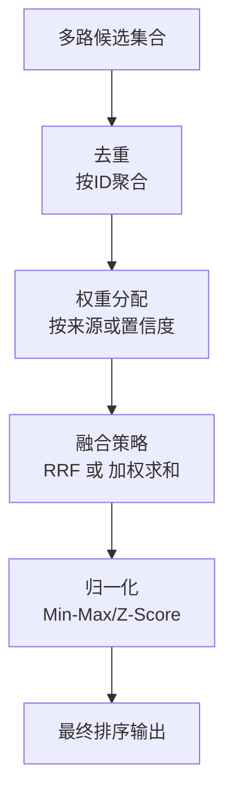
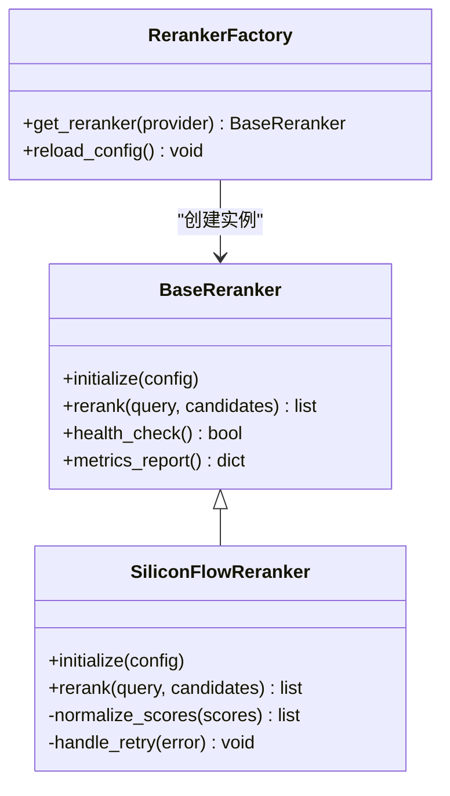
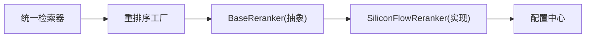

# 重排序系统

<cite>
**本文引用的文件**   
- [reranker.py](file://backend_design/nexus/rag/reranker.py)
- [reranker_base.py](file://backend_design/nexus/rag/reranker_base.py)
- [siliconflow_reranker.py](file://backend_design/nexus/rag/siliconflow_reranker.py)
- [reranker_factory.py](file://backend_design/nexus/rag/reranker_factory.py)
- [unified_retriever.py](file://backend_design/nexus/rag/unified_retriever.py)
- [config.py](file://backend_design/nexus/config.py)
- [model-selection-guide.md](file://docs/model-selection-guide.md)
</cite>

## 目录
1. [简介](#简介)
2. [项目结构](#项目结构)
3. [核心组件](#核心组件)
4. [架构总览](#架构总览)
5. [详细组件分析](#详细组件分析)
6. [依赖关系分析](#依赖关系分析)
7. [性能考量](#性能考量)
8. [故障排查指南](#故障排查指南)
9. [结论](#结论)
10. [附录](#附录)

## 简介
本技术文档聚焦于 NexusCockpit 的重排序子系统，围绕以下目标展开：
- 解释重排序算法原理：Cross-Encoder 模型应用、RRF（Reciprocal Rank Fusion）融合算法与分数归一化策略。
- 深入说明 BaseReranker 抽象接口设计与 SiliconFlow 重排序器的具体实现。
- 阐述多路结果融合机制：权重分配、去重策略与排序优化。
- 提供重排序模型选择指南、推理加速技术与批量处理优化建议。
- 给出自定义重排序器开发规范、性能评估指标与 A/B 测试框架思路。

## 项目结构
重排序相关代码位于后端 RAG 模块中，采用“抽象接口 + 工厂 + 具体实现”的分层组织方式，便于扩展不同供应商或本地模型的重排序能力。

图表来源
- [reranker.py:1-200](file://backend_design/nexus/rag/reranker.py#L1-L200)
- [reranker_base.py:1-200](file://backend_design/nexus/rag/reranker_base.py#L1-L200)
- [siliconflow_reranker.py:1-200](file://backend_design/nexus/rag/siliconflow_reranker.py#L1-L200)
- [reranker_factory.py:1-200](file://backend_design/nexus/rag/reranker_factory.py#L1-L200)
- [unified_retriever.py:1-200](file://backend_design/nexus/rag/unified_retriever.py#L1-L200)
- [config.py:1-200](file://backend_design/nexus/config.py#L1-L200)
- [model-selection-guide.md:1-200](file://docs/model-selection-guide.md#L1-L200)

章节来源
- [reranker.py:1-200](file://backend_design/nexus/rag/reranker.py#L1-L200)
- [reranker_base.py:1-200](file://backend_design/nexus/rag/reranker_base.py#L1-L200)
- [siliconflow_reranker.py:1-200](file://backend_design/nexus/rag/siliconflow_reranker.py#L1-L200)
- [reranker_factory.py:1-200](file://backend_design/nexus/rag/reranker_factory.py#L1-L200)
- [unified_retriever.py:1-200](file://backend_design/nexus/rag/unified_retriever.py#L1-L200)
- [config.py:1-200](file://backend_design/nexus/config.py#L1-L200)
- [model-selection-guide.md:1-200](file://docs/model-selection-guide.md#L1-L200)

## 核心组件
- BaseReranker 抽象接口：定义统一的重排序输入输出契约与生命周期方法，屏蔽底层差异，为多实现提供一致调用面。
- SiliconFlow 重排序器：基于远程 API 的 Cross-Encoder 风格打分服务，支持批量查询-文档对评分与标准化返回。
- 重排序工厂：根据配置动态创建并缓存重排序器实例，支持热切换与降级策略。
- 统一检索器集成：在检索阶段后接入重排序，将多路召回结果进行融合与精排。

章节来源
- [reranker_base.py:1-200](file://backend_design/nexus/rag/reranker_base.py#L1-L200)
- [siliconflow_reranker.py:1-200](file://backend_design/nexus/rag/siliconflow_reranker.py#L1-L200)
- [reranker_factory.py:1-200](file://backend_design/nexus/rag/reranker_factory.py#L1-L200)
- [unified_retriever.py:1-200](file://backend_design/nexus/rag/unified_retriever.py#L1-L200)

## 架构总览
重排序系统在检索之后执行，负责将多路召回候选集按相关性进行精排。整体流程如下：
- 统一检索器收集多路候选（向量检索、关键词检索、图谱检索等）。
- 通过工厂获取当前启用的重排序器（如 SiliconFlow）。
- 对候选集进行 Cross-Encoder 打分或 RRF 融合，必要时进行分数归一化。
- 输出最终排序结果供下游使用。

图表来源
- [unified_retriever.py:1-200](file://backend_design/nexus/rag/unified_retriever.py#L1-L200)
- [reranker_factory.py:1-200](file://backend_design/nexus/rag/reranker_factory.py#L1-L200)
- [siliconflow_reranker.py:1-200](file://backend_design/nexus/rag/siliconflow_reranker.py#L1-L200)
- [config.py:1-200](file://backend_design/nexus/config.py#L1-L200)

## 详细组件分析

### BaseReranker 抽象接口设计
BaseReranker 定义了重排序器的通用契约，包括：
- 初始化参数与上下文注入（如配置、超时、重试策略）。
- 统一的 rerank 方法签名，接收查询与候选集，返回排序后的结果。
- 可选的生命周期钩子（如预热、健康检查、指标上报）。
- 错误处理与降级策略的统一入口。

该抽象使得上层无需关心具体实现细节，可自由替换不同供应商或本地模型。

章节来源
- [reranker_base.py:1-200](file://backend_design/nexus/rag/reranker_base.py#L1-L200)

### SiliconFlow 重排序器实现
SiliconFlow 重排序器作为远程服务实现，主要职责：
- 构造查询-文档对的请求体，遵循供应商接口约定。
- 批量发送请求以提升吞吐，并对响应进行解析与对齐。
- 对原始分数进行归一化处理，保证跨批次稳定性。
- 处理网络异常、限流与超时，触发重试或降级逻辑。

该实现体现了 Cross-Encoder 风格的打分范式：以查询和文档共同编码后计算相关性得分。

章节来源
- [siliconflow_reranker.py:1-200](file://backend_design/nexus/rag/siliconflow_reranker.py#L1-L200)

### 重排序工厂
重排序工厂负责：
- 依据配置选择并创建具体重排序器实例。
- 管理实例生命周期与缓存，避免重复初始化开销。
- 暴露统一的获取接口，支持运行时切换与灰度发布。

章节来源
- [reranker_factory.py:1-200](file://backend_design/nexus/rag/reranker_factory.py#L1-L200)

### 统一检索器集成
统一检索器在召回阶段聚合多路结果，并在后续步骤中调用重排序器进行精排。其关键职责：
- 合并多路候选，保留必要元数据（如来源、权重）。
- 控制候选规模，减少重排序阶段的计算压力。
- 与重排序器协作，完成最终的排序输出。

章节来源
- [unified_retriever.py:1-200](file://backend_design/nexus/rag/unified_retriever.py#L1-L200)

### 重排序算法原理与实践

#### Cross-Encoder 模型应用
- 原理：将查询与文档拼接为联合输入，通过共享编码器计算相关性分数。相比双塔模型，Cross-Encoder 能捕捉细粒度交互，精度更高但延迟更大。
- 实践要点：
  - 批量大小与序列长度需权衡，避免超出模型上下文限制。
  - 对长文档进行截断或摘要预处理，提升效率与稳定性。
  - 结合硬件特性（GPU/CPU）调整批处理策略。

章节来源
- [siliconflow_reranker.py:1-200](file://backend_design/nexus/rag/siliconflow_reranker.py#L1-L200)

#### RRF（Reciprocal Rank Fusion）融合算法
- 原理：对每个候选在所有列表中的排名取倒数并求和，得到融合分数；常用于多路召回结果的无监督融合。
- 公式要点：融合分数 = Σ (1 / (rank_i + k))，k 为平滑常数，用于缓解零分问题。
- 适用场景：当各路召回质量差异较大或缺乏标注时，RRF 可作为强基线。

图表来源
- [reranker.py:1-200](file://backend_design/nexus/rag/reranker.py#L1-L200)

#### 分数归一化策略
- 目的：消除不同模型或批次间的分数尺度差异，提高融合稳定性。
- 常用方法：
  - Min-Max 归一化：将分数映射到固定区间。
  - Z-Score 标准化：基于均值与标准差进行缩放。
  - 分位数归一化：降低极端值影响。
- 选择建议：根据业务分布与下游融合策略决定；对于 RRF 通常不需要显式归一化，但对 Cross-Encoder 输出常做归一化以提升可比性。

章节来源
- [reranker.py:1-200](file://backend_design/nexus/rag/reranker.py#L1-L200)

### 多路结果融合机制
- 权重分配：可为不同来源设置初始权重，或在融合阶段按比例加权。
- 去重策略：基于唯一标识（如文档 ID）进行去重，保留最高优先级或最高分数的条目。
- 排序优化：先粗排（如向量相似度阈值过滤），再精排（Cross-Encoder 或 RRF），以减少计算量。

图表来源
- [reranker.py:1-200](file://backend_design/nexus/rag/reranker.py#L1-L200)
- [unified_retriever.py:1-200](file://backend_design/nexus/rag/unified_retriever.py#L1-L200)

章节来源
- [reranker.py:1-200](file://backend_design/nexus/rag/reranker.py#L1-L200)
- [unified_retriever.py:1-200](file://backend_design/nexus/rag/unified_retriever.py#L1-L200)

### 类图：重排序器体系

图表来源
- [reranker_base.py:1-200](file://backend_design/nexus/rag/reranker_base.py#L1-L200)
- [siliconflow_reranker.py:1-200](file://backend_design/nexus/rag/siliconflow_reranker.py#L1-L200)
- [reranker_factory.py:1-200](file://backend_design/nexus/rag/reranker_factory.py#L1-L200)

## 依赖关系分析
- 内部依赖：
  - 统一检索器依赖重排序工厂以获取具体实现。
  - 重排序器依赖配置中心加载运行参数。
- 外部依赖：
  - SiliconFlow 重排序器依赖远程 API 服务，需考虑网络稳定性与限流。
- 耦合与内聚：
  - 通过抽象接口解耦上层与具体实现，提升内聚性与可替换性。
  - 工厂模式集中管理实例创建与配置，降低耦合度。

图表来源
- [unified_retriever.py:1-200](file://backend_design/nexus/rag/unified_retriever.py#L1-L200)
- [reranker_factory.py:1-200](file://backend_design/nexus/rag/reranker_factory.py#L1-L200)
- [reranker_base.py:1-200](file://backend_design/nexus/rag/reranker_base.py#L1-L200)
- [siliconflow_reranker.py:1-200](file://backend_design/nexus/rag/siliconflow_reranker.py#L1-L200)
- [config.py:1-200](file://backend_design/nexus/config.py#L1-L200)

章节来源
- [unified_retriever.py:1-200](file://backend_design/nexus/rag/unified_retriever.py#L1-L200)
- [reranker_factory.py:1-200](file://backend_design/nexus/rag/reranker_factory.py#L1-L200)
- [reranker_base.py:1-200](file://backend_design/nexus/rag/reranker_base.py#L1-L200)
- [siliconflow_reranker.py:1-200](file://backend_design/nexus/rag/siliconflow_reranker.py#L1-L200)
- [config.py:1-200](file://backend_design/nexus/config.py#L1-L200)

## 性能考量
- 批量处理：
  - 合理设置批大小，平衡吞吐与延迟；对长文本进行截断或摘要。
- 推理加速：
  - 启用 GPU 加速（若本地部署）、使用半精度推理、预编译算子。
  - 对远程服务启用连接池与并发控制。
- 内存与缓存：
  - 缓存热门查询-文档对的分数，减少重复计算。
  - 对中间结果进行惰性计算与按需加载。
- 资源监控：
  - 上报关键指标（QPS、P95/P99 延迟、错误率、CPU/GPU 利用率）。
  - 设置熔断与降级策略，保障系统稳定性。

[本节为通用指导，不直接分析具体文件]

## 故障排查指南
- 常见问题：
  - 远程服务超时或限流：检查网络连通性、重试策略与退避算法。
  - 分数异常波动：确认归一化策略是否生效，检查批次间一致性。
  - 去重丢失：核对唯一标识字段是否稳定且完整。
- 诊断手段：
  - 开启详细日志，记录输入输出与耗时。
  - 使用健康检查接口验证服务状态。
  - 对比不同配置的 A/B 测试结果定位问题。

章节来源
- [siliconflow_reranker.py:1-200](file://backend_design/nexus/rag/siliconflow_reranker.py#L1-L200)
- [reranker_base.py:1-200](file://backend_design/nexus/rag/reranker_base.py#L1-L200)

## 结论
NexusCockpit 的重排序系统通过抽象接口与工厂模式实现了高内聚、低耦合的设计，支持多种重排序策略与供应商实现。Cross-Encoder 与 RRF 的结合提供了高精度与鲁棒性的排序能力，配合分数归一化与多路融合机制，可在复杂检索场景中取得良好效果。通过合理的性能优化与完善的监控告警，系统能够在高并发环境下保持稳定与高效。

[本节为总结性内容，不直接分析具体文件]

## 附录

### 重排序模型选择指南
- 本地模型 vs 远程服务：
  - 本地模型可控性强、隐私性好，但需要算力投入。
  - 远程服务免运维、弹性好，但受网络与配额限制。
- 模型能力匹配：
  - 短文本、强语义匹配优先 Cross-Encoder。
  - 大规模候选集可先用轻量模型粗排，再用重型模型精排。
- 参考文档：
  - 详见模型选择指南，了解不同模型的适用场景与性能特征。

章节来源
- [model-selection-guide.md:1-200](file://docs/model-selection-guide.md#L1-L200)

### 自定义重排序器开发规范
- 继承 BaseReranker，实现 rerank 方法与必要的生命周期钩子。
- 遵循统一输入输出格式，确保与上游兼容。
- 实现错误处理与重试逻辑，保证健壮性。
- 注册到工厂，支持配置驱动的热切换。

章节来源
- [reranker_base.py:1-200](file://backend_design/nexus/rag/reranker_base.py#L1-L200)
- [reranker_factory.py:1-200](file://backend_design/nexus/rag/reranker_factory.py#L1-L200)

### 性能评估指标与 A/B 测试框架
- 评估指标：
  - 排序质量：NDCG@K、MRR@K、HitRate@K。
  - 系统性能：QPS、P95/P99 延迟、错误率、资源利用率。
- A/B 测试框架：
  - 分流策略：按用户或会话维度随机分流。
  - 指标采集：埋点记录关键指标与样本数据。
  - 显著性检验：统计检验判断新方案是否显著优于基线。

[本节为通用指导，不直接分析具体文件]