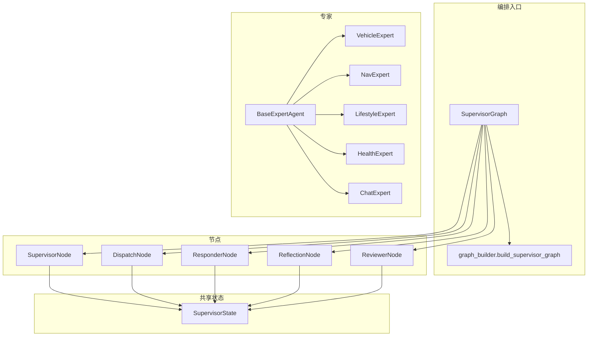
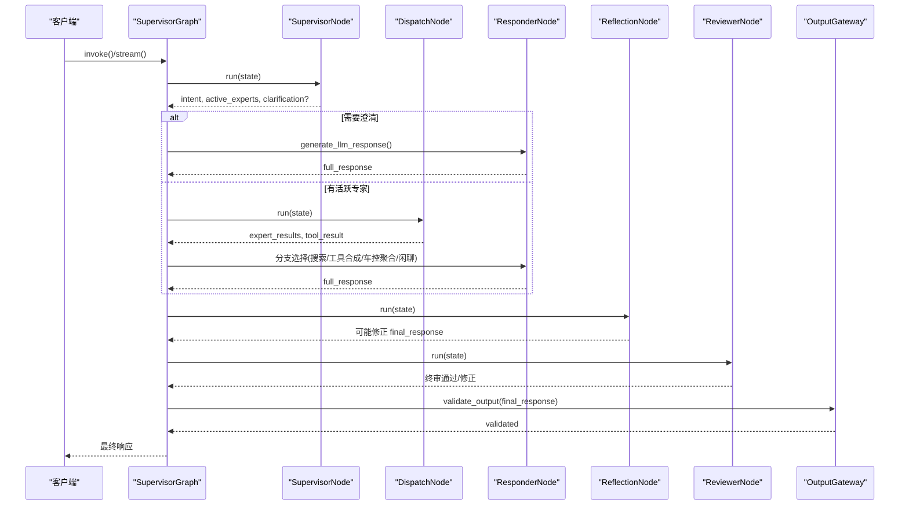
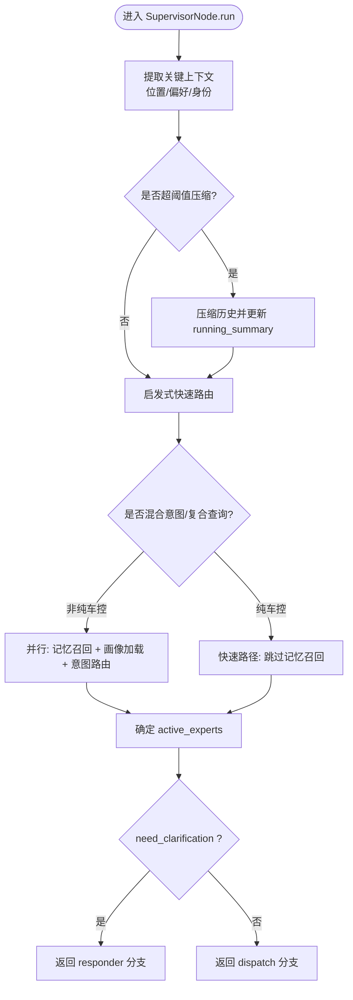
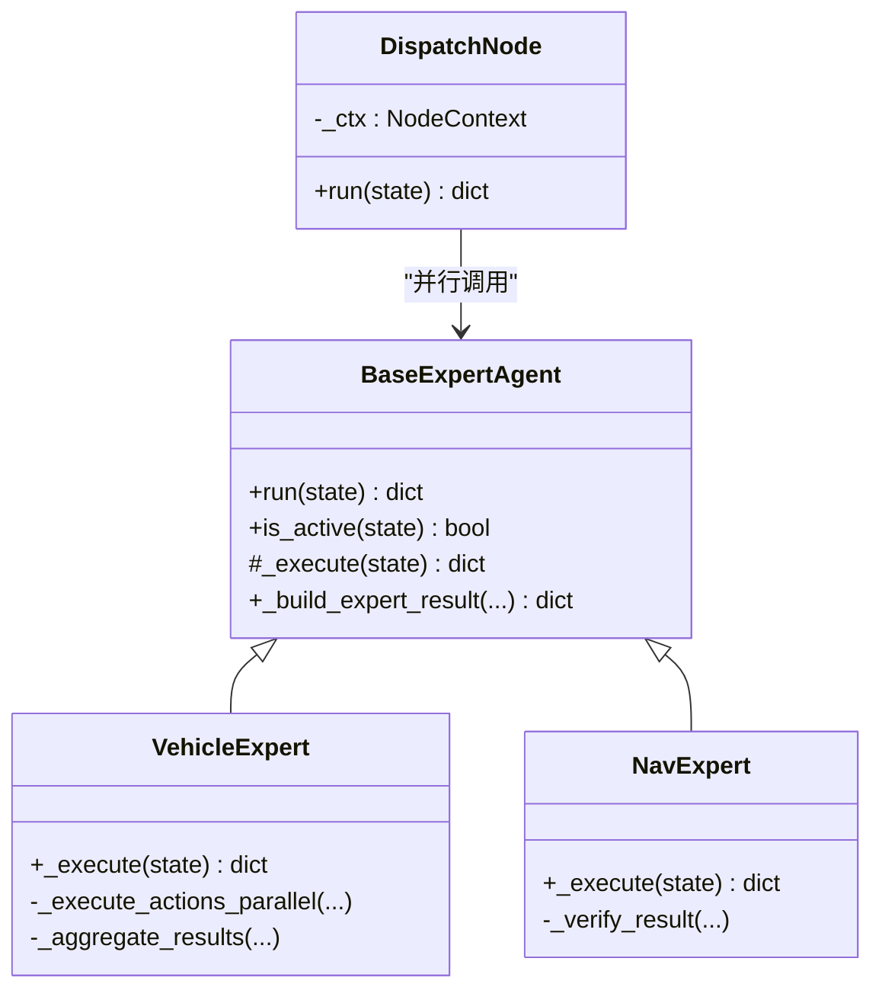
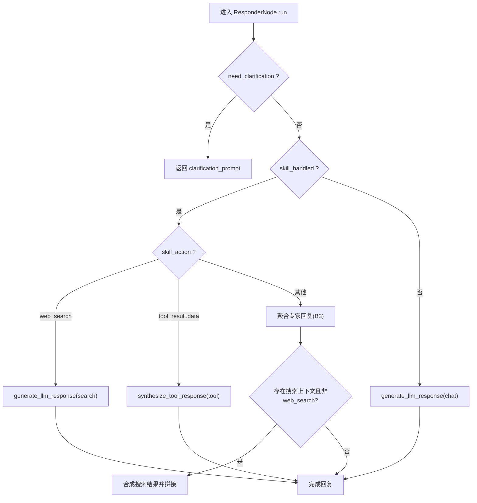
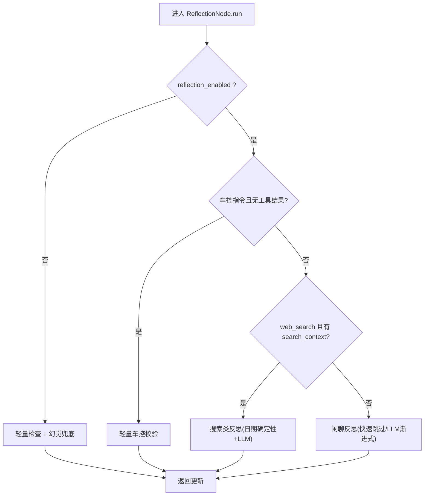
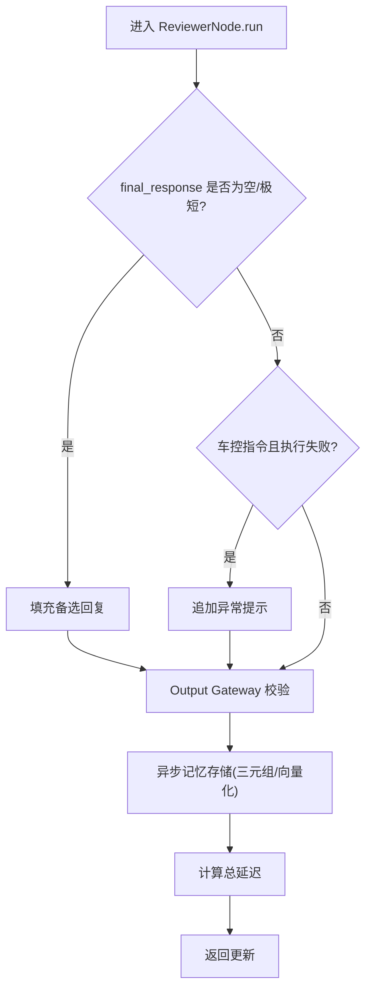
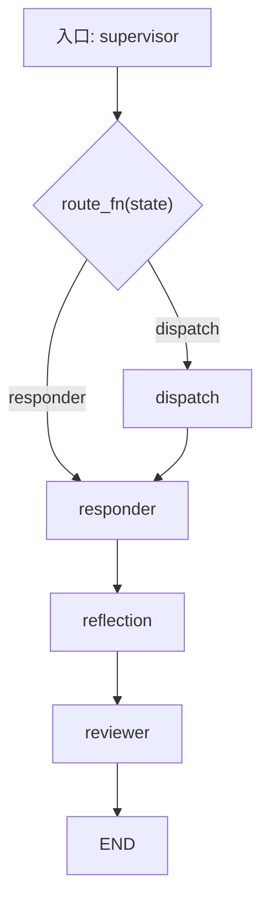
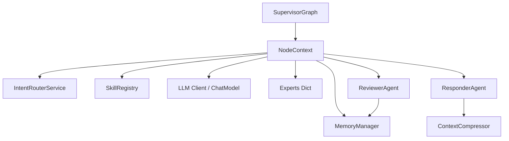

# Multi-Agent工作流设计

<cite>
**本文引用的文件**   
- [supervisor_graph.py](file://backend_design/nexus/agent/supervisor_graph.py)
- [graph_builder.py](file://backend_design/nexus/agent/graph_builder.py)
- [responder.py](file://backend_design/nexus/agent/responder.py)
- [reviewer.py](file://backend_design/nexus/agent/reviewer.py)
- [base.py](file://backend_design/nexus/agent/experts/base.py)
- [__init__.py](file://backend_design/nexus/agent/experts/__init__.py)
- [vehicle_expert.py](file://backend_design/nexus/agent/experts/vehicle_expert.py)
- [nav_expert.py](file://backend_design/nexus/agent/experts/nav_expert.py)
- [supervisor_node.py](file://backend_design/nexus/agent/nodes/supervisor_node.py)
- [dispatch_node.py](file://backend_design/nexus/agent/nodes/dispatch_node.py)
- [responder_node.py](file://backend_design/nexus/agent/nodes/responder_node.py)
- [reflection_node.py](file://backend_design/nexus/agent/nodes/reflection_node.py)
- [reviewer_node.py](file://backend_design/nexus/agent/nodes/reviewer_node.py)
- [state.py](file://backend_design/nexus/models/state.py)
</cite>

## 目录
1. [简介](#简介)
2. [项目结构](#项目结构)
3. [核心组件](#核心组件)
4. [架构总览](#架构总览)
5. [详细组件分析](#详细组件分析)
6. [依赖关系分析](#依赖关系分析)
7. [性能考量](#性能考量)
8. [故障排查指南](#故障排查指南)
9. [结论](#结论)
10. [附录：扩展指南与示例路径](#附录扩展指南与示例路径)

## 简介
本文件为 NexusCockpit 的 Multi-Agent 工作流设计提供系统化、可落地的架构文档。重点覆盖：
- Supervisor 调度器的工作原理（条件分派、状态管理、任务分配）
- 五大专家 Agent（车辆、导航、生活、健康、聊天）的职责与协作模式
- Responder 响应器、Reflection 反思器、Reviewer 审查器的四层防御机制
- 工作流图、状态转换图、专家间通信协议
- LangGraph 状态图的实现细节（节点定义、边条件、消息传递）
- 扩展新专家与工作流节点的具体代码路径指引

## 项目结构
Multi-Agent 工作流位于 backend_design/nexus/agent 目录下，采用“编排入口 + 节点拆分 + 专家封装”的分层组织方式：
- 编排入口：SupervisorGraph 负责初始化、构建 LangGraph 图、暴露 invoke/stream/stream_with_events 接口
- 图构建：graph_builder.py 注册节点、连接边、编译 CompiledGraph
- 节点模块：nodes/ 下包含 supervisor、dispatch、responder、reflection、reviewer 五个节点
- 专家模块：experts/ 下以 BaseExpertAgent 为基类，派生五大专家
- 共享状态：models/state.py 定义 SupervisorState 及 reducer 合并策略
- 辅助代理：responder.py、reviewer.py 作为容器持有压缩器与记忆管理器

图表来源
- [supervisor_graph.py:93-179](file://backend_design/nexus/agent/supervisor_graph.py#L93-L179)
- [graph_builder.py:40-119](file://backend_design/nexus/agent/graph_builder.py#L40-L119)
- [state.py:38-107](file://backend_design/nexus/models/state.py#L38-L107)

章节来源
- [supervisor_graph.py:93-179](file://backend_design/nexus/agent/supervisor_graph.py#L93-L179)
- [graph_builder.py:40-119](file://backend_design/nexus/agent/graph_builder.py#L40-L119)
- [state.py:38-107](file://backend_design/nexus/models/state.py#L38-L107)

## 核心组件
- SupervisorGraph：编排入口，统一暴露同步与流式调用；维护 NodeContext 共享依赖；构建并运行 LangGraph 图
- graph_builder：集中注册节点与边，编译 CompiledGraph
- SupervisorNode：记忆召回+画像加载+意图路由+专家分派决策；支持快速路径与复合查询增强
- DispatchNode：并行执行活跃专家，合并 partial updates
- ResponderNode：按分支生成回复（澄清/工具合成/车控聚合/LLM闲聊），注入位置/画像/习惯/关键上下文
- ReflectionNode：事实性/一致性/无幻觉/日期确定性校验，渐进式重试
- ReviewerNode：终审强校验、输出网关、记忆存储、延迟统计、活动日志
- 五大专家：基于 BaseExpertAgent 封装技能组，返回 partial state update

章节来源
- [supervisor_graph.py:93-179](file://backend_design/nexus/agent/supervisor_graph.py#L93-L179)
- [graph_builder.py:40-119](file://backend_design/nexus/agent/graph_builder.py#L40-L119)
- [supervisor_node.py:40-331](file://backend_design/nexus/agent/nodes/supervisor_node.py#L40-L331)
- [dispatch_node.py:25-139](file://backend_design/nexus/agent/nodes/dispatch_node.py#L25-L139)
- [responder_node.py:34-174](file://backend_design/nexus/agent/nodes/responder_node.py#L34-L174)
- [reflection_node.py:46-248](file://backend_design/nexus/agent/nodes/reflection_node.py#L46-L248)
- [reviewer_node.py:26-183](file://backend_design/nexus/agent/nodes/reviewer_node.py#L26-L183)
- [base.py:26-140](file://backend_design/nexus/agent/experts/base.py#L26-L140)

## 架构总览
整体工作流遵循“五层链路”闭环：Supervisor → Dispatch → Responder → Reflection → Reviewer → END。所有对外输出必须经过 Reviewer 与 Output Gateway 双重校验。

图表来源
- [supervisor_graph.py:184-384](file://backend_design/nexus/agent/supervisor_graph.py#L184-L384)
- [graph_builder.py:96-119](file://backend_design/nexus/agent/graph_builder.py#L96-L119)
- [responder_node.py:58-174](file://backend_design/nexus/agent/nodes/responder_node.py#L58-L174)
- [reflection_node.py:82-248](file://backend_design/nexus/agent/nodes/reflection_node.py#L82-L248)
- [reviewer_node.py:39-183](file://backend_design/nexus/agent/nodes/reviewer_node.py#L39-L183)

## 详细组件分析

### Supervisor 调度器与条件分派
- 条件路由：SupervisorNode.route() 根据 need_clarification 与 active_experts 决定走 responder 或 dispatch
- 快速路径：纯车控指令跳过记忆召回与 RAG，显著降低延迟
- 混合意图与复合查询：启发式识别车控与非车控意图时，仅对非车控部分进行记忆召回；复合查询触发完整 LLM 多意图路由
- 专家分派：_determine_experts() 依据意图键集合确定活跃专家列表，含防漂移与自动修复逻辑

图表来源
- [supervisor_node.py:64-331](file://backend_design/nexus/agent/nodes/supervisor_node.py#L64-L331)

章节来源
- [supervisor_node.py:52-61](file://backend_design/nexus/agent/nodes/supervisor_node.py#L52-L61)
- [supervisor_node.py:333-422](file://backend_design/nexus/agent/nodes/supervisor_node.py#L333-L422)

### 专家并行与任务分配
- DispatchNode 使用 asyncio.gather 并行执行所有 active_experts
- 合并策略：expert_results 累加；skill_handled 任一 True 即为 True；search_context 拼接；tool_result 收集到顶层 tool_results 并保留首个用于向后兼容
- 错误处理：异常被捕获并记录到 expert_results 与 metadata

图表来源
- [dispatch_node.py:38-139](file://backend_design/nexus/agent/nodes/dispatch_node.py#L38-L139)
- [base.py:48-140](file://backend_design/nexus/agent/experts/base.py#L48-L140)
- [vehicle_expert.py:49-325](file://backend_design/nexus/agent/experts/vehicle_expert.py#L49-L325)
- [nav_expert.py:32-98](file://backend_design/nexus/agent/experts/nav_expert.py#L32-L98)

章节来源
- [dispatch_node.py:38-139](file://backend_design/nexus/agent/nodes/dispatch_node.py#L38-L139)
- [base.py:48-140](file://backend_design/nexus/agent/experts/base.py#L48-L140)

### Responder 响应器（分支策略与 Tool→LLM 合成）
- 分支 A：澄清直接返回 clarification_prompt
- 分支 B1：web_search 使用专用 search prompt 生成
- 分支 B2：工具结构化数据回传 LLM 做自然语言合成（含导航约束与失败快速跳过）
- 分支 B3：简单车控指令聚合各专家 reply，空回复兜底
- 分支 B5：车控 + 搜索结果混合场景，额外合成搜索结果并拼接
- 分支 C：LLM 闲聊兜底
- System Prompt：动态注入用户画像、习惯、位置状态、关键上下文与时间信息

图表来源
- [responder_node.py:58-174](file://backend_design/nexus/agent/nodes/responder_node.py#L58-L174)
- [responder_node.py:181-310](file://backend_design/nexus/agent/nodes/responder_node.py#L181-L310)
- [responder_node.py:316-394](file://backend_design/nexus/agent/nodes/responder_node.py#L316-L394)

章节来源
- [responder_node.py:58-174](file://backend_design/nexus/agent/nodes/responder_node.py#L58-L174)
- [responder_node.py:181-310](file://backend_design/nexus/agent/nodes/responder_node.py#L181-L310)
- [responder_node.py:316-394](file://backend_design/nexus/agent/nodes/responder_node.py#L316-L394)

### Reflection 反思器（三层校验与渐进式重试）
- 车控轻量校验：确定性检查（空回复、幻觉历史、执行状态）
- 搜索类反思：确定性日期校验 + LLM 事实性/时效性/无幻觉检查
- 通用闲聊反思：短回复快速跳过 + LLM 渐进式校验（首次反思 → 采纳修正建议 → 带反馈 retry）
- 预校验/后校验：拦截无历史时的对话历史询问与编造历史模式

图表来源
- [reflection_node.py:82-248](file://backend_design/nexus/agent/nodes/reflection_node.py#L82-L248)
- [reflection_node.py:254-308](file://backend_design/nexus/agent/nodes/reflection_node.py#L254-L308)
- [reflection_node.py:382-485](file://backend_design/nexus/agent/nodes/reflection_node.py#L382-L485)
- [reflection_node.py:512-656](file://backend_design/nexus/agent/nodes/reflection_node.py#L512-L656)

章节来源
- [reflection_node.py:82-248](file://backend_design/nexus/agent/nodes/reflection_node.py#L82-L248)
- [reflection_node.py:512-656](file://backend_design/nexus/agent/nodes/reflection_node.py#L512-L656)

### Reviewer 审查器（终审与全局输出网关）
- 质量检查：空内容/极短内容填充备选回复
- 业务准确性：车控指令失败需提示异常
- 合规性：调用 Output Gateway 做最终全局校验
- 记忆存储：异步触发三元组提取与对话向量化
- 延迟统计：汇总各阶段 latency_ms

图表来源
- [reviewer_node.py:39-183](file://backend_design/nexus/agent/nodes/reviewer_node.py#L39-L183)

章节来源
- [reviewer_node.py:39-183](file://backend_design/nexus/agent/nodes/reviewer_node.py#L39-L183)

### 专家职责与协作模式
- 车辆专家（VehicleExpert）：空调/车窗/座椅/媒体/状态，多动作并行与互斥组串行，沙箱安全审查与结果验证
- 导航专家（NavExpert）：目的地设置/路线规划/当前位置查询，缓存 GPS 坐标避免 IP 定位超时
- 生活专家（LifestyleExpert）：搜索/点餐/提醒/POI 周边搜索等
- 健康专家（HealthExpert）：车辆健康诊断/故障码/保养
- 聊天专家（ChatExpert）：纯 LLM 问答/知识库问答

章节来源
- [vehicle_expert.py:49-325](file://backend_design/nexus/agent/experts/vehicle_expert.py#L49-L325)
- [nav_expert.py:32-98](file://backend_design/nexus/agent/experts/nav_expert.py#L32-L98)
- [__init__.py:22-36](file://backend_design/nexus/agent/experts/__init__.py#L22-L36)

### LangGraph 状态图实现细节
- 节点定义：supervisor、dispatch、responder、reflection、reviewer，以及专家节点（vehicle_expert、nav_expert、lifestyle_expert、health_expert、chat_expert）
- 边连接：supervisor 条件边（dispatch 或 responder），后续固定顺序 dispatch → responder → reflection → reviewer → END
- 状态 Schema：SupervisorState 使用 TypedDict + Annotated reducer（list add、dict merge_dict），确保并行写入不冲突
- 消息传递：各节点返回 partial update，LangGraph 自动合并；history 与 expert_results 通过 add 累加；metadata 通过 merge_dict 合并

图表来源
- [graph_builder.py:70-119](file://backend_design/nexus/agent/graph_builder.py#L70-L119)
- [state.py:38-107](file://backend_design/nexus/models/state.py#L38-L107)

章节来源
- [graph_builder.py:70-119](file://backend_design/nexus/agent/graph_builder.py#L70-L119)
- [state.py:38-107](file://backend_design/nexus/models/state.py#L38-L107)

## 依赖关系分析
- SupervisorGraph 依赖 NodeContext（intent_router、memory_manager、skill_registry、llm_client、chat_model、experts、responder、reviewer、prompt_manager）
- 节点之间通过 NodeContext 解耦，避免循环依赖；ResponderNode 与 ReflectionNode 互相引用仅在初始化后注入
- 专家通过 SkillRegistry 调用具体技能；车控专家引入沙箱安全审查与结果验证

图表来源
- [supervisor_graph.py:110-179](file://backend_design/nexus/agent/supervisor_graph.py#L110-L179)
- [responder.py:23-39](file://backend_design/nexus/agent/responder.py#L23-L39)
- [reviewer.py:24-33](file://backend_design/nexus/agent/reviewer.py#L24-L33)

章节来源
- [supervisor_graph.py:110-179](file://backend_design/nexus/agent/supervisor_graph.py#L110-L179)
- [responder.py:23-39](file://backend_design/nexus/agent/responder.py#L23-L39)
- [reviewer.py:24-33](file://backend_design/nexus/agent/reviewer.py#L24-L33)

## 性能考量
- 快速路径：纯车控指令跳过记忆召回与 RAG，显著降低延迟
- 并行执行：DispatchNode 使用 asyncio.gather 并行执行专家；SupervisorNode 中记忆召回、画像加载、意图路由并行
- 阈值压缩：对话轮数超阈值时压缩历史，减少 LLM 输入长度
- 快速跳过：短回复与短工具消息跳过 LLM 反思，减少不必要调用
- 指标埋点：Prometheus 指标（AGENT_INVOCATIONS、AGENT_LATENCY、RAG_LATENCY、LLM_CALLS、LLM_LATENCY）与 Langfuse 观测

章节来源
- [supervisor_node.py:170-259](file://backend_design/nexus/agent/nodes/supervisor_node.py#L170-L259)
- [dispatch_node.py:50-62](file://backend_design/nexus/agent/nodes/dispatch_node.py#L50-L62)
- [responder_node.py:218-227](file://backend_design/nexus/agent/nodes/responder_node.py#L218-L227)
- [reflection_node.py:499-510](file://backend_design/nexus/agent/nodes/reflection_node.py#L499-L510)

## 故障排查指南
- LLM 不可用：429 错误短路消除，仍走完整 Reviewer + Output Gateway，返回兜底消息
- 车控指令失败：Reviewer 追加异常提示；VehicleExpert 沙箱拦截与结果验证
- 反射超时：ReflectionNode 设置超时保护，降级为跳过反思并记录原因
- 记忆存储失败：Reviewer 异步触发，异常记录但不阻塞主流程
- 输出未通过网关：Output Gateway 修正并记录原因，确保最终输出安全

章节来源
- [supervisor_graph.py:232-244](file://backend_design/nexus/agent/supervisor_graph.py#L232-L244)
- [reviewer_node.py:63-101](file://backend_design/nexus/agent/nodes/reviewer_node.py#L63-L101)
- [reflection_node.py:235-242](file://backend_design/nexus/agent/nodes/reflection_node.py#L235-L242)
- [reviewer_node.py:104-123](file://backend_design/nexus/agent/nodes/reviewer_node.py#L104-L123)

## 结论
NexusCockpit 的 Multi-Agent 工作流通过 Supervisor 调度、专家并行、Responder 智能合成、Reflection 质量保障与 Reviewer 终审，构建了高可靠、高性能、可扩展的车载语音交互系统。LangGraph 状态图与 TypedDict 状态管理确保了并发安全与可观测性。该设计既满足复杂混合意图处理，又兼顾了车载场景的安全性与实时性要求。

## 附录：扩展指南与示例路径
- 新增专家 Agent
  - 继承 BaseExpertAgent，实现 _execute(state) 返回 partial update
  - 在 experts/__init__.py 中导出新专家
  - 在 SupervisorGraph.__init__() 的 experts 字典中注册新专家
  - 参考路径：[base.py:85-87](file://backend_design/nexus/agent/experts/base.py#L85-L87)、[__init__.py:22-36](file://backend_design/nexus/agent/experts/__init__.py#L22-L36)、[supervisor_graph.py:122-128](file://backend_design/nexus/agent/supervisor_graph.py#L122-L128)

- 新增工作流节点
  - 在 nodes/ 下创建新节点类，实现 run(state) 返回 partial update
  - 在 graph_builder.py 中注册节点与边
  - 在 SupervisorGraph.__init__() 中实例化并注入依赖
  - 参考路径：[graph_builder.py:70-119](file://backend_design/nexus/agent/graph_builder.py#L70-L119)、[supervisor_graph.py:154-179](file://backend_design/nexus/agent/supervisor_graph.py#L154-L179)

- 扩展状态字段
  - 在 models/state.py 的 SupervisorState 中添加字段，必要时定义 reducer
  - 在各节点中读写对应字段，确保并发安全
  - 参考路径：[state.py:38-107](file://backend_design/nexus/models/state.py#L38-L107)

- 调试与观测
  - 使用 @observe 装饰器记录节点调用与指标
  - 查看 Prometheus 指标与 Langfuse 追踪
  - 参考路径：[supervisor_node.py:63-64](file://backend_design/nexus/agent/nodes/supervisor_node.py#L63-L64)、[responder_node.py:57-58](file://backend_design/nexus/agent/nodes/responder_node.py#L57-L58)