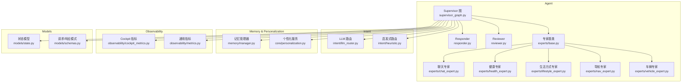
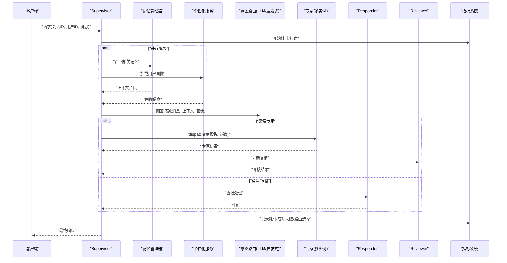
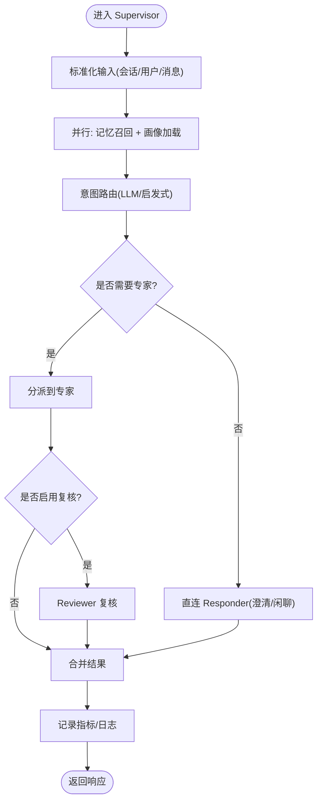
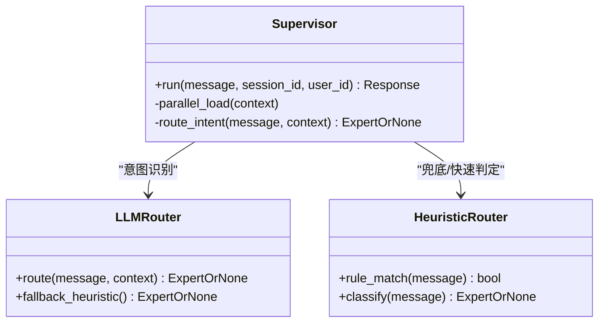
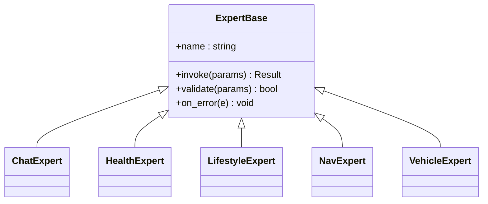
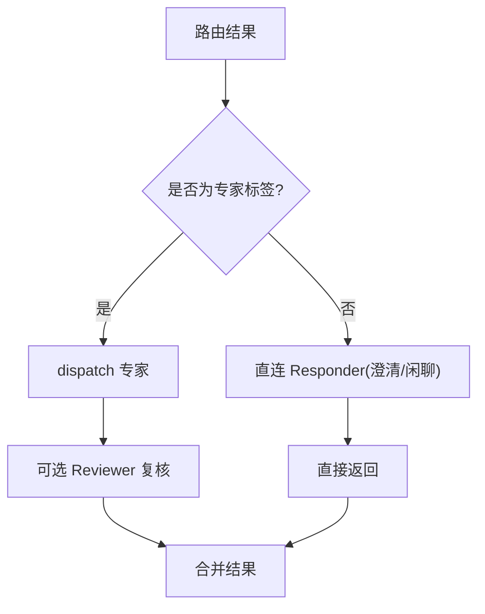
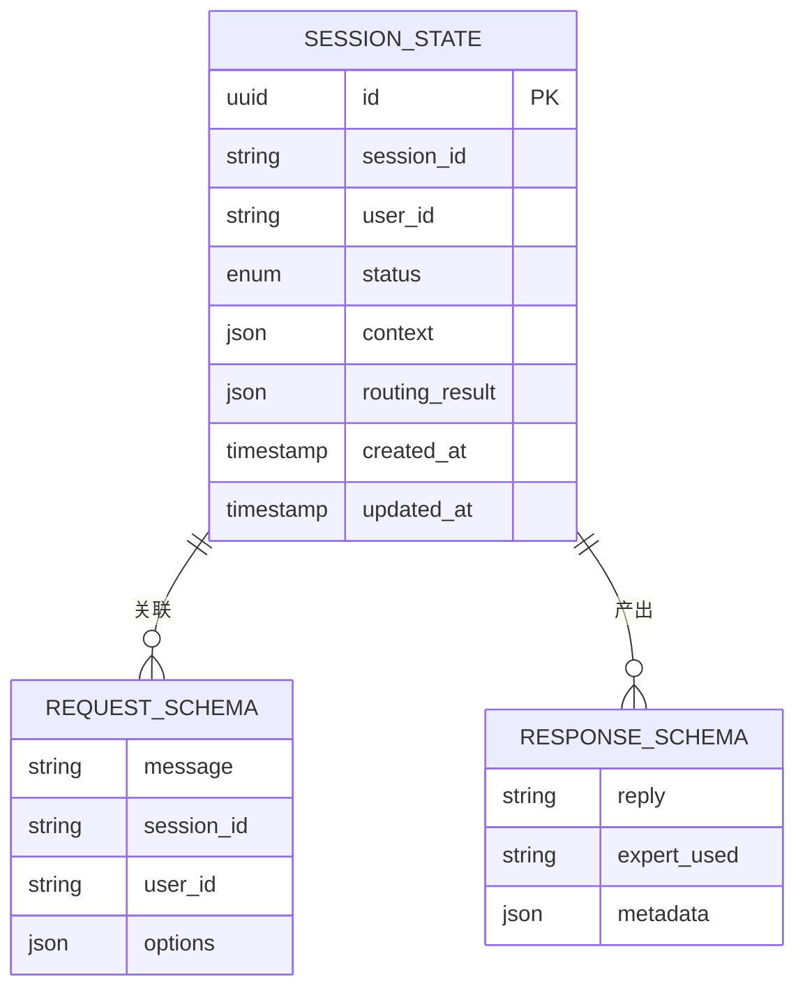
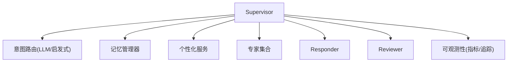

# Supervisor调度机制

<cite>
**本文引用的文件**   
- [supervisor_graph.py](file://backend_design/nexus/agent/supervisor_graph.py)
- [responder.py](file://backend_design/nexus/agent/responder.py)
- [reviewer.py](file://backend_design/nexus/agent/reviewer.py)
- [base.py](file://backend_design/nexus/agent/experts/base.py)
- [chat_expert.py](file://backend_design/nexus/agent/experts/chat_expert.py)
- [health_expert.py](file://backend_design/nexus/agent/experts/health_expert.py)
- [lifestyle_expert.py](file://backend_design/nexus/agent/experts/lifestyle_expert.py)
- [nav_expert.py](file://backend_design/nexus/agent/experts/nav_expert.py)
- [vehicle_expert.py](file://backend_design/nexus/agent/experts/vehicle_expert.py)
- [llm_router.py](file://backend_design/nexus/intent/llm_router.py)
- [heuristic.py](file://backend_design/nexus/intent/heuristic.py)
- [manager.py](file://backend_design/nexus/memory/manager.py)
- [personalization.py](file://backend_design/nexus/core/personalization.py)
- [cockpit_metrics.py](file://backend_design/nexus/observability/cockpit_metrics.py)
- [metrics.py](file://backend_design/nexus/observability/metrics.py)
- [state.py](file://backend_design/nexus/models/state.py)
- [schemas.py](file://backend_design/nexus/models/schemas.py)
</cite>

## 目录
1. [简介](#简介)
2. [项目结构](#项目结构)
3. [核心组件](#核心组件)
4. [架构总览](#架构总览)
5. [详细组件分析](#详细组件分析)
6. [依赖关系分析](#依赖关系分析)
7. [性能考虑](#性能考虑)
8. [故障排查指南](#故障排查指南)
9. [结论](#结论)
10. [附录](#附录)

## 简介
本文件面向 NexusCockpit 的 Supervisor 调度机制，系统性阐述其核心职责与实现细节：记忆召回、用户画像加载、意图路由与专家分派决策。文档重点解释并行执行优化策略（如 asyncio.gather 的使用方式与性能收益）、条件路由逻辑（何时走 dispatch 分发专家，何时直连 responder 处理澄清或闲聊场景），并覆盖状态管理、错误处理与监控指标收集的实现要点。文末提供关键流程的可视化图示与代码片段路径，便于读者快速定位源码。

## 项目结构
Supervisor 位于 agent 层，负责编排记忆检索、画像加载、意图识别与专家调用；意图路由由 intent 模块提供；记忆与个性化由 memory 与 core.personalization 提供；可观测性通过 observability 暴露指标；数据模型在 models 中定义。



图表来源
- [supervisor_graph.py](file://backend_design/nexus/agent/supervisor_graph.py)
- [responder.py](file://backend_design/nexus/agent/responder.py)
- [reviewer.py](file://backend_design/nexus/agent/reviewer.py)
- [base.py](file://backend_design/nexus/agent/experts/base.py)
- [chat_expert.py](file://backend_design/nexus/agent/experts/chat_expert.py)
- [health_expert.py](file://backend_design/nexus/agent/experts/health_expert.py)
- [lifestyle_expert.py](file://backend_design/nexus/agent/experts/lifestyle_expert.py)
- [nav_expert.py](file://backend_design/nexus/agent/experts/nav_expert.py)
- [vehicle_expert.py](file://backend_design/nexus/agent/experts/vehicle_expert.py)
- [llm_router.py](file://backend_design/nexus/intent/llm_router.py)
- [heuristic.py](file://backend_design/nexus/intent/heuristic.py)
- [manager.py](file://backend_design/nexus/memory/manager.py)
- [personalization.py](file://backend_design/nexus/core/personalization.py)
- [cockpit_metrics.py](file://backend_design/nexus/observability/cockpit_metrics.py)
- [metrics.py](file://backend_design/nexus/observability/metrics.py)
- [state.py](file://backend_design/nexus/models/state.py)
- [schemas.py](file://backend_design/nexus/models/schemas.py)

章节来源
- [supervisor_graph.py](file://backend_design/nexus/agent/supervisor_graph.py)
- [llm_router.py](file://backend_design/nexus/intent/llm_router.py)
- [heuristic.py](file://backend_design/nexus/intent/heuristic.py)
- [manager.py](file://backend_design/nexus/memory/manager.py)
- [personalization.py](file://backend_design/nexus/core/personalization.py)
- [cockpit_metrics.py](file://backend_design/nexus/observability/cockpit_metrics.py)
- [metrics.py](file://backend_design/nexus/observability/metrics.py)
- [state.py](file://backend_design/nexus/models/state.py)
- [schemas.py](file://backend_design/nexus/models/schemas.py)

## 核心组件
- Supervisor 节点：统一入口，负责记忆召回、用户画像加载、意图路由与专家分派决策，并在必要时直连 Responder 处理澄清或闲聊。
- 意图路由：结合 LLM 路由与启发式规则，输出目标专家或“无需专家”的信号。
- 记忆与个性化：从向量/图谱等存储召回相关上下文，并结合用户画像增强提示。
- 专家体系：基于基类扩展的多领域专家（聊天、健康、生活方式、导航、车辆）。
- Responder/Reviewer：用于澄清对话与结果复核。
- 可观测性：记录关键指标与链路追踪信息。

章节来源
- [supervisor_graph.py](file://backend_design/nexus/agent/supervisor_graph.py)
- [responder.py](file://backend_design/nexus/agent/responder.py)
- [reviewer.py](file://backend_design/nexus/agent/reviewer.py)
- [base.py](file://backend_design/nexus/agent/experts/base.py)
- [chat_expert.py](file://backend_design/nexus/agent/experts/chat_expert.py)
- [health_expert.py](file://backend_design/nexus/agent/experts/health_expert.py)
- [lifestyle_expert.py](file://backend_design/nexus/agent/experts/lifestyle_expert.py)
- [nav_expert.py](file://backend_design/nexus/agent/experts/nav_expert.py)
- [vehicle_expert.py](file://backend_design/nexus/agent/experts/vehicle_expert.py)
- [llm_router.py](file://backend_design/nexus/intent/llm_router.py)
- [heuristic.py](file://backend_design/nexus/intent/heuristic.py)
- [manager.py](file://backend_design/nexus/memory/manager.py)
- [personalization.py](file://backend_design/nexus/core/personalization.py)
- [cockpit_metrics.py](file://backend_design/nexus/observability/cockpit_metrics.py)
- [metrics.py](file://backend_design/nexus/observability/metrics.py)
- [state.py](file://backend_design/nexus/models/state.py)
- [schemas.py](file://backend_design/nexus/models/schemas.py)

## 架构总览
Supervisor 的工作流包括：输入标准化 → 并行记忆召回与画像加载 → 意图路由 → 条件分支（dispatch 专家或直连 Responder）→ 可选 Reviewer 复核 → 指标上报与返回。



图表来源
- [supervisor_graph.py](file://backend_design/nexus/agent/supervisor_graph.py)
- [llm_router.py](file://backend_design/nexus/intent/llm_router.py)
- [heuristic.py](file://backend_design/nexus/intent/heuristic.py)
- [manager.py](file://backend_design/nexus/memory/manager.py)
- [personalization.py](file://backend_design/nexus/core/personalization.py)
- [responder.py](file://backend_design/nexus/agent/responder.py)
- [reviewer.py](file://backend_design/nexus/agent/reviewer.py)
- [cockpit_metrics.py](file://backend_design/nexus/observability/cockpit_metrics.py)
- [metrics.py](file://backend_design/nexus/observability/metrics.py)

## 详细组件分析

### Supervisor 节点：职责与流程
- 记忆召回：根据会话与消息内容，从记忆系统中检索相关片段，作为后续提示与路由的上下文。
- 用户画像加载：按用户维度拉取偏好、历史行为与画像特征，用于增强提示与个性化回答。
- 意图路由：将消息与上下文送入 LLM 路由或启发式规则，得到目标专家或“无需专家”信号。
- 专家分派：若需专家，则构造参数并调用对应专家；否则直连 Responder 处理澄清或闲聊。
- 并行优化：使用异步并发（如 asyncio.gather）同时发起记忆召回与画像加载，显著降低端到端延迟。
- 状态管理：维护当前会话状态、路由结果、专家调用结果与中间上下文，供下游复用。
- 错误处理：对 I/O 与外部服务调用进行异常捕获与降级，保证主流程稳定。
- 监控指标：记录各阶段耗时、成功率、路由选择分布与错误类型。



图表来源
- [supervisor_graph.py](file://backend_design/nexus/agent/supervisor_graph.py)
- [llm_router.py](file://backend_design/nexus/intent/llm_router.py)
- [heuristic.py](file://backend_design/nexus/intent/heuristic.py)
- [manager.py](file://backend_design/nexus/memory/manager.py)
- [personalization.py](file://backend_design/nexus/core/personalization.py)
- [responder.py](file://backend_design/nexus/agent/responder.py)
- [reviewer.py](file://backend_design/nexus/agent/reviewer.py)
- [cockpit_metrics.py](file://backend_design/nexus/observability/cockpit_metrics.py)
- [metrics.py](file://backend_design/nexus/observability/metrics.py)

章节来源
- [supervisor_graph.py](file://backend_design/nexus/agent/supervisor_graph.py)
- [llm_router.py](file://backend_design/nexus/intent/llm_router.py)
- [heuristic.py](file://backend_design/nexus/intent/heuristic.py)
- [manager.py](file://backend_design/nexus/memory/manager.py)
- [personalization.py](file://backend_design/nexus/core/personalization.py)
- [responder.py](file://backend_design/nexus/agent/responder.py)
- [reviewer.py](file://backend_design/nexus/agent/reviewer.py)
- [cockpit_metrics.py](file://backend_design/nexus/observability/cockpit_metrics.py)
- [metrics.py](file://backend_design/nexus/observability/metrics.py)

### 意图路由：LLM 与启发式协同
- LLM 路由：基于大模型的语义理解，输出目标专家标签或“无需专家”。
- 启发式路由：基于关键词、规则与阈值快速判定，适用于低延迟场景或兜底。
- 组合策略：优先尝试 LLM 路由，失败或超时回退至启发式；或两者并行后投票/加权。



图表来源
- [llm_router.py](file://backend_design/nexus/intent/llm_router.py)
- [heuristic.py](file://backend_design/nexus/intent/heuristic.py)
- [supervisor_graph.py](file://backend_design/nexus/agent/supervisor_graph.py)

章节来源
- [llm_router.py](file://backend_design/nexus/intent/llm_router.py)
- [heuristic.py](file://backend_design/nexus/intent/heuristic.py)
- [supervisor_graph.py](file://backend_design/nexus/agent/supervisor_graph.py)

### 记忆召回与用户画像加载（并行优化）
- 记忆召回：根据会话 ID 与消息语义，检索相关片段，减少无关上下文干扰。
- 用户画像：按用户维度加载偏好、历史与画像特征，提升个性化质量。
- 并行策略：使用异步并发（如 asyncio.gather）同时发起两项 I/O 操作，避免串行等待，显著降低端到端延迟。

```mermaid
sequenceDiagram
participant S as "Supervisor"
participant M as "记忆管理器"
participant P as "个性化服务"
S->>M : "async 召回记忆"
S->>P : "async 加载画像"
Note over S,M,P : "使用并发原语同时发起"
M-->>S : "记忆片段"
P-->>S : "画像信息"
S->>S : "合并上下文"
```

图表来源
- [manager.py](file://backend_design/nexus/memory/manager.py)
- [personalization.py](file://backend_design/nexus/core/personalization.py)
- [supervisor_graph.py](file://backend_design/nexus/agent/supervisor_graph.py)

章节来源
- [manager.py](file://backend_design/nexus/memory/manager.py)
- [personalization.py](file://backend_design/nexus/core/personalization.py)
- [supervisor_graph.py](file://backend_design/nexus/agent/supervisor_graph.py)

### 专家体系与分派
- 专家基类：定义统一的接口与生命周期钩子，便于扩展新领域专家。
- 具体专家：聊天、健康、生活方式、导航、车辆等，各自封装领域知识与工具调用。
- 分派决策：Supervisor 根据路由结果选择专家，构造参数并调用；支持超时与熔断保护。



图表来源
- [base.py](file://backend_design/nexus/agent/experts/base.py)
- [chat_expert.py](file://backend_design/nexus/agent/experts/chat_expert.py)
- [health_expert.py](file://backend_design/nexus/agent/experts/health_expert.py)
- [lifestyle_expert.py](file://backend_design/nexus/agent/experts/lifestyle_expert.py)
- [nav_expert.py](file://backend_design/nexus/agent/experts/nav_expert.py)
- [vehicle_expert.py](file://backend_design/nexus/agent/experts/vehicle_expert.py)

章节来源
- [base.py](file://backend_design/nexus/agent/experts/base.py)
- [chat_expert.py](file://backend_design/nexus/agent/experts/chat_expert.py)
- [health_expert.py](file://backend_design/nexus/agent/experts/health_expert.py)
- [lifestyle_expert.py](file://backend_design/nexus/agent/experts/lifestyle_expert.py)
- [nav_expert.py](file://backend_design/nexus/agent/experts/nav_expert.py)
- [vehicle_expert.py](file://backend_design/nexus/agent/experts/vehicle_expert.py)

### 条件路由：dispatch vs 直连 Responder
- 走 dispatch 路径：当意图明确指向某专家能力时，Supervisor 分派到对应专家处理。
- 直连 Responder：当意图为澄清问题或闲聊时，跳过专家，直接由 Responder 生成友好回复。
- 判断依据：来自意图路由的输出（专家标签或 None），以及业务规则（如澄清模板匹配）。



图表来源
- [llm_router.py](file://backend_design/nexus/intent/llm_router.py)
- [heuristic.py](file://backend_design/nexus/intent/heuristic.py)
- [responder.py](file://backend_design/nexus/agent/responder.py)
- [reviewer.py](file://backend_design/nexus/agent/reviewer.py)
- [supervisor_graph.py](file://backend_design/nexus/agent/supervisor_graph.py)

章节来源
- [llm_router.py](file://backend_design/nexus/intent/llm_router.py)
- [heuristic.py](file://backend_design/nexus/intent/heuristic.py)
- [responder.py](file://backend_design/nexus/agent/responder.py)
- [reviewer.py](file://backend_design/nexus/agent/reviewer.py)
- [supervisor_graph.py](file://backend_design/nexus/agent/supervisor_graph.py)

### 状态管理与数据模型
- 状态模型：定义会话状态、路由结果、专家调用结果等字段，确保跨阶段一致性。
- 数据模式：定义请求与响应的结构化模式，便于校验与序列化。
- 状态流转：Supervisor 在各阶段更新状态，供监控与调试使用。



图表来源
- [state.py](file://backend_design/nexus/models/state.py)
- [schemas.py](file://backend_design/nexus/models/schemas.py)
- [supervisor_graph.py](file://backend_design/nexus/agent/supervisor_graph.py)

章节来源
- [state.py](file://backend_design/nexus/models/state.py)
- [schemas.py](file://backend_design/nexus/models/schemas.py)
- [supervisor_graph.py](file://backend_design/nexus/agent/supervisor_graph.py)

### 错误处理与降级策略
- 异常捕获：对 I/O、网络与外部服务调用进行 try/catch，记录错误类型与上下文。
- 降级策略：当 LLM 路由失败时回退到启发式；专家不可用时回退到 Responder 或默认专家。
- 熔断保护：对频繁失败的专家或服务设置熔断，避免雪崩。
- 重试与超时：对幂等操作进行有限重试，设置合理超时防止阻塞。

章节来源
- [supervisor_graph.py](file://backend_design/nexus/agent/supervisor_graph.py)
- [llm_router.py](file://backend_design/nexus/intent/llm_router.py)
- [heuristic.py](file://backend_design/nexus/intent/heuristic.py)
- [base.py](file://backend_design/nexus/agent/experts/base.py)

### 监控指标与可观测性
- 指标采集：记录端到端耗时、各阶段耗时、路由选择分布、专家调用成功率与错误类型。
- 指标上报：通过 Cockpit 指标与通用指标模块上报，便于 Grafana/Prometheus 展示。
- 链路追踪：为每次请求生成 trace_id，串联记忆、画像、路由、专家与复核过程。

章节来源
- [cockpit_metrics.py](file://backend_design/nexus/observability/cockpit_metrics.py)
- [metrics.py](file://backend_design/nexus/observability/metrics.py)
- [supervisor_graph.py](file://backend_design/nexus/agent/supervisor_graph.py)

## 依赖关系分析
Supervisor 依赖意图路由、记忆与个性化、专家体系、Responder/Reviewer 以及可观测性模块。下图展示了主要依赖关系。



图表来源
- [supervisor_graph.py](file://backend_design/nexus/agent/supervisor_graph.py)
- [llm_router.py](file://backend_design/nexus/intent/llm_router.py)
- [heuristic.py](file://backend_design/nexus/intent/heuristic.py)
- [manager.py](file://backend_design/nexus/memory/manager.py)
- [personalization.py](file://backend_design/nexus/core/personalization.py)
- [base.py](file://backend_design/nexus/agent/experts/base.py)
- [responder.py](file://backend_design/nexus/agent/responder.py)
- [reviewer.py](file://backend_design/nexus/agent/reviewer.py)
- [cockpit_metrics.py](file://backend_design/nexus/observability/cockpit_metrics.py)
- [metrics.py](file://backend_design/nexus/observability/metrics.py)

章节来源
- [supervisor_graph.py](file://backend_design/nexus/agent/supervisor_graph.py)
- [llm_router.py](file://backend_design/nexus/intent/llm_router.py)
- [heuristic.py](file://backend_design/nexus/intent/heuristic.py)
- [manager.py](file://backend_design/nexus/memory/manager.py)
- [personalization.py](file://backend_design/nexus/core/personalization.py)
- [base.py](file://backend_design/nexus/agent/experts/base.py)
- [responder.py](file://backend_design/nexus/agent/responder.py)
- [reviewer.py](file://backend_design/nexus/agent/reviewer.py)
- [cockpit_metrics.py](file://backend_design/nexus/observability/cockpit_metrics.py)
- [metrics.py](file://backend_design/nexus/observability/metrics.py)

## 性能考虑
- 并行执行：使用异步并发（如 asyncio.gather）同时发起记忆召回与画像加载，避免串行等待，显著降低端到端延迟。
- 路由短路：对于简单意图，优先使用启发式路由快速返回，减少 LLM 调用开销。
- 缓存策略：对热点用户画像与常见意图结果进行短期缓存，降低重复计算。
- 资源限制：对专家调用设置并发上限与超时，防止资源耗尽。
- 批处理：在批量场景下合并请求，提高吞吐。

[本节为通用性能建议，不直接分析具体文件]

## 故障排查指南
- 路由失败：检查 LLM 路由与启发式路由的返回值与日志，确认降级路径是否生效。
- 专家不可用：查看专家熔断与重试配置，确认是否回退到 Responder 或默认专家。
- 记忆/画像加载慢：检查 I/O 超时与并发度，评估缓存命中率。
- 指标缺失：确认指标上报通道与采样率，核对 trace_id 是否贯穿全流程。

章节来源
- [supervisor_graph.py](file://backend_design/nexus/agent/supervisor_graph.py)
- [llm_router.py](file://backend_design/nexus/intent/llm_router.py)
- [heuristic.py](file://backend_design/nexus/intent/heuristic.py)
- [base.py](file://backend_design/nexus/agent/experts/base.py)
- [cockpit_metrics.py](file://backend_design/nexus/observability/cockpit_metrics.py)
- [metrics.py](file://backend_design/nexus/observability/metrics.py)

## 结论
Supervisor 通过记忆召回、用户画像加载、意图路由与专家分派的协同工作，实现了高可用、可扩展且高性能的对话调度。并行执行优化显著降低了端到端延迟；条件路由确保了澄清与闲聊场景的快速响应；完善的错误处理与监控指标保障了系统的稳定性与可观测性。

[本节为总结性内容，不直接分析具体文件]

## 附录
- 关键流程参考路径：
  - Supervisor 主流程与并行优化：[supervisor_graph.py](file://backend_design/nexus/agent/supervisor_graph.py)
  - 意图路由实现：[llm_router.py](file://backend_design/nexus/intent/llm_router.py)、[heuristic.py](file://backend_design/nexus/intent/heuristic.py)
  - 记忆与个性化：[manager.py](file://backend_design/nexus/memory/manager.py)、[personalization.py](file://backend_design/nexus/core/personalization.py)
  - 专家体系：[base.py](file://backend_design/nexus/agent/experts/base.py)、[chat_expert.py](file://backend_design/nexus/agent/experts/chat_expert.py)、[health_expert.py](file://backend_design/nexus/agent/experts/health_expert.py)、[lifestyle_expert.py](file://backend_design/nexus/agent/experts/lifestyle_expert.py)、[nav_expert.py](file://backend_design/nexus/agent/experts/nav_expert.py)、[vehicle_expert.py](file://backend_design/nexus/agent/experts/vehicle_expert.py)
  - Responder/Reviewer：[responder.py](file://backend_design/nexus/agent/responder.py)、[reviewer.py](file://backend_design/nexus/agent/reviewer.py)
  - 状态与模式：[state.py](file://backend_design/nexus/models/state.py)、[schemas.py](file://backend_design/nexus/models/schemas.py)
  - 监控指标：[cockpit_metrics.py](file://backend_design/nexus/observability/cockpit_metrics.py)、[metrics.py](file://backend_design/nexus/observability/metrics.py)