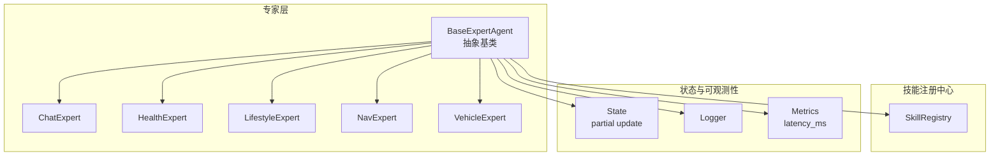
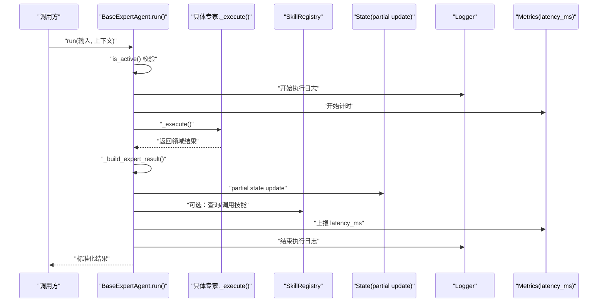
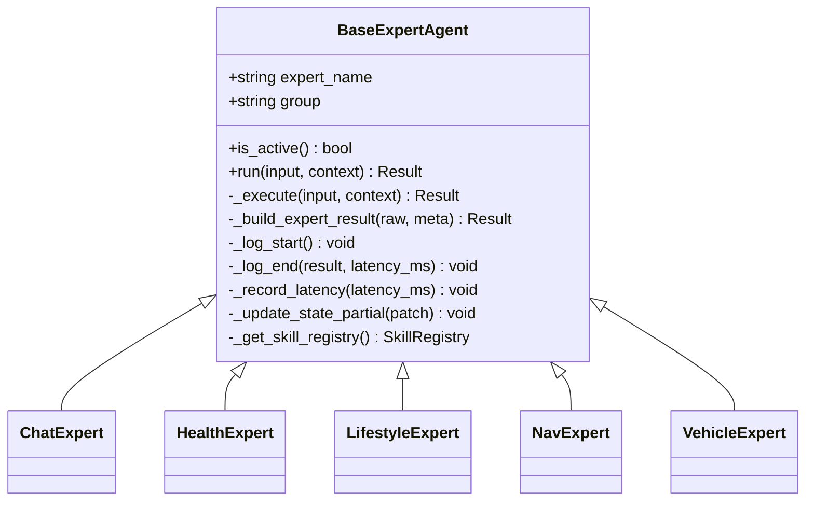
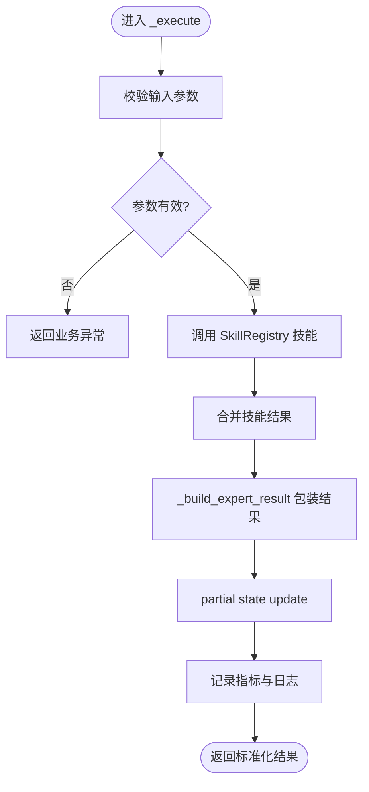
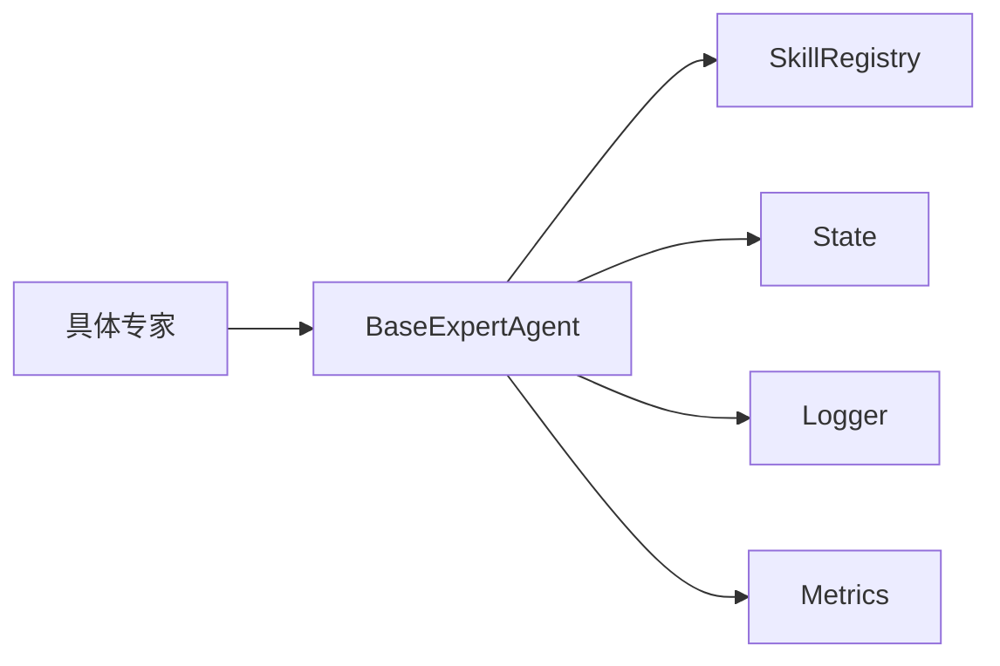

# BaseExpertAgent基类

<cite>
**本文引用的文件**   
- [backend_design/nexus/agent/experts/base.py](file://backend_design/nexus/agent/experts/base.py)
- [backend_design/nexus/agent/experts/chat_expert.py](file://backend_design/nexus/agent/experts/chat_expert.py)
- [backend_design/nexus/agent/experts/health_expert.py](file://backend_design/nexus/agent/experts/health_expert.py)
- [backend_design/nexus/agent/experts/lifestyle_expert.py](file://backend_design/nexus/agent/experts/lifestyle_expert.py)
- [backend_design/nexus/agent/experts/nav_expert.py](file://backend_design/nexus/agent/experts/nav_expert.py)
- [backend_design/nexus/agent/experts/vehicle_expert.py](file://backend_design/nexus/agent/experts/vehicle_expert.py)
- [backend_design/nexus/skills/registry.py](file://backend_design/nexus/skills/registry.py)
- [backend_design/nexus/models/state.py](file://backend_design/nexus/models/state.py)
- [backend_design/nexus/core/logger.py](file://backend_design/nexus/core/logger.py)
- [backend_design/nexus/observability/metrics.py](file://backend_design/nexus/observability/metrics.py)
</cite>

## 目录
1. [简介](#简介)
2. [项目结构](#项目结构)
3. [核心组件](#核心组件)
4. [架构总览](#架构总览)
5. [详细组件分析](#详细组件分析)
6. [依赖分析](#依赖分析)
7. [性能考虑](#性能考虑)
8. [故障排查指南](#故障排查指南)
9. [结论](#结论)
10. [附录](#附录)

## 简介
本文件围绕 BaseExpertAgent 抽象基类，系统化阐述专家 Agent 的设计模式与核心接口，包括：
- expert_name、group 属性的作用机制
- is_active() 活跃状态检查逻辑
- run() 生命周期管理
- _execute() 抽象方法的实现规范
- _build_expert_result() 工具方法的结果构建格式与字段含义
- 异常处理机制、性能监控（latency_ms）与日志记录策略
- 与 SkillRegistry 的集成方式以及 partial state update 的状态管理模式
- 新专家开发的完整指南与最佳实践示例

## 项目结构
BaseExpertAgent 位于 agent/experts 子系统中，作为所有具体专家（如聊天、健康、生活方式、导航、车辆等）的统一基类。其职责是封装专家执行的生命周期、结果构建、状态更新与可观测性采集，从而让具体专家仅关注领域逻辑。

图表来源
- [backend_design/nexus/agent/experts/base.py](file://backend_design/nexus/agent/experts/base.py)
- [backend_design/nexus/agent/experts/chat_expert.py](file://backend_design/nexus/agent/experts/chat_expert.py)
- [backend_design/nexus/agent/experts/health_expert.py](file://backend_design/nexus/agent/experts/health_expert.py)
- [backend_design/nexus/agent/experts/lifestyle_expert.py](file://backend_design/nexus/agent/experts/lifestyle_expert.py)
- [backend_design/nexus/agent/experts/nav_expert.py](file://backend_design/nexus/agent/experts/nav_expert.py)
- [backend_design/nexus/agent/experts/vehicle_expert.py](file://backend_design/nexus/agent/experts/vehicle_expert.py)
- [backend_design/nexus/skills/registry.py](file://backend_design/nexus/skills/registry.py)
- [backend_design/nexus/models/state.py](file://backend_design/nexus/models/state.py)
- [backend_design/nexus/core/logger.py](file://backend_design/nexus/core/logger.py)
- [backend_design/nexus/observability/metrics.py](file://backend_design/nexus/observability/metrics.py)

章节来源
- [backend_design/nexus/agent/experts/base.py](file://backend_design/nexus/agent/experts/base.py)
- [backend_design/nexus/agent/experts/chat_expert.py](file://backend_design/nexus/agent/experts/chat_expert.py)
- [backend_design/nexus/agent/experts/health_expert.py](file://backend_design/nexus/agent/experts/health_expert.py)
- [backend_design/nexus/agent/experts/lifestyle_expert.py](file://backend_design/nexus/agent/experts/lifestyle_expert.py)
- [backend_design/nexus/agent/experts/nav_expert.py](file://backend_design/nexus/agent/experts/nav_expert.py)
- [backend_design/nexus/agent/experts/vehicle_expert.py](file://backend_design/nexus/agent/experts/vehicle_expert.py)
- [backend_design/nexus/skills/registry.py](file://backend_design/nexus/skills/registry.py)
- [backend_design/nexus/models/state.py](file://backend_design/nexus/models/state.py)
- [backend_design/nexus/core/logger.py](file://backend_design/nexus/core/logger.py)
- [backend_design/nexus/observability/metrics.py](file://backend_design/nexus/observability/metrics.py)

## 核心组件
- BaseExpertAgent：定义专家统一入口 run()、活跃判断 is_active()、结果构建 _build_expert_result() 与抽象执行 _execute()；负责异常捕获、耗时统计与日志埋点；提供与 SkillRegistry 的集成能力与 partial state update 的状态写入。
- 具体专家：继承 BaseExpertAgent，实现 _execute() 以表达领域逻辑，并通过 group 属性进行分组管理。
- SkillRegistry：集中注册与发现技能，专家在执行过程中按需调用。
- State：承载会话或上下文状态，支持部分更新（partial update）。
- Logger/Metrics：统一的日志与指标上报，包含 latency_ms 等关键指标。

章节来源
- [backend_design/nexus/agent/experts/base.py](file://backend_design/nexus/agent/experts/base.py)
- [backend_design/nexus/skills/registry.py](file://backend_design/nexus/skills/registry.py)
- [backend_design/nexus/models/state.py](file://backend_design/nexus/models/state.py)
- [backend_design/nexus/core/logger.py](file://backend_design/nexus/core/logger.py)
- [backend_design/nexus/observability/metrics.py](file://backend_design/nexus/observability/metrics.py)

## 架构总览
下图展示了 BaseExpertAgent 在运行时的整体交互：外部调度器调用 run()，内部完成活跃校验、执行、结果构建、状态更新与指标上报。

图表来源
- [backend_design/nexus/agent/experts/base.py](file://backend_design/nexus/agent/experts/base.py)
- [backend_design/nexus/skills/registry.py](file://backend_design/nexus/skills/registry.py)
- [backend_design/nexus/models/state.py](file://backend_design/nexus/models/state.py)
- [backend_design/nexus/core/logger.py](file://backend_design/nexus/core/logger.py)
- [backend_design/nexus/observability/metrics.py](file://backend_design/nexus/observability/metrics.py)

## 详细组件分析

### BaseExpertAgent 类图

图表来源
- [backend_design/nexus/agent/experts/base.py](file://backend_design/nexus/agent/experts/base.py)
- [backend_design/nexus/agent/experts/chat_expert.py](file://backend_design/nexus/agent/experts/chat_expert.py)
- [backend_design/nexus/agent/experts/health_expert.py](file://backend_design/nexus/agent/experts/health_expert.py)
- [backend_design/nexus/agent/experts/lifestyle_expert.py](file://backend_design/nexus/agent/experts/lifestyle_expert.py)
- [backend_design/nexus/agent/experts/nav_expert.py](file://backend_design/nexus/agent/experts/nav_expert.py)
- [backend_design/nexus/agent/experts/vehicle_expert.py](file://backend_design/nexus/agent/experts/vehicle_expert.py)

#### 属性与作用机制
- expert_name：专家唯一标识，用于路由、日志追踪与指标聚合。
- group：专家分组标签，便于批量启停、权限控制与资源隔离。

章节来源
- [backend_design/nexus/agent/experts/base.py](file://backend_design/nexus/agent/experts/base.py)

#### is_active() 活跃状态检查逻辑
- 目的：在进入 run() 后快速短路无效请求，避免不必要的计算与 I/O。
- 常见判定维度：
  - 基于 group 的开关（例如按组启用/禁用）
  - 基于 expert_name 的白名单/黑名单
  - 基于运行时条件（如依赖服务可用性、配额限制）
- 返回值：布尔值，False 时 run() 应直接返回“未激活”的标准结果。

章节来源
- [backend_design/nexus/agent/experts/base.py](file://backend_design/nexus/agent/experts/base.py)

#### run() 生命周期管理
- 步骤概览：
  1) 活跃校验 is_active()
  2) 记录开始日志与计时起点
  3) 调用 _execute() 执行领域逻辑
  4) 使用 _build_expert_result() 构造标准化结果
  5) 执行 partial state update
  6) 上报 latency_ms 指标
  7) 记录结束日志并返回结果
- 异常处理：
  - 捕获 _execute() 抛出的异常，转换为标准错误结果
  - 保证指标与日志在异常路径下仍可上报
- 幂等性与可重试：
  - 若 _execute() 具备幂等语义，可在上层决定重试；否则应避免重复执行副作用。

章节来源
- [backend_design/nexus/agent/experts/base.py](file://backend_design/nexus/agent/experts/base.py)

#### _execute() 抽象方法实现规范
- 职责边界：仅实现领域逻辑，不处理通用横切关注点（日志、指标、状态更新、异常包装）。
- 输入输出：
  - 输入：结构化参数与上下文（如用户意图、历史状态、外部数据）
  - 输出：领域原始结果对象（raw result），由基类统一包装为最终结果
- 异常约定：
  - 抛出明确异常类型，便于基类捕获与分类
  - 对不可恢复错误与可降级场景分别处理
- 性能约束：
  - 避免阻塞操作长时间占用线程
  - 合理拆分任务，必要时并发执行

章节来源
- [backend_design/nexus/agent/experts/base.py](file://backend_design/nexus/agent/experts/base.py)

#### _build_expert_result() 结果构建格式与字段含义
- 目标：将 _execute() 的原始结果统一为标准化的专家结果结构，确保下游一致消费。
- 典型字段（概念说明）：
  - status：执行状态（成功/失败/未激活/降级）
  - data：业务数据主体
  - meta：元信息（如 expert_name、group、trace_id、版本）
  - error：错误码与错误消息（仅在失败时填充）
  - latency_ms：本次执行耗时毫秒数（由基类注入）
- 建议：
  - 保持字段稳定，新增字段需兼容旧客户端
  - 对敏感信息脱敏后再放入 meta

章节来源
- [backend_design/nexus/agent/experts/base.py](file://backend_design/nexus/agent/experts/base.py)

#### 异常处理机制
- 捕获范围：_execute() 及其内部调用的所有代码
- 分类策略：
  - 业务异常：携带错误码与提示，供前端展示或重试
  - 系统异常：记录堆栈，触发告警
- 降级策略：
  - 当依赖服务不可用时，返回缓存或默认结果
  - 通过 group 或配置开关快速熔断

章节来源
- [backend_design/nexus/agent/experts/base.py](file://backend_design/nexus/agent/experts/base.py)

#### 性能监控（latency_ms）与日志记录策略
- 指标：
  - latency_ms：从 run() 进入至返回前的总耗时
  - 可扩展：错误率、成功率、分位延迟
- 日志：
  - 开始/结束各一条，包含 expert_name、group、输入摘要（脱敏）、结果摘要
  - 异常路径追加堆栈与上下文快照
- 采样：
  - 高吞吐场景下可对慢请求全量记录，正常请求采样记录

章节来源
- [backend_design/nexus/agent/experts/base.py](file://backend_design/nexus/agent/experts/base.py)
- [backend_design/nexus/core/logger.py](file://backend_design/nexus/core/logger.py)
- [backend_design/nexus/observability/metrics.py](file://backend_design/nexus/observability/metrics.py)

#### 与 SkillRegistry 的集成方式
- 获取注册中心：通过基类提供的接口访问 SkillRegistry
- 调用流程：
  - 根据 skill_key 查找已注册技能
  - 传入必要上下文执行
  - 将返回结果合并到专家结果中
- 容错：
  - 技能缺失或不可用时应降级或跳过，不影响主流程

章节来源
- [backend_design/nexus/agent/experts/base.py](file://backend_design/nexus/agent/experts/base.py)
- [backend_design/nexus/skills/registry.py](file://backend_design/nexus/skills/registry.py)

#### Partial State Update 的状态管理模式
- 设计思想：只更新必要的状态片段，减少全局状态拷贝与冲突概率
- 适用场景：
  - 增量更新用户偏好、对话历史摘要、临时中间结果
- 注意事项：
  - 字段命名与类型需严格约定
  - 并发更新需加锁或使用原子操作
  - 更新前做最小化校验，避免脏写

章节来源
- [backend_design/nexus/agent/experts/base.py](file://backend_design/nexus/agent/experts/base.py)
- [backend_design/nexus/models/state.py](file://backend_design/nexus/models/state.py)

### 具体专家实现要点
- ChatExpert：侧重对话理解与回复生成，注意上下文窗口管理与多轮一致性。
- HealthExpert：涉及健康数据读取与分析，需遵循隐私合规与数据脱敏。
- LifestyleExpert：个性化推荐与习惯建模，强调冷启动与稀疏数据处理。
- NavExpert：导航与位置相关，需处理坐标精度、地理围栏与实时性。
- VehicleExpert：车辆控制与状态查询，需考虑安全互斥与指令幂等。

章节来源
- [backend_design/nexus/agent/experts/chat_expert.py](file://backend_design/nexus/agent/experts/chat_expert.py)
- [backend_design/nexus/agent/experts/health_expert.py](file://backend_design/nexus/agent/experts/health_expert.py)
- [backend_design/nexus/agent/experts/lifestyle_expert.py](file://backend_design/nexus/agent/experts/lifestyle_expert.py)
- [backend_design/nexus/agent/experts/nav_expert.py](file://backend_design/nexus/agent/experts/nav_expert.py)
- [backend_design/nexus/agent/experts/vehicle_expert.py](file://backend_design/nexus/agent/experts/vehicle_expert.py)

### 开发流程图（_execute 到结果构建）

图表来源
- [backend_design/nexus/agent/experts/base.py](file://backend_design/nexus/agent/experts/base.py)
- [backend_design/nexus/skills/registry.py](file://backend_design/nexus/skills/registry.py)
- [backend_design/nexus/models/state.py](file://backend_design/nexus/models/state.py)

## 依赖分析
- 内聚性：BaseExpertAgent 将横切关注点（日志、指标、状态、异常）内聚于基类，具体专家仅关注领域逻辑，提升内聚性。
- 耦合度：
  - 与 SkillRegistry 松耦合：通过接口访问，便于替换实现
  - 与 State 弱耦合：仅进行局部更新，降低全局状态依赖
  - 与 Logger/Metrics 解耦：通过统一接口上报，便于扩展后端
- 循环依赖：无直接循环导入风险，模块边界清晰

图表来源
- [backend_design/nexus/agent/experts/base.py](file://backend_design/nexus/agent/experts/base.py)
- [backend_design/nexus/skills/registry.py](file://backend_design/nexus/skills/registry.py)
- [backend_design/nexus/models/state.py](file://backend_design/nexus/models/state.py)
- [backend_design/nexus/core/logger.py](file://backend_design/nexus/core/logger.py)
- [backend_design/nexus/observability/metrics.py](file://backend_design/nexus/observability/metrics.py)

章节来源
- [backend_design/nexus/agent/experts/base.py](file://backend_design/nexus/agent/experts/base.py)
- [backend_design/nexus/skills/registry.py](file://backend_design/nexus/skills/registry.py)
- [backend_design/nexus/models/state.py](file://backend_design/nexus/models/state.py)
- [backend_design/nexus/core/logger.py](file://backend_design/nexus/core/logger.py)
- [backend_design/nexus/observability/metrics.py](file://backend_design/nexus/observability/metrics.py)

## 性能考虑
- 缩短关键路径：尽量在 _execute() 中避免同步阻塞；I/O 走异步或连接池
- 结果构建优化：_build_expert_result() 避免深拷贝大对象，采用引用或视图
- 指标采样：在高 QPS 下对非慢请求采样上报，降低开销
- 状态更新：partial update 仅写入变更字段，减少序列化与网络传输成本
- 降级与熔断：对依赖服务设置超时与熔断，保障主流程可用

[本节为通用指导，无需特定文件来源]

## 故障排查指南
- 常见问题定位：
  - 未激活：检查 group 与 expert_name 配置，确认 is_active() 分支逻辑
  - 结果异常：查看 _build_expert_result() 字段映射与空值处理
  - 状态不一致：核对 partial state update 的键名与类型，确认并发保护
  - 指标缺失：确认 metrics 上报是否被异常路径跳过
- 日志关键字：
  - 开始/结束日志中的 expert_name、group、trace_id
  - 异常堆栈与错误码
- 指标看板：
  - latency_ms 分布、P95/P99 延迟
  - 错误率与成功率趋势

章节来源
- [backend_design/nexus/agent/experts/base.py](file://backend_design/nexus/agent/experts/base.py)
- [backend_design/nexus/core/logger.py](file://backend_design/nexus/core/logger.py)
- [backend_design/nexus/observability/metrics.py](file://backend_design/nexus/observability/metrics.py)

## 结论
BaseExpertAgent 通过统一的生命周期管理、标准化的结果构建与完善的可观测性，为专家体系提供了稳定可靠的执行骨架。结合 SkillRegistry 与 partial state update，专家可以专注于领域逻辑，同时获得良好的可维护性与扩展性。

[本节为总结性内容，无需特定文件来源]

## 附录

### 新专家开发指南与最佳实践
- 步骤清单：
  1) 新建专家类，继承 BaseExpertAgent
  2) 设置 expert_name 与 group，确保唯一性与分组意义
  3) 实现 _execute()，专注领域逻辑，抛出明确异常
  4) 如需使用外部能力，通过 SkillRegistry 调用
  5) 在 _execute() 中产出 raw result，交由 _build_expert_result() 包装
  6) 谨慎进行 partial state update，确保字段契约与并发安全
  7) 添加单元测试覆盖活跃判断、异常路径与结果结构
- 最佳实践：
  - 输入校验前置，尽早失败
  - 对外部依赖设置超时与重试上限
  - 日志脱敏，避免泄露敏感信息
  - 指标上报在 finally 块中执行，确保异常路径也能记录
  - 文档化 _execute() 的输入输出契约与错误码

章节来源
- [backend_design/nexus/agent/experts/base.py](file://backend_design/nexus/agent/experts/base.py)
- [backend_design/nexus/skills/registry.py](file://backend_design/nexus/skills/registry.py)
- [backend_design/nexus/models/state.py](file://backend_design/nexus/models/state.py)
- [backend_design/nexus/core/logger.py](file://backend_design/nexus/core/logger.py)
- [backend_design/nexus/observability/metrics.py](file://backend_design/nexus/observability/metrics.py)