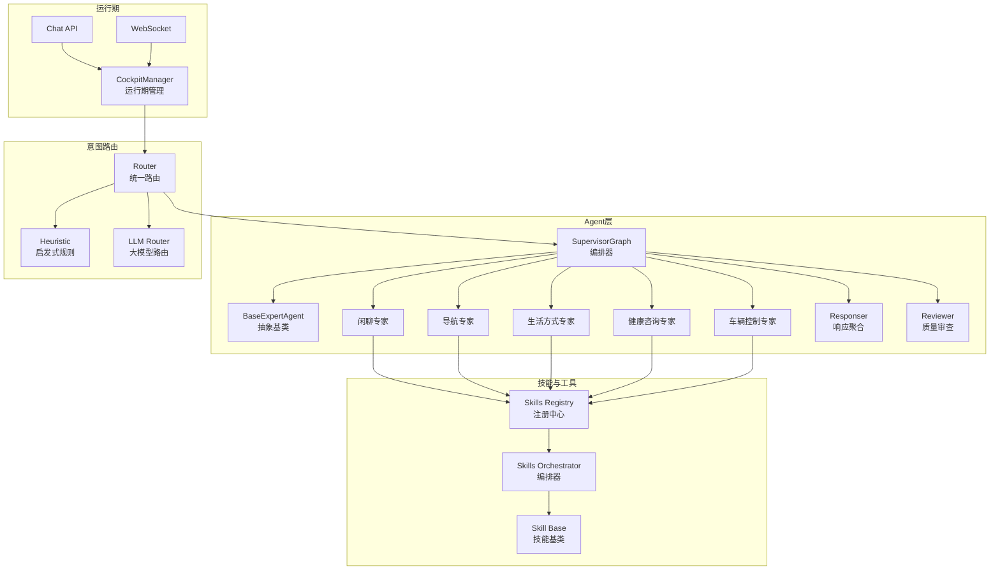
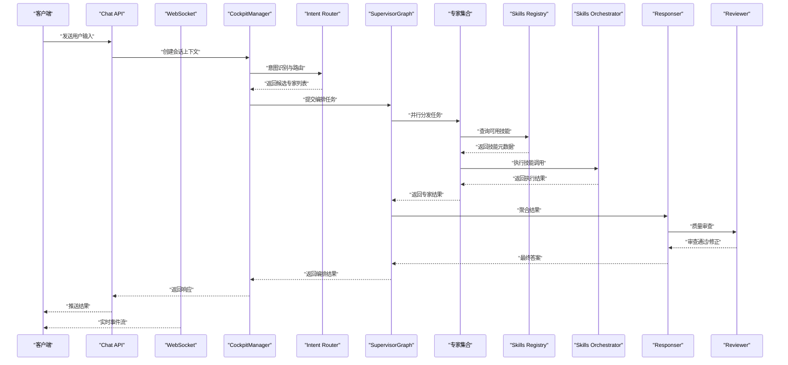
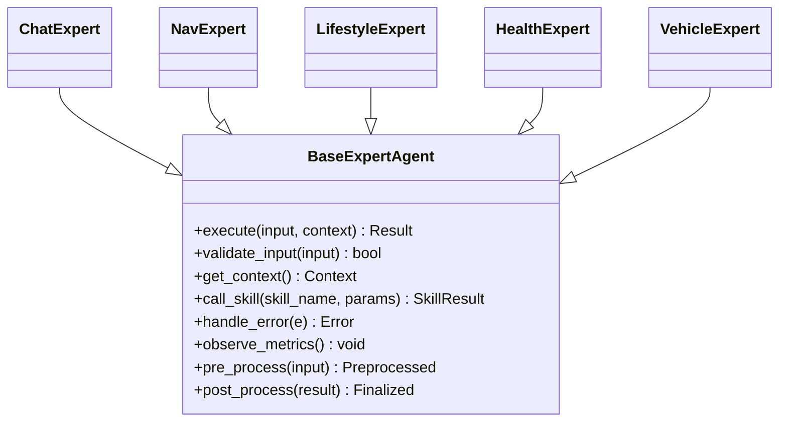
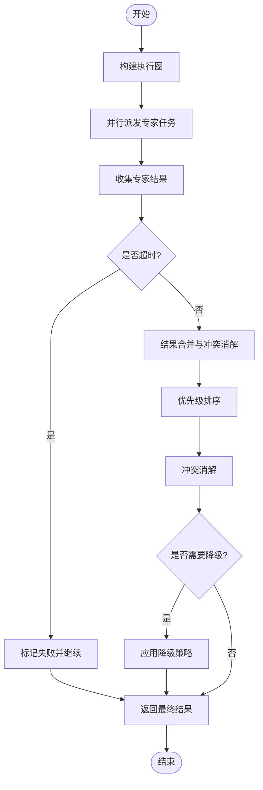
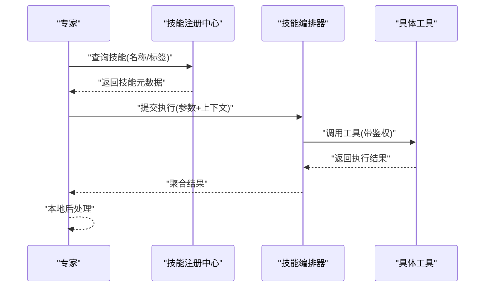
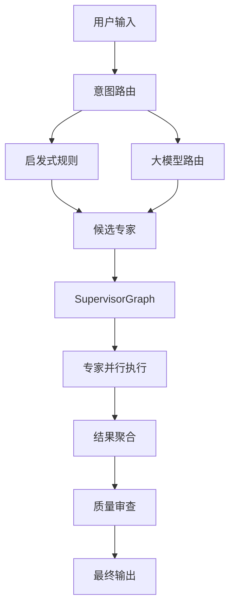
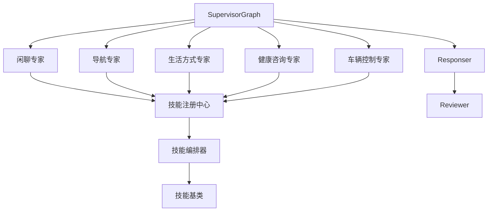

# 专家Agent系统

<cite>
**本文引用的文件**   
- [backend_design/nexus/agent/experts/base.py](file://backend_design/nexus/agent/experts/base.py)
- [backend_design/nexus/agent/experts/chat_expert.py](file://backend_design/nexus/agent/experts/chat_expert.py)
- [backend_design/nexus/agent/experts/nav_expert.py](file://backend_design/nexus/agent/experts/nav_expert.py)
- [backend_design/nexus/agent/experts/lifestyle_expert.py](file://backend_design/nexus/agent/experts/lifestyle_expert.py)
- [backend_design/nexus/agent/experts/health_expert.py](file://backend_design/nexus/agent/experts/health_expert.py)
- [backend_design/nexus/agent/experts/vehicle_expert.py](file://backend_design/nexus/agent/experts/vehicle_expert.py)
- [backend_design/nexus/agent/responder.py](file://backend_design/nexus/agent/responder.py)
- [backend_design/nexus/agent/reviewer.py](file://backend_design/nexus/agent/reviewer.py)
- [backend_design/nexus/agent/supervisor_graph.py](file://backend_design/nexus/agent/supervisor_graph.py)
- [backend_design/nexus/skills/orchestrator.py](file://backend_design/nexus/skills/orchestrator.py)
- [backend_design/nexus/skills/registry.py](file://backend_design/nexus/skills/registry.py)
- [backend_design/nexus/skills/base.py](file://backend_design/nexus/skills/base.py)
- [backend_design/nexus/intent/router.py](file://backend_design/nexus/intent/router.py)
- [backend_design/nexus/intent/heuristic.py](file://backend_design/nexus/intent/heuristic.py)
- [backend_design/nexus/intent/llm_router.py](file://backend_design/nexus/intent/llm_router.py)
- [backend_design/nexus/core/cockpit_manager.py](file://backend_design/nexus/core/cockpit_manager.py)
- [backend_design/nexus/api/routes/chat.py](file://backend_design/nexus/api/routes/chat.py)
- [backend_design/nexus/api/websocket.py](file://backend_design/nexus/api/websocket.py)
</cite>

## 目录
1. [简介](#简介)
2. [项目结构](#项目结构)
3. [核心组件](#核心组件)
4. [架构总览](#架构总览)
5. [详细组件分析](#详细组件分析)
6. [依赖关系分析](#依赖关系分析)
7. [性能考虑](#性能考虑)
8. [故障排查指南](#故障排查指南)
9. [结论](#结论)
10. [附录](#附录)

## 简介
本文件面向 NexusCockpit 的“专家Agent系统”，系统性阐述 BaseExpertAgent 抽象类的设计模式与接口规范，详解五大专家（车辆控制、导航、生活方式、健康咨询、闲聊）的实现差异与协作机制。文档重点覆盖：
- 专家并行执行的工作机理：结果合并策略、错误隔离处理、性能优化方案
- 专家与技能注册中心的集成方式、工具调用机制与上下文传递模式
- 新专家开发指南、最佳实践与常见问题解决方案
- 架构图展示专家间通信协议与数据流转过程

## 项目结构
专家Agent系统位于后端设计模块中，围绕 agent、skills、intent、core 等子域组织代码。关键路径如下：
- 专家定义与编排：backend_design/nexus/agent/experts/*, supervisor_graph.py, responder.py, reviewer.py
- 技能与注册中心：backend_design/nexus/skills/*
- 意图路由：backend_design/nexus/intent/*
- 入口与运行期管理：backend_design/nexus/core/cockpit_manager.py, api/routes/chat.py, api/websocket.py

图表来源
- [backend_design/nexus/agent/supervisor_graph.py](file://backend_design/nexus/agent/supervisor_graph.py)
- [backend_design/nexus/agent/responder.py](file://backend_design/nexus/agent/responder.py)
- [backend_design/nexus/agent/reviewer.py](file://backend_design/nexus/agent/reviewer.py)
- [backend_design/nexus/agent/experts/base.py](file://backend_design/nexus/agent/experts/base.py)
- [backend_design/nexus/agent/experts/chat_expert.py](file://backend_design/nexus/agent/experts/chat_expert.py)
- [backend_design/nexus/agent/experts/nav_expert.py](file://backend_design/nexus/agent/experts/nav_expert.py)
- [backend_design/nexus/agent/experts/lifestyle_expert.py](file://backend_design/nexus/agent/experts/lifestyle_expert.py)
- [backend_design/nexus/agent/experts/health_expert.py](file://backend_design/nexus/agent/experts/health_expert.py)
- [backend_design/nexus/agent/experts/vehicle_expert.py](file://backend_design/nexus/agent/experts/vehicle_expert.py)
- [backend_design/nexus/skills/registry.py](file://backend_design/nexus/skills/registry.py)
- [backend_design/nexus/skills/orchestrator.py](file://backend_design/nexus/skills/orchestrator.py)
- [backend_design/nexus/skills/base.py](file://backend_design/nexus/skills/base.py)
- [backend_design/nexus/intent/router.py](file://backend_design/nexus/intent/router.py)
- [backend_design/nexus/intent/heuristic.py](file://backend_design/nexus/intent/heuristic.py)
- [backend_design/nexus/intent/llm_router.py](file://backend_design/nexus/intent/llm_router.py)
- [backend_design/nexus/core/cockpit_manager.py](file://backend_design/nexus/core/cockpit_manager.py)
- [backend_design/nexus/api/routes/chat.py](file://backend_design/nexus/api/routes/chat.py)
- [backend_design/nexus/api/websocket.py](file://backend_design/nexus/api/websocket.py)

章节来源
- [backend_design/nexus/agent/supervisor_graph.py](file://backend_design/nexus/agent/supervisor_graph.py)
- [backend_design/nexus/agent/responder.py](file://backend_design/nexus/agent/responder.py)
- [backend_design/nexus/agent/reviewer.py](file://backend_design/nexus/agent/reviewer.py)
- [backend_design/nexus/agent/experts/base.py](file://backend_design/nexus/agent/experts/base.py)
- [backend_design/nexus/agent/experts/chat_expert.py](file://backend_design/nexus/agent/experts/chat_expert.py)
- [backend_design/nexus/agent/experts/nav_expert.py](file://backend_design/nexus/agent/experts/nav_expert.py)
- [backend_design/nexus/agent/experts/lifestyle_expert.py](file://backend_design/nexus/agent/experts/lifestyle_expert.py)
- [backend_design/nexus/agent/experts/health_expert.py](file://backend_design/nexus/agent/experts/health_expert.py)
- [backend_design/nexus/agent/experts/vehicle_expert.py](file://backend_design/nexus/agent/experts/vehicle_expert.py)
- [backend_design/nexus/skills/registry.py](file://backend_design/nexus/skills/registry.py)
- [backend_design/nexus/skills/orchestrator.py](file://backend_design/nexus/skills/orchestrator.py)
- [backend_design/nexus/skills/base.py](file://backend_design/nexus/nexus/skills/base.py)
- [backend_design/nexus/intent/router.py](file://backend_design/nexus/intent/router.py)
- [backend_design/nexus/intent/heuristic.py](file://backend_design/nexus/intent/heuristic.py)
- [backend_design/nexus/intent/llm_router.py](file://backend_design/nexus/intent/llm_router.py)
- [backend_design/nexus/core/cockpit_manager.py](file://backend_design/nexus/core/cockpit_manager.py)
- [backend_design/nexus/api/routes/chat.py](file://backend_design/nexus/api/routes/chat.py)
- [backend_design/nexus/api/websocket.py](file://backend_design/nexus/api/websocket.py)

## 核心组件
- BaseExpertAgent 抽象类：定义专家的统一接口、生命周期钩子、上下文注入、工具调用契约、错误边界与可观测性埋点。所有具体专家均继承该基类并实现领域特定的执行逻辑。
- 五大专家：
  - 闲聊专家：负责日常对话、情感陪伴与多轮引导，侧重语言生成与对话状态维护。
  - 导航专家：解析目的地、路线偏好、实时路况，驱动导航相关技能。
  - 生活方式专家：整合日程、习惯、提醒、兴趣推荐等能力，协调多个生活类技能。
  - 健康咨询专家：提供健康建议、指标解读、运动与饮食指导，对接健康类技能与知识库。
  - 车辆控制专家：直接操作车辆功能（空调、座椅、车窗、媒体等），强约束安全与权限校验。
- SupervisorGraph：专家编排器，负责任务分发、并行调度、结果合并、错误隔离与最终审查。
- Responser：聚合各专家输出，进行格式标准化、去重与优先级排序。
- Reviewer：对最终答案进行一致性、安全性与合规性检查，必要时触发回退或二次生成。
- Skills Registry & Orchestrator：技能注册与发现、参数校验、执行编排与资源隔离。
- Intent Router：统一意图识别入口，支持启发式与大模型路由策略。
- CockpitManager：运行期管理，协调API/WebSocket接入、会话上下文、限流与熔断。

章节来源
- [backend_design/nexus/agent/experts/base.py](file://backend_design/nexus/agent/experts/base.py)
- [backend_design/nexus/agent/experts/chat_expert.py](file://backend_design/nexus/agent/experts/chat_expert.py)
- [backend_design/nexus/agent/experts/nav_expert.py](file://backend_design/nexus/agent/experts/nav_expert.py)
- [backend_design/nexus/agent/experts/lifestyle_expert.py](file://backend_design/nexus/agent/experts/lifestyle_expert.py)
- [backend_design/nexus/agent/experts/health_expert.py](file://backend_design/nexus/agent/experts/health_expert.py)
- [backend_design/nexus/agent/experts/vehicle_expert.py](file://backend_design/nexus/agent/experts/vehicle_expert.py)
- [backend_design/nexus/agent/supervisor_graph.py](file://backend_design/nexus/agent/supervisor_graph.py)
- [backend_design/nexus/agent/responder.py](file://backend_design/nexus/agent/responder.py)
- [backend_design/nexus/agent/reviewer.py](file://backend_design/nexus/agent/reviewer.py)
- [backend_design/nexus/skills/registry.py](file://backend_design/nexus/skills/registry.py)
- [backend_design/nexus/skills/orchestrator.py](file://backend_design/nexus/skills/orchestrator.py)
- [backend_design/nexus/intent/router.py](file://backend_design/nexus/intent/router.py)
- [backend_design/nexus/intent/heuristic.py](file://backend_design/nexus/intent/heuristic.py)
- [backend_design/nexus/intent/llm_router.py](file://backend_design/nexus/intent/llm_router.py)
- [backend_design/nexus/core/cockpit_manager.py](file://backend_design/nexus/core/cockpit_manager.py)

## 架构总览
专家系统采用“意图路由 + 专家编排 + 技能注册”的分层架构。请求进入后由意图路由选择目标专家；SupervisorGraph 将任务并行分发给多个专家；各专家通过 Skills Registry 调用对应技能；Responser 汇总结果，Reviewer 做最终把关；CockpitManager 负责运行期管理与外部接入。

图表来源
- [backend_design/nexus/api/routes/chat.py](file://backend_design/nexus/api/routes/chat.py)
- [backend_design/nexus/api/websocket.py](file://backend_design/nexus/api/websocket.py)
- [backend_design/nexus/core/cockpit_manager.py](file://backend_design/nexus/core/cockpit_manager.py)
- [backend_design/nexus/intent/router.py](file://backend_design/nexus/intent/router.py)
- [backend_design/nexus/agent/supervisor_graph.py](file://backend_design/nexus/agent/supervisor_graph.py)
- [backend_design/nexus/agent/responder.py](file://backend_design/nexus/agent/responder.py)
- [backend_design/nexus/agent/reviewer.py](file://backend_design/nexus/agent/reviewer.py)
- [backend_design/nexus/skills/registry.py](file://backend_design/nexus/skills/registry.py)
- [backend_design/nexus/skills/orchestrator.py](file://backend_design/nexus/skills/orchestrator.py)

## 详细组件分析

### BaseExpertAgent 抽象类设计与接口规范
- 职责边界：定义专家通用能力，包括输入校验、上下文注入、工具调用封装、错误边界、日志与指标埋点、超时与重试策略。
- 接口契约：
  - 执行入口：统一的 execute 方法，接收用户输入与会话上下文，返回结构化结果。
  - 上下文访问：提供只读上下文视图，包含用户画像、历史消息、设备状态、位置信息等。
  - 工具调用：通过注册中心获取技能句柄，执行前进行参数校验与安全审计。
  - 错误处理：捕获异常并转换为标准错误码，支持降级与回退。
  - 可观测性：记录耗时、调用次数、失败率等指标。
- 扩展点：
  - 领域特定预处理与后处理钩子
  - 自定义合并策略与优先级权重
  - 可选的多模态输入输出适配

图表来源
- [backend_design/nexus/agent/experts/base.py](file://backend_design/nexus/agent/experts/base.py)
- [backend_design/nexus/agent/experts/chat_expert.py](file://backend_design/nexus/agent/experts/chat_expert.py)
- [backend_design/nexus/agent/experts/nav_expert.py](file://backend_design/nexus/agent/experts/nav_expert.py)
- [backend_design/nexus/agent/experts/lifestyle_expert.py](file://backend_design/nexus/agent/experts/lifestyle_expert.py)
- [backend_design/nexus/agent/experts/health_expert.py](file://backend_design/nexus/agent/experts/health_expert.py)
- [backend_design/nexus/agent/experts/vehicle_expert.py](file://backend_design/nexus/agent/experts/vehicle_expert.py)

章节来源
- [backend_design/nexus/agent/experts/base.py](file://backend_design/nexus/agent/experts/base.py)
- [backend_design/nexus/agent/experts/chat_expert.py](file://backend_design/nexus/agent/experts/chat_expert.py)
- [backend_design/nexus/agent/experts/nav_expert.py](file://backend_design/nexus/agent/experts/nav_expert.py)
- [backend_design/nexus/agent/experts/lifestyle_expert.py](file://backend_design/nexus/agent/experts/lifestyle_expert.py)
- [backend_design/nexus/agent/experts/health_expert.py](file://backend_design/nexus/agent/experts/health_expert.py)
- [backend_design/nexus/agent/experts/vehicle_expert.py](file://backend_design/nexus/agent/experts/vehicle_expert.py)

### 五大专家的具体实现差异与协作机制
- 闲聊专家：
  - 侧重点：对话连贯性、情感表达、多轮记忆。
  - 典型行为：生成自然语言回复、引导澄清、记忆抽取。
- 导航专家：
  - 侧重点：地理信息解析、路线规划、实时路况融合。
  - 典型行为：调用导航技能、渲染路线、更新目的地状态。
- 生活方式专家：
  - 侧重点：习惯建模、提醒管理、个性化推荐。
  - 典型行为：读取用户偏好、组合多个生活技能、生成日程建议。
- 健康咨询专家：
  - 侧重点：健康指标解读、科学建议、风险提示。
  - 典型行为：检索健康知识库、结合用户体征数据、给出分级建议。
- 车辆控制专家：
  - 侧重点：安全与权限、设备可达性、指令幂等。
  - 典型行为：校验用户授权、调用车辆控制技能、反馈执行状态。

协作机制：
- 并行执行：SupervisorGraph 将任务按依赖图并发派发，减少端到端延迟。
- 结果合并：Responser 根据优先级与置信度合并多源结果，去重与冲突消解。
- 错误隔离：单个专家失败不影响其他专家执行，支持局部回退与兜底策略。
- 上下文共享：通过只读上下文传递用户画像、设备状态与历史消息，避免副作用。

章节来源
- [backend_design/nexus/agent/experts/chat_expert.py](file://backend_design/nexus/agent/experts/chat_expert.py)
- [backend_design/nexus/agent/experts/nav_expert.py](file://backend_design/nexus/agent/experts/nav_expert.py)
- [backend_design/nexus/agent/experts/lifestyle_expert.py](file://backend_design/nexus/agent/experts/lifestyle_expert.py)
- [backend_design/nexus/agent/experts/health_expert.py](file://backend_design/nexus/agent/experts/health_expert.py)
- [backend_design/nexus/agent/experts/vehicle_expert.py](file://backend_design/nexus/agent/experts/vehicle_expert.py)
- [backend_design/nexus/agent/supervisor_graph.py](file://backend_design/nexus/agent/supervisor_graph.py)
- [backend_design/nexus/agent/responder.py](file://backend_design/nexus/agent/responder.py)

### 专家并行执行的工作原理
- 任务拆分：SupervisorGraph 基于意图与依赖关系构建执行图，识别可并行节点。
- 并发调度：使用线程池或异步协程并发执行专家，限制最大并发度以避免资源争用。
- 结果收集：每个专家完成后立即上报结果，Responser 持续聚合直至全部完成或达到阈值。
- 超时与取消：为每个专家设置超时时间，超时则标记失败并继续等待其他结果。
- 错误隔离：异常被捕获并转换为标准错误对象，不影响其他专家执行。
- 结果合并策略：
  - 优先级排序：按专家类型与置信度加权排序。
  - 冲突消解：相同字段取最高置信度或最新时间戳版本。
  - 降级策略：当关键专家失败时启用默认模板或缓存结果。

图表来源
- [backend_design/nexus/agent/supervisor_graph.py](file://backend_design/nexus/agent/supervisor_graph.py)
- [backend_design/nexus/agent/responder.py](file://backend_design/nexus/agent/responder.py)

章节来源
- [backend_design/nexus/agent/supervisor_graph.py](file://backend_design/nexus/agent/supervisor_graph.py)
- [backend_design/nexus/agent/responder.py](file://backend_design/nexus/agent/responder.py)

### 专家与技能注册中心的集成方式
- 注册中心职责：
  - 技能发现：按名称、标签、版本检索可用技能。
  - 参数校验：在调用前验证参数结构与业务约束。
  - 权限与配额：检查调用者权限与速率限制。
- 工具调用机制：
  - 专家通过注册中心获取技能句柄，传入标准化参数。
  - 编排器负责串行/并行执行多个技能，聚合中间结果。
  - 错误映射：将底层异常转换为统一错误码与提示。
- 上下文传递模式：
  - 只读上下文：用户画像、会话历史、设备状态、位置信息。
  - 事件流：实时推送执行进度与中间结果到前端。

图表来源
- [backend_design/nexus/skills/registry.py](file://backend_design/nexus/skills/registry.py)
- [backend_design/nexus/skills/orchestrator.py](file://backend_design/nexus/skills/orchestrator.py)
- [backend_design/nexus/skills/base.py](file://backend_design/nexus/skills/base.py)

章节来源
- [backend_design/nexus/skills/registry.py](file://backend_design/nexus/skills/registry.py)
- [backend_design/nexus/skills/orchestrator.py](file://backend_design/nexus/skills/orchestrator.py)
- [backend_design/nexus/skills/base.py](file://backend_design/nexus/skills/base.py)

### 意图路由与上下文传递
- 意图路由：
  - 统一入口：Intent Router 接收用户输入，返回候选专家列表。
  - 混合策略：启发式规则快速匹配，大模型路由用于复杂语义理解。
- 上下文传递：
  - 会话上下文：包含用户ID、设备信息、历史消息、当前状态。
  - 运行时上下文：包含限流状态、熔断状态、追踪ID。
  - 传播方式：通过函数参数与只读对象传递，避免全局状态污染。

图表来源
- [backend_design/nexus/intent/router.py](file://backend_design/nexus/intent/router.py)
- [backend_design/nexus/intent/heuristic.py](file://backend_design/nexus/intent/heuristic.py)
- [backend_design/nexus/intent/llm_router.py](file://backend_design/nexus/intent/llm_router.py)
- [backend_design/nexus/agent/supervisor_graph.py](file://backend_design/nexus/agent/supervisor_graph.py)
- [backend_design/nexus/agent/responder.py](file://backend_design/nexus/agent/responder.py)
- [backend_design/nexus/agent/reviewer.py](file://backend_design/nexus/agent/reviewer.py)

章节来源
- [backend_design/nexus/intent/router.py](file://backend_design/nexus/intent/router.py)
- [backend_design/nexus/intent/heuristic.py](file://backend_design/nexus/intent/heuristic.py)
- [backend_design/nexus/intent/llm_router.py](file://backend_design/nexus/intent/llm_router.py)
- [backend_design/nexus/agent/supervisor_graph.py](file://backend_design/nexus/agent/supervisor_graph.py)
- [backend_design/nexus/agent/responder.py](file://backend_design/nexus/agent/responder.py)
- [backend_design/nexus/agent/reviewer.py](file://backend_design/nexus/agent/reviewer.py)

### 新专家开发指南与最佳实践
- 开发步骤：
  - 继承 BaseExpertAgent，实现 execute 方法与领域特定钩子。
  - 在注册中心登记技能依赖，明确参数与权限要求。
  - 编写单元测试与集成测试，覆盖正常路径与异常分支。
- 最佳实践：
  - 保持专家无副作用，仅通过只读上下文访问外部状态。
  - 合理设置超时与重试，避免雪崩效应。
  - 使用统一错误码与结构化日志，便于问题定位。
  - 对敏感操作增加二次确认与审计日志。
- 常见问题：
  - 上下文缺失：确保上游正确注入必要字段。
  - 技能不可用：注册中心应提供降级与告警。
  - 结果冲突：在 Responser 中明确优先级与消解规则。

章节来源
- [backend_design/nexus/agent/experts/base.py](file://backend_design/nexus/agent/experts/base.py)
- [backend_design/nexus/skills/registry.py](file://backend_design/nexus/skills/registry.py)
- [backend_design/nexus/agent/responder.py](file://backend_design/nexus/agent/responder.py)

## 依赖关系分析
- 组件耦合：
  - 专家与注册中心松耦合，通过接口与元数据进行交互。
  - SupervisorGraph 与 Responser/Reviewer 形成编排流水线，职责清晰。
- 外部依赖：
  - 意图路由可能依赖外部 NLP 服务或本地模型。
  - 技能编排器可能依赖车辆总线、地图服务与健康数据库。
- 潜在循环依赖：
  - 通过分层与接口隔离避免循环引用。
  - 使用事件与回调替代直接同步调用。

图表来源
- [backend_design/nexus/agent/experts/chat_expert.py](file://backend_design/nexus/agent/experts/chat_expert.py)
- [backend_design/nexus/agent/experts/nav_expert.py](file://backend_design/nexus/agent/experts/nav_expert.py)
- [backend_design/nexus/agent/experts/lifestyle_expert.py](file://backend_design/nexus/agent/experts/lifestyle_expert.py)
- [backend_design/nexus/agent/experts/health_expert.py](file://backend_design/nexus/agent/experts/health_expert.py)
- [backend_design/nexus/agent/experts/vehicle_expert.py](file://backend_design/nexus/agent/experts/vehicle_expert.py)
- [backend_design/nexus/skills/registry.py](file://backend_design/nexus/skills/registry.py)
- [backend_design/nexus/skills/orchestrator.py](file://backend_design/nexus/skills/orchestrator.py)
- [backend_design/nexus/skills/base.py](file://backend_design/nexus/skills/base.py)
- [backend_design/nexus/agent/supervisor_graph.py](file://backend_design/nexus/agent/supervisor_graph.py)
- [backend_design/nexus/agent/responder.py](file://backend_design/nexus/agent/responder.py)
- [backend_design/nexus/agent/reviewer.py](file://backend_design/nexus/agent/reviewer.py)

章节来源
- [backend_design/nexus/agent/supervisor_graph.py](file://backend_design/nexus/agent/supervisor_graph.py)
- [backend_design/nexus/agent/responder.py](file://backend_design/nexus/agent/responder.py)
- [backend_design/nexus/agent/reviewer.py](file://backend_design/nexus/agent/reviewer.py)
- [backend_design/nexus/skills/registry.py](file://backend_design/nexus/skills/registry.py)
- [backend_design/nexus/skills/orchestrator.py](file://backend_design/nexus/skills/orchestrator.py)
- [backend_design/nexus/skills/base.py](file://backend_design/nexus/skills/base.py)

## 性能考虑
- 并行度控制：限制并发专家数量，避免CPU与IO瓶颈。
- 超时与熔断：为外部调用设置超时与熔断，防止级联失败。
- 缓存策略：对热点结果进行短期缓存，降低重复计算。
- 批处理与增量更新：对批量任务采用批处理，减少网络往返。
- 监控与告警：采集关键指标（延迟、吞吐、错误率），设置阈值告警。

[本节为通用性能建议，不直接分析具体文件]

## 故障排查指南
- 常见问题定位：
  - 意图路由失败：检查启发式规则与大模型路由配置。
  - 专家执行超时：查看超时阈值与外部依赖可用性。
  - 技能调用失败：核对注册中心元数据与权限配置。
  - 结果合并异常：检查优先级与冲突消解规则。
- 调试技巧：
  - 开启详细日志与追踪ID，关联上下游调用链。
  - 使用模拟数据与沙箱环境复现问题。
  - 逐步禁用专家以定位瓶颈。

章节来源
- [backend_design/nexus/intent/router.py](file://backend_design/nexus/intent/router.py)
- [backend_design/nexus/intent/heuristic.py](file://backend_design/nexus/intent/heuristic.py)
- [backend_design/nexus/intent/llm_router.py](file://backend_design/nexus/intent/llm_router.py)
- [backend_design/nexus/agent/supervisor_graph.py](file://backend_design/nexus/agent/supervisor_graph.py)
- [backend_design/nexus/agent/responder.py](file://backend_design/nexus/agent/responder.py)
- [backend_design/nexus/agent/reviewer.py](file://backend_design/nexus/agent/reviewer.py)
- [backend_design/nexus/skills/registry.py](file://backend_design/nexus/skills/registry.py)

## 结论
专家Agent系统通过清晰的抽象与分层设计，实现了高内聚、低耦合的模块化架构。BaseExpertAgent 定义了统一的专家接口与生命周期，SupervisorGraph 负责高效并行编排，Responser 与 Reviewer 保障结果质量。借助技能注册中心与意图路由，系统具备良好的可扩展性与可维护性。遵循本文的开发指南与最佳实践，可快速构建新的专家并融入现有生态。

[本节为总结性内容，不直接分析具体文件]

## 附录
- 术语表：
  - 专家：具备特定领域能力的智能体。
  - 技能：可被专家调用的原子化能力。
  - 注册中心：技能的发现与元数据管理组件。
  - 编排器：负责任务调度与结果聚合的组件。
- 参考路径：
  - 专家定义：backend_design/nexus/agent/experts/*
  - 编排与响应：backend_design/nexus/agent/supervisor_graph.py, responder.py, reviewer.py
  - 技能与注册：backend_design/nexus/skills/*
  - 意图路由：backend_design/nexus/intent/*
  - 运行期管理：backend_design/nexus/core/cockpit_manager.py, api/routes/chat.py, api/websocket.py

[本节为补充信息，不直接分析具体文件]