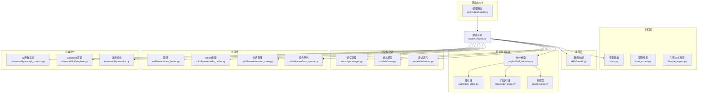
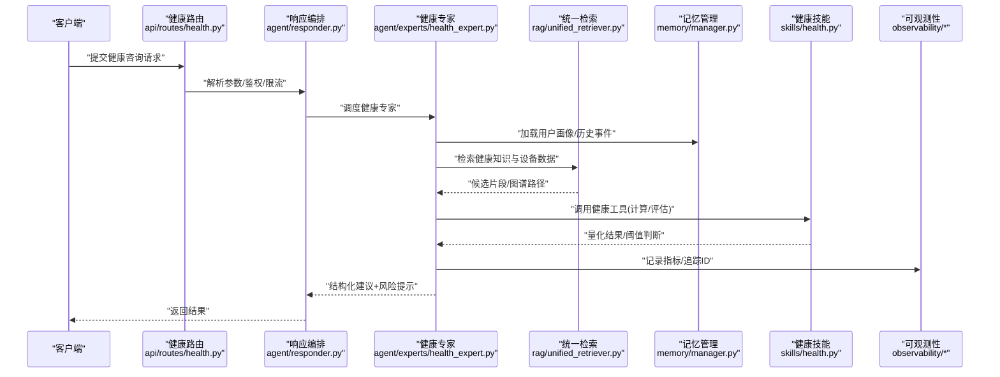
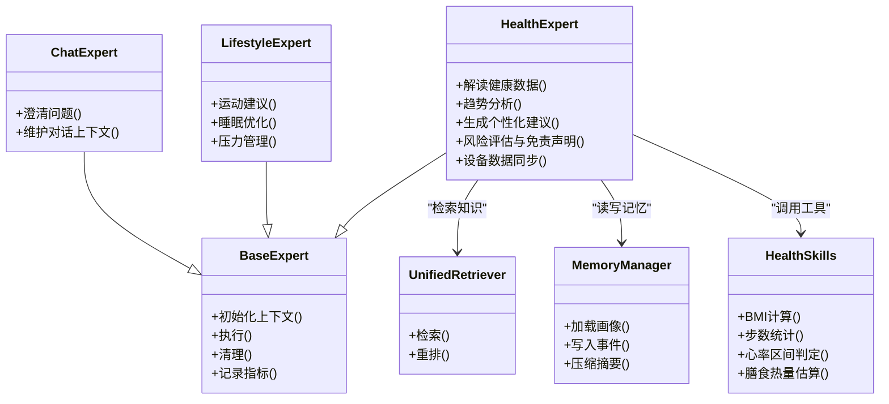
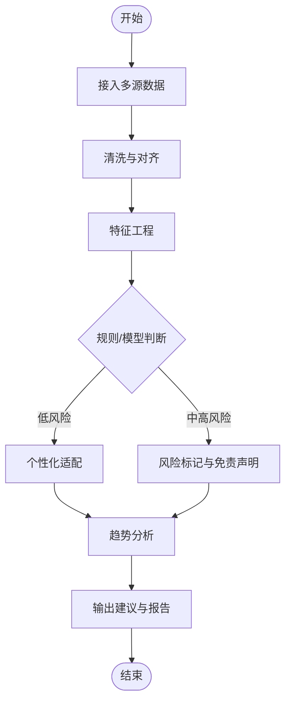
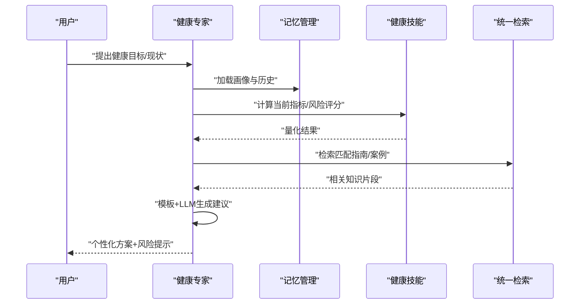
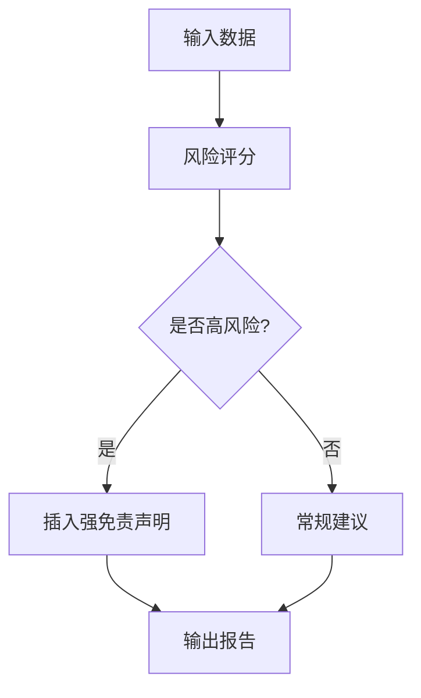
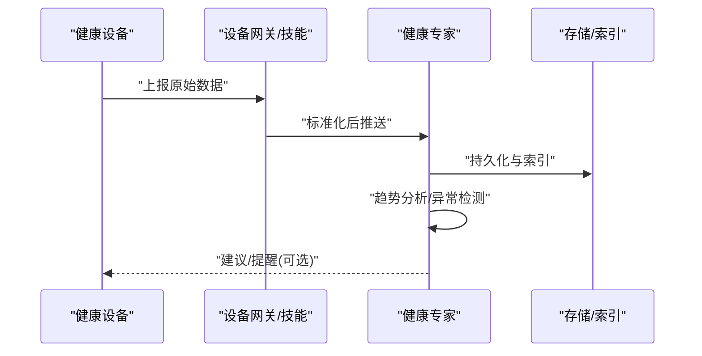
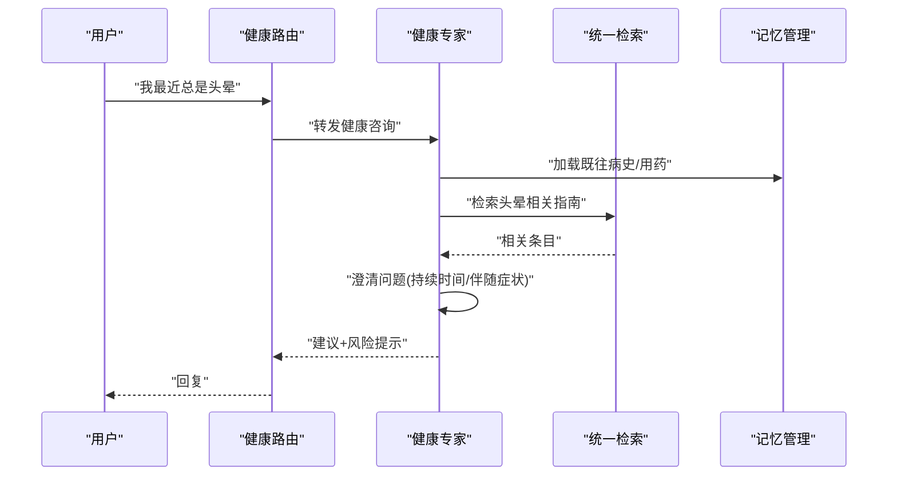
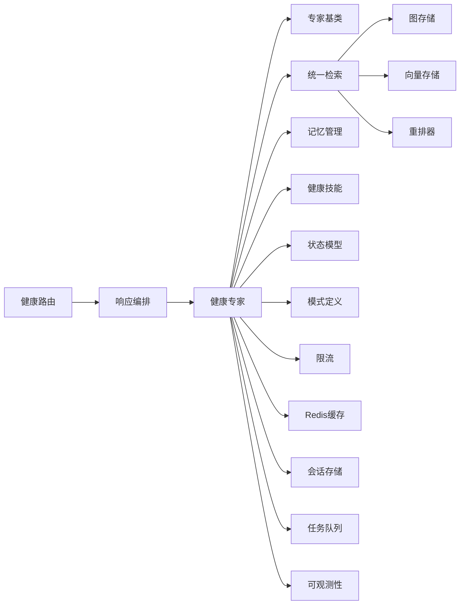

# 健康咨询专家

<cite>
**本文引用的文件**   
- [health_expert.py](file://backend_design/nexus/agent/experts/health_expert.py)
- [base.py](file://backend_design/nexus/agent/experts/base.py)
- [chat_expert.py](file://backend_design/nexus/agent/experts/chat_expert.py)
- [lifestyle_expert.py](file://backend_design/nexus/agent/experts/lifestyle_expert.py)
- [responder.py](file://backend_design/nexus/agent/responder.py)
- [supervisor_graph.py](file://backend_design/nexus/agent/supervisor_graph.py)
- [health.py](file://backend_design/nexus/api/routes/health.py)
- [skills_health.py](file://backend_design/nexus/skills/health.py)
- [personalization.py](file://backend_design/nexus/core/personalization.py)
- [schemas.py](file://backend_design/nexus/models/schemas.py)
- [state.py](file://backend_design/nexus/models/state.py)
- [unified_retriever.py](file://backend_design/nexus/rag/unified_retriever.py)
- [graph_store.py](file://backend_design/nexus/rag/graph_store.py)
- [vector_store.py](file://backend_design/nexus/rag/vector_store.py)
- [reranker.py](file://backend_design/nexus/rag/reranker.py)
- [memory_manager.py](file://backend_design/nexus/memory/manager.py)
- [rate_limiter.py](file://backend_design/nexus/middleware/rate_limiter.py)
- [redis_cache.py](file://backend_design/nexus/middleware/redis_cache.py)
- [session_store.py](file://backend_design/nexus/middleware/session_store.py)
- [task_queue.py](file://backend_design/nexus/middleware/task_queue.py)
- [exceptions.py](file://backend_design/nexus/core/exceptions.py)
- [logger.py](file://backend_design/nexus/core/logger.py)
- [cockpit_metrics.py](file://backend_design/nexus/observability/cockpit_metrics.py)
- [langfuse.py](file://backend_design/nexus/observability/langfuse.py)
- [metrics.py](file://backend_design/nexus/observability/metrics.py)
</cite>

## 目录
1. [简介](#简介)
2. [项目结构](#项目结构)
3. [核心组件](#核心组件)
4. [架构总览](#架构总览)
5. [详细组件分析](#详细组件分析)
6. [依赖关系分析](#依赖关系分析)
7. [性能考虑](#性能考虑)
8. [故障排查指南](#故障排查指南)
9. [结论](#结论)
10. [附录](#附录)

## 简介
本文件面向“健康咨询专家（HealthExpert）”的功能与实现，覆盖以下方面：
- 知识范围与能力边界：健康监测、运动建议、饮食指导、心理健康等。
- 数据解读与分析逻辑：如何读取健康数据、进行趋势分析与个性化建议生成。
- 安全与合规：医疗免责声明、风险提示机制与降级策略。
- 设备集成与数据同步：与健康设备的对接方式、数据入库与可视化。
- 对话示例与术语处理：标准问答流程、专业术语规范化与澄清策略。

## 项目结构
围绕健康咨询的核心代码主要分布在以下模块：
- 专家层：健康专家及其基类、聊天专家、生活方式专家等。
- 路由与API：健康相关接口定义。
- 技能层：健康领域技能编排与工具调用。
- 检索与知识库：统一检索、图存储、向量存储、重排器。
- 记忆与会话：长期记忆压缩与冲突管理、会话状态。
- 中间件：限流、缓存、任务队列、会话存储。
- 可观测性：指标、日志、链路追踪。

图表来源
- [health_expert.py](file://backend_design/nexus/agent/experts/health_expert.py)
- [base.py](file://backend_design/nexus/agent/experts/base.py)
- [chat_expert.py](file://backend_design/nexus/agent/experts/chat_expert.py)
- [lifestyle_expert.py](file://backend_design/nexus/agent/experts/lifestyle_expert.py)
- [health.py](file://backend_design/nexus/api/routes/health.py)
- [skills_health.py](file://backend_design/nexus/skills/health.py)
- [unified_retriever.py](file://backend_design/nexus/rag/unified_retriever.py)
- [graph_store.py](file://backend_design/nexus/rag/graph_store.py)
- [vector_store.py](file://backend_design/nexus/rag/vector_store.py)
- [reranker.py](file://backend_design/nexus/rag/reranker.py)
- [memory_manager.py](file://backend_design/nexus/memory/manager.py)
- [state.py](file://backend_design/nexus/models/state.py)
- [schemas.py](file://backend_design/nexus/models/schemas.py)
- [rate_limiter.py](file://backend_design/nexus/middleware/rate_limiter.py)
- [redis_cache.py](file://backend_design/nexus/middleware/redis_cache.py)
- [session_store.py](file://backend_design/nexus/middleware/session_store.py)
- [task_queue.py](file://backend_design/nexus/middleware/task_queue.py)
- [cockpit_metrics.py](file://backend_design/nexus/observability/cockpit_metrics.py)
- [langfuse.py](file://backend_design/nexus/observability/langfuse.py)
- [metrics.py](file://backend_design/nexus/observability/metrics.py)

章节来源
- [health_expert.py](file://backend_design/nexus/agent/experts/health_expert.py)
- [base.py](file://backend_design/nexus/agent/experts/base.py)
- [chat_expert.py](file://backend_design/nexus/agent/experts/chat_expert.py)
- [lifestyle_expert.py](file://backend_design/nexus/agent/experts/lifestyle_expert.py)
- [health.py](file://backend_design/nexus/api/routes/health.py)
- [skills_health.py](file://backend_design/nexus/skills/health.py)
- [unified_retriever.py](file://backend_design/nexus/rag/unified_retriever.py)
- [graph_store.py](file://backend_design/nexus/rag/graph_store.py)
- [vector_store.py](file://backend_design/nexus/rag/vector_store.py)
- [reranker.py](file://backend_design/nexus/rag/reranker.py)
- [memory_manager.py](file://backend_design/nexus/memory/manager.py)
- [state.py](file://backend_design/nexus/models/state.py)
- [schemas.py](file://backend_design/nexus/models/schemas.py)
- [rate_limiter.py](file://backend_design/nexus/middleware/rate_limiter.py)
- [redis_cache.py](file://backend_design/nexus/middleware/redis_cache.py)
- [session_store.py](file://backend_design/nexus/middleware/session_store.py)
- [task_queue.py](file://backend_design/nexus/middleware/task_queue.py)
- [cockpit_metrics.py](file://backend_design/nexus/observability/cockpit_metrics.py)
- [langfuse.py](file://backend_design/nexus/observability/langfuse.py)
- [metrics.py](file://backend_design/nexus/observability/metrics.py)

## 核心组件
- 健康专家（HealthExpert）
  - 职责：承接健康领域意图，协调检索、记忆、技能与外部设备数据，输出个性化健康建议与风险提示。
  - 关键能力：健康数据解读、趋势分析、个性化建议生成、免责声明与风险分级提示、设备数据接入与同步。
- 专家基类（Base Expert）
  - 职责：提供统一的专家生命周期、上下文注入、错误处理与可观测性埋点。
- 聊天专家（ChatExpert）
  - 职责：通用对话编排、澄清问题、多轮上下文维护。
- 生活方式专家（LifestyleExpert）
  - 职责：与运动、睡眠、压力管理等非医疗类建议协同，形成综合健康方案。
- 健康路由（Health API）
  - 职责：暴露健康查询、数据同步、趋势分析等接口，承载鉴权、限流与审计。
- 健康技能（Health Skills）
  - 职责：封装具体健康工具（如BMI计算、步数统计、心率区间判定、膳食热量估算等）。
- 检索与知识库（RAG）
  - 职责：统一检索入口，组合图数据库与向量库，结合重排器提升相关性。
- 记忆与会话（Memory & State）
  - 职责：用户偏好、历史健康事件、目标与约束的持久化与压缩；会话状态机。
- 中间件（Middleware）
  - 职责：限流、缓存、会话存储、异步任务队列，保障稳定性与吞吐。
- 可观测性（Observability）
  - 职责：指标采集、分布式追踪、仪表盘展示，支撑质量与SLA监控。

章节来源
- [health_expert.py](file://backend_design/nexus/agent/experts/health_expert.py)
- [base.py](file://backend_design/nexus/agent/experts/base.py)
- [chat_expert.py](file://backend_design/nexus/agent/experts/chat_expert.py)
- [lifestyle_expert.py](file://backend_design/nexus/agent/experts/lifestyle_expert.py)
- [health.py](file://backend_design/nexus/api/routes/health.py)
- [skills_health.py](file://backend_design/nexus/skills/health.py)
- [unified_retriever.py](file://backend_design/nexus/rag/unified_retriever.py)
- [graph_store.py](file://backend_design/nexus/rag/graph_store.py)
- [vector_store.py](file://backend_design/nexus/rag/vector_store.py)
- [reranker.py](file://backend_design/nexus/rag/reranker.py)
- [memory_manager.py](file://backend_design/nexus/memory/manager.py)
- [state.py](file://backend_design/nexus/models/state.py)
- [schemas.py](file://backend_design/nexus/models/schemas.py)
- [rate_limiter.py](file://backend_design/nexus/middleware/rate_limiter.py)
- [redis_cache.py](file://backend_design/nexus/middleware/redis_cache.py)
- [session_store.py](file://backend_design/nexus/middleware/session_store.py)
- [task_queue.py](file://backend_design/nexus/middleware/task_queue.py)
- [cockpit_metrics.py](file://backend_design/nexus/observability/cockpit_metrics.py)
- [langfuse.py](file://backend_design/nexus/observability/langfuse.py)
- [metrics.py](file://backend_design/nexus/observability/metrics.py)

## 架构总览
健康咨询的整体流程从API进入，经专家编排，调用检索与技能，结合记忆与个性化配置，最终返回结构化建议与风险提示。

图表来源
- [health.py](file://backend_design/nexus/api/routes/health.py)
- [responder.py](file://backend_design/nexus/agent/responder.py)
- [health_expert.py](file://backend_design/nexus/agent/experts/health_expert.py)
- [unified_retriever.py](file://backend_design/nexus/rag/unified_retriever.py)
- [memory_manager.py](file://backend_design/nexus/memory/manager.py)
- [skills_health.py](file://backend_design/nexus/skills/health.py)
- [cockpit_metrics.py](file://backend_design/nexus/observability/cockpit_metrics.py)
- [langfuse.py](file://backend_design/nexus/observability/langfuse.py)
- [metrics.py](file://backend_design/nexus/observability/metrics.py)

## 详细组件分析

### 健康专家（HealthExpert）
- 角色定位
  - 作为健康领域的单一责任专家，负责将用户意图转化为可执行的健康计划或建议。
- 关键职责
  - 健康数据解读：整合来自设备与用户输入的多源数据，进行清洗、对齐与标准化。
  - 趋势分析：基于时间序列与阈值规则识别异常与趋势拐点。
  - 个性化建议：结合用户画像、偏好与历史行为生成差异化方案。
  - 风险分级与免责声明：对高风险场景触发强提示并引导就医。
  - 设备集成：通过技能层与设备网关交互，完成数据拉取与上报。
- 交互对象
  - 检索系统：获取权威健康知识与案例。
  - 记忆系统：读取长期偏好与短期上下文。
  - 技能系统：执行具体计算与评估。
  - 可观测性：记录关键指标与链路信息。

图表来源
- [base.py](file://backend_design/nexus/agent/experts/base.py)
- [health_expert.py](file://backend_design/nexus/agent/experts/health_expert.py)
- [chat_expert.py](file://backend_design/nexus/agent/experts/chat_expert.py)
- [lifestyle_expert.py](file://backend_design/nexus/agent/experts/lifestyle_expert.py)
- [skills_health.py](file://backend_design/nexus/skills/health.py)
- [unified_retriever.py](file://backend_design/nexus/rag/unified_retriever.py)
- [memory_manager.py](file://backend_design/nexus/memory/manager.py)

章节来源
- [health_expert.py](file://backend_design/nexus/agent/experts/health_expert.py)
- [base.py](file://backend_design/nexus/agent/experts/base.py)
- [chat_expert.py](file://backend_design/nexus/agent/experts/chat_expert.py)
- [lifestyle_expert.py](file://backend_design/nexus/agent/experts/lifestyle_expert.py)
- [skills_health.py](file://backend_design/nexus/skills/health.py)
- [unified_retriever.py](file://backend_design/nexus/rag/unified_retriever.py)
- [memory_manager.py](file://backend_design/nexus/memory/manager.py)

### 健康数据解读与分析逻辑
- 数据源
  - 设备数据：心率、血氧、血压、步数、睡眠阶段等。
  - 用户输入：主观感受、症状描述、饮食记录。
  - 知识库：权威指南、研究摘要、案例库。
- 处理流程
  - 数据清洗与对齐：去噪、缺失值插补、时间戳对齐。
  - 特征工程：滑动窗口统计、波动率、峰值检测。
  - 规则与模型：阈值规则、评分卡、轻量模型辅助判断。
  - 趋势分析：周/月维度对比、拐点识别、回归拟合。
  - 个性化适配：依据年龄、性别、既往史、目标与禁忌调整建议强度。

图表来源
- [health_expert.py](file://backend_design/nexus/agent/experts/health_expert.py)
- [skills_health.py](file://backend_design/nexus/skills/health.py)
- [unified_retriever.py](file://backend_design/nexus/rag/unified_retriever.py)
- [memory_manager.py](file://backend_design/nexus/memory/manager.py)

章节来源
- [health_expert.py](file://backend_design/nexus/agent/experts/health_expert.py)
- [skills_health.py](file://backend_design/nexus/skills/health.py)
- [unified_retriever.py](file://backend_design/nexus/rag/unified_retriever.py)
- [memory_manager.py](file://backend_design/nexus/memory/manager.py)

### 个性化健康建议生成机制
- 用户画像
  - 人口学信息、既往病史、过敏与禁忌、运动基础、饮食偏好、心理状态基线。
- 目标与约束
  - 减脂/增肌、改善睡眠、降低压力、慢病管理目标；时间与资源约束。
- 生成策略
  - 模板+LLM：以结构化模板为骨架，LLM填充细节与语气。
  - 规则优先：对高风险项采用硬规则与强提示。
  - 反馈闭环：根据用户反馈与后续数据动态调整建议强度与频率。

图表来源
- [health_expert.py](file://backend_design/nexus/agent/experts/health_expert.py)
- [memory_manager.py](file://backend_design/nexus/memory/manager.py)
- [skills_health.py](file://backend_design/nexus/skills/health.py)
- [unified_retriever.py](file://backend_design/nexus/rag/unified_retriever.py)

章节来源
- [health_expert.py](file://backend_design/nexus/agent/experts/health_expert.py)
- [memory_manager.py](file://backend_design/nexus/memory/manager.py)
- [skills_health.py](file://backend_design/nexus/skills/health.py)
- [unified_retriever.py](file://backend_design/nexus/rag/unified_retriever.py)

### 医疗免责声明与风险提示机制
- 风险分级
  - 低：日常保健与生活方式建议。
  - 中：需关注与复诊提醒。
  - 高：紧急就医提示与明确免责声明。
- 触发条件
  - 指标越界、症状叠加、既往高危因素、连续异常趋势。
- 输出规范
  - 固定免责声明文案、就医指引、避免诊断性断言、强调AI建议非医疗决策。

图表来源
- [health_expert.py](file://backend_design/nexus/agent/experts/health_expert.py)
- [skills_health.py](file://backend_design/nexus/skills/health.py)

章节来源
- [health_expert.py](file://backend_design/nexus/agent/experts/health_expert.py)
- [skills_health.py](file://backend_design/nexus/skills/health.py)

### 健康设备集成与数据同步
- 集成方式
  - 通过健康技能层抽象设备接口，支持HTTP/MCP等多种协议。
  - 数据拉取：定时或事件驱动同步设备指标。
  - 数据上报：将健康建议执行情况与反馈回传至设备或平台。
- 数据治理
  - 字段映射、单位换算、时间同步、去重与校验。
- 趋势分析
  - 按日/周/月聚合，生成趋势曲线与异常告警。

图表来源
- [skills_health.py](file://backend_design/nexus/skills/health.py)
- [health_expert.py](file://backend_design/nexus/agent/experts/health_expert.py)

章节来源
- [skills_health.py](file://backend_design/nexus/skills/health.py)
- [health_expert.py](file://backend_design/nexus/agent/experts/health_expert.py)

### 健康咨询对话示例与术语处理
- 对话流程
  - 意图识别：区分健康咨询、设备查询、日程提醒等。
  - 澄清问题：针对模糊症状或目标进行追问。
  - 建议输出：结构化建议+风险提示+下一步行动。
- 术语处理
  - 术语归一化：将口语化表达映射为标准医学术语。
  - 同义词扩展：确保检索召回充分。
  - 歧义消解：结合上下文与用户画像消除歧义。

图表来源
- [health.py](file://backend_design/nexus/api/routes/health.py)
- [health_expert.py](file://backend_design/nexus/agent/experts/health_expert.py)
- [unified_retriever.py](file://backend_design/nexus/rag/unified_retriever.py)
- [memory_manager.py](file://backend_design/nexus/memory/manager.py)

章节来源
- [health.py](file://backend_design/nexus/api/routes/health.py)
- [health_expert.py](file://backend_design/nexus/agent/experts/health_expert.py)
- [unified_retriever.py](file://backend_design/nexus/rag/unified_retriever.py)
- [memory_manager.py](file://backend_design/nexus/memory/manager.py)

## 依赖关系分析
- 内部依赖
  - 健康专家依赖专家基类、统一检索、记忆管理、健康技能、状态与模式定义。
  - 路由依赖响应编排与健康专家。
  - 检索依赖图存储、向量存储与重排器。
- 外部依赖
  - 中间件：限流、缓存、会话存储、任务队列。
  - 可观测性：指标、日志、分布式追踪。

图表来源
- [health.py](file://backend_design/nexus/api/routes/health.py)
- [responder.py](file://backend_design/nexus/agent/responder.py)
- [health_expert.py](file://backend_design/nexus/agent/experts/health_expert.py)
- [base.py](file://backend_design/nexus/agent/experts/base.py)
- [unified_retriever.py](file://backend_design/nexus/rag/unified_retriever.py)
- [graph_store.py](file://backend_design/nexus/rag/graph_store.py)
- [vector_store.py](file://backend_design/nexus/rag/vector_store.py)
- [reranker.py](file://backend_design/nexus/rag/reranker.py)
- [memory_manager.py](file://backend_design/nexus/memory/manager.py)
- [state.py](file://backend_design/nexus/models/state.py)
- [schemas.py](file://backend_design/nexus/models/schemas.py)
- [rate_limiter.py](file://backend_design/nexus/middleware/rate_limiter.py)
- [redis_cache.py](file://backend_design/nexus/middleware/redis_cache.py)
- [session_store.py](file://backend_design/nexus/middleware/session_store.py)
- [task_queue.py](file://backend_design/nexus/middleware/task_queue.py)
- [cockpit_metrics.py](file://backend_design/nexus/observability/cockpit_metrics.py)
- [langfuse.py](file://backend_design/nexus/observability/langfuse.py)
- [metrics.py](file://backend_design/nexus/observability/metrics.py)

章节来源
- [health.py](file://backend_design/nexus/api/routes/health.py)
- [responder.py](file://backend_design/nexus/agent/responder.py)
- [health_expert.py](file://backend_design/nexus/agent/experts/health_expert.py)
- [base.py](file://backend_design/nexus/agent/experts/base.py)
- [unified_retriever.py](file://backend_design/nexus/rag/unified_retriever.py)
- [graph_store.py](file://backend_design/nexus/rag/graph_store.py)
- [vector_store.py](file://backend_design/nexus/rag/vector_store.py)
- [reranker.py](file://backend_design/nexus/rag/reranker.py)
- [memory_manager.py](file://backend_design/nexus/memory/manager.py)
- [state.py](file://backend_design/nexus/models/state.py)
- [schemas.py](file://backend_design/nexus/models/schemas.py)
- [rate_limiter.py](file://backend_design/nexus/middleware/rate_limiter.py)
- [redis_cache.py](file://backend_design/nexus/middleware/redis_cache.py)
- [session_store.py](file://backend_design/nexus/middleware/session_store.py)
- [task_queue.py](file://backend_design/nexus/middleware/task_queue.py)
- [cockpit_metrics.py](file://backend_design/nexus/observability/cockpit_metrics.py)
- [langfuse.py](file://backend_design/nexus/observability/langfuse.py)
- [metrics.py](file://backend_design/nexus/observability/metrics.py)

## 性能考虑
- 检索优化
  - 使用统一检索与重排器减少无关内容，提高命中率与响应速度。
- 缓存策略
  - 热点知识片段与常用建议模板缓存，降低重复计算。
- 异步处理
  - 设备数据同步与趋势分析走任务队列，避免阻塞主流程。
- 限流与熔断
  - 通过限流保护后端，结合熔断与降级策略保障可用性。
- 可观测性
  - 指标与链路追踪帮助定位瓶颈与异常。

[本节为通用性能建议，不直接分析具体文件]

## 故障排查指南
- 常见问题
  - 设备数据不同步：检查设备网关、技能接口与任务队列状态。
  - 检索结果不相关：调整检索权重与重排策略，扩充同义词与术语表。
  - 建议过于保守或激进：校准风险阈值与个性化权重。
  - 响应超时：查看限流、缓存命中与任务队列积压情况。
- 调试手段
  - 启用详细日志与链路追踪，定位调用链路与耗时分布。
  - 使用仪表盘观察关键指标与错误率。

章节来源
- [exceptions.py](file://backend_design/nexus/core/exceptions.py)
- [logger.py](file://backend_design/nexus/core/logger.py)
- [cockpit_metrics.py](file://backend_design/nexus/observability/cockpit_metrics.py)
- [langfuse.py](file://backend_design/nexus/observability/langfuse.py)
- [metrics.py](file://backend_design/nexus/observability/metrics.py)

## 结论
健康咨询专家在系统中承担健康领域核心职责，通过检索增强、记忆个性化与技能工具化，提供安全、合规且个性化的健康建议。配合完善的中间件与可观测性体系，系统在稳定性、性能与可维护性方面具备良好基础。未来可进一步扩展设备生态、丰富知识库与优化个性化算法，以提升用户体验与效果。

[本节为总结性内容，不直接分析具体文件]

## 附录
- 术语处理要点
  - 建立术语词典与同义词表，支持口语到标准术语的映射。
  - 在检索前进行术语归一化，提升召回质量。
- 对话最佳实践
  - 先澄清再建议，避免误判。
  - 高风险场景必须包含免责声明与就医指引。
- 数据治理清单
  - 字段字典、单位换算表、时间同步策略、去重与校验规则。

[本节为补充说明，不直接分析具体文件]