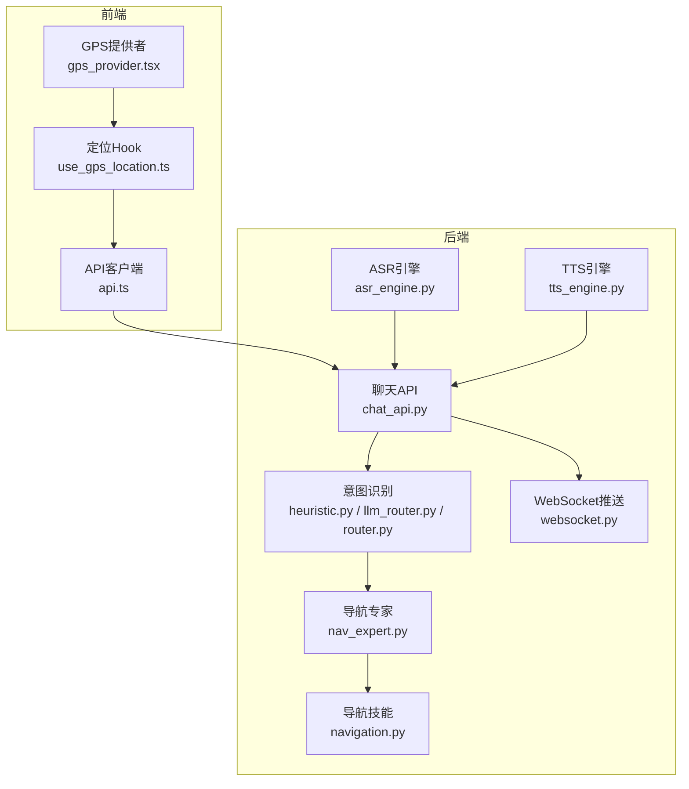
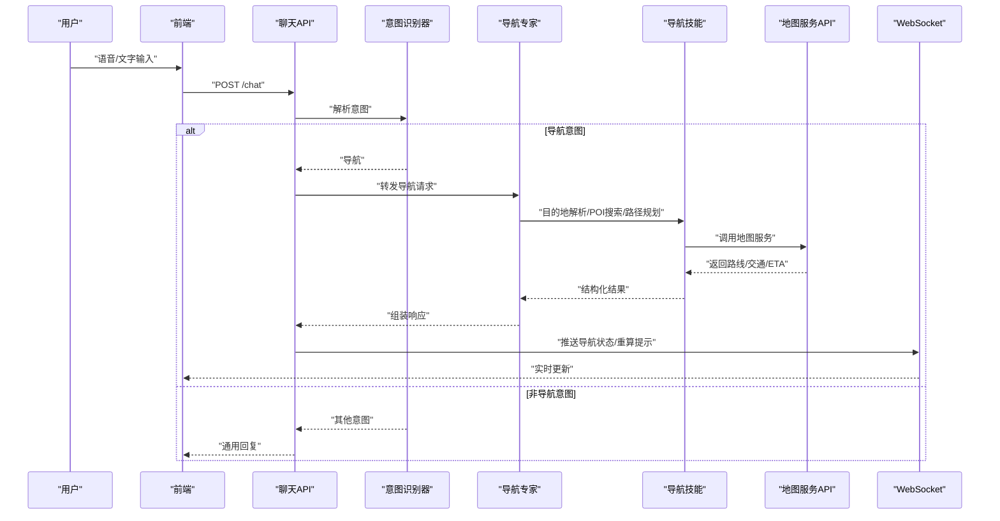
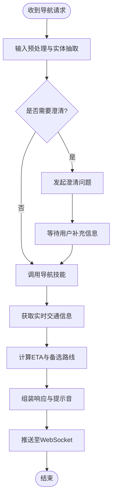
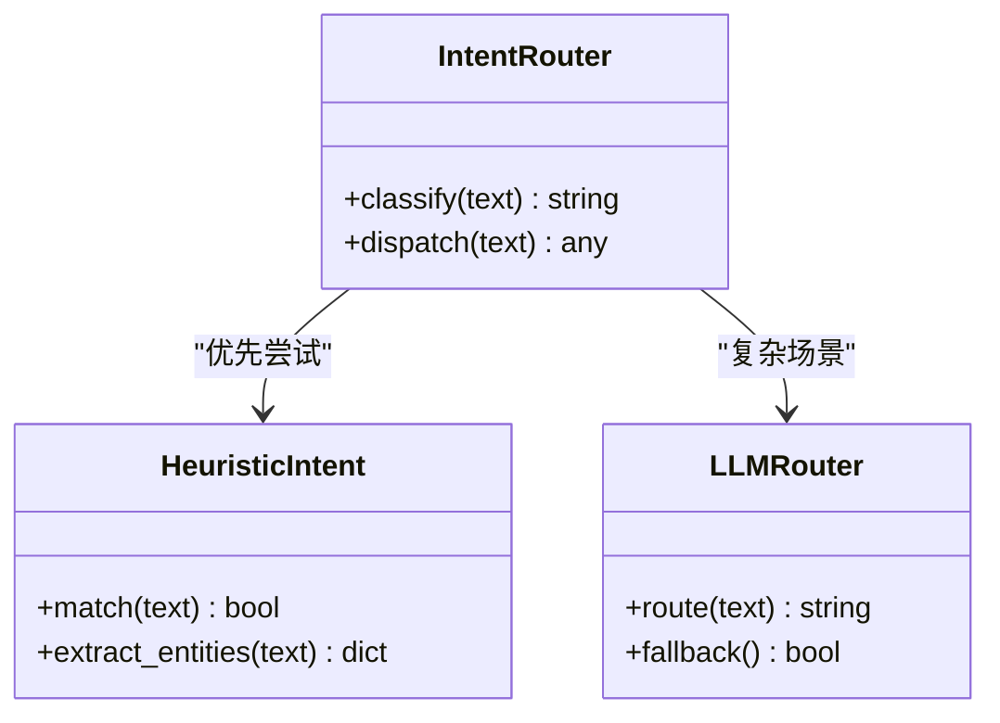
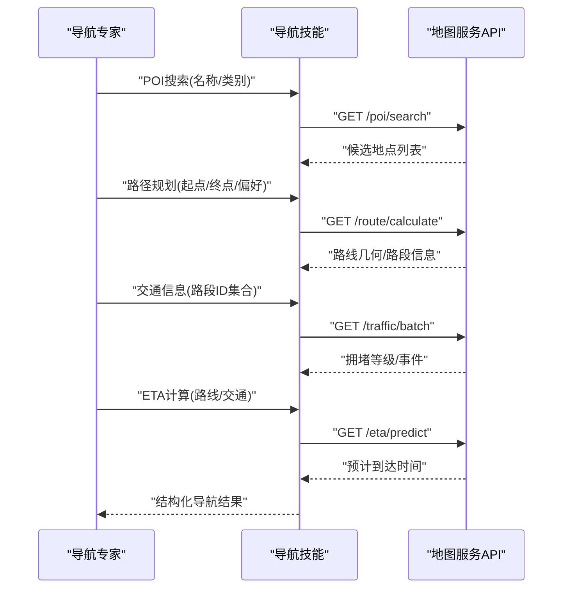
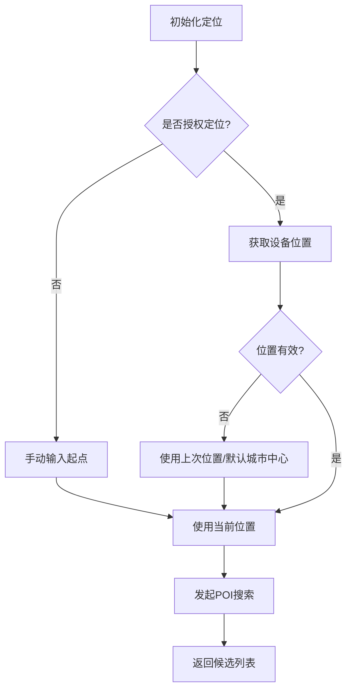
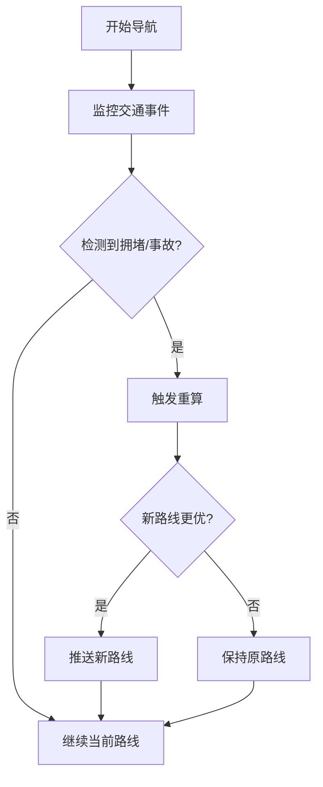
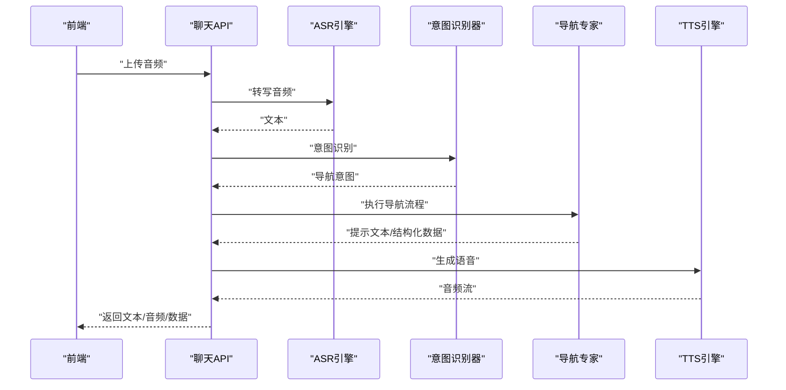
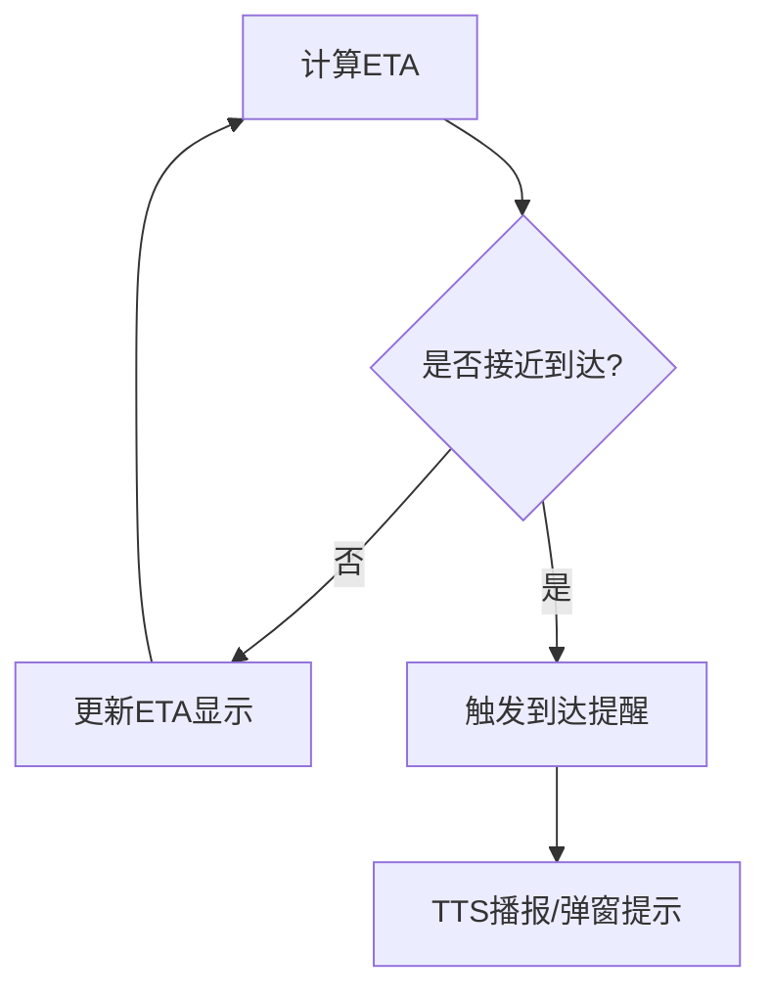
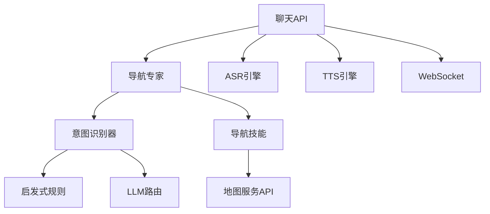

# 导航专家

<cite>
**本文引用的文件**   
- [nav_expert.py](file://backend_design/nexus/agent/experts/nav_expert.py)
- [heuristic.py](file://backend_design/nexus/intent/heuristic.py)
- [llm_router.py](file://backend_design/nexus/intent/llm_router.py)
- [router.py](file://backend_design/nexus/intent/router.py)
- [navigation.py](file://backend_design/nexus/skills/vehicle/navigation.py)
- [asr_engine.py](file://backend_design/nexus/asr/engine.py)
- [tts_engine.py](file://backend_design/nexus/tts/engine.py)
- [chat_api.py](file://backend_design/nexus/api/routes/chat.py)
- [websocket.py](file://backend_design/nexus/api/websocket.py)
- [gps_provider.tsx](file://frontend_design/src/components/layout/gps-provider.tsx)
- [use_gps_location.ts](file://frontend_design/src/hooks/use-gps-location.ts)
- [api.ts](file://frontend_design/src/lib/api.ts)
</cite>

## 目录
1. [简介](#简介)
2. [项目结构](#项目结构)
3. [核心组件](#核心组件)
4. [架构总览](#架构总览)
5. [详细组件分析](#详细组件分析)
6. [依赖关系分析](#依赖关系分析)
7. [性能考量](#性能考量)
8. [故障排查指南](#故障排查指南)
9. [结论](#结论)
10. [附录](#附录)

## 简介
本文件为“导航专家（NavExpert）”的功能文档，聚焦于导航意图识别、目的地解析、路线规划、交通信息获取、POI搜索与路径优化、地图服务API集成、实时交通数据处理与动态路线调整、多模态交互（语音/文字/图形界面）、ETA计算与到达提醒等能力。文档同时提供API调用示例与复杂场景处理方案，帮助开发者快速理解并扩展导航功能。

## 项目结构
导航相关代码主要分布在以下模块：
- 智能体专家层：导航专家实现与调度
- 意图识别层：启发式规则与大模型路由
- 技能层：车辆导航技能封装
- ASR/TTS：语音输入输出引擎
- API网关：聊天接口与WebSocket推送
- 前端：GPS定位、语音录制、TTS播放与UI展示

图表来源
- [nav_expert.py](file://backend_design/nexus/agent/experts/nav_expert.py)
- [heuristic.py](file://backend_design/nexus/intent/heuristic.py)
- [llm_router.py](file://backend_design/nexus/intent/llm_router.py)
- [router.py](file://backend_design/nexus/intent/router.py)
- [navigation.py](file://backend_design/nexus/skills/vehicle/navigation.py)
- [asr_engine.py](file://backend_design/nexus/asr/engine.py)
- [tts_engine.py](file://backend_design/nexus/tts/engine.py)
- [chat_api.py](file://backend_design/nexus/api/routes/chat.py)
- [websocket.py](file://backend_design/nexus/api/websocket.py)
- [gps_provider.tsx](file://frontend_design/src/components/layout/gps-provider.tsx)
- [use_gps_location.ts](file://frontend_design/src/hooks/use-gps-location.ts)
- [api.ts](file://frontend_design/src/lib/api.ts)

章节来源
- [nav_expert.py](file://backend_design/nexus/agent/experts/nav_expert.py)
- [heuristic.py](file://backend_design/nexus/intent/heuristic.py)
- [llm_router.py](file://backend_design/nexus/intent/llm_router.py)
- [router.py](file://backend_design/nexus/intent/router.py)
- [navigation.py](file://backend_design/nexus/skills/vehicle/navigation.py)
- [asr_engine.py](file://backend_design/nexus/asr/engine.py)
- [tts_engine.py](file://backend_design/nexus/tts/engine.py)
- [chat_api.py](file://backend_design/nexus/api/routes/chat.py)
- [websocket.py](file://backend_design/nexus/api/websocket.py)
- [gps_provider.tsx](file://frontend_design/src/components/layout/gps-provider.tsx)
- [use_gps_location.ts](file://frontend_design/src/hooks/use-gps-location.ts)
- [api.ts](file://frontend_design/src/lib/api.ts)

## 核心组件
- 导航专家（NavExpert）
  - 职责：接收用户导航请求，进行意图识别、参数抽取、调用导航技能、生成响应与提示音。
  - 关键流程：输入预处理 → 意图识别 → 目的地解析 → 路线规划 → 交通信息 → ETA计算 → 结果组装 → 多模态输出。
- 意图识别器
  - 启发式规则：基于关键词与模板匹配快速判定导航意图。
  - LLM路由：在复杂或模糊场景下交由大模型进行语义理解与决策。
  - 路由器：统一入口，协调启发式与LLM策略。
- 导航技能（Vehicle Navigation）
  - 职责：封装地图服务API调用（POI搜索、路径规划、交通数据、ETA），返回结构化结果。
- ASR/TTS
  - ASR：将语音转为文本供意图识别使用。
  - TTS：将导航提示文本转换为语音播报。
- API与WebSocket
  - 聊天API：暴露REST接口，承载导航对话与指令。
  - WebSocket：用于实时推送导航状态、重算提示、拥堵预警等。
- 前端定位与交互
  - GPS提供者与Hook：获取设备位置，驱动导航起点与轨迹显示。
  - API客户端：发起导航相关请求，消费WebSocket事件。

章节来源
- [nav_expert.py](file://backend_design/nexus/agent/experts/nav_expert.py)
- [heuristic.py](file://backend_design/nexus/intent/heuristic.py)
- [llm_router.py](file://backend_design/nexus/intent/llm_router.py)
- [router.py](file://backend_design/nexus/intent/router.py)
- [navigation.py](file://backend_design/nexus/skills/vehicle/navigation.py)
- [asr_engine.py](file://backend_design/nexus/asr/engine.py)
- [tts_engine.py](file://backend_design/nexus/tts/engine.py)
- [chat_api.py](file://backend_design/nexus/api/routes/chat.py)
- [websocket.py](file://backend_design/nexus/api/websocket.py)
- [gps_provider.tsx](file://frontend_design/src/components/layout/gps-provider.tsx)
- [use_gps_location.ts](file://frontend_design/src/hooks/use-gps-location.ts)
- [api.ts](file://frontend_design/src/lib/api.ts)

## 架构总览
导航系统采用“专家+技能+意图识别”的分层架构。用户通过前端或API进入聊天接口，由意图识别器判断是否为导航意图；若是，则交由导航专家编排导航技能完成具体任务，并通过WebSocket向前端推送实时状态。

图表来源
- [chat_api.py](file://backend_design/nexus/api/routes/chat.py)
- [heuristic.py](file://backend_design/nexus/intent/heuristic.py)
- [llm_router.py](file://backend_design/nexus/intent/llm_router.py)
- [router.py](file://backend_design/nexus/intent/router.py)
- [nav_expert.py](file://backend_design/nexus/agent/experts/nav_expert.py)
- [navigation.py](file://backend_design/nexus/skills/vehicle/navigation.py)
- [websocket.py](file://backend_design/nexus/api/websocket.py)

## 详细组件分析

### 导航专家（NavExpert）
- 功能要点
  - 接收来自聊天接口的导航请求，执行意图确认、参数校验与上下文管理。
  - 调用导航技能完成POI搜索、路径规划、交通信息与ETA计算。
  - 生成多模态响应：文本摘要、语音播报、结构化导航数据（供前端渲染）。
- 关键流程
  - 输入预处理：清洗文本、提取实体（目的地、偏好、时间窗口）。
  - 意图确认：必要时发起澄清问题，避免歧义。
  - 结果编排：合并路线、交通、ETA，形成最终建议。
  - 输出分发：写入WebSocket流，触发TTS播报。

图表来源
- [nav_expert.py](file://backend_design/nexus/agent/experts/nav_expert.py)
- [navigation.py](file://backend_design/nexus/skills/vehicle/navigation.py)
- [websocket.py](file://backend_design/nexus/api/websocket.py)

章节来源
- [nav_expert.py](file://backend_design/nexus/agent/experts/nav_expert.py)
- [navigation.py](file://backend_design/nexus/skills/vehicle/navigation.py)
- [websocket.py](file://backend_design/nexus/api/websocket.py)

### 意图识别算法
- 启发式规则
  - 基于关键词与模板匹配快速判定导航意图，适用于常见表达与明确目的地。
  - 优点：低延迟、高准确率；缺点：对长尾表达支持有限。
- LLM路由
  - 在复杂或模糊场景下，将自然语言交由大模型进行语义理解与决策。
  - 优点：泛化能力强；缺点：延迟较高、成本更高。
- 路由器
  - 统一入口，根据置信度与复杂度选择启发式或LLM策略，必要时回退。

图表来源
- [heuristic.py](file://backend_design/nexus/intent/heuristic.py)
- [llm_router.py](file://backend_design/nexus/intent/llm_router.py)
- [router.py](file://backend_design/nexus/intent/router.py)

章节来源
- [heuristic.py](file://backend_design/nexus/intent/heuristic.py)
- [llm_router.py](file://backend_design/nexus/intent/llm_router.py)
- [router.py](file://backend_design/nexus/intent/router.py)

### 导航技能（Vehicle Navigation）
- 功能要点
  - POI搜索：按名称/类别/距离筛选地点，返回候选列表与坐标。
  - 路径规划：根据起点、终点、偏好（最快/最短/避开拥堵）生成路线。
  - 交通信息：获取路段拥堵、事故、施工等实时数据。
  - ETA计算：结合历史与实时路况估算到达时间。
- 外部集成
  - 地图服务API：负责地理编码、路径计算、交通数据聚合。
  - 错误处理：超时、限流、无结果时的降级策略（如返回默认路线或提示重试）。

图表来源
- [navigation.py](file://backend_design/nexus/skills/vehicle/navigation.py)

章节来源
- [navigation.py](file://backend_design/nexus/skills/vehicle/navigation.py)

### 地理位置处理与POI搜索
- 设备定位
  - 前端通过GPS Hook获取当前位置，作为导航起点。
  - 定位失败时回退到上次已知位置或手动输入。
- POI搜索
  - 支持按名称、类别、距离排序，返回结构化结果供用户选择。
  - 支持模糊匹配与纠错，提升用户体验。

图表来源
- [use_gps_location.ts](file://frontend_design/src/hooks/use-gps-location.ts)
- [gps_provider.tsx](file://frontend_design/src/components/layout/gps-provider.tsx)
- [navigation.py](file://backend_design/nexus/skills/vehicle/navigation.py)

章节来源
- [use_gps_location.ts](file://frontend_design/src/hooks/use-gps-location.ts)
- [gps_provider.tsx](file://frontend_design/src/components/layout/gps-provider.tsx)
- [navigation.py](file://backend_design/nexus/skills/vehicle/navigation.py)

### 路径优化与动态调整
- 路径优化
  - 考虑多种权重：时间、距离、拥堵、收费、偏好（高速/国道）。
  - 提供多条备选路线，支持用户切换。
- 动态调整
  - 监听实时交通事件，触发重算逻辑。
  - 通过WebSocket推送重算提示与更新后的路线。

图表来源
- [navigation.py](file://backend_design/nexus/skills/vehicle/navigation.py)
- [websocket.py](file://backend_design/nexus/api/websocket.py)

章节来源
- [navigation.py](file://backend_design/nexus/skills/vehicle/navigation.py)
- [websocket.py](file://backend_design/nexus/api/websocket.py)

### 多模态导航支持（语音/文字/图形界面）
- 语音输入（ASR）
  - 前端录音上传，后端ASR引擎转写为文本，进入意图识别。
- 文字交互
  - 聊天API直接处理文本指令，返回结构化导航数据与提示文本。
- 图形界面
  - 前端渲染路线、POI详情、ETA与实时交通图层。
- 语音播报（TTS）
  - 将导航提示文本转换为语音，按节点触发播报。

图表来源
- [asr_engine.py](file://backend_design/nexus/asr/engine.py)
- [tts_engine.py](file://backend_design/nexus/tts/engine.py)
- [chat_api.py](file://backend_design/nexus/api/routes/chat.py)
- [nav_expert.py](file://backend_design/nexus/agent/experts/nav_expert.py)

章节来源
- [asr_engine.py](file://backend_design/nexus/asr/engine.py)
- [tts_engine.py](file://backend_design/nexus/tts/engine.py)
- [chat_api.py](file://backend_design/nexus/api/routes/chat.py)
- [nav_expert.py](file://backend_design/nexus/agent/experts/nav_expert.py)

### ETA计算与到达提醒
- ETA计算
  - 基于路线长度、限速、实时拥堵、历史平均速度预测到达时间。
  - 支持分段ETA与累计ETA展示。
- 到达提醒
  - 当剩余距离/时间低于阈值时触发提醒，可通过TTS与UI弹窗提示。

图表来源
- [navigation.py](file://backend_design/nexus/skills/vehicle/navigation.py)
- [websocket.py](file://backend_design/nexus/api/websocket.py)

章节来源
- [navigation.py](file://backend_design/nexus/skills/vehicle/navigation.py)
- [websocket.py](file://backend_design/nexus/api/websocket.py)

### 地图服务API集成方式
- 集成点
  - POI搜索、路径规划、交通数据、ETA预测。
- 调用约定
  - REST接口，JSON格式请求/响应。
  - 支持分页、过滤、排序参数。
- 错误处理
  - 网络异常：重试与降级。
  - 业务异常：返回空结果或默认值，提示用户修正输入。

章节来源
- [navigation.py](file://backend_design/nexus/skills/vehicle/navigation.py)

### 实时交通数据处理与动态路线调整机制
- 数据采集
  - 从地图服务拉取路段拥堵等级、事件类型、影响范围。
- 处理逻辑
  - 将事件映射到路线路段，评估对ETA的影响。
  - 若影响超过阈值，触发重算并比较新旧路线优劣。
- 推送机制
  - 通过WebSocket向客户端推送重算通知与新路线数据。

章节来源
- [navigation.py](file://backend_design/nexus/skills/vehicle/navigation.py)
- [websocket.py](file://backend_design/nexus/api/websocket.py)

### 导航相关API调用示例与复杂场景处理
- 基本示例
  - 文本导航：发送包含目的地与偏好的消息，返回路线与ETA。
  - 语音导航：上传音频，经ASR转写后进入导航流程。
- 复杂场景
  - 多目的地串联：支持多点路径规划与顺序优化。
  - 模糊目的地：结合POI候选列表与用户确认。
  - 临时改道：基于实时事件动态重算并提示。
- 调用入口
  - 聊天API：统一入口，承载导航指令与结果。
  - WebSocket：实时推送导航状态与重算提示。

章节来源
- [chat_api.py](file://backend_design/nexus/api/routes/chat.py)
- [websocket.py](file://backend_design/nexus/api/websocket.py)
- [navigation.py](file://backend_design/nexus/skills/vehicle/navigation.py)

## 依赖关系分析
导航专家依赖意图识别器与导航技能；意图识别器可组合启发式与LLM路由；导航技能依赖地图服务API；ASR/TTS与WebSocket贯穿前后端交互。

图表来源
- [nav_expert.py](file://backend_design/nexus/agent/experts/nav_expert.py)
- [heuristic.py](file://backend_design/nexus/intent/heuristic.py)
- [llm_router.py](file://backend_design/nexus/intent/llm_router.py)
- [navigation.py](file://backend_design/nexus/skills/vehicle/navigation.py)
- [asr_engine.py](file://backend_design/nexus/asr/engine.py)
- [tts_engine.py](file://backend_design/nexus/tts/engine.py)
- [chat_api.py](file://backend_design/nexus/api/routes/chat.py)
- [websocket.py](file://backend_design/nexus/api/websocket.py)

章节来源
- [nav_expert.py](file://backend_design/nexus/agent/experts/nav_expert.py)
- [heuristic.py](file://backend_design/nexus/intent/heuristic.py)
- [llm_router.py](file://backend_design/nexus/intent/llm_router.py)
- [navigation.py](file://backend_design/nexus/skills/vehicle/navigation.py)
- [asr_engine.py](file://backend_design/nexus/asr/engine.py)
- [tts_engine.py](file://backend_design/nexus/tts/engine.py)
- [chat_api.py](file://backend_design/nexus/api/routes/chat.py)
- [websocket.py](file://backend_design/nexus/api/websocket.py)

## 性能考量
- 意图识别
  - 优先使用启发式规则以降低延迟；仅在置信度不足时启用LLM路由。
- 地图服务调用
  - 批量请求交通数据以减少往返次数；缓存热点POI与常用路线。
- WebSocket推送
  - 控制推送频率，避免频繁重算导致抖动；合并相邻事件减少冗余。
- 前端渲染
  - 增量更新路线与ETA，避免全量重绘；节流定位更新频率。

[本节为通用指导，不直接分析具体文件]

## 故障排查指南
- 常见问题
  - 定位失败：检查权限与设备定位服务；回退到手动输入或上次位置。
  - POI无结果：扩大搜索范围或修正名称；查看地图服务返回码。
  - 路线规划失败：检查起点/终点有效性；尝试简化偏好条件。
  - ETA异常：确认交通数据可用性；检查历史数据与实时数据一致性。
  - 语音交互异常：检查音频格式与采样率；验证ASR/TTS服务状态。
- 调试建议
  - 记录完整请求/响应日志，包括意图识别结果与导航技能调用链。
  - 使用WebSocket事件追踪导航状态变化与重算触发原因。

章节来源
- [chat_api.py](file://backend_design/nexus/api/routes/chat.py)
- [websocket.py](file://backend_design/nexus/api/websocket.py)
- [navigation.py](file://backend_design/nexus/skills/vehicle/navigation.py)

## 结论
导航专家以意图识别为核心，结合导航技能与地图服务API，提供端到端的导航体验。通过多模态交互、实时交通数据处理与动态路线调整，系统在准确性、时效性与用户体验方面具备良好平衡。建议在后续迭代中持续优化意图识别的鲁棒性、地图服务的容错与性能，以及前端的渲染效率与交互流畅度。

[本节为总结，不直接分析具体文件]

## 附录
- 术语表
  - ETA：预计到达时间
  - POI：兴趣点
  - ASR：自动语音识别
  - TTS：文本转语音
- 参考入口
  - 聊天API：用于导航指令与结果交互
  - WebSocket：用于实时导航状态推送

[本节为概念性内容，不直接分析具体文件]