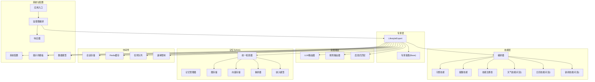
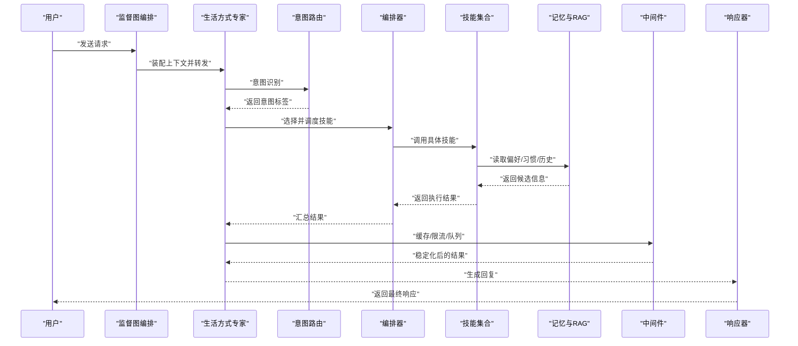
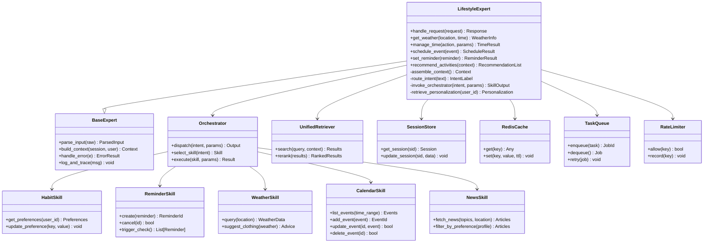
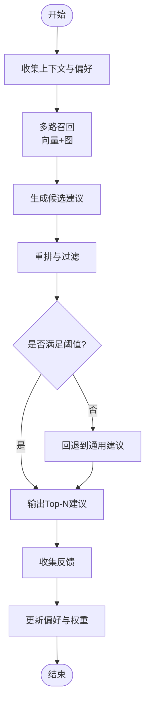
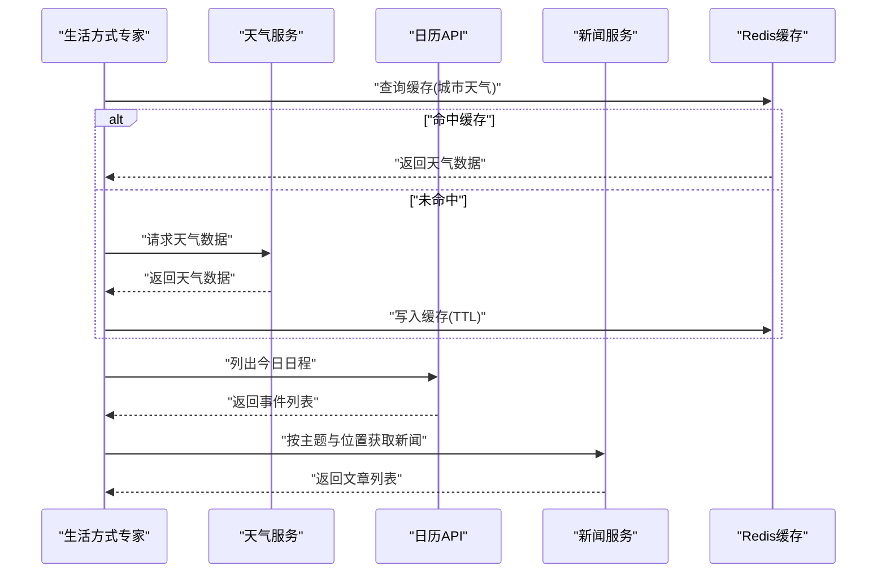
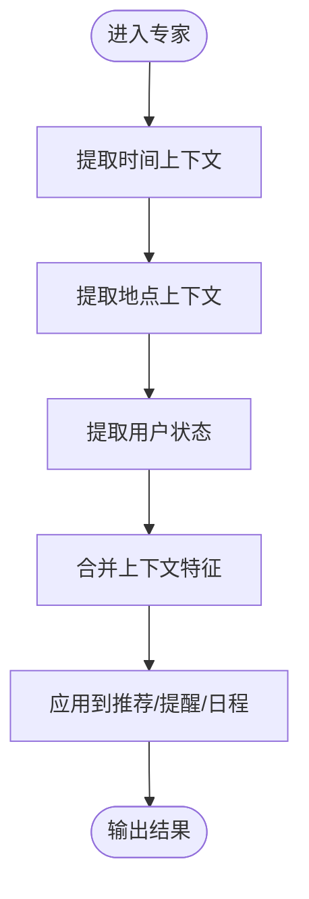
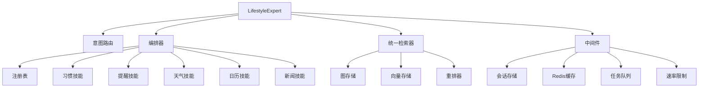

# 生活方式专家

<cite>
**本文引用的文件**   
- [lifestyle_expert.py](file://backend_design/nexus/agent/experts/lifestyle_expert.py)
- [base.py](file://backend_design/nexus/agent/experts/base.py)
- [responder.py](file://backend_design/nexus/agent/responder.py)
- [supervisor_graph.py](file://backend_design/nexus/agent/supervisor_graph.py)
- [personalization.py](file://backend_design/nexus/core/personalization.py)
- [habit.py](file://backend_design/nexus/skills/habit.py)
- [reminder.py](file://backend_design/nexus/skills/reminder.py)
- [orchestrator.py](file://backend_design/nexus/skills/orchestrator.py)
- [registry.py](file://backend_design/nexus/skills/registry.py)
- [chat.md](file://backend_design/nexus/prompts/chat.md)
- [clarification.md](file://backend_design/nexus/prompts/clarification.md)
- [memory_extract.md](file://backend_design/nexus/prompts/memory_extract.md)
- [vehicle.md](file://backend_design/nexus/prompts/vehicle.md)
- [weather.py](file://backend_design/nexus/skills/weather.py)
- [calendar.py](file://backend_design/nexus/skills/calendar.py)
- [news.py](file://backend_design/nexus/skills/news.py)
- [session_store.py](file://backend_design/nexus/middleware/session_store.py)
- [redis_cache.py](file://backend_design/nexus/middleware/redis_cache.py)
- [task_queue.py](file://backend_design/nexus/middleware/task_queue.py)
- [rate_limiter.py](file://backend_design/nexus/middleware/rate_limiter.py)
- [llm_router.py](file://backend_design/nexus/intent/llm_router.py)
- [router.py](file://backend_design/nexus/intent/router.py)
- [heuristic.py](file://backend_design/nexus/intent/heuristic.py)
- [unified_retriever.py](file://backend_design/nexus/rag/unified_retriever.py)
- [graph_store.py](file://backend_design/nexus/rag/graph_store.py)
- [vector_store.py](file://backend_design/nexus/rag/vector_store.py)
- [reranker.py](file://backend_design/nexus/rag/reranker.py)
- [embedding.py](file://backend_design/nexus/rag/embedding.py)
- [schemas.py](file://backend_design/nexus/models/schemas.py)
- [state.py](file://backend_design/nexus/models/state.py)
- [config.py](file://backend_design/nexus/config.py)
- [main.py](file://backend_design/nexus/main.py)
</cite>

## 目录
1. [简介](#简介)
2. [项目结构](#项目结构)
3. [核心组件](#核心组件)
4. [架构总览](#架构总览)
5. [详细组件分析](#详细组件分析)
6. [依赖关系分析](#依赖关系分析)
7. [性能考量](#性能考量)
8. [故障排查指南](#故障排查指南)
9. [结论](#结论)
10. [附录](#附录)

## 简介
本文件面向“生活方式专家（LifestyleExpert）”的功能文档，聚焦生活助手领域的能力边界与实现要点。内容覆盖：
- 能力范围：天气查询、时间管理、日程安排、提醒服务、个性化推荐等
- 个性化推荐算法：基于用户习惯与偏好的智能建议生成
- 外部服务集成：日历API、天气服务、新闻推送
- 上下文感知：时间、地点、用户状态的整合处理
- 对话示例与个性化配置指南

## 项目结构
围绕生活方式专家的相关代码主要分布在以下模块：
- 专家层：lifestyle_expert.py 定义生活方式专家；base.py 提供专家基类
- 意图路由：intent/* 负责意图识别与分发
- 技能层：skills/* 包含习惯、提醒、编排、注册表以及可选的天气、日历、新闻等技能
- 记忆与RAG：memory/*、rag/* 用于偏好/习惯存储与检索增强
- 中间件：middleware/* 提供会话、缓存、任务队列、限流等支撑
- 模型与配置：models/*、config.py、prompts/* 提供数据模型、提示词与系统配置
- 入口与编排：main.py、supervisor_graph.py、responder.py 负责整体流程编排与响应

图表来源
- [lifestyle_expert.py:1-200](file://backend_design/nexus/agent/experts/lifestyle_expert.py#L1-L200)
- [base.py:1-120](file://backend_design/nexus/agent/experts/base.py#L1-L120)
- [llm_router.py:1-120](file://backend_design/nexus/intent/llm_router.py#L1-L120)
- [router.py:1-120](file://backend_design/nexus/intent/router.py#L1-L120)
- [heuristic.py:1-120](file://backend_design/nexus/intent/heuristic.py#L1-L120)
- [habit.py:1-120](file://backend_design/nexus/skills/habit.py#L1-L120)
- [reminder.py:1-120](file://backend_design/nexus/skills/reminder.py#L1-L120)
- [orchestrator.py:1-120](file://backend_design/nexus/skills/orchestrator.py#L1-L120)
- [registry.py:1-120](file://backend_design/nexus/skills/registry.py#L1-L120)
- [weather.py:1-120](file://backend_design/nexus/skills/weather.py#L1-L120)
- [calendar.py:1-120](file://backend_design/nexus/skills/calendar.py#L1-L120)
- [news.py:1-120](file://backend_design/nexus/skills/news.py#L1-L120)
- [unified_retriever.py:1-120](file://backend_design/nexus/rag/unified_retriever.py#L1-L120)
- [graph_store.py:1-120](file://backend_design/nexus/rag/graph_store.py#L1-L120)
- [vector_store.py:1-120](file://backend_design/nexus/rag/vector_store.py#L1-L120)
- [reranker.py:1-120](file://backend_design/nexus/rag/reranker.py#L1-L120)
- [embedding.py:1-120](file://backend_design/nexus/rag/embedding.py#L1-L120)
- [session_store.py:1-120](file://backend_design/nexus/middleware/session_store.py#L1-L120)
- [redis_cache.py:1-120](file://backend_design/nexus/middleware/redis_cache.py#L1-L120)
- [task_queue.py:1-120](file://backend_design/nexus/middleware/task_queue.py#L1-L120)
- [rate_limiter.py:1-120](file://backend_design/nexus/middleware/rate_limiter.py#L1-L120)
- [config.py:1-120](file://backend_design/nexus/config.py#L1-L120)
- [chat.md:1-120](file://backend_design/nexus/prompts/chat.md#L1-L120)
- [clarification.md:1-120](file://backend_design/nexus/prompts/clarification.md#L1-L120)
- [memory_extract.md:1-120](file://backend_design/nexus/prompts/memory_extract.md#L1-L120)
- [vehicle.md:1-120](file://backend_design/nexus/prompts/vehicle.md#L1-L120)
- [schemas.py:1-120](file://backend_design/nexus/models/schemas.py#L1-L120)
- [state.py:1-120](file://backend_design/nexus/models/state.py#L1-L120)
- [main.py:1-120](file://backend_design/nexus/main.py#L1-L120)
- [supervisor_graph.py:1-120](file://backend_design/nexus/agent/supervisor_graph.py#L1-L120)
- [responder.py:1-120](file://backend_design/nexus/agent/responder.py#L1-L120)

章节来源
- [lifestyle_expert.py:1-200](file://backend_design/nexus/agent/experts/lifestyle_expert.py#L1-L200)
- [base.py:1-120](file://backend_design/nexus/agent/experts/base.py#L1-L120)
- [orchestrator.py:1-120](file://backend_design/nexus/skills/orchestrator.py#L1-L120)
- [registry.py:1-120](file://backend_design/nexus/skills/registry.py#L1-L120)
- [unified_retriever.py:1-120](file://backend_design/nexus/rag/unified_retriever.py#L1-L120)
- [session_store.py:1-120](file://backend_design/nexus/middleware/session_store.py#L1-L120)
- [redis_cache.py:1-120](file://backend_design/nexus/middleware/redis_cache.py#L1-L120)
- [task_queue.py:1-120](file://backend_design/nexus/middleware/task_queue.py#L1-L120)
- [rate_limiter.py:1-120](file://backend_design/nexus/middleware/rate_limiter.py#L1-L120)
- [config.py:1-120](file://backend_design/nexus/config.py#L1-L120)
- [chat.md:1-120](file://backend_design/nexus/prompts/chat.md#L1-L120)
- [clarification.md:1-120](file://backend_design/nexus/prompts/clarification.md#L1-L120)
- [memory_extract.md:1-120](file://backend_design/nexus/prompts/memory_extract.md#L1-L120)
- [vehicle.md:1-120](file://backend_design/nexus/prompts/vehicle.md#L1-L120)
- [schemas.py:1-120](file://backend_design/nexus/models/schemas.py#L1-L120)
- [state.py:1-120](file://backend_design/nexus/models/state.py#L1-L120)
- [main.py:1-120](file://backend_design/nexus/main.py#L1-L120)
- [supervisor_graph.py:1-120](file://backend_design/nexus/agent/supervisor_graph.py#L1-L120)
- [responder.py:1-120](file://backend_design/nexus/agent/responder.py#L1-L120)

## 核心组件
- 生活方式专家（LifestyleExpert）
  - 职责：承接用户自然语言请求，结合上下文与记忆，调用意图路由与技能编排，输出个性化回复或执行动作
  - 关键能力：天气查询、时间管理、日程安排、提醒服务、个性化推荐
- 专家基类（Base Expert）
  - 职责：提供统一的输入解析、上下文装配、错误处理、日志记录、重试与降级策略
- 意图路由
  - LLM路由器：基于大模型的语义理解进行意图分类
  - 规则路由器：基于关键词与正则的轻量匹配
  - 启发式匹配：基于历史交互与上下文的快速判定
- 技能编排与注册
  - 编排器：根据意图选择并调度具体技能
  - 注册表：动态发现与加载可用技能
  - 习惯技能：维护用户长期偏好与行为模式
  - 提醒技能：创建、更新、取消提醒，支持定时触发
  - 可选技能：天气、日历、新闻
- 记忆与RAG
  - 统一检索器：聚合图与向量检索结果并重排
  - 图存储：结构化知识（如用户画像、关系图谱）
  - 向量存储：非结构化偏好与历史片段
  - 重排器：对候选结果进行相关性排序
  - 嵌入模型：将文本转为向量表示
- 中间件
  - 会话存储：保存短期对话状态
  - Redis缓存：热点数据与结果缓存
  - 任务队列：异步执行耗时操作（如提醒触发、批量拉取）
  - 速率限制：保护下游服务与系统资源
- 系统与配置
  - 配置中心：集中管理外部服务密钥、超时、重试、开关
  - 提示词模板：聊天、澄清、记忆抽取、车辆相关场景
  - 数据模型：统一的结构化输入输出定义
  - 应用入口与编排：主进程启动、监督图编排、响应组装

章节来源
- [lifestyle_expert.py:1-200](file://backend_design/nexus/agent/experts/lifestyle_expert.py#L1-L200)
- [base.py:1-120](file://backend_design/nexus/agent/experts/base.py#L1-L120)
- [llm_router.py:1-120](file://backend_design/nexus/intent/llm_router.py#L1-L120)
- [router.py:1-120](file://backend_design/nexus/intent/router.py#L1-L120)
- [heuristic.py:1-120](file://backend_design/nexus/intent/heuristic.py#L1-L120)
- [orchestrator.py:1-120](file://backend_design/nexus/skills/orchestrator.py#L1-L120)
- [registry.py:1-120](file://backend_design/nexus/skills/registry.py#L1-L120)
- [habit.py:1-120](file://backend_design/nexus/skills/habit.py#L1-L120)
- [reminder.py:1-120](file://backend_design/nexus/skills/reminder.py#L1-L120)
- [weather.py:1-120](file://backend_design/nexus/skills/weather.py#L1-L120)
- [calendar.py:1-120](file://backend_design/nexus/skills/calendar.py#L1-L120)
- [news.py:1-120](file://backend_design/nexus/skills/news.py#L1-L120)
- [unified_retriever.py:1-120](file://backend_design/nexus/rag/unified_retriever.py#L1-L120)
- [graph_store.py:1-120](file://backend_design/nexus/rag/graph_store.py#L1-L120)
- [vector_store.py:1-120](file://backend_design/nexus/rag/vector_store.py#L1-L120)
- [reranker.py:1-120](file://backend_design/nexus/rag/reranker.py#L1-L120)
- [embedding.py:1-120](file://backend_design/nexus/rag/embedding.py#L1-L120)
- [session_store.py:1-120](file://backend_design/nexus/middleware/session_store.py#L1-L120)
- [redis_cache.py:1-120](file://backend_design/nexus/middleware/redis_cache.py#L1-L120)
- [task_queue.py:1-120](file://backend_design/nexus/middleware/task_queue.py#L1-L120)
- [rate_limiter.py:1-120](file://backend_design/nexus/middleware/rate_limiter.py#L1-L120)
- [config.py:1-120](file://backend_design/nexus/config.py#L1-L120)
- [chat.md:1-120](file://backend_design/nexus/prompts/chat.md#L1-L120)
- [clarification.md:1-120](file://backend_design/nexus/prompts/clarification.md#L1-L120)
- [memory_extract.md:1-120](file://backend_design/nexus/prompts/memory_extract.md#L1-L120)
- [vehicle.md:1-120](file://backend_design/nexus/prompts/vehicle.md#L1-L120)
- [schemas.py:1-120](file://backend_design/nexus/models/schemas.py#L1-L120)
- [state.py:1-120](file://backend_design/nexus/models/state.py#L1-L120)
- [main.py:1-120](file://backend_design/nexus/main.py#L1-L120)
- [supervisor_graph.py:1-120](file://backend_design/nexus/agent/supervisor_graph.py#L1-L120)
- [responder.py:1-120](file://backend_design/nexus/agent/responder.py#L1-L120)

## 架构总览
从端到端视角，生活方式专家的典型调用链如下：
- 用户发起请求
- 监督图编排接收请求，装配上下文（时间、地点、用户状态）
- 意图路由判断领域（天气/时间/日程/提醒/推荐）
- 编排器选择并调用对应技能
- 记忆与RAG为推荐与个性化提供依据
- 中间件保障稳定性与性能
- 响应器组装最终结果返回

图表来源
- [supervisor_graph.py:1-120](file://backend_design/nexus/agent/supervisor_graph.py#L1-L120)
- [lifestyle_expert.py:1-200](file://backend_design/nexus/agent/experts/lifestyle_expert.py#L1-L200)
- [llm_router.py:1-120](file://backend_design/nexus/intent/llm_router.py#L1-L120)
- [router.py:1-120](file://backend_design/nexus/intent/router.py#L1-L120)
- [heuristic.py:1-120](file://backend_design/nexus/intent/heuristic.py#L1-L120)
- [orchestrator.py:1-120](file://backend_design/nexus/skills/orchestrator.py#L1-L120)
- [unified_retriever.py:1-120](file://backend_design/nexus/rag/unified_retriever.py#L1-L120)
- [session_store.py:1-120](file://backend_design/nexus/middleware/session_store.py#L1-L120)
- [redis_cache.py:1-120](file://backend_design/nexus/middleware/redis_cache.py#L1-L120)
- [task_queue.py:1-120](file://backend_design/nexus/middleware/task_queue.py#L1-L120)
- [rate_limiter.py:1-120](file://backend_design/nexus/middleware/rate_limiter.py#L1-L120)
- [responder.py:1-120](file://backend_design/nexus/agent/responder.py#L1-L120)

## 详细组件分析

### 生活方式专家（LifestyleExpert）
- 功能范围
  - 天气查询：获取实时天气、空气质量、穿衣建议
  - 时间管理：当前时间、时区、计时器、倒计时
  - 日程安排：查看今日日程、新增/修改/删除事件
  - 提醒服务：设置一次性/周期性提醒，支持条件触发
  - 个性化推荐：基于习惯与偏好的活动、饮食、运动建议
- 上下文感知
  - 时间：本地时间、工作日/周末、节假日
  - 地点：GPS定位、城市级天气与新闻
  - 用户状态：忙碌、空闲、睡眠、运动中等
- 个性化推荐算法
  - 输入：用户画像、历史行为、近期偏好、环境上下文
  - 过程：检索记忆与RAG -> 候选生成 -> 重排与过滤 -> 输出Top-N建议
  - 反馈：点击/忽略/完成等行为作为强化信号更新偏好权重
- 外部服务集成
  - 天气服务：REST API，支持多源聚合与降级
  - 日历API：读写日程，冲突检测与自动调整
  - 新闻推送：按兴趣与位置订阅，去重与时效性控制
- 错误处理与降级
  - 网络异常：重试与熔断
  - 数据缺失：使用默认值或回退到通用建议
  - 服务不可用：切换备用源或关闭该能力

图表来源
- [lifestyle_expert.py:1-200](file://backend_design/nexus/agent/experts/lifestyle_expert.py#L1-L200)
- [base.py:1-120](file://backend_design/nexus/agent/experts/base.py#L1-L120)
- [orchestrator.py:1-120](file://backend_design/nexus/skills/orchestrator.py#L1-L120)
- [habit.py:1-120](file://backend_design/nexus/skills/habit.py#L1-L120)
- [reminder.py:1-120](file://backend_design/nexus/skills/reminder.py#L1-L120)
- [weather.py:1-120](file://backend_design/nexus/skills/weather.py#L1-L120)
- [calendar.py:1-120](file://backend_design/nexus/skills/calendar.py#L1-L120)
- [news.py:1-120](file://backend_design/nexus/skills/news.py#L1-L120)
- [unified_retriever.py:1-120](file://backend_design/nexus/rag/unified_retriever.py#L1-L120)
- [session_store.py:1-120](file://backend_design/nexus/middleware/session_store.py#L1-L120)
- [redis_cache.py:1-120](file://backend_design/nexus/middleware/redis_cache.py#L1-L120)
- [task_queue.py:1-120](file://backend_design/nexus/middleware/task_queue.py#L1-L120)
- [rate_limiter.py:1-120](file://backend_design/nexus/middleware/rate_limiter.py#L1-L120)

章节来源
- [lifestyle_expert.py:1-200](file://backend_design/nexus/agent/experts/lifestyle_expert.py#L1-L200)
- [base.py:1-120](file://backend_design/nexus/agent/experts/base.py#L1-L120)
- [orchestrator.py:1-120](file://backend_design/nexus/skills/orchestrator.py#L1-L120)
- [habit.py:1-120](file://backend_design/nexus/skills/habit.py#L1-L120)
- [reminder.py:1-120](file://backend_design/nexus/skills/reminder.py#L1-L120)
- [weather.py:1-120](file://backend_design/nexus/skills/weather.py#L1-L120)
- [calendar.py:1-120](file://backend_design/nexus/skills/calendar.py#L1-L120)
- [news.py:1-120](file://backend_design/nexus/skills/news.py#L1-L120)
- [unified_retriever.py:1-120](file://backend_design/nexus/rag/unified_retriever.py#L1-L120)
- [session_store.py:1-120](file://backend_design/nexus/middleware/session_store.py#L1-L120)
- [redis_cache.py:1-120](file://backend_design/nexus/middleware/redis_cache.py#L1-L120)
- [task_queue.py:1-120](file://backend_design/nexus/middleware/task_queue.py#L1-L120)
- [rate_limiter.py:1-120](file://backend_design/nexus/middleware/rate_limiter.py#L1-L120)

### 个性化推荐算法
- 数据源
  - 用户画像：年龄、职业、健康目标、饮食偏好
  - 行为历史：点击、完成、忽略、收藏
  - 上下文：时间、地点、天气、交通状况
- 算法流程
  - 检索：基于向量与图的多路召回
  - 生成：结合提示词模板生成候选建议
  - 重排：基于相关性、多样性、新颖性与业务规则打分
  - 输出：Top-N建议，附带置信度与可解释原因
- 反馈闭环
  - 显式反馈：评分、收藏、分享
  - 隐式反馈：停留时长、二次打开、完成度
  - 在线学习：增量更新偏好权重与兴趣漂移

图表来源
- [unified_retriever.py:1-120](file://backend_design/nexus/rag/unified_retriever.py#L1-L120)
- [graph_store.py:1-120](file://backend_design/nexus/rag/graph_store.py#L1-L120)
- [vector_store.py:1-120](file://backend_design/nexus/rag/vector_store.py#L1-L120)
- [reranker.py:1-120](file://backend_design/nexus/rag/reranker.py#L1-L120)
- [embedding.py:1-120](file://backend_design/nexus/rag/embedding.py#L1-L120)
- [habit.py:1-120](file://backend_design/nexus/skills/habit.py#L1-L120)
- [chat.md:1-120](file://backend_design/nexus/prompts/chat.md#L1-L120)
- [memory_extract.md:1-120](file://backend_design/nexus/prompts/memory_extract.md#L1-L120)

章节来源
- [unified_retriever.py:1-120](file://backend_design/nexus/rag/unified_retriever.py#L1-L120)
- [graph_store.py:1-120](file://backend_design/nexus/rag/graph_store.py#L1-L120)
- [vector_store.py:1-120](file://backend_design/nexus/rag/vector_store.py#L1-L120)
- [reranker.py:1-120](file://backend_design/nexus/rag/reranker.py#L1-L120)
- [embedding.py:1-120](file://backend_design/nexus/rag/embedding.py#L1-L120)
- [habit.py:1-120](file://backend_design/nexus/skills/habit.py#L1-L120)
- [chat.md:1-120](file://backend_design/nexus/prompts/chat.md#L1-L120)
- [memory_extract.md:1-120](file://backend_design/nexus/prompts/memory_extract.md#L1-L120)

### 外部服务集成
- 天气服务
  - 接口：REST API，支持多源聚合
  - 降级：当主源失败时切换到备用源或使用最近缓存
  - 缓存：城市级天气结果短时缓存
- 日历API
  - 能力：列出、新增、更新、删除事件
  - 冲突检测：自动建议调整时间
  - 权限：最小权限原则，按需授权
- 新闻推送
  - 订阅：按主题与地理位置订阅
  - 去重：基于标题与摘要相似度去重
  - 时效性：优先展示新鲜内容

图表来源
- [weather.py:1-120](file://backend_design/nexus/skills/weather.py#L1-L120)
- [calendar.py:1-120](file://backend_design/nexus/skills/calendar.py#L1-L120)
- [news.py:1-120](file://backend_design/nexus/skills/news.py#L1-L120)
- [redis_cache.py:1-120](file://backend_design/nexus/middleware/redis_cache.py#L1-L120)

章节来源
- [weather.py:1-120](file://backend_design/nexus/skills/weather.py#L1-L120)
- [calendar.py:1-120](file://backend_design/nexus/skills/calendar.py#L1-L120)
- [news.py:1-120](file://backend_design/nexus/skills/news.py#L1-L120)
- [redis_cache.py:1-120](file://backend_design/nexus/middleware/redis_cache.py#L1-L120)

### 上下文感知能力
- 时间上下文
  - 本地时间与时区
  - 工作日/周末/节假日标记
  - 时间段划分（早/中/晚）
- 地点上下文
  - GPS坐标与城市映射
  - 区域级天气与新闻
- 用户状态
  - 忙碌/空闲/睡眠/运动
  - 设备电量与网络状态
- 整合处理
  - 在推荐与提醒中加权上下文因子
  - 在日程冲突时考虑用户当前状态

图表来源
- [lifestyle_expert.py:1-200](file://backend_design/nexus/agent/experts/lifestyle_expert.py#L1-L200)
- [state.py:1-120](file://backend_design/nexus/models/state.py#L1-L120)
- [schemas.py:1-120](file://backend_design/nexus/models/schemas.py#L1-L120)

章节来源
- [lifestyle_expert.py:1-200](file://backend_design/nexus/agent/experts/lifestyle_expert.py#L1-L200)
- [state.py:1-120](file://backend_design/nexus/models/state.py#L1-L120)
- [schemas.py:1-120](file://backend_design/nexus/models/schemas.py#L1-L120)

### 对话示例与个性化配置指南
- 对话示例
  - 天气查询：“今天北京天气如何？需要带伞吗？”
  - 时间管理：“帮我设一个下午三点的会议提醒。”
  - 日程安排：“查看我今天的日程，有没有冲突？”
  - 提醒服务：“每周一早上八点提醒我喝水。”
  - 个性化推荐：“根据我的跑步习惯，推荐适合的运动装备。”
- 个性化配置
  - 偏好设置：饮食禁忌、运动类型、工作时段
  - 习惯建模：固定作息、重复行为、目标追踪
  - 上下文开关：是否启用位置感知、是否允许推送
  - 隐私与安全：数据保留周期、共享范围

章节来源
- [chat.md:1-120](file://backend_design/nexus/prompts/chat.md#L1-L120)
- [clarification.md:1-120](file://backend_design/nexus/prompts/clarification.md#L1-L120)
- [memory_extract.md:1-120](file://backend_design/nexus/prompts/memory_extract.md#L1-L120)
- [habit.py:1-120](file://backend_design/nexus/skills/habit.py#L1-L120)

## 依赖关系分析
- 组件耦合
  - 生活方式专家强依赖意图路由与编排器
  - 编排器通过注册表动态发现技能，降低硬编码耦合
  - 记忆与RAG为推荐提供数据基础，独立于具体技能
- 直接依赖
  - 中间件：会话、缓存、队列、限流
  - 外部服务：天气、日历、新闻
- 间接依赖
  - 配置与提示词影响行为与输出质量
  - 模型与状态定义约束数据结构
- 潜在循环依赖
  - 通过注册表与接口抽象避免循环
- 外部依赖与集成点
  - REST API网关
  - 消息队列与缓存集群
  - 向量数据库与图数据库

图表来源
- [lifestyle_expert.py:1-200](file://backend_design/nexus/agent/experts/lifestyle_expert.py#L1-L200)
- [llm_router.py:1-120](file://backend_design/nexus/intent/llm_router.py#L1-L120)
- [router.py:1-120](file://backend_design/nexus/intent/router.py#L1-L120)
- [heuristic.py:1-120](file://backend_design/nexus/intent/heuristic.py#L1-L120)
- [orchestrator.py:1-120](file://backend_design/nexus/skills/orchestrator.py#L1-L120)
- [registry.py:1-120](file://backend_design/nexus/skills/registry.py#L1-L120)
- [habit.py:1-120](file://backend_design/nexus/skills/habit.py#L1-L120)
- [reminder.py:1-120](file://backend_design/nexus/skills/reminder.py#L1-L120)
- [weather.py:1-120](file://backend_design/nexus/skills/weather.py#L1-L120)
- [calendar.py:1-120](file://backend_design/nexus/skills/calendar.py#L1-L120)
- [news.py:1-120](file://backend_design/nexus/skills/news.py#L1-L120)
- [unified_retriever.py:1-120](file://backend_design/nexus/rag/unified_retriever.py#L1-L120)
- [graph_store.py:1-120](file://backend_design/nexus/rag/graph_store.py#L1-L120)
- [vector_store.py:1-120](file://backend_design/nexus/rag/vector_store.py#L1-L120)
- [reranker.py:1-120](file://backend_design/nexus/rag/reranker.py#L1-L120)
- [session_store.py:1-120](file://backend_design/nexus/middleware/session_store.py#L1-L120)
- [redis_cache.py:1-120](file://backend_design/nexus/middleware/redis_cache.py#L1-L120)
- [task_queue.py:1-120](file://backend_design/nexus/middleware/task_queue.py#L1-L120)
- [rate_limiter.py:1-120](file://backend_design/nexus/middleware/rate_limiter.py#L1-L120)

章节来源
- [lifestyle_expert.py:1-200](file://backend_design/nexus/agent/experts/lifestyle_expert.py#L1-L200)
- [llm_router.py:1-120](file://backend_design/nexus/intent/llm_router.py#L1-L120)
- [router.py:1-120](file://backend_design/nexus/intent/router.py#L1-L120)
- [heuristic.py:1-120](file://backend_design/nexus/intent/heuristic.py#L1-L120)
- [orchestrator.py:1-120](file://backend_design/nexus/skills/orchestrator.py#L1-L120)
- [registry.py:1-120](file://backend_design/nexus/skills/registry.py#L1-L120)
- [habit.py:1-120](file://backend_design/nexus/skills/habit.py#L1-L120)
- [reminder.py:1-120](file://backend_design/nexus/skills/reminder.py#L1-L120)
- [weather.py:1-120](file://backend_design/nexus/skills/weather.py#L1-L120)
- [calendar.py:1-120](file://backend_design/nexus/skills/calendar.py#L1-L120)
- [news.py:1-120](file://backend_design/nexus/skills/news.py#L1-L120)
- [unified_retriever.py:1-120](file://backend_design/nexus/rag/unified_retriever.py#L1-L120)
- [graph_store.py:1-120](file://backend_design/nexus/rag/graph_store.py#L1-L120)
- [vector_store.py:1-120](file://backend_design/nexus/rag/vector_store.py#L1-L120)
- [reranker.py:1-120](file://backend_design/nexus/rag/reranker.py#L1-L120)
- [session_store.py:1-120](file://backend_design/nexus/middleware/session_store.py#L1-L120)
- [redis_cache.py:1-120](file://backend_design/nexus/middleware/redis_cache.py#L1-L120)
- [task_queue.py:1-120](file://backend_design/nexus/middleware/task_queue.py#L1-L120)
- [rate_limiter.py:1-120](file://backend_design/nexus/middleware/rate_limiter.py#L1-L120)

## 性能考量
- 缓存策略
  - 天气与新闻结果短时缓存，减少外部调用延迟
  - 用户偏好与习惯常驻缓存，提升推荐速度
- 异步处理
  - 提醒触发与批量拉取走任务队列，避免阻塞主流程
- 限流与熔断
  - 对第三方服务进行限流与熔断，防止雪崩
- 检索优化
  - 向量检索采用近似最近邻与索引优化
  - 重排阶段引入轻量打分模型，平衡精度与延迟
- 资源隔离
  - 不同技能与外部服务使用独立连接池与线程池

## 故障排查指南
- 常见问题
  - 外部服务不可用：检查配置与网络连通性，确认熔断与降级生效
  - 缓存失效：验证Redis连接与TTL设置
  - 任务堆积：监控队列长度与消费者健康状态
  - 限流触发：调整阈值或扩容下游服务
- 诊断步骤
  - 查看日志与链路追踪
  - 检查会话状态与上下文装配
  - 验证意图路由结果与技能选择
  - 核对RAG检索与重排结果
- 恢复策略
  - 切换备用源或关闭非核心能力
  - 清理过期会话与缓存
  - 重启消费者与扩容实例

章节来源
- [redis_cache.py:1-120](file://backend_design/nexus/middleware/redis_cache.py#L1-L120)
- [task_queue.py:1-120](file://backend_design/nexus/middleware/task_queue.py#L1-L120)
- [rate_limiter.py:1-120](file://backend_design/nexus/middleware/rate_limiter.py#L1-L120)
- [unified_retriever.py:1-120](file://backend_design/nexus/rag/unified_retriever.py#L1-L120)
- [responder.py:1-120](file://backend_design/nexus/agent/responder.py#L1-L120)

## 结论
生活方式专家以模块化与可扩展为核心设计，通过意图路由与技能编排实现灵活的能力组合；借助记忆与RAG构建个性化推荐闭环；中间件保障高可用与高性能。未来可在更多外部服务集成、更精细的上下文建模与更强的在线学习方面持续演进。

## 附录
- 配置项建议
  - 外部服务密钥与超时
  - 缓存TTL与容量上限
  - 任务队列并发与重试次数
  - 限流阈值与熔断阈值
- 最佳实践
  - 明确技能边界与错误码
  - 保持提示词版本化与可回溯
  - 建立完善的监控与告警体系