# 车辆控制专家

<cite>
**本文引用的文件**   
- [vehicle_expert.py](file://backend_design/nexus/agent/experts/vehicle_expert.py)
- [base.py](file://backend_design/nexus/agent/experts/base.py)
- [orchestrator.py](file://backend_design/nexus/skills/orchestrator.py)
- [registry.py](file://backend_design/nexus/skills/registry.py)
- [climate.py](file://backend_design/nexus/skills/vehicle/climate.py)
- [seat.py](file://backend_design/nexus/skills/vehicle/seat.py)
- [window.py](file://backend_design/nexus/skills/vehicle/window.py)
- [media.py](file://backend_design/nexus/skills/vehicle/media.py)
- [status.py](file://backend_design/nexus/skills/vehicle/status.py)
- [vehicle/__init__.py](file://backend_design/nexus/vehicle/__init__.py)
- [factory.py](file://backend_design/nexus/vehicle/factory.py)
- [mock.py](file://backend_design/nexus/vehicle/mock.py)
- [http.py](file://backend_design/nexus/vehicle/http.py)
- [mcp.py](file://backend_design/nexus/vehicle/mcp.py)
- [router.py](file://backend_design/nexus/intent/router.py)
- [llm_router.py](file://backend_design/nexus/intent/llm_router.py)
- [heuristic.py](file://backend_design/nexus/intent/heuristic.py)
- [vehicle.md](file://backend_design/nexus/prompts/vehicle.md)
- [exceptions.py](file://backend_design/nexus/core/exceptions.py)
- [circuit_breaker.py](file://backend_design/nexus/core/circuit_breaker.py)
- [auth.py](file://backend_design/nexus/core/auth.py)
- [vehicle.py](file://backend_design/nexus/api/routes/vehicle.py)
</cite>

## 目录
1. [简介](#简介)
2. [项目结构](#项目结构)
3. [核心组件](#核心组件)
4. [架构总览](#架构总览)
5. [详细组件分析](#详细组件分析)
6. [依赖关系分析](#依赖关系分析)
7. [性能与可靠性](#性能与可靠性)
8. [故障排查指南](#故障排查指南)
9. [结论](#结论)
10. [附录：API 与使用示例](#附录api-与使用示例)

## 简介
本文件为“车辆控制专家（VehicleExpert）”的全面功能文档，覆盖意图识别规则、车控技能编排、设备远程控制与安全校验、权限验证与操作确认、错误处理与降级策略，以及与车控适配器（Mock/HTTP/MCP）的交互方式。文档面向车辆控制领域的开发者与集成者，提供从系统架构到代码级实现的深入解析，并给出常见场景的调用示例路径。

## 项目结构
围绕 VehicleExpert 的核心代码分布在以下模块：
- 专家层：负责意图识别、任务编排与结果聚合
- 技能层：按领域拆分空调、座椅、车窗、媒体、状态等能力
- 车控适配层：统一抽象对真实或模拟车控系统的访问（Mock/HTTP/MCP）
- 意图路由层：启发式与 LLM 混合路由，将自然语言指令映射到具体技能
- API 网关：对外暴露 HTTP/WebSocket 接口，承载鉴权、限流与日志

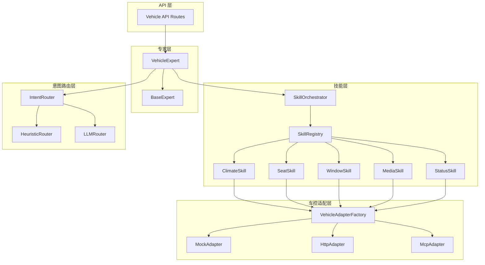

图表来源
- [vehicle_expert.py:1-200](file://backend_design/nexus/agent/experts/vehicle_expert.py#L1-L200)
- [orchestrator.py:1-200](file://backend_design/nexus/skills/orchestrator.py#L1-L200)
- [registry.py:1-200](file://backend_design/nexus/skills/registry.py#L1-L200)
- [factory.py:1-200](file://backend_design/nexus/vehicle/factory.py#L1-L200)
- [router.py:1-200](file://backend_design/nexus/intent/router.py#L1-L200)
- [heuristic.py:1-200](file://backend_design/nexus/intent/heuristic.py#L1-L200)
- [llm_router.py:1-200](file://backend_design/nexus/intent/llm_router.py#L1-L200)
- [vehicle.py:1-200](file://backend_design/nexus/api/routes/vehicle.py#L1-L200)

章节来源
- [vehicle_expert.py:1-200](file://backend_design/nexus/agent/experts/vehicle_expert.py#L1-L200)
- [orchestrator.py:1-200](file://backend_design/nexus/skills/orchestrator.py#L1-L200)
- [registry.py:1-200](file://backend_design/nexus/skills/registry.py#L1-L200)
- [factory.py:1-200](file://backend_design/nexus/vehicle/factory.py#L1-L200)
- [router.py:1-200](file://backend_design/nexus/intent/router.py#L1-L200)
- [heuristic.py:1-200](file://backend_design/nexus/intent/heuristic.py#L1-L200)
- [llm_router.py:1-200](file://backend_design/nexus/intent/llm_router.py#L1-L200)
- [vehicle.py:1-200](file://backend_design/nexus/api/routes/vehicle.py#L1-L200)

## 核心组件
- 车辆控制专家（VehicleExpert）
  - 职责：接收用户意图，进行权限校验、安全审查、执行计划编排、生成反馈；协调各车控技能完成动作。
  - 关键流程：请求进入 → 鉴权与上下文构建 → 意图识别 → 安全检查 → 技能调度 → 执行与回滚 → 结果聚合与反馈。
- 技能编排器（SkillOrchestrator）与注册表（SkillRegistry）
  - 职责：维护可用技能清单、参数校验、执行顺序与并发控制、失败重试与降级。
- 车控适配器工厂（VehicleAdapterFactory）与三类实现
  - Mock：本地仿真，用于开发与联调
  - HTTP：通过 REST/gRPC 调用远端车控服务
  - MCP：基于消息通信协议的车控总线
- 意图路由（IntentRouter + Heuristic + LLMRouter）
  - 职责：将自然语言指令解析为结构化意图，选择目标技能与参数。

章节来源
- [vehicle_expert.py:1-200](file://backend_design/nexus/agent/experts/vehicle_expert.py#L1-L200)
- [orchestrator.py:1-200](file://backend_design/nexus/skills/orchestrator.py#L1-L200)
- [registry.py:1-200](file://backend_design/nexus/skills/registry.py#L1-L200)
- [factory.py:1-200](file://backend_design/nexus/vehicle/factory.py#L1-L200)
- [router.py:1-200](file://backend_design/nexus/intent/router.py#L1-L200)
- [heuristic.py:1-200](file://backend_design/nexus/intent/heuristic.py#L1-L200)
- [llm_router.py:1-200](file://backend_design/nexus/intent/llm_router.py#L1-L200)

## 架构总览
下图展示一次典型“打开车窗”的请求在系统中的流转过程，包括鉴权、意图识别、安全检查、技能执行与反馈生成。

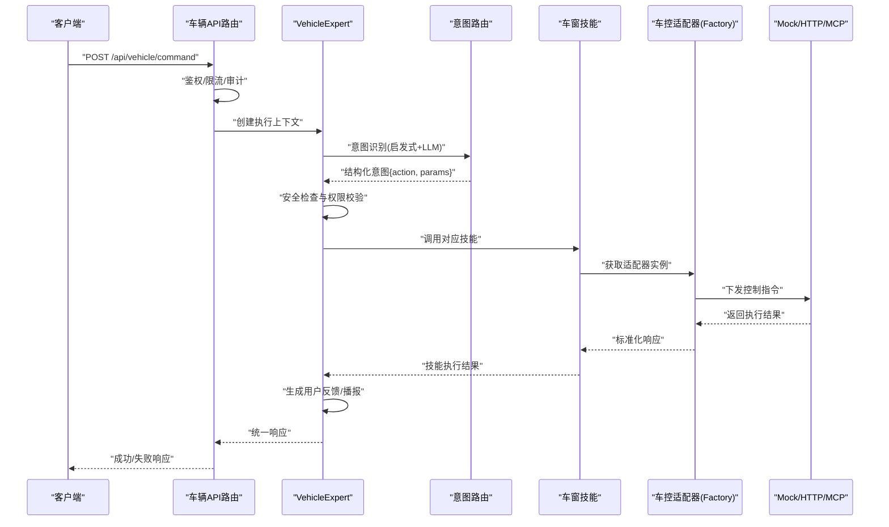

图表来源
- [vehicle.py:1-200](file://backend_design/nexus/api/routes/vehicle.py#L1-L200)
- [vehicle_expert.py:1-200](file://backend_design/nexus/agent/experts/vehicle_expert.py#L1-L200)
- [router.py:1-200](file://backend_design/nexus/intent/router.py#L1-L200)
- [heuristic.py:1-200](file://backend_design/nexus/intent/heuristic.py#L1-L200)
- [llm_router.py:1-200](file://backend_design/nexus/intent/llm_router.py#L1-L200)
- [window.py:1-200](file://backend_design/nexus/skills/vehicle/window.py#L1-L200)
- [factory.py:1-200](file://backend_design/nexus/vehicle/factory.py#L1-L200)
- [mock.py:1-200](file://backend_design/nexus/vehicle/mock.py#L1-L200)
- [http.py:1-200](file://backend_design/nexus/vehicle/http.py#L1-L200)
- [mcp.py:1-200](file://backend_design/nexus/vehicle/mcp.py#L1-L200)

## 详细组件分析

### 车辆控制专家（VehicleExpert）
- 角色定位
  - 作为车控域的统一入口，负责端到端执行链路：鉴权→意图→安全→编排→执行→反馈。
- 关键能力
  - 权限验证：结合用户身份、角色与当前会话上下文，判断是否允许执行敏感操作。
  - 安全检查：对危险操作（如解锁车门、关闭车窗在行驶中）进行二次确认或拒绝。
  - 执行编排：根据意图选择技能，支持串行/并行执行、超时与重试。
  - 反馈生成：将执行结果转化为人类可读的提示或语音播报内容。
- 异常与降级
  - 捕获底层适配器异常，转换为统一业务异常；在不可用时触发降级策略（如仅查询、回退到只读模式）。

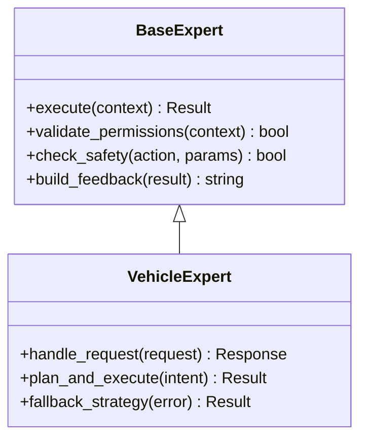

图表来源
- [base.py:1-200](file://backend_design/nexus/agent/experts/base.py#L1-L200)
- [vehicle_expert.py:1-200](file://backend_design/nexus/agent/experts/vehicle_expert.py#L1-L200)

章节来源
- [vehicle_expert.py:1-200](file://backend_design/nexus/agent/experts/vehicle_expert.py#L1-L200)
- [base.py:1-200](file://backend_design/nexus/agent/experts/base.py#L1-L200)

### 意图识别与路由
- 启发式路由（Heuristic）
  - 基于关键词、正则与模板匹配快速识别简单意图，适合高频稳定场景。
- LLM 路由（LLMRouter）
  - 借助大模型进行语义理解与参数抽取，适用于复杂表达与多轮对话。
- 路由策略
  - 优先启发式，命中则直接返回；未命中时走 LLM 路由；两者均失败时返回澄清问题。

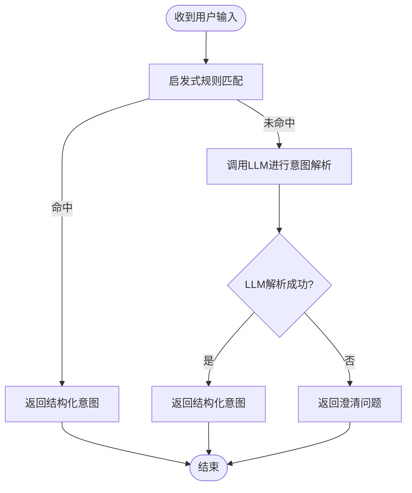

图表来源
- [heuristic.py:1-200](file://backend_design/nexus/intent/heuristic.py#L1-L200)
- [llm_router.py:1-200](file://backend_design/nexus/intent/llm_router.py#L1-L200)
- [router.py:1-200](file://backend_design/nexus/intent/router.py#L1-L200)

章节来源
- [heuristic.py:1-200](file://backend_design/nexus/intent/heuristic.py#L1-L200)
- [llm_router.py:1-200](file://backend_design/nexus/intent/llm_router.py#L1-L200)
- [router.py:1-200](file://backend_design/nexus/intent/router.py#L1-L200)

### 车控技能：空调（Climate）
- 功能范围
  - 温度设定、风量调节、出风模式、自动空调开关、分区控制等。
- 参数校验
  - 温度范围、风量档位、模式枚举合法性检查。
- 安全策略
  - 行驶中限制某些模式切换；儿童锁开启时禁止后排独立控制。
- 执行路径
  - 技能内部调用适配器工厂获取具体适配器，再下发指令。

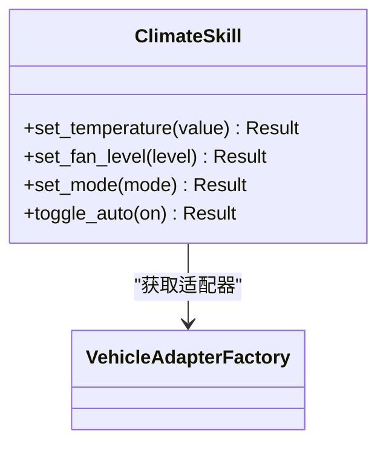

图表来源
- [climate.py:1-200](file://backend_design/nexus/skills/vehicle/climate.py#L1-L200)
- [factory.py:1-200](file://backend_design/nexus/vehicle/factory.py#L1-L200)

章节来源
- [climate.py:1-200](file://backend_design/nexus/skills/vehicle/climate.py#L1-L200)

### 车控技能：座椅（Seat）
- 功能范围
  - 前后移动、靠背角度、腰部支撑、加热/通风、记忆位置调用。
- 参数校验
  - 位置区间、角度范围、设备存在性检查。
- 安全策略
  - 行驶中限制大幅调整；驾驶员侧需二次确认。

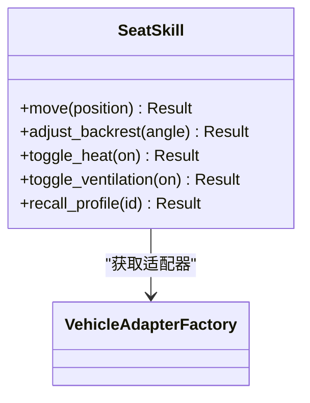

图表来源
- [seat.py:1-200](file://backend_design/nexus/skills/vehicle/seat.py#L1-L200)
- [factory.py:1-200](file://backend_design/nexus/vehicle/factory.py#L1-L200)

章节来源
- [seat.py:1-200](file://backend_design/nexus/skills/vehicle/seat.py#L1-L200)

### 车控技能：车窗（Window）
- 功能范围
  - 单窗/全窗开合、一键升降、防夹保护状态查询。
- 参数校验
  - 开合百分比、速度档位、目标窗口标识。
- 安全策略
  - 行驶中禁止完全降下；检测到障碍物时立即停止。

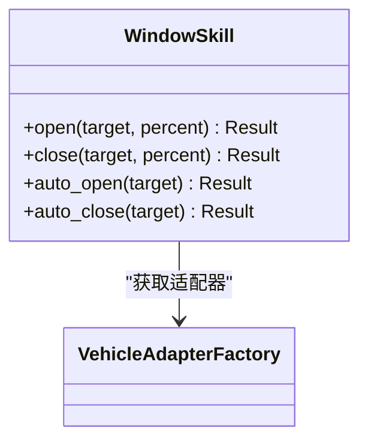

图表来源
- [window.py:1-200](file://backend_design/nexus/skills/vehicle/window.py#L1-L200)
- [factory.py:1-200](file://backend_design/nexus/vehicle/factory.py#L1-L200)

章节来源
- [window.py:1-200](file://backend_design/nexus/skills/vehicle/window.py#L1-L200)

### 车控技能：媒体（Media）
- 功能范围
  - 播放/暂停/下一首/上一首、音量调节、音源切换、歌词显示。
- 参数校验
  - 音量范围、音源类型、曲目ID有效性。
- 安全策略
  - 驾驶模式下限制复杂操作，仅允许基础控制。

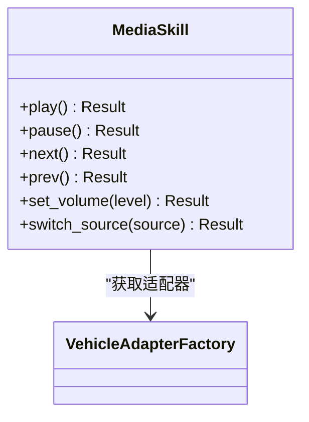

图表来源
- [media.py:1-200](file://backend_design/nexus/skills/vehicle/media.py#L1-L200)
- [factory.py:1-200](file://backend_design/nexus/vehicle/factory.py#L1-L200)

章节来源
- [media.py:1-200](file://backend_design/nexus/skills/vehicle/media.py#L1-L200)

### 车控技能：状态（Status）
- 功能范围
  - 车辆状态查询：电量/油量、胎压、门窗状态、空调运行状态、媒体播放状态等。
- 数据一致性
  - 支持缓存与实时刷新策略，避免频繁拉取造成负载压力。

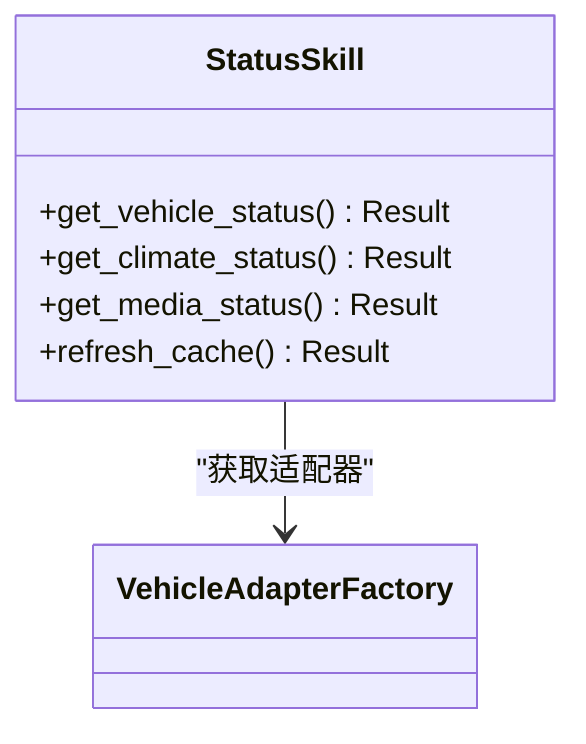

图表来源
- [status.py:1-200](file://backend_design/nexus/skills/vehicle/status.py#L1-L200)
- [factory.py:1-200](file://backend_design/nexus/vehicle/factory.py#L1-L200)

章节来源
- [status.py:1-200](file://backend_design/nexus/skills/vehicle/status.py#L1-L200)

### 车控适配器（Mock/HTTP/MCP）
- 适配器工厂（VehicleAdapterFactory）
  - 根据配置动态选择 Mock/HTTP/MCP 实现，屏蔽底层差异。
- Mock 适配器
  - 提供确定性返回值与随机故障注入，便于测试与演示。
- HTTP 适配器
  - 封装 REST/gRPC 调用，包含重试、熔断与超时控制。
- MCP 适配器
  - 基于消息通道进行异步命令下发与事件上报。

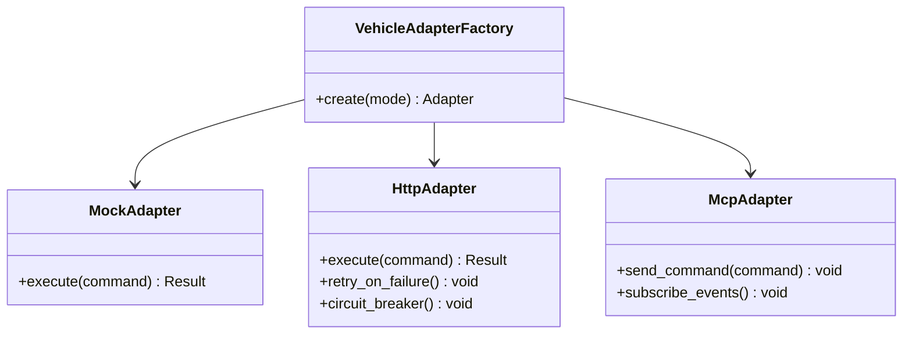

图表来源
- [factory.py:1-200](file://backend_design/nexus/vehicle/factory.py#L1-L200)
- [mock.py:1-200](file://backend_design/nexus/vehicle/mock.py#L1-L200)
- [http.py:1-200](file://backend_design/nexus/vehicle/http.py#L1-L200)
- [mcp.py:1-200](file://backend_design/nexus/vehicle/mcp.py#L1-L200)

章节来源
- [factory.py:1-200](file://backend_design/nexus/vehicle/factory.py#L1-L200)
- [mock.py:1-200](file://backend_design/nexus/vehicle/mock.py#L1-L200)
- [http.py:1-200](file://backend_design/nexus/vehicle/http.py#L1-L200)
- [mcp.py:1-200](file://backend_design/nexus/vehicle/mcp.py#L1-L200)

### 权限验证、操作确认与用户反馈
- 权限验证
  - 基于用户角色与资源边界，判断是否允许执行特定车控操作。
- 操作确认
  - 对高风险操作（如解锁、关闭车窗）要求二次确认或语音复述。
- 反馈生成
  - 将执行结果转为自然语言提示或语音播报，支持多模态输出。

章节来源
- [auth.py:1-200](file://backend_design/nexus/core/auth.py#L1-L200)
- [vehicle_expert.py:1-200](file://backend_design/nexus/agent/experts/vehicle_expert.py#L1-L200)
- [vehicle.md:1-200](file://backend_design/nexus/prompts/vehicle.md#L1-L200)

## 依赖关系分析
- 组件耦合
  - VehicleExpert 强依赖 SkillOrchestrator 与 IntentRouter；技能与适配器通过工厂解耦。
- 外部依赖
  - 网络调用（HTTP）、消息通道（MCP）、大模型服务（LLM）。
- 潜在循环依赖
  - 通过分层与接口抽象避免循环；若出现，应引入事件总线或回调机制。

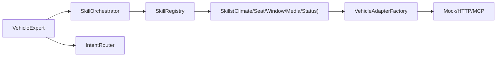

图表来源
- [vehicle_expert.py:1-200](file://backend_design/nexus/agent/experts/vehicle_expert.py#L1-L200)
- [orchestrator.py:1-200](file://backend_design/nexus/skills/orchestrator.py#L1-L200)
- [registry.py:1-200](file://backend_design/nexus/skills/registry.py#L1-L200)
- [factory.py:1-200](file://backend_design/nexus/vehicle/factory.py#L1-L200)

章节来源
- [vehicle_expert.py:1-200](file://backend_design/nexus/agent/experts/vehicle_expert.py#L1-L200)
- [orchestrator.py:1-200](file://backend_design/nexus/skills/orchestrator.py#L1-L200)
- [registry.py:1-200](file://backend_design/nexus/skills/registry.py#L1-L200)
- [factory.py:1-200](file://backend_design/nexus/vehicle/factory.py#L1-L200)

## 性能与可靠性
- 性能优化
  - 意图识别采用启发式优先，减少 LLM 调用开销；状态查询支持缓存与增量更新。
  - 批量操作合并与并行执行，降低端到端延迟。
- 可靠性保障
  - 熔断与重试：HTTP 适配器内置熔断器与指数退避重试。
  - 降级策略：当远端不可用时，回退到只读模式或本地缓存结果。
  - 超时控制：所有外部调用设置合理超时，避免阻塞主线程。

章节来源
- [circuit_breaker.py:1-200](file://backend_design/nexus/core/circuit_breaker.py#L1-L200)
- [http.py:1-200](file://backend_design/nexus/vehicle/http.py#L1-L200)
- [status.py:1-200](file://backend_design/nexus/skills/vehicle/status.py#L1-L200)

## 故障排查指南
- 常见问题
  - 权限不足：检查用户角色与资源边界配置。
  - 意图识别失败：查看启发式规则与 LLM 返回，必要时补充提示词。
  - 适配器连接失败：检查网络连通性与认证凭据，关注熔断器状态。
- 诊断手段
  - 启用调试日志与指标采集；使用 Mock 适配器隔离问题。
  - 针对高危操作增加二次确认与审计记录。

章节来源
- [exceptions.py:1-200](file://backend_design/nexus/core/exceptions.py#L1-200)
- [circuit_breaker.py:1-200](file://backend_design/nexus/core/circuit_breaker.py#L1-200)
- [vehicle.py:1-200](file://backend_design/nexus/api/routes/vehicle.py#L1-200)

## 结论
VehicleExpert 以清晰的层次化设计与可插拔的适配器体系，实现了从自然语言到车控执行的完整闭环。通过启发式与 LLM 混合的意图识别、严格的安全与权限控制、完善的错误处理与降级策略，系统在易用性、安全性与可靠性之间取得良好平衡。建议在生产环境逐步替换 Mock 为 HTTP/MCP，并结合监控与告警提升稳定性。

## 附录：API 与使用示例
- 典型 API 调用
  - 打开车窗：POST /api/vehicle/command，参数包含 action=window_open、target=all、percent=50
  - 设置空调温度：POST /api/vehicle/command，参数包含 action=climate_set_temperature、value=24
  - 查询车辆状态：GET /api/vehicle/status
- 使用场景示例路径
  - 空调控制：[climate.py:1-200](file://backend_design/nexus/skills/vehicle/climate.py#L1-L200)
  - 座椅调节：[seat.py:1-200](file://backend_design/nexus/skills/vehicle/seat.py#L1-L200)
  - 车窗操作：[window.py:1-200](file://backend_design/nexus/skills/vehicle/window.py#L1-L200)
  - 媒体播放：[media.py:1-200](file://backend_design/nexus/skills/vehicle/media.py#L1-L200)
  - 状态查询：[status.py:1-200](file://backend_design/nexus/skills/vehicle/status.py#L1-L200)
  - 意图识别：[heuristic.py:1-200](file://backend_design/nexus/intent/heuristic.py#L1-L200), [llm_router.py:1-200](file://backend_design/nexus/intent/llm_router.py#L1-L200)
  - 权限与安全：[auth.py:1-200](file://backend_design/nexus/core/auth.py#L1-L200), [vehicle_expert.py:1-200](file://backend_design/nexus/agent/experts/vehicle_expert.py#L1-L200)
  - 适配器交互：[factory.py:1-200](file://backend_design/nexus/vehicle/factory.py#L1-L200), [mock.py:1-200](file://backend_design/nexus/vehicle/mock.py#L1-L200), [http.py:1-200](file://backend_design/nexus/vehicle/http.py#L1-L200), [mcp.py:1-200](file://backend_design/nexus/vehicle/mcp.py#L1-L200)