# 闲聊专家

<cite>
**本文引用的文件**   
- [chat_expert.py](file://backend_design/nexus/agent/experts/chat_expert.py)
- [base.py](file://backend_design/nexus/agent/experts/base.py)
- [responder.py](file://backend_design/nexus/agent/responder.py)
- [reviewer.py](file://backend_design/nexus/agent/reviewer.py)
- [supervisor_graph.py](file://backend_design/nexus/agent/supervisor_graph.py)
- [router.py](file://backend_design/nexus/intent/router.py)
- [llm_router.py](file://backend_design/nexus/intent/llm_router.py)
- [heuristic.py](file://backend_design/nexus/intent/heuristic.py)
- [manager.py](file://backend_design/nexus/memory/manager.py)
- [compressor.py](file://backend_design/nexus/memory/compressor.py)
- [conflict.py](file://backend_design/nexus/memory/conflict.py)
- [personalization.py](file://backend_design/nexus/core/personalization.py)
- [chat.md](file://backend_design/nexus/prompts/chat.md)
- [clarification.md](file://backend_design/nexus/prompts/clarification.md)
- [memory_extract.md](file://backend_design/nexus/prompts/memory_extract.md)
- [schemas.py](file://backend_design/nexus/models/schemas.py)
- [state.py](file://backend_design/nexus/models/state.py)
- [chat.py](file://backend_design/nexus/api/routes/chat.py)
- [chat_sessions.py](file://backend_design/nexus/api/routes/chat_sessions.py)
- [session_store.py](file://backend_design/nexus/middleware/session_store.py)
- [rate_limiter.py](file://backend_design/nexus/middleware/rate_limiter.py)
- [redis_cache.py](file://backend_design/nexus/middleware/redis_cache.py)
- [task_queue.py](file://backend_design/nexus/middleware/task_queue.py)
- [config.py](file://backend_design/nexus/config.py)
- [main.py](file://backend_design/nexus/main.py)
</cite>

## 目录
1. [简介](#简介)
2. [项目结构](#项目结构)
3. [核心组件](#核心组件)
4. [架构总览](#架构总览)
5. [详细组件分析](#详细组件分析)
6. [依赖关系分析](#依赖关系分析)
7. [性能考量](#性能考量)
8. [故障排查指南](#故障排查指南)
9. [结论](#结论)
10. [附录](#附录)

## 简介
本文件面向“闲聊专家（ChatExpert）”的对话管理，聚焦闲聊场景下的意图识别、情感与风格适配、记忆与上下文保持、多轮状态管理、个性化学习、质量评估与安全合规等关键能力。文档以代码级视角梳理模块职责、数据流与控制流，并提供可视化图示与最佳实践建议，帮助开发者快速理解并扩展闲聊对话系统。

## 项目结构
围绕闲聊对话的核心路径，主要涉及以下层次：
- 路由与接口层：接收用户输入、会话生命周期管理、WebSocket 推送
- 意图识别层：启发式规则与大模型路由协同，将请求分发到专家或工具
- 专家层：闲聊专家负责幽默、故事讲述、话题引导等自然交互
- 记忆层：对话摘要、冲突消解、压缩与持久化
- 个性化层：偏好学习与风格适配
- 安全审核层：内容审查与降级策略
- 中间件层：限流、缓存、任务队列与会话存储

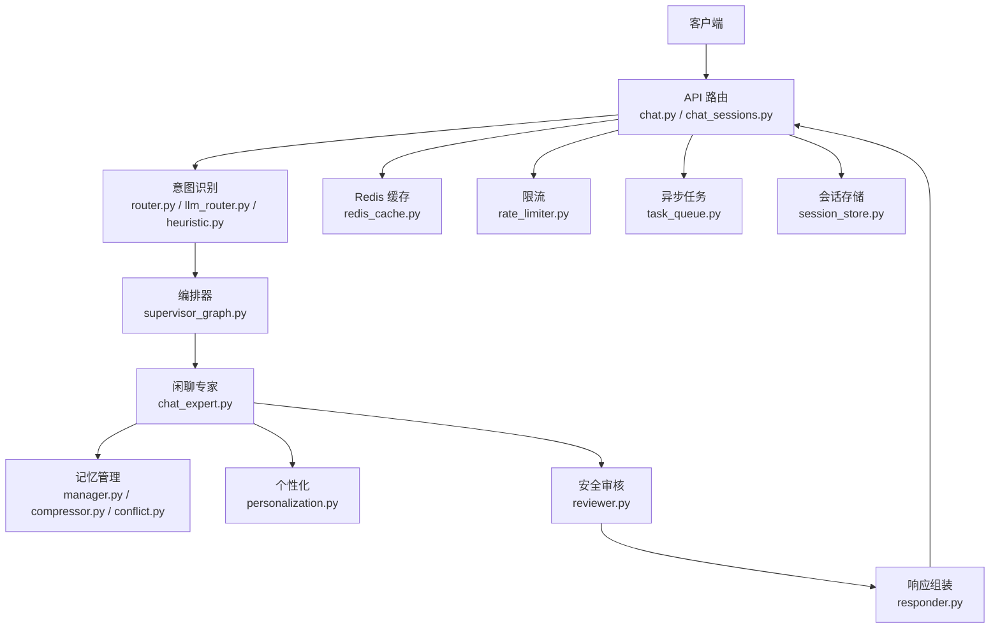

**图表来源**
- [chat.py](file://backend_design/nexus/api/routes/chat.py)
- [chat_sessions.py](file://backend_design/nexus/api/routes/chat_sessions.py)
- [router.py](file://backend_design/nexus/intent/router.py)
- [llm_router.py](file://backend_design/nexus/intent/llm_router.py)
- [heuristic.py](file://backend_design/nexus/intent/heuristic.py)
- [supervisor_graph.py](file://backend_design/nexus/agent/supervisor_graph.py)
- [chat_expert.py](file://backend_design/nexus/agent/experts/chat_expert.py)
- [manager.py](file://backend_design/nexus/memory/manager.py)
- [compressor.py](file://backend_design/nexus/memory/compressor.py)
- [conflict.py](file://backend_design/nexus/memory/conflict.py)
- [personalization.py](file://backend_design/nexus/core/personalization.py)
- [reviewer.py](file://backend_design/nexus/agent/reviewer.py)
- [responder.py](file://backend_design/nexus/agent/responder.py)
- [redis_cache.py](file://backend_design/nexus/middleware/redis_cache.py)
- [rate_limiter.py](file://backend_design/nexus/middleware/rate_limiter.py)
- [task_queue.py](file://backend_design/nexus/middleware/task_queue.py)
- [session_store.py](file://backend_design/nexus/middleware/session_store.py)

**章节来源**
- [main.py:1-200](file://backend_design/nexus/main.py#L1-L200)
- [config.py:1-200](file://backend_design/nexus/config.py#L1-L200)

## 核心组件
- 闲聊专家（ChatExpert）：实现闲聊场景的对话生成，包括幽默回应、故事讲述、话题引导；结合记忆与个性化进行风格与内容定制。
- 意图识别（Intent Router）：通过启发式规则与大模型路由组合，判断是否进入闲聊流程或转交其他专家/工具。
- 编排器（Supervisor Graph）：协调意图识别、专家调用、记忆更新、审核与响应的整体流程。
- 记忆管理（Memory Manager）：维护对话历史、摘要、冲突消解与压缩，保障上下文连贯与资源可控。
- 个性化（Personalization）：基于用户偏好与历史行为调整语气、兴趣点与话题深度。
- 安全审核（Reviewer）：对输出内容进行合规性检查与过滤，必要时触发澄清或降级。
- 响应组装（Responder）：统一封装返回结构，支持文本、结构化数据与事件流。

**章节来源**
- [chat_expert.py:1-300](file://backend_design/nexus/agent/experts/chat_expert.py#L1-L300)
- [base.py:1-200](file://backend_design/nexus/agent/experts/base.py#L1-L200)
- [router.py:1-200](file://backend_design/nexus/intent/router.py#L1-L200)
- [llm_router.py:1-200](file://backend_design/nexus/intent/llm_router.py#L1-L200)
- [heuristic.py:1-200](file://backend_design/nexus/intent/heuristic.py#L1-L200)
- [supervisor_graph.py:1-300](file://backend_design/nexus/agent/supervisor_graph.py#L1-L300)
- [manager.py:1-300](file://backend_design/nexus/memory/manager.py#L1-L300)
- [compressor.py:1-200](file://backend_design/nexus/memory/compressor.py#L1-L200)
- [conflict.py:1-200](file://backend_design/nexus/memory/conflict.py#L1-L200)
- [personalization.py:1-200](file://backend_design/nexus/core/personalization.py#L1-L200)
- [reviewer.py:1-200](file://backend_design/nexus/agent/reviewer.py#L1-L200)
- [responder.py:1-200](file://backend_design/nexus/agent/responder.py#L1-L200)

## 架构总览
闲聊对话的整体流程从接口接入开始，经意图识别分流至闲聊专家，再由编排器驱动记忆更新、个性化注入与安全审核，最终由响应器统一返回。

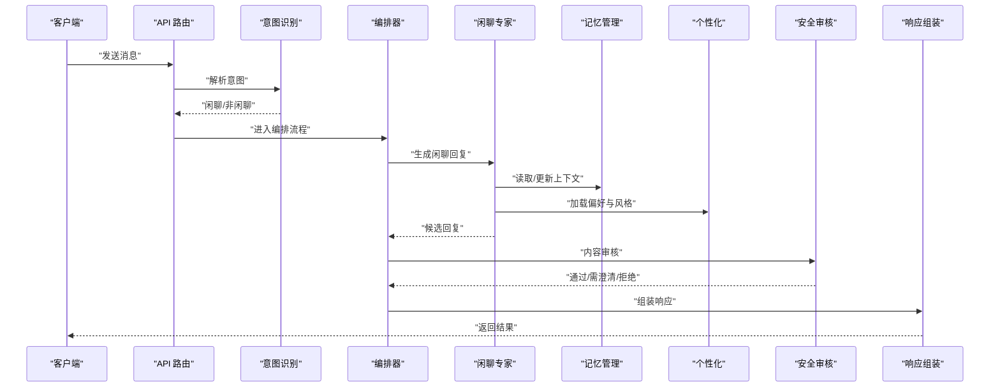

**图表来源**
- [chat.py](file://backend_design/nexus/api/routes/chat.py)
- [router.py](file://backend_design/nexus/intent/router.py)
- [supervisor_graph.py](file://backend_design/nexus/agent/supervisor_graph.py)
- [chat_expert.py](file://backend_design/nexus/agent/experts/chat_expert.py)
- [manager.py](file://backend_design/nexus/memory/manager.py)
- [personalization.py](file://backend_design/nexus/core/personalization.py)
- [reviewer.py](file://backend_design/nexus/agent/reviewer.py)
- [responder.py](file://backend_design/nexus/agent/responder.py)

## 详细组件分析

### 闲聊专家（ChatExpert）
- 职责：在闲聊场景中提供自然、有趣且贴合用户偏好的回复；支持幽默、故事讲述与话题引导。
- 输入：用户消息、会话上下文、个性化配置、记忆摘要。
- 处理：
  - 根据上下文与偏好选择话题方向与表达风格。
  - 调用提示模板组织对话结构与语气。
  - 结合记忆管理器获取相关历史与事实，避免重复与矛盾。
- 输出：候选回复、可选追问、情绪标签与元数据。

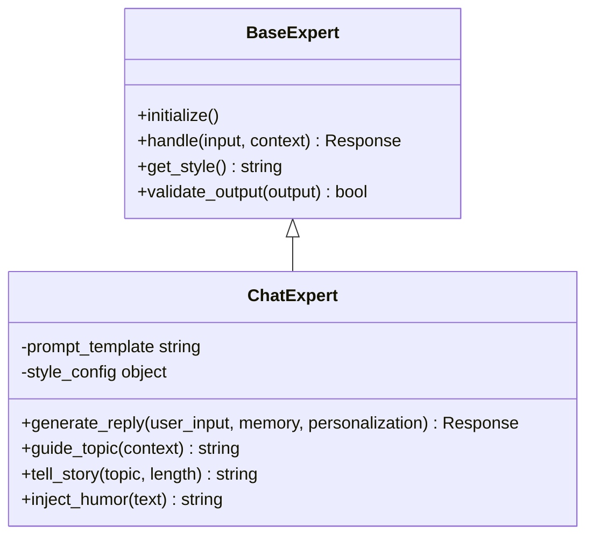

**图表来源**
- [base.py:1-200](file://backend_design/nexus/agent/experts/base.py#L1-L200)
- [chat_expert.py:1-300](file://backend_design/nexus/agent/experts/chat_expert.py#L1-L300)

**章节来源**
- [chat_expert.py:1-300](file://backend_design/nexus/agent/experts/chat_expert.py#L1-L300)
- [base.py:1-200](file://backend_design/nexus/agent/experts/base.py#L1-L200)
- [chat.md:1-200](file://backend_design/nexus/prompts/chat.md#L1-L200)

### 意图识别（Intent Router）
- 目标：区分闲聊与非闲聊请求，决定后续专家或工具链。
- 方法：
  - 启发式规则：关键词、句式模式、领域词表匹配。
  - 大模型路由：基于语义相似度与分类提示，提高泛化能力。
- 输出：意图类别、置信度、路由参数。

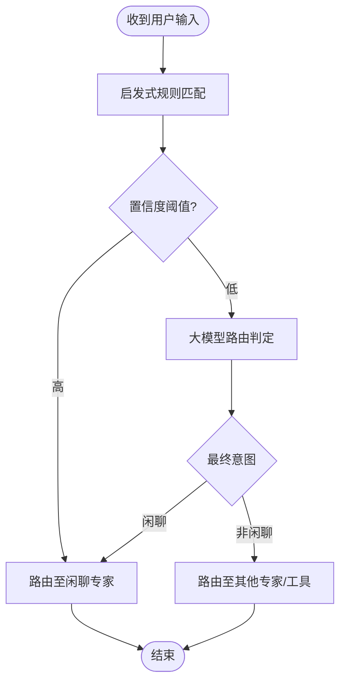

**图表来源**
- [heuristic.py:1-200](file://backend_design/nexus/intent/heuristic.py#L1-L200)
- [llm_router.py:1-200](file://backend_design/nexus/intent/llm_router.py#L1-L200)
- [router.py:1-200](file://backend_design/nexus/intent/router.py#L1-L200)

**章节来源**
- [router.py:1-200](file://backend_design/nexus/intent/router.py#L1-L200)
- [llm_router.py:1-200](file://backend_design/nexus/intent/llm_router.py#L1-L200)
- [heuristic.py:1-200](file://backend_design/nexus/intent/heuristic.py#L1-L200)

### 编排器（Supervisor Graph）
- 职责：串联意图识别、专家调用、记忆更新、审核与响应组装，确保流程一致性与可观测性。
- 关键点：
  - 错误恢复与降级：当某环节失败时回退到默认策略或简化流程。
  - 超时控制：为各阶段设置超时，防止阻塞。
  - 日志与指标：记录关键节点耗时与状态，便于监控与排障。

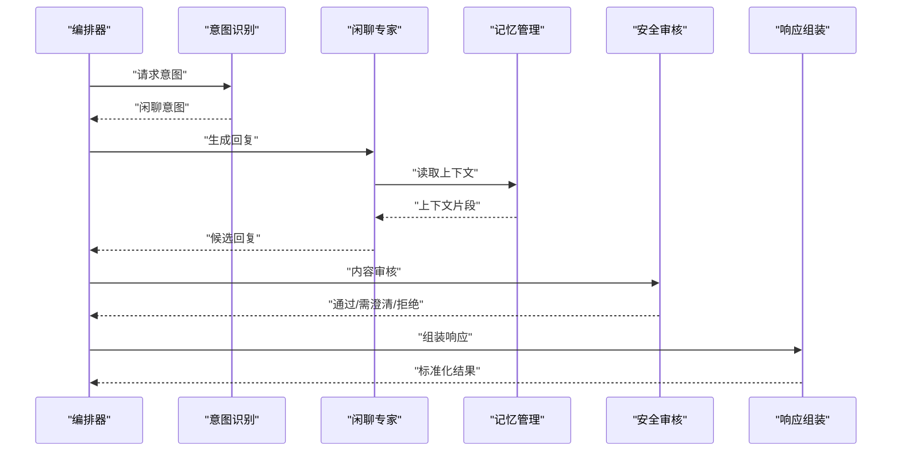

**图表来源**
- [supervisor_graph.py:1-300](file://backend_design/nexus/agent/supervisor_graph.py#L1-L300)
- [reviewer.py:1-200](file://backend_design/nexus/agent/reviewer.py#L1-L200)
- [responder.py:1-200](file://backend_design/nexus/agent/responder.py#L1-L200)

**章节来源**
- [supervisor_graph.py:1-300](file://backend_design/nexus/agent/supervisor_graph.py#L1-L300)

### 记忆管理（Memory Manager）
- 功能：
  - 上下文检索：按时间窗口与主题相关性召回历史片段。
  - 摘要压缩：对长对话进行摘要，降低上下文长度与成本。
  - 冲突消解：检测并调和前后不一致的事实或偏好。
- 数据结构：会话ID、消息序列、摘要向量、偏好快照、时间戳。
- 复杂度：检索通常近似 O(log N) 或 O(1) 取决于索引策略；压缩与冲突消解可能引入额外计算开销。

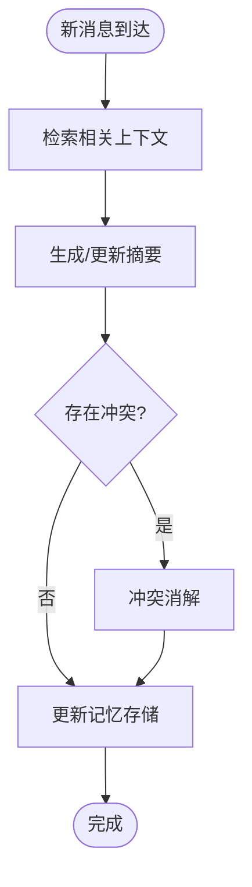

**图表来源**
- [manager.py:1-300](file://backend_design/nexus/memory/manager.py#L1-L300)
- [compressor.py:1-200](file://backend_design/nexus/memory/compressor.py#L1-L200)
- [conflict.py:1-200](file://backend_design/nexus/memory/conflict.py#L1-L200)

**章节来源**
- [manager.py:1-300](file://backend_design/nexus/memory/manager.py#L1-L300)
- [compressor.py:1-200](file://backend_design/nexus/memory/compressor.py#L1-L200)
- [conflict.py:1-200](file://backend_design/nexus/memory/conflict.py#L1-L200)

### 个性化（Personalization）
- 目标：依据用户偏好与历史互动调整语气、兴趣点与话题深度。
- 机制：
  - 偏好学习：从对话中提取兴趣标签、语言风格特征。
  - 风格适配：动态调整正式/轻松程度、幽默密度、故事长度。
  - 反馈闭环：根据用户接受度与继续参与度优化策略。

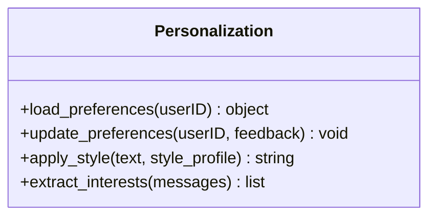

**图表来源**
- [personalization.py:1-200](file://backend_design/nexus/core/personalization.py#L1-L200)

**章节来源**
- [personalization.py:1-200](file://backend_design/nexus/core/personalization.py#L1-L200)

### 安全审核（Reviewer）
- 职责：对闲聊输出进行内容审核，确保适当性与合规性。
- 策略：
  - 规则过滤：敏感词、违规模式拦截。
  - 模型审核：基于分类模型判断风险等级。
  - 降级策略：高风险直接拒绝，中风险触发澄清或替换措辞。

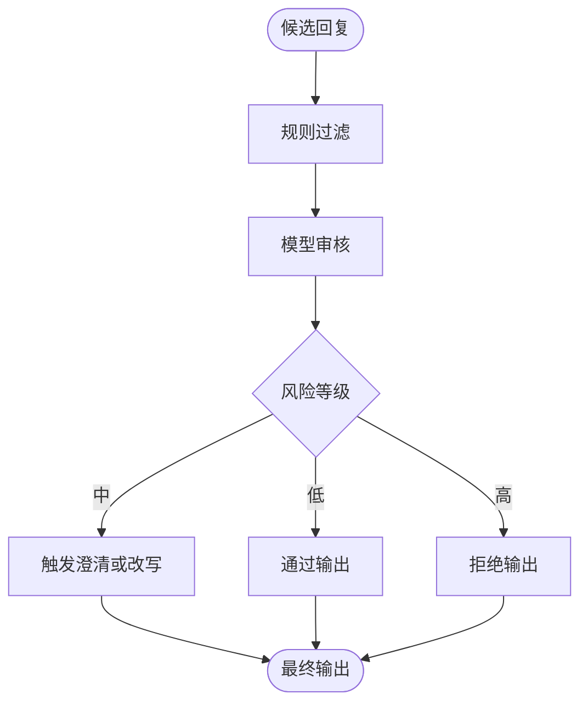

**图表来源**
- [reviewer.py:1-200](file://backend_design/nexus/agent/reviewer.py#L1-L200)

**章节来源**
- [reviewer.py:1-200](file://backend_design/nexus/agent/reviewer.py#L1-L200)

### 响应组装（Responder）
- 职责：统一封装返回结构，包含文本、结构化字段与事件流。
- 特性：
  - 标准化格式：便于前端渲染与下游消费。
  - 可扩展字段：如情绪标签、话题标记、元数据。
  - 流式支持：配合 WebSocket 推送增量内容。

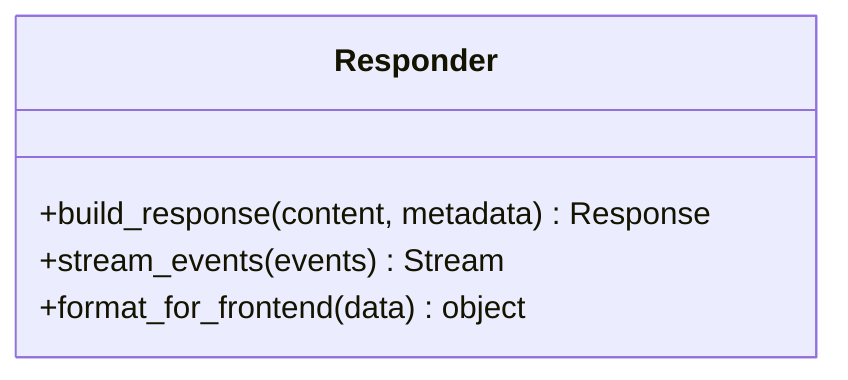

**图表来源**
- [responder.py:1-200](file://backend_design/nexus/agent/responder.py#L1-L200)

**章节来源**
- [responder.py:1-200](file://backend_design/nexus/agent/responder.py#L1-L200)

### 提示模板（Prompts）
- 作用：定义闲聊对话的结构、语气与行为约束，保证一致性。
- 关键模板：
  - 闲聊主模板：组织开场、主体与收尾。
  - 澄清模板：用于不确定或需要更多信息时的提问。
  - 记忆提取模板：指导从对话中抽取事实与偏好。

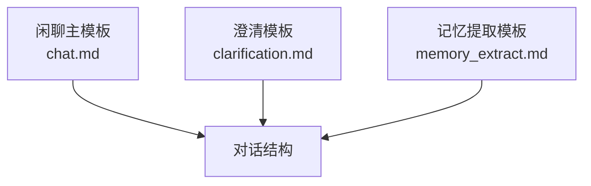

**图表来源**
- [chat.md:1-200](file://backend_design/nexus/prompts/chat.md#L1-L200)
- [clarification.md:1-200](file://backend_design/nexus/prompts/clarification.md#L1-L200)
- [memory_extract.md:1-200](file://backend_design/nexus/prompts/memory_extract.md#L1-L200)

**章节来源**
- [chat.md:1-200](file://backend_design/nexus/prompts/chat.md#L1-L200)
- [clarification.md:1-200](file://backend_design/nexus/prompts/clarification.md#L1-L200)
- [memory_extract.md:1-200](file://backend_design/nexus/prompts/memory_extract.md#L1-L200)

### 数据模型（Schemas & State）
- 用途：定义消息、会话、状态等核心数据结构，确保跨模块一致性。
- 要点：
  - 消息体：角色、内容、时间戳、元数据。
  - 会话状态：当前话题、情绪、偏好快照。
  - 校验规则：必填字段、类型约束、枚举值。

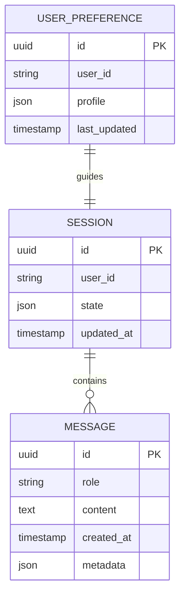

**图表来源**
- [schemas.py:1-200](file://backend_design/nexus/models/schemas.py#L1-L200)
- [state.py:1-200](file://backend_design/nexus/models/state.py#L1-L200)

**章节来源**
- [schemas.py:1-200](file://backend_design/nexus/models/schemas.py#L1-L200)
- [state.py:1-200](file://backend_design/nexus/models/state.py#L1-L200)

### 接口与会话管理（API & Sessions）
- 聊天接口：接收消息、返回响应、支持流式传输。
- 会话管理：创建、查询、清理会话；持久化上下文与偏好。
- 中间件：限流、缓存、任务队列与会话存储支撑高可用。

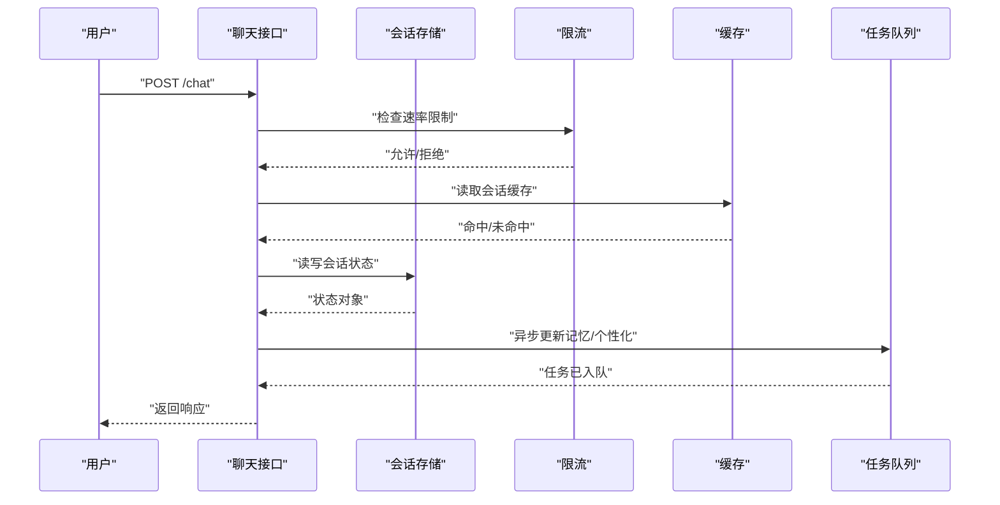

**图表来源**
- [chat.py:1-200](file://backend_design/nexus/api/routes/chat.py#L1-L200)
- [chat_sessions.py:1-200](file://backend_design/nexus/api/routes/chat_sessions.py#L1-L200)
- [session_store.py:1-200](file://backend_design/nexus/middleware/session_store.py#L1-L200)
- [rate_limiter.py:1-200](file://backend_design/nexus/middleware/rate_limiter.py#L1-L200)
- [redis_cache.py:1-200](file://backend_design/nexus/middleware/redis_cache.py#L1-L200)
- [task_queue.py:1-200](file://backend_design/nexus/middleware/task_queue.py#L1-L200)

**章节来源**
- [chat.py:1-200](file://backend_design/nexus/api/routes/chat.py#L1-L200)
- [chat_sessions.py:1-200](file://backend_design/nexus/api/routes/chat_sessions.py#L1-L200)
- [session_store.py:1-200](file://backend_design/nexus/middleware/session_store.py#L1-L200)
- [rate_limiter.py:1-200](file://backend_design/nexus/middleware/rate_limiter.py#L1-L200)
- [redis_cache.py:1-200](file://backend_design/nexus/middleware/redis_cache.py#L1-L200)
- [task_queue.py:1-200](file://backend_design/nexus/middleware/task_queue.py#L1-L200)

## 依赖关系分析
- 组件耦合：
  - 闲聊专家依赖记忆管理与个性化模块，受编排器调度。
  - 意图识别与编排器紧密协作，决定流程分支。
  - 安全审核位于输出前，影响最终可见内容。
- 外部依赖：
  - Redis 缓存与会话存储提升性能与可用性。
  - 任务队列用于异步处理记忆更新与个性化学习。
- 潜在循环依赖：
  - 应避免专家直接调用编排器，采用回调或事件机制解耦。

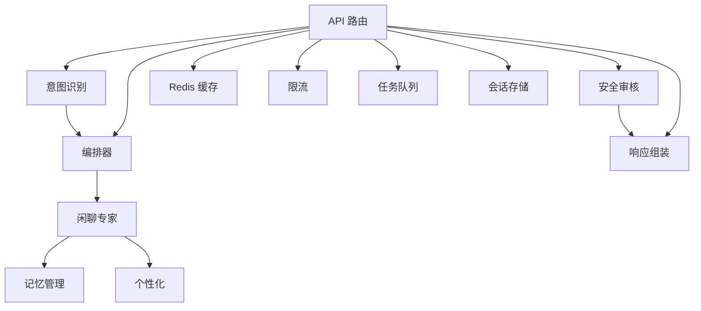

**图表来源**
- [chat_expert.py:1-300](file://backend_design/nexus/agent/experts/chat_expert.py#L1-L300)
- [manager.py:1-300](file://backend_design/nexus/memory/manager.py#L1-L300)
- [personalization.py:1-200](file://backend_design/nexus/core/personalization.py#L1-L200)
- [supervisor_graph.py:1-300](file://backend_design/nexus/agent/supervisor_graph.py#L1-L300)
- [router.py:1-200](file://backend_design/nexus/intent/router.py#L1-L200)
- [reviewer.py:1-200](file://backend_design/nexus/agent/reviewer.py#L1-L200)
- [responder.py:1-200](file://backend_design/nexus/agent/responder.py#L1-L200)
- [chat.py:1-200](file://backend_design/nexus/api/routes/chat.py#L1-L200)
- [redis_cache.py:1-200](file://backend_design/nexus/middleware/redis_cache.py#L1-L200)
- [rate_limiter.py:1-200](file://backend_design/nexus/middleware/rate_limiter.py#L1-L200)
- [task_queue.py:1-200](file://backend_design/nexus/middleware/task_queue.py#L1-L200)
- [session_store.py:1-200](file://backend_design/nexus/middleware/session_store.py#L1-L200)

**章节来源**
- [chat_expert.py:1-300](file://backend_design/nexus/agent/experts/chat_expert.py#L1-L300)
- [supervisor_graph.py:1-300](file://backend_design/nexus/agent/supervisor_graph.py#L1-L300)
- [router.py:1-200](file://backend_design/nexus/intent/router.py#L1-L200)
- [reviewer.py:1-200](file://backend_design/nexus/agent/reviewer.py#L1-L200)
- [responder.py:1-200](file://backend_design/nexus/agent/responder.py#L1-L200)
- [chat.py:1-200](file://backend_design/nexus/api/routes/chat.py#L1-L200)

## 性能考量
- 上下文长度控制：使用记忆压缩与摘要减少 LLM 输入规模，降低延迟与成本。
- 缓存策略：热点会话与常用风格配置缓存于 Redis，提升命中率。
- 异步处理：记忆更新与个性化学习放入任务队列，避免阻塞主流程。
- 限流与熔断：保护后端服务，防止突发流量导致雪崩。
- 流式响应：通过 WebSocket 推送增量内容，改善用户体验。

[本节为通用性能建议，不直接分析具体文件]

## 故障排查指南
- 常见问题：
  - 意图误判：检查启发式规则与大模型路由的阈值与样本覆盖。
  - 上下文丢失：确认会话存储与缓存一致性，检查过期策略。
  - 审核误拦：调整规则与模型阈值，增加白名单与例外处理。
  - 性能瓶颈：观察限流与缓存命中率，评估任务队列积压情况。
- 定位步骤：
  - 查看编排器日志与各阶段耗时。
  - 核对消息与状态模型字段完整性。
  - 验证提示模板变更对输出的影响。

**章节来源**
- [supervisor_graph.py:1-300](file://backend_design/nexus/agent/supervisor_graph.py#L1-L300)
- [schemas.py:1-200](file://backend_design/nexus/models/schemas.py#L1-L200)
- [state.py:1-200](file://backend_design/nexus/models/state.py#L1-L200)
- [rate_limiter.py:1-200](file://backend_design/nexus/middleware/rate_limiter.py#L1-L200)
- [redis_cache.py:1-200](file://backend_design/nexus/middleware/redis_cache.py#L1-L200)
- [task_queue.py:1-200](file://backend_design/nexus/middleware/task_queue.py#L1-L200)

## 结论
闲聊专家通过意图识别、记忆管理、个性化与安全审核的协同，实现了高质量的自然对话体验。建议在持续迭代中关注上下文压缩效率、审核策略平衡与个性化反馈闭环，以提升稳定性与用户满意度。

[本节为总结性内容，不直接分析具体文件]

## 附录
- 自定义对话模板配置指南：
  - 修改闲聊主模板以调整语气与结构。
  - 新增澄清模板以增强不确定性处理能力。
  - 扩展记忆提取模板以捕获更多偏好信号。
- 最佳实践：
  - 控制上下文长度，优先使用摘要与关键片段。
  - 合理设置审核阈值，避免过度保守或宽松。
  - 利用任务队列异步处理重计算，保持主流程轻量。
  - 建立质量评估指标：用户满意度、继续参与率、澄清频率。

[本节为概念性指导，不直接分析具体文件]