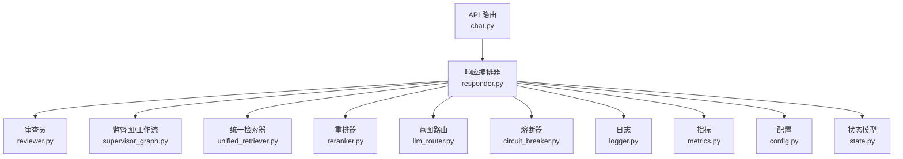
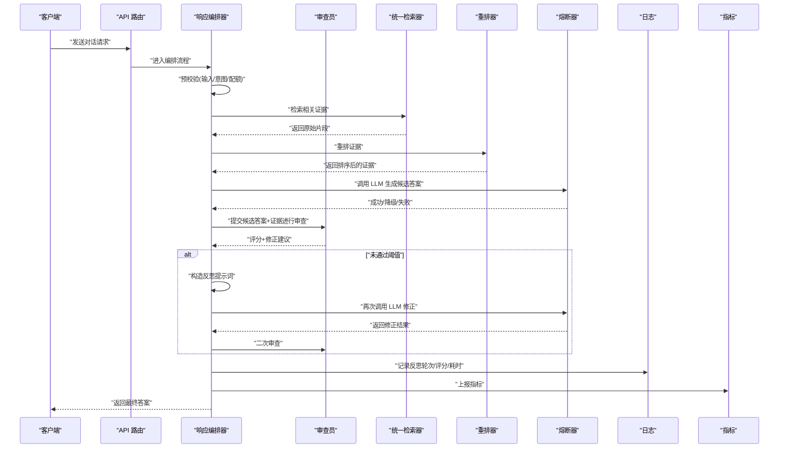
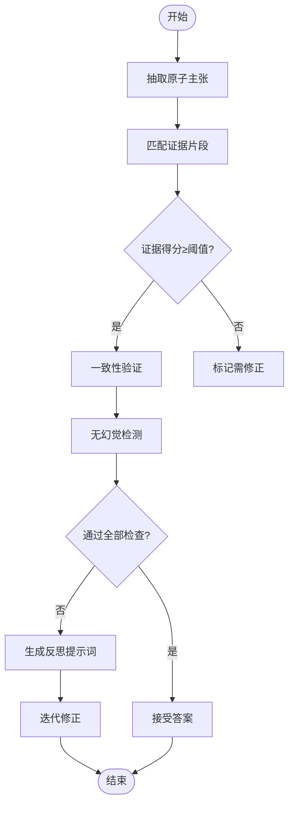
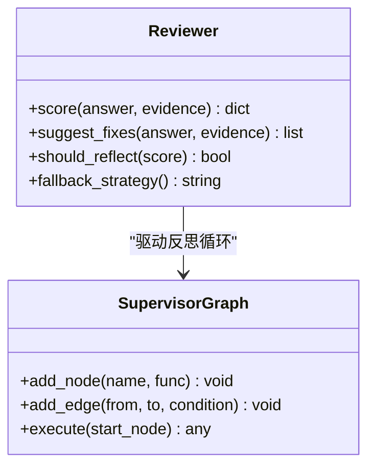
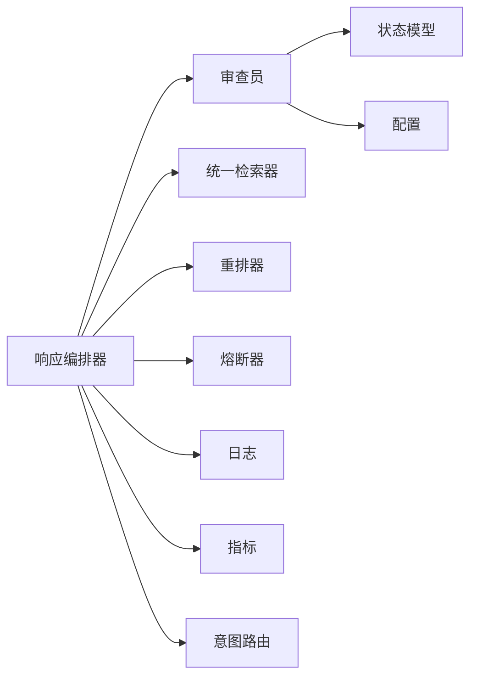

# 反思校验系统

<cite>
**本文引用的文件**   
- [backend_design/nexus/agent/responder.py](file://backend_design/nexus/agent/responder.py)
- [backend_design/nexus/agent/reviewer.py](file://backend_design/nexus/agent/reviewer.py)
- [backend_design/nexus/agent/supervisor_graph.py](file://backend_design/nexus/agent/supervisor_graph.py)
- [backend_design/nexus/core/circuit_breaker.py](file://backend_design/nexus/core/circuit_breaker.py)
- [backend_design/nexus/core/logger.py](file://backend_design/nexus/core/logger.py)
- [backend_design/nexus/config.py](file://backend_design/nexus/config.py)
- [backend_design/nexus/models/state.py](file://backend_design/nexus/models/state.py)
- [backend_design/nexus/observability/metrics.py](file://backend_design/nexus/observability/metrics.py)
- [backend_design/nexus/rag/unified_retriever.py](file://backend_design/nexus/rag/unified_retriever.py)
- [backend_design/nexus/rag/reranker.py](file://backend_design/nexus/rag/reranker.py)
- [backend_design/nexus/intent/llm_router.py](file://backend_design/nexus/intent/llm_router.py)
- [backend_design/nexus/api/routes/chat.py](file://backend_design/nexus/api/routes/chat.py)
- [backend_design/nexus/prompts/chat.md](file://backend_design/nexus/prompts/chat.md)
</cite>

## 目录
1. [简介](#简介)
2. [项目结构](#项目结构)
3. [核心组件](#核心组件)
4. [架构总览](#架构总览)
5. [详细组件分析](#详细组件分析)
6. [依赖关系分析](#依赖关系分析)
7. [性能考量](#性能考量)
8. [故障排查指南](#故障排查指南)
9. [结论](#结论)
10. [附录](#附录)

## 简介
本技术文档面向 NexusCockpit 的“反思校验系统”，系统性阐述四层防御体系的设计理念与实现：预校验、工具合成、反思校验、后校验。重点解析 v2.2 新增的反思机制（事实性检查、一致性验证、无幻觉检测），说明 Tool→LLM 合成的工作原理、结构化数据到自然语言的转换过程与提示词工程技巧，并定义 Reviewer 审查员的职责、质量评分标准与修正建议生成流程。同时提供反思开关配置、性能优化策略与降级处理方案，以及反射提示词示例与错误处理案例。

## 项目结构
与反思校验系统直接相关的代码主要位于 agent、core、models、observability、rag、intent、api 等模块中。整体采用分层与模块化组织方式：
- agent 层：编排响应流程、调用工具、执行反思与审查
- core 层：通用能力（熔断器、日志、配置）
- models 层：状态与数据结构
- observability 层：指标与可观测性
- rag 层：检索与重排，为反思提供外部知识支撑
- intent 层：意图路由，辅助决策
- api 层：对外接口入口

图表来源
- [backend_design/nexus/api/routes/chat.py](file://backend_design/nexus/api/routes/chat.py)
- [backend_design/nexus/agent/responder.py](file://backend_design/nexus/agent/responder.py)
- [backend_design/nexus/agent/reviewer.py](file://backend_design/nexus/agent/reviewer.py)
- [backend_design/nexus/agent/supervisor_graph.py](file://backend_design/nexus/agent/supervisor_graph.py)
- [backend_design/nexus/rag/unified_retriever.py](file://backend_design/nexus/rag/unified_retriever.py)
- [backend_design/nexus/rag/reranker.py](file://backend_design/nexus/rag/reranker.py)
- [backend_design/nexus/intent/llm_router.py](file://backend_design/nexus/intent/llm_router.py)
- [backend_design/nexus/core/circuit_breaker.py](file://backend_design/nexus/core/circuit_breaker.py)
- [backend_design/nexus/core/logger.py](file://backend_design/nexus/core/logger.py)
- [backend_design/nexus/observability/metrics.py](file://backend_design/nexus/observability/metrics.py)
- [backend_design/nexus/config.py](file://backend_design/nexus/config.py)
- [backend_design/nexus/models/state.py](file://backend_design/nexus/models/state.py)

章节来源
- [backend_design/nexus/api/routes/chat.py](file://backend_design/nexus/api/routes/chat.py)
- [backend_design/nexus/agent/responder.py](file://backend_design/nexus/agent/responder.py)
- [backend_design/nexus/agent/reviewer.py](file://backend_design/nexus/agent/reviewer.py)
- [backend_design/nexus/agent/supervisor_graph.py](file://backend_design/nexus/agent/supervisor_graph.py)
- [backend_design/nexus/rag/unified_retriever.py](file://backend_design/nexus/rag/unified_retriever.py)
- [backend_design/nexus/rag/reranker.py](file://backend_design/nexus/rag/reranker.py)
- [backend_design/nexus/intent/llm_router.py](file://backend_design/nexus/intent/llm_router.py)
- [backend_design/nexus/core/circuit_breaker.py](file://backend_design/nexus/core/circuit_breaker.py)
- [backend_design/nexus/core/logger.py](file://backend_design/nexus/core/logger.py)
- [backend_design/nexus/observability/metrics.py](file://backend_design/nexus/observability/metrics.py)
- [backend_design/nexus/config.py](file://backend_design/nexus/config.py)
- [backend_design/nexus/models/state.py](file://backend_design/nexus/models/state.py)

## 核心组件
- 响应编排器（Responser）：负责端到端流程编排，串联预校验、工具调用、反思校验、后校验，并与检索、重排、意图路由协作。
- 审查员（Reviewer）：对候选答案进行质量评估，输出评分与修正建议，驱动反思迭代或回退路径。
- 监督图（Supervisor Graph）：以有向图形式描述节点与边，控制反思循环、分支与终止条件。
- 统一检索器（Unified Retriever）：聚合多源检索结果，为反思提供事实依据。
- 重排器（Reranker）：对检索结果进行相关性排序，提升事实性检查的准确性。
- 熔断器（Circuit Breaker）：在 LLM 或外部服务异常时快速失败与降级。
- 指标与日志：记录关键步骤耗时、成功率、反思轮次、评分分布等。
- 配置与状态：集中管理反思开关、阈值、最大轮次、降级策略；维护会话级状态。

章节来源
- [backend_design/nexus/agent/responder.py](file://backend_design/nexus/agent/responder.py)
- [backend_design/nexus/agent/reviewer.py](file://backend_design/nexus/agent/reviewer.py)
- [backend_design/nexus/agent/supervisor_graph.py](file://backend_design/nexus/agent/supervisor_graph.py)
- [backend_design/nexus/rag/unified_retriever.py](file://backend_design/nexus/rag/unified_retriever.py)
- [backend_design/nexus/rag/reranker.py](file://backend_design/nexus/rag/reranker.py)
- [backend_design/nexus/core/circuit_breaker.py](file://backend_design/nexus/core/circuit_breaker.py)
- [backend_design/nexus/observability/metrics.py](file://backend_design/nexus/observability/metrics.py)
- [backend_design/nexus/core/logger.py](file://backend_design/nexus/core/logger.py)
- [backend_design/nexus/config.py](file://backend_design/nexus/config.py)
- [backend_design/nexus/models/state.py](file://backend_design/nexus/models/state.py)

## 架构总览
四层防御体系贯穿请求生命周期：
- 预校验：输入合法性、敏感信息过滤、意图识别、资源配额检查
- 工具合成：根据意图选择工具集，构造参数，执行工具链
- 反思校验：基于检索与重排的事实证据，结合审查员评分，触发反思循环
- 后校验：输出格式校验、安全合规检查、最终评分与审计

图表来源
- [backend_design/nexus/api/routes/chat.py](file://backend_design/nexus/api/routes/chat.py)
- [backend_design/nexus/agent/responder.py](file://backend_design/nexus/agent/responder.py)
- [backend_design/nexus/agent/reviewer.py](file://backend_design/nexus/agent/reviewer.py)
- [backend_design/nexus/rag/unified_retriever.py](file://backend_design/nexus/rag/unified_retriever.py)
- [backend_design/nexus/rag/reranker.py](file://backend_design/nexus/rag/reranker.py)
- [backend_design/nexus/core/circuit_breaker.py](file://backend_design/nexus/core/circuit_breaker.py)
- [backend_design/nexus/core/logger.py](file://backend_design/nexus/core/logger.py)
- [backend_design/nexus/observability/metrics.py](file://backend_design/nexus/observability/metrics.py)

## 详细组件分析

### 四层防御体系设计与实现
- 预校验
  - 输入清洗与长度限制
  - 敏感字段检测与脱敏
  - 意图分类与路由（轻量规则或 LLM 路由）
  - 配额与速率限制检查
- 工具合成
  - 基于意图选择工具集合
  - 参数模板化与校验
  - 并行/串行执行策略
  - 工具结果结构化归一化
- 反思校验
  - 事实性检查：对比候选答案与检索证据的一致性
  - 一致性验证：跨段落/时间线/实体关系的逻辑自洽
  - 无幻觉检测：识别无证据支持的主张与推断
  - 反思循环：根据审查员建议生成修正提示词，迭代至达标或达到最大轮次
- 后校验
  - 输出格式与类型校验
  - 安全与合规检查（敏感词、越权指令）
  - 最终评分与审计日志

章节来源
- [backend_design/nexus/agent/responder.py](file://backend_design/nexus/agent/responder.py)
- [backend_design/nexus/agent/reviewer.py](file://backend_design/nexus/agent/reviewer.py)
- [backend_design/nexus/rag/unified_retriever.py](file://backend_design/nexus/rag/unified_retriever.py)
- [backend_design/nexus/rag/reranker.py](file://backend_design/nexus/rag/reranker.py)
- [backend_design/nexus/intent/llm_router.py](file://backend_design/nexus/intent/llm_router.py)

### v2.2 反思机制算法实现
- 事实性检查
  - 将候选答案拆解为原子主张
  - 与重排后的证据片段进行匹配打分
  - 低于阈值的声明标记为需修正
- 一致性验证
  - 构建实体-属性-值三元组
  - 检测冲突与矛盾（如时间顺序、数值范围）
  - 使用约束规则与轻量推理进行判定
- 无幻觉检测
  - 统计证据覆盖率与置信度
  - 识别强断言但低证据支持的语句
  - 结合语义相似度与关键词覆盖进行综合判断

图表来源
- [backend_design/nexus/agent/responder.py](file://backend_design/nexus/agent/responder.py)
- [backend_design/nexus/agent/reviewer.py](file://backend_design/nexus/agent/reviewer.py)
- [backend_design/nexus/rag/unified_retriever.py](file://backend_design/nexus/rag/unified_retriever.py)
- [backend_design/nexus/rag/reranker.py](file://backend_design/nexus/rag/reranker.py)

章节来源
- [backend_design/nexus/agent/responder.py](file://backend_design/nexus/agent/responder.py)
- [backend_design/nexus/agent/reviewer.py](file://backend_design/nexus/agent/reviewer.py)
- [backend_design/nexus/rag/unified_retriever.py](file://backend_design/nexus/rag/unified_retriever.py)
- [backend_design/nexus/rag/reranker.py](file://backend_design/nexus/rag/reranker.py)

### Tool→LLM 合成与结构化数据到自然语言转换
- 工具合成原理
  - 意图识别后选择工具集
  - 参数模板填充与校验
  - 工具执行结果标准化为 JSON 结构
- 结构化到自然语言
  - 将 JSON 转换为可读的自然语言摘要
  - 使用提示词模板组织上下文与约束
  - 注入证据片段与评分反馈，引导 LLM 生成更准确的答案
- 提示词工程技巧
  - 明确角色与任务边界
  - 分步推理与自我校验
  - 强制引用证据与标注不确定性
  - 提供负面样例与拒绝策略

章节来源
- [backend_design/nexus/agent/responder.py](file://backend_design/nexus/agent/responder.py)
- [backend_design/nexus/prompts/chat.md](file://backend_design/nexus/prompts/chat.md)

### Reviewer 审查员职责与工作流程
- 职责
  - 对候选答案进行多维评分（事实性、一致性、完整性、安全性）
  - 生成修正建议与反思要点
  - 决定是否需要进入反思循环或回退
- 工作流程
  - 接收候选答案与证据
  - 运行评分规则与启发式检查
  - 输出评分与建议
  - 与监督图协同控制迭代次数与终止条件

图表来源
- [backend_design/nexus/agent/reviewer.py](file://backend_design/nexus/agent/reviewer.py)
- [backend_design/nexus/agent/supervisor_graph.py](file://backend_design/nexus/agent/supervisor_graph.py)

章节来源
- [backend_design/nexus/agent/reviewer.py](file://backend_design/nexus/agent/reviewer.py)
- [backend_design/nexus/agent/supervisor_graph.py](file://backend_design/nexus/agent/supervisor_graph.py)

### 反思开关配置与降级处理
- 反思开关
  - 全局开关：是否启用反思校验
  - 场景开关：按意图或领域开启
  - 阈值配置：评分阈值、最大反思轮次、超时限制
- 降级策略
  - LLM 不可用时回退到规则引擎或缓存答案
  - 检索失败时使用默认知识库或简化回答
  - 熔断器触发时快速失败并记录告警
- 配置位置
  - 集中配置项管理与环境变量注入
  - 运行时动态调整与热更新

章节来源
- [backend_design/nexus/config.py](file://backend_design/nexus/config.py)
- [backend_design/nexus/core/circuit_breaker.py](file://backend_design/nexus/core/circuit_breaker.py)
- [backend_design/nexus/models/state.py](file://backend_design/nexus/models/state.py)

### 具体反射提示词示例与错误处理案例
- 反射提示词示例（路径）
  - 参考提示词模板与组合方式
- 错误处理案例（路径）
  - 检索失败、重排异常、LLM 超时、评分不达标等场景的处理流程

章节来源
- [backend_design/nexus/prompts/chat.md](file://backend_design/nexus/prompts/chat.md)
- [backend_design/nexus/core/logger.py](file://backend_design/nexus/core/logger.py)
- [backend_design/nexus/observability/metrics.py](file://backend_design/nexus/observability/metrics.py)

## 依赖关系分析
- 组件耦合
  - 响应编排器依赖审查员、检索器、重排器、熔断器、日志与指标
  - 审查员依赖状态模型与配置
  - 监督图作为控制平面协调各节点
- 外部依赖
  - LLM 服务（受熔断器保护）
  - 检索与重排服务（可能为本地或远程）
  - 日志与指标后端
- 潜在环依赖
  - 通过事件与回调解耦，避免直接循环导入

图表来源
- [backend_design/nexus/agent/responder.py](file://backend_design/nexus/agent/responder.py)
- [backend_design/nexus/agent/reviewer.py](file://backend_design/nexus/agent/reviewer.py)
- [backend_design/nexus/rag/unified_retriever.py](file://backend_design/nexus/rag/unified_retriever.py)
- [backend_design/nexus/rag/reranker.py](file://backend_design/nexus/rag/reranker.py)
- [backend_design/nexus/core/circuit_breaker.py](file://backend_design/nexus/core/circuit_breaker.py)
- [backend_design/nexus/core/logger.py](file://backend_design/nexus/core/logger.py)
- [backend_design/nexus/observability/metrics.py](file://backend_design/nexus/observability/metrics.py)
- [backend_design/nexus/intent/llm_router.py](file://backend_design/nexus/intent/llm_router.py)
- [backend_design/nexus/config.py](file://backend_design/nexus/config.py)
- [backend_design/nexus/models/state.py](file://backend_design/nexus/models/state.py)

章节来源
- [backend_design/nexus/agent/responder.py](file://backend_design/nexus/agent/responder.py)
- [backend_design/nexus/agent/reviewer.py](file://backend_design/nexus/agent/reviewer.py)
- [backend_design/nexus/rag/unified_retriever.py](file://backend_design/nexus/rag/unified_retriever.py)
- [backend_design/nexus/rag/reranker.py](file://backend_design/nexus/rag/reranker.py)
- [backend_design/nexus/core/circuit_breaker.py](file://backend_design/nexus/core/circuit_breaker.py)
- [backend_design/nexus/core/logger.py](file://backend_design/nexus/core/logger.py)
- [backend_design/nexus/observability/metrics.py](file://backend_design/nexus/observability/metrics.py)
- [backend_design/nexus/intent/llm_router.py](file://backend_design/nexus/intent/llm_router.py)
- [backend_design/nexus/config.py](file://backend_design/nexus/config.py)
- [backend_design/nexus/models/state.py](file://backend_design/nexus/models/state.py)

## 性能考量
- 并发与批处理
  - 工具调用并行化与限流
  - 检索与重排批量处理
- 缓存与复用
  - 常见问题的答案与证据缓存
  - 中间结果与评分缓存
- 资源控制
  - 反思轮次上限与超时控制
  - 大文本截断与摘要压缩
- 监控与调优
  - 关键路径耗时追踪
  - 评分分布与失败原因分析

[本节为通用指导，无需特定文件来源]

## 故障排查指南
- 常见问题定位
  - 检索失败：检查检索器连接与索引状态
  - 重排异常：确认重排器模型加载与输入格式
  - LLM 超时：查看熔断器状态与重试策略
  - 评分不达标：审查日志与反思轮次
- 诊断手段
  - 日志关键字与链路追踪
  - 指标看板与告警规则
  - 回放与复现脚本

章节来源
- [backend_design/nexus/core/logger.py](file://backend_design/nexus/core/logger.py)
- [backend_design/nexus/observability/metrics.py](file://backend_design/nexus/observability/metrics.py)
- [backend_design/nexus/core/circuit_breaker.py](file://backend_design/nexus/core/circuit_breaker.py)

## 结论
NexusCockpit 的反思校验系统通过四层防御体系与 v2.2 反思机制，显著提升了答案的事实性与一致性，降低了幻觉风险。配合审查员评分与监督图控制，系统在稳定性与可解释性方面具备良好表现。通过合理的配置与降级策略，可在复杂环境下保持高可用与高质量输出。

[本节为总结，无需特定文件来源]

## 附录
- 术语表
  - 预校验：请求进入前的合法性与安全检查
  - 工具合成：根据意图组装与执行工具链
  - 反思校验：基于证据与评分的迭代修正
  - 后校验：输出前的最终检查与审计
- 最佳实践
  - 合理设置反思阈值与轮次上限
  - 持续优化提示词模板与证据组织方式
  - 建立完善的监控与告警体系

[本节为补充信息，无需特定文件来源]