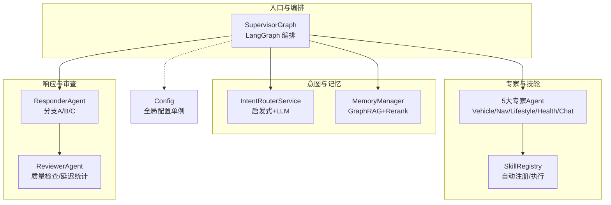
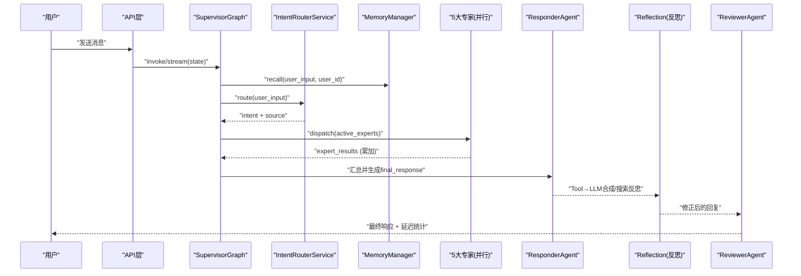
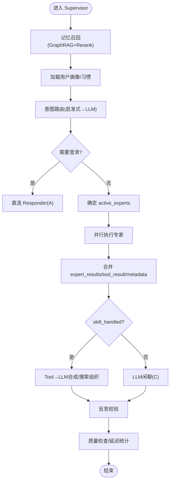
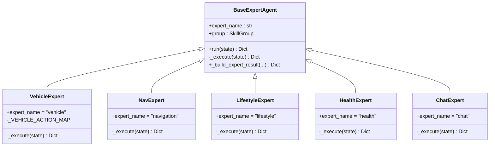
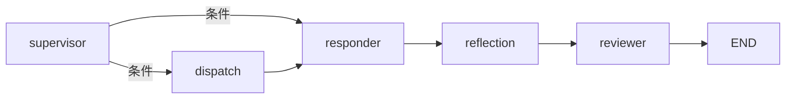
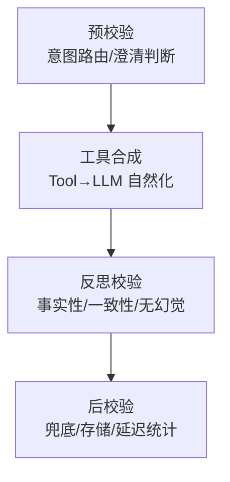
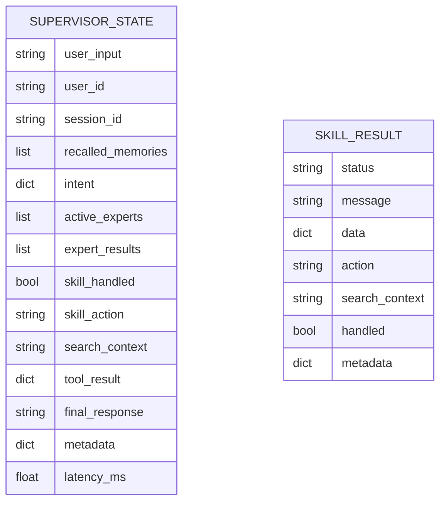
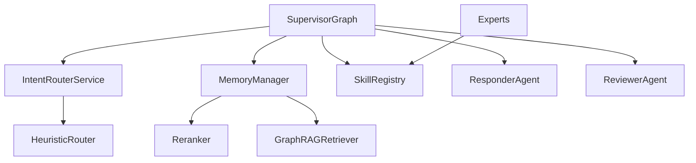

# 多智能体系统设计

<cite>
**本文引用的文件**   
- [supervisor_graph.py](file://backend_design/nexus/agent/supervisor_graph.py)
- [responder.py](file://backend_design/nexus/agent/responder.py)
- [reviewer.py](file://backend_design/nexus/agent/reviewer.py)
- [router.py](file://backend_design/nexus/intent/router.py)
- [heuristic.py](file://backend_design/nexus/intent/heuristic.py)
- [state.py](file://backend_design/nexus/models/state.py)
- [base.py](file://backend_design/nexus/agent/experts/base.py)
- [vehicle_expert.py](file://backend_design/nexus/agent/experts/vehicle_expert.py)
- [nav_expert.py](file://backend_design/nexus/agent/experts/nav_expert.py)
- [lifestyle_expert.py](file://backend_design/nexus/agent/experts/lifestyle_expert.py)
- [health_expert.py](file://backend_design/nexus/agent/experts/health_expert.py)
- [chat_expert.py](file://backend_design/nexus/agent/experts/chat_expert.py)
- [registry.py](file://backend_design/nexus/skills/registry.py)
- [config.py](file://backend_design/nexus/config.py)
- [manager.py](file://backend_design/nexus/memory/manager.py)
</cite>

## 目录
1. [引言](#引言)
2. [项目结构](#项目结构)
3. [核心组件](#核心组件)
4. [架构总览](#架构总览)
5. [详细组件分析](#详细组件分析)
6. [依赖关系分析](#依赖关系分析)
7. [性能与可扩展性](#性能与可扩展性)
8. [故障排查指南](#故障排查指南)
9. [结论](#结论)
10. [附录：扩展新专家开发指南](#附录扩展新专家开发指南)

## 引言
本文件面向 NexusCockpit 的多智能体系统，系统性阐述 Supervisor 调度机制、五大专家 Agent（车辆、导航、生活方式、健康、闲聊）的设计模式与协作方式，LangGraph 工作流编排与状态管理，以及四层防御体系（预校验、工具合成、反思校验、后校验）的实现细节。文档同时给出架构图与数据流图，帮助读者快速理解端到端交互流程、错误处理策略、性能优化方案与扩展方法。

## 项目结构
NexusCockpit 后端采用“意图路由 → 专家并行 → 响应汇总 → 质量审查”的分层架构，围绕 LangGraph 的 StateGraph 构建可观测、可恢复的工作流。关键模块分布如下：
- 意图路由：启发式规则 + LLM 决策，统一输出标准意图字典
- 记忆与画像：GraphRAG 三路召回 + Rerank，MySQL 习惯注入，Neo4j 用户画像
- 专家层：5 个专家按 SkillGroup 分组，通过 SkillRegistry 调用具体技能
- 编排器：SupervisorGraph 使用 LangGraph 组织节点与边，支持同步与流式
- 响应与审查：Responder 生成最终回复，Reviewer 做兜底与延迟统计
- 配置中心：集中管理 LLM、数据库、缓存、车控等所有子系统参数

图表来源
- [supervisor_graph.py:127-173](file://backend_design/nexus/agent/supervisor_graph.py#L127-L173)
- [router.py:78-115](file://backend_design/nexus/intent/router.py#L78-L115)
- [manager.py:95-140](file://backend_design/nexus/memory/manager.py#L95-L140)
- [registry.py:171-195](file://backend_design/nexus/skills/registry.py#L171-L195)
- [responder.py:66-109](file://backend_design/nexus/agent/responder.py#L66-L109)
- [reviewer.py:36-78](file://backend_design/nexus/agent/reviewer.py#L36-L78)
- [config.py:663-673](file://backend_design/nexus/config.py#L663-L673)

章节来源
- [supervisor_graph.py:127-173](file://backend_design/nexus/agent/supervisor_graph.py#L127-L173)
- [router.py:78-115](file://backend_design/nexus/intent/router.py#L78-L115)
- [manager.py:95-140](file://backend_design/nexus/memory/manager.py#L95-L140)
- [registry.py:171-195](file://backend_design/nexus/skills/registry.py#L171-L195)
- [responder.py:66-109](file://backend_design/nexus/agent/responder.py#L66-L109)
- [reviewer.py:36-78](file://backend_design/nexus/agent/reviewer.py#L36-L78)
- [config.py:663-673](file://backend_design/nexus/config.py#L663-L673)

## 核心组件
- SupervisorGraph：基于 LangGraph 的有向图编排器，负责记忆召回、意图路由、专家分派、澄清判断、结果汇聚与反思/审查串联。
- IntentRouterService：三级路由（启发式→LLM→默认闲聊），将自然语言转换为标准意图字典，并标注来源与置信度。
- MemoryManager：GraphRAG 三路召回（向量+图谱+BM25）+ Rerank，渐进式披露；异步存储对话与三元组记忆；加载用户习惯。
- 专家基类 BaseExpertAgent：定义 run() 与 _execute() 模板，封装 partial update 构造与异常记录。
- 五大专家：Vehicle、Navigation、Lifestyle、Health、Chat，分别对应不同 SkillGroup 的技能集合。
- ResponderAgent：根据 need_clarification / skill_handled / search_context 走分支 A/B/C，支持流式与非流式。
- ReviewerAgent：质量兜底、后台记忆存储触发、总延迟统计。
- SkillRegistry：装饰器自动发现 + 手动兼容，提供 execute(tool_name, args) 统一执行接口。
- 配置中心：集中管理 LLM、数据库、缓存、车控、地图、搜索等配置，并提供 get_config() 单例。

章节来源
- [supervisor_graph.py:69-173](file://backend_design/nexus/agent/supervisor_graph.py#L69-L173)
- [router.py:32-115](file://backend_design/nexus/intent/router.py#L32-L115)
- [manager.py:41-140](file://backend_design/nexus/memory/manager.py#L41-L140)
- [base.py:26-87](file://backend_design/nexus/agent/experts/base.py#L26-L87)
- [vehicle_expert.py:33-63](file://backend_design/nexus/agent/experts/vehicle_expert.py#L33-L63)
- [nav_expert.py:27-74](file://backend_design/nexus/agent/experts/nav_expert.py#L27-L74)
- [lifestyle_expert.py:23-78](file://backend_design/nexus/agent/experts/lifestyle_expert.py#L23-L78)
- [health_expert.py:24-53](file://backend_design/nexus/agent/experts/health_expert.py#L24-L53)
- [chat_expert.py:24-56](file://backend_design/nexus/agent/experts/chat_expert.py#L24-L56)
- [responder.py:35-109](file://backend_design/nexus/agent/responder.py#L35-L109)
- [reviewer.py:26-78](file://backend_design/nexus/agent/reviewer.py#L26-L78)
- [registry.py:35-195](file://backend_design/nexus/skills/registry.py#L35-L195)
- [config.py:601-673](file://backend_design/nexus/config.py#L601-L673)

## 架构总览
下图展示从用户输入到最终输出的完整链路，包括意图识别、专家并行、结果汇总、反思校验与后校验。

图表来源
- [supervisor_graph.py:175-400](file://backend_design/nexus/agent/supervisor_graph.py#L175-L400)
- [router.py:78-115](file://backend_design/nexus/intent/router.py#L78-L115)
- [manager.py:95-140](file://backend_design/nexus/memory/manager.py#L95-L140)
- [responder.py:66-109](file://backend_design/nexus/agent/responder.py#L66-L109)
- [reviewer.py:36-78](file://backend_design/nexus/agent/reviewer.py#L36-L78)

## 详细组件分析

### Supervisor 调度机制（意图识别、专家分派、结果汇总）
- 意图识别：
  - 启发式优先匹配常见车控/导航/媒体/时间/周边 POI/点餐/搜索等关键词，快速返回意图字段。
  - 未命中时交由 LLM 路由，解析 tool_name 与 arguments，映射为标准意图字典，并标注 Route_Source 与置信度。
  - 需要澄清时设置 Need_Clarification 与 Clarification_Prompt，供 Responder 直接输出。
- 专家分派：
  - 根据 intent 中的动作字段决定 active_experts 列表，如 Climate/Window/Seat/Media/Status → vehicle；Navigation → navigation；Need_Search/Call_elm → lifestyle；Register_Action → chat；无匹配则兜底 chat。
  - dispatch 节点使用 asyncio.gather 并行执行所有活跃专家，合并 expert_results 与 metadata。
- 结果汇总：
  - Responder 分支 A：需要澄清，直接返回澄清提示。
  - 分支 B：已处理，若为 web_search 且存在 search_context，则用专用提示词组织回答；若存在 tool_result.data，则 Tool→LLM 合成；否则取首个 handled 的 reply。
  - 分支 C：LLM 闲聊兜底。
- 反思与审查：
  - Reflection：当存在 tool_result 或搜索结果时，进行事实性/一致性/无幻觉检查，必要时自我批评修正；可通过配置关闭以减少 LLM 调用。
  - Reviewer：空响应兜底、异步记忆存储、计算总延迟。

图表来源
- [supervisor_graph.py:175-400](file://backend_design/nexus/agent/supervisor_graph.py#L175-L400)
- [router.py:78-115](file://backend_design/nexus/intent/router.py#L78-L115)
- [manager.py:95-140](file://backend_design/nexus/memory/manager.py#L95-L140)
- [responder.py:66-109](file://backend_design/nexus/agent/responder.py#L66-L109)
- [reviewer.py:36-78](file://backend_design/nexus/agent/reviewer.py#L36-L78)

章节来源
- [supervisor_graph.py:175-400](file://backend_design/nexus/agent/supervisor_graph.py#L175-L400)
- [router.py:78-115](file://backend_design/nexus/intent/router.py#L78-L115)
- [manager.py:95-140](file://backend_design/nexus/memory/manager.py#L95-L140)
- [responder.py:66-109](file://backend_design/nexus/agent/responder.py#L66-L109)
- [reviewer.py:36-78](file://backend_design/nexus/agent/reviewer.py#L36-L78)

### 五大专家 Agent 设计与协作
- 设计模式：
  - 每个专家继承 BaseExpertAgent，实现 _execute(state)，返回 partial update（包含 expert_results、skill_action、skill_handled、search_context、tool_result 等）。
  - 通过 SkillRegistry.execute(tool_name, args) 调用具体技能，统一返回 SkillResult。
- 协作机制：
  - 并行执行：Supervisor 的 dispatch 节点使用 asyncio.gather 并发调用各专家 run()，并通过 Annotated[list, add] reducer 自动拼接 expert_results。
  - 副作用标记：车控类技能 has_side_effect=True，避免语义缓存命中导致指令不执行的安全问题。
  - 位置增强：导航专家在查询当前位置时，尝试从适配器缓存注入 GPS 坐标，降低“未知位置”概率。
- 专家职责：
  - Vehicle：空调/车窗/座椅/媒体/车况，映射到 vehicle_* 技能。
  - Navigation：目的地设置、路线规划、当前位置查询。
  - Lifestyle：高德 POI 周边搜索、联网搜索、外卖点餐。
  - Health：车辆健康诊断（骨架实现，待 Phase 2/3 技能接入）。
  - Chat：声纹注册与纯 LLM 闲聊兜底。

图表来源
- [base.py:26-87](file://backend_design/nexus/agent/experts/base.py#L26-L87)
- [vehicle_expert.py:33-63](file://backend_design/nexus/agent/experts/vehicle_expert.py#L33-L63)
- [nav_expert.py:27-74](file://backend_design/nexus/agent/experts/nav_expert.py#L27-L74)
- [lifestyle_expert.py:23-78](file://backend_design/nexus/agent/experts/lifestyle_expert.py#L23-L78)
- [health_expert.py:24-53](file://backend_design/nexus/agent/experts/health_expert.py#L24-L53)
- [chat_expert.py:24-56](file://backend_design/nexus/agent/experts/chat_expert.py#L24-L56)

章节来源
- [base.py:26-87](file://backend_design/nexus/agent/experts/base.py#L26-L87)
- [vehicle_expert.py:33-63](file://backend_design/nexus/agent/experts/vehicle_expert.py#L33-L63)
- [nav_expert.py:27-74](file://backend_design/nexus/agent/experts/nav_expert.py#L27-L74)
- [lifestyle_expert.py:23-78](file://backend_design/nexus/agent/experts/lifestyle_expert.py#L23-L78)
- [health_expert.py:24-53](file://backend_design/nexus/agent/experts/health_expert.py#L24-L53)
- [chat_expert.py:24-56](file://backend_design/nexus/agent/experts/chat_expert.py#L24-L56)

### LangGraph 工作流编排与状态管理
- 编排方式：
  - 使用 StateGraph(SupervisorState) 定义节点与边，入口为 supervisor，条件边根据 need_clarification 与 active_experts 决定走 responder 或 dispatch。
  - dispatch 节点并行执行专家，随后汇聚至 responder，再依次经过 reflection 与 reviewer，最后 END。
- 状态管理：
  - SupervisorState 使用 TypedDict 与 Annotated 定义 reducer：list 用 add 累加，dict 用 merge_dict 合并，确保并行写入安全。
  - 关键字段：user_input/user_id/session_id、recalled_memories/memory_str/habits_str/user_profile、intent/intent_source/need_clarification/active_experts、expert_results/search_context、history/running_summary、final_response/metadata、trace_id/span_ids/latency_ms。
  - create_initial_state 提供初始化入口，保证 reducer 字段具备正确初始值。

图表来源
- [supervisor_graph.py:127-173](file://backend_design/nexus/agent/supervisor_graph.py#L127-L173)
- [state.py:38-161](file://backend_design/nexus/models/state.py#L38-L161)

章节来源
- [supervisor_graph.py:127-173](file://backend_design/nexus/agent/supervisor_graph.py#L127-L173)
- [state.py:38-161](file://backend_design/nexus/models/state.py#L38-L161)

### 四层防御体系（预校验、工具合成、反思校验、后校验）
- 预校验（Pre-check）：
  - 意图路由阶段对模糊/低置信度请求进行澄清判断，减少无效专家调用。
  - 启发式规则快速拦截常见指令，降低 LLM 调用成本。
- 工具合成（Tool→LLM Synthesis）：
  - 当工具返回结构化数据时，Responder 将 tool_result 回传 LLM 生成自然语言回复，严格禁止添加工具结果外的信息。
  - 失败/未知结果时跳过合成，直接返回原始消息，避免编造。
- 反思校验（Reflection）：
  - 针对工具数据与搜索结果分别进行事实性/一致性/无幻觉检查，必要时自我批评修正。
  - 可通过配置开关关闭以减少 LLM 调用。
- 后校验（Post-check）：
  - Reviewer 对空响应进行兜底填充，触发异步记忆存储，计算总延迟。

图表来源
- [router.py:78-115](file://backend_design/nexus/intent/router.py#L78-L115)
- [supervisor_graph.py:452-533](file://backend_design/nexus/agent/supervisor_graph.py#L452-L533)
- [supervisor_graph.py:534-752](file://backend_design/nexus/agent/supervisor_graph.py#L534-L752)
- [reviewer.py:36-78](file://backend_design/nexus/agent/reviewer.py#L36-L78)

章节来源
- [router.py:78-115](file://backend_design/nexus/intent/router.py#L78-L115)
- [supervisor_graph.py:452-533](file://backend_design/nexus/agent/supervisor_graph.py#L452-L533)
- [supervisor_graph.py:534-752](file://backend_design/nexus/agent/supervisor_graph.py#L534-L752)
- [reviewer.py:36-78](file://backend_design/nexus/agent/reviewer.py#L36-L78)

### Agent 通信协议与数据模型
- 通信协议：
  - 专家与编排器之间通过 partial state update 字典通信，包含 expert_results、skill_action、skill_handled、search_context、tool_result、metadata 等。
  - 统一结果对象 SkillResult 用于技能执行返回，包含 status/message/data/action/search_context/handled/metadata。
- 数据模型：
  - SupervisorState 作为共享状态，所有节点读写同一字典，reducer 保障并发安全。
  - AgentState 为 SupervisorState 别名，保持向后兼容。

图表来源
- [state.py:38-161](file://backend_design/nexus/models/state.py#L38-L161)
- [base.py:85-133](file://backend_design/nexus/agent/experts/base.py#L85-L133)
- [registry.py:171-195](file://backend_design/nexus/skills/registry.py#L171-L195)

章节来源
- [state.py:38-161](file://backend_design/nexus/models/state.py#L38-L161)
- [base.py:85-133](file://backend_design/nexus/agent/experts/base.py#L85-L133)
- [registry.py:171-195](file://backend_design/nexus/skills/registry.py#L171-L195)

## 依赖关系分析
- 组件耦合：
  - SupervisorGraph 强依赖 IntentRouterService、MemoryManager、SkillRegistry、ResponderAgent、ReviewerAgent。
  - 专家仅依赖 SkillRegistry 与自身领域逻辑，解耦良好。
  - Responder 与 Reviewer 相对独立，便于替换与扩展。
- 外部依赖：
  - LLM 客户端（OpenAI 兼容）、Milvus/Neo4j/Redis/MySQL、高德/Tavily 等第三方服务。
  - 配置中心集中管理连接参数与降级策略。

图表来源
- [supervisor_graph.py:69-173](file://backend_design/nexus/agent/supervisor_graph.py#L69-L173)
- [router.py:32-115](file://backend_design/nexus/intent/router.py#L32-L115)
- [manager.py:41-140](file://backend_design/nexus/memory/manager.py#L41-L140)
- [registry.py:35-195](file://backend_design/nexus/skills/registry.py#L35-L195)

章节来源
- [supervisor_graph.py:69-173](file://backend_design/nexus/agent/supervisor_graph.py#L69-L173)
- [router.py:32-115](file://backend_design/nexus/intent/router.py#L32-L115)
- [manager.py:41-140](file://backend_design/nexus/memory/manager.py#L41-L140)
- [registry.py:35-195](file://backend_design/nexus/skills/registry.py#L35-L195)

## 性能与可扩展性
- 并行与降级：
  - 专家并行执行，显著降低端到端延迟；LLM 调用失败时可降级到本地模型（Responder 内置 fallback）。
  - 记忆召回失败时回退到向量检索，保障可用性。
- 渐进式披露：
  - 简单指令减少 top_k，复杂查询增加 top_k，平衡精度与延迟。
- 反射与记忆提取开关：
  - 可通过配置关闭反思与记忆提取，降低免费 API 限流场景下的调用次数。
- 语义缓存与副作用控制：
  - 车控类技能 has_side_effect=True，禁止缓存，避免安全事故。
- 扩展建议：
  - 新增专家仅需实现 BaseExpertAgent 子类并在 registry 中注册相应技能，无需改动编排器。
  - 通过 SkillGroup 分类，便于未来引入更多专家与技能。

[本节为通用指导，不直接分析具体文件]

## 故障排查指南
- 常见问题定位：
  - 意图路由失败：检查启发式规则是否覆盖目标表达，确认 LLM 路由是否启用与工具目录是否正确。
  - 专家执行异常：查看 expert_results 中的 error 字段与 metadata 中的 *_error 键。
  - 工具合成失败：确认 tool_result.data 是否存在，失败时会自动回退到原始消息。
  - 反思校验异常：检查 REFLECTION_ENABLED 配置，失败会记录 reflection_error。
  - 记忆存储失败：Review 阶段会触发异步存储，异常会被捕获并记录日志。
- 日志与指标：
  - 各节点均记录耗时与关键状态，Reviewer 汇总 total_latency_ms，便于性能分析。
  - 可通过 Langfuse 配置开启端到端追踪（需 public_key 与 secret_key）。

章节来源
- [supervisor_graph.py:326-400](file://backend_design/nexus/agent/supervisor_graph.py#L326-L400)
- [supervisor_graph.py:452-533](file://backend_design/nexus/agent/supervisor_graph.py#L452-L533)
- [supervisor_graph.py:534-752](file://backend_design/nexus/agent/supervisor_graph.py#L534-L752)
- [reviewer.py:36-78](file://backend_design/nexus/agent/reviewer.py#L36-L78)
- [config.py:395-414](file://backend_design/nexus/config.py#L395-L414)

## 结论
NexusCockpit 的多智能体系统以 Supervisor 为核心，结合 LangGraph 的有向图编排与 TypedDict 状态管理，实现了高内聚、低耦合的专家并行架构。通过三层记忆召回、四级防御体系与完善的错误处理与性能优化策略，系统在准确性、可用性与可维护性方面达到较高水平。扩展新专家只需遵循既定模式与协议，即可无缝融入现有工作流。

[本节为总结，不直接分析具体文件]

## 附录：扩展新专家开发指南
- 步骤概览：
  1. 定义技能：在 skills 目录下创建新技能类，继承 BaseSkill，实现 execute(**kwargs) -> SkillResult，并使用 @register_skill 装饰器声明 name、group、has_side_effect、cache_ttl 等元信息。
  2. 注册与发现：SkillRegistry 初始化时自动扫描 _SKILL_REGISTRY 表完成实例化，也可手动 register(name, instance)。
  3. 实现专家：新建专家类继承 BaseExpertAgent，实现 _execute(state)，从 state.intent 中提取动作字段，调用 registry.execute(tool_name, args)，返回 _build_expert_result(...)。
  4. 加入编排：在 SupervisorGraph 中注册新专家节点，并在 _determine_experts 中添加分派逻辑，确保 active_experts 能正确包含新专家。
  5. 测试与验证：通过 API 层发送典型用例，观察 expert_results、tool_result、metadata 与延迟统计，确认无误后上线。
- 注意事项：
  - 副作用控制：涉及真实设备操作的技能必须设置 has_side_effect=True，避免语义缓存命中导致指令不执行。
  - 位置增强：如涉及地理位置，参考导航专家从适配器缓存注入 GPS 坐标的做法。
  - 降级与容错：确保异常路径返回 handled=False 或明确错误信息，便于上层聚合与兜底。

章节来源
- [base.py:43-82](file://backend_design/nexus/agent/experts/base.py#L43-L82)
- [registry.py:63-95](file://backend_design/nexus/skills/registry.py#L63-L95)
- [nav_expert.py:43-64](file://backend_design/nexus/agent/experts/nav_expert.py#L43-L64)
- [supervisor_graph.py:285-324](file://backend_design/nexus/agent/supervisor_graph.py#L285-L324)