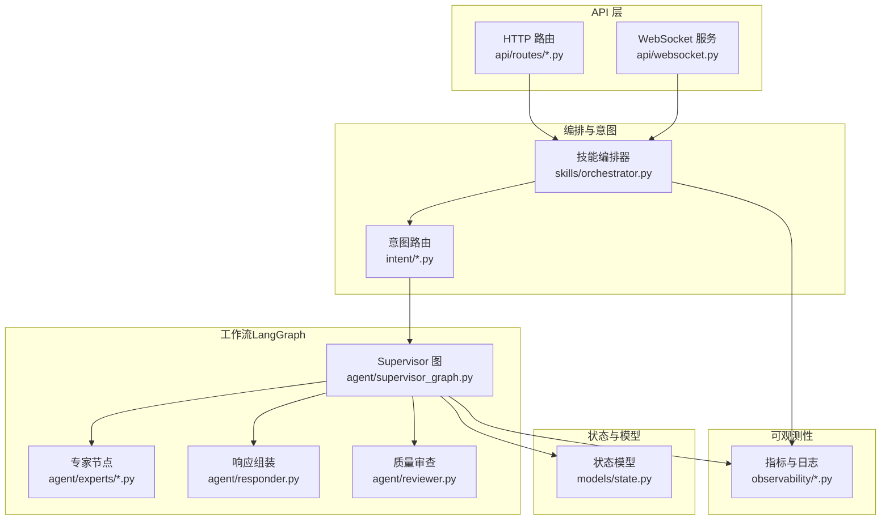
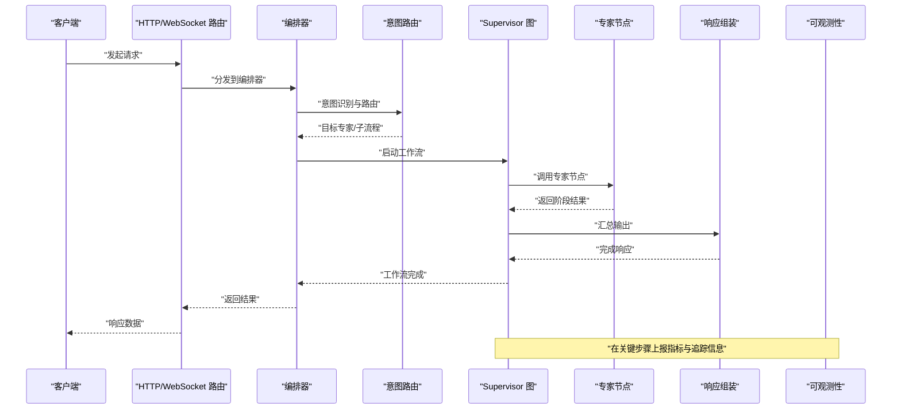
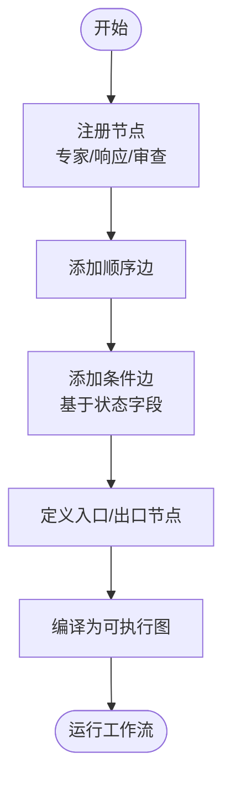
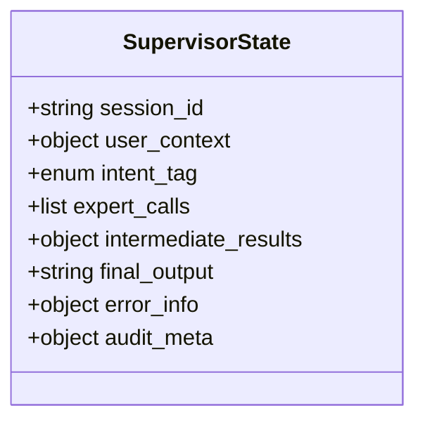
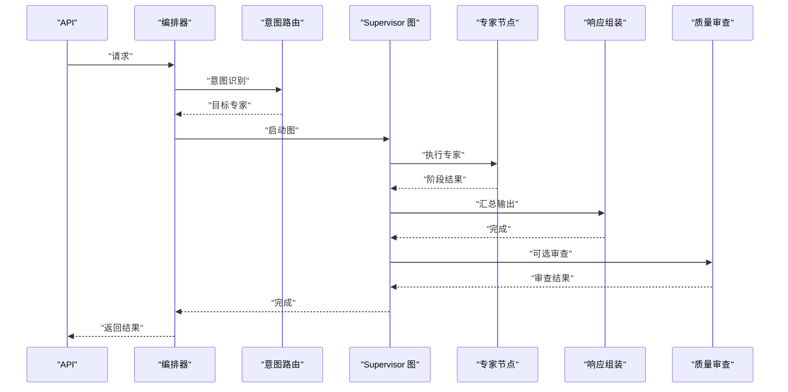
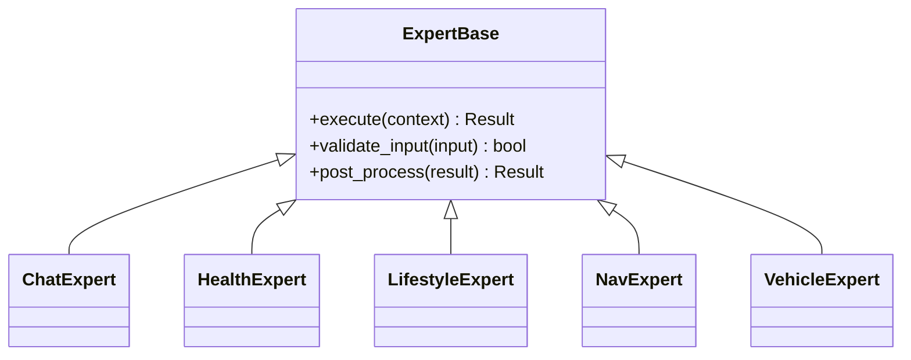
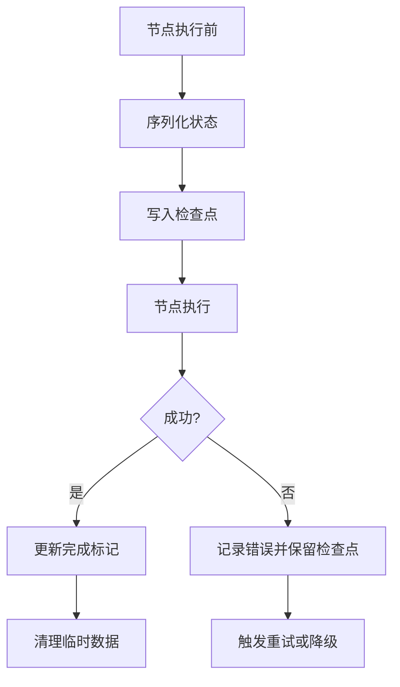
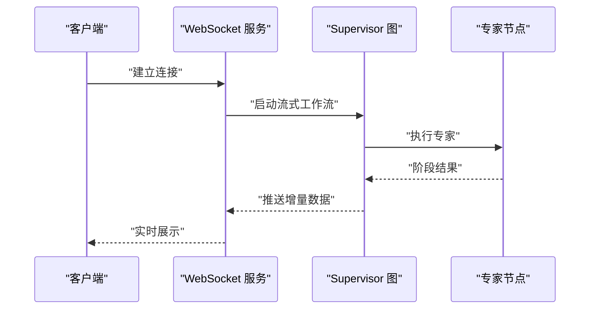
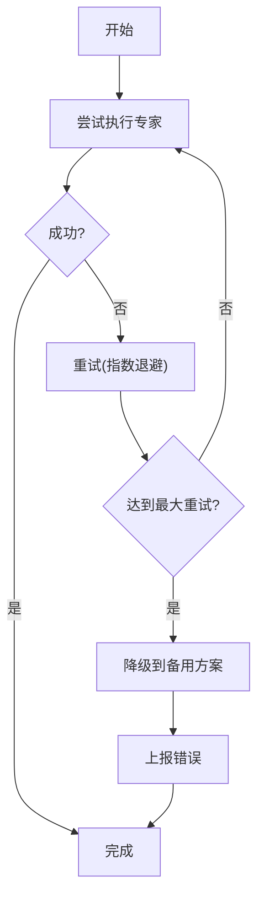
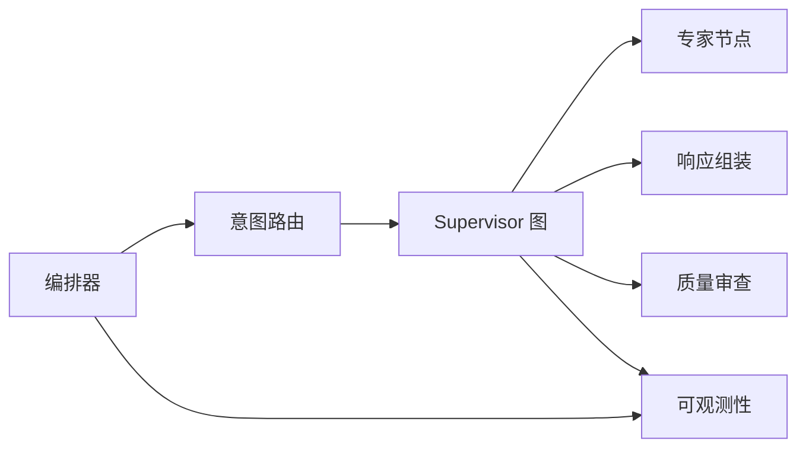

# 工作流编排引擎

<cite>
**本文引用的文件**   
- [supervisor_graph.py](file://backend_design/nexus/agent/supervisor_graph.py)
- [responder.py](file://backend_design/nexus/agent/responder.py)
- [reviewer.py](file://backend_design/nexus/agent/reviewer.py)
- [base.py](file://backend_design/nexus/agent/experts/base.py)
- [chat_expert.py](file://backend_design/nexus/agent/experts/chat_expert.py)
- [health_expert.py](file://backend_design/nexus/agent/experts/health_expert.py)
- [lifestyle_expert.py](file://backend_design/nexus/agent/experts/lifestyle_expert.py)
- [nav_expert.py](file://backend_design/nexus/agent/experts/nav_expert.py)
- [vehicle_expert.py](file://backend_design/nexus/agent/experts/vehicle_expert.py)
- [state.py](file://backend_design/nexus/models/state.py)
- [cockpit_manager.py](file://backend_design/nexus/core/cockpit_manager.py)
- [orchestrator.py](file://backend_design/nexus/skills/orchestrator.py)
- [registry.py](file://backend_design/nexus/skills/registry.py)
- [llm_router.py](file://backend_design/nexus/intent/llm_router.py)
- [router.py](file://backend_design/nexus/intent/router.py)
- [heuristic.py](file://backend_design/nexus/intent/heuristic.py)
- [langfuse.py](file://backend_design/nexus/observability/langfuse.py)
- [cockpit_metrics.py](file://backend_design/nexus/observability/cockpit_metrics.py)
- [metrics.py](file://backend_design/nexus/observability/metrics.py)
- [main.py](file://backend_design/nexus/main.py)
- [routes/__init__.py](file://backend_design/nexus/api/routes/__init__.py)
- [api_routes.py](file://backend_design/nexus/api/routes/chat.py)
- [websocket.py](file://backend_design/nexus/api/websocket.py)
</cite>

## 目录
1. [简介](#简介)
2. [项目结构](#项目结构)
3. [核心组件](#核心组件)
4. [架构总览](#架构总览)
5. [详细组件分析](#详细组件分析)
6. [依赖关系分析](#依赖关系分析)
7. [性能考量](#性能考量)
8. [故障排查指南](#故障排查指南)
9. [结论](#结论)
10. [附录](#附录)

## 简介
本技术文档聚焦于 NexusCockpit 的工作流编排引擎，围绕 LangGraph StateGraph 的图构建、节点注册与边连接、条件路由配置展开，深入解析 SupervisorState 状态模型的设计与约束，并完整梳理从入口到输出的执行生命周期。同时，文档对 checkpoint 持久化机制、流式处理支持与错误恢复策略进行说明，并提供调试工具、性能监控与故障排查方法，辅以流程图与状态转换图帮助读者理解复杂工作流逻辑。

## 项目结构
NexusCockpit 的后端采用分层组织：API 层暴露 HTTP/WebSocket 接口；意图识别与技能编排位于中间层；LangGraph 工作流以“Supervisor + Experts”模式实现；可观测性与中间件贯穿全链路。

图表来源
- [main.py:1-200](file://backend_design/nexus/main.py#L1-L200)
- [orchestrator.py:1-200](file://backend_design/nexus/skills/orchestrator.py#L1-L200)
- [supervisor_graph.py:1-200](file://backend_design/nexus/agent/supervisor_graph.py#L1-L200)
- [state.py:1-200](file://backend_design/nexus/models/state.py#L1-L200)

章节来源
- [main.py:1-200](file://backend_design/nexus/main.py#L1-L200)
- [orchestrator.py:1-200](file://backend_design/nexus/skills/orchestrator.py#L1-L200)
- [supervisor_graph.py:1-200](file://backend_design/nexus/agent/supervisor_graph.py#L1-L200)
- [state.py:1-200](file://backend_design/nexus/models/state.py#L1-L200)

## 核心组件
- 工作流编排器（Orchestrator）：负责将用户请求映射到具体技能或子流程，协调意图路由与工作流执行。
- 意图路由（Intent Router）：基于启发式规则与大模型路由策略，决定进入哪个专家或子流程。
- Supervisor 图（Supervisor Graph）：基于 LangGraph StateGraph 构建的主控图，负责节点注册、边连接与条件路由。
- 专家节点（Experts）：各领域能力的原子执行单元（如聊天、健康、生活方式、导航、车辆等）。
- 响应组装（Responder）：汇总专家输出，生成最终回复。
- 质量审查（Reviewer）：可选的质量把关环节，用于校验与修正输出。
- 状态模型（State Model）：定义工作流运行期共享状态的结构与类型约束。
- 可观测性（Observability）：指标采集、追踪与日志记录。

章节来源
- [orchestrator.py:1-200](file://backend_design/nexus/skills/orchestrator.py#L1-L200)
- [llm_router.py:1-200](file://backend_design/nexus/intent/llm_router.py#L1-L200)
- [router.py:1-200](file://backend_design/nexus/intent/router.py#L1-L200)
- [heuristic.py:1-200](file://backend_design/nexus/intent/heuristic.py#L1-L200)
- [supervisor_graph.py:1-200](file://backend_design/nexus/agent/supervisor_graph.py#L1-L200)
- [responder.py:1-200](file://backend_design/nexus/agent/responder.py#L1-L200)
- [reviewer.py:1-200](file://backend_design/nexus/agent/reviewer.py#L1-L200)
- [state.py:1-200](file://backend_design/nexus/models/state.py#L1-L200)

## 架构总览
下图展示了从 API 到工作流执行的端到端路径，以及关键的可观测性接入点。

图表来源
- [main.py:1-200](file://backend_design/nexus/main.py#L1-L200)
- [orchestrator.py:1-200](file://backend_design/nexus/skills/orchestrator.py#L1-L200)
- [supervisor_graph.py:1-200](file://backend_design/nexus/agent/supervisor_graph.py#L1-L200)
- [responder.py:1-200](file://backend_design/nexus/agent/responder.py#L1-L200)
- [metrics.py:1-200](file://backend_design/nexus/observability/metrics.py#L1-L200)

## 详细组件分析

### LangGraph StateGraph 图构建过程
- 节点注册：通过 StateGraph 的节点注册接口，将各专家节点、响应组装与审查节点加入图中。每个节点需声明其输入/输出与副作用（如写入状态字段）。
- 边连接：为节点之间建立有向边，表示顺序执行路径。对于需要分支的场景，使用条件边（conditional edges）根据当前状态字段选择下一跳。
- 条件路由：在 Supervisor 中，依据意图路由结果或运行时状态（如是否需要二次确认、是否触发特定专家）动态选择下一个节点。
- 入口与出口：定义图的入口节点（通常为意图汇聚后的调度节点）与结束节点（通常为响应组装或审查后输出）。

图表来源
- [supervisor_graph.py:1-200](file://backend_design/nexus/agent/supervisor_graph.py#L1-L200)

章节来源
- [supervisor_graph.py:1-200](file://backend_design/nexus/agent/supervisor_graph.py#L1-L200)

### SupervisorState 状态模型设计
- 字段定义：包含会话标识、用户上下文、意图标签、专家调用历史、中间结果、最终输出、错误信息与审计元数据等。
- 类型约束：使用强类型字段（如字符串、枚举、列表、字典）确保状态一致性，避免非法值污染。
- 状态转换规则：
  - 初始化：创建空状态，填充会话与用户上下文。
  - 意图识别：写入意图标签与置信度。
  - 专家执行：追加专家调用记录与阶段结果。
  - 审查与修正：记录审查意见与修正内容。
  - 完成：汇总最终输出并标记结束。
  - 异常：记录错误信息并决定是否重试或降级。

图表来源
- [state.py:1-200](file://backend_design/nexus/models/state.py#L1-L200)

章节来源
- [state.py:1-200](file://backend_design/nexus/models/state.py#L1-L200)

### 工作流执行流程（入口到输出）
- 入口：API 接收请求，交由编排器处理。
- 意图路由：根据启发式规则与大模型判断，确定目标专家或子流程。
- 图执行：Supervisor 图按边与条件路由调度专家节点，逐步更新状态。
- 响应组装：收集专家输出，进行格式统一与摘要。
- 可选审查：对输出进行质量检查与必要修正。
- 输出：返回最终结果给客户端，并记录可观测性数据。

图表来源
- [orchestrator.py:1-200](file://backend_design/nexus/skills/orchestrator.py#L1-L200)
- [llm_router.py:1-200](file://backend_design/nexus/intent/llm_router.py#L1-L200)
- [router.py:1-200](file://backend_design/nexus/intent/router.py#L1-L200)
- [heuristic.py:1-200](file://backend_design/nexus/intent/heuristic.py#L1-L200)
- [supervisor_graph.py:1-200](file://backend_design/nexus/agent/supervisor_graph.py#L1-L200)
- [responder.py:1-200](file://backend_design/nexus/agent/responder.py#L1-L200)
- [reviewer.py:1-200](file://backend_design/nexus/agent/reviewer.py#L1-L200)

### 专家节点与能力扩展
- 专家基类：提供统一的输入/输出契约与生命周期钩子，便于扩展新领域能力。
- 具体专家：聊天、健康、生活方式、导航、车辆等，各自封装领域知识与工具调用。
- 注册机制：通过注册表集中管理专家，支持动态发现与按需加载。

图表来源
- [base.py:1-200](file://backend_design/nexus/agent/experts/base.py#L1-L200)
- [chat_expert.py:1-200](file://backend_design/nexus/agent/experts/chat_expert.py#L1-L200)
- [health_expert.py:1-200](file://backend_design/nexus/agent/experts/health_expert.py#L1-L200)
- [lifestyle_expert.py:1-200](file://backend_design/nexus/agent/experts/lifestyle_expert.py#L1-L200)
- [nav_expert.py:1-200](file://backend_design/nexus/agent/experts/nav_expert.py#L1-L200)
- [vehicle_expert.py:1-200](file://backend_design/nexus/agent/experts/vehicle_expert.py#L1-L200)
- [registry.py:1-200](file://backend_design/nexus/skills/registry.py#L1-L200)

章节来源
- [base.py:1-200](file://backend_design/nexus/agent/experts/base.py#L1-L200)
- [chat_expert.py:1-200](file://backend_design/nexus/agent/experts/chat_expert.py#L1-L200)
- [health_expert.py:1-200](file://backend_design/nexus/agent/experts/health_expert.py#L1-L200)
- [lifestyle_expert.py:1-200](file://backend_design/nexus/agent/experts/lifestyle_expert.py#L1-L200)
- [nav_expert.py:1-200](file://backend_design/nexus/agent/experts/nav_expert.py#L1-L200)
- [vehicle_expert.py:1-200](file://backend_design/nexus/agent/experts/vehicle_expert.py#L1-L200)
- [registry.py:1-200](file://backend_design/nexus/skills/registry.py#L1-L200)

### Checkpoint 持久化机制
- 目的：在工作流的关键步骤保存状态快照，支持断点续跑、回溯分析与幂等恢复。
- 策略：
  - 事件驱动：在节点执行前后、条件路由决策后写入检查点。
  - 存储后端：可选择本地文件系统或外部存储（如对象存储），保证高可用。
  - 版本控制：为每次检查点附加版本号与时间戳，便于回滚与对比。
- 恢复流程：
  - 读取最近有效检查点。
  - 重建状态上下文。
  - 从断点继续执行后续节点。

图表来源
- [supervisor_graph.py:1-200](file://backend_design/nexus/agent/supervisor_graph.py#L1-L200)

章节来源
- [supervisor_graph.py:1-200](file://backend_design/nexus/agent/supervisor_graph.py#L1-L200)

### 流式处理支持
- 增量输出：在专家节点内部产生阶段性结果时，通过流式通道推送至上层。
- WebSocket 集成：前端通过 WebSocket 实时接收增量数据，提升交互体验。
- 背压与限流：在流式传输中实施背压控制，避免下游过载。

图表来源
- [websocket.py:1-200](file://backend_design/nexus/api/websocket.py#L1-L200)
- [supervisor_graph.py:1-200](file://backend_design/nexus/agent/supervisor_graph.py#L1-L200)

章节来源
- [websocket.py:1-200](file://backend_design/nexus/api/websocket.py#L1-L200)
- [supervisor_graph.py:1-200](file://backend_design/nexus/agent/supervisor_graph.py#L1-L200)

### 错误恢复策略
- 重试机制：对瞬时失败（如网络抖动、第三方服务超时）进行指数退避重试。
- 降级策略：当专家不可用时，切换到备用专家或返回默认响应。
- 补偿操作：在部分成功场景下，执行补偿逻辑以保证整体一致性。
- 错误上报：记录错误详情与上下文，便于定位与告警。

图表来源
- [supervisor_graph.py:1-200](file://backend_design/nexus/agent/supervisor_graph.py#L1-L200)

章节来源
- [supervisor_graph.py:1-200](file://backend_design/nexus/agent/supervisor_graph.py#L1-L200)

### 工作流调试工具
- 可视化图：导出工作流图结构，辅助定位节点与边问题。
- 状态快照：查看任意时刻的状态快照，验证状态转换是否符合预期。
- 日志与追踪：结合可观测性平台，关联请求 ID 与节点执行轨迹。
- 回放测试：基于检查点回放历史用例，回归验证修复效果。

章节来源
- [langfuse.py:1-200](file://backend_design/nexus/observability/langfuse.py#L1-L200)
- [metrics.py:1-200](file://backend_design/nexus/observability/metrics.py#L1-L200)
- [cockpit_metrics.py:1-200](file://backend_design/nexus/observability/cockpit_metrics.py#L1-L200)

### 性能监控
- 指标采集：统计节点执行耗时、成功率、错误率、吞吐与延迟分布。
- 仪表盘：通过 Grafana 等工具展示关键指标趋势。
- 告警规则：对异常阈值设置告警，及时通知运维团队。

章节来源
- [metrics.py:1-200](file://backend_design/nexus/observability/metrics.py#L1-L200)
- [cockpit_metrics.py:1-200](file://backend_design/nexus/observability/cockpit_metrics.py#L1-L200)

## 依赖关系分析
- 低耦合高内聚：专家节点通过基类契约解耦，便于独立开发与测试。
- 明确边界：意图路由与工作流执行分离，职责清晰。
- 外部依赖：大模型路由、向量检索、语音与 TTS 等通过适配器接入，降低替换成本。

图表来源
- [orchestrator.py:1-200](file://backend_design/nexus/skills/orchestrator.py#L1-L200)
- [supervisor_graph.py:1-200](file://backend_design/nexus/agent/supervisor_graph.py#L1-L200)
- [metrics.py:1-200](file://backend_design/nexus/observability/metrics.py#L1-L200)

章节来源
- [orchestrator.py:1-200](file://backend_design/nexus/skills/orchestrator.py#L1-L200)
- [supervisor_graph.py:1-200](file://backend_design/nexus/agent/supervisor_graph.py#L1-L200)
- [metrics.py:1-200](file://backend_design/nexus/observability/metrics.py#L1-L200)

## 性能考量
- 并行执行：对无依赖的专家节点进行并发调度，缩短整体时延。
- 缓存策略：对热点查询与重复计算结果进行缓存，减少重复开销。
- 资源限制：对专家节点设置超时与并发上限，防止雪崩效应。
- 批处理：在合适场景合并小任务，提高吞吐。

[本节为通用指导，不直接分析具体文件]

## 故障排查指南
- 常见问题：
  - 意图误判：检查启发式规则与大模型提示词，调整权重与阈值。
  - 专家超时：增加重试与降级策略，优化专家内部逻辑。
  - 状态不一致：核对状态字段类型约束与转换规则，确保幂等。
  - 流式中断：检查 WebSocket 连接稳定性与背压配置。
- 定位手段：
  - 查看检查点快照与执行轨迹。
  - 分析指标与日志，定位瓶颈与异常。
  - 使用回放测试复现问题。

章节来源
- [supervisor_graph.py:1-200](file://backend_design/nexus/agent/supervisor_graph.py#L1-L200)
- [metrics.py:1-200](file://backend_design/nexus/observability/metrics.py#L1-L200)
- [websocket.py:1-200](file://backend_design/nexus/api/websocket.py#L1-L200)

## 结论
NexusCockpit 的工作流编排引擎以 LangGraph StateGraph 为核心，通过清晰的节点注册、边连接与条件路由，实现了灵活且可扩展的“Supervisor + Experts”模式。配合强类型的 SupervisorState、完善的检查点与流式处理、健壮的错误恢复与可观测性体系，系统在高可用与高性能方面具备良好基础。建议在生产环境中持续完善监控告警与回归测试，保障工作流的稳定演进。

## 附录
- 术语表：
  - 工作流：由多个节点与边组成的有向图，描述业务执行流程。
  - 状态模型：工作流运行期共享的数据结构与类型约束。
  - 检查点：在关键步骤保存的状态快照，用于恢复与分析。
  - 流式处理：增量产出与传输数据的处理方式。
  - 专家节点：封装领域能力的原子执行单元。

[本节为概念性内容，不直接分析具体文件]