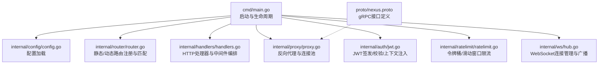
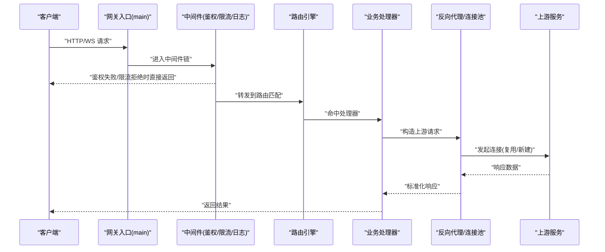
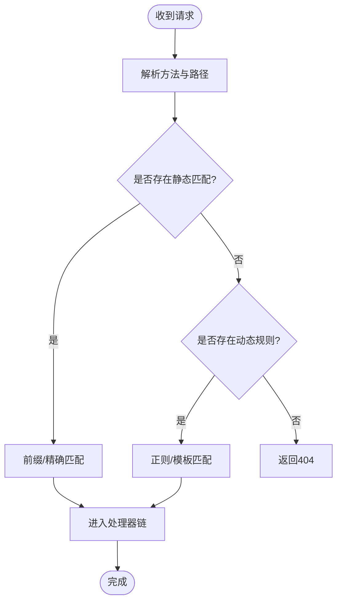
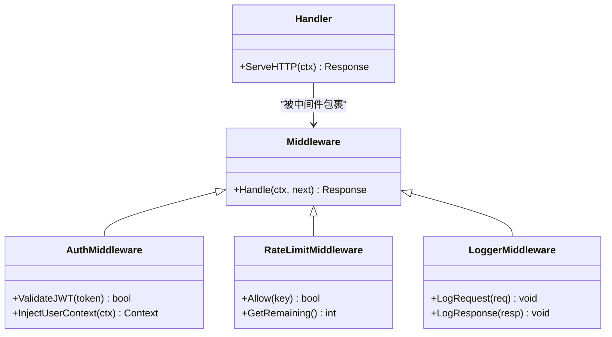
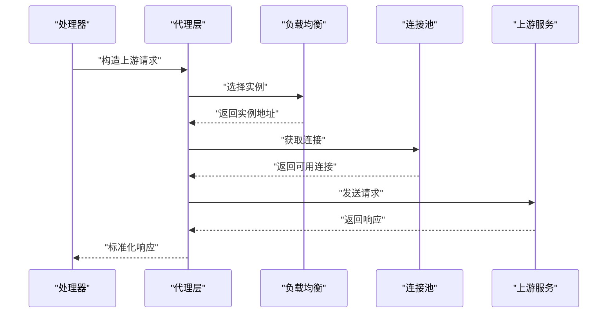
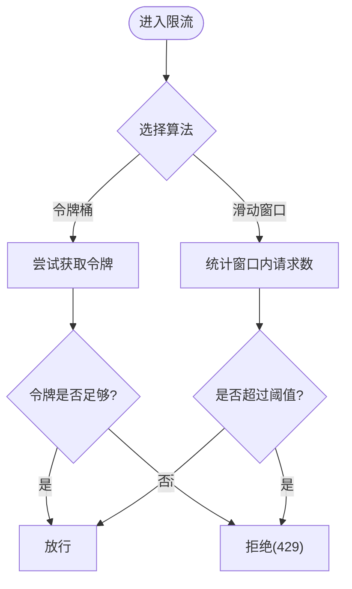
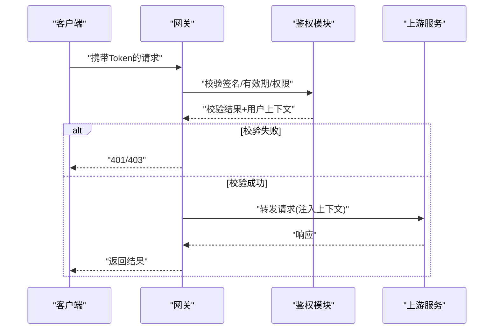
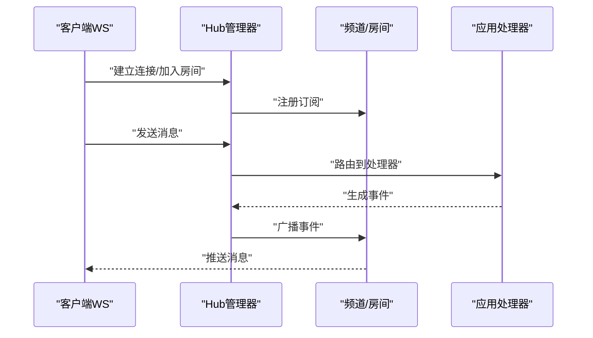
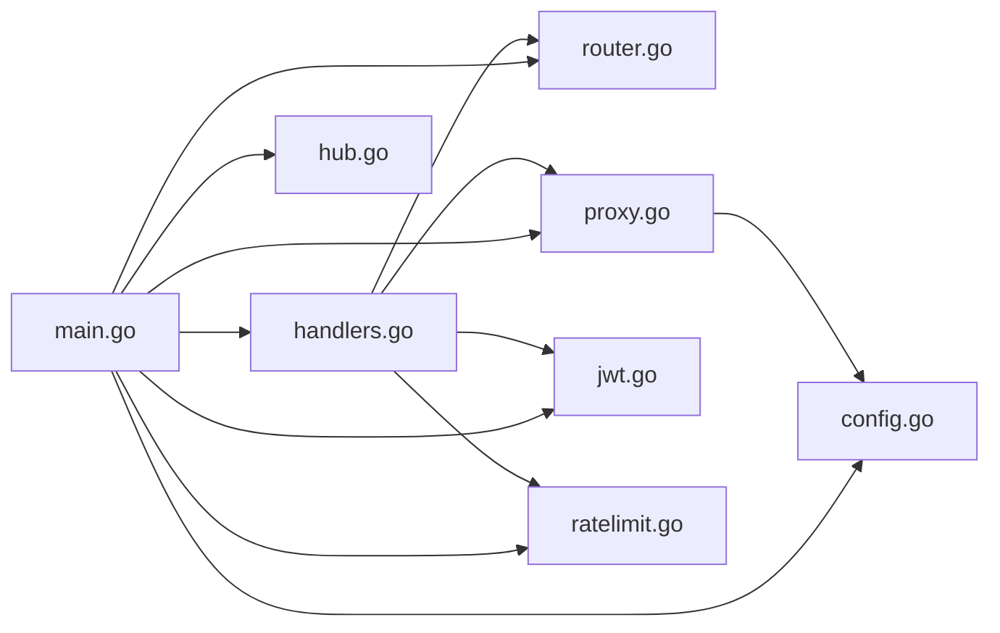

# API网关服务设计

<cite>
**本文引用的文件**   
- [backend_design/nexus_gate/cmd/main.go](file://backend_design/nexus_gate/cmd/main.go)
- [backend_design/nexus_gate/internal/config/config.go](file://backend_design/nexus_gate/internal/config/config.go)
- [backend_design/nexus_gate/internal/router/router.go](file://backend_design/nexus_gate/internal/router/router.go)
- [backend_design/nexus_gate/internal/handlers/handlers.go](file://backend_design/nexus_gate/internal/handlers/handlers.go)
- [backend_design/nexus_gate/internal/proxy/proxy.go](file://backend_design/nexus_gate/internal/proxy/proxy.go)
- [backend_design/nexus_gate/internal/auth/jwt.go](file://backend_design/nexus_gate/internal/auth/jwt.go)
- [backend_design/nexus_gate/internal/ratelimit/ratelimit.go](file://backend_design/nexus_gate/internal/ratelimit/ratelimit.go)
- [backend_design/nexus_gate/internal/ws/hub.go](file://backend_design/nexus_gate/internal/ws/hub.go)
- [backend_design/nexus_gate/proto/nexus.proto](file://backend_design/nexus_gate/proto/nexus.proto)
- [backend_design/nexus_gate/go.mod](file://backend_design/nexus_gate/go.mod)
</cite>

## 目录
1. [简介](#简介)
2. [项目结构](#项目结构)
3. [核心组件](#核心组件)
4. [架构总览](#架构总览)
5. [详细组件分析](#详细组件分析)
6. [依赖关系分析](#依赖关系分析)
7. [性能考虑](#性能考虑)
8. [故障排查指南](#故障排查指南)
9. [结论](#结论)
10. [附录](#附录)

## 简介
本文件面向API网关服务 nexus_gate 的设计与实现，聚焦Go语言实现的请求路由、负载均衡、连接池管理、限流熔断、JWT认证授权、WebSocket实时通信、配置管理、错误处理与日志记录、性能优化与监控指标收集等关键主题。文档以代码级视角展开，提供架构图、时序图与流程图，帮助读者快速理解并落地使用。

## 项目结构
nexus_gate 采用分层模块化组织：入口命令、配置加载、路由分发、处理器、反向代理、鉴权、限流、WebSocket Hub、gRPC协议定义等模块职责清晰、耦合度低。

图示来源
- [backend_design/nexus_gate/cmd/main.go](file://backend_design/nexus_gate/cmd/main.go)
- [backend_design/nexus_gate/internal/config/config.go](file://backend_design/nexus_gate/internal/config/config.go)
- [backend_design/nexus_gate/internal/router/router.go](file://backend_design/nexus_gate/internal/router/router.go)
- [backend_design/nexus_gate/internal/handlers/handlers.go](file://backend_design/nexus_gate/internal/handlers/handlers.go)
- [backend_design/nexus_gate/internal/proxy/proxy.go](file://backend_design/nexus_gate/internal/proxy/proxy.go)
- [backend_design/nexus_gate/internal/auth/jwt.go](file://backend_design/nexus_gate/internal/auth/jwt.go)
- [backend_design/nexus_gate/internal/ratelimit/ratelimit.go](file://backend_design/nexus_gate/internal/ratelimit/ratelimit.go)
- [backend_design/nexus_gate/internal/ws/hub.go](file://backend_design/nexus_gate/internal/ws/hub.go)
- [backend_design/nexus_gate/proto/nexus.proto](file://backend_design/nexus_gate/proto/nexus.proto)

章节来源
- [backend_design/nexus_gate/cmd/main.go](file://backend_design/nexus_gate/cmd/main.go)
- [backend_design/nexus_gate/internal/config/config.go](file://backend_design/nexus_gate/internal/config/config.go)
- [backend_design/nexus_gate/internal/router/router.go](file://backend_design/nexus_gate/internal/router/router.go)
- [backend_design/nexus_gate/internal/handlers/handlers.go](file://backend_design/nexus_gate/internal/handlers/handlers.go)
- [backend_design/nexus_gate/internal/proxy/proxy.go](file://backend_design/nexus_gate/internal/proxy/proxy.go)
- [backend_design/nexus_gate/internal/auth/jwt.go](file://backend_design/nexus_gate/internal/auth/jwt.go)
- [backend_design/nexus_gate/internal/ratelimit/ratelimit.go](file://backend_design/nexus_gate/internal/ratelimit/ratelimit.go)
- [backend_design/nexus_gate/internal/ws/hub.go](file://backend_design/nexus_gate/internal/ws/hub.go)
- [backend_design/nexus_gate/proto/nexus.proto](file://backend_design/nexus_gate/proto/nexus.proto)

## 核心组件
- 配置中心：集中加载运行时配置（端口、上游服务列表、鉴权密钥、限流参数、WebSocket开关等），支持热更新扩展点。
- 路由引擎：维护静态路径映射与动态规则（如正则或模板匹配），按优先级与最长前缀策略进行匹配。
- 处理器与中间件：统一编排鉴权、限流、日志、追踪、CORS等横切能力。
- 反向代理与连接池：基于HTTP客户端复用连接，支持健康检查与失败重试；可选gRPC透传。
- 鉴权模块：JWT签发与校验，将用户上下文注入请求上下文。
- 限流模块：令牌桶与滑动窗口两种算法，支持全局与租户维度。
- WebSocket Hub：连接集合管理、房间广播、心跳保活与断线重连提示。
- gRPC协议：通过 proto 定义跨服务契约，供代理层调用。

章节来源
- [backend_design/nexus_gate/internal/config/config.go](file://backend_design/nexus_gate/internal/config/config.go)
- [backend_design/nexus_gate/internal/router/router.go](file://backend_design/nexus_gate/internal/router/router.go)
- [backend_design/nexus_gate/internal/handlers/handlers.go](file://backend_design/nexus_gate/internal/handlers/handlers.go)
- [backend_design/nexus_gate/internal/proxy/proxy.go](file://backend_design/nexus_gate/internal/proxy/proxy.go)
- [backend_design/nexus_gate/internal/auth/jwt.go](file://backend_design/nexus_gate/internal/auth/jwt.go)
- [backend_design/nexus_gate/internal/ratelimit/ratelimit.go](file://backend_design/nexus_gate/internal/ratelimit/ratelimit.go)
- [backend_design/nexus_gate/internal/ws/hub.go](file://backend_design/nexus_gate/internal/ws/hub.go)
- [backend_design/nexus_gate/proto/nexus.proto](file://backend_design/nexus_gate/proto/nexus.proto)

## 架构总览
整体采用“入口-中间件-路由-处理器-代理”的流水线模型，结合可插拔的鉴权、限流、日志与WebSocket能力。

图示来源
- [backend_design/nexus_gate/cmd/main.go](file://backend_design/nexus_gate/cmd/main.go)
- [backend_design/nexus_gate/internal/handlers/handlers.go](file://backend_design/nexus_gate/internal/handlers/handlers.go)
- [backend_design/nexus_gate/internal/router/router.go](file://backend_design/nexus_gate/internal/router/router.go)
- [backend_design/nexus_gate/internal/proxy/proxy.go](file://backend_design/nexus_gate/internal/proxy/proxy.go)

## 详细组件分析

### 配置管理
- 功能要点
  - 集中读取环境变量与配置文件，提供默认值与类型安全解析。
  - 暴露结构化配置对象给各模块使用（如监听端口、上游服务列表、JWT密钥、限流阈值、WebSocket开关）。
  - 支持在运行期重新加载（可扩展）以配合外部配置中心。
- 设计模式
  - 单例配置对象 + 工厂初始化，避免重复IO。
  - 配置项分组命名空间，便于多环境隔离。
- 典型字段
  - server: 监听地址、TLS证书、最大请求体大小
  - upstreams: 服务名到URL/端点的映射
  - auth: JWT签名密钥、过期时间、颁发者
  - ratelimit: 令牌桶容量/速率、滑动窗口大小/阈值
  - ws: 最大连接数、心跳间隔、房间上限
- 示例配置模板（节选）
  - 见 [backend_design/nexus_gate/internal/config/config.go](file://backend_design/nexus_gate/internal/config/config.go)

章节来源
- [backend_design/nexus_gate/internal/config/config.go](file://backend_design/nexus_gate/internal/config/config.go)

### 路由机制（静态与动态）
- 静态路由
  - 基于精确路径或前缀匹配，适合稳定API版本与资源型接口。
  - 支持方法过滤（GET/POST/PUT/DELETE）与路径参数提取。
- 动态路由
  - 基于正则或模板规则，用于多租户、插件化或按特征分发的场景。
  - 匹配顺序遵循“最长前缀优先”，正则规则置于静态之后。
- 路由表构建
  - 启动时从配置或注册中心加载，构建索引树以提升匹配效率。
  - 支持运行时增量更新（需保证并发安全）。
- 复杂度
  - 静态前缀树匹配近似 O(L)，L为路径长度。
  - 正则匹配最坏 O(N·M)，建议控制规则数量与复杂度。

图示来源
- [backend_design/nexus_gate/internal/router/router.go](file://backend_design/nexus_gate/internal/router/router.go)

章节来源
- [backend_design/nexus_gate/internal/router/router.go](file://backend_design/nexus_gate/internal/router/router.go)

### 处理器与中间件
- 中间件链
  - 鉴权：校验JWT签名、有效期、角色/权限，失败直接返回401/403。
  - 限流：令牌桶/滑动窗口计数，超限返回429。
  - 日志与追踪：记录请求ID、耗时、状态码、上游延迟。
  - CORS与安全头：统一设置跨域与安全策略。
- 处理器
  - 负责具体业务逻辑组装，调用代理层访问上游服务。
  - 对异常进行规范化封装，输出统一错误格式。

图示来源
- [backend_design/nexus_gate/internal/handlers/handlers.go](file://backend_design/nexus_gate/internal/handlers/handlers.go)
- [backend_design/nexus_gate/internal/auth/jwt.go](file://backend_design/nexus_gate/internal/auth/jwt.go)
- [backend_design/nexus_gate/internal/ratelimit/ratelimit.go](file://backend_design/nexus_gate/internal/ratelimit/ratelimit.go)

章节来源
- [backend_design/nexus_gate/internal/handlers/handlers.go](file://backend_design/nexus_gate/internal/handlers/handlers.go)
- [backend_design/nexus_gate/internal/auth/jwt.go](file://backend_design/nexus_gate/internal/auth/jwt.go)
- [backend_design/nexus_gate/internal/ratelimit/ratelimit.go](file://backend_design/nexus_gate/internal/ratelimit/ratelimit.go)

### 反向代理与连接池
- 连接池
  - 基于HTTP客户端连接复用，减少握手开销。
  - 支持空闲连接回收、最大连接数限制、Keep-Alive策略。
- 负载均衡
  - 轮询/加权轮询/最少连接数策略，按服务实例健康状态剔除。
  - 失败重试与退避策略，提升鲁棒性。
- gRPC透传
  - 根据 proto 定义，将特定路径转为gRPC调用，降低序列化成本。
- 超时与熔断
  - 请求级超时、连接级超时、读/写超时。
  - 熔断器基于错误率/慢调用比例自动降级。

图示来源
- [backend_design/nexus_gate/internal/proxy/proxy.go](file://backend_design/nexus_gate/internal/proxy/proxy.go)
- [backend_design/nexus_gate/proto/nexus.proto](file://backend_design/nexus_gate/proto/nexus.proto)

章节来源
- [backend_design/nexus_gate/internal/proxy/proxy.go](file://backend_design/nexus_gate/internal/proxy/proxy.go)
- [backend_design/nexus_gate/proto/nexus.proto](file://backend_design/nexus_gate/proto/nexus.proto)

### 限流与熔断
- 令牌桶算法
  - 固定速率填充令牌，请求消耗令牌，不足则拒绝。
  - 适用于突发流量平滑与长期稳定吞吐控制。
- 滑动窗口算法
  - 统计最近N秒内的请求数，超过阈值则拒绝。
  - 更贴近瞬时峰值保护，适合短周期限流。
- 熔断器
  - 基于连续失败次数或错误率触发半开探测，逐步恢复。
  - 与重试和退避配合，避免雪崩。

图示来源
- [backend_design/nexus_gate/internal/ratelimit/ratelimit.go](file://backend_design/nexus_gate/internal/ratelimit/ratelimit.go)

章节来源
- [backend_design/nexus_gate/internal/ratelimit/ratelimit.go](file://backend_design/nexus_gate/internal/ratelimit/ratelimit.go)

### JWT认证与授权
- 流程
  - 登录成功后签发JWT（含用户标识、角色、过期时间）。
  - 网关校验签名、有效期与声明，失败返回401/403。
  - 成功则将用户上下文注入请求上下文，供下游使用。
- 安全要点
  - 使用强随机密钥与合理过期时间。
  - 敏感信息不放入JWT载荷。
  - 支持刷新令牌与黑名单（可选）。

图示来源
- [backend_design/nexus_gate/internal/auth/jwt.go](file://backend_design/nexus_gate/internal/auth/jwt.go)
- [backend_design/nexus_gate/internal/handlers/handlers.go](file://backend_design/nexus_gate/internal/handlers/handlers.go)

章节来源
- [backend_design/nexus_gate/internal/auth/jwt.go](file://backend_design/nexus_gate/internal/auth/jwt.go)
- [backend_design/nexus_gate/internal/handlers/handlers.go](file://backend_design/nexus_gate/internal/handlers/handlers.go)

### WebSocket连接管理与实时通信
- 连接管理
  - Hub维护所有活跃连接，支持按房间/频道订阅与广播。
  - 心跳检测与断线清理，防止僵尸连接。
- 消息模型
  - 统一消息帧结构，包含类型、目标、负载与序列号。
  - 支持幂等与去重（基于序列号）。
- 背压与限流
  - 针对单个连接与全局通道进行限速，避免内存暴涨。

图示来源
- [backend_design/nexus_gate/internal/ws/hub.go](file://backend_design/nexus_gate/internal/ws/hub.go)

章节来源
- [backend_design/nexus_gate/internal/ws/hub.go](file://backend_design/nexus_gate/internal/ws/hub.go)

### gRPC协议集成
- 通过 proto 定义服务契约，网关可将HTTP请求转换为gRPC调用，提升性能与类型安全。
- 支持元数据透传（如trace_id、用户上下文）。

章节来源
- [backend_design/nexus_gate/proto/nexus.proto](file://backend_design/nexus_gate/proto/nexus.proto)

## 依赖关系分析
- 内部依赖
  - main 初始化配置、路由、处理器、代理、鉴权、限流、WebSocket。
  - handlers 依赖 router、auth、ratelimit、proxy。
  - proxy 依赖 config（上游列表）、负载均衡策略。
  - ws 独立于HTTP链路，但可与处理器协作。
- 外部依赖
  - Go标准库网络栈、JSON/Protobuf编解码、可选Redis（会话/缓存/分布式限流）。
- 潜在循环依赖
  - 通过接口抽象与依赖注入避免循环引用。

图示来源
- [backend_design/nexus_gate/cmd/main.go](file://backend_design/nexus_gate/cmd/main.go)
- [backend_design/nexus_gate/internal/config/config.go](file://backend_design/nexus_gate/internal/config/config.go)
- [backend_design/nexus_gate/internal/router/router.go](file://backend_design/nexus_gate/internal/router/router.go)
- [backend_design/nexus_gate/internal/handlers/handlers.go](file://backend_design/nexus_gate/internal/handlers/handlers.go)
- [backend_design/nexus_gate/internal/proxy/proxy.go](file://backend_design/nexus_gate/internal/proxy/proxy.go)
- [backend_design/nexus_gate/internal/auth/jwt.go](file://backend_design/nexus_gate/internal/auth/jwt.go)
- [backend_design/nexus_gate/internal/ratelimit/ratelimit.go](file://backend_design/nexus_gate/internal/ratelimit/ratelimit.go)
- [backend_design/nexus_gate/internal/ws/hub.go](file://backend_design/nexus_gate/internal/ws/hub.go)

章节来源
- [backend_design/nexus_gate/cmd/main.go](file://backend_design/nexus_gate/cmd/main.go)
- [backend_design/nexus_gate/go.mod](file://backend_design/nexus_gate/go.mod)

## 性能考虑
- 连接复用与长连接
  - HTTP Keep-Alive、gRPC连接复用，减少握手与TLS开销。
- 路由匹配优化
  - 静态前缀树优先，正则规则最小化与预编译。
- 异步与批处理
  - 非关键路径异步落盘日志与指标上报。
- 背压与限流
  - 全局与连接级双限流，避免OOM。
- 超时与熔断
  - 细粒度超时控制，快速失败与回退策略。
- 监控指标
  - QPS、延迟分布、错误率、连接数、令牌剩余、熔断状态、gRPC调用成功率。

[本节为通用指导，无需源码引用]

## 故障排查指南
- 常见问题
  - 鉴权失败：检查JWT密钥、过期时间与签名算法。
  - 限流频繁：调整令牌桶容量/速率或滑动窗口阈值。
  - 上游超时：检查连接池大小、上游健康与网络质量。
  - WebSocket掉线：确认心跳间隔与防火墙策略。
- 定位手段
  - 启用请求ID与全链路追踪。
  - 查看网关日志与上游服务日志关联。
  - 导出Prometheus指标与告警规则。

章节来源
- [backend_design/nexus_gate/internal/auth/jwt.go](file://backend_design/nexus_gate/internal/auth/jwt.go)
- [backend_design/nexus_gate/internal/ratelimit/ratelimit.go](file://backend_design/nexus_gate/internal/ratelimit/ratelimit.go)
- [backend_design/nexus_gate/internal/proxy/proxy.go](file://backend_design/nexus_gate/internal/proxy/proxy.go)
- [backend_design/nexus_gate/internal/ws/hub.go](file://backend_design/nexus_gate/internal/ws/hub.go)

## 结论
nexus_gate 以清晰的模块化设计与可插拔中间件体系，实现了高可用的API网关能力。通过静态/动态路由、连接池与负载均衡、令牌桶/滑动窗口限流与熔断、JWT鉴权与WebSocket实时通信，满足复杂生产环境的网关需求。配合完善的配置管理、错误处理与监控指标，可在保障稳定性的同时获得良好的性能表现。

[本节为总结性内容，无需源码引用]

## 附录

### 配置模板（节选）
- 服务器
  - listen_addr: 监听地址
  - tls_cert/tls_key: TLS证书与私钥
  - max_body_size: 最大请求体大小
- 上游服务
  - services: 服务名到端点的映射
- 鉴权
  - jwt_secret: 签名密钥
  - jwt_expire: 过期时间
- 限流
  - token_bucket_capacity/rate: 令牌桶容量与速率
  - sliding_window_size/threshold: 窗口大小与阈值
- WebSocket
  - enabled: 是否启用
  - max_connections: 最大连接数
  - heartbeat_interval: 心跳间隔

章节来源
- [backend_design/nexus_gate/internal/config/config.go](file://backend_design/nexus_gate/internal/config/config.go)

### 关键代码片段路径
- 入口与生命周期
  - [backend_design/nexus_gate/cmd/main.go](file://backend_design/nexus_gate/cmd/main.go)
- 配置加载
  - [backend_design/nexus_gate/internal/config/config.go](file://backend_design/nexus_gate/internal/config/config.go)
- 路由注册与匹配
  - [backend_design/nexus_gate/internal/router/router.go](file://backend_design/nexus_gate/internal/router/router.go)
- 处理器与中间件
  - [backend_design/nexus_gate/internal/handlers/handlers.go](file://backend_design/nexus_gate/internal/handlers/handlers.go)
- 反向代理与连接池
  - [backend_design/nexus_gate/internal/proxy/proxy.go](file://backend_design/nexus_gate/internal/proxy/proxy.go)
- JWT鉴权
  - [backend_design/nexus_gate/internal/auth/jwt.go](file://backend_design/nexus_gate/internal/auth/jwt.go)
- 限流实现
  - [backend_design/nexus_gate/internal/ratelimit/ratelimit.go](file://backend_design/nexus_gate/internal/ratelimit/ratelimit.go)
- WebSocket Hub
  - [backend_design/nexus_gate/internal/ws/hub.go](file://backend_design/nexus_gate/internal/ws/hub.go)
- gRPC协议定义
  - [backend_design/nexus_gate/proto/nexus.proto](file://backend_design/nexus_gate/proto/nexus.proto)
- 依赖清单
  - [backend_design/nexus_gate/go.mod](file://backend_design/nexus_gate/go.mod)