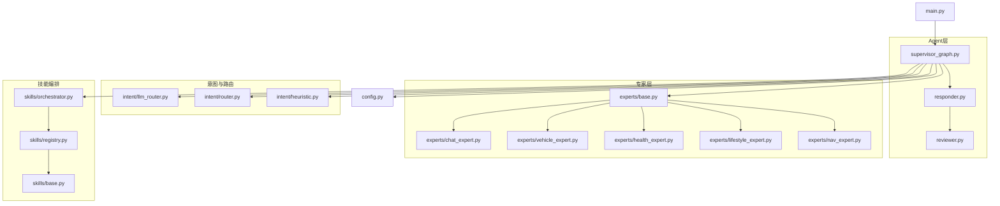
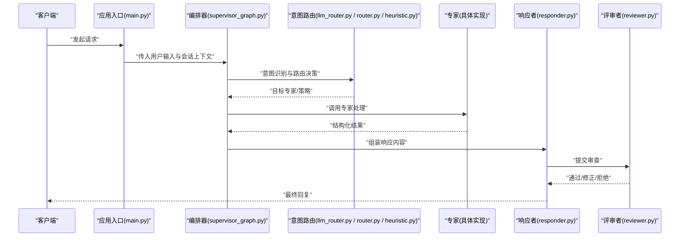
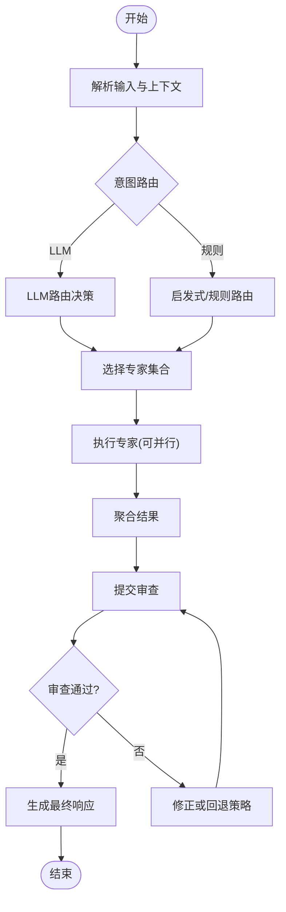
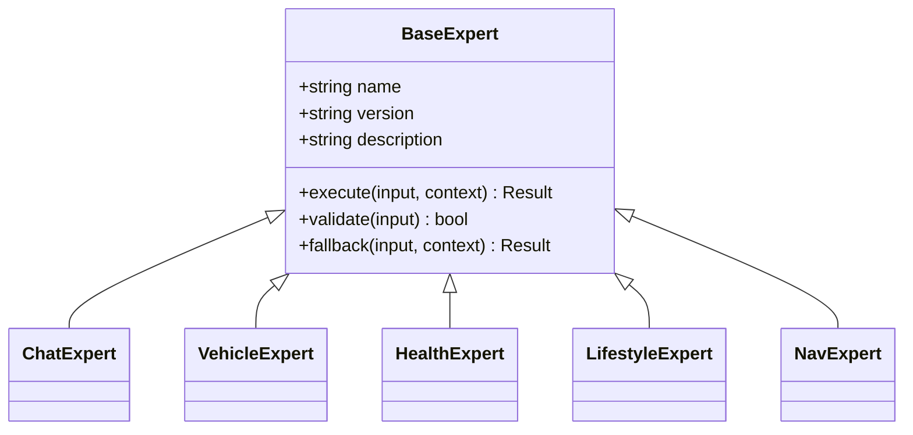
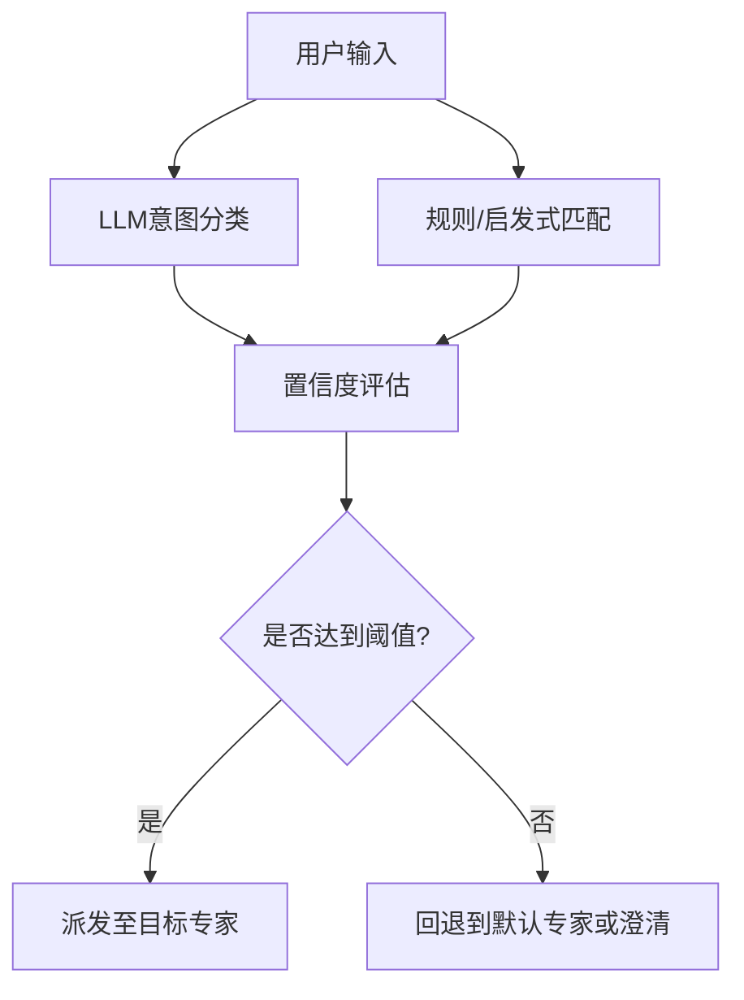
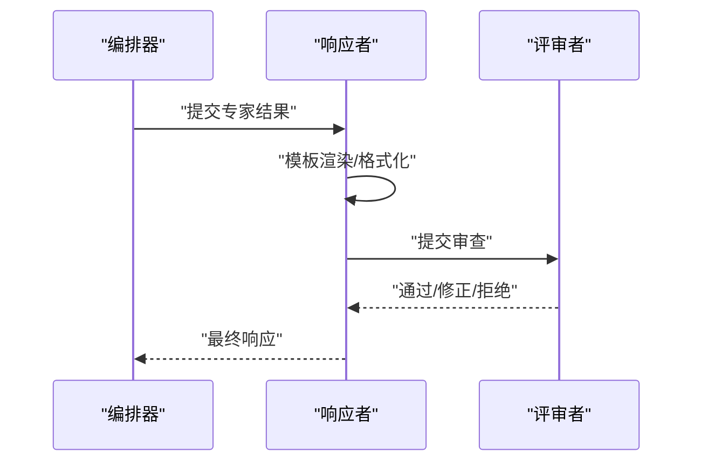
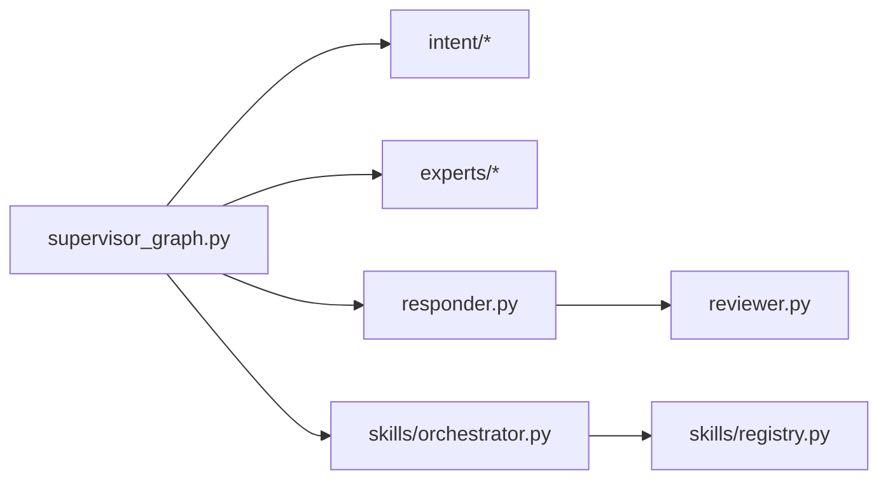

# Agent系统架构设计

<cite>
**本文引用的文件**   
- [supervisor_graph.py](file://backend_design/nexus/agent/supervisor_graph.py)
- [responder.py](file://backend_design/nexus/agent/responder.py)
- [reviewer.py](file://backend_design/nexus/agent/reviewer.py)
- [base.py](file://backend_design/nexus/agent/experts/base.py)
- [chat_expert.py](file://backend_design/nexus/agent/experts/chat_expert.py)
- [vehicle_expert.py](file://backend_design/nexus/agent/experts/vehicle_expert.py)
- [health_expert.py](file://backend_design/nexus/agent/experts/health_expert.py)
- [lifestyle_expert.py](file://backend_design/nexus/agent/experts/lifestyle_expert.py)
- [nav_expert.py](file://backend_design/nexus/agent/experts/nav_expert.py)
- [__init__.py](file://backend_design/nexus/agent/__init__.py)
- [llm_router.py](file://backend_design/nexus/intent/llm_router.py)
- [router.py](file://backend_design/nexus/intent/router.py)
- [heuristic.py](file://backend_design/nexus/intent/heuristic.py)
- [orchestrator.py](file://backend_design/nexus/skills/orchestrator.py)
- [registry.py](file://backend_design/nexus/skills/registry.py)
- [base.py](file://backend_design/nexus/skills/base.py)
- [config.py](file://backend_design/nexus/config.py)
- [main.py](file://backend_design/nexus/main.py)
</cite>

## 目录
1. [简介](#简介)
2. [项目结构](#项目结构)
3. [核心组件](#核心组件)
4. [架构总览](#架构总览)
5. [详细组件分析](#详细组件分析)
6. [依赖关系分析](#依赖关系分析)
7. [性能考虑](#性能考虑)
8. [故障排查指南](#故障排查指南)
9. [结论](#结论)
10. [附录](#附录)

## 简介
本文件面向Agent系统的多专家架构设计与实现，重点阐述以下方面：
- 多专家架构理念与职责划分
- supervisor_graph的协调机制与状态流转
- 专家路由逻辑与任务分发策略（含LLM路由、启发式规则）
- 具体专家实现原理（chat_expert、vehicle_expert、health_expert等）
- responder响应生成流程与reviewer质量审查机制
- 专家扩展接口与自定义专家开发指南
- 专家间通信协议与状态同步机制
- 调用示例与性能优化建议

## 项目结构
Agent相关代码位于后端模块的nexus子包中，围绕“编排器—专家—响应者—评审者”的分层组织。关键路径如下：
- agent：编排与执行入口（supervisor_graph）、响应生成（responder）、质量审查（reviewer）
- experts：各领域专家基类与具体实现
- intent：意图识别与路由（LLM路由、启发式规则）
- skills：技能编排与注册中心（与专家协作）
- config/main：配置与启动入口

图表来源
- [supervisor_graph.py](file://backend_design/nexus/agent/supervisor_graph.py)
- [responder.py](file://backend_design/nexus/agent/responder.py)
- [reviewer.py](file://backend_design/nexus/agent/reviewer.py)
- [base.py](file://backend_design/nexus/agent/experts/base.py)
- [chat_expert.py](file://backend_design/nexus/agent/experts/chat_expert.py)
- [vehicle_expert.py](file://backend_design/nexus/agent/experts/vehicle_expert.py)
- [health_expert.py](file://backend_design/nexus/agent/experts/health_expert.py)
- [lifestyle_expert.py](file://backend_design/nexus/agent/experts/lifestyle_expert.py)
- [nav_expert.py](file://backend_design/nexus/agent/experts/nav_expert.py)
- [llm_router.py](file://backend_design/nexus/intent/llm_router.py)
- [router.py](file://backend_design/nexus/intent/router.py)
- [heuristic.py](file://backend_design/nexus/intent/heuristic.py)
- [orchestrator.py](file://backend_design/nexus/skills/orchestrator.py)
- [registry.py](file://backend_design/nexus/skills/registry.py)
- [base.py](file://backend_design/nexus/skills/base.py)
- [config.py](file://backend_design/nexus/config.py)
- [main.py](file://backend_design/nexus/main.py)

章节来源
- [supervisor_graph.py](file://backend_design/nexus/agent/supervisor_graph.py)
- [responder.py](file://backend_design/nexus/agent/responder.py)
- [reviewer.py](file://backend_design/nexus/agent/reviewer.py)
- [base.py](file://backend_design/nexus/agent/experts/base.py)
- [chat_expert.py](file://backend_design/nexus/agent/experts/chat_expert.py)
- [vehicle_expert.py](file://backend_design/nexus/agent/experts/vehicle_expert.py)
- [health_expert.py](file://backend_design/nexus/agent/experts/health_expert.py)
- [lifestyle_expert.py](file://backend_design/nexus/agent/experts/lifestyle_expert.py)
- [nav_expert.py](file://backend_design/nexus/agent/experts/nav_expert.py)
- [llm_router.py](file://backend_design/nexus/intent/llm_router.py)
- [router.py](file://backend_design/nexus/intent/router.py)
- [heuristic.py](file://backend_design/nexus/intent/heuristic.py)
- [orchestrator.py](file://backend_design/nexus/skills/orchestrator.py)
- [registry.py](file://backend_design/nexus/skills/registry.py)
- [base.py](file://backend_design/nexus/skills/base.py)
- [config.py](file://backend_design/nexus/config.py)
- [main.py](file://backend_design/nexus/main.py)

## 核心组件
- 编排器（supervisor_graph）
  - 负责接收用户输入、意图识别、选择并调度专家、聚合结果、驱动响应生成与质量审查。
  - 维护会话上下文与状态，协调多专家并行或串行执行。
- 专家基类与具体专家
  - 提供统一的专家接口（输入/输出契约、元数据、错误处理）。
  - chat_expert：通用对话与知识问答；vehicle_expert：车辆控制与状态查询；health_expert：健康指标与建议；lifestyle_expert：生活方式建议；nav_expert：导航与位置服务。
- 响应者（responder）
  - 将专家结构化输出转换为最终回复（文本/语音/卡片），支持模板化与个性化。
- 评审者（reviewer）
  - 对候选回复进行安全、合规、一致性、可读性等维度的审查与修正。
- 意图与路由
  - llm_router：基于大模型的意图分类与路由决策。
  - router/heuristic：基于规则的快速路由与兜底策略。
- 技能编排与注册
  - orchestrator/registry/base：技能生命周期管理、动态发现与编排，供专家在需要时调用。

章节来源
- [supervisor_graph.py](file://backend_design/nexus/agent/supervisor_graph.py)
- [base.py](file://backend_design/nexus/agent/experts/base.py)
- [chat_expert.py](file://backend_design/nexus/agent/experts/chat_expert.py)
- [vehicle_expert.py](file://backend_design/nexus/agent/experts/vehicle_expert.py)
- [health_expert.py](file://backend_design/nexus/agent/experts/health_expert.py)
- [lifestyle_expert.py](file://backend_design/nexus/agent/experts/lifestyle_expert.py)
- [nav_expert.py](file://backend_design/nexus/agent/experts/nav_expert.py)
- [responder.py](file://backend_design/nexus/agent/responder.py)
- [reviewer.py](file://backend_design/nexus/agent/reviewer.py)
- [llm_router.py](file://backend_design/nexus/intent/llm_router.py)
- [router.py](file://backend_design/nexus/intent/router.py)
- [heuristic.py](file://backend_design/nexus/intent/heuristic.py)
- [orchestrator.py](file://backend_design/nexus/skills/orchestrator.py)
- [registry.py](file://backend_design/nexus/skills/registry.py)
- [base.py](file://backend_design/nexus/skills/base.py)

## 架构总览
下图展示了从请求进入至最终响应的端到端流程，包括意图识别、专家调度、响应生成与质量审查。

图表来源
- [main.py](file://backend_design/nexus/main.py)
- [supervisor_graph.py](file://backend_design/nexus/agent/supervisor_graph.py)
- [llm_router.py](file://backend_design/nexus/intent/llm_router.py)
- [router.py](file://backend_design/nexus/intent/router.py)
- [heuristic.py](file://backend_design/nexus/intent/heuristic.py)
- [responder.py](file://backend_design/nexus/agent/responder.py)
- [reviewer.py](file://backend_design/nexus/agent/reviewer.py)

## 详细组件分析

### 编排器（supervisor_graph）与协调机制
- 职责
  - 解析输入、加载上下文、触发意图路由、选择专家、管理并发与超时、聚合结果、驱动响应与审查。
- 状态流转
  - 典型状态：待路由→已路由→执行中→聚合中→审查中→完成/失败。
- 并发与容错
  - 支持并行调用多个专家（如同时获取车辆状态与健康指标），具备熔断与降级策略，确保整体可用性。
- 与外部集成
  - 通过技能编排器访问外部能力（如车辆API、知识库检索），并通过配置中心加载模型与路由参数。

图表来源
- [supervisor_graph.py](file://backend_design/nexus/agent/supervisor_graph.py)
- [llm_router.py](file://backend_design/nexus/intent/llm_router.py)
- [router.py](file://backend_design/nexus/intent/router.py)
- [heuristic.py](file://backend_design/nexus/intent/heuristic.py)

章节来源
- [supervisor_graph.py](file://backend_design/nexus/agent/supervisor_graph.py)

### 专家基类与具体专家

#### 专家基类（experts/base.py）
- 统一接口
  - 定义专家元数据（名称、版本、描述、能力标签）、输入校验、执行方法、错误码与重试策略。
- 扩展点
  - 提供钩子用于日志埋点、指标上报、缓存命中检测、降级开关。
- 状态与通信
  - 通过上下文对象传递会话ID、用户偏好、设备信息；专家间通过共享上下文进行轻量通信。

图表来源
- [base.py](file://backend_design/nexus/agent/experts/base.py)
- [chat_expert.py](file://backend_design/nexus/agent/experts/chat_expert.py)
- [vehicle_expert.py](file://backend_design/nexus/agent/experts/vehicle_expert.py)
- [health_expert.py](file://backend_design/nexus/agent/experts/health_expert.py)
- [lifestyle_expert.py](file://backend_design/nexus/agent/experts/lifestyle_expert.py)
- [nav_expert.py](file://backend_design/nexus/agent/experts/nav_expert.py)

章节来源
- [base.py](file://backend_design/nexus/agent/experts/base.py)
- [chat_expert.py](file://backend_design/nexus/agent/experts/chat_expert.py)
- [vehicle_expert.py](file://backend_design/nexus/agent/experts/vehicle_expert.py)
- [health_expert.py](file://backend_design/nexus/agent/experts/health_expert.py)
- [lifestyle_expert.py](file://backend_design/nexus/agent/experts/lifestyle_expert.py)
- [nav_expert.py](file://backend_design/nexus/agent/experts/nav_expert.py)

#### 聊天专家（chat_expert.py）
- 功能
  - 通用对话、知识问答、澄清问题、引导下一步操作。
- 特点
  - 结合提示词模板与记忆摘要，提升连贯性与个性化。
- 交互
  - 可与知识库检索、历史对话摘要协同工作。

章节来源
- [chat_expert.py](file://backend_design/nexus/agent/experts/chat_expert.py)

#### 车辆专家（vehicle_expert.py）
- 功能
  - 车辆状态查询、空调/座椅/车窗控制、媒体播放、导航设置等。
- 集成
  - 通过车辆网关或MCP通道调用底层设备能力，具备权限校验与安全沙箱。
- 可靠性
  - 针对设备不可用场景提供降级策略（返回只读状态或提示离线）。

章节来源
- [vehicle_expert.py](file://backend_design/nexus/agent/experts/vehicle_expert.py)

#### 健康专家（health_expert.py）
- 功能
  - 健康指标解读、运动与饮食建议、异常预警与就医指引。
- 数据源
  - 对接健康数据平台与个人偏好，遵循隐私保护与最小可用原则。
- 合规
  - 输出需经评审者严格审查，避免医疗建议风险。

章节来源
- [health_expert.py](file://backend_design/nexus/agent/experts/health_expert.py)

#### 生活方式专家（lifestyle_expert.py）与导航专家（nav_expert.py）
- 生活方式专家
  - 睡眠、作息、习惯养成建议，结合日程与地理位置上下文。
- 导航专家
  - 路线规划、POI推荐、实时路况整合，与车载导航系统联动。

章节来源
- [lifestyle_expert.py](file://backend_design/nexus/agent/experts/lifestyle_expert.py)
- [nav_expert.py](file://backend_design/nexus/agent/experts/nav_expert.py)

### 意图识别与专家路由
- LLM路由（llm_router.py）
  - 使用大模型对输入进行意图分类，输出目标专家或专家组合及必要参数。
- 规则路由（router.py / heuristic.py）
  - 基于关键词、正则、优先级表进行快速匹配，作为LLM路由的补充与兜底。
- 决策融合
  - 编排器综合LLM与规则结果，必要时引入置信度阈值与人工干预标记。

图表来源
- [llm_router.py](file://backend_design/nexus/intent/llm_router.py)
- [router.py](file://backend_design/nexus/intent/router.py)
- [heuristic.py](file://backend_design/nexus/intent/heuristic.py)

章节来源
- [llm_router.py](file://backend_design/nexus/intent/llm_router.py)
- [router.py](file://backend_design/nexus/intent/router.py)
- [heuristic.py](file://backend_design/nexus/intent/heuristic.py)

### 响应生成（responder.py）与质量审查（reviewer.py）
- 响应生成
  - 将专家的结构化结果渲染为多模态输出（文本、语音、卡片），支持模板变量注入与个性化风格。
- 质量审查
  - 安全过滤（敏感词、越权指令）、一致性检查（与上下文冲突）、可读性评分、合规性校验。
- 修正与回退
  - 对不通过项进行自动修正或降级策略（如简化回答、转交通用专家）。

图表来源
- [responder.py](file://backend_design/nexus/agent/responder.py)
- [reviewer.py](file://backend_design/nexus/agent/reviewer.py)

章节来源
- [responder.py](file://backend_design/nexus/agent/responder.py)
- [reviewer.py](file://backend_design/nexus/agent/reviewer.py)

### 专家间的通信协议与状态同步
- 通信协议
  - 基于上下文对象的键值约定（如会话ID、用户偏好、设备状态、中间结果引用），避免直接耦合。
- 状态同步
  - 共享上下文由编排器维护，专家读取/更新受控字段；关键状态变更记录审计日志。
- 幂等与去重
  - 对重复请求采用请求指纹去重，避免重复调用外部资源。

章节来源
- [supervisor_graph.py](file://backend_design/nexus/agent/supervisor_graph.py)
- [base.py](file://backend_design/nexus/agent/experts/base.py)

### 自定义专家开发指南
- 步骤
  - 继承专家基类，实现execute与validate方法，声明元数据与能力标签。
  - 在注册中心登记新专家（名称、版本、依赖、路由标签）。
  - 编写单元测试与集成测试，覆盖正常、异常与降级路径。
- 最佳实践
  - 保持输入输出契约稳定；对外部依赖增加熔断与超时；对敏感操作加入权限校验。
  - 利用编排器的指标与日志能力进行观测与排障。

章节来源
- [base.py](file://backend_design/nexus/agent/experts/base.py)
- [registry.py](file://backend_design/nexus/skills/registry.py)
- [base.py](file://backend_design/nexus/skills/base.py)

### 专家调用示例（概念性说明）
- 单专家调用
  - 输入：用户问题；路由：LLM判定为“车辆控制”；执行：vehicle_expert；输出：状态/动作确认。
- 多专家并行
  - 输入：“我有点冷，能帮我看看健康数据吗？”；路由：vehicle_expert+health_expert并行；聚合：温度建议与健康提醒；审查：合规与安全；输出：合并回复。
- 回退与澄清
  - 当置信度不足或专家不可用时，交由chat_expert进行澄清或提供通用答案。

[本节为概念性说明，无需源码引用]

## 依赖关系分析
- 内部依赖
  - supervisor_graph依赖意图路由与专家基类，并通过技能编排器访问外部能力。
  - responder与reviewer形成响应流水线，保障输出质量。
- 外部依赖
  - 车辆网关/MCP、健康数据平台、知识库检索、TTS/ASR引擎等。
- 潜在循环依赖
  - 通过接口抽象与上下文解耦避免循环；专家之间不直接互相导入，仅通过编排器协调。

图表来源
- [supervisor_graph.py](file://backend_design/nexus/agent/supervisor_graph.py)
- [responder.py](file://backend_design/nexus/agent/responder.py)
- [reviewer.py](file://backend_design/nexus/agent/reviewer.py)
- [orchestrator.py](file://backend_design/nexus/skills/orchestrator.py)
- [registry.py](file://backend_design/nexus/skills/registry.py)

章节来源
- [supervisor_graph.py](file://backend_design/nexus/agent/supervisor_graph.py)
- [responder.py](file://backend_design/nexus/agent/responder.py)
- [reviewer.py](file://backend_design/nexus/agent/reviewer.py)
- [orchestrator.py](file://backend_design/nexus/skills/orchestrator.py)
- [registry.py](file://backend_design/nexus/skills/registry.py)

## 性能考虑
- 并行执行
  - 对无依赖的专家调用采用并发，缩短端到端延迟。
- 缓存与复用
  - 对热点查询（如车辆状态、健康指标）启用短期缓存，减少外部调用。
- 限流与熔断
  - 对不稳定外部服务实施限流与熔断，避免雪崩效应。
- 模型与路由优化
  - 小模型优先用于意图分类，复杂推理再交给大模型；规则路由作为快速路径。
- 资源隔离
  - 不同专家可独立线程池或进程池，防止相互阻塞。

[本节为通用指导，无需源码引用]

## 故障排查指南
- 常见问题
  - 意图误判：检查LLM路由参数与规则优先级；查看置信度阈值。
  - 专家超时：确认外部依赖健康状态与熔断配置；增加重试与回退。
  - 响应被拒：审查评审者规则与敏感词库；调整模板与个性化策略。
- 定位手段
  - 启用链路追踪与指标上报；关注编排器日志中的状态转换与耗时分布。
  - 对专家执行前后打点，对比输入输出差异。

章节来源
- [supervisor_graph.py](file://backend_design/nexus/agent/supervisor_graph.py)
- [reviewer.py](file://backend_design/nexus/agent/reviewer.py)

## 结论
本架构以“编排器—专家—响应者—评审者”为核心，结合LLM与规则双轨路由，实现了高内聚、低耦合的多专家系统。通过统一的专家接口、清晰的通信协议与严格的审查机制，系统在可扩展性、稳定性与安全性方面具备良好基础。后续可在意图识别精度、专家并行度与缓存策略上持续优化，以提升用户体验与系统吞吐。

## 附录
- 配置与启动
  - 通过配置文件加载模型、路由参数与专家开关；应用入口初始化编排器与技能编排器。
- 参考文件
  - 配置与入口：config.py、main.py
  - 专家与编排：supervisor_graph.py、responder.py、reviewer.py、experts/*
  - 意图与路由：llm_router.py、router.py、heuristic.py
  - 技能编排：orchestrator.py、registry.py、skills/base.py

章节来源
- [config.py](file://backend_design/nexus/config.py)
- [main.py](file://backend_design/nexus/main.py)
- [supervisor_graph.py](file://backend_design/nexus/agent/supervisor_graph.py)
- [responder.py](file://backend_design/nexus/agent/responder.py)
- [reviewer.py](file://backend_design/nexus/agent/reviewer.py)
- [base.py](file://backend_design/nexus/agent/experts/base.py)
- [chat_expert.py](file://backend_design/nexus/agent/experts/chat_expert.py)
- [vehicle_expert.py](file://backend_design/nexus/agent/experts/vehicle_expert.py)
- [health_expert.py](file://backend_design/nexus/agent/experts/health_expert.py)
- [lifestyle_expert.py](file://backend_design/nexus/agent/experts/lifestyle_expert.py)
- [nav_expert.py](file://backend_design/nexus/agent/experts/nav_expert.py)
- [llm_router.py](file://backend_design/nexus/intent/llm_router.py)
- [router.py](file://backend_design/nexus/intent/router.py)
- [heuristic.py](file://backend_design/nexus/intent/heuristic.py)
- [orchestrator.py](file://backend_design/nexus/skills/orchestrator.py)
- [registry.py](file://backend_design/nexus/skills/registry.py)
- [base.py](file://backend_design/nexus/skills/base.py)