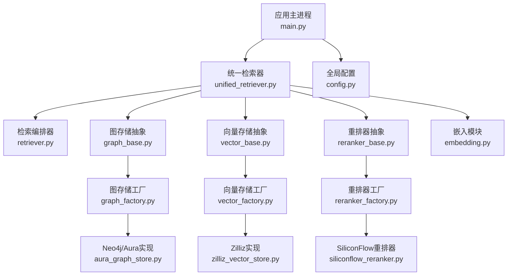
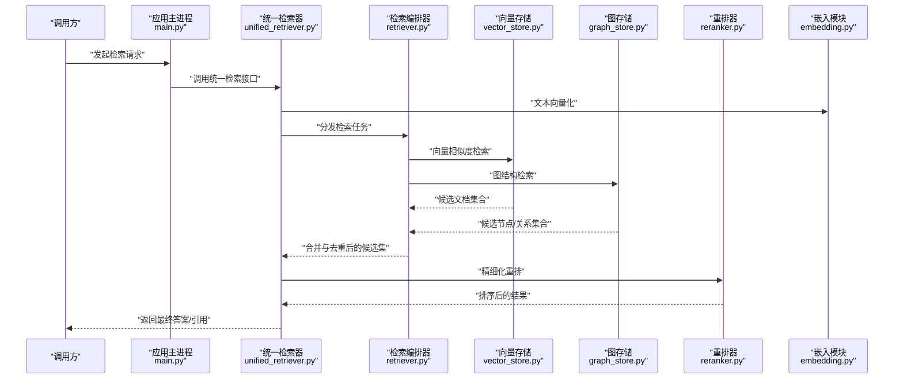
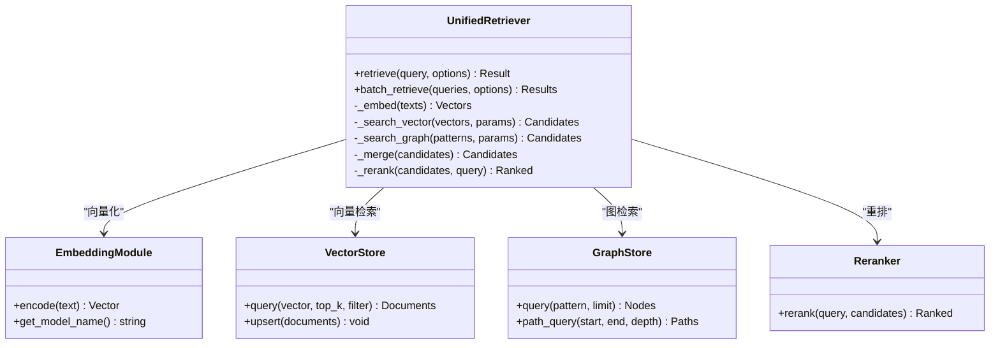
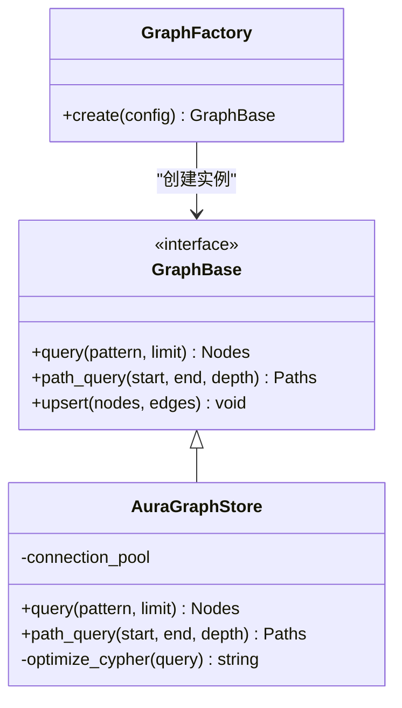
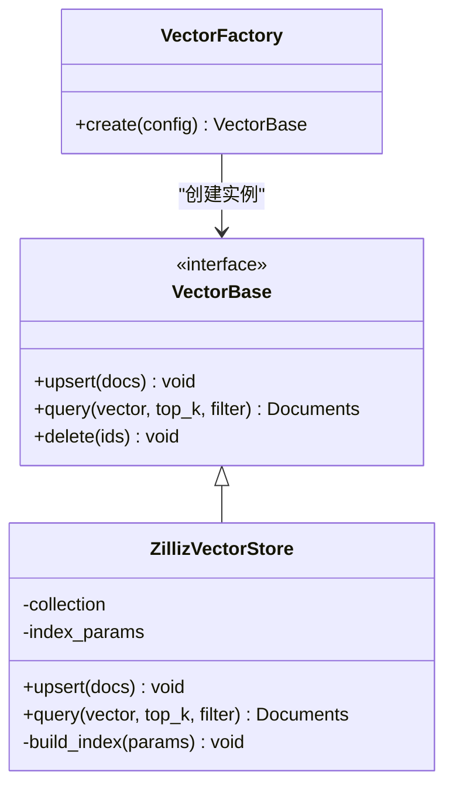
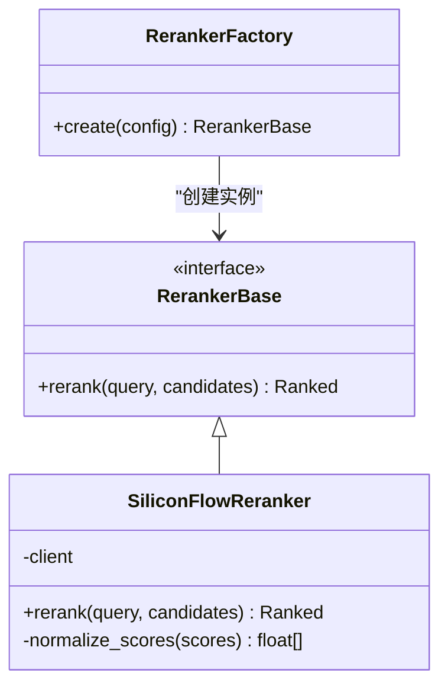
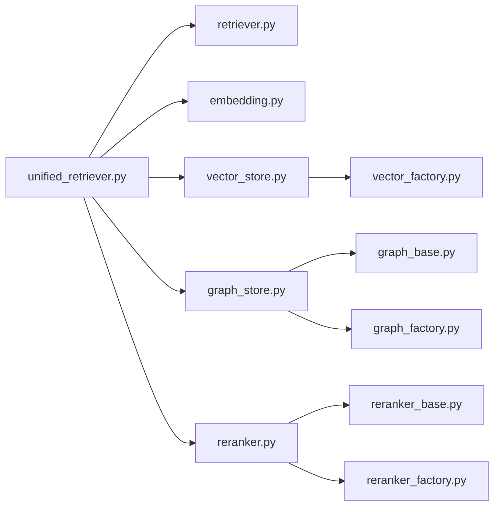

# RAG检索增强系统设计

<cite>
**本文引用的文件**   
- [unified_retriever.py](file://backend_design/nexus/rag/unified_retriever.py)
- [retriever.py](file://backend_design/nexus/rag/retriever.py)
- [graph_store.py](file://backend_design/nexus/rag/graph_store.py)
- [graph_base.py](file://backend_design/nexus/rag/graph_base.py)
- [graph_factory.py](file://backend_design/nexus/rag/graph_factory.py)
- [aura_graph_store.py](file://backend_design/nexus/rag/aura_graph_store.py)
- [vector_store.py](file://backend_design/nexus/rag/vector_store.py)
- [vector_base.py](file://backend_design/nexus/rag/vector_base.py)
- [vector_factory.py](file://backend_design/nexus/rag/vector_factory.py)
- [zilliz_vector_store.py](file://backend_design/nexus/rag/zilliz_vector_store.py)
- [reranker.py](file://backend_design/nexus/rag/reranker.py)
- [reranker_base.py](file://backend_design/nexus/rag/reranker_base.py)
- [reranker_factory.py](file://backend_design/nexus/rag/reranker_factory.py)
- [siliconflow_reranker.py](file://backend_design/nexus/rag/siliconflow_reranker.py)
- [embedding.py](file://backend_design/nexus/rag/embedding.py)
- [config.py](file://backend_design/nexus/config.py)
- [main.py](file://backend_design/nexus/main.py)
</cite>

## 目录
1. [简介](#简介)
2. [项目结构](#项目结构)
3. [核心组件](#核心组件)
4. [架构总览](#架构总览)
5. [详细组件分析](#详细组件分析)
6. [依赖分析](#依赖分析)
7. [性能考虑](#性能考虑)
8. [故障排查指南](#故障排查指南)
9. [结论](#结论)
10. [附录](#附录)

## 简介
本文件面向RAG（检索增强生成）系统的设计与实现，聚焦以下目标：
- unified_retriever的统一检索接口与多后端支持机制
- graph_store的知识图谱存储与查询优化策略
- vector_store的向量数据库集成与相似度搜索算法
- reranker的结果重排序算法与评分机制
- embedding模块的文本向量化处理与模型选择策略
- 不同检索后端的配置与使用示例
- 检索性能优化与缓存策略

## 项目结构
RAG相关代码位于 backend_design/nexus/rag 目录，采用“统一接口 + 工厂模式 + 多后端实现”的分层设计。核心入口由应用主进程通过配置加载并初始化各子模块。

图表来源
- [main.py](file://backend_design/nexus/main.py)
- [unified_retriever.py](file://backend_design/nexus/rag/unified_retriever.py)
- [retriever.py](file://backend_design/nexus/rag/retriever.py)
- [graph_base.py](file://backend_design/nexus/rag/graph_base.py)
- [graph_factory.py](file://backend_design/nexus/rag/graph_factory.py)
- [aura_graph_store.py](file://backend_design/nexus/rag/aura_graph_store.py)
- [vector_base.py](file://backend_design/nexus/rag/vector_base.py)
- [vector_factory.py](file://backend_design/nexus/rag/vector_factory.py)
- [zilliz_vector_store.py](file://backend_design/nexus/rag/zilliz_vector_store.py)
- [reranker_base.py](file://backend_design/nexus/rag/reranker_base.py)
- [reranker_factory.py](file://backend_design/nexus/rag/reranker_factory.py)
- [siliconflow_reranker.py](file://backend_design/nexus/rag/siliconflow_reranker.py)
- [embedding.py](file://backend_design/nexus/rag/embedding.py)
- [config.py](file://backend_design/nexus/config.py)

章节来源
- [main.py](file://backend_design/nexus/main.py)
- [config.py](file://backend_design/nexus/config.py)

## 核心组件
- 统一检索器（unified_retriever）：对外暴露统一的检索接口，内部协调图检索、向量检索与重排流程，屏蔽后端差异。
- 检索编排器（retriever）：负责检索任务分解、并行/串行调度、结果合并与去重等。
- 图存储（graph_store）：基于抽象接口与工厂，支持多种图数据库后端（如Neo4j/Aura），提供实体/关系查询与路径检索能力。
- 向量存储（vector_store）：基于抽象接口与工厂，对接向量数据库（如Zilliz/Milvus），提供高维向量索引与相似度搜索。
- 重排器（reranker）：对初筛结果进行精细化打分与排序，支持本地或远程模型。
- 嵌入模块（embedding）：将文本转换为向量，支持多模型与动态切换。

章节来源
- [unified_retriever.py](file://backend_design/nexus/rag/unified_retriever.py)
- [retriever.py](file://backend_design/nexus/rag/retriever.py)
- [graph_base.py](file://backend_design/nexus/rag/graph_base.py)
- [vector_base.py](file://backend_design/nexus/rag/vector_base.py)
- [reranker_base.py](file://backend_design/nexus/rag/reranker_base.py)
- [embedding.py](file://backend_design/nexus/rag/embedding.py)

## 架构总览
下图展示从请求到最终结果的端到端流程，包括检索、重排与缓存环节。

图表来源
- [main.py](file://backend_design/nexus/main.py)
- [unified_retriever.py](file://backend_design/nexus/rag/unified_retriever.py)
- [retriever.py](file://backend_design/nexus/rag/retriever.py)
- [vector_store.py](file://backend_design/nexus/rag/vector_store.py)
- [graph_store.py](file://backend_design/nexus/rag/graph_store.py)
- [reranker.py](file://backend_design/nexus/rag/reranker.py)
- [embedding.py](file://backend_design/nexus/rag/embedding.py)

## 详细组件分析

### unified_retriever：统一检索接口与多后端支持
- 职责
  - 对外提供一致的检索API，屏蔽图/向量/重排等后端差异。
  - 组合嵌入、检索、重排流程，支持可插拔的后端实现。
  - 管理检索参数（top_k、阈值、超时、重试等）。
- 关键流程
  - 输入预处理与分词/清洗（可选）
  - 文本向量化（调用embedding）
  - 并行/串行触发图检索与向量检索
  - 结果合并、去重、过滤低置信度项
  - 调用reranker进行二次排序
  - 输出结构化结果（含来源、分数、元数据）
- 扩展点
  - 通过配置切换后端（图/向量/重排）
  - 自定义检索策略（例如按租户隔离、按领域路由）

图表来源
- [unified_retriever.py](file://backend_design/nexus/rag/unified_retriever.py)
- [embedding.py](file://backend_design/nexus/rag/embedding.py)
- [vector_store.py](file://backend_design/nexus/rag/vector_store.py)
- [graph_store.py](file://backend_design/nexus/rag/graph_store.py)
- [reranker.py](file://backend_design/nexus/rag/reranker.py)

章节来源
- [unified_retriever.py](file://backend_design/nexus/rag/unified_retriever.py)

### retriever：检索编排与结果融合
- 职责
  - 将统一检索请求拆解为多个子任务（向量、图、关键词等）。
  - 控制并发、超时、重试与降级策略。
  - 合并多路召回结果，执行去重与初步过滤。
- 关键点
  - 支持按权重融合不同召回源的结果
  - 支持按租户/领域路由到不同后端实例
  - 记录检索耗时与命中统计，便于观测与调优

章节来源
- [retriever.py](file://backend_design/nexus/rag/retriever.py)

### graph_store：知识图谱存储与查询优化
- 抽象与实现
  - graph_base定义图存储通用接口（节点/边/路径查询、批量写入等）。
  - graph_factory根据配置创建具体后端（如Neo4j/Aura）。
  - aura_graph_store提供针对Aura/Neo4j的实现细节（连接池、事务、Cypher优化）。
- 查询优化策略
  - 索引与约束：在高频匹配字段建立索引，减少全表扫描。
  - Cypher语句优化：限制遍历深度、提前过滤条件、避免笛卡尔积。
  - 分页与游标：大结果集分批拉取，降低内存峰值。
  - 连接复用：连接池与事务复用，减少握手开销。
  - 读写分离：读操作走只读副本，提升吞吐。
- 典型用法
  - 实体解析：通过别名/同义词映射到标准实体ID
  - 关系推理：限定深度的邻居/路径检索
  - 属性过滤：结合标签与属性快速定位

图表来源
- [graph_base.py](file://backend_design/nexus/rag/graph_base.py)
- [graph_factory.py](file://backend_design/nexus/rag/graph_factory.py)
- [aura_graph_store.py](file://backend_design/nexus/rag/aura_graph_store.py)

章节来源
- [graph_store.py](file://backend_design/nexus/rag/graph_store.py)
- [graph_base.py](file://backend_design/nexus/rag/graph_base.py)
- [graph_factory.py](file://backend_design/nexus/rag/graph_factory.py)
- [aura_graph_store.py](file://backend_design/nexus/rag/aura_graph_store.py)

### vector_store：向量数据库集成与相似度搜索
- 抽象与实现
  - vector_base定义向量存储通用接口（插入、查询、删除、元数据过滤）。
  - vector_factory根据配置创建具体后端（如Zilliz/Milvus）。
  - zilliz_vector_store提供Zilliz/Milvus的具体实现（索引类型、度量方式、分区策略）。
- 相似度搜索算法
  - 常用度量：余弦相似度、内积、欧氏距离（按场景选择）。
  - 索引类型：HNSW、IVF_PQ、SCANN等（权衡召回率与延迟）。
  - 过滤条件：元数据预过滤减少候选集规模。
- 典型用法
  - 文档切片入库，附带元数据（来源、时间戳、租户ID）
  - 查询时传入top_k与过滤条件，返回带分数与元数据的文档列表

图表来源
- [vector_base.py](file://backend_design/nexus/rag/vector_base.py)
- [vector_factory.py](file://backend_design/nexus/rag/vector_factory.py)
- [zilliz_vector_store.py](file://backend_design/nexus/rag/zilliz_vector_store.py)

章节来源
- [vector_store.py](file://backend_design/nexus/rag/vector_store.py)
- [vector_base.py](file://backend_design/nexus/rag/vector_base.py)
- [vector_factory.py](file://backend_design/nexus/rag/vector_factory.py)
- [zilliz_vector_store.py](file://backend_design/nexus/rag/zilliz_vector_store.py)

### reranker：结果重排序与评分机制
- 抽象与实现
  - reranker_base定义重排器通用接口（接收查询与候选，返回排序结果）。
  - reranker_factory根据配置创建具体重排器（本地模型或远程服务）。
  - siliconflow_reranker对接SiliconFlow的重排服务，支持在线打分。
- 评分机制
  - 相关性得分：基于语义匹配与上下文一致性。
  - 多样性惩罚：对重复内容降权，提升结果多样性。
  - 时效性/权威性加权：结合元数据进行业务加权。
- 典型用法
  - 对初筛Top-K进行精细化排序，输出Top-N作为最终结果
  - 支持A/B测试不同重排策略

图表来源
- [reranker_base.py](file://backend_design/nexus/rag/reranker_base.py)
- [reranker_factory.py](file://backend_design/nexus/rag/reranker_factory.py)
- [siliconflow_reranker.py](file://backend_design/nexus/rag/siliconflow_reranker.py)

章节来源
- [reranker.py](file://backend_design/nexus/rag/reranker.py)
- [reranker_base.py](file://backend_design/nexus/rag/reranker_base.py)
- [reranker_factory.py](file://backend_design/nexus/rag/reranker_factory.py)
- [siliconflow_reranker.py](file://backend_design/nexus/rag/siliconflow_reranker.py)

### embedding：文本向量化与模型选择
- 职责
  - 将自然语言文本转换为固定维度的向量，供向量检索使用。
  - 支持多模型切换（本地/云端）、批处理与缓存。
- 模型选择策略
  - 按任务复杂度选择不同维度与精度的模型。
  - 按成本/延迟要求选择本地或远程模型。
  - 支持热切换与回退机制（主模型失败自动切备用）。
- 性能优化
  - 批编码：合并多次请求以降低开销。
  - 结果缓存：相同文本哈希命中缓存，避免重复计算。
  - 流式处理：长文本分段编码，降低内存占用。

章节来源
- [embedding.py](file://backend_design/nexus/rag/embedding.py)

## 依赖分析
- 组件耦合
  - unified_retriever依赖retriever、embedding、vector_store、graph_store、reranker，形成松耦合的组合关系。
  - 各后端通过工厂创建，降低硬编码耦合，提高可替换性。
- 外部依赖
  - 图数据库（Neo4j/Aura）
  - 向量数据库（Zilliz/Milvus）
  - 重排服务（SiliconFlow或本地模型）
  - 嵌入模型（本地或云端）
- 潜在循环依赖
  - 当前分层清晰，未见直接循环导入；需确保工厂与抽象之间单向依赖。

图表来源
- [unified_retriever.py](file://backend_design/nexus/rag/unified_retriever.py)
- [retriever.py](file://backend_design/nexus/rag/retriever.py)
- [embedding.py](file://backend_design/nexus/rag/embedding.py)
- [vector_store.py](file://backend_design/nexus/rag/vector_store.py)
- [graph_store.py](file://backend_design/nexus/rag/graph_store.py)
- [reranker.py](file://backend_design/nexus/rag/reranker.py)
- [vector_factory.py](file://backend_design/nexus/rag/vector_factory.py)
- [graph_base.py](file://backend_design/nexus/rag/graph_base.py)
- [graph_factory.py](file://backend_design/nexus/rag/graph_factory.py)
- [reranker_base.py](file://backend_design/nexus/rag/reranker_base.py)
- [reranker_factory.py](file://backend_design/nexus/rag/reranker_factory.py)

章节来源
- [unified_retriever.py](file://backend_design/nexus/rag/unified_retriever.py)
- [vector_factory.py](file://backend_design/nexus/rag/vector_factory.py)
- [graph_factory.py](file://backend_design/nexus/rag/graph_factory.py)
- [reranker_factory.py](file://backend_design/nexus/rag/reranker_factory.py)

## 性能考虑
- 检索链路优化
  - 并行检索：向量与图检索并行执行，缩短整体延迟。
  - 早期截断：设置最小阈值，低于阈值的候选直接丢弃。
  - 结果裁剪：仅保留Top-K进入重排阶段，降低重排成本。
- 索引与查询优化
  - 向量索引：选择合适的度量与索引类型，平衡召回与延迟。
  - 图索引：在高频字段建索引，限制遍历深度，避免全图扫描。
- 缓存策略
  - 文本向量缓存：以文本哈希为键缓存向量，避免重复编码。
  - 检索结果缓存：对热点查询短期缓存，注意失效策略（TTL+版本戳）。
  - 重排结果缓存：对相似查询结果做近似缓存，提升命中率。
- 资源与稳定性
  - 连接池：图/向量数据库连接复用，减少握手开销。
  - 限流与熔断：对下游服务进行限流与熔断保护。
  - 监控与观测：记录关键指标（延迟、命中率、错误率）。

[本节为通用指导，不直接分析具体文件]

## 故障排查指南
- 常见问题
  - 向量检索无结果：检查索引是否构建完成、度量是否一致、过滤条件是否过严。
  - 图检索超时：检查Cypher语句复杂度、是否存在全图扫描、是否缺少索引。
  - 重排失败：检查网络连通性与鉴权、确认输入格式与最大长度限制。
  - 嵌入失败：检查模型可用性、批大小与内存占用。
- 诊断建议
  - 开启详细日志，记录各阶段耗时与中间结果数量。
  - 使用压测脚本验证不同负载下的稳定性。
  - 逐步关闭功能（如先禁用重排）定位瓶颈。

[本节为通用指导，不直接分析具体文件]

## 结论
本RAG系统通过统一检索接口屏蔽多后端差异，结合图检索与向量检索的优势，辅以重排器提升结果质量。通过工厂模式与抽象接口，系统具备良好的可扩展性与可维护性。在生产环境中，应重点关注索引优化、缓存策略与监控观测，以实现高可用与高性能的检索体验。

[本节为总结性内容，不直接分析具体文件]

## 附录

### 配置与使用示例（概念性说明）
- 统一检索器
  - 配置项：后端类型（图/向量/重排）、top_k、相似度阈值、超时与重试次数。
  - 使用方式：传入查询文本与选项，返回排序后的结果与来源信息。
- 图存储
  - 配置项：连接地址、认证信息、默认遍历深度、只读副本地址。
  - 使用方式：构造查询模式（节点/关系/路径），指定limit与过滤条件。
- 向量存储
  - 配置项：集合名、索引类型、度量方式、分区策略、元数据字段。
  - 使用方式：批量插入文档与元数据，查询时传入向量、top_k与过滤条件。
- 重排器
  - 配置项：服务地址、鉴权令牌、评分归一化策略、多样性权重。
  - 使用方式：传入查询与候选集，返回排序后的结果。
- 嵌入模块
  - 配置项：模型名称、维度、批大小、缓存开关、回退模型。
  - 使用方式：对文本进行编码，支持批量与缓存命中。

[本节为概念性说明，不直接分析具体文件]