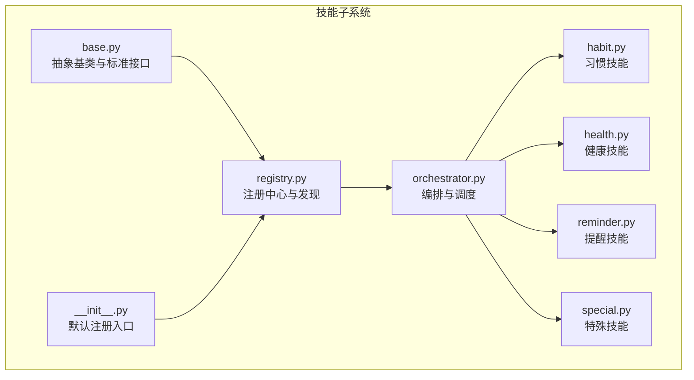
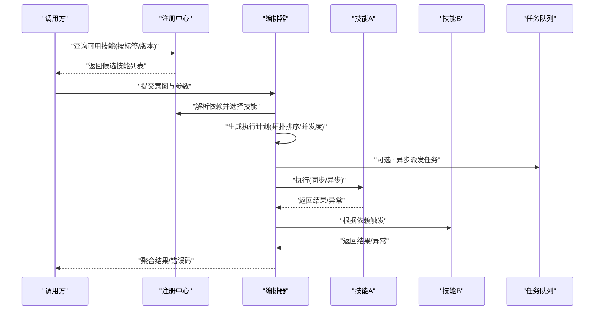
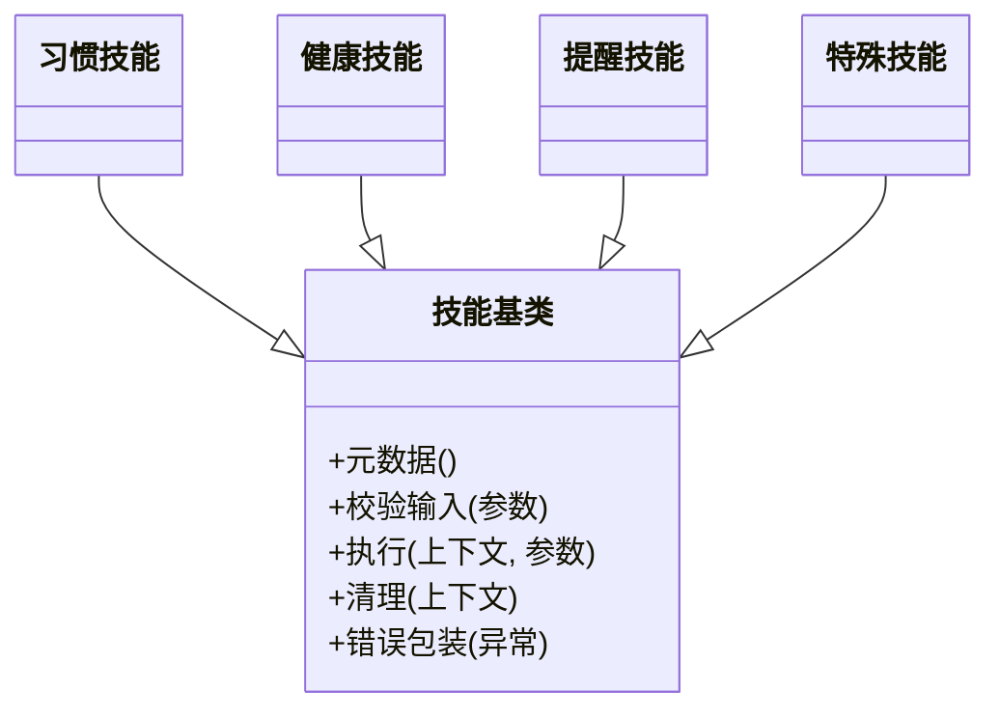
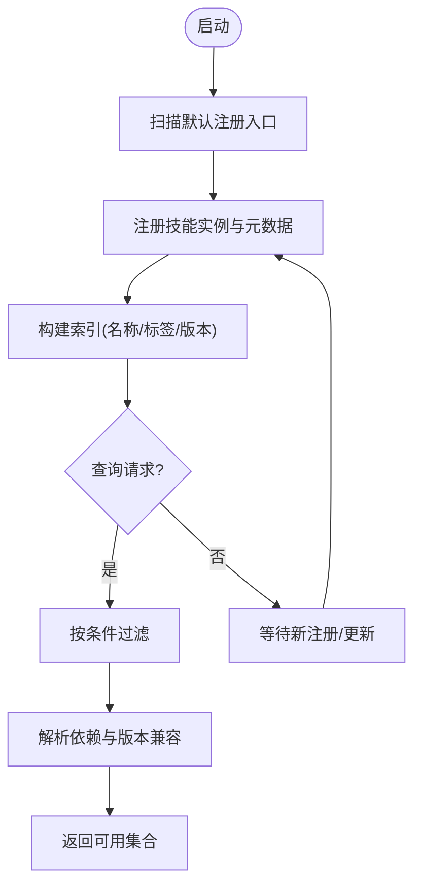
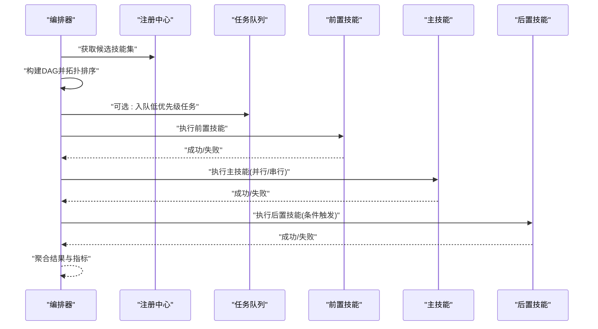
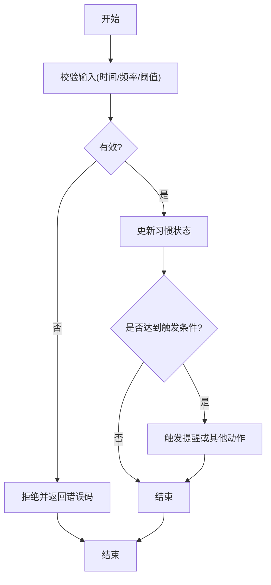
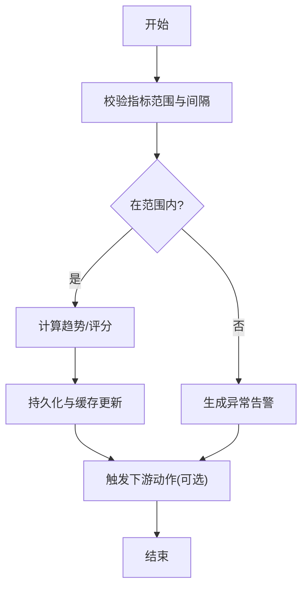
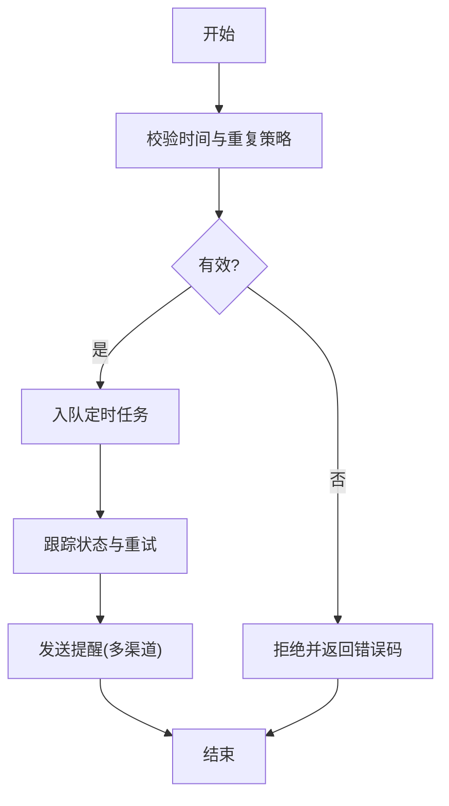
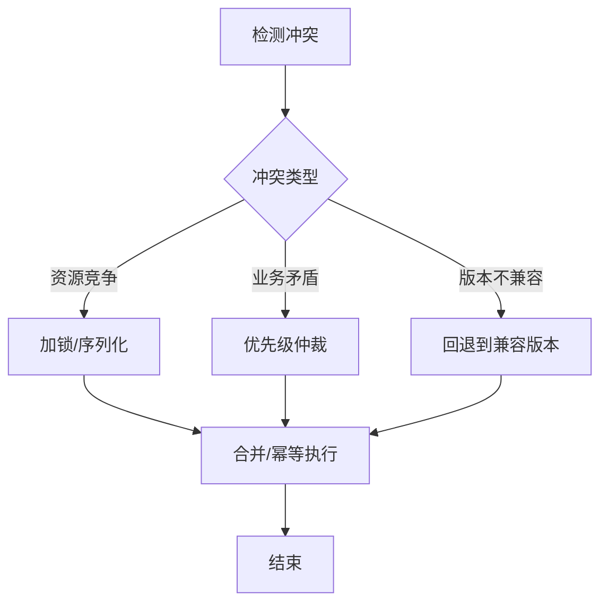
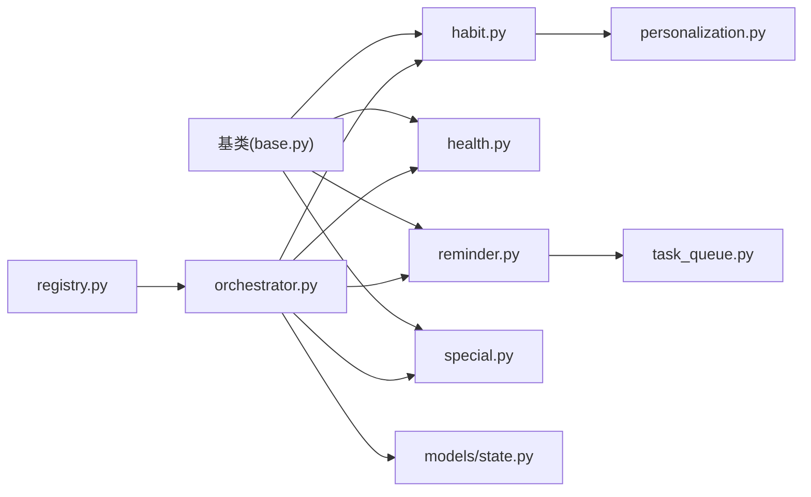

# 技能编排系统设计

<cite>
**本文引用的文件**   
- [backend_design/nexus/skills/base.py](file://backend_design/nexus/skills/base.py)
- [backend_design/nexus/skills/registry.py](file://backend_design/nexus/skills/registry.py)
- [backend_design/nexus/skills/orchestrator.py](file://backend_design/nexus/skills/orchestrator.py)
- [backend_design/nexus/skills/habit.py](file://backend_design/nexus/skills/habit.py)
- [backend_design/nexus/skills/health.py](file://backend_design/nexus/skills/health.py)
- [backend_design/nexus/skills/reminder.py](file://backend_design/nexus/skills/reminder.py)
- [backend_design/nexus/skills/special.py](file://backend_design/nexus/skills/special.py)
- [backend_design/nexus/skills/__init__.py](file://backend_design/nexus/skills/__init__.py)
- [backend_design/nexus/core/personalization.py](file://backend_design/nexus/core/personalization.py)
- [backend_design/nexus/memory/conflict.py](file://backend_design/nexus/memory/conflict.py)
- [backend_design/nexus/middleware/task_queue.py](file://backend_design/nexus/middleware/task_queue.py)
- [backend_design/nexus/models/state.py](file://backend_design/nexus/models/state.py)
</cite>

## 目录
1. [简介](#简介)
2. [项目结构](#项目结构)
3. [核心组件](#核心组件)
4. [架构总览](#架构总览)
5. [详细组件分析](#详细组件分析)
6. [依赖关系分析](#依赖关系分析)
7. [性能考虑](#性能考虑)
8. [故障排查指南](#故障排查指南)
9. [结论](#结论)
10. [附录](#附录)

## 简介
本文件面向“技能编排系统”的设计与实现，聚焦以下目标：
- 技能注册中心的工作原理与技能发现机制
- Orchestrator 的任务编排算法与执行调度策略
- Base 基类的设计模式与标准接口定义
- 内置技能（habit、health、reminder 等）的实现逻辑与业务规则
- 技能间依赖关系与冲突解决机制
- 自定义技能开发指南与最佳实践
- 技能版本管理与兼容性处理方案

## 项目结构
技能相关代码集中在 backend_design/nexus/skills 目录下，围绕“注册—编排—执行”的闭环组织。核心文件职责如下：
- base.py：定义技能抽象基类与标准接口
- registry.py：维护技能注册表，提供注册、查询、发现能力
- orchestrator.py：任务编排器，负责解析意图、选择并调度技能
- habit.py / health.py / reminder.py / special.py：内置技能实现
- __init__.py：模块入口，完成默认技能的自动注册

图表来源
- [backend_design/nexus/skills/base.py](file://backend_design/nexus/skills/base.py)
- [backend_design/nexus/skills/registry.py](file://backend_design/nexus/skills/registry.py)
- [backend_design/nexus/skills/orchestrator.py](file://backend_design/nexus/skills/orchestrator.py)
- [backend_design/nexus/skills/habit.py](file://backend_design/nexus/skills/habit.py)
- [backend_design/nexus/skills/health.py](file://backend_design/nexus/skills/health.py)
- [backend_design/nexus/skills/reminder.py](file://backend_design/nexus/skills/reminder.py)
- [backend_design/nexus/skills/special.py](file://backend_design/nexus/skills/special.py)
- [backend_design/nexus/skills/__init__.py](file://backend_design/nexus/skills/__init__.py)

章节来源
- [backend_design/nexus/skills/base.py](file://backend_design/nexus/skills/base.py)
- [backend_design/nexus/skills/registry.py](file://backend_design/nexus/skills/registry.py)
- [backend_design/nexus/skills/orchestrator.py](file://backend_design/nexus/skills/orchestrator.py)
- [backend_design/nexus/skills/habit.py](file://backend_design/nexus/skills/habit.py)
- [backend_design/nexus/skills/health.py](file://backend_design/nexus/skills/health.py)
- [backend_design/nexus/skills/reminder.py](file://backend_design/nexus/skills/reminder.py)
- [backend_design/nexus/skills/special.py](file://backend_design/nexus/skills/special.py)
- [backend_design/nexus/skills/__init__.py](file://backend_design/nexus/skills/__init__.py)

## 核心组件
本节从设计模式与接口契约角度，梳理技能子系统的核心构件。

- 抽象基类与标准接口
  - 统一描述技能元信息（名称、版本、能力标签、依赖声明等）
  - 定义生命周期钩子（初始化、校验输入、执行、清理）
  - 定义上下文访问方式（用户偏好、会话状态、外部服务）
  - 定义错误模型与结果封装，便于上层编排与观测

- 注册中心与发现
  - 提供按名称、标签、版本的检索能力
  - 支持动态注册与热更新
  - 暴露最小可用集合与降级路径

- 编排器与调度
  - 将高层意图分解为可执行的技能序列或图
  - 基于依赖、优先级、资源约束进行排序与并发控制
  - 提供重试、熔断、超时、回退策略

章节来源
- [backend_design/nexus/skills/base.py](file://backend_design/nexus/skills/base.py)
- [backend_design/nexus/skills/registry.py](file://backend_design/nexus/skills/registry.py)
- [backend_design/nexus/skills/orchestrator.py](file://backend_design/nexus/skills/orchestrator.py)

## 架构总览
下图展示“注册—编排—执行”的整体流程以及关键交互点。

图表来源
- [backend_design/nexus/skills/registry.py](file://backend_design/nexus/skills/registry.py)
- [backend_design/nexus/skills/orchestrator.py](file://backend_design/nexus/skills/orchestrator.py)
- [backend_design/nexus/middleware/task_queue.py](file://backend_design/nexus/middleware/task_queue.py)

## 详细组件分析

### 抽象基类与标准接口（Base）
- 设计要点
  - 通过抽象方法强制实现：元数据、输入校验、执行体、清理
  - 提供默认实现：日志、指标、上下文注入、错误包装
  - 明确版本兼容字段：向后兼容的扩展点与弃用标记
- 典型使用模式
  - 继承基类，实现最小必要方法
  - 在元数据中声明依赖与能力标签，供注册中心与编排器使用
  - 在输入校验阶段拒绝非法参数，避免进入执行阶段

图表来源
- [backend_design/nexus/skills/base.py](file://backend_design/nexus/skills/base.py)
- [backend_design/nexus/skills/habit.py](file://backend_design/nexus/skills/habit.py)
- [backend_design/nexus/skills/health.py](file://backend_design/nexus/skills/health.py)
- [backend_design/nexus/skills/reminder.py](file://backend_design/nexus/skills/reminder.py)
- [backend_design/nexus/skills/special.py](file://backend_design/nexus/skills/special.py)

章节来源
- [backend_design/nexus/skills/base.py](file://backend_design/nexus/skills/base.py)

### 注册中心与技能发现（Registry）
- 工作原理
  - 集中维护技能实例与元数据索引
  - 支持按名称、标签、版本过滤
  - 提供最小可用集合计算（满足依赖且版本兼容）
- 发现机制
  - 启动时扫描默认注册入口，完成基础技能加载
  - 运行时支持动态注册与热更新
  - 对外暴露只读视图，保证线程安全

图表来源
- [backend_design/nexus/skills/registry.py](file://backend_design/nexus/skills/registry.py)
- [backend_design/nexus/skills/__init__.py](file://backend_design/nexus/skills/__init__.py)

章节来源
- [backend_design/nexus/skills/registry.py](file://backend_design/nexus/skills/registry.py)
- [backend_design/nexus/skills/__init__.py](file://backend_design/nexus/skills/__init__.py)

### 编排器与调度（Orchestrator）
- 编排算法
  - 将用户意图映射为技能节点集合
  - 依据依赖关系构建有向无环图（DAG），进行拓扑排序
  - 对无依赖节点进行并发执行，提升吞吐
- 调度策略
  - 优先级：基于业务权重与紧急程度
  - 资源限制：并发度上限、超时、重试次数
  - 降级：当依赖不可用时，采用回退策略或跳过分支
- 执行流

图表来源
- [backend_design/nexus/skills/orchestrator.py](file://backend_design/nexus/skills/orchestrator.py)
- [backend_design/nexus/middleware/task_queue.py](file://backend_design/nexus/middleware/task_queue.py)

章节来源
- [backend_design/nexus/skills/orchestrator.py](file://backend_design/nexus/skills/orchestrator.py)

### 内置技能：习惯（Habit）
- 业务规则
  - 记录用户日常行为轨迹，支持周期性与条件触发
  - 与个性化配置联动，形成个人化建议
- 关键流程
  - 输入校验：时间窗口、频率、阈值
  - 执行：采集/更新习惯数据，必要时触发提醒
  - 清理：归档历史、释放临时状态

图表来源
- [backend_design/nexus/skills/habit.py](file://backend_design/nexus/skills/habit.py)
- [backend_design/nexus/core/personalization.py](file://backend_design/nexus/core/personalization.py)

章节来源
- [backend_design/nexus/skills/habit.py](file://backend_design/nexus/skills/habit.py)
- [backend_design/nexus/core/personalization.py](file://backend_design/nexus/core/personalization.py)

### 内置技能：健康（Health）
- 业务规则
  - 整合健康指标（如体征、运动、睡眠等），提供趋势分析与建议
  - 与提醒技能协作，推送健康干预提示
- 关键流程
  - 输入校验：指标范围、采样间隔
  - 执行：读取/写入健康数据，计算指标
  - 清理：缓存失效、数据压缩

图表来源
- [backend_design/nexus/skills/health.py](file://backend_design/nexus/skills/health.py)

章节来源
- [backend_design/nexus/skills/health.py](file://backend_design/nexus/skills/health.py)

### 内置技能：提醒（Reminder）
- 业务规则
  - 支持一次性与周期性提醒，具备优先级与去重
  - 与习惯、健康技能联动，作为通知出口
- 关键流程
  - 输入校验：时间、重复策略、渠道
  - 执行：创建提醒项，入队定时任务
  - 清理：过期清理、状态同步

图表来源
- [backend_design/nexus/skills/reminder.py](file://backend_design/nexus/skills/reminder.py)
- [backend_design/nexus/middleware/task_queue.py](file://backend_design/nexus/middleware/task_queue.py)

章节来源
- [backend_design/nexus/skills/reminder.py](file://backend_design/nexus/skills/reminder.py)
- [backend_design/nexus/middleware/task_queue.py](file://backend_design/nexus/middleware/task_queue.py)

### 内置技能：特殊（Special）
- 说明
  - 用于承载非通用场景的特殊逻辑，通常由编排器按需调用
  - 需要严格声明依赖与权限，避免误用

章节来源
- [backend_design/nexus/skills/special.py](file://backend_design/nexus/skills/special.py)

### 技能间的依赖关系与冲突解决
- 依赖建模
  - 以元数据中的依赖声明为依据，编排器构建 DAG
  - 版本约束确保兼容，不兼容则拒绝执行或回退
- 冲突识别
  - 同一资源被多个技能同时修改时，引入写锁或合并策略
  - 业务冲突通过优先级与仲裁规则解决
- 解决策略
  - 顺序化：对互斥操作串行执行
  - 幂等：允许重复执行而不产生副作用
  - 补偿：失败后执行反向操作恢复一致性

图表来源
- [backend_design/nexus/skills/orchestrator.py](file://backend_design/nexus/skills/orchestrator.py)
- [backend_design/nexus/memory/conflict.py](file://backend_design/nexus/memory/conflict.py)

章节来源
- [backend_design/nexus/skills/orchestrator.py](file://backend_design/nexus/skills/orchestrator.py)
- [backend_design/nexus/memory/conflict.py](file://backend_design/nexus/memory/conflict.py)

## 依赖关系分析
- 内部依赖
  - 所有内置技能均依赖基类提供的标准接口
  - 编排器依赖注册中心进行技能发现与选择
  - 提醒技能依赖任务队列进行延迟与重试
- 外部依赖
  - 个性化配置、记忆冲突处理、状态模型等支撑模块

图表来源
- [backend_design/nexus/skills/base.py](file://backend_design/nexus/skills/base.py)
- [backend_design/nexus/skills/registry.py](file://backend_design/nexus/skills/registry.py)
- [backend_design/nexus/skills/orchestrator.py](file://backend_design/nexus/skills/orchestrator.py)
- [backend_design/nexus/skills/habit.py](file://backend_design/nexus/skills/habit.py)
- [backend_design/nexus/skills/health.py](file://backend_design/nexus/skills/health.py)
- [backend_design/nexus/skills/reminder.py](file://backend_design/nexus/skills/reminder.py)
- [backend_design/nexus/skills/special.py](file://backend_design/nexus/skills/special.py)
- [backend_design/nexus/middleware/task_queue.py](file://backend_design/nexus/middleware/task_queue.py)
- [backend_design/nexus/core/personalization.py](file://backend_design/nexus/core/personalization.py)
- [backend_design/nexus/models/state.py](file://backend_design/nexus/models/state.py)

章节来源
- [backend_design/nexus/skills/base.py](file://backend_design/nexus/skills/base.py)
- [backend_design/nexus/skills/registry.py](file://backend_design/nexus/skills/registry.py)
- [backend_design/nexus/skills/orchestrator.py](file://backend_design/nexus/skills/orchestrator.py)
- [backend_design/nexus/skills/habit.py](file://backend_design/nexus/skills/habit.py)
- [backend_design/nexus/skills/health.py](file://backend_design/nexus/skills/health.py)
- [backend_design/nexus/skills/reminder.py](file://backend_design/nexus/skills/reminder.py)
- [backend_design/nexus/skills/special.py](file://backend_design/nexus/skills/special.py)
- [backend_design/nexus/middleware/task_queue.py](file://backend_design/nexus/middleware/task_queue.py)
- [backend_design/nexus/core/personalization.py](file://backend_design/nexus/core/personalization.py)
- [backend_design/nexus/models/state.py](file://backend_design/nexus/models/state.py)

## 性能考虑
- 并发与吞吐
  - 对无依赖节点并行执行，合理设置并发度上限
  - 长耗时任务入队异步执行，降低阻塞
- 资源与限流
  - 为每个技能设置超时与重试上限，防止雪崩
  - 结合任务队列进行削峰填谷
- 缓存与状态
  - 热点数据缓存，减少外部依赖调用
  - 状态模型轻量化，避免大对象频繁序列化

[本节为通用指导，无需特定文件引用]

## 故障排查指南
- 常见问题定位
  - 技能未注册：检查默认注册入口与动态注册流程
  - 依赖缺失：查看元数据中的依赖声明与版本约束
  - 执行失败：关注错误包装与重试策略，定位具体异常
- 调试建议
  - 启用详细日志与指标上报
  - 使用最小复现用例隔离问题
  - 借助任务队列追踪延迟任务状态

章节来源
- [backend_design/nexus/skills/registry.py](file://backend_design/nexus/skills/registry.py)
- [backend_design/nexus/skills/orchestrator.py](file://backend_design/nexus/skills/orchestrator.py)
- [backend_design/nexus/middleware/task_queue.py](file://backend_design/nexus/middleware/task_queue.py)

## 结论
本设计通过统一的基类接口、集中的注册中心与灵活的编排器，实现了高内聚、低耦合的技能体系。内置技能覆盖习惯、健康、提醒等常见场景，并通过依赖建模与冲突解决保障系统稳定性。配合任务队列与状态模型，系统在可扩展性、可靠性与可观测性方面具备良好的工程基础。

[本节为总结性内容，无需特定文件引用]

## 附录

### 自定义技能开发指南与最佳实践
- 开发步骤
  - 继承基类，实现元数据、输入校验、执行体与清理
  - 在元数据中声明依赖、标签与版本约束
  - 在默认注册入口或动态注册流程中完成注册
- 最佳实践
  - 输入校验前置，尽早拒绝非法参数
  - 幂等设计，确保重试安全
  - 明确错误码与消息，便于上层处理
  - 合理使用缓存与异步任务，提升性能
  - 编写单元测试与集成测试，覆盖边界条件

章节来源
- [backend_design/nexus/skills/base.py](file://backend_design/nexus/skills/base.py)
- [backend_design/nexus/skills/__init__.py](file://backend_design/nexus/skills/__init__.py)

### 技能版本管理与兼容性处理方案
- 版本管理
  - 元数据中包含版本号与变更说明
  - 注册中心按版本筛选，保证最小可用集合
- 兼容性策略
  - 向后兼容：新增字段不影响旧版调用
  - 向前兼容：旧版调用在新版中仍能工作
  - 回退机制：不兼容时切换到稳定版本或降级路径

章节来源
- [backend_design/nexus/skills/registry.py](file://backend_design/nexus/skills/registry.py)
- [backend_design/nexus/skills/base.py](file://backend_design/nexus/skills/base.py)