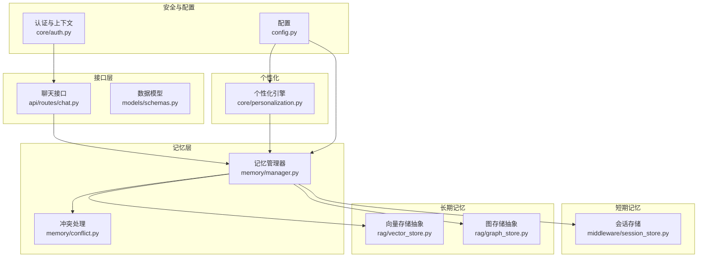
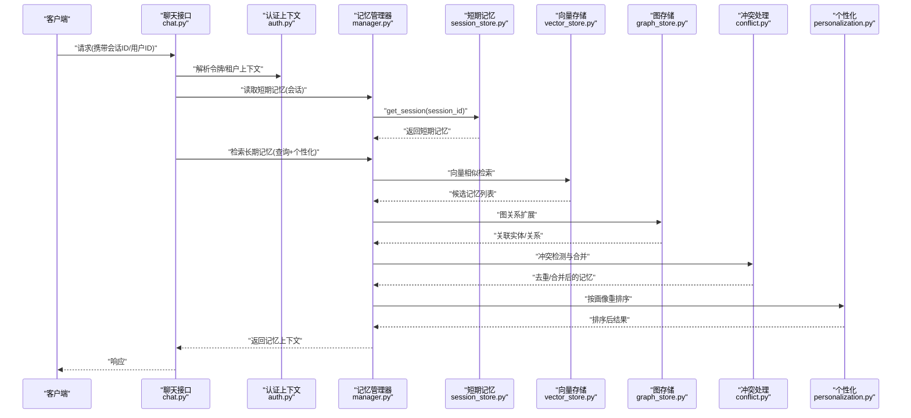
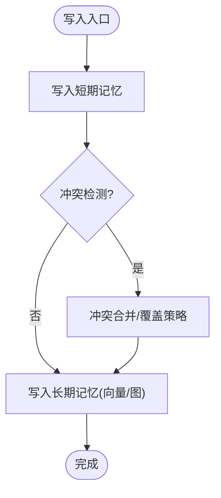
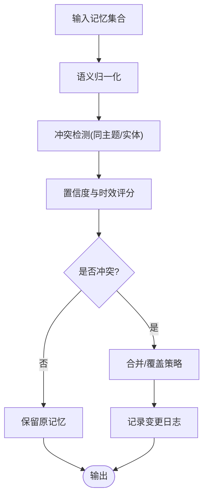
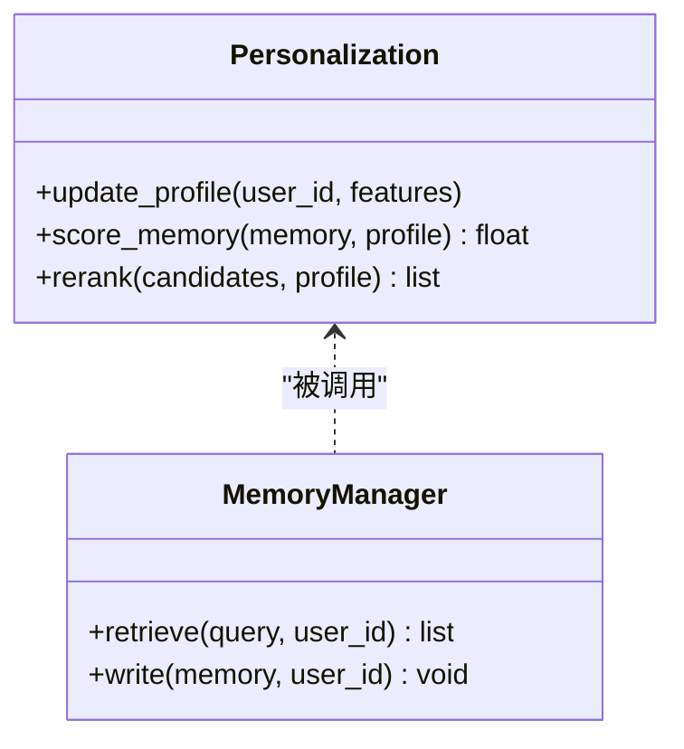
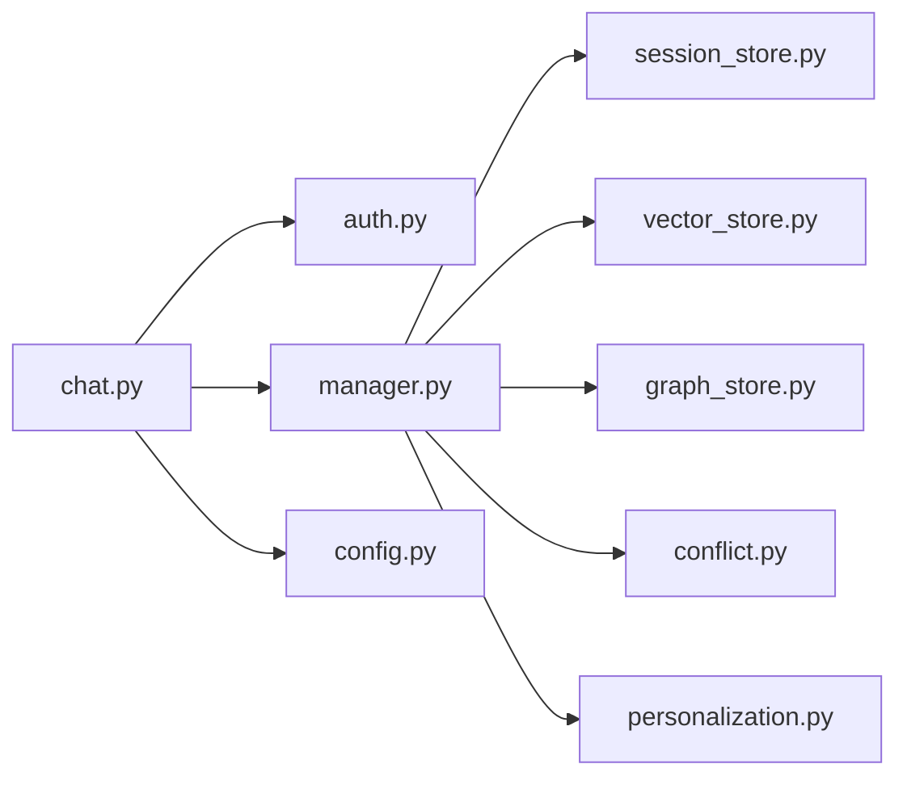

# 记忆管理系统设计

<cite>
**本文引用的文件**   
- [backend_design/nexus/memory/manager.py](file://backend_design/nexus/memory/manager.py)
- [backend_design/nexus/memory/conflict.py](file://backend_design/nexus/memory/conflict.py)
- [backend_design/nexus/core/personalization.py](file://backend_design/nexus/core/personalization.py)
- [backend_design/nexus/rag/vector_store.py](file://backend_design/nexus/rag/vector_store.py)
- [backend_design/nexus/rag/graph_store.py](file://backend_design/nexus/rag/graph_store.py)
- [backend_design/nexus/middleware/session_store.py](file://backend_design/nexus/middleware/session_store.py)
- [backend_design/nexus/api/routes/chat.py](file://backend_design/nexus/api/routes/chat.py)
- [backend_design/nexus/models/schemas.py](file://backend_design/nexus/models/schemas.py)
- [backend_design/nexus/core/auth.py](file://backend_design/nexus/core/auth.py)
- [backend_design/nexus/config.py](file://backend_design/nexus/config.py)
- [scripts/v2.1_migration.sql](file://scripts/v2.1_migration.sql)
</cite>

## 目录
1. [引言](#引言)
2. [项目结构](#项目结构)
3. [核心组件](#核心组件)
4. [架构总览](#架构总览)
5. [详细组件分析](#详细组件分析)
6. [依赖关系分析](#依赖关系分析)
7. [性能考量](#性能考量)
8. [故障排查指南](#故障排查指南)
9. [结论](#结论)
10. [附录](#附录)

## 引言
本文件面向“记忆管理系统”的设计与实现，聚焦短期记忆与长期记忆的分离架构、数据流转机制、存储策略与检索算法、冲突检测与解决、用户画像与个性化推荐、持久化与迁移方案，以及增删改查API与安全访问控制。文档以代码级为依据，提供可视化图示与可操作的排障建议，帮助读者快速理解并正确使用该系统。

## 项目结构
记忆管理相关代码主要位于后端模块的 memory、core、rag、middleware、api 等子系统中：
- memory：记忆管理器与冲突处理
- core：个性化与认证上下文
- rag：向量与图数据库抽象及具体实现
- middleware：会话存储（短期记忆）
- api：对外接口路由与模型定义
- config：配置项
- scripts：数据迁移脚本

图表来源
- [backend_design/nexus/memory/manager.py](file://backend_design/nexus/memory/manager.py)
- [backend_design/nexus/memory/conflict.py](file://backend_design/nexus/memory/conflict.py)
- [backend_design/nexus/middleware/session_store.py](file://backend_design/nexus/middleware/session_store.py)
- [backend_design/nexus/rag/vector_store.py](file://backend_design/nexus/rag/vector_store.py)
- [backend_design/nexus/rag/graph_store.py](file://backend_design/nexus/rag/graph_store.py)
- [backend_design/nexus/core/personalization.py](file://backend_design/nexus/core/personalization.py)
- [backend_design/nexus/core/auth.py](file://backend_design/nexus/core/auth.py)
- [backend_design/nexus/config.py](file://backend_design/nexus/config.py)
- [backend_design/nexus/api/routes/chat.py](file://backend_design/nexus/api/routes/chat.py)
- [backend_design/nexus/models/schemas.py](file://backend_design/nexus/models/schemas.py)

章节来源
- [backend_design/nexus/memory/manager.py](file://backend_design/nexus/memory/manager.py)
- [backend_design/nexus/memory/conflict.py](file://backend_design/nexus/memory/conflict.py)
- [backend_design/nexus/middleware/session_store.py](file://backend_design/nexus/middleware/session_store.py)
- [backend_design/nexus/rag/vector_store.py](file://backend_design/nexus/rag/vector_store.py)
- [backend_design/nexus/rag/graph_store.py](file://backend_design/nexus/rag/graph_store.py)
- [backend_design/nexus/core/personalization.py](file://backend_design/nexus/core/personalization.py)
- [backend_design/nexus/core/auth.py](file://backend_design/nexus/core/auth.py)
- [backend_design/nexus/config.py](file://backend_design/nexus/config.py)
- [backend_design/nexus/api/routes/chat.py](file://backend_design/nexus/api/routes/chat.py)
- [backend_design/nexus/models/schemas.py](file://backend_design/nexus/models/schemas.py)

## 核心组件
- 记忆管理器（Manager）：负责短期与长期记忆的读写、融合与检索；协调冲突处理与个性化增强。
- 冲突处理（Conflict）：检测记忆间不一致，执行合并或覆盖策略。
- 短期记忆（Session Store）：基于会话维度的临时缓存，用于对话上下文与中间结果。
- 长期记忆（Vector/Graph Store）：通过向量与图结构持久化事实、偏好与关系。
- 个性化（Personalization）：构建用户画像，驱动记忆检索排序与内容生成。
- 安全与配置（Auth/Config）：鉴权、租户隔离与系统参数注入。

章节来源
- [backend_design/nexus/memory/manager.py](file://backend_design/nexus/memory/manager.py)
- [backend_design/nexus/memory/conflict.py](file://backend_design/nexus/memory/conflict.py)
- [backend_design/nexus/middleware/session_store.py](file://backend_design/nexus/middleware/session_store.py)
- [backend_design/nexus/rag/vector_store.py](file://backend_design/nexus/rag/vector_store.py)
- [backend_design/nexus/rag/graph_store.py](file://backend_design/nexus/rag/graph_store.py)
- [backend_design/nexus/core/personalization.py](file://backend_design/nexus/core/personalization.py)
- [backend_design/nexus/core/auth.py](file://backend_design/nexus/core/auth.py)
- [backend_design/nexus/config.py](file://backend_design/nexus/config.py)

## 架构总览
记忆系统采用“短长分离 + 检索增强”的分层架构：
- 短期记忆：低延迟、易过期，承载会话内上下文与中间态。
- 长期记忆：高可靠、可检索，承载事实、偏好与实体关系。
- 冲突处理：在写入前进行一致性校验与合并。
- 个性化：在检索阶段对候选记忆进行重排序与过滤。
- 安全：基于认证与租户上下文的访问控制。

图表来源
- [backend_design/nexus/api/routes/chat.py](file://backend_design/nexus/api/routes/chat.py)
- [backend_design/nexus/core/auth.py](file://backend_design/nexus/core/auth.py)
- [backend_design/nexus/memory/manager.py](file://backend_design/nexus/memory/manager.py)
- [backend_design/nexus/middleware/session_store.py](file://backend_design/nexus/middleware/session_store.py)
- [backend_design/nexus/rag/vector_store.py](file://backend_design/nexus/rag/vector_store.py)
- [backend_design/nexus/rag/graph_store.py](file://backend_design/nexus/rag/graph_store.py)
- [backend_design/nexus/memory/conflict.py](file://backend_design/nexus/memory/conflict.py)
- [backend_design/nexus/core/personalization.py](file://backend_design/nexus/core/personalization.py)

## 详细组件分析

### 记忆管理器（Manager）
职责
- 统一封装短期与长期记忆的读写、检索与融合。
- 协调冲突检测与合并流程。
- 结合个性化权重调整检索结果。
- 维护元数据（如时间戳、来源、版本）以便审计与回滚。

关键流程
- 写入路径：接收新记忆片段 → 短期记忆落盘 → 冲突检测 → 长期记忆持久化（向量/图）。
- 检索路径：从短期记忆获取上下文 → 向量相似检索 → 图关系扩展 → 冲突合并 → 个性化重排 → 返回。

复杂度与优化
- 向量检索：近似最近邻搜索，时间复杂度近似 O(log N) 到 O(N)，取决于索引结构与相似度度量。
- 图扩展：根据种子节点进行多跳扩展，需限制深度与分支因子以避免爆炸。
- 冲突合并：基于规则与置信度打分，避免全量扫描，优先局部窗口比较。

图表来源
- [backend_design/nexus/memory/manager.py](file://backend_design/nexus/memory/manager.py)
- [backend_design/nexus/memory/conflict.py](file://backend_design/nexus/memory/conflict.py)
- [backend_design/nexus/rag/vector_store.py](file://backend_design/nexus/rag/vector_store.py)
- [backend_design/nexus/rag/graph_store.py](file://backend_design/nexus/rag/graph_store.py)

章节来源
- [backend_design/nexus/memory/manager.py](file://backend_design/nexus/memory/manager.py)
- [backend_design/nexus/memory/conflict.py](file://backend_design/nexus/memory/conflict.py)
- [backend_design/nexus/rag/vector_store.py](file://backend_design/nexus/rag/vector_store.py)
- [backend_design/nexus/rag/graph_store.py](file://backend_design/nexus/rag/graph_store.py)

### 冲突模块（Conflict）
目标
- 检测同一主题或实体的多条记忆之间的不一致。
- 依据时效性、置信度、来源可信度等维度进行合并或覆盖。

策略
- 时间衰减：较新的记忆具有更高优先级。
- 置信度加权：来自权威源或多次验证的记忆权重更高。
- 语义归一：将等价表述归并为单一事实，保留历史版本以供审计。

图表来源
- [backend_design/nexus/memory/conflict.py](file://backend_design/nexus/memory/conflict.py)

章节来源
- [backend_design/nexus/memory/conflict.py](file://backend_design/nexus/memory/conflict.py)

### 个性化模块（Personalization）
目标
- 构建用户画像（兴趣、偏好、习惯），驱动记忆检索排序与内容生成。
- 在检索阶段引入画像权重，提升相关性。

流程
- 画像更新：从交互行为与显式设置中抽取特征。
- 检索增强：对候选记忆进行画像匹配打分与重排。
- 反馈闭环：根据用户反馈持续修正画像权重。

图表来源
- [backend_design/nexus/core/personalization.py](file://backend_design/nexus/core/personalization.py)
- [backend_design/nexus/memory/manager.py](file://backend_design/nexus/memory/manager.py)

章节来源
- [backend_design/nexus/core/personalization.py](file://backend_design/nexus/core/personalization.py)
- [backend_design/nexus/memory/manager.py](file://backend_design/nexus/memory/manager.py)

### 短期记忆（Session Store）
职责
- 为每个会话维护轻量级上下文，支持快速读写与过期清理。
- 作为长期记忆写入前的缓冲层，减少不必要的持久化开销。

特性
- 键空间按会话ID划分，支持TTL与容量上限。
- 提供原子更新与批量操作接口。

章节来源
- [backend_design/nexus/middleware/session_store.py](file://backend_design/nexus/middleware/session_store.py)

### 长期记忆（向量与图存储）
- 向量存储（Vector Store）：用于语义相似检索，适合偏好、事实片段与文本型记忆。
- 图存储（Graph Store）：用于实体关系建模，适合结构化知识、事件链与依赖关系。

章节来源
- [backend_design/nexus/rag/vector_store.py](file://backend_design/nexus/rag/vector_store.py)
- [backend_design/nexus/rag/graph_store.py](file://backend_design/nexus/rag/graph_store.py)

### 接口层与数据模型
- 聊天接口（chat.py）：暴露记忆相关的增删改查能力，集成认证与租户上下文。
- 数据模型（schemas.py）：定义记忆条目、会话、画像等数据结构与校验规则。

章节来源
- [backend_design/nexus/api/routes/chat.py](file://backend_design/nexus/api/routes/chat.py)
- [backend_design/nexus/models/schemas.py](file://backend_design/nexus/models/schemas.py)

## 依赖关系分析
记忆管理器依赖短期记忆、长期记忆、冲突处理与个性化模块；接口层依赖认证与配置；整体耦合清晰，便于替换底层存储与个性化策略。

图表来源
- [backend_design/nexus/api/routes/chat.py](file://backend_design/nexus/api/routes/chat.py)
- [backend_design/nexus/core/auth.py](file://backend_design/nexus/core/auth.py)
- [backend_design/nexus/memory/manager.py](file://backend_design/nexus/memory/manager.py)
- [backend_design/nexus/middleware/session_store.py](file://backend_design/nexus/middleware/session_store.py)
- [backend_design/nexus/rag/vector_store.py](file://backend_design/nexus/rag/vector_store.py)
- [backend_design/nexus/rag/graph_store.py](file://backend_design/nexus/rag/graph_store.py)
- [backend_design/nexus/memory/conflict.py](file://backend_design/nexus/memory/conflict.py)
- [backend_design/nexus/core/personalization.py](file://backend_design/nexus/core/personalization.py)
- [backend_design/nexus/config.py](file://backend_design/nexus/config.py)

章节来源
- [backend_design/nexus/api/routes/chat.py](file://backend_design/nexus/api/routes/chat.py)
- [backend_design/nexus/core/auth.py](file://backend_design/nexus/core/auth.py)
- [backend_design/nexus/memory/manager.py](file://backend_design/nexus/memory/manager.py)
- [backend_design/nexus/middleware/session_store.py](file://backend_design/nexus/middleware/session_store.py)
- [backend_design/nexus/rag/vector_store.py](file://backend_design/nexus/rag/vector_store.py)
- [backend_design/nexus/rag/graph_store.py](file://backend_design/nexus/rag/graph_store.py)
- [backend_design/nexus/memory/conflict.py](file://backend_design/nexus/memory/conflict.py)
- [backend_design/nexus/core/personalization.py](file://backend_design/nexus/core/personalization.py)
- [backend_design/nexus/config.py](file://backend_design/nexus/config.py)

## 性能考量
- 短期记忆：使用内存或高速KV存储，降低I/O延迟；合理设置TTL与容量上限，避免内存泄漏。
- 向量检索：选择合适索引（如HNSW/IVF），平衡召回率与延迟；对热点查询做缓存。
- 图扩展：限制跳数与分支因子，避免组合爆炸；对常用关系建立物化视图或预计算。
- 冲突合并：增量比对与局部窗口扫描，避免全表扫描；引入版本号与时间戳加速判断。
- 个性化重排：离线画像更新与在线打分解耦，保证实时性。

[本节为通用性能指导，不直接分析具体文件]

## 故障排查指南
常见问题与定位步骤
- 短期记忆丢失：检查会话存储的TTL与容量策略；确认会话ID是否正确传递。
- 长期记忆未命中：核对向量索引状态与图连通性；检查嵌入质量与相似度阈值。
- 冲突频繁：审查冲突检测规则与置信度权重；查看合并日志与审计记录。
- 个性化偏差：检查画像更新频率与特征有效性；评估重排权重与反馈闭环。
- 权限错误：确认认证令牌有效性与租户上下文正确性。

章节来源
- [backend_design/nexus/middleware/session_store.py](file://backend_design/nexus/middleware/session_store.py)
- [backend_design/nexus/rag/vector_store.py](file://backend_design/nexus/rag/vector_store.py)
- [backend_design/nexus/rag/graph_store.py](file://backend_design/nexus/rag/graph_store.py)
- [backend_design/nexus/memory/conflict.py](file://backend_design/nexus/memory/conflict.py)
- [backend_design/nexus/core/personalization.py](file://backend_design/nexus/core/personalization.py)
- [backend_design/nexus/core/auth.py](file://backend_design/nexus/core/auth.py)

## 结论
该记忆管理系统通过短长分离、冲突治理与个性化增强，实现了高可用、可扩展且可审计的记忆服务。建议在后续迭代中完善监控指标、灰度发布与回滚策略，进一步提升稳定性与用户体验。

[本节为总结性内容，不直接分析具体文件]

## 附录

### 记忆数据增删改查API与示例
- 新增记忆
  - 方法：POST /api/memory
  - 说明：提交新记忆片段，自动进入短期记忆并触发冲突检测与长期持久化。
  - 示例：参考接口路由与数据模型定义。
- 删除记忆
  - 方法：DELETE /api/memory/{id}
  - 说明：按ID删除短期与长期记忆，并记录审计日志。
- 更新记忆
  - 方法：PUT /api/memory/{id}
  - 说明：更新记忆内容与元数据，触发冲突合并与版本记录。
- 查询记忆
  - 方法：GET /api/memory?query=...&user_id=...
  - 说明：结合短期上下文与长期检索，返回个性化排序结果。

章节来源
- [backend_design/nexus/api/routes/chat.py](file://backend_design/nexus/api/routes/chat.py)
- [backend_design/nexus/models/schemas.py](file://backend_design/nexus/models/schemas.py)

### 隐私保护与安全访问控制
- 认证与授权：基于令牌解析与租户上下文，确保跨租户数据隔离。
- 最小权限原则：仅授予必要的读写权限，敏感字段加密存储。
- 审计与合规：记录关键操作日志，支持追溯与合规审计。

章节来源
- [backend_design/nexus/core/auth.py](file://backend_design/nexus/core/auth.py)
- [backend_design/nexus/config.py](file://backend_design/nexus/config.py)

### 持久化存储方案与数据迁移
- 短期记忆：会话级KV存储，支持TTL与容量上限。
- 长期记忆：向量与图双写，兼顾语义检索与关系推理。
- 数据迁移：提供版本化迁移脚本，确保向后兼容与平滑升级。

章节来源
- [backend_design/nexus/middleware/session_store.py](file://backend_design/nexus/middleware/session_store.py)
- [backend_design/nexus/rag/vector_store.py](file://backend_design/nexus/rag/vector_store.py)
- [backend_design/nexus/rag/graph_store.py](file://backend_design/nexus/rag/graph_store.py)
- [scripts/v2.1_migration.sql](file://scripts/v2.1_migration.sql)