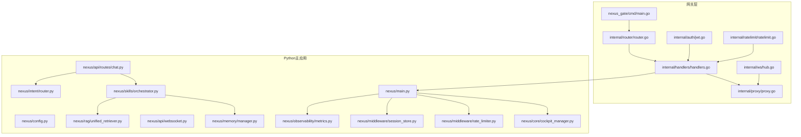
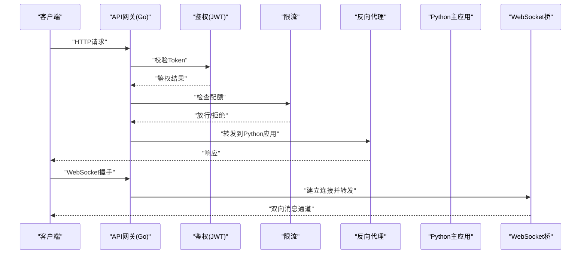
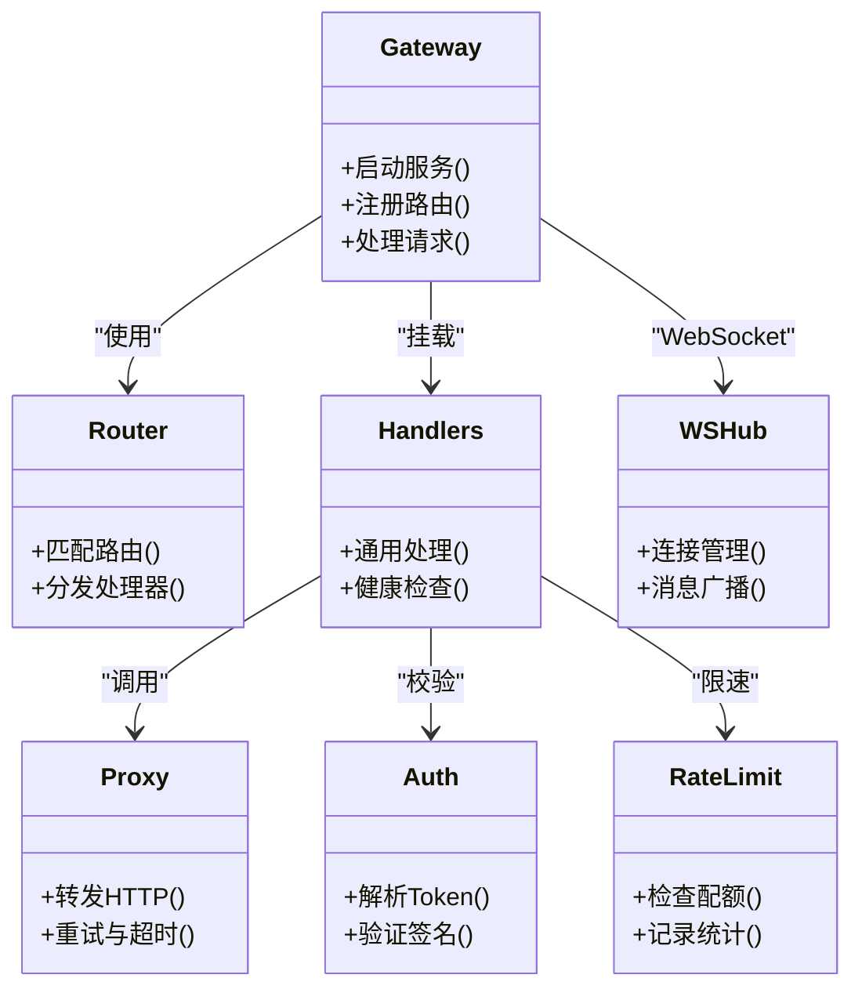
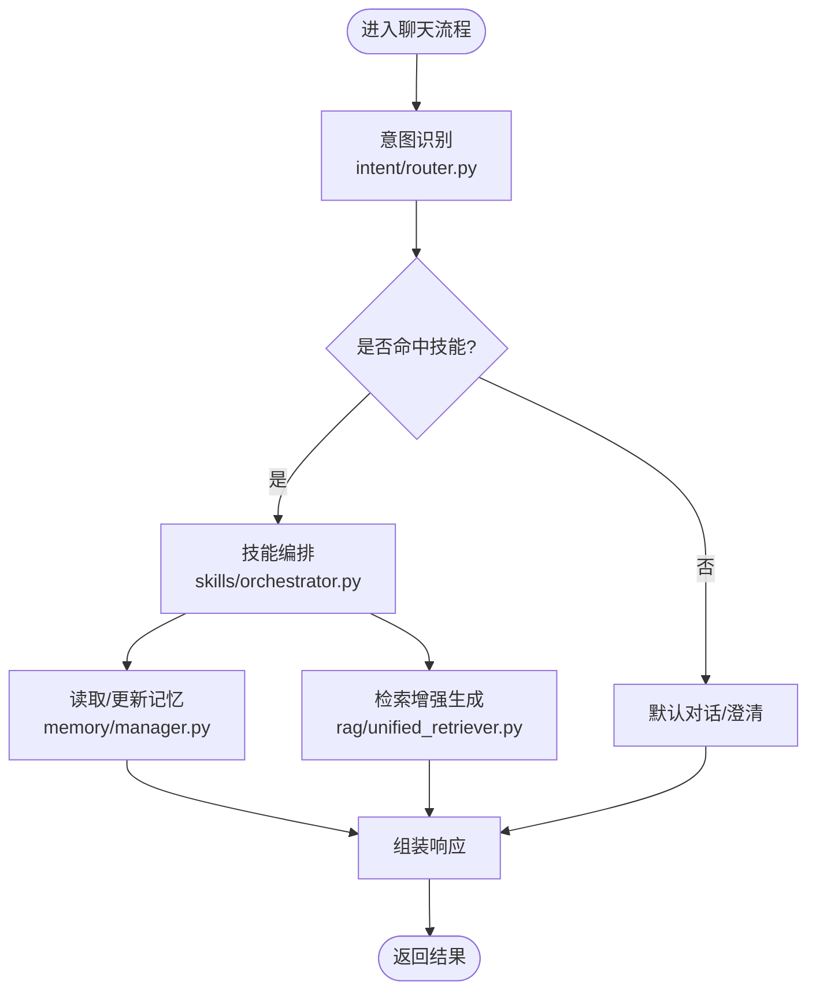
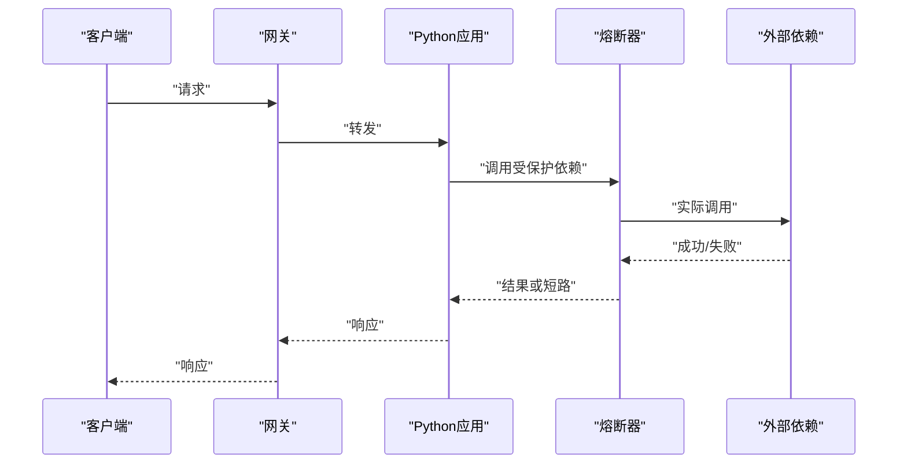
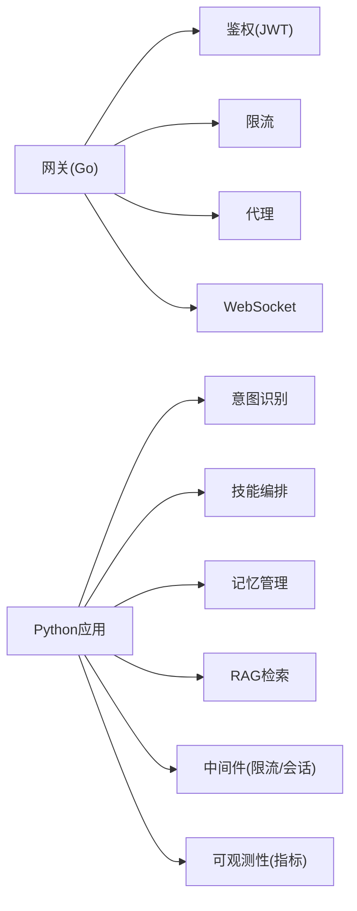

# 微服务拆分设计

<cite>
**本文引用的文件**   
- [backend_design/nexus/main.py](file://backend_design/nexus/main.py)
- [backend_design/nexus/config.py](file://backend_design/nexus/config.py)
- [backend_design/nexus/core/cockpit_manager.py](file://backend_design/nexus/core/cockpit_manager.py)
- [backend_design/nexus/core/auth.py](file://backend_design/nexus/core/auth.py)
- [backend_design/nexus/core/circuit_breaker.py](file://backend_design/nexus/core/circuit_breaker.py)
- [backend_design/nexus/api/routes/chat.py](file://backend_design/nexus/api/routes/chat.py)
- [backend_design/nexus/api/websocket.py](file://backend_design/nexus/api/websocket.py)
- [backend_design/nexus/skills/orchestrator.py](file://backend_design/nexus/skills/orchestrator.py)
- [backend_design/nexus/memory/manager.py](file://backend_design/nexus/memory/manager.py)
- [backend_design/nexus/rag/unified_retriever.py](file://backend_design/nexus/rag/unified_retriever.py)
- [backend_design/nexus/intent/router.py](file://backend_design/nexus/intent/router.py)
- [backend_design/nexus/middleware/rate_limiter.py](file://backend_design/nexus/middleware/rate_limiter.py)
- [backend_design/nexus/middleware/session_store.py](file://backend_design/nexus/middleware/session_store.py)
- [backend_design/nexus/observability/metrics.py](file://backend_design/nexus/observability/metrics.py)
- [backend_design/nexus_gate/cmd/main.go](file://backend_design/nexus_gate/cmd/main.go)
- [backend_design/nexus_gate/internal/router/router.go](file://backend_design/nexus_gate/internal/router/router.go)
- [backend_design/nexus_gate/internal/handlers/handlers.go](file://backend_design/nexus_gate/internal/handlers/handlers.go)
- [backend_design/nexus_gate/internal/proxy/proxy.go](file://backend_design/nexus_gate/internal/proxy/proxy.go)
- [backend_design/nexus_gate/internal/auth/jwt.go](file://backend_design/nexus_gate/internal/auth/jwt.go)
- [backend_design/nexus_gate/internal/ratelimit/ratelimit.go](file://backend_design/nexus_gate/internal/ratelimit/ratelimit.go)
- [backend_design/nexus_gate/internal/ws/hub.go](file://backend_design/nexus_gate/internal/ws/hub.go)
- [docker-compose.yml](file://docker-compose.yml)
</cite>

## 目录
1. [引言](#引言)
2. [项目结构](#项目结构)
3. [核心组件](#核心组件)
4. [架构总览](#架构总览)
5. [详细组件分析](#详细组件分析)
6. [依赖关系分析](#依赖关系分析)
7. [性能考量](#性能考量)
8. [故障排查指南](#故障排查指南)
9. [结论](#结论)
10. [附录](#附录)

## 引言
本设计文档面向NexusCockpit系统的微服务拆分与演进，目标是：
- 明确各微服务的职责边界与设计原则
- 说明API网关（Go）的核心能力：请求路由、负载均衡、限流熔断与安全认证
- 描述Python主应用服务的模块化设计：Agent系统、技能编排、记忆管理、RAG检索等模块的职责边界
- 定义服务间依赖关系与通信协议选择
- 给出服务发现、配置管理与故障隔离机制
- 提供拆分决策的技术考量：性能、开发效率与维护成本
- 绘制服务间调用图与错误传播机制

## 项目结构
仓库采用“后端单体+网关”的混合形态：
- Go实现的API网关位于 backend_design/nexus_gate，承担外部流量入口、鉴权、限流、代理与WebSocket转发
- Python主应用位于 backend_design/nexus，内部以模块化组织，包含API路由、Agent、意图识别、技能编排、记忆、RAG、中间件、可观测性等子系统
- 基础设施与部署通过 docker-compose.yml 统一编排

图表来源
- [backend_design/nexus_gate/cmd/main.go](file://backend_design/nexus_gate/cmd/main.go)
- [backend_design/nexus_gate/internal/router/router.go](file://backend_design/nexus_gate/internal/router/router.go)
- [backend_design/nexus_gate/internal/handlers/handlers.go](file://backend_design/nexus_gate/internal/handlers/handlers.go)
- [backend_design/nexus_gate/internal/proxy/proxy.go](file://backend_design/nexus_gate/internal/proxy/proxy.go)
- [backend_design/nexus_gate/internal/auth/jwt.go](file://backend_design/nexus_gate/internal/auth/jwt.go)
- [backend_design/nexus_gate/internal/ratelimit/ratelimit.go](file://backend_design/nexus_gate/internal/ratelimit/ratelimit.go)
- [backend_design/nexus_gate/internal/ws/hub.go](file://backend_design/nexus_gate/internal/ws/hub.go)
- [backend_design/nexus/main.py](file://backend_design/nexus/main.py)
- [backend_design/nexus/config.py](file://backend_design/nexus/config.py)
- [backend_design/nexus/core/cockpit_manager.py](file://backend_design/nexus/core/cockpit_manager.py)
- [backend_design/nexus/api/routes/chat.py](file://backend_design/nexus/api/routes/chat.py)
- [backend_design/nexus/api/websocket.py](file://backend_design/nexus/api/websocket.py)
- [backend_design/nexus/skills/orchestrator.py](file://backend_design/nexus/skills/orchestrator.py)
- [backend_design/nexus/memory/manager.py](file://backend_design/nexus/memory/manager.py)
- [backend_design/nexus/rag/unified_retriever.py](file://backend_design/nexus/rag/unified_retriever.py)
- [backend_design/nexus/intent/router.py](file://backend_design/nexus/intent/router.py)
- [backend_design/nexus/middleware/rate_limiter.py](file://backend_design/nexus/middleware/rate_limiter.py)
- [backend_design/nexus/middleware/session_store.py](file://backend_design/nexus/middleware/session_store.py)
- [backend_design/nexus/observability/metrics.py](file://backend_design/nexus/observability/metrics.py)

章节来源
- [docker-compose.yml](file://docker-compose.yml)

## 核心组件
- API网关（Go）
  - 负责外部请求接入、JWT鉴权、速率限制、反向代理与WebSocket桥接
  - 将HTTP/WebSocket请求路由至Python主应用或上游服务
- Python主应用（模块化单体）
  - 对外暴露REST与WebSocket接口
  - 内部按领域划分：Agent、意图识别、技能编排、记忆、RAG、中间件、可观测性
- 共享基础设施
  - 配置中心、缓存与会话存储、指标与日志采集（由中间件与可观测性模块对接）

章节来源
- [backend_design/nexus_gate/cmd/main.go](file://backend_design/nexus_gate/cmd/main.go)
- [backend_design/nexus/main.py](file://backend_design/nexus/main.py)

## 架构总览
整体采用“网关前置 + 业务单体模块化”的过渡形态。网关屏蔽下游细节，提供统一的鉴权、限流与代理；Python主应用内部通过清晰的模块边界实现高内聚低耦合，为后续拆分为独立微服务奠定基础。

图表来源
- [backend_design/nexus_gate/cmd/main.go](file://backend_design/nexus_gate/cmd/main.go)
- [backend_design/nexus_gate/internal/auth/jwt.go](file://backend_design/nexus_gate/internal/auth/jwt.go)
- [backend_design/nexus_gate/internal/ratelimit/ratelimit.go](file://backend_design/nexus_gate/internal/ratelimit/ratelimit.go)
- [backend_design/nexus_gate/internal/proxy/proxy.go](file://backend_design/nexus_gate/internal/proxy/proxy.go)
- [backend_design/nexus_gate/internal/ws/hub.go](file://backend_design/nexus_gate/internal/ws/hub.go)
- [backend_design/nexus/api/websocket.py](file://backend_design/nexus/api/websocket.py)

## 详细组件分析

### API网关（Go）
职责与能力
- 请求路由：根据路径与协议将请求分发到对应处理器与上游服务
- 安全认证：集中式JWT校验，透传用户上下文
- 限流熔断：基于令牌桶/漏桶策略进行速率控制；对上游异常进行快速失败与降级
- 负载均衡：在多个Python实例之间做简单轮询或权重分配（可扩展）
- WebSocket支持：作为长连接入口，维护会话并转发消息

关键文件
- 入口与启动：[cmd/main.go](file://backend_design/nexus_gate/cmd/main.go)
- 路由与处理器：[internal/router/router.go](file://backend_design/nexus_gate/internal/router/router.go)、[internal/handlers/handlers.go](file://backend_design/nexus_gate/internal/handlers/handlers.go)
- 反向代理：[internal/proxy/proxy.go](file://backend_design/nexus_gate/internal/proxy/proxy.go)
- 鉴权：[internal/auth/jwt.go](file://backend_design/nexus_gate/internal/auth/jwt.go)
- 限流：[internal/ratelimit/ratelimit.go](file://backend_design/nexus_gate/internal/ratelimit/ratelimit.go)
- WebSocket：[internal/ws/hub.go](file://backend_design/nexus_gate/internal/ws/hub.go)

图表来源
- [backend_design/nexus_gate/cmd/main.go](file://backend_design/nexus_gate/cmd/main.go)
- [backend_design/nexus_gate/internal/router/router.go](file://backend_design/nexus_gate/internal/router/router.go)
- [backend_design/nexus_gate/internal/handlers/handlers.go](file://backend_design/nexus_gate/internal/handlers/handlers.go)
- [backend_design/nexus_gate/internal/proxy/proxy.go](file://backend_design/nexus_gate/internal/proxy/proxy.go)
- [backend_design/nexus_gate/internal/auth/jwt.go](file://backend_design/nexus_gate/internal/auth/jwt.go)
- [backend_design/nexus_gate/internal/ratelimit/ratelimit.go](file://backend_design/nexus_gate/internal/ratelimit/ratelimit.go)
- [backend_design/nexus_gate/internal/ws/hub.go](file://backend_design/nexus_gate/internal/ws/hub.go)

章节来源
- [backend_design/nexus_gate/cmd/main.go](file://backend_design/nexus_gate/cmd/main.go)
- [backend_design/nexus_gate/internal/router/router.go](file://backend_design/nexus_gate/internal/router/router.go)
- [backend_design/nexus_gate/internal/handlers/handlers.go](file://backend_design/nexus_gate/internal/handlers/handlers.go)
- [backend_design/nexus_gate/internal/proxy/proxy.go](file://backend_design/nexus_gate/internal/proxy/proxy.go)
- [backend_design/nexus_gate/internal/auth/jwt.go](file://backend_design/nexus_gate/internal/auth/jwt.go)
- [backend_design/nexus_gate/internal/ratelimit/ratelimit.go](file://backend_design/nexus_gate/internal/ratelimit/ratelimit.go)
- [backend_design/nexus_gate/internal/ws/hub.go](file://backend_design/nexus_gate/internal/ws/hub.go)

### Python主应用（模块化单体）
总体职责
- 提供REST与WebSocket接口，承载对话、车辆控制、数据平台、设置、健康检查等能力
- 内部按领域划分为Agent、意图识别、技能编排、记忆、RAG、中间件与可观测性

关键文件
- 应用入口与生命周期：[main.py](file://backend_design/nexus/main.py)
- 配置加载：[config.py](file://backend_design/nexus/config.py)
- 会话与状态：[core/cockpit_manager.py](file://backend_design/nexus/core/cockpit_manager.py)
- 鉴权集成：[core/auth.py](file://backend_design/nexus/core/auth.py)
- 熔断器：[core/circuit_breaker.py](file://backend_design/nexus/core/circuit_breaker.py)
- 聊天API：[api/routes/chat.py](file://backend_design/nexus/api/routes/chat.py)
- WebSocket：[api/websocket.py](file://backend_design/nexus/api/websocket.py)
- 技能编排：[skills/orchestrator.py](file://backend_design/nexus/skills/orchestrator.py)
- 记忆管理：[memory/manager.py](file://backend_design/nexus/memory/manager.py)
- RAG检索：[rag/unified_retriever.py](file://backend_design/nexus/rag/unified_retriever.py)
- 意图路由：[intent/router.py](file://backend_design/nexus/intent/router.py)
- 限流中间件：[middleware/rate_limiter.py](file://backend_design/nexus/middleware/rate_limiter.py)
- 会话存储：[middleware/session_store.py](file://backend_design/nexus/middleware/session_store.py)
- 指标上报：[observability/metrics.py](file://backend_design/nexus/observability/metrics.py)

图表来源
- [backend_design/nexus/intent/router.py](file://backend_design/nexus/intent/router.py)
- [backend_design/nexus/skills/orchestrator.py](file://backend_design/nexus/skills/orchestrator.py)
- [backend_design/nexus/memory/manager.py](file://backend_design/nexus/memory/manager.py)
- [backend_design/nexus/rag/unified_retriever.py](file://backend_design/nexus/rag/unified_retriever.py)
- [backend_design/nexus/api/routes/chat.py](file://backend_design/nexus/api/routes/chat.py)

章节来源
- [backend_design/nexus/main.py](file://backend_design/nexus/main.py)
- [backend_design/nexus/config.py](file://backend_design/nexus/config.py)
- [backend_design/nexus/core/cockpit_manager.py](file://backend_design/nexus/core/cockpit_manager.py)
- [backend_design/nexus/core/auth.py](file://backend_design/nexus/core/auth.py)
- [backend_design/nexus/core/circuit_breaker.py](file://backend_design/nexus/core/circuit_breaker.py)
- [backend_design/nexus/api/routes/chat.py](file://backend_design/nexus/api/routes/chat.py)
- [backend_design/nexus/api/websocket.py](file://backend_design/nexus/api/websocket.py)
- [backend_design/nexus/skills/orchestrator.py](file://backend_design/nexus/skills/orchestrator.py)
- [backend_design/nexus/memory/manager.py](file://backend_design/nexus/memory/manager.py)
- [backend_design/nexus/rag/unified_retriever.py](file://backend_design/nexus/rag/unified_retriever.py)
- [backend_design/nexus/intent/router.py](file://backend_design/nexus/intent/router.py)
- [backend_design/nexus/middleware/rate_limiter.py](file://backend_design/nexus/middleware/rate_limiter.py)
- [backend_design/nexus/middleware/session_store.py](file://backend_design/nexus/middleware/session_store.py)
- [backend_design/nexus/observability/metrics.py](file://backend_design/nexus/observability/metrics.py)

### 服务间调用与错误传播
- 调用链
  - 客户端 -> 网关（鉴权/限流） -> Python主应用（路由/编排） -> 外部依赖（向量库/图数据库/LLM/TTS/ASR）
- 错误传播
  - 网关层：对上游不可用或超时进行快速失败，返回标准错误码与提示
  - 应用层：通过熔断器保护脆弱依赖，避免雪崩；中间件统一捕获异常并上报指标
  - 可观测性：指标与链路追踪贯穿网关与应用，便于定位问题

图表来源
- [backend_design/nexus/core/circuit_breaker.py](file://backend_design/nexus/core/circuit_breaker.py)
- [backend_design/nexus_gate/internal/proxy/proxy.go](file://backend_design/nexus_gate/internal/proxy/proxy.go)
- [backend_design/nexus/observability/metrics.py](file://backend_design/nexus/observability/metrics.py)

## 依赖关系分析
- 直接依赖
  - 网关依赖鉴权、限流、代理与WebSocket模块
  - Python应用依赖中间件（限流、会话）、核心管理器（会话/状态）、意图/技能/记忆/RAG等子域
- 间接依赖
  - 通过中间件与可观测性模块对接外部存储与监控体系
- 潜在循环
  - 当前模块按领域分层，未见明显循环导入；建议保持单向依赖（上层调用下层）

图表来源
- [backend_design/nexus_gate/internal/auth/jwt.go](file://backend_design/nexus_gate/internal/auth/jwt.go)
- [backend_design/nexus_gate/internal/ratelimit/ratelimit.go](file://backend_design/nexus_gate/internal/ratelimit/ratelimit.go)
- [backend_design/nexus_gate/internal/proxy/proxy.go](file://backend_design/nexus_gate/internal/proxy/proxy.go)
- [backend_design/nexus_gate/internal/ws/hub.go](file://backend_design/nexus_gate/internal/ws/hub.go)
- [backend_design/nexus/intent/router.py](file://backend_design/nexus/intent/router.py)
- [backend_design/nexus/skills/orchestrator.py](file://backend_design/nexus/skills/orchestrator.py)
- [backend_design/nexus/memory/manager.py](file://backend_design/nexus/memory/manager.py)
- [backend_design/nexus/rag/unified_retriever.py](file://backend_design/nexus/rag/unified_retriever.py)
- [backend_design/nexus/middleware/rate_limiter.py](file://backend_design/nexus/middleware/rate_limiter.py)
- [backend_design/nexus/middleware/session_store.py](file://backend_design/nexus/middleware/session_store.py)
- [backend_design/nexus/observability/metrics.py](file://backend_design/nexus/observability/metrics.py)

章节来源
- [backend_design/nexus_gate/cmd/main.go](file://backend_design/nexus_gate/cmd/main.go)
- [backend_design/nexus/main.py](file://backend_design/nexus/main.py)

## 性能考量
- 网关侧
  - 使用Go的高并发模型提升吞吐；对热点路径启用连接复用与短超时
  - 限流策略按IP/用户维度区分，避免单点打满
- 应用侧
  - 对耗时I/O（RAG检索、LLM调用、TTS/ASR）异步化与批量化
  - 引入熔断与退避，降低级联故障风险
  - 会话与缓存落Redis，减少重复计算与IO
- 可观测性
  - 指标与链路追踪覆盖关键路径，支撑容量规划与瓶颈定位

## 故障排查指南
- 常见问题
  - 鉴权失败：检查JWT签名与过期时间
  - 限流触发：查看网关与应用层的配额与阈值
  - 上游超时：关注代理超时与熔断器状态
  - WebSocket断连：检查Hub连接数与心跳
- 定位手段
  - 指标面板：查看QPS、延迟分布、错误率
  - 日志聚合：结合TraceID串联跨服务日志
  - 熔断器状态：确认是否处于半开/关闭状态

章节来源
- [backend_design/nexus_gate/internal/auth/jwt.go](file://backend_design/nexus_gate/internal/auth/jwt.go)
- [backend_design/nexus_gate/internal/ratelimit/ratelimit.go](file://backend_design/nexus_gate/internal/ratelimit/ratelimit.go)
- [backend_design/nexus_gate/internal/proxy/proxy.go](file://backend_design/nexus_gate/internal/proxy/proxy.go)
- [backend_design/nexus_gate/internal/ws/hub.go](file://backend_design/nexus_gate/internal/ws/hub.go)
- [backend_design/nexus/core/circuit_breaker.py](file://backend_design/nexus/core/circuit_breaker.py)
- [backend_design/nexus/observability/metrics.py](file://backend_design/nexus/observability/metrics.py)

## 结论
当前架构以“网关前置 + 模块化单体”为主，具备清晰的职责边界与扩展空间。下一步可按领域逐步拆分为独立微服务（如意图服务、技能编排服务、记忆服务、RAG服务），配合服务发现、配置中心与统一的可观测性平台，进一步提升弹性与可维护性。

## 附录

### 服务拆分决策与技术考量
- 性能要求
  - 高并发与低延迟：网关与热点路径优先Go实现；Python侧聚焦AI推理与复杂逻辑
- 开发效率
  - 模块化单体利于快速迭代；随复杂度增长再拆分为微服务
- 维护成本
  - 统一网关收敛鉴权与限流；中间件与可观测性标准化降低运维负担

### 服务发现、配置管理与故障隔离
- 服务发现
  - 当前通过配置文件与容器编排固定地址；未来可引入轻量服务注册中心
- 配置管理
  - 应用侧通过配置模块加载环境变量与配置文件；网关与应用保持一致的配置键约定
- 故障隔离
  - 网关层限流与熔断；应用层熔断器保护脆弱依赖；WebSocket Hub隔离连接资源

章节来源
- [backend_design/nexus/config.py](file://backend_design/nexus/config.py)
- [backend_design/nexus/core/circuit_breaker.py](file://backend_design/nexus/core/circuit_breaker.py)
- [backend_design/nexus/middleware/rate_limiter.py](file://backend_design/nexus/middleware/rate_limiter.py)
- [backend_design/nexus_gate/internal/ratelimit/ratelimit.go](file://backend_design/nexus_gate/internal/ratelimit/ratelimit.go)
- [docker-compose.yml](file://docker-compose.yml)