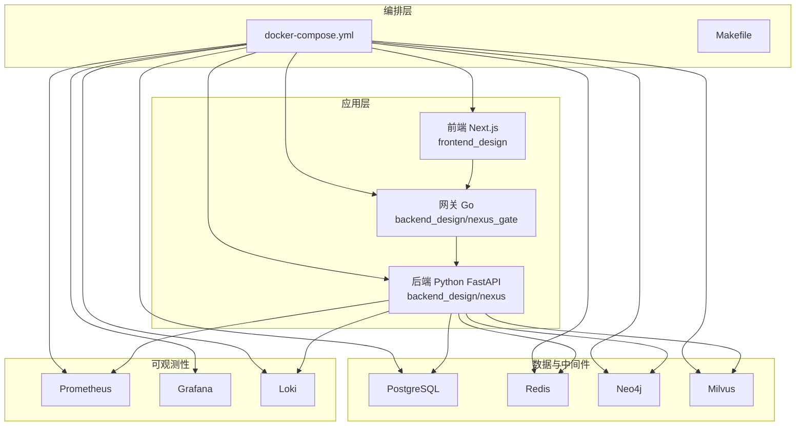
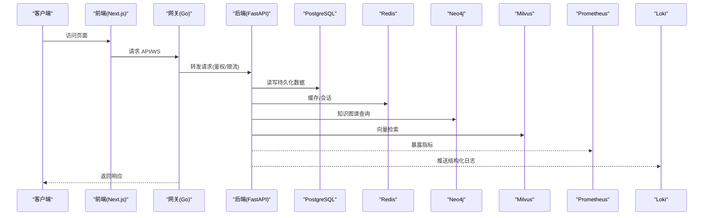
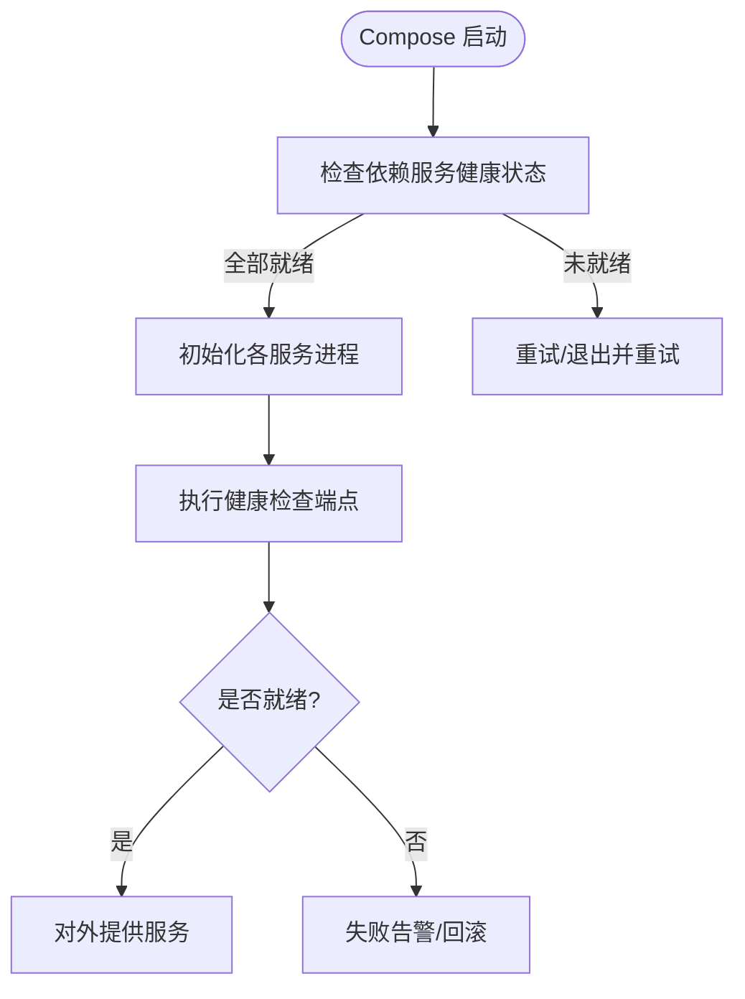
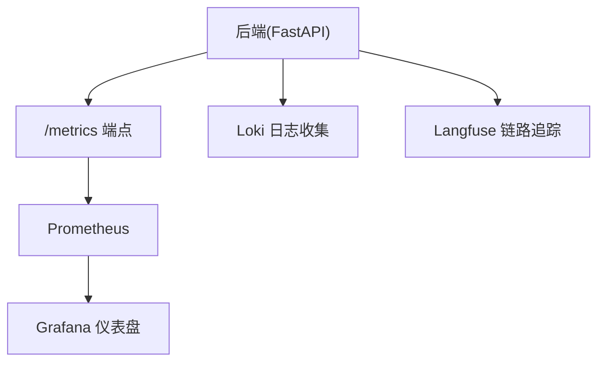
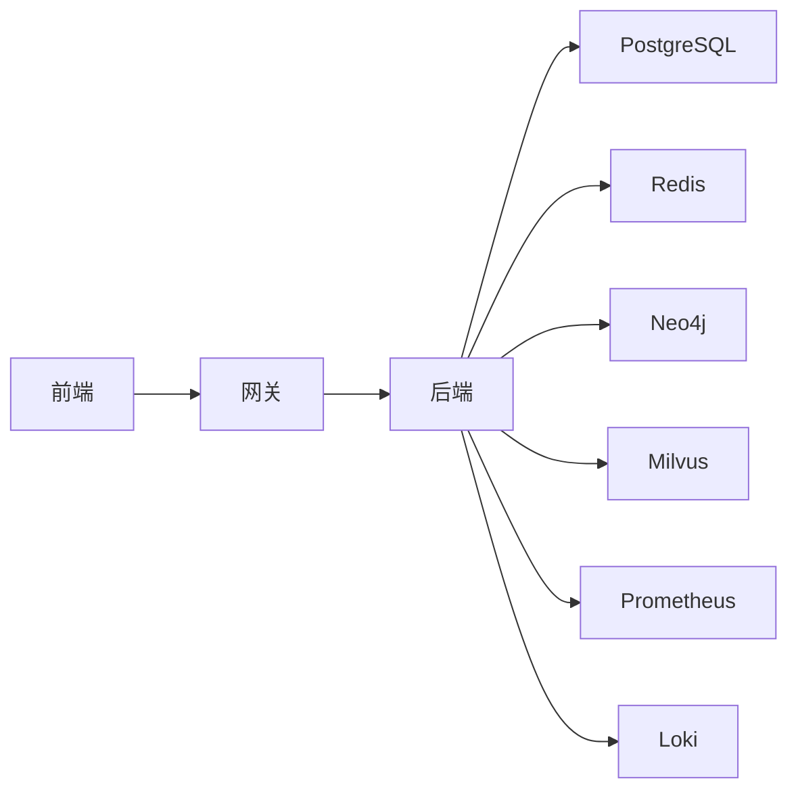

# 服务依赖与配置管理

<cite>
**本文引用的文件**   
- [docker-compose.yml](file://docker-compose.yml)
- [backend_design/Dockerfile](file://backend_design/Dockerfile)
- [backend_design/pyproject.toml](file://backend_design/pyproject.toml)
- [backend_design/requirements.txt](file://backend_design/requirements.txt)
- [backend_design/requirements_no_torch.txt](file://backend_design/requirements_no_torch.txt)
- [backend_design/nexus/main.py](file://backend_design/nexus/main.py)
- [backend_design/nexus/config.py](file://backend_design/nexus/config.py)
- [backend_design/nexus/core/db_manager.py](file://backend_design/nexus/core/db_manager.py)
- [backend_design/nexus/middleware/redis_cache.py](file://backend_design/nexus/middleware/redis_cache.py)
- [backend_design/nexus/middleware/task_queue.py](file://backend_design/nexus/middleware/task_queue.py)
- [backend_design/nexus/api/routes/health.py](file://backend_design/nexus/api/routes/health.py)
- [backend_design/nexus/observability/langfuse.py](file://backend_design/nexus/observability/langfuse.py)
- [backend_design/nexus_gate/Dockerfile](file://backend_design/nexus_gate/Dockerfile)
- [backend_design/nexus_gate/go.mod](file://backend_design/nexus_gate/go.mod)
- [backend_design/nexus_gate/internal/config/config.go](file://backend_design/nexus_gate/internal/config/config.go)
- [frontend_design/Dockerfile](file://frontend_design/Dockerfile)
- [frontend_design/package.json](file://frontend_design/package.json)
- [frontend_design/next.config.js](file://frontend_design/next.config.js)
- [config/prometheus/prometheus.yml](file://config/prometheus/prometheus.yml)
- [config/grafana/provisioning/datasources/prometheus.yml](file://config/grafana/provisioning/datasources/prometheus.yml)
- [config/grafana/provisioning/dashboards/dashboards.yml](file://config/grafana/provisioning/dashboards/dashboards.yml)
- [config/grafana/provisioning/dashboards/nexuscockpit-overview.json](file://config/grafana/provisioning/dashboards/nexuscockpit-overview.json)
- [config/loki/loki-config.yml/](file://config/loki/loki-config.yml/)
- [scripts/init_neo4j.py](file://scripts/init_neo4j.py)
- [scripts/init_milvus.py](file://scripts/init_milvus.py)
- [Makefile](file://Makefile)
</cite>

## 目录
1. [简介](#简介)
2. [项目结构](#项目结构)
3. [核心组件](#核心组件)
4. [架构总览](#架构总览)
5. [详细组件分析](#详细组件分析)
6. [依赖关系分析](#依赖关系分析)
7. [性能考虑](#性能考虑)
8. [故障排查指南](#故障排查指南)
9. [结论](#结论)
10. [附录](#附录)

## 简介
本文件聚焦于 NexusCockpit 的服务依赖与配置管理，覆盖以下方面：
- 容器化编排与服务启动顺序、健康检查
- Python 后端依赖管理（requirements.txt、pyproject.toml）
- 前端包管理与构建配置
- 环境变量与配置文件组织
- 数据库、缓存、消息队列等基础设施配置
- 监控与日志集成
- 版本兼容性与升级策略
- 开发、测试、生产环境差异化配置
- 具体配置示例与故障排查方法

## 项目结构
NexusCockpit 采用多语言微服务形态：
- 后端服务：Python FastAPI 应用（backend_design），提供业务 API、中间件、可观测性能力
- 网关服务：Go 实现的反向代理与鉴权（backend_design/nexus_gate）
- 前端应用：Next.js 静态站点（frontend_design）
- 基础设施：PostgreSQL、Redis、Neo4j、Milvus、Prometheus、Grafana、Loki 等
- 编排与脚本：docker-compose.yml、初始化脚本、Makefile

图表来源
- [docker-compose.yml](file://docker-compose.yml)
- [backend_design/nexus/main.py](file://backend_design/nexus/main.py)
- [backend_design/nexus_gate/internal/config/config.go](file://backend_design/nexus_gate/internal/config/config.go)
- [frontend_design/next.config.js](file://frontend_design/next.config.js)

章节来源
- [docker-compose.yml](file://docker-compose.yml)
- [Makefile](file://Makefile)

## 核心组件
- 后端服务（Python）
  - 入口与生命周期：FastAPI 应用启动、路由注册、中间件挂载
  - 配置加载：环境变量与配置文件合并
  - 数据访问：数据库连接池、图数据库、向量库
  - 缓存与会话：Redis 缓存、会话存储
  - 任务队列：异步任务处理
  - 可观测性：指标采集、链路追踪、结构化日志
- 网关服务（Go）
  - 反向代理、鉴权、限流、WebSocket 转发
  - 配置加载与环境变量注入
- 前端应用（Next.js）
  - 构建产物输出、静态资源托管
  - 环境变量注入到运行时
- 基础设施
  - 数据库、缓存、图数据库、向量库、监控与日志

章节来源
- [backend_design/nexus/main.py](file://backend_design/nexus/main.py)
- [backend_design/nexus/config.py](file://backend_design/nexus/config.py)
- [backend_design/nexus/core/db_manager.py](file://backend_design/nexus/core/db_manager.py)
- [backend_design/nexus/middleware/redis_cache.py](file://backend_design/nexus/middleware/redis_cache.py)
- [backend_design/nexus/middleware/task_queue.py](file://backend_design/nexus/middleware/task_queue.py)
- [backend_design/nexus_gate/internal/config/config.go](file://backend_design/nexus_gate/internal/config/config.go)
- [frontend_design/next.config.js](file://frontend_design/next.config.js)

## 架构总览
下图展示服务间调用与依赖关系，以及关键配置项的注入路径。

图表来源
- [backend_design/nexus/main.py](file://backend_design/nexus/main.py)
- [backend_design/nexus_gate/internal/config/config.go](file://backend_design/nexus_gate/internal/config/config.go)
- [backend_design/nexus/core/db_manager.py](file://backend_design/nexus/core/db_manager.py)
- [backend_design/nexus/middleware/redis_cache.py](file://backend_design/nexus/middleware/redis_cache.py)
- [backend_design/nexus/middleware/task_queue.py](file://backend_design/nexus/middleware/task_queue.py)
- [config/prometheus/prometheus.yml](file://config/prometheus/prometheus.yml)
- [config/grafana/provisioning/datasources/prometheus.yml](file://config/grafana/provisioning/datasources/prometheus.yml)

## 详细组件分析

### 容器化部署与服务编排
- 服务清单与网络
  - 通过 docker-compose 定义所有服务，统一网络与卷挂载
  - 服务间通过服务名解析通信（如 redis、postgres、neo4j、milvus）
- 启动顺序与健康检查
  - 使用 depends_on 与 healthcheck 控制依赖服务的就绪状态
  - 后端服务在启动时进行必要依赖可用性探测（数据库、缓存、图数据库、向量库）
  - 网关服务等待后端可用后再接受流量
- 镜像构建
  - 后端与网关分别提供 Dockerfile，基于最小化基础镜像并复制构建产物
  - 前端通过独立 Dockerfile 生成静态资源并由 Nginx 或网关分发

图表来源
- [docker-compose.yml](file://docker-compose.yml)
- [backend_design/Dockerfile](file://backend_design/Dockerfile)
- [backend_design/nexus_gate/Dockerfile](file://backend_design/nexus_gate/Dockerfile)
- [backend_design/nexus/api/routes/health.py](file://backend_design/nexus/api/routes/health.py)

章节来源
- [docker-compose.yml](file://docker-compose.yml)
- [backend_design/Dockerfile](file://backend_design/Dockerfile)
- [backend_design/nexus_gate/Dockerfile](file://backend_design/nexus_gate/Dockerfile)
- [backend_design/nexus/api/routes/health.py](file://backend_design/nexus/api/routes/health.py)

### Python 项目依赖管理
- requirements.txt
  - 列出运行时依赖，便于快速安装与 CI 构建
- pyproject.toml
  - 定义项目元信息、构建工具链、可选依赖分组（如 GPU/非 GPU）
  - 支持按场景选择不同依赖集（例如包含 torch 与不包含 torch 的版本）
- requirements_no_torch.txt
  - 用于无 GPU 环境的轻量安装，避免不必要的重型依赖

建议实践
- 将可重复构建的锁定文件纳入版本控制（若使用 pip-tools/pipenv/poetry 等）
- 在 CI 中并行安装依赖并缓存虚拟环境，缩短构建时间

章节来源
- [backend_design/requirements.txt](file://backend_design/requirements.txt)
- [backend_design/pyproject.toml](file://backend_design/pyproject.toml)
- [backend_design/requirements_no_torch.txt](file://backend_design/requirements_no_torch.txt)

### 前端包管理与构建配置
- package.json
  - 声明依赖、脚本命令（构建、预览、类型检查等）
- next.config.js
  - 配置 Next.js 行为（环境变量注入、代理、静态资源等）
- Dockerfile
  - 构建阶段安装依赖并生成静态产物，运行阶段仅托管静态资源

章节来源
- [frontend_design/package.json](file://frontend_design/package.json)
- [frontend_design/next.config.js](file://frontend_design/next.config.js)
- [frontend_design/Dockerfile](file://frontend_design/Dockerfile)

### 环境变量与配置文件组织
- 后端配置
  - 通过 config.py 集中读取环境变量，提供默认值与校验
  - 关键配置项包括数据库连接、Redis、图数据库、向量库、鉴权密钥、限流策略、可观测性端点等
- 网关配置
  - 通过 internal/config/config.go 加载环境变量，注入到鉴权、限流、代理模块
- 前端配置
  - 通过 next.config.js 注入构建期环境变量（如 API 地址、功能开关）
- 监控与日志
  - Prometheus 抓取目标由 prometheus.yml 定义
  - Grafana 数据源与仪表盘通过 provisioning 自动注入
  - Loki 配置文件位于 config/loki/loki-config.yml/

章节来源
- [backend_design/nexus/config.py](file://backend_design/nexus/config.py)
- [backend_design/nexus_gate/internal/config/config.go](file://backend_design/nexus_gate/internal/config/config.go)
- [frontend_design/next.config.js](file://frontend_design/next.config.js)
- [config/prometheus/prometheus.yml](file://config/prometheus/prometheus.yml)
- [config/grafana/provisioning/datasources/prometheus.yml](file://config/grafana/provisioning/datasources/prometheus.yml)
- [config/grafana/provisioning/dashboards/dashboards.yml](file://config/grafana/provisioning/dashboards/dashboards.yml)
- [config/grafana/provisioning/dashboards/nexuscockpit-overview.json](file://config/grafana/provisioning/dashboards/nexuscockpit-overview.json)
- [config/loki/loki-config.yml/](file://config/loki/loki-config.yml/)

### 数据库、缓存、消息队列等基础设施配置
- 数据库（PostgreSQL）
  - 连接参数由后端 db_manager 管理，支持连接池与重连策略
- 缓存与会话（Redis）
  - 通过 redis_cache 中间件实现缓存与会话存储
- 图数据库（Neo4j）
  - 初始化脚本 scripts/init_neo4j.py 负责 schema 与种子数据
- 向量库（Milvus）
  - 初始化脚本 scripts/init_milvus.py 负责集合创建与索引
- 任务队列
  - task_queue 中间件封装异步任务处理逻辑（如后台推理、数据处理）

章节来源
- [backend_design/nexus/core/db_manager.py](file://backend_design/nexus/core/db_manager.py)
- [backend_design/nexus/middleware/redis_cache.py](file://backend_design/nexus/middleware/redis_cache.py)
- [scripts/init_neo4j.py](file://scripts/init_neo4j.py)
- [scripts/init_milvus.py](file://scripts/init_milvus.py)
- [backend_design/nexus/middleware/task_queue.py](file://backend_design/nexus/middleware/task_queue.py)

### 监控与日志系统集成
- 指标采集
  - 后端暴露 /metrics 端点，Prometheus 定期抓取
  - Grafana 通过数据源与仪表盘可视化系统指标与应用指标
- 链路追踪
  - 集成 Langfuse 进行 LLM 调用链路追踪与评估
- 结构化日志
  - 后端输出结构化日志至 Loki，便于聚合与检索

图表来源
- [config/prometheus/prometheus.yml](file://config/prometheus/prometheus.yml)
- [config/grafana/provisioning/datasources/prometheus.yml](file://config/grafana/provisioning/datasources/prometheus.yml)
- [config/grafana/provisioning/dashboards/dashboards.yml](file://config/grafana/provisioning/dashboards/dashboards.yml)
- [config/grafana/provisioning/dashboards/nexuscockpit-overview.json](file://config/grafana/provisioning/dashboards/nexuscockpit-overview.json)
- [backend_design/nexus/observability/langfuse.py](file://backend_design/nexus/observability/langfuse.py)

章节来源
- [backend_design/nexus/observability/langfuse.py](file://backend_design/nexus/observability/langfuse.py)
- [config/prometheus/prometheus.yml](file://config/prometheus/prometheus.yml)
- [config/grafana/provisioning/datasources/prometheus.yml](file://config/grafana/provisioning/datasources/prometheus.yml)
- [config/grafana/provisioning/dashboards/dashboards.yml](file://config/grafana/provisioning/dashboards/dashboards.yml)
- [config/grafana/provisioning/dashboards/nexuscockpit-overview.json](file://config/grafana/provisioning/dashboards/nexuscockpit-overview.json)

### 服务版本兼容性与升级策略
- 依赖锁定与隔离
  - 使用独立的虚拟环境与锁定文件，确保构建可重复
- 渐进式升级
  - 先升级非关键依赖，验证健康检查与端到端用例通过后，再升级核心依赖
- 向后兼容
  - API 变更遵循语义化版本，保留旧接口一段时间并提供迁移脚本
- 灰度发布
  - 通过网关权重分流与蓝绿部署降低风险

章节来源
- [backend_design/pyproject.toml](file://backend_design/pyproject.toml)
- [backend_design/requirements.txt](file://backend_design/requirements.txt)
- [backend_design/requirements_no_torch.txt](file://backend_design/requirements_no_torch.txt)

### 环境差异化配置（开发、测试、生产）
- 开发环境
  - 启用热重载、详细日志、本地模型与 Mock 数据
- 测试环境
  - 使用轻量依赖（requirements_no_torch.txt）、内存数据库或临时实例
- 生产环境
  - 关闭调试模式、启用限流与熔断、严格的健康检查与告警
- 配置切换
  - 通过环境变量与 Compose 的 env_file 区分不同环境

章节来源
- [docker-compose.yml](file://docker-compose.yml)
- [backend_design/requirements_no_torch.txt](file://backend_design/requirements_no_torch.txt)

## 依赖关系分析
- 直接依赖
  - 后端依赖数据库、缓存、图数据库、向量库、监控与日志
  - 网关依赖后端服务与 Redis（用于鉴权与限流）
  - 前端依赖网关提供的 API 与 WebSocket 端点
- 间接依赖
  - 监控与日志为横切关注点，被多个服务共享
- 潜在循环依赖
  - 网关不应依赖后端业务细节，仅做协议转换与鉴权
  - 后端不反向依赖网关，保持解耦

图表来源
- [docker-compose.yml](file://docker-compose.yml)
- [backend_design/nexus/main.py](file://backend_design/nexus/main.py)
- [backend_design/nexus_gate/internal/config/config.go](file://backend_design/nexus_gate/internal/config/config.go)

章节来源
- [docker-compose.yml](file://docker-compose.yml)
- [backend_design/nexus/main.py](file://backend_design/nexus/main.py)
- [backend_design/nexus_gate/internal/config/config.go](file://backend_design/nexus_gate/internal/config/config.go)

## 性能考虑
- 连接池与超时
  - 数据库与缓存连接池大小需根据负载调优；设置合理的超时与重试策略
- 缓存命中率
  - 热点数据优先走 Redis，减少数据库压力
- 异步任务
  - 将耗时操作放入任务队列，避免阻塞主线程
- 监控与告警
  - 对关键指标（QPS、延迟、错误率、资源使用）设置阈值告警

[本节为通用指导，无需特定文件引用]

## 故障排查指南
- 服务无法启动
  - 检查健康检查端点与依赖服务连通性
  - 查看容器日志与系统指标
- 数据库连接失败
  - 确认连接参数、网络可达性与权限
  - 使用 init 脚本验证 schema 正确性
- 缓存不可用
  - 检查 Redis 端口、密码与网络策略
- 监控缺失
  - 确认 /metrics 端点可达，Prometheus 抓取目标已配置
- 日志缺失
  - 检查 Loki 配置与后端日志输出格式

章节来源
- [backend_design/nexus/api/routes/health.py](file://backend_design/nexus/api/routes/health.py)
- [backend_design/nexus/core/db_manager.py](file://backend_design/nexus/core/db_manager.py)
- [backend_design/nexus/middleware/redis_cache.py](file://backend_design/nexus/middleware/redis_cache.py)
- [config/prometheus/prometheus.yml](file://config/prometheus/prometheus.yml)
- [config/grafana/provisioning/datasources/prometheus.yml](file://config/grafana/provisioning/datasources/prometheus.yml)

## 结论
NexusCockpit 通过容器编排统一管理多语言服务与基础设施，结合完善的依赖管理与配置体系，实现了高内聚、低耦合的可扩展架构。借助健康检查、监控与日志，系统在开发与生产环境中均具备良好的可观测性与可维护性。建议在持续集成中强化依赖锁定与自动化测试，以保障版本兼容与稳定升级。

[本节为总结性内容，无需特定文件引用]

## 附录
- 常用命令
  - 使用 Makefile 编排常见任务（构建、启动、测试）
- 参考文档
  - 部署与验证指南、架构文档、语音与 RAG 相关说明

章节来源
- [Makefile](file://Makefile)