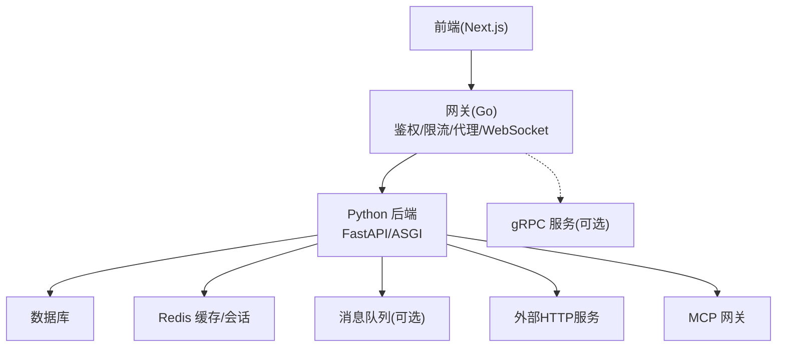
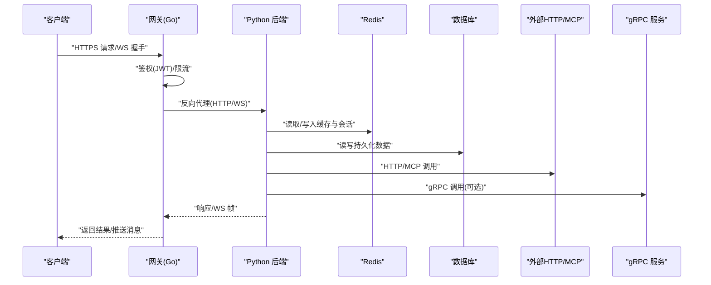
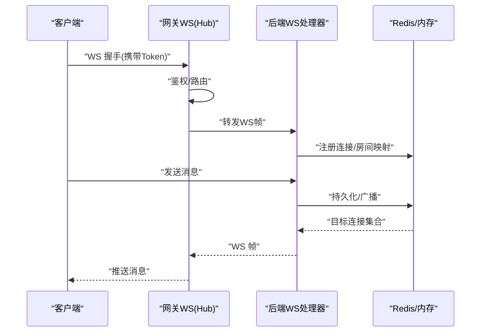
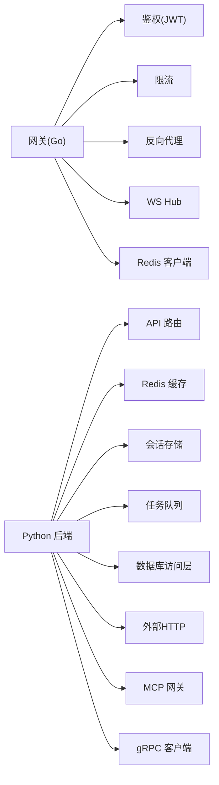

# 服务间通信机制

<cite>
**本文引用的文件**   
- [backend_design/nexus/main.py](file://backend_design/nexus/main.py)
- [backend_design/nexus/api/websocket.py](file://backend_design/nexus/api/websocket.py)
- [backend_design/nexus/core/db_manager.py](file://backend_design/nexus/core/db_manager.py)
- [backend_design/nexus/middleware/redis_cache.py](file://backend_design/nexus/middleware/redis_cache.py)
- [backend_design/nexus/middleware/session_store.py](file://backend_design/nexus/middleware/session_store.py)
- [backend_design/nexus/middleware/task_queue.py](file://backend_design/nexus/middleware/task_queue.py)
- [backend_design/nexus/core/circuit_breaker.py](file://backend_design/nexus/core/circuit_breaker.py)
- [backend_design/nexus/config.py](file://backend_design/nexus/config.py)
- [backend_design/nexus_gate/internal/proxy/proxy.go](file://backend_design/nexus_gate/internal/proxy/proxy.go)
- [backend_design/nexus_gate/internal/ws/hub.go](file://backend_design/nexus_gate/internal/ws/hub.go)
- [backend_design/nexus_gate/proto/nexus.proto](file://backend_design/nexus_gate/proto/nexus.proto)
- [backend_design/nexus_gate/internal/auth/jwt.go](file://backend_design/nexus_gate/internal/auth/jwt.go)
- [backend_design/nexus_gate/internal/ratelimit/ratelimit.go](file://backend_design/nexus_gate/internal/ratelimit/ratelimit.go)
- [backend_design/nexus_gate/internal/handlers/redis_client.go](file://backend_design/nexus_gate/internal/handlers/redis_client.go)
- [backend_design/nexus_gate/cmd/main.go](file://backend_design/nexus_gate/cmd/main.go)
- [backend_design/nexus/api/routes/chat.py](file://backend_design/nexus/api/routes/chat.py)
- [backend_design/nexus/api/routes/cockpit.py](file://backend_design/nexus/api/routes/cockpit.py)
- [backend_design/nexus/api/routes/admin.py](file://backend_design/nexus/api/routes/admin.py)
- [backend_design/nexus/api/routes/settings.py](file://backend_design/nexus/api/routes/settings.py)
- [backend_design/nexus/api/routes/health.py](file://backend_design/nexus/api/routes/health.py)
- [backend_design/nexus/api/routes/dataplatform.py](file://backend_design/nexus/api/routes/dataplatform.py)
- [backend_design/nexus/api/routes/asr.py](file://backend_design/nexus/api/routes/asr.py)
- [backend_design/nexus/api/routes/vehicle.py](file://backend_design/nexus/api/routes/vehicle.py)
- [backend_design/nexus/api/routes/middleware_status.py](file://backend_design/nexus/api/routes/middleware_status.py)
- [backend_design/nexus/models/schemas.py](file://backend_design/nexus/models/schemas.py)
- [backend_design/nexus/intent/router.py](file://backend_design/nexus/intent/router.py)
- [backend_design/nexus/vehicle/http.py](file://backend_design/nexus/vehicle/http.py)
- [backend_design/nexus/vehicle/mcp.py](file://backend_design/nexus/vehicle/mcp.py)
- [backend_design/nexus/mcp/gateway.py](file://backend_design/nexus/mcp/gateway.py)
- [docker-compose.yml](file://docker-compose.yml)
</cite>

## 目录
1. [简介](#简介)
2. [项目结构](#项目结构)
3. [核心组件](#核心组件)
4. [架构总览](#架构总览)
5. [详细组件分析](#详细组件分析)
6. [依赖关系分析](#依赖关系分析)
7. [性能考虑](#性能考虑)
8. [故障排查指南](#故障排查指南)
9. [结论](#结论)
10. [附录](#附录)

## 简介
本文件聚焦 NexusCockpit 系统的“服务间通信机制”，覆盖以下主题：
- 通信协议选择与应用场景（REST、WebSocket、gRPC、MCP）
- RESTful API 设计原则与版本管理策略
- WebSocket 实时通信实现（连接管理、消息广播、状态同步）
- gRPC 微服务通信配置与使用（protobuf 定义与服务发现）
- Redis 缓存层设计与分布式会话管理
- 数据库访问层抽象与连接池管理
- 消息队列的使用场景与异步任务处理
- 服务容错与重试策略
- 通信安全、数据序列化与性能优化
- 具体通信示例与调试方法

## 项目结构
NexusCockpit 采用前后端分离与网关分层架构：
- 前端 Next.js 应用通过网关进行统一入口
- Go 编写的网关负责鉴权、限流、反向代理与 WebSocket 转发
- Python 后端提供 REST API、WebSocket 服务、业务逻辑与中间件
- 外部系统通过 HTTP/MCP 接入，内部服务可通过 gRPC 交互
- Redis 用于缓存与会话存储，数据库用于持久化
- 容器编排通过 docker-compose 统一管理

图表来源
- [backend_design/nexus_gate/cmd/main.go:1-200](file://backend_design/nexus_gate/cmd/main.go#L1-L200)
- [backend_design/nexus/main.py:1-200](file://backend_design/nexus/main.py#L1-L200)
- [docker-compose.yml:1-200](file://docker-compose.yml#L1-L200)

章节来源
- [backend_design/nexus/main.py:1-200](file://backend_design/nexus/main.py#L1-L200)
- [backend_design/nexus_gate/cmd/main.go:1-200](file://backend_design/nexus_gate/cmd/main.go#L1-L200)
- [docker-compose.yml:1-200](file://docker-compose.yml#L1-L200)

## 核心组件
- 网关层（Go）
  - 鉴权与令牌校验（JWT）
  - 请求限流与熔断辅助
  - 反向代理至 Python 后端
  - WebSocket Hub 管理与转发
- 后端服务（Python）
  - REST API 路由与业务处理
  - WebSocket 服务端（聊天、车辆事件等）
  - 中间件：Redis 缓存、会话存储、任务队列
  - 数据库访问抽象与连接池
  - 熔断器与可观测性
- 外部集成
  - HTTP 调用外部服务（如车辆控制接口）
  - MCP 网关作为工具/能力暴露的统一入口
  - gRPC 服务（由 protobuf 定义驱动）

章节来源
- [backend_design/nexus_gate/internal/auth/jwt.go:1-200](file://backend_design/nexus_gate/internal/auth/jwt.go#L1-L200)
- [backend_design/nexus_gate/internal/ratelimit/ratelimit.go:1-200](file://backend_design/nexus_gate/internal/ratelimit/ratelimit.go#L1-L200)
- [backend_design/nexus_gate/internal/proxy/proxy.go:1-200](file://backend_design/nexus_gate/internal/proxy/proxy.go#L1-L200)
- [backend_design/nexus_gate/internal/ws/hub.go:1-200](file://backend_design/nexus_gate/internal/ws/hub.go#L1-L200)
- [backend_design/nexus/api/websocket.py:1-200](file://backend_design/nexus/api/websocket.py#L1-L200)
- [backend_design/nexus/middleware/redis_cache.py:1-200](file://backend_design/nexus/middleware/redis_cache.py#L1-L200)
- [backend_design/nexus/middleware/session_store.py:1-200](file://backend_design/nexus/middleware/session_store.py#L1-L200)
- [backend_design/nexus/middleware/task_queue.py:1-200](file://backend_design/nexus/middleware/task_queue.py#L1-L200)
- [backend_design/nexus/core/db_manager.py:1-200](file://backend_design/nexus/core/db_manager.py#L1-L200)
- [backend_design/nexus/core/circuit_breaker.py:1-200](file://backend_design/nexus/core/circuit_breaker.py#L1-L200)
- [backend_design/nexus/vehicle/http.py:1-200](file://backend_design/nexus/vehicle/http.py#L1-L200)
- [backend_design/nexus/mcp/gateway.py:1-200](file://backend_design/nexus/mcp/gateway.py#L1-L200)
- [backend_design/nexus_gate/proto/nexus.proto:1-200](file://backend_design/nexus_gate/proto/nexus.proto#L1-L200)

## 架构总览
下图展示从客户端到各子系统的关键通信路径与职责划分。

图表来源
- [backend_design/nexus_gate/internal/proxy/proxy.go:1-200](file://backend_design/nexus_gate/internal/proxy/proxy.go#L1-L200)
- [backend_design/nexus/api/websocket.py:1-200](file://backend_design/nexus/api/websocket.py#L1-L200)
- [backend_design/nexus/middleware/redis_cache.py:1-200](file://backend_design/nexus/middleware/redis_cache.py#L1-L200)
- [backend_design/nexus/core/db_manager.py:1-200](file://backend_design/nexus/core/db_manager.py#L1-L200)
- [backend_design/nexus/vehicle/http.py:1-200](file://backend_design/nexus/vehicle/http.py#L1-L200)
- [backend_design/nexus/mcp/gateway.py:1-200](file://backend_design/nexus/mcp/gateway.py#L1-L200)
- [backend_design/nexus_gate/proto/nexus.proto:1-200](file://backend_design/nexus_gate/proto/nexus.proto#L1-L200)

## 详细组件分析

### RESTful API 设计与版本管理
- 设计原则
  - 资源导向的 URL 命名，动词使用标准 HTTP 方法
  - 幂等性与一致性：GET/PUT/DELETE 遵循幂等语义；POST 用于创建或触发非幂等操作
  - 错误码与结构化错误体：统一错误格式，便于前端与网关解析
  - 分页、过滤与排序：列表接口支持查询参数
  - 鉴权与授权：通过网关 JWT 校验，后端按租户/角色校验权限
- 版本管理策略
  - URL 前缀版本化（例如 /api/v1/...），兼容多版本并行
  - 向后兼容变更：新增字段不破坏旧客户端；删除字段需废弃周期
  - 弃用通知：在响应头或文档中标注弃用信息
- 典型路由
  - 聊天会话、仪表盘、设置、健康检查、数据平台、ASR、车辆控制、中间件状态等

章节来源
- [backend_design/nexus/api/routes/chat.py:1-200](file://backend_design/nexus/api/routes/chat.py#L1-L200)
- [backend_design/nexus/api/routes/cockpit.py:1-200](file://backend_design/nexus/api/routes/cockpit.py#L1-L200)
- [backend_design/nexus/api/routes/admin.py:1-200](file://backend_design/nexus/api/routes/admin.py#L1-L200)
- [backend_design/nexus/api/routes/settings.py:1-200](file://backend_design/nexus/api/routes/settings.py#L1-L200)
- [backend_design/nexus/api/routes/health.py:1-200](file://backend_design/nexus/api/routes/health.py#L1-L200)
- [backend_design/nexus/api/routes/dataplatform.py:1-200](file://backend_design/nexus/api/routes/dataplatform.py#L1-L200)
- [backend_design/nexus/api/routes/asr.py:1-200](file://backend_design/nexus/api/routes/asr.py#L1-L200)
- [backend_design/nexus/api/routes/vehicle.py:1-200](file://backend_design/nexus/api/routes/vehicle.py#L1-L200)
- [backend_design/nexus/api/routes/middleware_status.py:1-200](file://backend_design/nexus/api/routes/middleware_status.py#L1-L200)
- [backend_design/nexus/models/schemas.py:1-200](file://backend_design/nexus/models/schemas.py#L1-L200)

### WebSocket 实时通信
- 连接管理
  - 客户端通过网关建立 WS 连接，网关完成鉴权后转发至后端
  - 后端维护连接上下文（用户、房间、设备标识等）
- 消息广播
  - 基于 Hub 模式将消息分发到订阅者集合
  - 支持按频道/房间/用户维度广播
- 状态同步
  - 心跳保活与断线重连
  - 增量状态更新与去抖合并
- 典型流程（聊天/车辆事件）

图表来源
- [backend_design/nexus_gate/internal/ws/hub.go:1-200](file://backend_design/nexus_gate/internal/ws/hub.go#L1-L200)
- [backend_design/nexus/api/websocket.py:1-200](file://backend_design/nexus/api/websocket.py#L1-L200)
- [backend_design/nexus_gate/internal/handlers/redis_client.go:1-200](file://backend_design/nexus_gate/internal/handlers/redis_client.go#L1-L200)

章节来源
- [backend_design/nexus/api/websocket.py:1-200](file://backend_design/nexus/api/websocket.py#L1-L200)
- [backend_design/nexus_gate/internal/ws/hub.go:1-200](file://backend_design/nexus_gate/internal/ws/hub.go#L1-L200)

### gRPC 微服务通信
- Protobuf 定义
  - 使用 .proto 文件定义服务与方法，生成跨语言客户端/服务端代码
  - 明确消息类型、字段编号与必填项，保证向后兼容
- 服务发现
  - 结合配置中心或注册表（如 etcd/Consul）动态发现实例
  - 负载均衡与重试策略在服务侧或网关侧实现
- 使用建议
  - 高吞吐、低延迟的内部服务间调用优先使用 gRPC
  - 对外暴露仍以 REST/WS 为主，保持边界清晰

章节来源
- [backend_design/nexus_gate/proto/nexus.proto:1-200](file://backend_design/nexus_gate/proto/nexus.proto#L1-L200)

### Redis 缓存层与分布式会话
- 缓存层设计
  - 热点数据缓存（配置、字典、模型权重元信息等）
  - 防穿透/击穿/雪崩策略（空值缓存、随机过期、互斥锁）
  - 键空间组织与命名规范（模块:实体:标识）
- 分布式会话
  - 会话数据集中存储于 Redis，支持水平扩展
  - 会话刷新与过期策略，结合网关鉴权快速失效
- 与网关协作
  - 网关侧也可使用 Redis 做限流计数与黑名单

章节来源
- [backend_design/nexus/middleware/redis_cache.py:1-200](file://backend_design/nexus/middleware/redis_cache.py#L1-L200)
- [backend_design/nexus/middleware/session_store.py:1-200](file://backend_design/nexus/middleware/session_store.py#L1-L200)
- [backend_design/nexus_gate/internal/handlers/redis_client.go:1-200](file://backend_design/nexus_gate/internal/handlers/redis_client.go#L1-L200)
- [backend_design/nexus_gate/internal/ratelimit/ratelimit.go:1-200](file://backend_design/nexus_gate/internal/ratelimit/ratelimit.go#L1-L200)

### 数据库访问层与连接池
- 抽象设计
  - 统一的连接获取与释放封装
  - 事务与批量操作封装
  - 查询构建器与ORM适配层
- 连接池管理
  - 最大连接数、空闲超时、最小连接数、最大生命周期
  - 健康检查与自动重连
- 性能与安全
  - SQL 注入防护（参数化查询）
  - 慢查询日志与指标上报

章节来源
- [backend_design/nexus/core/db_manager.py:1-200](file://backend_design/nexus/core/db_manager.py#L1-L200)

### 消息队列与异步任务
- 使用场景
  - 耗时任务（语音转写、数据处理、报表生成）
  - 解耦与削峰填谷（高并发写入、批量导出）
  - 事件驱动（用户行为、系统告警）
- 任务处理
  - 生产者投递任务，消费者拉取执行
  - 失败重试、死信队列与监控告警

章节来源
- [backend_design/nexus/middleware/task_queue.py:1-200](file://backend_design/nexus/middleware/task_queue.py#L1-L200)

### 服务容错与重试策略
- 熔断器
  - 基于失败率/延迟阈值切换半开/关闭状态
  - 降级策略：返回默认值或缓存数据
- 重试与退避
  - 指数退避与抖动，避免惊群效应
  - 幂等性保障与去重键
- 限流与背压
  - 网关层令牌桶/漏桶限流
  - 后端按资源限制并发度

章节来源
- [backend_design/nexus/core/circuit_breaker.py:1-200](file://backend_design/nexus/core/circuit_breaker.py#L1-L200)
- [backend_design/nexus_gate/internal/ratelimit/ratelimit.go:1-200](file://backend_design/nexus_gate/internal/ratelimit/ratelimit.go#L1-L200)

### 通信安全、数据序列化与性能优化
- 安全
  - HTTPS 全链路加密
  - JWT 鉴权与短期令牌轮换
  - 输入校验与输出白名单
- 序列化
  - JSON 用于 REST；Protobuf 用于 gRPC；MessagePack/MsgPack 用于内部缓存
  - 大对象分片与压缩传输
- 性能
  - 连接复用、HTTP/2、零拷贝
  - 缓存命中优先、懒加载与按需渲染
  - 批处理与批量写入

章节来源
- [backend_design/nexus_gate/internal/auth/jwt.go:1-200](file://backend_design/nexus_gate/internal/auth/jwt.go#L1-L200)
- [backend_design/nexus_gate/proto/nexus.proto:1-200](file://backend_design/nexus_gate/proto/nexus.proto#L1-L200)

### 具体通信示例与调试方法
- REST 示例
  - 登录鉴权：前端向网关发起认证请求，网关校验 JWT 并返回访问令牌
  - 获取聊天历史：前端携带令牌调用后端接口，后端从数据库/缓存读取并返回
- WebSocket 示例
  - 建立连接：前端通过网关建立 WS，网关鉴权后转发至后端
  - 消息广播：后端根据房间/用户将消息推送到对应客户端
- 调试方法
  - 网关日志：查看鉴权、限流、代理转发详情
  - 后端日志：记录请求链路、异常堆栈与耗时
  - Redis 监控：键命中率、内存使用、慢命令
  - 数据库监控：慢查询、连接池使用率
  - 链路追踪：端到端 TraceID 贯穿网关、后端与外部服务

章节来源
- [backend_design/nexus_gate/internal/proxy/proxy.go:1-200](file://backend_design/nexus_gate/internal/proxy/proxy.go#L1-L200)
- [backend_design/nexus/api/routes/chat.py:1-200](file://backend_design/nexus/api/routes/chat.py#L1-L200)
- [backend_design/nexus/api/websocket.py:1-200](file://backend_design/nexus/api/websocket.py#L1-L200)
- [backend_design/nexus/core/db_manager.py:1-200](file://backend_design/nexus/core/db_manager.py#L1-L200)
- [backend_design/nexus/middleware/redis_cache.py:1-200](file://backend_design/nexus/middleware/redis_cache.py#L1-L200)

## 依赖关系分析
- 网关依赖
  - 鉴权模块（JWT）、限流模块、代理模块、WS Hub、Redis 客户端
- 后端依赖
  - 路由层依赖业务逻辑与中间件（缓存、会话、任务队列）
  - 中间件依赖 Redis、数据库、外部 HTTP/MCP、gRPC 客户端
- 外部依赖
  - 数据库、Redis、消息队列、外部服务（车辆控制、数据平台）

图表来源
- [backend_design/nexus_gate/internal/auth/jwt.go:1-200](file://backend_design/nexus_gate/internal/auth/jwt.go#L1-L200)
- [backend_design/nexus_gate/internal/ratelimit/ratelimit.go:1-200](file://backend_design/nexus_gate/internal/ratelimit/ratelimit.go#L1-L200)
- [backend_design/nexus_gate/internal/proxy/proxy.go:1-200](file://backend_design/nexus_gate/internal/proxy/proxy.go#L1-L200)
- [backend_design/nexus_gate/internal/ws/hub.go:1-200](file://backend_design/nexus_gate/internal/ws/hub.go#L1-L200)
- [backend_design/nexus_gate/internal/handlers/redis_client.go:1-200](file://backend_design/nexus_gate/internal/handlers/redis_client.go#L1-L200)
- [backend_design/nexus/api/websocket.py:1-200](file://backend_design/nexus/api/websocket.py#L1-L200)
- [backend_design/nexus/middleware/redis_cache.py:1-200](file://backend_design/nexus/middleware/redis_cache.py#L1-L200)
- [backend_design/nexus/middleware/session_store.py:1-200](file://backend_design/nexus/middleware/session_store.py#L1-L200)
- [backend_design/nexus/middleware/task_queue.py:1-200](file://backend_design/nexus/middleware/task_queue.py#L1-L200)
- [backend_design/nexus/core/db_manager.py:1-200](file://backend_design/nexus/core/db_manager.py#L1-L200)
- [backend_design/nexus/vehicle/http.py:1-200](file://backend_design/nexus/vehicle/http.py#L1-L200)
- [backend_design/nexus/mcp/gateway.py:1-200](file://backend_design/nexus/mcp/gateway.py#L1-L200)

章节来源
- [backend_design/nexus_gate/cmd/main.go:1-200](file://backend_design/nexus_gate/cmd/main.go#L1-L200)
- [backend_design/nexus/main.py:1-200](file://backend_design/nexus/main.py#L1-L200)

## 性能考虑
- 网关层
  - 启用 HTTP/2 与连接复用
  - 合理设置超时与重试上限
  - 限流保护与优雅降级
- 后端层
  - 缓存优先与惰性加载
  - 批量写入与异步处理
  - 数据库索引与查询优化
- 外部服务
  - 超时与熔断保护
  - 重试退避与幂等键
  - 流量整形与背压

[本节为通用指导，无需特定文件引用]

## 故障排查指南
- 常见问题定位
  - 鉴权失败：检查 JWT 签名、过期时间、密钥配置
  - 限流触发：查看网关限流统计与阈值配置
  - 缓存未命中：确认键空间与过期策略
  - 数据库慢查询：分析执行计划与索引
  - WS 断连：检查心跳、网络与网关转发
- 日志与指标
  - 网关与后端结构化日志
  - Prometheus 指标与 Grafana 看板
  - 链路追踪 ID 贯穿全链路

章节来源
- [backend_design/nexus_gate/internal/auth/jwt.go:1-200](file://backend_design/nexus_gate/internal/auth/jwt.go#L1-L200)
- [backend_design/nexus_gate/internal/ratelimit/ratelimit.go:1-200](file://backend_design/nexus_gate/internal/ratelimit/ratelimit.go#L1-L200)
- [backend_design/nexus/api/websocket.py:1-200](file://backend_design/nexus/api/websocket.py#L1-L200)
- [backend_design/nexus/core/db_manager.py:1-200](file://backend_design/nexus/core/db_manager.py#L1-L200)
- [backend_design/nexus/middleware/redis_cache.py:1-200](file://backend_design/nexus/middleware/redis_cache.py#L1-L200)

## 结论
NexusCockpit 通过网关统一入口、REST/WS/gRPC 多协议组合、Redis 缓存与会话、数据库抽象与连接池、消息队列与熔断重试等机制，构建了高可用、可扩展的服务间通信体系。建议在后续演进中持续完善服务发现、链路追踪与自动化测试，进一步提升稳定性与可观测性。

[本节为总结性内容，无需特定文件引用]

## 附录
- 配置与环境
  - 环境变量与配置文件集中管理
  - 多环境差异化配置（开发/测试/生产）
- 部署与编排
  - docker-compose 编排服务与依赖
  - 滚动升级与健康检查

章节来源
- [backend_design/nexus/config.py:1-200](file://backend_design/nexus/config.py#L1-L200)
- [docker-compose.yml:1-200](file://docker-compose.yml#L1-L200)