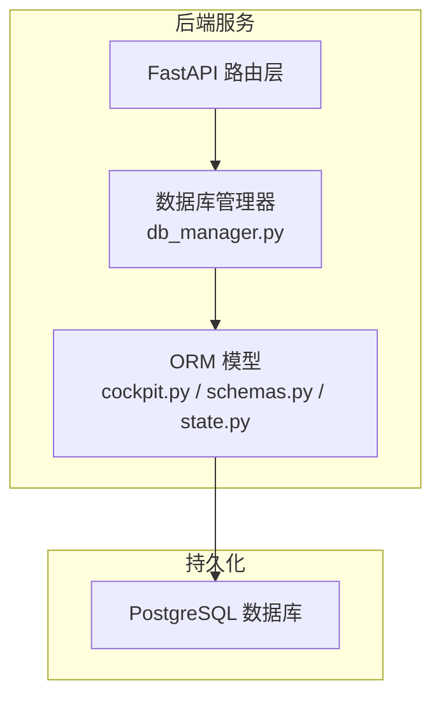
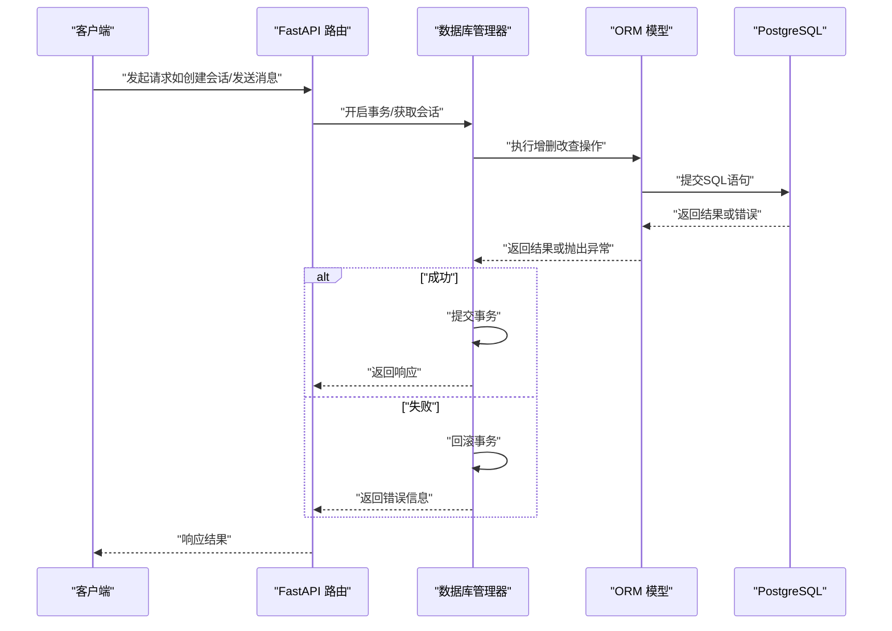
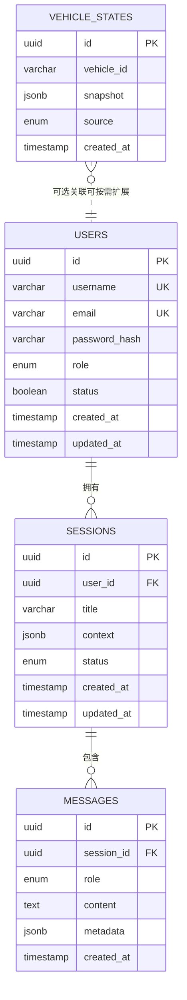
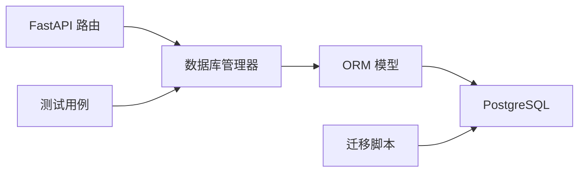

# 关系型数据库设计

<cite>
**本文引用的文件**   
- [backend_design/nexus/core/db_manager.py](file://backend_design/nexus/core/db_manager.py)
- [backend_design/nexus/models/cockpit.py](file://backend_design/nexus/models/cockpit.py)
- [backend_design/nexus/models/schemas.py](file://backend_design/nexus/models/schemas.py)
- [backend_design/nexus/models/state.py](file://backend_design/nexus/models/state.py)
- [backend_design/scripts/v2.1_migration.sql](file://backend_design/scripts/v2.1_migration.sql)
- [backend_design/tests/test_db.py](file://backend_design/tests/test_db.py)
</cite>

## 目录
1. [简介](#简介)
2. [项目结构](#项目结构)
3. [核心组件](#核心组件)
4. [架构总览](#架构总览)
5. [详细组件分析](#详细组件分析)
6. [依赖分析](#依赖分析)
7. [性能考虑](#性能考虑)
8. [故障排查指南](#故障排查指南)
9. [结论](#结论)
10. [附录](#附录)

## 简介
本设计文档面向 Nexus Cockpit 后端的关系型数据库（PostgreSQL）部分，聚焦于用户、会话、消息、车辆状态等核心实体的表结构设计、关联与约束、索引策略、查询优化、数据迁移与版本管理、事务与一致性保证、数据验证规则与业务约束，以及性能调优建议与最佳实践。文档同时提供 ER 图与 SQL 示例路径，帮助读者快速理解并落地实施。

## 项目结构
本项目采用 Python FastAPI 后端，数据库访问通过 SQLAlchemy ORM 进行建模与管理。与数据库相关的代码主要位于以下位置：
- 数据库连接与引擎管理：backend_design/nexus/core/db_manager.py
- 领域模型定义（ORM 映射）：backend_design/nexus/models/cockpit.py、backend_design/nexus/models/schemas.py、backend_design/nexus/models/state.py
- 数据迁移脚本：backend_design/scripts/v2.1_migration.sql
- 数据库测试用例：backend_design/tests/test_db.py

图表来源
- [backend_design/nexus/core/db_manager.py](file://backend_design/nexus/core/db_manager.py)
- [backend_design/nexus/models/cockpit.py](file://backend_design/nexus/models/cockpit.py)
- [backend_design/nexus/models/schemas.py](file://backend_design/nexus/models/schemas.py)
- [backend_design/nexus/models/state.py](file://backend_design/nexus/models/state.py)

章节来源
- [backend_design/nexus/core/db_manager.py](file://backend_design/nexus/core/db_manager.py)
- [backend_design/nexus/models/cockpit.py](file://backend_design/nexus/models/cockpit.py)
- [backend_design/nexus/models/schemas.py](file://backend_design/nexus/models/schemas.py)
- [backend_design/nexus/models/state.py](file://backend_design/nexus/models/state.py)

## 核心组件
本节概述与数据库相关的关键模块及其职责：
- 数据库管理器：负责数据库连接池、会话生命周期、事务边界、错误处理与重试策略。
- ORM 模型：将业务实体映射为数据库表，定义字段类型、默认值、唯一性、非空约束及外键关系。
- 数据迁移：使用 SQL 脚本对数据库结构进行演进，确保多环境一致性与可回滚能力。
- 测试：覆盖关键读写路径与异常场景，保障数据一致性与接口稳定性。

章节来源
- [backend_design/nexus/core/db_manager.py](file://backend_design/nexus/core/db_manager.py)
- [backend_design/nexus/models/cockpit.py](file://backend_design/nexus/models/cockpit.py)
- [backend_design/nexus/models/schemas.py](file://backend_design/nexus/models/schemas.py)
- [backend_design/nexus/models/state.py](file://backend_design/nexus/models/state.py)
- [backend_design/scripts/v2.1_migration.sql](file://backend_design/scripts/v2.1_migration.sql)
- [backend_design/tests/test_db.py](file://backend_design/tests/test_db.py)

## 架构总览
下图展示了从 API 请求到数据库写入的端到端流程，包括事务管理与错误处理要点。

图表来源
- [backend_design/nexus/core/db_manager.py](file://backend_design/nexus/core/db_manager.py)
- [backend_design/nexus/models/cockpit.py](file://backend_design/nexus/models/cockpit.py)
- [backend_design/nexus/models/schemas.py](file://backend_design/nexus/models/schemas.py)
- [backend_design/nexus/models/state.py](file://backend_design/nexus/models/state.py)

## 详细组件分析

### 实体与表结构设计
围绕“用户、会话、消息、车辆状态”四个核心实体，给出推荐的表结构与字段说明。以下为概念性设计，便于在 PostgreSQL 中落地实现。

- 用户表（users）
  - 主键：id（UUID）
  - 用户名：username（VARCHAR，唯一）
  - 邮箱：email（VARCHAR，唯一）
  - 密码哈希：password_hash（VARCHAR）
  - 角色：role（ENUM：admin/user）
  - 状态：status（BOOLEAN）
  - 时间戳：created_at、updated_at（TIMESTAMP WITH TIME ZONE）
  - 索引：username、email 唯一索引；status 普通索引

- 会话表（sessions）
  - 主键：id（UUID）
  - 用户ID：user_id（UUID，外键→users.id）
  - 标题：title（VARCHAR）
  - 上下文：context（JSONB，存储对话上下文片段）
  - 状态：status（ENUM：active/closed/archived）
  - 时间戳：created_at、updated_at
  - 索引：user_id 普通索引；status 普通索引；created_at 降序索引（用于分页）

- 消息表（messages）
  - 主键：id（UUID）
  - 会话ID：session_id（UUID，外键→sessions.id）
  - 角色：role（ENUM：user/assistant/system）
  - 内容：content（TEXT）
  - 元数据：metadata（JSONB，可选，记录工具调用、引用等）
  - 时间戳：created_at
  - 索引：session_id 普通索引；created_at 升序索引（用于按时间顺序读取）

- 车辆状态表（vehicle_states）
  - 主键：id（UUID）
  - 车辆ID：vehicle_id（VARCHAR，标识具体车辆）
  - 快照：snapshot（JSONB，包含车门、空调、媒体、导航等状态）
  - 来源：source（ENUM：api/mcp/mock）
  - 时间戳：created_at
  - 索引：vehicle_id 普通索引；created_at 降序索引（最新状态查询）

ER 图（概念级）

图表来源
- [backend_design/nexus/models/cockpit.py](file://backend_design/nexus/models/cockpit.py)
- [backend_design/nexus/models/schemas.py](file://backend_design/nexus/models/schemas.py)
- [backend_design/nexus/models/state.py](file://backend_design/nexus/models/state.py)

章节来源
- [backend_design/nexus/models/cockpit.py](file://backend_design/nexus/models/cockpit.py)
- [backend_design/nexus/models/schemas.py](file://backend_design/nexus/models/schemas.py)
- [backend_design/nexus/models/state.py](file://backend_design/nexus/models/state.py)

### 关联关系与外键约束
- users → sessions：一对多，外键约束确保每个会话属于一个有效用户。
- sessions → messages：一对多，外键约束确保每条消息属于一个有效会话。
- vehicle_states：当前未强制外键至 users，可按业务需要扩展为多对一或多对多（例如通过中间表）。

约束建议：
- 所有外键均启用 ON DELETE RESTRICT 或 CASCADE（根据业务语义选择），避免误删导致数据不一致。
- 对频繁查询的列建立合适索引，避免全表扫描。

章节来源
- [backend_design/nexus/models/cockpit.py](file://backend_design/nexus/models/cockpit.py)
- [backend_design/nexus/models/schemas.py](file://backend_design/nexus/models/schemas.py)
- [backend_design/nexus/models/state.py](file://backend_design/nexus/models/state.py)

### 索引策略与查询优化
- 唯一索引：users.username、users.email
- 普通索引：sessions.user_id、sessions.status、messages.session_id、vehicle_states.vehicle_id
- 排序索引：sessions.created_at DESC（最近会话）、messages.created_at ASC（按时间顺序读取消息）、vehicle_states.created_at DESC（最新状态）
- JSONB 索引：针对 context、metadata、snapshot 的常用查询键，可使用 GIN 索引提升检索性能
- 分区表：messages 与 vehicle_states 可按 created_at 进行范围分区，降低单表规模，提高归档与清理效率

查询优化建议：
- 使用覆盖索引减少回表
- 合理分页（基于游标或时间戳）避免 OFFSET 深翻页
- 批量写入与合并更新，减少事务开销
- 对热点查询建立物化视图或缓存层（Redis）

章节来源
- [backend_design/nexus/models/cockpit.py](file://backend_design/nexus/models/cockpit.py)
- [backend_design/nexus/models/schemas.py](file://backend_design/nexus/models/schemas.py)
- [backend_design/nexus/models/state.py](file://backend_design/nexus/models/state.py)

### 数据迁移与版本管理
- 迁移脚本：v2.1_migration.sql 用于结构演进，建议在 CI 中自动执行并校验
- 版本控制：为每次迁移命名带版本号，保持幂等与可回滚
- 回滚策略：提供对应的反向脚本，确保升级失败时可恢复
- 预检查：在执行前进行兼容性检查（字段存在性、索引冲突等）

章节来源
- [backend_design/scripts/v2.1_migration.sql](file://backend_design/scripts/v2.1_migration.sql)

### 事务处理机制与一致性保证
- 事务边界：由数据库管理器统一开启与提交/回滚，确保跨多个写操作的原子性
- 隔离级别：默认 READ COMMITTED，必要时针对热点读场景调整为 REPEATABLE READ
- 锁策略：避免长事务与行锁竞争，优先使用乐观锁（版本号字段）或短事务
- 幂等写入：对外部事件（如车辆状态上报）提供去重键，防止重复写入

章节来源
- [backend_design/nexus/core/db_manager.py](file://backend_design/nexus/core/db_manager.py)

### 数据验证规则与业务逻辑约束
- 必填与非空：用户名、邮箱、会话标题、消息内容等关键字段必须非空
- 唯一性：用户名、邮箱全局唯一
- 枚举约束：角色、状态、来源等使用 ENUM 限制取值范围
- JSONB 校验：对 context、metadata、snapshot 的结构进行 schema 校验（可在应用层或触发器中实现）
- 时间戳：所有实体维护 created_at/updated_at，便于审计与追踪

章节来源
- [backend_design/nexus/models/cockpit.py](file://backend_design/nexus/models/cockpit.py)
- [backend_design/nexus/models/schemas.py](file://backend_design/nexus/models/schemas.py)
- [backend_design/nexus/models/state.py](file://backend_design/nexus/models/state.py)

### SQL 示例（路径）
- 建表示例：参考 v2.1 迁移脚本中的 CREATE TABLE 语句
- 插入示例：参考测试用例中的 INSERT 语句
- 查询示例：参考测试用例中的 SELECT 语句（含 JOIN、分页、聚合）
- 更新与删除示例：参考测试用例中的 UPDATE/DELETE 语句

章节来源
- [backend_design/scripts/v2.1_migration.sql](file://backend_design/scripts/v2.1_migration.sql)
- [backend_design/tests/test_db.py](file://backend_design/tests/test_db.py)

## 依赖分析
数据库访问链路依赖如下：
- API 路由层依赖数据库管理器
- 数据库管理器封装 SQLAlchemy 会话与事务
- ORM 模型定义表结构与关系
- 迁移脚本驱动数据库结构演进
- 测试用例验证读写路径与异常处理

图表来源
- [backend_design/nexus/core/db_manager.py](file://backend_design/nexus/core/db_manager.py)
- [backend_design/nexus/models/cockpit.py](file://backend_design/nexus/models/cockpit.py)
- [backend_design/nexus/models/schemas.py](file://backend_design/nexus/models/schemas.py)
- [backend_design/nexus/models/state.py](file://backend_design/nexus/models/state.py)
- [backend_design/scripts/v2.1_migration.sql](file://backend_design/scripts/v2.1_migration.sql)
- [backend_design/tests/test_db.py](file://backend_design/tests/test_db.py)

章节来源
- [backend_design/nexus/core/db_manager.py](file://backend_design/nexus/core/db_manager.py)
- [backend_design/nexus/models/cockpit.py](file://backend_design/nexus/models/cockpit.py)
- [backend_design/nexus/models/schemas.py](file://backend_design/nexus/models/schemas.py)
- [backend_design/nexus/models/state.py](file://backend_design/nexus/models/state.py)
- [backend_design/scripts/v2.1_migration.sql](file://backend_design/scripts/v2.1_migration.sql)
- [backend_design/tests/test_db.py](file://backend_design/tests/test_db.py)

## 性能考虑
- 连接池：合理设置最大连接数与最小空闲连接，避免连接耗尽
- 慢查询监控：启用 pg_stat_statements，定期分析慢查询
- 索引维护：定期重建碎片索引，评估索引选择性
- 分区与归档：对大表按时间分区，历史数据归档至冷存储
- 缓存策略：热点数据（如用户配置、车辆最新状态）使用 Redis 缓存
- 批量操作：消息与状态写入采用批量插入，减少往返开销
- 统计信息：定期 ANALYZE，确保查询计划最优

[本节为通用指导，不直接分析具体文件]

## 故障排查指南
- 连接失败：检查数据库地址、端口、认证信息与防火墙策略
- 死锁与超时：缩短事务长度，避免长事务持有锁；增加超时阈值与重试策略
- 索引失效：确认查询条件与索引列匹配，必要时重新生成统计信息
- 迁移失败：核对迁移脚本幂等性与回滚脚本，查看错误日志定位问题
- 数据不一致：检查外键约束与事务边界，确认并发写入的去重与幂等逻辑

章节来源
- [backend_design/nexus/core/db_manager.py](file://backend_design/nexus/core/db_manager.py)
- [backend_design/tests/test_db.py](file://backend_design/tests/test_db.py)

## 结论
本设计围绕用户、会话、消息、车辆状态四大核心实体，给出了完整的表结构、关联与约束、索引与优化策略、迁移与版本管理、事务与一致性保证、数据验证与业务约束，以及性能调优建议。结合现有代码库中的数据库管理器与 ORM 模型，可在 PostgreSQL 上高效落地并持续演进。

[本节为总结性内容，不直接分析具体文件]

## 附录
- 术语解释
  - ORM：对象关系映射，将业务对象映射为数据库表
  - GIN 索引：适用于 JSONB 的高效索引类型
  - 分区表：按范围或列表将大表拆分为多个子表
- 参考路径
  - 数据库管理器：backend_design/nexus/core/db_manager.py
  - ORM 模型：backend_design/nexus/models/cockpit.py、schemas.py、state.py
  - 迁移脚本：backend_design/scripts/v2.1_migration.sql
  - 测试用例：backend_design/tests/test_db.py

[本节为补充信息，不直接分析具体文件]