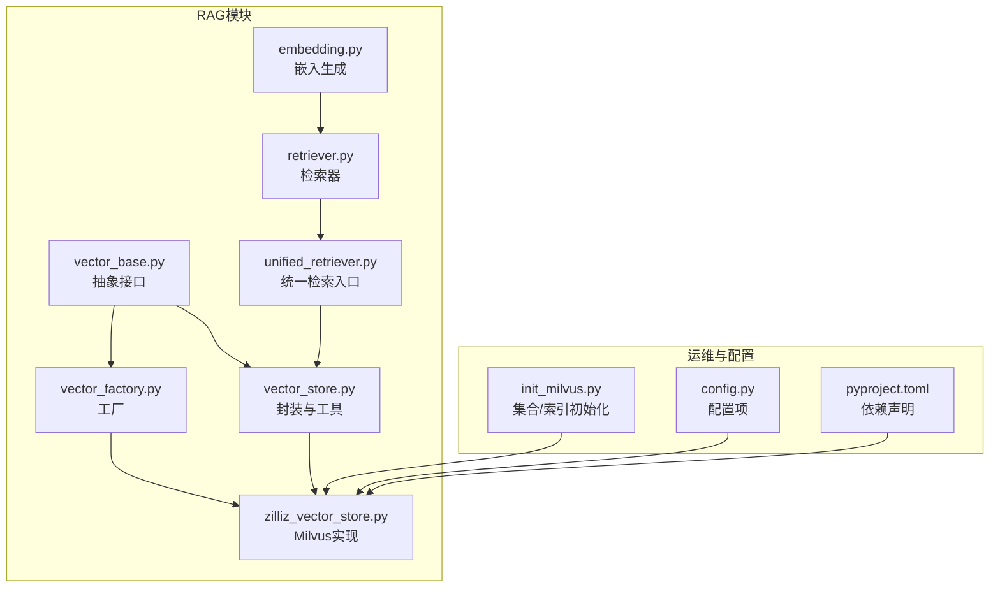
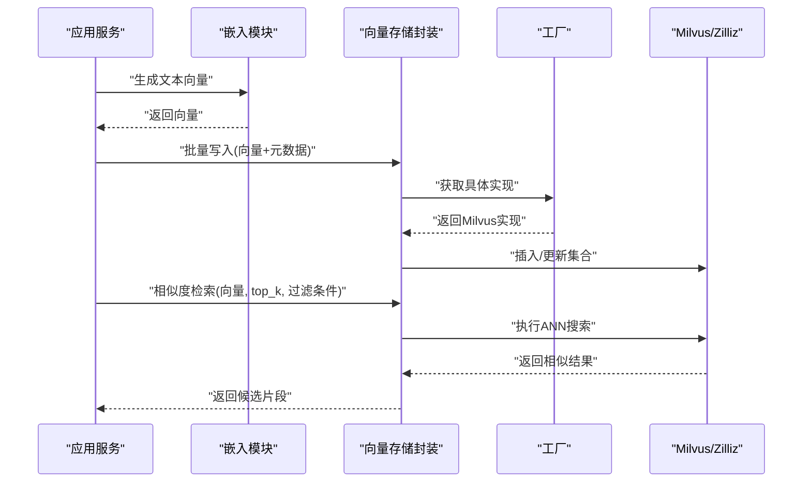
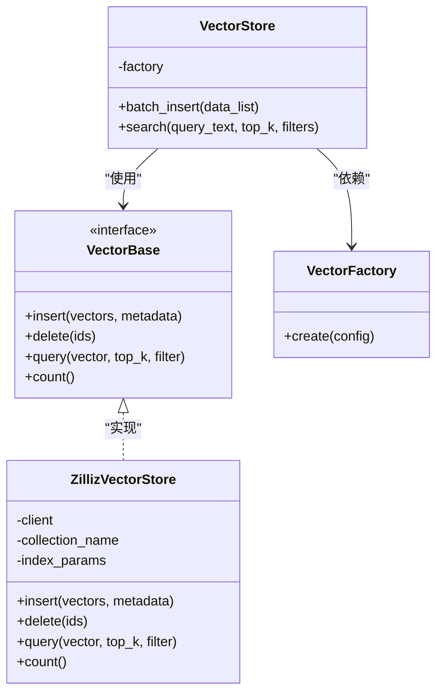
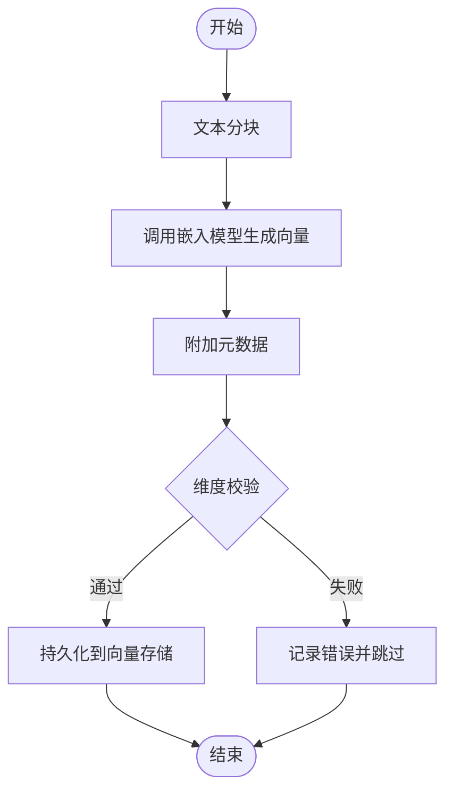
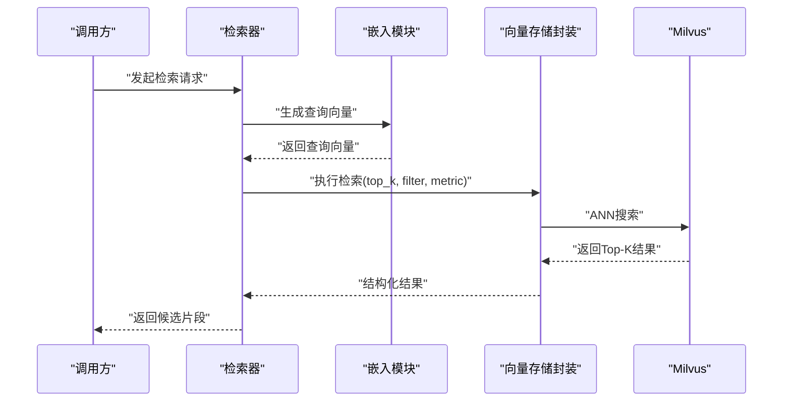
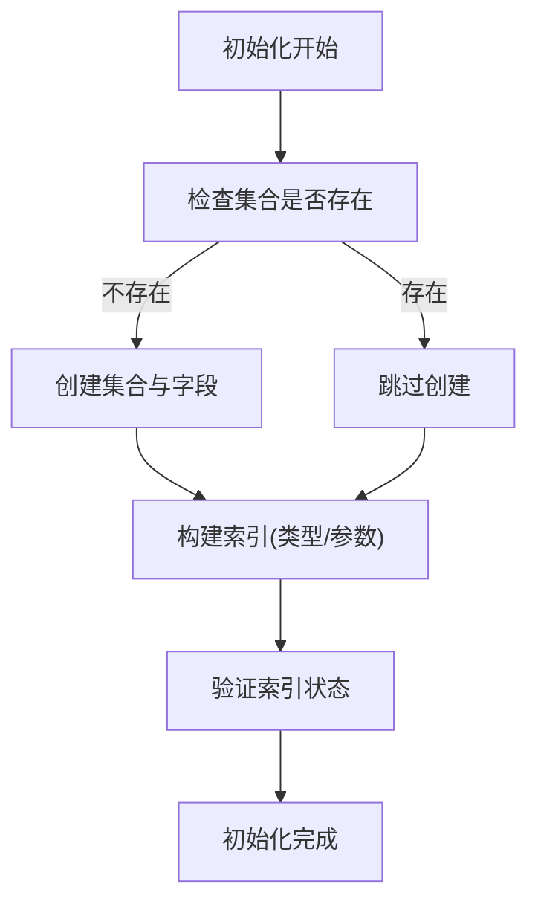
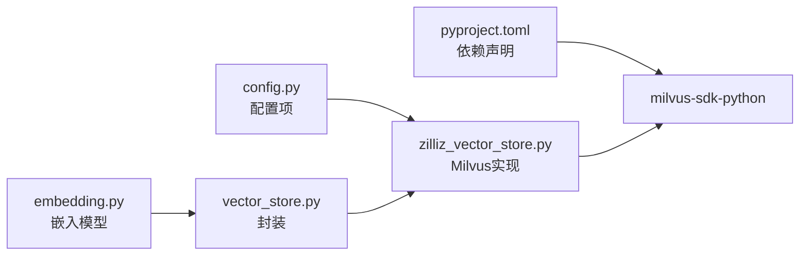

# 向量数据库设计

<cite>
**本文引用的文件**   
- [backend_design/nexus/rag/vector_store.py](file://backend_design/nexus/rag/vector_store.py)
- [backend_design/nexus/rag/vector_base.py](file://backend_design/nexus/rag/vector_base.py)
- [backend_design/nexus/rag/vector_factory.py](file://backend_design/nexus/rag/vector_factory.py)
- [backend_design/nexus/rag/zilliz_vector_store.py](file://backend_design/nexus/rag/zilliz_vector_store.py)
- [backend_design/nexus/rag/embedding.py](file://backend_design/nexus/rag/embedding.py)
- [backend_design/nexus/rag/retriever.py](file://backend_design/nexus/rag/retriever.py)
- [backend_design/nexus/rag/unified_retriever.py](file://backend_design/nexus/rag/unified_retriever.py)
- [backend_design/scripts/init_milvus.py](file://backend_design/scripts/init_milvus.py)
- [backend_design/nexus/config.py](file://backend_design/nexus/config.py)
- [backend_design/pyproject.toml](file://backend_design/pyproject.toml)
</cite>

## 目录
1. [引言](#引言)
2. [项目结构](#项目结构)
3. [核心组件](#核心组件)
4. [架构总览](#架构总览)
5. [详细组件分析](#详细组件分析)
6. [依赖关系分析](#依赖关系分析)
7. [性能考虑](#性能考虑)
8. [故障排查指南](#故障排查指南)
9. [结论](#结论)
10. [附录](#附录)

## 引言
本设计文档聚焦于在项目中集成和使用Milvus向量数据库，覆盖向量嵌入的生成与处理流程、索引类型选择与性能优化策略、相似度搜索算法与检索参数配置、数据生命周期管理与清理策略、存储架构图与API使用示例、维度设置与批量操作优化，以及故障排查与性能监控指南。目标是帮助读者快速理解并高效落地基于Milvus的RAG（检索增强生成）能力。

## 项目结构
与向量数据库相关的代码主要位于后端RAG模块中，采用“抽象接口 + 工厂 + 具体实现”的分层组织方式：
- 抽象接口定义：统一向量存储与检索能力
- 工厂类：根据配置动态创建具体向量存储实例
- Milvus/Zillit实现：对接Milvus/Zilliz云的具体逻辑
- 嵌入与检索：文本到向量的转换与召回流程
- 初始化脚本：集合与索引的初始化
- 配置与依赖：连接参数、模型与第三方库

图表来源
- [backend_design/nexus/rag/vector_base.py](file://backend_design/nexus/rag/vector_base.py)
- [backend_design/nexus/rag/vector_store.py](file://backend_design/nexus/rag/vector_store.py)
- [backend_design/nexus/rag/vector_factory.py](file://backend_design/nexus/rag/vector_factory.py)
- [backend_design/nexus/rag/zilliz_vector_store.py](file://backend_design/nexus/rag/zilliz_vector_store.py)
- [backend_design/nexus/rag/embedding.py](file://backend_design/nexus/rag/embedding.py)
- [backend_design/nexus/rag/retriever.py](file://backend_design/nexus/rag/retriever.py)
- [backend_design/nexus/rag/unified_retriever.py](file://backend_design/nexus/rag/unified_retriever.py)
- [backend_design/scripts/init_milvus.py](file://backend_design/scripts/init_milvus.py)
- [backend_design/nexus/config.py](file://backend_design/nexus/config.py)
- [backend_design/pyproject.toml](file://backend_design/pyproject.toml)

章节来源
- [backend_design/nexus/rag/vector_base.py](file://backend_design/nexus/rag/vector_base.py)
- [backend_design/nexus/rag/vector_store.py](file://backend_design/nexus/rag/vector_store.py)
- [backend_design/nexus/rag/vector_factory.py](file://backend_design/nexus/rag/vector_factory.py)
- [backend_design/nexus/rag/zilliz_vector_store.py](file://backend_design/nexus/rag/zilliz_vector_store.py)
- [backend_design/nexus/rag/embedding.py](file://backend_design/nexus/rag/embedding.py)
- [backend_design/nexus/rag/retriever.py](file://backend_design/nexus/rag/retriever.py)
- [backend_design/nexus/rag/unified_retriever.py](file://backend_design/nexus/rag/unified_retriever.py)
- [backend_design/scripts/init_milvus.py](file://backend_design/scripts/init_milvus.py)
- [backend_design/nexus/config.py](file://backend_design/nexus/config.py)
- [backend_design/pyproject.toml](file://backend_design/pyproject.toml)

## 核心组件
- 抽象接口（VectorBase）：定义统一的插入、删除、查询、统计等能力，屏蔽底层差异
- 向量存储封装（VectorStore）：提供批量写入、元数据管理、错误重试等通用能力
- 工厂（VectorFactory）：依据配置选择具体实现（如Milvus/Zilliz）
- Milvus实现（ZillizVectorStore）：对接Milvus/Zilliz SDK，完成集合/索引/查询
- 嵌入（Embedding）：将文本转换为固定维度的向量
- 检索器（Retriever/UnifiedRetriever）：组合嵌入与向量检索，输出候选片段
- 初始化脚本（init_milvus.py）：创建集合、字段、索引，确保运行期可用
- 配置（config.py）：集中管理Milvus连接、集合名、索引参数、嵌入模型等
- 依赖（pyproject.toml）：声明milvus-sdk-python等关键依赖

章节来源
- [backend_design/nexus/rag/vector_base.py](file://backend_design/nexus/rag/vector_base.py)
- [backend_design/nexus/rag/vector_store.py](file://backend_design/nexus/rag/vector_store.py)
- [backend_design/nexus/rag/vector_factory.py](file://backend_design/nexus/rag/vector_factory.py)
- [backend_design/nexus/rag/zilliz_vector_store.py](file://backend_design/nexus/rag/zilliz_vector_store.py)
- [backend_design/nexus/rag/embedding.py](file://backend_design/nexus/rag/embedding.py)
- [backend_design/nexus/rag/retriever.py](file://backend_design/nexus/rag/retriever.py)
- [backend_design/nexus/rag/unified_retriever.py](file://backend_design/nexus/rag/unified_retriever.py)
- [backend_design/scripts/init_milvus.py](file://backend_design/scripts/init_milvus.py)
- [backend_design/nexus/config.py](file://backend_design/nexus/config.py)
- [backend_design/pyproject.toml](file://backend_design/pyproject.toml)

## 架构总览
下图展示了从文本输入到向量检索的整体流程，包括嵌入生成、Milvus写入与检索、以及上层RAG调用路径。

图表来源
- [backend_design/nexus/rag/embedding.py](file://backend_design/nexus/rag/embedding.py)
- [backend_design/nexus/rag/vector_store.py](file://backend_design/nexus/rag/vector_store.py)
- [backend_design/nexus/rag/vector_factory.py](file://backend_design/nexus/rag/vector_factory.py)
- [backend_design/nexus/rag/zilliz_vector_store.py](file://backend_design/nexus/rag/zilliz_vector_store.py)

## 详细组件分析

### 抽象接口与实现关系
- VectorBase定义统一方法签名，便于替换不同后端
- ZillizVectorStore实现Milvus/Zilliz相关细节（连接、集合、索引、查询）
- VectorStore对上层提供易用封装（批量、重试、元数据处理）

图表来源
- [backend_design/nexus/rag/vector_base.py](file://backend_design/nexus/rag/vector_base.py)
- [backend_design/nexus/rag/zilliz_vector_store.py](file://backend_design/nexus/rag/zilliz_vector_store.py)
- [backend_design/nexus/rag/vector_store.py](file://backend_design/nexus/rag/vector_store.py)
- [backend_design/nexus/rag/vector_factory.py](file://backend_design/nexus/rag/vector_factory.py)

章节来源
- [backend_design/nexus/rag/vector_base.py](file://backend_design/nexus/rag/vector_base.py)
- [backend_design/nexus/rag/zilliz_vector_store.py](file://backend_design/nexus/rag/zilliz_vector_store.py)
- [backend_design/nexus/rag/vector_store.py](file://backend_design/nexus/rag/vector_store.py)
- [backend_design/nexus/rag/vector_factory.py](file://backend_design/nexus/rag/vector_factory.py)

### 嵌入生成与处理流程
- 输入：原始文本或分块后的片段
- 处理：通过嵌入模型将文本映射为固定维度向量
- 输出：向量列表及对应元数据（如来源、时间戳、业务ID等）

图表来源
- [backend_design/nexus/rag/embedding.py](file://backend_design/nexus/rag/embedding.py)
- [backend_design/nexus/rag/vector_store.py](file://backend_design/nexus/rag/vector_store.py)

章节来源
- [backend_design/nexus/rag/embedding.py](file://backend_design/nexus/rag/embedding.py)
- [backend_design/nexus/rag/vector_store.py](file://backend_design/nexus/rag/vector_store.py)

### 检索流程与参数配置
- 输入：查询文本或预计算查询向量
- 步骤：
  - 生成查询向量
  - 构造过滤条件（可选）
  - 指定top_k与距离度量
  - 执行相似度检索
  - 返回Top-K结果（含分数与元数据）

图表来源
- [backend_design/nexus/rag/retriever.py](file://backend_design/nexus/rag/retriever.py)
- [backend_design/nexus/rag/unified_retriever.py](file://backend_design/nexus/rag/unified_retriever.py)
- [backend_design/nexus/rag/vector_store.py](file://backend_design/nexus/rag/vector_store.py)
- [backend_design/nexus/rag/zilliz_vector_store.py](file://backend_design/nexus/rag/zilliz_vector_store.py)

章节来源
- [backend_design/nexus/rag/retriever.py](file://backend_design/nexus/rag/retriever.py)
- [backend_design/nexus/rag/unified_retriever.py](file://backend_design/nexus/rag/unified_retriever.py)
- [backend_design/nexus/rag/vector_store.py](file://backend_design/nexus/rag/vector_store.py)
- [backend_design/nexus/rag/zilliz_vector_store.py](file://backend_design/nexus/rag/zilliz_vector_store.py)

### 集合与索引初始化
- 目标：在Milvus中创建集合、定义字段（主键、向量、标量字段）、构建索引
- 关键点：
  - 向量维度需与嵌入模型一致
  - 索引类型与参数影响检索性能与精度
  - 分区/标签可用于多租户或按时间范围检索

图表来源
- [backend_design/scripts/init_milvus.py](file://backend_design/scripts/init_milvus.py)
- [backend_design/nexus/rag/zilliz_vector_store.py](file://backend_design/nexus/rag/zilliz_vector_store.py)

章节来源
- [backend_design/scripts/init_milvus.py](file://backend_design/scripts/init_milvus.py)
- [backend_design/nexus/rag/zilliz_vector_store.py](file://backend_design/nexus/rag/zilliz_vector_store.py)

### API使用示例（概念性说明）
- 写入示例：
  - 准备一批文本片段
  - 调用嵌入模块生成向量
  - 通过向量存储封装进行批量写入
  - 附带必要元数据（如来源、时间戳、业务ID）
- 检索示例：
  - 输入查询文本
  - 生成查询向量
  - 指定top_k与过滤条件
  - 获取Top-K结果与相似度分数

章节来源
- [backend_design/nexus/rag/vector_store.py](file://backend_design/nexus/rag/vector_store.py)
- [backend_design/nexus/rag/embedding.py](file://backend_design/nexus/rag/embedding.py)
- [backend_design/nexus/rag/retriever.py](file://backend_design/nexus/rag/retriever.py)

## 依赖关系分析
- 外部依赖：
  - milvus-sdk-python：用于与Milvus/Zilliz交互
  - 嵌入模型SDK/本地模型：用于文本到向量转换
- 内部依赖：
  - 配置中心：集中管理连接、集合、索引、模型参数
  - 工厂模式：根据配置动态选择具体实现
  - 封装层：统一错误处理、重试、批量优化

图表来源
- [backend_design/pyproject.toml](file://backend_design/pyproject.toml)
- [backend_design/nexus/config.py](file://backend_design/nexus/config.py)
- [backend_design/nexus/rag/zilliz_vector_store.py](file://backend_design/nexus/rag/zilliz_vector_store.py)
- [backend_design/nexus/rag/embedding.py](file://backend_design/nexus/rag/embedding.py)
- [backend_design/nexus/rag/vector_store.py](file://backend_design/nexus/rag/vector_store.py)

章节来源
- [backend_design/pyproject.toml](file://backend_design/pyproject.toml)
- [backend_design/nexus/config.py](file://backend_design/nexus/config.py)
- [backend_design/nexus/rag/zilliz_vector_store.py](file://backend_design/nexus/rag/zilliz_vector_store.py)
- [backend_design/nexus/rag/embedding.py](file://backend_design/nexus/rag/embedding.py)
- [backend_design/nexus/rag/vector_store.py](file://backend_design/nexus/rag/vector_store.py)

## 性能考虑
- 索引类型选择
  - IVF_FLAT：适合中等规模数据，调参简单
  - IVF_SQ8/HNSW：追求更高吞吐与低延迟时考虑
  - 根据数据规模与查询延迟要求选择合适的索引与参数
- 批量写入优化
  - 合并小批次为大批次，减少网络往返
  - 控制并发度，避免服务端过载
- 检索参数调优
  - top_k：平衡召回率与后续处理成本
  - 过滤条件：利用标量字段缩小搜索空间
  - 距离度量：根据嵌入模型特性选择内积或余弦相似度
- 资源规划
  - 合理设置向量维度与内存占用
  - 监控Milvus集群CPU/内存/IO指标，按需扩容

[本节为通用指导，不直接分析具体文件]

## 故障排查指南
- 连接问题
  - 检查Milvus地址、端口、认证信息
  - 确认防火墙与安全组放行
- 集合/索引异常
  - 确认集合已创建且字段定义正确
  - 检查索引构建状态与是否可用
- 维度不一致
  - 嵌入模型维度必须与集合schema一致
  - 出现维度错误时，优先核对配置与模型版本
- 检索结果异常
  - 调整top_k与过滤条件
  - 检查数据新鲜度与索引重建周期
- 日志与监控
  - 启用应用层日志记录关键步骤
  - 结合Prometheus/Grafana监控Milvus与嵌入服务指标

章节来源
- [backend_design/nexus/rag/zilliz_vector_store.py](file://backend_design/nexus/rag/zilliz_vector_store.py)
- [backend_design/nexus/config.py](file://backend_design/nexus/config.py)
- [backend_design/scripts/init_milvus.py](file://backend_design/scripts/init_milvus.py)

## 结论
通过抽象接口与工厂模式，本项目实现了可插拔的向量存储能力；Milvus作为高性能向量数据库，配合合适的索引与检索参数，可满足大规模RAG场景需求。建议在生产环境完善初始化脚本、监控告警与容量规划，持续优化嵌入模型与索引策略，以获得稳定高效的检索体验。

[本节为总结性内容，不直接分析具体文件]

## 附录
- 向量维度设置
  - 与嵌入模型保持一致，常见维度如768、1024、1536等
  - 变更维度需重建集合与索引
- 批量操作优化
  - 合并写入批次，控制并发
  - 使用幂等主键避免重复数据
- 生命周期管理与清理策略
  - 基于时间戳或业务标识定期清理过期数据
  - 使用分区或标签简化按范围删除
- 监控与可观测性
  - 记录检索耗时、命中率、错误率
  - 结合Grafana看板观察趋势与瓶颈

[本节为补充说明，不直接分析具体文件]