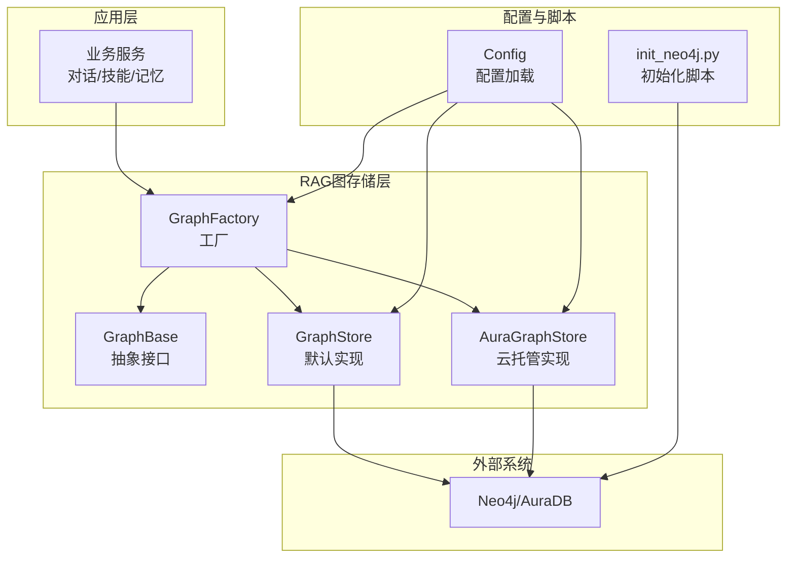
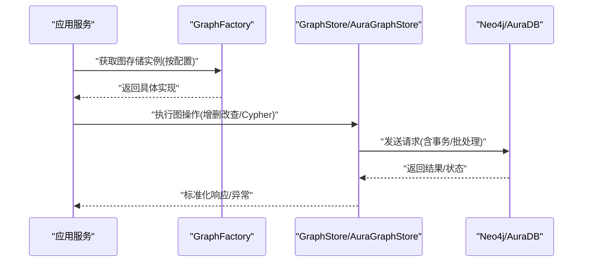
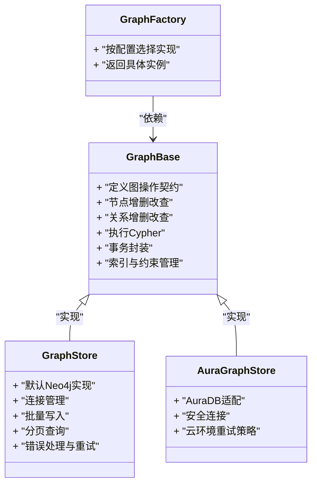
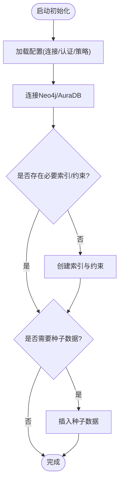
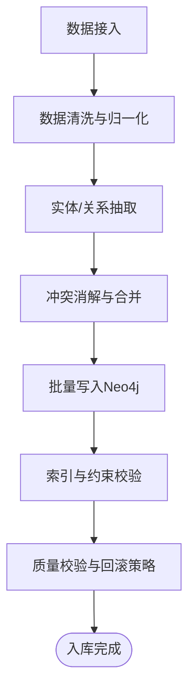
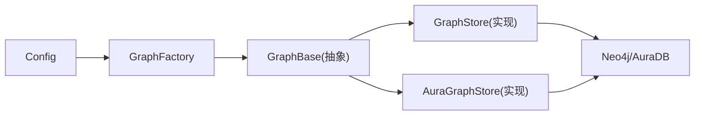

# 图数据库设计

<cite>
**本文引用的文件**   
- [backend_design/nexus/rag/graph_base.py](file://backend_design/nexus/rag/graph_base.py)
- [backend_design/nexus/rag/graph_store.py](file://backend_design/nexus/rag/graph_store.py)
- [backend_design/nexus/rag/graph_factory.py](file://backend_design/nexus/rag/graph_factory.py)
- [backend_design/nexus/rag/aura_graph_store.py](file://backend_design/nexus/rag/aura_graph_store.py)
- [backend_design/scripts/init_neo4j.py](file://backend_design/scripts/init_neo4j.py)
- [backend_design/nexus/config.py](file://backend_design/nexus/config.py)
- [backend_design/pyproject.toml](file://backend_design/pyproject.toml)
</cite>

## 目录
1. [简介](#简介)
2. [项目结构](#项目结构)
3. [核心组件](#核心组件)
4. [架构总览](#架构总览)
5. [详细组件分析](#详细组件分析)
6. [依赖关系分析](#依赖关系分析)
7. [性能考虑](#性能考虑)
8. [故障排查指南](#故障排查指南)
9. [结论](#结论)
10. [附录](#附录)

## 简介
本设计文档面向Neo4j图数据库在知识图谱建模中的应用，结合仓库中RAG（检索增强生成）子系统的图存储抽象与实现，系统化阐述节点与关系的定义、属性设计、Cypher查询范式、知识抽取与图谱构建流程、复杂关系查询与路径分析、导入导出与备份策略，以及性能调优与维护建议。文档旨在为研发与数据工程团队提供可落地的图数据库设计与实践指南。

## 项目结构
本项目采用分层与模块化组织方式，图数据库相关能力集中在RAG模块与初始化脚本中：
- RAG层：提供统一的图存储抽象与具体实现，支持多后端（如AuraDB等），并通过工厂模式进行实例化。
- 配置层：集中管理连接参数、认证信息、超时与重试等运行时配置。
- 脚本层：提供Neo4j初始化、索引创建、约束建立等运维脚本。

图表来源
- [backend_design/nexus/rag/graph_factory.py](file://backend_design/nexus/rag/graph_factory.py)
- [backend_design/nexus/rag/graph_base.py](file://backend_design/nexus/rag/graph_base.py)
- [backend_design/nexus/rag/graph_store.py](file://backend_design/nexus/rag/graph_store.py)
- [backend_design/nexus/rag/aura_graph_store.py](file://backend_design/nexus/rag/aura_graph_store.py)
- [backend_design/nexus/config.py](file://backend_design/nexus/config.py)
- [backend_design/scripts/init_neo4j.py](file://backend_design/scripts/init_neo4j.py)

章节来源
- [backend_design/nexus/rag/graph_base.py](file://backend_design/nexus/rag/graph_base.py)
- [backend_design/nexus/rag/graph_store.py](file://backend_design/nexus/rag/graph_store.py)
- [backend_design/nexus/rag/graph_factory.py](file://backend_design/nexus/rag/graph_factory.py)
- [backend_design/nexus/rag/aura_graph_store.py](file://backend_design/nexus/rag/aura_graph_store.py)
- [backend_design/nexus/config.py](file://backend_design/nexus/config.py)
- [backend_design/scripts/init_neo4j.py](file://backend_design/scripts/init_neo4j.py)

## 核心组件
- 图存储抽象接口（GraphBase）
  - 职责：定义统一的图操作契约，包括节点/关系增删改查、事务执行、批量写入、索引与约束管理等。
  - 关键方法类别：节点CRUD、关系CRUD、Cypher执行、事务封装、元数据管理。
- 默认图存储实现（GraphStore）
  - 职责：基于Neo4j驱动的具体实现，负责连接管理、请求编排、错误处理与重试。
  - 特性：支持批量写入、分页查询、结果映射、连接池与超时控制。
- Aura图存储实现（AuraGraphStore）
  - 职责：针对云托管Neo4j（AuraDB）的适配实现，包含安全连接、证书与重试策略优化。
- 图存储工厂（GraphFactory）
  - 职责：根据配置动态选择并返回合适的图存储实例，屏蔽后端差异。
- 配置（Config）
  - 职责：集中读取环境变量或配置文件，注入到各组件，统一管控连接参数、认证、日志与限流。
- 初始化脚本（init_neo4j.py）
  - 职责：在部署阶段创建必要的索引、唯一性约束、标签与初始种子数据，确保一致性。

章节来源
- [backend_design/nexus/rag/graph_base.py](file://backend_design/nexus/rag/graph_base.py)
- [backend_design/nexus/rag/graph_store.py](file://backend_design/nexus/rag/graph_store.py)
- [backend_design/nexus/rag/aura_graph_store.py](file://backend_design/nexus/rag/aura_graph_store.py)
- [backend_design/nexus/rag/graph_factory.py](file://backend_design/nexus/rag/graph_factory.py)
- [backend_design/nexus/config.py](file://backend_design/nexus/config.py)
- [backend_design/scripts/init_neo4j.py](file://backend_design/scripts/init_neo4j.py)

## 架构总览
下图展示了从应用调用到Neo4j/AuraDB的数据通路，以及图存储抽象与工厂模式的协作关系。

图表来源
- [backend_design/nexus/rag/graph_factory.py](file://backend_design/nexus/rag/graph_factory.py)
- [backend_design/nexus/rag/graph_store.py](file://backend_design/nexus/rag/graph_store.py)
- [backend_design/nexus/rag/aura_graph_store.py](file://backend_design/nexus/rag/aura_graph_store.py)

## 详细组件分析

### 组件A：图存储抽象与实现（GraphBase / GraphStore / AuraGraphStore）
- 设计要点
  - 通过抽象接口统一图操作语义，便于替换不同后端（本地Neo4j、云托管AuraDB）。
  - 默认实现封装连接池、重试、超时、分页与批量写入，提升稳定性与吞吐。
  - Aura实现针对云环境优化安全连接与错误恢复策略。
- 类关系图

图表来源
- [backend_design/nexus/rag/graph_base.py](file://backend_design/nexus/rag/graph_base.py)
- [backend_design/nexus/rag/graph_store.py](file://backend_design/nexus/rag/graph_store.py)
- [backend_design/nexus/rag/aura_graph_store.py](file://backend_design/nexus/rag/aura_graph_store.py)
- [backend_design/nexus/rag/graph_factory.py](file://backend_design/nexus/rag/graph_factory.py)

章节来源
- [backend_design/nexus/rag/graph_base.py](file://backend_design/nexus/rag/graph_base.py)
- [backend_design/nexus/rag/graph_store.py](file://backend_design/nexus/rag/graph_store.py)
- [backend_design/nexus/rag/aura_graph_store.py](file://backend_design/nexus/rag/aura_graph_store.py)
- [backend_design/nexus/rag/graph_factory.py](file://backend_design/nexus/rag/graph_factory.py)

### 组件B：配置与初始化（Config / init_neo4j.py）
- 配置项范围
  - 连接参数：主机、端口、协议、数据库名、最大连接数、超时时间。
  - 认证与安全：用户名、密码、TLS/证书配置。
  - 行为策略：重试次数、退避策略、批大小、分页大小。
- 初始化脚本职责
  - 创建标签与索引，提升查询性能。
  - 建立唯一性约束，保障实体唯一性。
  - 可选：插入种子数据，用于演示与测试。

图表来源
- [backend_design/nexus/config.py](file://backend_design/nexus/config.py)
- [backend_design/scripts/init_neo4j.py](file://backend_design/scripts/init_neo4j.py)

章节来源
- [backend_design/nexus/config.py](file://backend_design/nexus/config.py)
- [backend_design/scripts/init_neo4j.py](file://backend_design/scripts/init_neo4j.py)

### 组件C：知识图谱建模与Cypher使用
- 建模原则
  - 以“实体”为中心，将用户、设备、场景、意图、技能、偏好、健康指标等作为节点类型。
  - 关系表达“拥有/关联/触发/属于/影响”等业务语义，避免过度泛化。
  - 属性尽量扁平化，避免嵌套对象；对高频过滤字段建立索引与约束。
- 典型节点与关系示例（概念说明）
  - 节点类型：用户、车辆、房间、设备、意图、技能、偏好、健康记录、事件。
  - 关系类型：属于、控制、偏好于、触发、关联、影响。
- Cypher使用范式
  - 节点/关系创建：使用CREATE/MERGE，配合MERGE保证幂等。
  - 条件更新：使用SET更新属性，WITH聚合中间结果。
  - 查询与过滤：WHERE条件、RETURN投影、ORDER BY/LIMIT排序与分页。
  - 事务与批处理：UNWIND批量写入，减少往返开销。
  - 路径与最短路径：使用短路径函数与模式匹配进行可达性与距离分析。

[本节为概念性说明，不直接分析具体代码文件]

### 组件D：知识抽取与图谱构建流程
- 抽取目标
  - 从非结构化文本、对话历史、传感器数据中提取实体与关系，形成结构化三元组。
- 抽取步骤
  - 预处理：清洗、分词、去噪、归一化。
  - 实体识别与关系抽取：基于规则或模型输出三元组。
  - 冲突消解：合并重复实体、对齐属性、解决冲突。
  - 写入图谱：批量写入Neo4j，建立索引与约束。
- 流程图

[本节为概念性说明，不直接分析具体代码文件]

### 组件E：复杂关系查询与路径分析
- 常见查询模式
  - 多跳关系：查找N度邻居，限制深度与分支因子。
  - 最短路径：计算两个节点间的最短路径，评估传播影响。
  - 模式匹配：组合多种关系类型与方向，筛选特定子图。
  - 聚合统计：计数、求和、平均值、分布统计。
- 性能建议
  - 使用索引与约束加速过滤。
  - 限制返回规模，分页与游标式遍历。
  - 避免全图扫描，优先使用已知起点与边界条件。

[本节为概念性说明，不直接分析具体代码文件]

### 组件F：导入导出与备份策略
- 导入
  - 批量CSV导入：使用UNWIND与LOAD CSV，结合事务分批提交。
  - 增量同步：基于时间戳或版本号，仅处理变更数据。
- 导出
  - 导出为CSV/JSON：按节点类型与关系类型分别导出，保留ID与属性。
  - 快照导出：定期导出完整图快照，用于归档与迁移。
- 备份
  - 逻辑备份：使用官方工具导出数据库快照。
  - 物理备份：针对云托管服务启用自动快照与跨区复制。
  - 恢复演练：定期验证备份可用性与恢复时长。

[本节为概念性说明，不直接分析具体代码文件]

## 依赖关系分析
- 内部依赖
  - GraphFactory依赖配置，返回GraphBase的实现（GraphStore或AuraGraphStore）。
  - GraphStore与AuraGraphStore均实现GraphBase接口，屏蔽底层差异。
- 外部依赖
  - Neo4j/AuraDB：图数据库服务。
  - Python驱动：用于连接与执行Cypher。
- 潜在风险
  - 循环依赖：当前结构清晰，无循环引用。
  - 配置不一致：需确保配置中心与运行环境一致。
  - 版本兼容：驱动与Neo4j版本需匹配。

图表来源
- [backend_design/nexus/rag/graph_factory.py](file://backend_design/nexus/rag/graph_factory.py)
- [backend_design/nexus/rag/graph_base.py](file://backend_design/nexus/rag/graph_base.py)
- [backend_design/nexus/rag/graph_store.py](file://backend_design/nexus/rag/graph_store.py)
- [backend_design/nexus/rag/aura_graph_store.py](file://backend_design/nexus/rag/aura_graph_store.py)
- [backend_design/nexus/config.py](file://backend_design/nexus/config.py)

章节来源
- [backend_design/nexus/rag/graph_factory.py](file://backend_design/nexus/rag/graph_factory.py)
- [backend_design/nexus/rag/graph_base.py](file://backend_design/nexus/rag/graph_base.py)
- [backend_design/nexus/rag/graph_store.py](file://backend_design/nexus/rag/graph_store.py)
- [backend_design/nexus/rag/aura_graph_store.py](file://backend_design/nexus/rag/aura_graph_store.py)
- [backend_design/nexus/config.py](file://backend_design/nexus/config.py)

## 性能考虑
- 索引与约束
  - 为高频过滤字段建立索引，为唯一性字段建立唯一性约束。
  - 复合索引适用于多字段联合查询。
- 查询优化
  - 限制返回规模，使用LIMIT与SKIP分页。
  - 避免不必要的MATCH与RETURN，减少中间结果集。
  - 使用WITH聚合中间结果，降低内存占用。
- 写入优化
  - 批量写入：UNWIND大批量数据，合理设置批大小。
  - 事务边界：合理划分事务，避免长事务导致锁竞争。
- 连接与资源
  - 连接池大小与并发度匹配负载。
  - 超时与重试策略平衡稳定性与延迟。
- 监控与观测
  - 关注慢查询与热点节点，定期分析执行计划。
  - 记录关键指标：QPS、延迟、错误率、内存与磁盘使用。

[本节为通用指导，不直接分析具体代码文件]

## 故障排查指南
- 常见问题
  - 连接失败：检查主机、端口、协议、认证与TLS配置。
  - 权限不足：确认用户具备读写权限与数据库访问权限。
  - 索引缺失：确认必要索引与约束已创建。
  - 超时与重试：调整超时时间与重试次数，观察网络抖动。
- 定位方法
  - 查看驱动日志与Cypher执行计划。
  - 使用Neo4j浏览器或监控面板分析热点与慢查询。
  - 检查事务长度与锁等待情况。
- 恢复策略
  - 回滚未提交事务，清理残留锁。
  - 重建索引与约束，必要时重新导入数据。
  - 切换备用实例或降级策略，保障可用性。

章节来源
- [backend_design/nexus/rag/graph_store.py](file://backend_design/nexus/rag/graph_store.py)
- [backend_design/nexus/rag/aura_graph_store.py](file://backend_design/nexus/rag/aura_graph_store.py)
- [backend_design/nexus/config.py](file://backend_design/nexus/config.py)
- [backend_design/scripts/init_neo4j.py](file://backend_design/scripts/init_neo4j.py)

## 结论
通过抽象接口与工厂模式，本项目实现了图存储的可插拔与可扩展，兼顾本地与云托管环境的差异。结合合理的索引与约束、批量写入与事务管理，可在保证一致性的同时提升性能。建议在上线前完善初始化脚本与监控告警，持续优化查询与写入路径，确保图谱数据的准确性与时效性。

[本节为总结性内容，不直接分析具体代码文件]

## 附录
- 依赖清单
  - Neo4j驱动与版本要求见项目依赖文件。
- 参考文件
  - 图存储抽象与实现：graph_base.py、graph_store.py、aura_graph_store.py
  - 工厂与配置：graph_factory.py、config.py
  - 初始化脚本：init_neo4j.py
  - 依赖声明：pyproject.toml

章节来源
- [backend_design/pyproject.toml](file://backend_design/pyproject.toml)
- [backend_design/nexus/rag/graph_base.py](file://backend_design/nexus/rag/graph_base.py)
- [backend_design/nexus/rag/graph_store.py](file://backend_design/nexus/rag/graph_store.py)
- [backend_design/nexus/rag/aura_graph_store.py](file://backend_design/nexus/rag/aura_graph_store.py)
- [backend_design/nexus/rag/graph_factory.py](file://backend_design/nexus/rag/graph_factory.py)
- [backend_design/nexus/config.py](file://backend_design/nexus/config.py)
- [backend_design/scripts/init_neo4j.py](file://backend_design/scripts/init_neo4j.py)