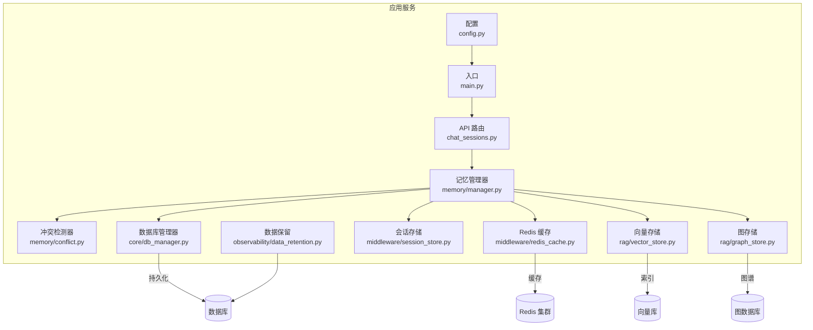
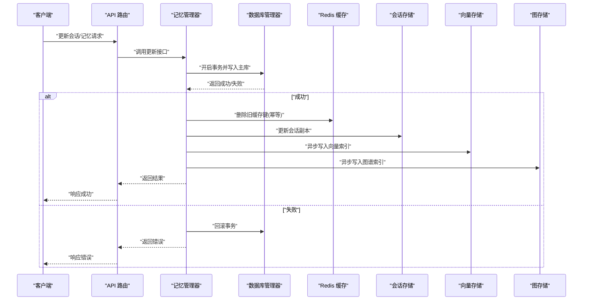
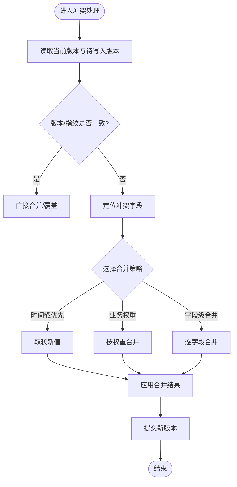
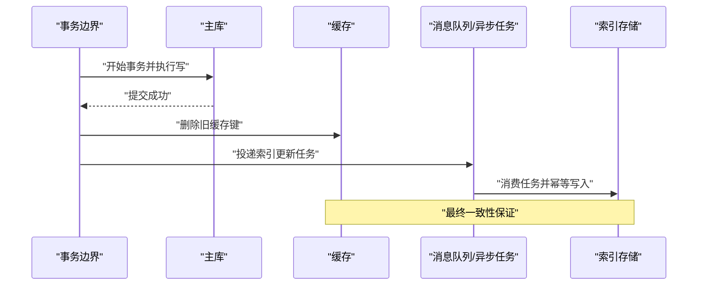
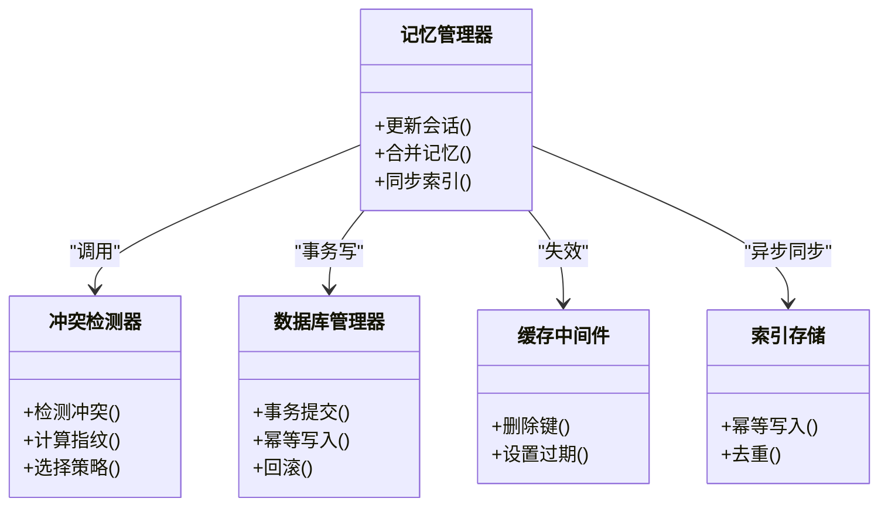
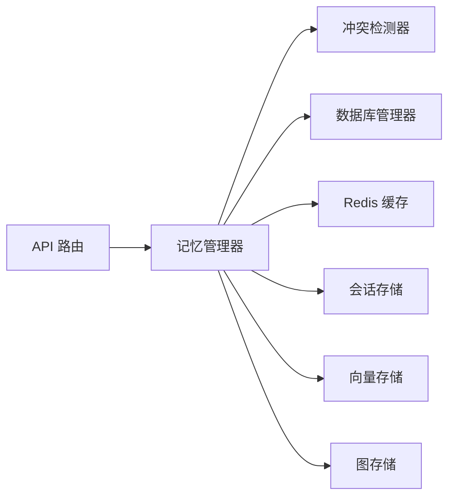

# 数据一致性策略

<cite>
**本文引用的文件**   
- [backend_design/nexus/memory/conflict.py](file://backend_design/nexus/memory/conflict.py)
- [backend_design/nexus/memory/manager.py](file://backend_design/nexus/memory/manager.py)
- [backend_design/nexus/core/db_manager.py](file://backend_design/nexus/core/db_manager.py)
- [backend_design/nexus/middleware/session_store.py](file://backend_design/nexus/middleware/session_store.py)
- [backend_design/nexus/middleware/redis_cache.py](file://backend_design/nexus/middleware/redis_cache.py)
- [backend_design/nexus/api/routes/chat_sessions.py](file://backend_design/nexus/api/routes/chat_sessions.py)
- [backend_design/nexus/models/state.py](file://backend_design/nexus/models/state.py)
- [backend_design/nexus/models/schemas.py](file://backend_design/nexus/models/schemas.py)
- [backend_design/nexus/rag/vector_store.py](file://backend_design/nexus/rag/vector_store.py)
- [backend_design/nexus/rag/graph_store.py](file://backend_design/nexus/rag/graph_store.py)
- [backend_design/nexus/observability/data_retention.py](file://backend_design/nexus/observability/data_retention.py)
- [backend_design/nexus/config.py](file://backend_design/nexus/config.py)
- [backend_design/nexus/main.py](file://backend_design/nexus/main.py)
</cite>

## 目录
1. [引言](#引言)
2. [项目结构](#项目结构)
3. [核心组件](#核心组件)
4. [架构总览](#架构总览)
5. [详细组件分析](#详细组件分析)
6. [依赖关系分析](#依赖关系分析)
7. [性能考量](#性能考量)
8. [故障排查指南](#故障排查指南)
9. [结论](#结论)
10. [附录](#附录)

## 引言
本文件面向多数据库与分布式环境下的数据一致性策略，围绕以下目标展开：
- 明确一致性与可用性的权衡（CAP 定理）
- 设计并说明分布式事务与最终一致性方案
- 定义记忆冲突检测与解决算法
- 制定数据同步策略与冲突合并规则
- 提供数据流图与一致性协议说明
- 记录数据完整性检查与修复机制
- 给出一致性问题的诊断与解决方案

## 项目结构
本项目在“后端设计”目录下包含记忆管理、中间件缓存与会话存储、RAG 向量/图存储、可观测性、配置与入口等模块。与一致性相关的关键路径包括：
- 记忆层：冲突检测与合并、会话状态持久化
- 中间件层：Redis 缓存与会话存储的一致性保障
- RAG 层：向量与图存储的写入顺序与幂等
- 可观测性：数据保留与清理策略
- 配置与入口：全局开关与启动流程

图表来源
- [backend_design/nexus/api/routes/chat_sessions.py](file://backend_design/nexus/api/routes/chat_sessions.py)
- [backend_design/nexus/memory/manager.py](file://backend_design/nexus/memory/manager.py)
- [backend_design/nexus/memory/conflict.py](file://backend_design/nexus/memory/conflict.py)
- [backend_design/nexus/core/db_manager.py](file://backend_design/nexus/core/db_manager.py)
- [backend_design/nexus/middleware/redis_cache.py](file://backend_design/nexus/middleware/redis_cache.py)
- [backend_design/nexus/middleware/session_store.py](file://backend_design/nexus/middleware/session_store.py)
- [backend_design/nexus/rag/vector_store.py](file://backend_design/nexus/rag/vector_store.py)
- [backend_design/nexus/rag/graph_store.py](file://backend_design/nexus/rag/graph_store.py)
- [backend_design/nexus/observability/data_retention.py](file://backend_design/nexus/observability/data_retention.py)
- [backend_design/nexus/config.py](file://backend_design/nexus/config.py)
- [backend_design/nexus/main.py](file://backend_design/nexus/main.py)

章节来源
- [backend_design/nexus/main.py](file://backend_design/nexus/main.py)
- [backend_design/nexus/config.py](file://backend_design/nexus/config.py)

## 核心组件
- 记忆管理器：协调会话状态、记忆写入、冲突检测与合并、跨存储同步
- 冲突检测器：基于版本/时间戳/指纹的冲突识别与优先级判定
- 数据库管理器：封装事务边界、重试与幂等写、回滚策略
- Redis 缓存与会话存储：读写穿透保护、过期与失效、缓存一致性
- 向量/图存储：写入顺序控制、去重与幂等、索引重建
- 数据保留：按策略清理历史数据，避免不一致残留

章节来源
- [backend_design/nexus/memory/manager.py](file://backend_design/nexus/memory/manager.py)
- [backend_design/nexus/memory/conflict.py](file://backend_design/nexus/memory/conflict.py)
- [backend_design/nexus/core/db_manager.py](file://backend_design/nexus/core/db_manager.py)
- [backend_design/nexus/middleware/redis_cache.py](file://backend_design/nexus/middleware/redis_cache.py)
- [backend_design/nexus/middleware/session_store.py](file://backend_design/nexus/middleware/session_store.py)
- [backend_design/nexus/rag/vector_store.py](file://backend_design/nexus/rag/vector_store.py)
- [backend_design/nexus/rag/graph_store.py](file://backend_design/nexus/rag/graph_store.py)
- [backend_design/nexus/observability/data_retention.py](file://backend_design/nexus/observability/data_retention.py)

## 架构总览
系统采用“强一致优先、最终一致兜底”的分层策略：
- 会话状态与关键元数据：通过数据库事务保证强一致
- 缓存与会话副本：采用失效+延迟双删或版本号校验，确保最终一致
- 向量/图检索：异步落盘与幂等写入，允许短暂不一致
- 可观测性：指标与日志贯穿全链路，支撑一致性诊断

图表来源
- [backend_design/nexus/api/routes/chat_sessions.py](file://backend_design/nexus/api/routes/chat_sessions.py)
- [backend_design/nexus/memory/manager.py](file://backend_design/nexus/memory/manager.py)
- [backend_design/nexus/core/db_manager.py](file://backend_design/nexus/core/db_manager.py)
- [backend_design/nexus/middleware/redis_cache.py](file://backend_design/nexus/middleware/redis_cache.py)
- [backend_design/nexus/middleware/session_store.py](file://backend_design/nexus/middleware/session_store.py)
- [backend_design/nexus/rag/vector_store.py](file://backend_design/nexus/rag/vector_store.py)
- [backend_design/nexus/rag/graph_store.py](file://backend_design/nexus/rag/graph_store.py)

## 详细组件分析

### 记忆冲突检测与解决
- 冲突检测维度
  - 版本/时间戳：比较写入前后版本号或时间戳，判断是否被并发修改
  - 内容指纹：对关键字段计算哈希，快速定位变更点
  - 操作类型：区分新增、更新、删除，决定合并策略
- 解决策略
  - 乐观锁：以版本号作为条件更新，失败则重试或提示用户
  - 合并规则：字段级合并、时间戳优先、业务权重优先
  - 冲突日志：记录冲突详情，便于审计与回溯

图表来源
- [backend_design/nexus/memory/conflict.py](file://backend_design/nexus/memory/conflict.py)
- [backend_design/nexus/memory/manager.py](file://backend_design/nexus/memory/manager.py)

章节来源
- [backend_design/nexus/memory/conflict.py](file://backend_design/nexus/memory/conflict.py)
- [backend_design/nexus/memory/manager.py](file://backend_design/nexus/memory/manager.py)

### 分布式事务与最终一致性
- 强一致路径
  - 使用数据库事务包裹关键写路径，确保原子性与隔离性
  - 失败时回滚并记录错误，必要时触发补偿任务
- 最终一致路径
  - 缓存与副本采用“先写主库，再删缓存/更新副本”的顺序
  - 引入幂等键与重试退避，防止重复写入与抖动
  - 异步任务将变更推送至向量/图存储，允许短暂不一致

图表来源
- [backend_design/nexus/core/db_manager.py](file://backend_design/nexus/core/db_manager.py)
- [backend_design/nexus/middleware/redis_cache.py](file://backend_design/nexus/middleware/redis_cache.py)
- [backend_design/nexus/rag/vector_store.py](file://backend_design/nexus/rag/vector_store.py)
- [backend_design/nexus/rag/graph_store.py](file://backend_design/nexus/rag/graph_store.py)

章节来源
- [backend_design/nexus/core/db_manager.py](file://backend_design/nexus/core/db_manager.py)
- [backend_design/nexus/middleware/redis_cache.py](file://backend_design/nexus/middleware/redis_cache.py)
- [backend_design/nexus/rag/vector_store.py](file://backend_design/nexus/rag/vector_store.py)
- [backend_design/nexus/rag/graph_store.py](file://backend_design/nexus/rag/graph_store.py)

### 数据同步策略与冲突合并规则
- 同步方向
  - 主库为权威源，缓存与会话副本为从属
  - 向量/图索引由主库变更驱动，异步构建
- 合并规则
  - 字段级合并：仅覆盖冲突字段，非冲突字段保持不变
  - 优先级：时间戳 > 业务权重 > 默认值
  - 幂等：所有写入携带唯一键，支持重复消费安全
- 一致性协议
  - 版本号递增：每次写成功后版本号+1
  - 事件溯源：变更记录持久化，用于回放与修复

图表来源
- [backend_design/nexus/memory/manager.py](file://backend_design/nexus/memory/manager.py)
- [backend_design/nexus/memory/conflict.py](file://backend_design/nexus/memory/conflict.py)
- [backend_design/nexus/core/db_manager.py](file://backend_design/nexus/core/db_manager.py)
- [backend_design/nexus/middleware/redis_cache.py](file://backend_design/nexus/middleware/redis_cache.py)
- [backend_design/nexus/rag/vector_store.py](file://backend_design/nexus/rag/vector_store.py)
- [backend_design/nexus/rag/graph_store.py](file://backend_design/nexus/rag/graph_store.py)

章节来源
- [backend_design/nexus/memory/manager.py](file://backend_design/nexus/memory/manager.py)
- [backend_design/nexus/memory/conflict.py](file://backend_design/nexus/memory/conflict.py)
- [backend_design/nexus/core/db_manager.py](file://backend_design/nexus/core/db_manager.py)
- [backend_design/nexus/middleware/redis_cache.py](file://backend_design/nexus/middleware/redis_cache.py)
- [backend_design/nexus/rag/vector_store.py](file://backend_design/nexus/rag/vector_store.py)
- [backend_design/nexus/rag/graph_store.py](file://backend_design/nexus/rag/graph_store.py)

### CAP 定理在系统设计中的权衡
- 分区容错性（P）：必须满足，网络分区不可避免
- 一致性（C）与可用性（A）的取舍
  - 读热点路径：偏向可用性，采用缓存与副本，容忍短暂不一致
  - 写关键路径：偏向一致性，采用事务与幂等，必要时降级
- 分层策略
  - 会话状态：强一致
  - 检索索引：最终一致
  - 监控与日志：最终一致且高可用

章节来源
- [backend_design/nexus/config.py](file://backend_design/nexus/config.py)
- [backend_design/nexus/main.py](file://backend_design/nexus/main.py)

### 数据完整性检查与修复机制
- 检查项
  - 主键/外键约束与唯一性
  - 版本号单调递增
  - 缓存键存在性与过期策略
  - 索引与主库数据一致性抽样
- 修复手段
  - 定时巡检：比对主库与索引差异，触发增量修复
  - 回放机制：基于事件日志重放缺失变更
  - 补偿任务：对失败写入进行重试与幂等修正

章节来源
- [backend_design/nexus/observability/data_retention.py](file://backend_design/nexus/observability/data_retention.py)
- [backend_design/nexus/core/db_manager.py](file://backend_design/nexus/core/db_manager.py)

### 一致性问题的诊断与解决方案
- 常见问题
  - 缓存穿透/击穿：未命中导致频繁访问主库
  - 脏读：读取到未提交的中间状态
  - 索引漂移：索引与主库不一致
  - 冲突风暴：高并发下大量冲突导致重试放大
- 诊断方法
  - 追踪链路：记录请求ID与版本号，关联日志与指标
  - 对比快照：定期导出主库与索引快照进行差异分析
  - 告警阈值：设置超时、错误率、重试次数阈值
- 解决方案
  - 加锁与限流：热点键加分布式锁，限制并发
  - 幂等与去重：写入携带唯一键，消费端去重
  - 降级与熔断：异常时降级到只读或缓存
  - 补偿与回放：失败任务入队，后台批量修复

章节来源
- [backend_design/nexus/middleware/redis_cache.py](file://backend_design/nexus/middleware/redis_cache.py)
- [backend_design/nexus/middleware/session_store.py](file://backend_design/nexus/middleware/session_store.py)
- [backend_design/nexus/rag/vector_store.py](file://backend_design/nexus/rag/vector_store.py)
- [backend_design/nexus/rag/graph_store.py](file://backend_design/nexus/rag/graph_store.py)

## 依赖关系分析
- 组件耦合
  - 记忆管理器依赖冲突检测器、数据库管理器、缓存与会话存储、索引存储
  - API 路由仅依赖记忆管理器，保持薄控制器
- 外部依赖
  - 数据库、Redis、向量库、图数据库
- 潜在循环依赖
  - 通过接口抽象与事件解耦避免循环引用

图表来源
- [backend_design/nexus/api/routes/chat_sessions.py](file://backend_design/nexus/api/routes/chat_sessions.py)
- [backend_design/nexus/memory/manager.py](file://backend_design/nexus/memory/manager.py)
- [backend_design/nexus/memory/conflict.py](file://backend_design/nexus/memory/conflict.py)
- [backend_design/nexus/core/db_manager.py](file://backend_design/nexus/core/db_manager.py)
- [backend_design/nexus/middleware/redis_cache.py](file://backend_design/nexus/middleware/redis_cache.py)
- [backend_design/nexus/middleware/session_store.py](file://backend_design/nexus/middleware/session_store.py)
- [backend_design/nexus/rag/vector_store.py](file://backend_design/nexus/rag/vector_store.py)
- [backend_design/nexus/rag/graph_store.py](file://backend_design/nexus/rag/graph_store.py)

章节来源
- [backend_design/nexus/api/routes/chat_sessions.py](file://backend_design/nexus/api/routes/chat_sessions.py)
- [backend_design/nexus/memory/manager.py](file://backend_design/nexus/memory/manager.py)

## 性能考量
- 事务粒度：尽量缩小事务范围，减少锁持有时间
- 幂等写入：避免重复计算与重复 IO
- 异步批处理：索引构建批量提交，降低峰值压力
- 缓存命中率：合理设置过期时间与预热策略
- 重试退避：指数退避与抖动，避免雪崩

## 故障排查指南
- 快速定位
  - 查看请求链路与版本号，确认是否发生冲突
  - 检查缓存键是否存在与过期时间
  - 核对索引与主库差异报告
- 常见错误码与含义
  - 冲突错误：需要重试或人工介入合并
  - 超时错误：检查下游依赖与资源水位
  - 幂等失败：检查唯一键生成逻辑
- 恢复步骤
  - 触发补偿任务与回放
  - 重建局部索引
  - 重启异常节点并观察自愈

章节来源
- [backend_design/nexus/core/db_manager.py](file://backend_design/nexus/core/db_manager.py)
- [backend_design/nexus/middleware/redis_cache.py](file://backend_design/nexus/middleware/redis_cache.py)
- [backend_design/nexus/observability/data_retention.py](file://backend_design/nexus/observability/data_retention.py)

## 结论
通过在关键路径采用强一致事务、在非关键路径采用最终一致与幂等异步写入，系统在分区容错的前提下实现了良好的可用性与一致性平衡。配合冲突检测、合并规则与完整性检查，能够有效降低不一致风险并提升可观测性与可恢复性。

## 附录
- 模型与状态
  - 会话状态模型：定义状态字段与版本信息
  - 输入输出模式：统一数据结构，便于校验与序列化

章节来源
- [backend_design/nexus/models/state.py](file://backend_design/nexus/models/state.py)
- [backend_design/nexus/models/schemas.py](file://backend_design/nexus/models/schemas.py)