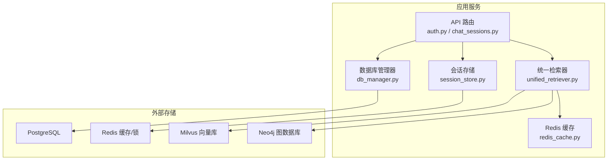
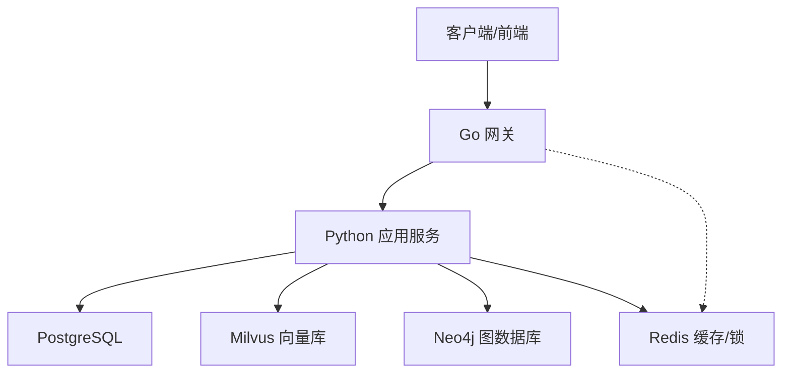
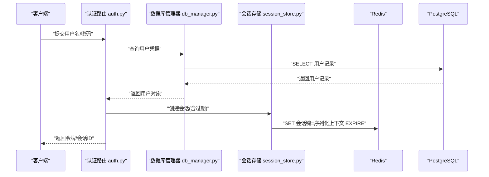
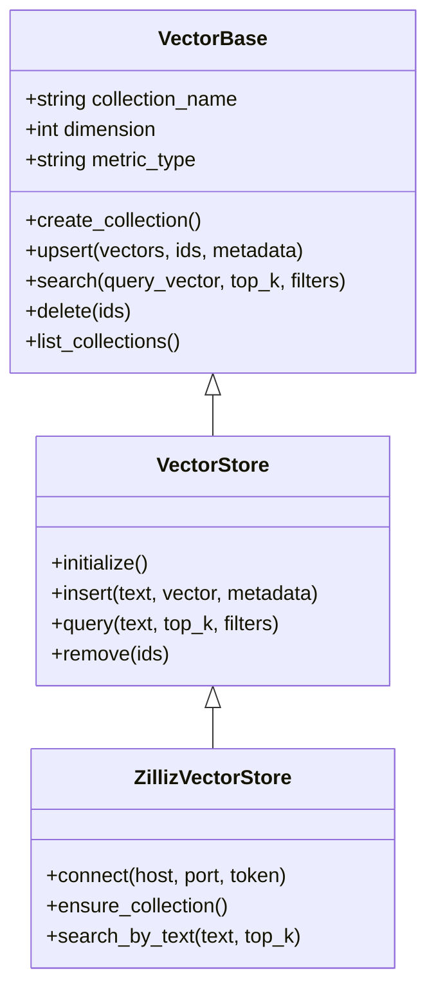
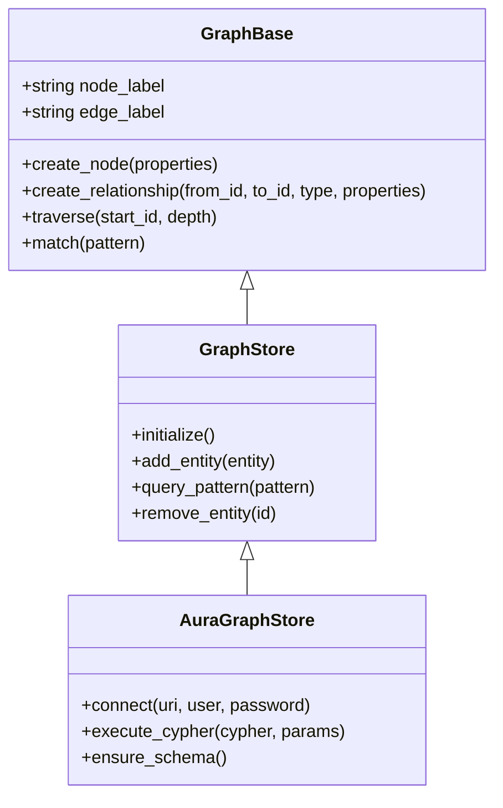
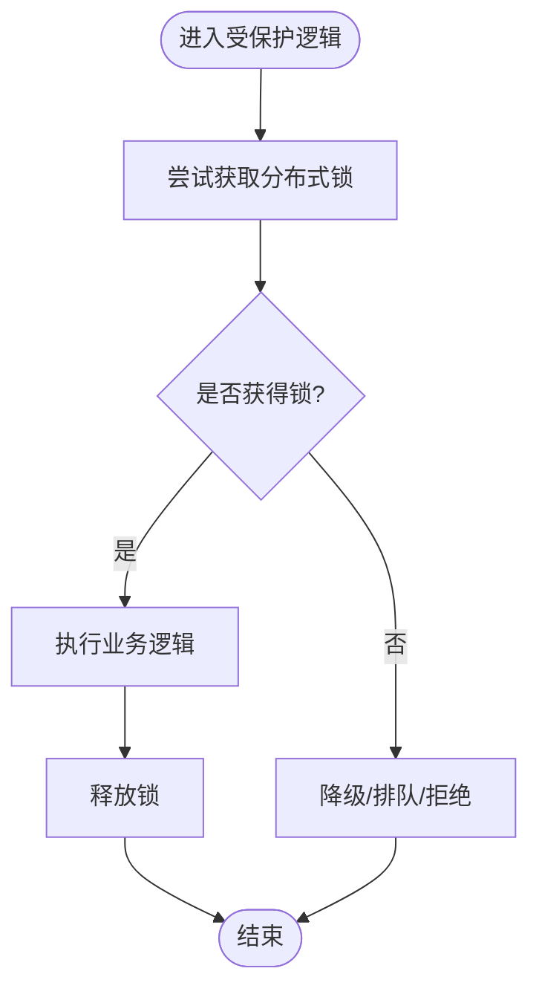
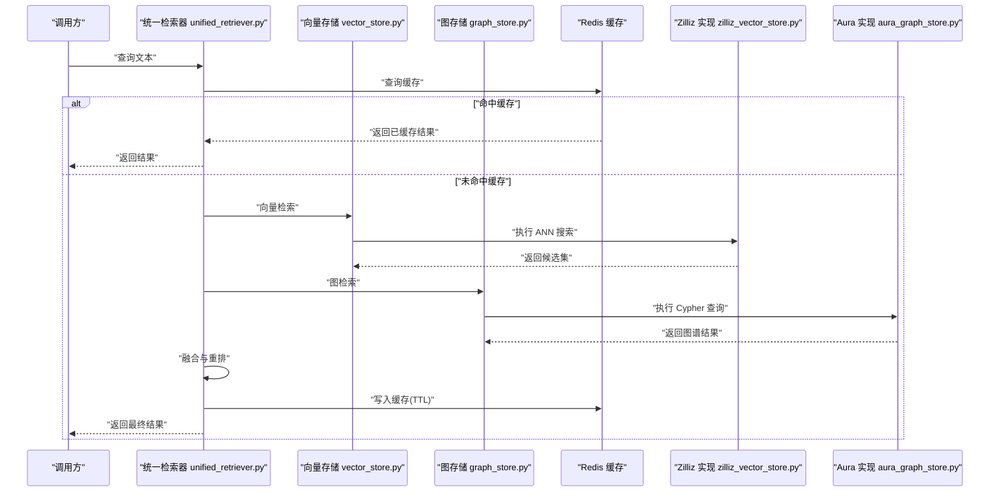
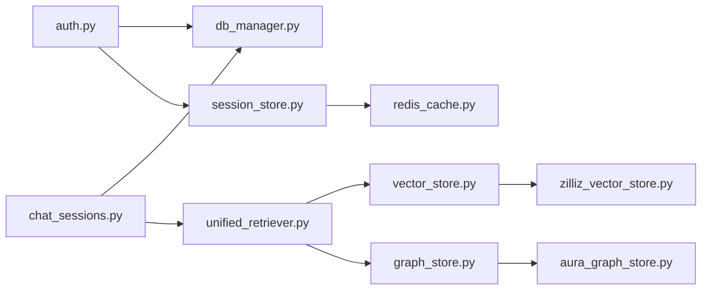
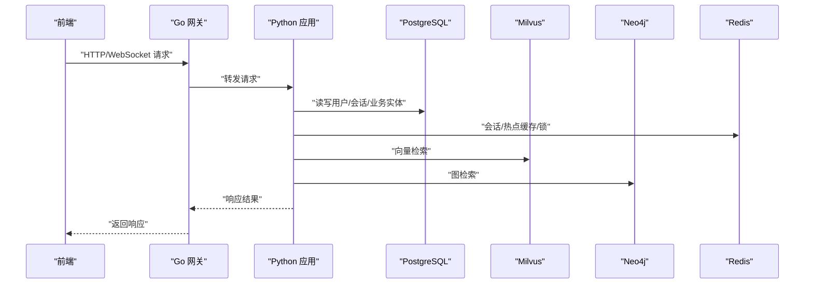
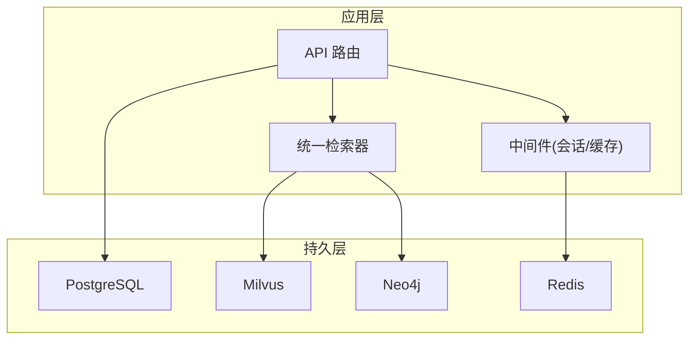

# 数据架构设计

<cite>
**本文引用的文件**   
- [backend_design/nexus/core/db_manager.py](file://backend_design/nexus/core/db_manager.py)
- [backend_design/nexus/middleware/session_store.py](file://backend_design/nexus/middleware/session_store.py)
- [backend_design/nexus/middleware/redis_cache.py](file://backend_design/nexus/middleware/redis_cache.py)
- [backend_design/nexus/models/state.py](file://backend_design/nexus/models/state.py)
- [backend_design/nexus/models/schemas.py](file://backend_design/nexus/models/schemas.py)
- [backend_design/nexus/models/cockpit.py](file://backend_design/nexus/models/cockpit.py)
- [backend_design/nexus/api/routes/auth.py](file://backend_design/nexus/api/routes/auth.py)
- [backend_design/nexus/api/routes/chat_sessions.py](file://backend_design/nexus/api/routes/chat_sessions.py)
- [backend_design/nexus/rag/vector_base.py](file://backend_design/nexus/rag/vector_base.py)
- [backend_design/nexus/rag/vector_store.py](file://backend_design/nexus/rag/vector_store.py)
- [backend_design/nexus/rag/zilliz_vector_store.py](file://backend_design/nexus/rag/zilliz_vector_store.py)
- [backend_design/nexus/rag/graph_base.py](file://backend_design/nexus/rag/graph_base.py)
- [backend_design/nexus/rag/graph_store.py](file://backend_design/nexus/rag/graph_store.py)
- [backend_design/nexus/rag/aura_graph_store.py](file://backend_design/nexus/rag/aura_graph_store.py)
- [backend_design/nexus/rag/unified_retriever.py](file://backend_design/nexus/rag/unified_retriever.py)
- [backend_design/nexus/rag/retriever.py](file://backend_design/nexus/rag/retriever.py)
- [backend_design/nexus/config.py](file://backend_design/nexus/config.py)
- [backend_design/nexus/main.py](file://backend_design/nexus/main.py)
- [backend_design/nexus_gate/internal/handlers/redis_client.go](file://backend_design/nexus_gate/internal/handlers/redis_client.go)
- [scripts/init_milvus.py](file://scripts/init_milvus.py)
- [scripts/init_neo4j.py](file://scripts/init_neo4j.py)
- [scripts/v2.1_migration.sql](file://scripts/v2.1_migration.sql)
- [docker-compose.yml](file://docker-compose.yml)
</cite>

## 目录
1. [引言](#引言)
2. [项目结构](#项目结构)
3. [核心组件](#核心组件)
4. [架构总览](#架构总览)
5. [详细组件分析](#详细组件分析)
6. [依赖分析](#依赖分析)
7. [性能考虑](#性能考虑)
8. [故障排查指南](#故障排查指南)
9. [结论](#结论)
10. [附录](#附录)

## 引言
本数据架构设计文档面向 NexusCockpit 系统，聚焦多数据库选型与数据存储策略：关系型数据库（PostgreSQL）用于用户、会话与业务实体；向量数据库（Milvus）支撑语义检索与知识召回；图数据库（Neo4j）承载知识图谱与复杂关系查询；缓存层（Redis）提供会话缓存、热点数据缓存与分布式锁。文档同时阐述数据一致性策略、事务处理机制、备份恢复与迁移方案，并给出数据流向与存储架构图，帮助读者快速理解系统的数据分层与交互路径。

## 项目结构
NexusCockpit 后端采用 Python 服务 + Go 网关的混合架构。数据访问集中在 core/db_manager 与 RAG 子系统的向量/图存储抽象中，中间件 session_store 与 redis_cache 负责会话与缓存能力，API 路由通过统一模型与配置完成数据读写。Go 网关侧通过 Redis 客户端参与鉴权与会话相关操作。

图表来源
- [backend_design/nexus/api/routes/auth.py](file://backend_design/nexus/api/routes/auth.py)
- [backend_design/nexus/api/routes/chat_sessions.py](file://backend_design/nexus/api/routes/chat_sessions.py)
- [backend_design/nexus/core/db_manager.py](file://backend_design/nexus/core/db_manager.py)
- [backend_design/nexus/middleware/session_store.py](file://backend_design/nexus/middleware/session_store.py)
- [backend_design/nexus/middleware/redis_cache.py](file://backend_design/nexus/middleware/redis_cache.py)
- [backend_design/nexus/rag/unified_retriever.py](file://backend_design/nexus/rag/unified_retriever.py)
- [backend_design/nexus/rag/vector_store.py](file://backend_design/nexus/rag/vector_store.py)
- [backend_design/nexus/rag/graph_store.py](file://backend_design/nexus/rag/graph_store.py)

章节来源
- [backend_design/nexus/main.py](file://backend_design/nexus/main.py)
- [backend_design/nexus/config.py](file://backend_design/nexus/config.py)

## 核心组件
- 数据库管理器：封装连接池、事务边界与通用 CRUD 操作，为业务模块提供一致的数据访问接口。
- 会话存储：基于 Redis 的会话存取，支持过期与跨实例共享。
- Redis 缓存：通用键值缓存与分布式锁实现，服务于热点数据与并发控制。
- 统一检索器：聚合向量检索与图检索结果，结合重排与缓存提升检索质量与性能。
- 向量存储抽象：定义统一的向量索引、写入与相似度搜索接口，默认实现指向 Milvus。
- 图存储抽象：定义统一的节点/边增删改查与遍历接口，默认实现指向 Neo4j。

章节来源
- [backend_design/nexus/core/db_manager.py](file://backend_design/nexus/core/db_manager.py)
- [backend_design/nexus/middleware/session_store.py](file://backend_design/nexus/middleware/session_store.py)
- [backend_design/nexus/middleware/redis_cache.py](file://backend_design/nexus/middleware/redis_cache.py)
- [backend_design/nexus/rag/unified_retriever.py](file://backend_design/nexus/rag/unified_retriever.py)
- [backend_design/nexus/rag/vector_base.py](file://backend_design/nexus/rag/vector_base.py)
- [backend_design/nexus/rag/vector_store.py](file://backend_design/nexus/rag/vector_store.py)
- [backend_design/nexus/rag/zilliz_vector_store.py](file://backend_design/nexus/rag/zilliz_vector_store.py)
- [backend_design/nexus/rag/graph_base.py](file://backend_design/nexus/rag/graph_base.py)
- [backend_design/nexus/rag/graph_store.py](file://backend_design/nexus/rag/graph_store.py)
- [backend_design/nexus/rag/aura_graph_store.py](file://backend_design/nexus/rag/aura_graph_store.py)

## 架构总览
NexusCockpit 的数据架构遵循“读写分离、按特性选库”的原则：
- PostgreSQL：承载强一致性的用户、会话元数据与业务实体。
- Milvus：承载文本/语音等向量化表示，提供高维相似度检索。
- Neo4j：承载实体与关系，支持复杂路径与关联推理查询。
- Redis：提供低延迟会话缓存、热点数据缓存与分布式锁。

图表来源
- [backend_design/nexus/main.py](file://backend_design/nexus/main.py)
- [backend_design/nexus_gate/internal/handlers/redis_client.go](file://backend_design/nexus_gate/internal/handlers/redis_client.go)
- [docker-compose.yml](file://docker-compose.yml)

## 详细组件分析

### 关系型数据库（PostgreSQL）
- 职责范围
  - 用户与租户信息、认证凭据与权限。
  - 会话元数据（会话ID、状态、时间戳、关联实体ID）。
  - 业务实体（如座舱 Cockpit 配置、车辆状态快照等）。
- 访问模式
  - 通过数据库管理器建立连接池与事务边界，确保写操作的原子性与隔离性。
  - 读路径可配合 Redis 缓存热点记录以降低 DB 压力。
- 典型流程（以登录与会话创建为例）
  - 校验凭据后在 PostgreSQL 中更新或创建会话元数据。
  - 将会话上下文写入 Redis，设置过期时间以实现自动清理。
  - 后续请求携带会话标识，优先从 Redis 读取上下文，缺失时回源至 PostgreSQL。

图表来源
- [backend_design/nexus/api/routes/auth.py](file://backend_design/nexus/api/routes/auth.py)
- [backend_design/nexus/core/db_manager.py](file://backend_design/nexus/core/db_manager.py)
- [backend_design/nexus/middleware/session_store.py](file://backend_design/nexus/middleware/session_store.py)

章节来源
- [backend_design/nexus/core/db_manager.py](file://backend_design/nexus/core/db_manager.py)
- [backend_design/nexus/middleware/session_store.py](file://backend_design/nexus/middleware/session_store.py)
- [backend_design/nexus/models/state.py](file://backend_design/nexus/models/state.py)
- [backend_design/nexus/models/schemas.py](file://backend_design/nexus/models/schemas.py)
- [backend_design/nexus/models/cockpit.py](file://backend_design/nexus/models/cockpit.py)

### 向量数据库（Milvus）
- 职责范围
  - 存储文本/语音等内容的向量嵌入，提供近似最近邻（ANN）检索。
  - 支持集合/索引管理、批量写入与过滤条件检索。
- 关键抽象
  - 向量基类定义集合名、维度、度量类型、索引参数等。
  - 向量存储接口提供 upsert、search、delete、list_collections 等方法。
  - Zilliz/Milvus 具体实现对接底层 SDK，封装连接、集合与查询。
- 使用场景
  - 知识库问答、语义搜索、相似内容推荐。
  - 与图检索结果融合，提升召回相关性。

图表来源
- [backend_design/nexus/rag/vector_base.py](file://backend_design/nexus/rag/vector_base.py)
- [backend_design/nexus/rag/vector_store.py](file://backend_design/nexus/rag/vector_store.py)
- [backend_design/nexus/rag/zilliz_vector_store.py](file://backend_design/nexus/rag/zilliz_vector_store.py)

章节来源
- [backend_design/nexus/rag/vector_base.py](file://backend_design/nexus/rag/vector_base.py)
- [backend_design/nexus/rag/vector_store.py](file://backend_design/nexus/rag/vector_store.py)
- [backend_design/nexus/rag/zilliz_vector_store.py](file://backend_design/nexus/rag/zilliz_vector_store.py)
- [scripts/init_milvus.py](file://scripts/init_milvus.py)

### 图数据库（Neo4j）
- 职责范围
  - 构建实体-关系图谱，存储领域概念、属性与关系边。
  - 支持复杂路径查询、邻居扩展与子图匹配。
- 关键抽象
  - 图基类定义节点/边标签、属性映射与基础遍历方法。
  - 图存储接口提供 create_node、create_relationship、traverse、match 等。
  - AuraGraphStore 对接 Neo4j/Aura 云，封装连接与 Cypher 执行。
- 使用场景
  - 知识图谱问答、意图路由中的实体消歧与关系推理。
  - 与向量检索结果进行联合排序，增强可解释性。

图表来源
- [backend_design/nexus/rag/graph_base.py](file://backend_design/nexus/rag/graph_base.py)
- [backend_design/nexus/rag/graph_store.py](file://backend_design/nexus/rag/graph_store.py)
- [backend_design/nexus/rag/aura_graph_store.py](file://backend_design/nexus/rag/aura_graph_store.py)

章节来源
- [backend_design/nexus/rag/graph_base.py](file://backend_design/nexus/rag/graph_base.py)
- [backend_design/nexus/rag/graph_store.py](file://backend_design/nexus/rag/graph_store.py)
- [backend_design/nexus/rag/aura_graph_store.py](file://backend_design/nexus/rag/aura_graph_store.py)
- [scripts/init_neo4j.py](file://scripts/init_neo4j.py)

### 缓存层（Redis）
- 职责范围
  - 会话缓存：跨实例共享用户会话上下文，支持 TTL 自动过期。
  - 热点数据缓存：高频读取的业务实体或检索结果短期缓存。
  - 分布式锁：保护临界区，避免重复写入与竞态条件。
- 关键实现
  - 会话存储：封装 set/get/del/expire 等操作，统一键空间与序列化策略。
  - Redis 缓存：提供 get/set/delete/exists/lock 等通用接口。
  - Go 网关侧 Redis 客户端：在网关层做鉴权/限流/会话校验等前置检查。

图表来源
- [backend_design/nexus/middleware/redis_cache.py](file://backend_design/nexus/middleware/redis_cache.py)
- [backend_design/nexus/middleware/session_store.py](file://backend_design/nexus/middleware/session_store.py)
- [backend_design/nexus_gate/internal/handlers/redis_client.go](file://backend_design/nexus_gate/internal/handlers/redis_client.go)

章节来源
- [backend_design/nexus/middleware/redis_cache.py](file://backend_design/nexus/middleware/redis_cache.py)
- [backend_design/nexus/middleware/session_store.py](file://backend_design/nexus/middleware/session_store.py)
- [backend_design/nexus_gate/internal/handlers/redis_client.go](file://backend_design/nexus_gate/internal/handlers/redis_client.go)

### 统一检索器（向量+图+缓存）
- 职责范围
  - 接收自然语言查询，并行调用向量检索与图检索，合并结果并进行重排。
  - 对检索结果进行缓存，降低下游存储压力。
- 关键流程
  - 解析查询 -> 生成向量 -> 向量检索 -> 图模式匹配 -> 结果融合 -> 重排 -> 缓存 -> 返回。

图表来源
- [backend_design/nexus/rag/unified_retriever.py](file://backend_design/nexus/rag/unified_retriever.py)
- [backend_design/nexus/rag/vector_store.py](file://backend_design/nexus/rag/vector_store.py)
- [backend_design/nexus/rag/zilliz_vector_store.py](file://backend_design/nexus/rag/zilliz_vector_store.py)
- [backend_design/nexus/rag/graph_store.py](file://backend_design/nexus/rag/graph_store.py)
- [backend_design/nexus/rag/aura_graph_store.py](file://backend_design/nexus/rag/aura_graph_store.py)
- [backend_design/nexus/middleware/redis_cache.py](file://backend_design/nexus/middleware/redis_cache.py)

章节来源
- [backend_design/nexus/rag/unified_retriever.py](file://backend_design/nexus/rag/unified_retriever.py)
- [backend_design/nexus/rag/retriever.py](file://backend_design/nexus/rag/retriever.py)

## 依赖分析
- 组件耦合
  - API 路由依赖数据库管理器、会话存储与统一检索器，保持薄控制器风格。
  - 统一检索器依赖向量与图存储抽象，屏蔽底层差异。
  - 会话存储与 Redis 缓存均依赖 Redis，前者侧重会话生命周期，后者侧重通用缓存与锁。
- 外部依赖
  - PostgreSQL、Milvus、Neo4j、Redis 作为独立服务由编排脚本启动与初始化。
- 潜在循环依赖
  - 通过抽象层（vector_base/graph_base）解耦实现，避免直接循环引用。

图表来源
- [backend_design/nexus/api/routes/auth.py](file://backend_design/nexus/api/routes/auth.py)
- [backend_design/nexus/api/routes/chat_sessions.py](file://backend_design/nexus/api/routes/chat_sessions.py)
- [backend_design/nexus/core/db_manager.py](file://backend_design/nexus/core/db_manager.py)
- [backend_design/nexus/middleware/session_store.py](file://backend_design/nexus/middleware/session_store.py)
- [backend_design/nexus/middleware/redis_cache.py](file://backend_design/nexus/middleware/redis_cache.py)
- [backend_design/nexus/rag/unified_retriever.py](file://backend_design/nexus/rag/unified_retriever.py)
- [backend_design/nexus/rag/vector_store.py](file://backend_design/nexus/rag/vector_store.py)
- [backend_design/nexus/rag/zilliz_vector_store.py](file://backend_design/nexus/rag/zilliz_vector_store.py)
- [backend_design/nexus/rag/graph_store.py](file://backend_design/nexus/rag/graph_store.py)
- [backend_design/nexus/rag/aura_graph_store.py](file://backend_design/nexus/rag/aura_graph_store.py)

章节来源
- [backend_design/nexus/config.py](file://backend_design/nexus/config.py)
- [docker-compose.yml](file://docker-compose.yml)

## 性能考虑
- 连接与池化
  - 数据库连接池复用，减少握手开销；合理设置最大连接数与超时。
- 缓存策略
  - 热点会话与检索结果设置短 TTL，避免脏读；对写多读少场景谨慎缓存。
- 检索优化
  - 向量检索使用合适的索引与度量；图检索限制深度与跳数，避免全图扫描。
- 异步与批处理
  - 批量写入向量与图数据，减少网络往返；非关键路径异步落盘。
- 容错与降级
  - 当向量/图服务不可用时，回退到仅关系型数据或空结果，保障可用性。

[本节为通用指导，不直接分析具体文件]

## 故障排查指南
- 常见问题定位
  - 连接失败：检查各存储服务地址、端口、认证信息与防火墙策略。
  - 会话丢失：确认 Redis 键空间与 TTL 配置，核对序列化格式。
  - 检索异常：验证向量维度、集合名称与索引状态；检查图数据库连通性与 Cypher 语法。
  - 锁竞争：观察锁持有时间与释放路径，避免死锁与长事务。
- 建议日志与指标
  - 记录关键路径耗时、错误码与重试次数；暴露 QPS、延迟与命中率指标。

章节来源
- [backend_design/nexus/core/db_manager.py](file://backend_design/nexus/core/db_manager.py)
- [backend_design/nexus/middleware/redis_cache.py](file://backend_design/nexus/middleware/redis_cache.py)
- [backend_design/nexus/middleware/session_store.py](file://backend_design/nexus/middleware/session_store.py)
- [backend_design/nexus/rag/vector_store.py](file://backend_design/nexus/rag/vector_store.py)
- [backend_design/nexus/rag/graph_store.py](file://backend_design/nexus/rag/graph_store.py)

## 结论
NexusCockpit 的数据架构以“按特性选库”为核心思想，利用 PostgreSQL 保证强一致的用户与会话数据，借助 Milvus 实现高效语义检索，依托 Neo4j 表达复杂关系与推理，并通过 Redis 提供高性能缓存与分布式锁。统一检索器将多源检索结果融合并重排，兼顾准确性与性能。整体设计具备良好的可扩展性与可维护性，适合在大规模知识与交互场景中持续演进。

[本节为总结性内容，不直接分析具体文件]

## 附录

### 数据一致性策略与事务处理
- 事务边界
  - 写操作在数据库管理器内开启事务，失败时回滚，保证原子性。
- 一致性模型
  - 会话与用户数据采用强一致；检索结果允许最终一致，通过缓存与重试补偿。
- 幂等与去重
  - 对写入操作引入唯一键或版本号，避免重复写入导致数据漂移。

章节来源
- [backend_design/nexus/core/db_manager.py](file://backend_design/nexus/core/db_manager.py)
- [backend_design/nexus/models/state.py](file://backend_design/nexus/models/state.py)

### 备份、恢复与迁移策略
- 备份
  - 定期导出 PostgreSQL 数据快照；对向量与图数据库执行增量/全量备份任务。
- 恢复
  - 制定演练计划，验证恢复顺序与数据完整性。
- 迁移
  - 使用 SQL 迁移脚本进行版本升级，确保向后兼容与灰度发布。

章节来源
- [scripts/v2.1_migration.sql](file://scripts/v2.1_migration.sql)
- [scripts/init_milvus.py](file://scripts/init_milvus.py)
- [scripts/init_neo4j.py](file://scripts/init_neo4j.py)
- [docker-compose.yml](file://docker-compose.yml)

### 数据流向图与存储架构图
- 数据流向图（端到端）

图表来源
- [backend_design/nexus/main.py](file://backend_design/nexus/main.py)
- [backend_design/nexus/api/routes/auth.py](file://backend_design/nexus/api/routes/auth.py)
- [backend_design/nexus/api/routes/chat_sessions.py](file://backend_design/nexus/api/routes/chat_sessions.py)
- [backend_design/nexus/core/db_manager.py](file://backend_design/nexus/core/db_manager.py)
- [backend_design/nexus/middleware/session_store.py](file://backend_design/nexus/middleware/session_store.py)
- [backend_design/nexus/middleware/redis_cache.py](file://backend_design/nexus/middleware/redis_cache.py)
- [backend_design/nexus/rag/unified_retriever.py](file://backend_design/nexus/rag/unified_retriever.py)
- [backend_design/nexus/rag/vector_store.py](file://backend_design/nexus/rag/vector_store.py)
- [backend_design/nexus/rag/graph_store.py](file://backend_design/nexus/rag/graph_store.py)
- [backend_design/nexus_gate/internal/handlers/redis_client.go](file://backend_design/nexus_gate/internal/handlers/redis_client.go)

- 存储架构图（多库协同）

图表来源
- [backend_design/nexus/api/routes/auth.py](file://backend_design/nexus/api/routes/auth.py)
- [backend_design/nexus/api/routes/chat_sessions.py](file://backend_design/nexus/api/routes/chat_sessions.py)
- [backend_design/nexus/middleware/session_store.py](file://backend_design/nexus/middleware/session_store.py)
- [backend_design/nexus/middleware/redis_cache.py](file://backend_design/nexus/middleware/redis_cache.py)
- [backend_design/nexus/rag/unified_retriever.py](file://backend_design/nexus/rag/unified_retriever.py)
- [backend_design/nexus/rag/vector_store.py](file://backend_design/nexus/rag/vector_store.py)
- [backend_design/nexus/rag/graph_store.py](file://backend_design/nexus/rag/graph_store.py)