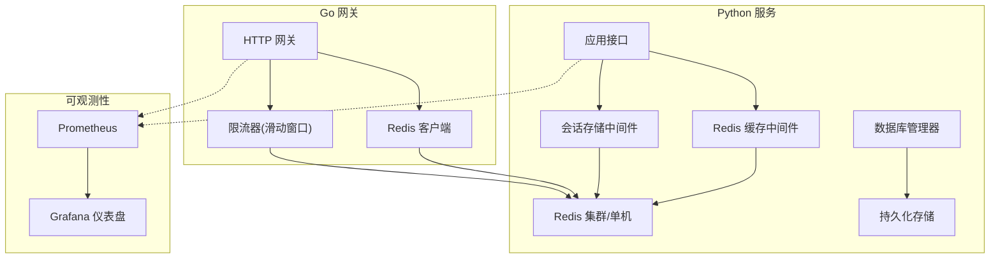
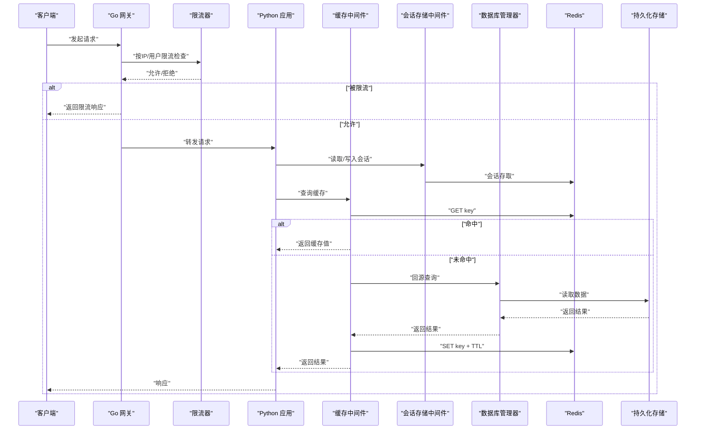
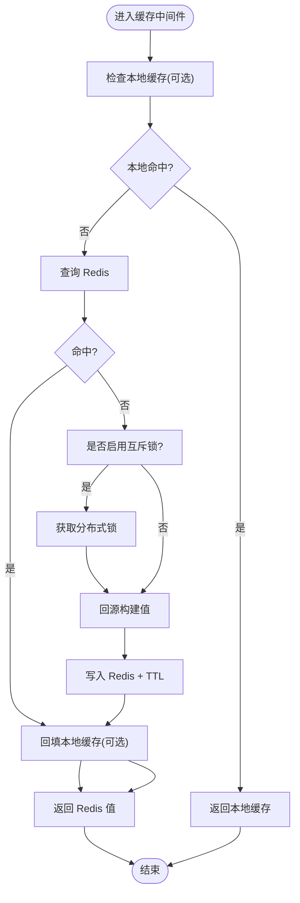
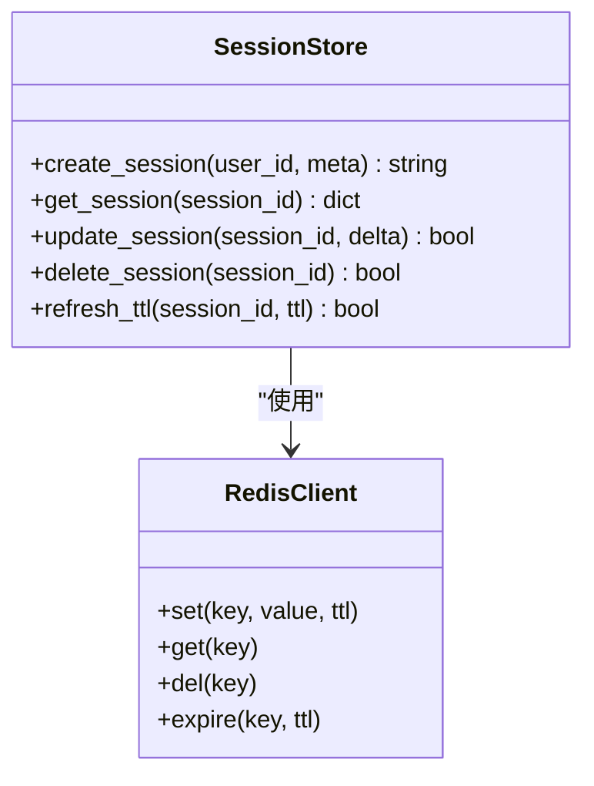
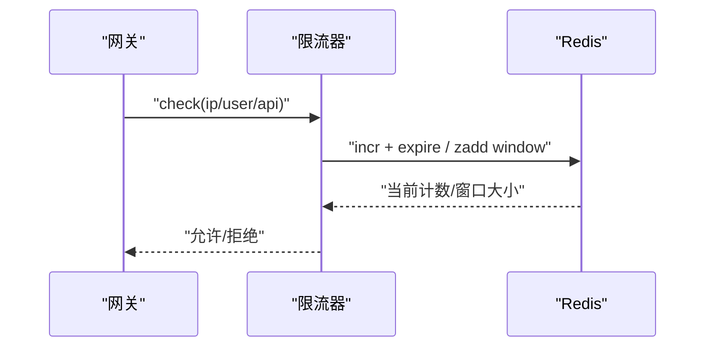
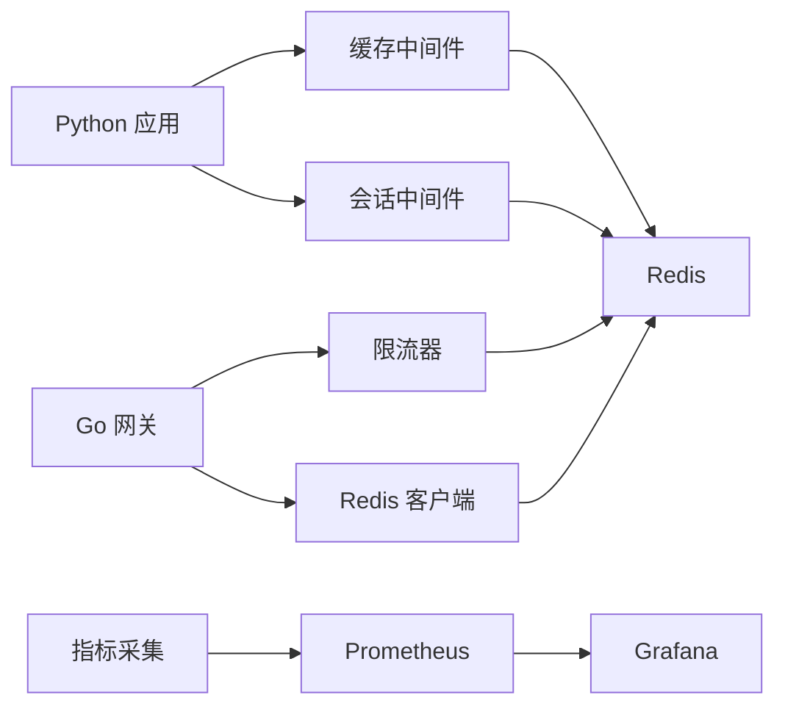

# 缓存层设计

<cite>
**本文引用的文件**   
- [backend_design/nexus/middleware/redis_cache.py](file://backend_design/nexus/middleware/redis_cache.py)
- [backend_design/nexus/middleware/session_store.py](file://backend_design/nexus/middleware/session_store.py)
- [backend_design/nexus/core/db_manager.py](file://backend_design/nexus/core/db_manager.py)
- [backend_design/nexus/config.py](file://backend_design/nexus/config.py)
- [backend_design/nexus_gate/internal/handlers/redis_client.go](file://backend_design/nexus_gate/internal/handlers/redis_client.go)
- [backend_design/nexus_gate/internal/ratelimit/ratelimit.go](file://backend_design/nexus_gate/internal/ratelimit/ratelimit.go)
- [config/prometheus/prometheus.yml](file://config/prometheus/prometheus.yml)
- [config/grafana/provisioning/dashboards/dashboards.yml](file://config/grafana/provisioning/dashboards/dashboards.yml)
- [config/grafana/provisioning/dashboards/nexuscockpit-overview.json](file://config/grafana/provisioning/dashboards/nexuscockpit-overview.json)
</cite>

## 目录
1. [引言](#引言)
2. [项目结构](#项目结构)
3. [核心组件](#核心组件)
4. [架构总览](#架构总览)
5. [详细组件分析](#详细组件分析)
6. [依赖关系分析](#依赖关系分析)
7. [性能考量](#性能考量)
8. [故障排查指南](#故障排查指南)
9. [结论](#结论)
10. [附录](#附录)

## 引言
本设计文档聚焦于缓存层的整体方案与实现，围绕 Redis 作为统一缓存与分布式中间件，覆盖以下主题：
- 会话存储与分布式会话管理
- 热点数据缓存策略与失效策略
- 缓存穿透、雪崩、击穿防护
- 分布式锁的实现与应用场景
- 缓存架构图与配置示例
- 监控指标与性能优化建议
- 缓存一致性保证与故障恢复方案

## 项目结构
本项目在 Python 后端与 Go 网关两侧均集成 Redis 能力：
- Python 侧提供通用缓存中间件与会话存储中间件，面向业务接口进行读写加速与会话持久化。
- Go 网关侧提供轻量 Redis 客户端与基于滑动窗口的限流器，用于入口流量治理与全局计数。
- 可观测性通过 Prometheus/Grafana 采集与展示关键指标。

图表来源
- [backend_design/nexus/middleware/redis_cache.py](file://backend_design/nexus/middleware/redis_cache.py)
- [backend_design/nexus/middleware/session_store.py](file://backend_design/nexus/middleware/session_store.py)
- [backend_design/nexus_gate/internal/handlers/redis_client.go](file://backend_design/nexus_gate/internal/handlers/redis_client.go)
- [backend_design/nexus_gate/internal/ratelimit/ratelimit.go](file://backend_design/nexus_gate/internal/ratelimit/ratelimit.go)
- [config/prometheus/prometheus.yml](file://config/prometheus/prometheus.yml)
- [config/grafana/provisioning/dashboards/dashboards.yml](file://config/grafana/provisioning/dashboards/dashboards.yml)
- [config/grafana/provisioning/dashboards/nexuscockpit-overview.json](file://config/grafana/provisioning/dashboards/nexuscockpit-overview.json)

章节来源
- [backend_design/nexus/middleware/redis_cache.py](file://backend_design/nexus/middleware/redis_cache.py)
- [backend_design/nexus/middleware/session_store.py](file://backend_design/nexus/middleware/session_store.py)
- [backend_design/nexus_gate/internal/handlers/redis_client.go](file://backend_design/nexus_gate/internal/handlers/redis_client.go)
- [backend_design/nexus_gate/internal/ratelimit/ratelimit.go](file://backend_design/nexus_gate/internal/ratelimit/ratelimit.go)
- [config/prometheus/prometheus.yml](file://config/prometheus/prometheus.yml)
- [config/grafana/provisioning/dashboards/dashboards.yml](file://config/grafana/provisioning/dashboards/dashboards.yml)
- [config/grafana/provisioning/dashboards/nexuscockpit-overview.json](file://config/grafana/provisioning/dashboards/nexuscockpit-overview.json)

## 核心组件
- Redis 缓存中间件：为业务方法提供装饰器式或显式的 get/set/delete 封装，支持 TTL、序列化、键前缀与命名空间隔离。
- 会话存储中间件：将用户会话状态落盘至 Redis，支撑多实例无状态部署下的跨节点会话共享。
- 网关 Redis 客户端：为网关层提供统一的连接池、重试与错误处理。
- 限流器（滑动窗口）：基于 Redis 原子操作实现每 IP/用户的请求速率限制，避免突发流量冲击后端。
- 数据库管理器：负责与持久化存储交互，作为缓存的“源”数据提供者。

章节来源
- [backend_design/nexus/middleware/redis_cache.py](file://backend_design/nexus/middleware/redis_cache.py)
- [backend_design/nexus/middleware/session_store.py](file://backend_design/nexus/middleware/session_store.py)
- [backend_design/nexus_gate/internal/handlers/redis_client.go](file://backend_design/nexus_gate/internal/handlers/redis_client.go)
- [backend_design/nexus_gate/internal/ratelimit/ratelimit.go](file://backend_design/nexus_gate/internal/ratelimit/ratelimit.go)
- [backend_design/nexus/core/db_manager.py](file://backend_design/nexus/core/db_manager.py)

## 架构总览
下图展示了从网关到 Python 服务再到 Redis 的整体调用路径，以及限流、缓存与会话的关键落点。

图表来源
- [backend_design/nexus_gate/internal/handlers/redis_client.go](file://backend_design/nexus_gate/internal/handlers/redis_client.go)
- [backend_design/nexus_gate/internal/ratelimit/ratelimit.go](file://backend_design/nexus_gate/internal/ratelimit/ratelimit.go)
- [backend_design/nexus/middleware/redis_cache.py](file://backend_design/nexus/middleware/redis_cache.py)
- [backend_design/nexus/middleware/session_store.py](file://backend_design/nexus/middleware/session_store.py)
- [backend_design/nexus/core/db_manager.py](file://backend_design/nexus/core/db_manager.py)

## 详细组件分析

### 组件一：Redis 缓存中间件
职责与特性
- 提供统一的缓存访问 API，屏蔽底层 Redis 差异。
- 支持键空间隔离（命名空间）、TTL 管理、序列化/反序列化。
- 典型用法：读时先查缓存，未命中再回源并回填；写时更新缓存或采用延迟双删等策略。

热点数据与失效策略
- 热点键：对高频访问的键设置较长 TTL，并结合本地内存二级缓存（可选）进一步降低 Redis 压力。
- 失效策略：优先使用过期时间；对于强一致场景，采用主动删除或延迟双删，确保旧值尽快不可见。

穿透、雪崩、击穿防护
- 穿透：空值缓存（短 TTL），布隆过滤器拦截非法键。
- 雪崩：TTL 增加随机抖动，热点键分层缓存，降级走本地缓存或默认值。
- 击穿：互斥锁保护热点键重建，避免大量并发同时回源。

分布式锁
- 基于 Redis SETNX/EXPIRE 或 Redlock 思想实现，具备超时与自动释放，防止死锁。
- 适用场景：热点键重建、批量任务串行化、库存扣减等。

图表来源
- [backend_design/nexus/middleware/redis_cache.py](file://backend_design/nexus/middleware/redis_cache.py)

章节来源
- [backend_design/nexus/middleware/redis_cache.py](file://backend_design/nexus/middleware/redis_cache.py)

### 组件二：会话存储中间件
目标
- 在多实例部署下，将用户会话集中存储在 Redis，实现水平扩展与故障转移。

设计与要点
- 键设计：包含租户、用户标识与设备指纹等维度，避免冲突。
- 生命周期：登录成功后写入，登出或超时后清理；心跳续期。
- 安全：敏感字段加密或脱敏存储；最小权限原则。
- 一致性：会话变更采用幂等写入，避免重复写入导致状态漂移。

图表来源
- [backend_design/nexus/middleware/session_store.py](file://backend_design/nexus/middleware/session_store.py)

章节来源
- [backend_design/nexus/middleware/session_store.py](file://backend_design/nexus/middleware/session_store.py)

### 组件三：网关限流器（滑动窗口）
目标
- 在网关层对请求进行速率控制，保护后端与缓存不被突发流量打爆。

实现要点
- 基于 Redis 有序集合或计数器实现滑动窗口统计。
- 支持按 IP、用户、接口维度限流。
- 失败快速返回，避免阻塞主流程。

图表来源
- [backend_design/nexus_gate/internal/ratelimit/ratelimit.go](file://backend_design/nexus_gate/internal/ratelimit/ratelimit.go)
- [backend_design/nexus_gate/internal/handlers/redis_client.go](file://backend_design/nexus_gate/internal/handlers/redis_client.go)

章节来源
- [backend_design/nexus_gate/internal/ratelimit/ratelimit.go](file://backend_design/nexus_gate/internal/ratelimit/ratelimit.go)
- [backend_design/nexus_gate/internal/handlers/redis_client.go](file://backend_design/nexus_gate/internal/handlers/redis_client.go)

### 组件四：数据库管理器（缓存源）
职责
- 作为缓存的权威数据源，提供稳定的读路径与必要的写路径。
- 与缓存中间件协作，遵循“先更新持久化，再删除缓存”的一致性策略。

章节来源
- [backend_design/nexus/core/db_manager.py](file://backend_design/nexus/core/db_manager.py)

## 依赖关系分析
- Python 服务依赖 Redis 中间件与会话中间件，二者共同依赖 Redis 客户端库。
- Go 网关依赖 Redis 客户端与限流器模块，限流器内部同样依赖 Redis。
- 可观测性模块通过 Prometheus 抓取应用暴露的指标，Grafana 提供可视化。

图表来源
- [backend_design/nexus/middleware/redis_cache.py](file://backend_design/nexus/middleware/redis_cache.py)
- [backend_design/nexus/middleware/session_store.py](file://backend_design/nexus/middleware/session_store.py)
- [backend_design/nexus_gate/internal/handlers/redis_client.go](file://backend_design/nexus_gate/internal/handlers/redis_client.go)
- [backend_design/nexus_gate/internal/ratelimit/ratelimit.go](file://backend_design/nexus_gate/internal/ratelimit/ratelimit.go)
- [config/prometheus/prometheus.yml](file://config/prometheus/prometheus.yml)
- [config/grafana/provisioning/dashboards/dashboards.yml](file://config/grafana/provisioning/dashboards/dashboards.yml)
- [config/grafana/provisioning/dashboards/nexuscockpit-overview.json](file://config/grafana/provisioning/dashboards/nexuscockpit-overview.json)

章节来源
- [backend_design/nexus/middleware/redis_cache.py](file://backend_design/nexus/middleware/redis_cache.py)
- [backend_design/nexus/middleware/session_store.py](file://backend_design/nexus/middleware/session_store.py)
- [backend_design/nexus_gate/internal/handlers/redis_client.go](file://backend_design/nexus_gate/internal/handlers/redis_client.go)
- [backend_design/nexus_gate/internal/ratelimit/ratelimit.go](file://backend_design/nexus_gate/internal/ratelimit/ratelimit.go)
- [config/prometheus/prometheus.yml](file://config/prometheus/prometheus.yml)
- [config/grafana/provisioning/dashboards/dashboards.yml](file://config/grafana/provisioning/dashboards/dashboards.yml)
- [config/grafana/provisioning/dashboards/nexuscockpit-overview.json](file://config/grafana/provisioning/dashboards/nexuscockpit-overview.json)

## 性能考量
- 连接池与复用：合理设置连接池大小与空闲超时，避免频繁创建销毁连接。
- 序列化体积：选择紧凑的序列化格式，减少网络传输开销。
- 键空间规划：使用前缀与命名空间隔离不同业务域，便于统计与清理。
- 热点键保护：结合本地缓存与互斥锁，降低 Redis 热点压力。
- 批量操作：尽量使用管道与批量命令减少 RTT。
- 监控告警：对命中率、延迟、错误率、内存使用、连接数等建立阈值告警。

[本节为通用指导，不直接分析具体文件]

## 故障排查指南
常见问题与定位步骤
- 缓存命中率低：检查键设计、TTL 策略与回源逻辑；确认是否存在误删或竞争条件。
- 高延迟：观察 Redis 慢日志、网络抖动、序列化成本；评估是否需要分片或扩容。
- 连接耗尽：核对连接池参数与泄漏情况；检查异常分支是否正确关闭连接。
- 限流误伤：调整窗口大小与阈值；区分白名单与灰度流量。
- 会话丢失：检查 TTL 续期逻辑与心跳上报；确认 Redis 持久化与备份策略。

可观测性与排障工具
- Prometheus 抓取配置与 Grafana 仪表盘已就绪，可快速查看缓存与网关相关指标。
- 建议在关键路径埋点：缓存命中/未命中、回源耗时、锁等待时长、限流拒绝次数等。

章节来源
- [config/prometheus/prometheus.yml](file://config/prometheus/prometheus.yml)
- [config/grafana/provisioning/dashboards/dashboards.yml](file://config/grafana/provisioning/dashboards/dashboards.yml)
- [config/grafana/provisioning/dashboards/nexuscockpit-overview.json](file://config/grafana/provisioning/dashboards/nexuscockpit-overview.json)

## 结论
本缓存层以 Redis 为核心，结合网关限流与会话集中存储，形成“前端限流—缓存加速—会话共享—可观测保障”的闭环体系。通过合理的键空间设计、失效策略与穿透/雪崩/击穿防护，可在高并发场景下保持系统稳定与高性能。配合完善的监控与告警，能够快速定位问题并持续优化。

[本节为总结性内容，不直接分析具体文件]

## 附录

### 配置示例（说明性）
- Redis 连接：主机、端口、密码、数据库索引、连接池大小、超时时间。
- 缓存中间件：命名空间前缀、默认 TTL、是否启用本地缓存、是否启用互斥锁。
- 会话中间件：会话键前缀、默认 TTL、续期阈值、最大会话大小。
- 限流器：窗口大小、每秒上限、按维度开关。
- 可观测性：Prometheus 抓取间隔、Grafana 仪表盘导入路径。

[本节为概念性配置说明，不直接分析具体文件]