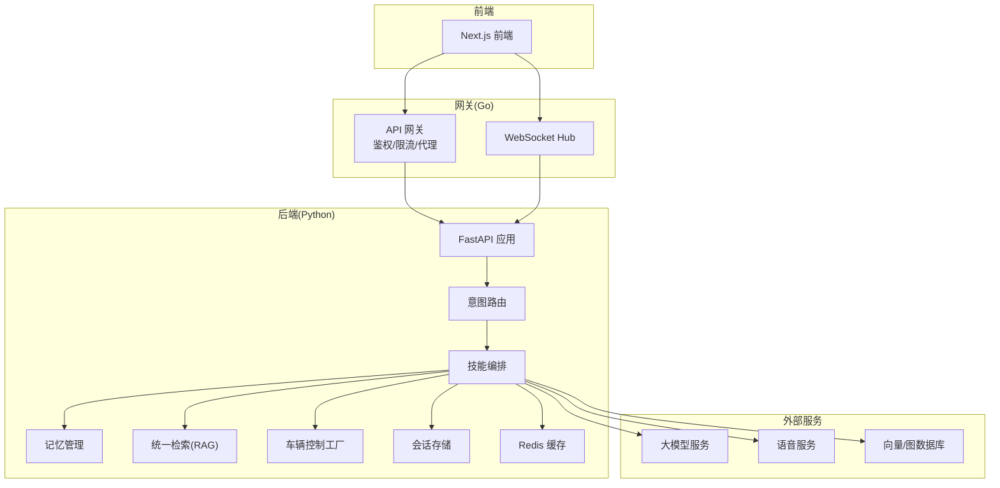
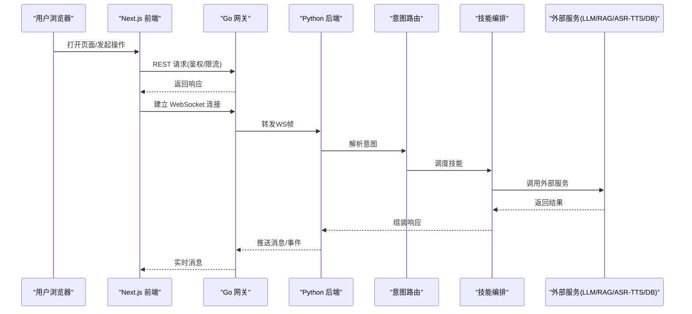
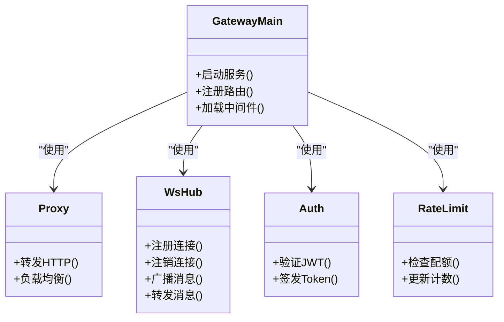
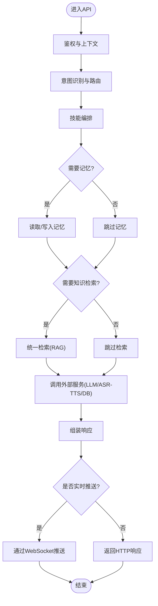
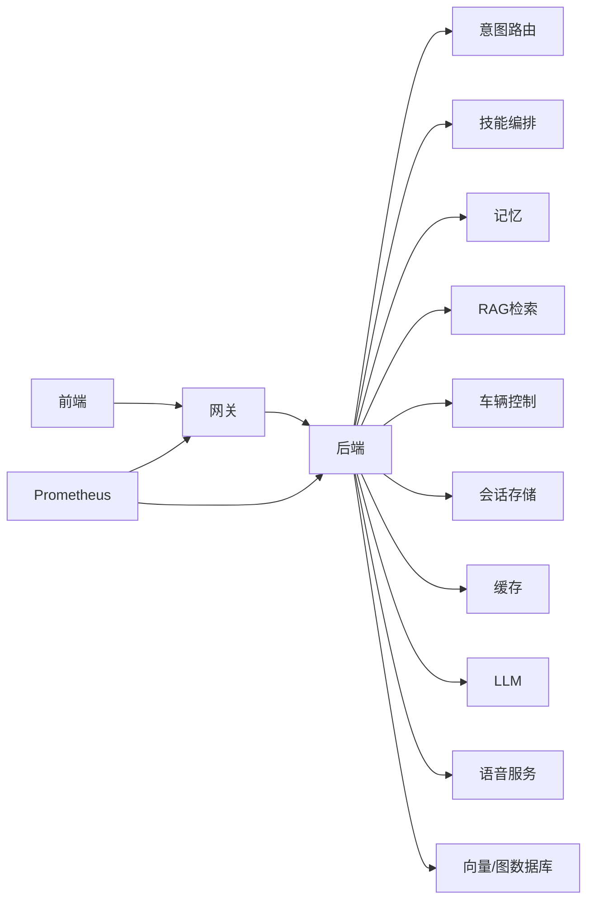

# 整体架构概览

<cite>
**本文引用的文件**   
- [docker-compose.yml](file://docker-compose.yml)
- [backend_design/nexus/main.py](file://backend_design/nexus/main.py)
- [backend_design/nexus/api/websocket.py](file://backend_design/nexus/api/websocket.py)
- [backend_design/nexus/core/cockpit_manager.py](file://backend_design/nexus/core/cockpit_manager.py)
- [backend_design/nexus/intent/router.py](file://backend_design/nexus/intent/router.py)
- [backend_design/nexus/skills/orchestrator.py](file://backend_design/nexus/skills/orchestrator.py)
- [backend_design/nexus/middleware/session_store.py](file://backend_design/nexus/middleware/session_store.py)
- [backend_design/nexus/middleware/redis_cache.py](file://backend_design/nexus/middleware/redis_cache.py)
- [backend_design/nexus/memory/manager.py](file://backend_design/nexus/memory/manager.py)
- [backend_design/nexus/rag/unified_retriever.py](file://backend_design/nexus/rag/unified_retriever.py)
- [backend_design/nexus/vehicle/factory.py](file://backend_design/nexus/vehicle/factory.py)
- [backend_design/nexus_gate/cmd/main.go](file://backend_design/nexus_gate/cmd/main.go)
- [backend_design/nexus_gate/internal/proxy/proxy.go](file://backend_design/nexus_gate/internal/proxy/proxy.go)
- [backend_design/nexus_gate/internal/ws/hub.go](file://backend_design/nexus_gate/internal/ws/hub.go)
- [backend_design/nexus_gate/internal/auth/jwt.go](file://backend_design/nexus_gate/internal/auth/jwt.go)
- [backend_design/nexus_gate/internal/ratelimit/ratelimit.go](file://backend_design/nexus_gate/internal/ratelimit/ratelimit.go)
- [frontend_design/src/lib/api.ts](file://frontend_design/src/lib/api.ts)
- [frontend_design/src/stores/chat-store.ts](file://frontend_design/src/stores/chat-store.ts)
- [config/prometheus/prometheus.yml](file://config/prometheus/prometheus.yml)
</cite>

## 目录
1. [简介](#简介)
2. [项目结构](#项目结构)
3. [核心组件](#核心组件)
4. [架构总览](#架构总览)
5. [详细组件分析](#详细组件分析)
6. [依赖关系分析](#依赖关系分析)
7. [性能考量](#性能考量)
8. [故障排查指南](#故障排查指南)
9. [结论](#结论)
10. [附录](#附录)

## 简介
本文件面向NexusCockpit系统的整体架构，聚焦分层设计、前后端分离与多语言混合架构（Python + Go）的权衡与协作。文档从表现层、业务服务层、数据层的职责划分出发，解释Web前端、API网关与Python后端服务的边界；并通过架构图与数据流图展示用户请求从前端到后端再到外部服务的完整链路。同时说明微服务间通信机制（RESTful API、WebSocket实时通信、gRPC内部通信），以及容器化部署与服务编排策略。

## 项目结构
仓库采用前后端分离与多语言混合架构：
- 前端：Next.js应用，提供对话、座舱、车辆控制等页面与交互能力。
- 网关：Go实现的API网关，承担鉴权、限流、反向代理与WebSocket转发。
- 后端：Python FastAPI服务，实现意图路由、技能编排、记忆与RAG检索、语音ASR/TTS、车辆控制等。
- 可观测性：Prometheus配置用于指标采集。
- 编排：docker-compose定义各服务启动与依赖关系。

图表来源
- [docker-compose.yml](file://docker-compose.yml)
- [backend_design/nexus_gate/cmd/main.go](file://backend_design/nexus_gate/cmd/main.go)
- [backend_design/nexus/main.py](file://backend_design/nexus/main.py)
- [frontend_design/src/lib/api.ts](file://frontend_design/src/lib/api.ts)

章节来源
- [docker-compose.yml](file://docker-compose.yml)
- [frontend_design/src/lib/api.ts](file://frontend_design/src/lib/api.ts)
- [backend_design/nexus/main.py](file://backend_design/nexus/main.py)
- [backend_design/nexus_gate/cmd/main.go](file://backend_design/nexus_gate/cmd/main.go)

## 核心组件
- 表现层（前端）
  - 负责UI渲染、用户交互、本地状态管理与WebSocket连接维护。
  - 通过REST调用网关获取数据，使用WebSocket进行实时消息推送。
- 网关层（Go）
  - 统一入口，提供鉴权、限流、静态资源与反向代理。
  - WebSocket Hub负责客户端长连接与消息广播/转发。
- 业务服务层（Python）
  - 意图识别与路由、技能编排、记忆与个性化、RAG检索、语音处理、车辆控制等。
  - 通过中间件接入会话存储与缓存，提升一致性与性能。
- 数据层与外部服务
  - 向量/图数据库、LLM服务、ASR/TTS服务等由编排或配置注入。

章节来源
- [frontend_design/src/lib/api.ts](file://frontend_design/src/lib/api.ts)
- [frontend_design/src/stores/chat-store.ts](file://frontend_design/src/stores/chat-store.ts)
- [backend_design/nexus_gate/cmd/main.go](file://backend_design/nexus_gate/cmd/main.go)
- [backend_design/nexus_gate/internal/ws/hub.go](file://backend_design/nexus_gate/internal/ws/hub.go)
- [backend_design/nexus/main.py](file://backend_design/nexus/main.py)
- [backend_design/nexus/intent/router.py](file://backend_design/nexus/intent/router.py)
- [backend_design/nexus/skills/orchestrator.py](file://backend_design/nexus/skills/orchestrator.py)
- [backend_design/nexus/memory/manager.py](file://backend_design/nexus/memory/manager.py)
- [backend_design/nexus/rag/unified_retriever.py](file://backend_design/nexus/rag/unified_retriever.py)
- [backend_design/nexus/vehicle/factory.py](file://backend_design/nexus/vehicle/factory.py)
- [backend_design/nexus/middleware/session_store.py](file://backend_design/nexus/middleware/session_store.py)
- [backend_design/nexus/middleware/redis_cache.py](file://backend_design/nexus/middleware/redis_cache.py)

## 架构总览
系统采用“前端—网关—后端”的分层模式，结合WebSocket实现实时交互；Go网关在高并发场景下具备低延迟与高吞吐优势，Python后端依托AI生态快速集成LLM、RAG、ASR/TTS等能力。

图表来源
- [frontend_design/src/lib/api.ts](file://frontend_design/src/lib/api.ts)
- [backend_design/nexus_gate/cmd/main.go](file://backend_design/nexus_gate/cmd/main.go)
- [backend_design/nexus_gate/internal/ws/hub.go](file://backend_design/nexus_gate/internal/ws/hub.go)
- [backend_design/nexus/main.py](file://backend_design/nexus/main.py)
- [backend_design/nexus/intent/router.py](file://backend_design/nexus/intent/router.py)
- [backend_design/nexus/skills/orchestrator.py](file://backend_design/nexus/skills/orchestrator.py)

## 详细组件分析

### 网关（Go）
- 职责边界
  - 统一入口、鉴权校验、速率限制、静态资源与反向代理。
  - WebSocket Hub负责连接管理、消息分发与心跳。
- 关键模块
  - 主程序入口：初始化路由、中间件与监听端口。
  - 反向代理：将HTTP请求转发至Python后端。
  - WebSocket Hub：维护连接集合，支持广播与点对点转发。
  - 鉴权与限流：基于JWT与令牌桶算法。

图表来源
- [backend_design/nexus_gate/cmd/main.go](file://backend_design/nexus_gate/cmd/main.go)
- [backend_design/nexus_gate/internal/proxy/proxy.go](file://backend_design/nexus_gate/internal/proxy/proxy.go)
- [backend_design/nexus_gate/internal/ws/hub.go](file://backend_design/nexus_gate/internal/ws/hub.go)
- [backend_design/nexus_gate/internal/auth/jwt.go](file://backend_design/nexus_gate/internal/auth/jwt.go)
- [backend_design/nexus_gate/internal/ratelimit/ratelimit.go](file://backend_design/nexus_gate/internal/ratelimit/ratelimit.go)

章节来源
- [backend_design/nexus_gate/cmd/main.go](file://backend_design/nexus_gate/cmd/main.go)
- [backend_design/nexus_gate/internal/proxy/proxy.go](file://backend_design/nexus_gate/internal/proxy/proxy.go)
- [backend_design/nexus_gate/internal/ws/hub.go](file://backend_design/nexus_gate/internal/ws/hub.go)
- [backend_design/nexus_gate/internal/auth/jwt.go](file://backend_design/nexus_gate/internal/auth/jwt.go)
- [backend_design/nexus_gate/internal/ratelimit/ratelimit.go](file://backend_design/nexus_gate/internal/ratelimit/ratelimit.go)

### Python后端（FastAPI）
- 职责边界
  - 暴露REST接口与WebSocket端点。
  - 意图识别与路由、技能编排、记忆与个性化、RAG检索、语音处理、车辆控制。
  - 通过中间件接入会话存储与缓存，保障一致性与性能。
- 关键流程（对话示例）
  - 接收请求→鉴权→意图路由→技能编排→记忆/RAG/外部服务→响应/推送。

图表来源
- [backend_design/nexus/main.py](file://backend_design/nexus/main.py)
- [backend_design/nexus/api/websocket.py](file://backend_design/nexus/api/websocket.py)
- [backend_design/nexus/intent/router.py](file://backend_design/nexus/intent/router.py)
- [backend_design/nexus/skills/orchestrator.py](file://backend_design/nexus/skills/orchestrator.py)
- [backend_design/nexus/memory/manager.py](file://backend_design/nexus/memory/manager.py)
- [backend_design/nexus/rag/unified_retriever.py](file://backend_design/nexus/rag/unified_retriever.py)
- [backend_design/nexus/vehicle/factory.py](file://backend_design/nexus/vehicle/factory.py)
- [backend_design/nexus/middleware/session_store.py](file://backend_design/nexus/middleware/session_store.py)
- [backend_design/nexus/middleware/redis_cache.py](file://backend_design/nexus/middleware/redis_cache.py)

章节来源
- [backend_design/nexus/main.py](file://backend_design/nexus/main.py)
- [backend_design/nexus/api/websocket.py](file://backend_design/nexus/api/websocket.py)
- [backend_design/nexus/intent/router.py](file://backend_design/nexus/intent/router.py)
- [backend_design/nexus/skills/orchestrator.py](file://backend_design/nexus/skills/orchestrator.py)
- [backend_design/nexus/memory/manager.py](file://backend_design/nexus/memory/manager.py)
- [backend_design/nexus/rag/unified_retriever.py](file://backend_design/nexus/rag/unified_retriever.py)
- [backend_design/nexus/vehicle/factory.py](file://backend_design/nexus/vehicle/factory.py)
- [backend_design/nexus/middleware/session_store.py](file://backend_design/nexus/middleware/session_store.py)
- [backend_design/nexus/middleware/redis_cache.py](file://backend_design/nexus/middleware/redis_cache.py)

### 前端（Next.js）
- 职责边界
  - 页面渲染、用户交互、本地状态管理。
  - 通过REST调用网关获取数据，使用WebSocket维持实时通道。
- 关键模块
  - API封装：统一请求拦截、错误处理与重试。
  - 聊天状态：集中管理会话、消息与连接状态。

章节来源
- [frontend_design/src/lib/api.ts](file://frontend_design/src/lib/api.ts)
- [frontend_design/src/stores/chat-store.ts](file://frontend_design/src/stores/chat-store.ts)

## 依赖关系分析
- 组件耦合
  - 前端仅依赖网关提供的REST与WebSocket接口，不直接访问后端。
  - 网关对后端为弱耦合，通过配置路由与代理规则解耦。
  - 后端内部通过模块化与工厂模式降低耦合（如车辆控制、RAG检索）。
- 外部依赖
  - 向量/图数据库、LLM服务、ASR/TTS服务通过配置注入，便于替换与扩展。
- 可观测性
  - Prometheus配置用于采集网关与后端指标，支撑监控与告警。

图表来源
- [docker-compose.yml](file://docker-compose.yml)
- [config/prometheus/prometheus.yml](file://config/prometheus/prometheus.yml)
- [backend_design/nexus/main.py](file://backend_design/nexus/main.py)
- [backend_design/nexus/intent/router.py](file://backend_design/nexus/intent/router.py)
- [backend_design/nexus/skills/orchestrator.py](file://backend_design/nexus/skills/orchestrator.py)
- [backend_design/nexus/memory/manager.py](file://backend_design/nexus/memory/manager.py)
- [backend_design/nexus/rag/unified_retriever.py](file://backend_design/nexus/rag/unified_retriever.py)
- [backend_design/nexus/vehicle/factory.py](file://backend_design/nexus/vehicle/factory.py)
- [backend_design/nexus/middleware/session_store.py](file://backend_design/nexus/middleware/session_store.py)
- [backend_design/nexus/middleware/redis_cache.py](file://backend_design/nexus/middleware/redis_cache.py)

章节来源
- [docker-compose.yml](file://docker-compose.yml)
- [config/prometheus/prometheus.yml](file://config/prometheus/prometheus.yml)

## 性能考量
- Go网关优势
  - 协程模型与零拷贝网络栈带来高并发与低延迟，适合做统一入口与实时转发。
- Python后端优势
  - AI生态丰富，便于集成LLM、RAG、ASR/TTS等复杂计算任务。
- 缓存与会话
  - Redis缓存热点数据，减少外部服务压力；会话存储保证跨请求一致性。
- 限流与熔断
  - 网关层限流保护后端；后端可通过熔断器避免级联失败（在相关模块中预留扩展点）。
- 可观测性
  - 通过Prometheus采集关键指标，定位瓶颈与异常。

[本节为通用指导，无需特定文件引用]

## 故障排查指南
- 常见问题定位
  - 鉴权失败：检查网关JWT校验逻辑与前端携带的Token。
  - 限流触发：查看网关限流统计与阈值配置。
  - WebSocket断连：确认Hub连接数、心跳与重连策略。
  - 后端超时：观察意图路由与技能编排耗时，必要时增加缓存或降级策略。
- 日志与指标
  - 启用结构化日志与Trace ID，关联网关与后端日志。
  - 关注Prometheus中的QPS、延迟、错误率与资源使用率。

章节来源
- [backend_design/nexus_gate/internal/auth/jwt.go](file://backend_design/nexus_gate/internal/auth/jwt.go)
- [backend_design/nexus_gate/internal/ratelimit/ratelimit.go](file://backend_design/nexus_gate/internal/ratelimit/ratelimit.go)
- [backend_design/nexus_gate/internal/ws/hub.go](file://backend_design/nexus_gate/internal/ws/hub.go)
- [backend_design/nexus/main.py](file://backend_design/nexus/main.py)
- [config/prometheus/prometheus.yml](file://config/prometheus/prometheus.yml)

## 结论
NexusCockpit采用清晰的分层与前后端分离架构，Go网关提供高性能的统一入口与实时通道，Python后端发挥AI生态优势完成复杂业务处理。通过中间件、记忆与RAG增强智能体验，配合容器化编排与可观测性体系，形成可扩展、可运维的整体解决方案。

[本节为总结性内容，无需特定文件引用]

## 附录
- 容器化与编排
  - docker-compose定义前端、网关、后端及依赖服务的启动顺序、端口映射与网络拓扑。
  - 建议在生产环境引入Kubernetes进行弹性伸缩与健康检查。
- 通信协议
  - RESTful API：用于常规数据交互。
  - WebSocket：用于实时消息与事件推送。
  - gRPC：可在内部服务间引入，提高序列化与传输效率（当前仓库以REST/WS为主，可按需扩展）。

章节来源
- [docker-compose.yml](file://docker-compose.yml)