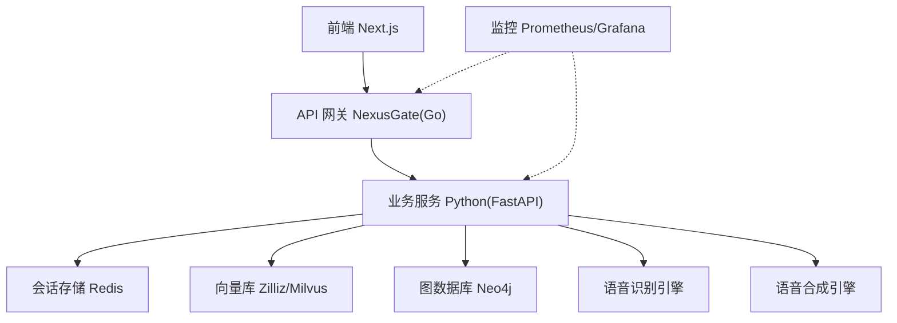
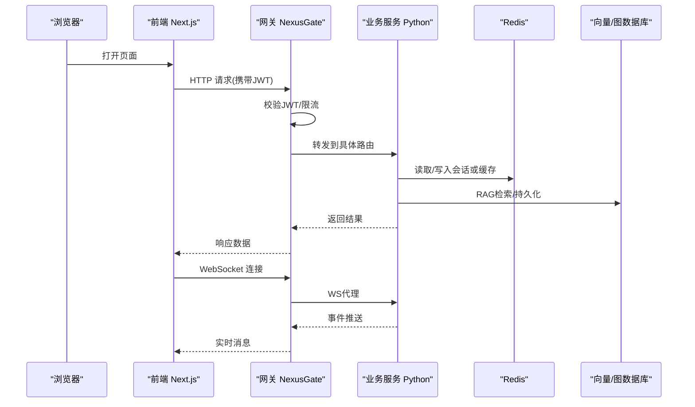
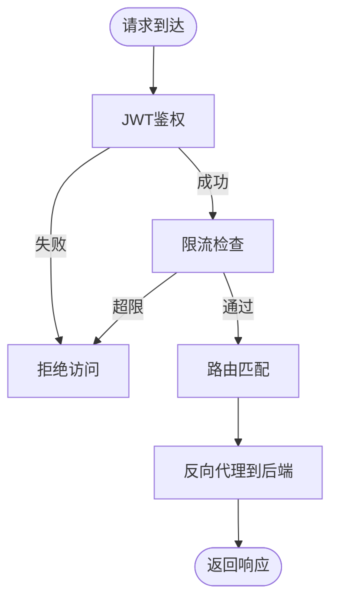
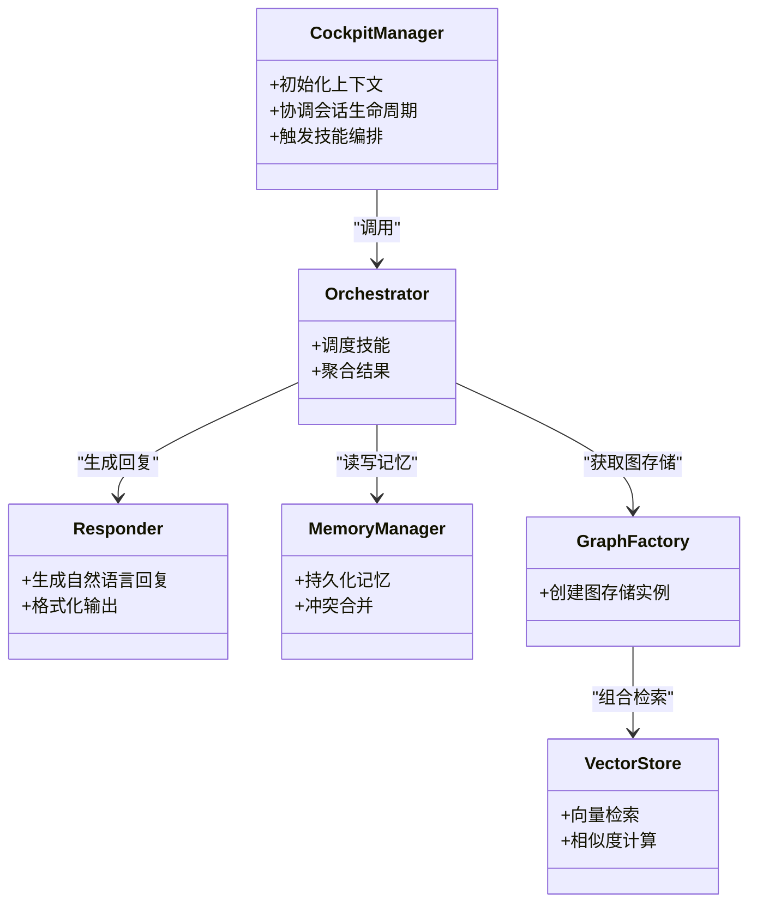
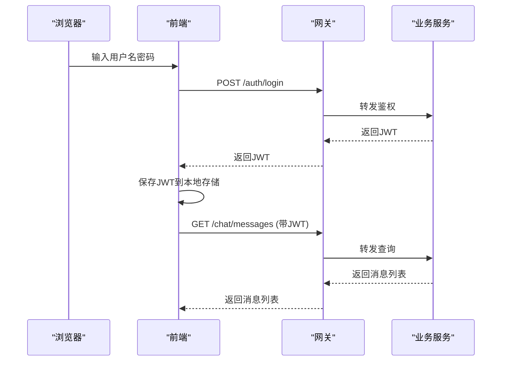
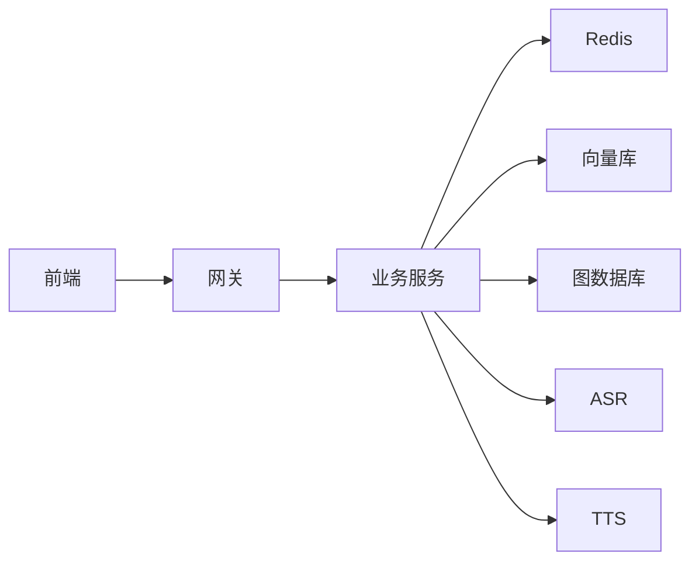
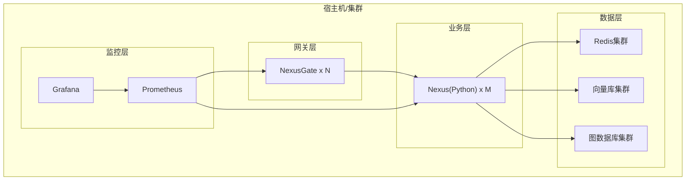

# 架构设计

<cite>
**本文引用的文件**   
- [docker-compose.yml](file://docker-compose.yml)
- [backend_design/nexus/main.py](file://backend_design/nexus/main.py)
- [backend_design/nexus/config.py](file://backend_design/nexus/config.py)
- [backend_design/nexus/core/cockpit_manager.py](file://backend_design/nexus/core/cockpit_manager.py)
- [backend_design/nexus/api/routes/chat.py](file://backend_design/nexus/api/routes/chat.py)
- [backend_design/nexus/api/websocket.py](file://backend_design/nexus/api/websocket.py)
- [backend_design/nexus/middleware/session_store.py](file://backend_design/nexus/middleware/session_store.py)
- [backend_design/nexus/middleware/redis_cache.py](file://backend_design/nexus/middleware/redis_cache.py)
- [backend_design/nexus/memory/manager.py](file://backend_design/nexus/memory/manager.py)
- [backend_design/nexus/rag/graph_factory.py](file://backend_design/nexus/rag/graph_factory.py)
- [backend_design/nexus/rag/vector_store.py](file://backend_design/nexus/rag/vector_store.py)
- [backend_design/nexus/skills/orchestrator.py](file://backend_design/nexus/skills/orchestrator.py)
- [backend_design/nexus/agent/responder.py](file://backend_design/nexus/agent/responder.py)
- [backend_design/nexus_gate/cmd/main.go](file://backend_design/nexus_gate/cmd/main.go)
- [backend_design/nexus_gate/internal/router/router.go](file://backend_design/nexus_gate/internal/router/router.go)
- [backend_design/nexus_gate/internal/proxy/proxy.go](file://backend_design/nexus_gate/internal/proxy/proxy.go)
- [backend_design/nexus_gate/internal/auth/jwt.go](file://backend_design/nexus_gate/internal/auth/jwt.go)
- [backend_design/nexus_gate/internal/ws/hub.go](file://backend_design/nexus_gate/internal/ws/hub.go)
- [frontend_design/src/lib/api.ts](file://frontend_design/src/lib/api.ts)
- [frontend_design/src/stores/auth-store.ts](file://frontend_design/src/stores/auth-store.ts)
- [config/prometheus/prometheus.yml](file://config/prometheus/prometheus.yml)
- [config/grafana/provisioning/dashboards/nexuscockpit-overview.json](file://config/grafana/provisioning/dashboards/nexuscockpit-overview.json)
</cite>

## 目录
1. [引言](#引言)
2. [项目结构](#项目结构)
3. [核心组件](#核心组件)
4. [架构总览](#架构总览)
5. [详细组件分析](#详细组件分析)
6. [依赖关系分析](#依赖关系分析)
7. [性能与高可用](#性能与高可用)
8. [部署与编排](#部署与编排)
9. [故障排查指南](#故障排查指南)
10. [结论](#结论)
11. [附录](#附录)

## 引言
本架构设计文档面向NexusCockpit系统，目标是清晰阐述微服务整体设计、前后端分离技术选型与通信机制、Python+Go多语言混合架构的集成方案、容器化与编排策略、系统边界与关键数据流，以及高可用、可扩展性与性能优化的决策。文档同时提供基础设施要求与部署拓扑图，帮助读者快速理解并落地该系统。

## 项目结构
仓库采用前后端分离与多语言微服务组织方式：
- 前端：Next.js应用，负责用户界面、状态管理与API调用。
- 后端业务服务（Python）：基于FastAPI的Nexus服务，承载对话、技能编排、记忆、RAG检索、ASR/TTS等能力。
- API网关（Go）：NexusGate，承担路由转发、鉴权、限流、WebSocket代理与Redis缓存访问。
- 可观测性：Prometheus与Grafana配置用于指标采集与可视化。
- 容器编排：docker-compose统一编排各服务。

**图表来源** 
- [docker-compose.yml](file://docker-compose.yml)
- [backend_design/nexus/main.py](file://backend_design/nexus/main.py)
- [backend_design/nexus_gate/cmd/main.go](file://backend_design/nexus_gate/cmd/main.go)

**章节来源**
- [docker-compose.yml](file://docker-compose.yml)
- [backend_design/nexus/main.py](file://backend_design/nexus/main.py)
- [backend_design/nexus_gate/cmd/main.go](file://backend_design/nexus_gate/cmd/main.go)

## 核心组件
- API网关（NexusGate）
  - 职责：统一入口、路由分发、JWT鉴权、限流、WebSocket代理、Redis缓存读写。
  - 关键实现：路由注册、反向代理、认证中间件、WS Hub。
- 业务服务（Nexus Python）
  - 职责：HTTP/WebSocket接口、对话流程编排、意图路由、技能执行、记忆管理、RAG检索、ASR/TTS集成、可观测性埋点。
  - 关键实现：主应用启动、会话与上下文、技能编排器、响应器、记忆管理器、RAG工厂与向量/图存储抽象。
- 前端（Next.js）
  - 职责：页面渲染、状态管理、REST与WebSocket通信、语音录制与播放。
  - 关键实现：API客户端封装、认证状态持久化、实时消息处理。
- 可观测性
  - 职责：指标采集、仪表盘展示。
  - 关键实现：Prometheus抓取配置、Grafana仪表盘定义。

**章节来源**
- [backend_design/nexus_gate/cmd/main.go](file://backend_design/nexus_gate/cmd/main.go)
- [backend_design/nexus_gate/internal/router/router.go](file://backend_design/nexus_gate/internal/router/router.go)
- [backend_design/nexus_gate/internal/proxy/proxy.go](file://backend_design/nexus_gate/internal/proxy/proxy.go)
- [backend_design/nexus_gate/internal/auth/jwt.go](file://backend_design/nexus_gate/internal/auth/jwt.go)
- [backend_design/nexus_gate/internal/ws/hub.go](file://backend_design/nexus_gate/internal/ws/hub.go)
- [backend_design/nexus/main.py](file://backend_design/nexus/main.py)
- [backend_design/nexus/core/cockpit_manager.py](file://backend_design/nexus/core/cockpit_manager.py)
- [backend_design/nexus/api/routes/chat.py](file://backend_design/nexus/api/routes/chat.py)
- [backend_design/nexus/api/websocket.py](file://backend_design/nexus/api/websocket.py)
- [backend_design/nexus/middleware/session_store.py](file://backend_design/nexus/middleware/session_store.py)
- [backend_design/nexus/middleware/redis_cache.py](file://backend_design/nexus/middleware/redis_cache.py)
- [backend_design/nexus/memory/manager.py](file://backend_design/nexus/memory/manager.py)
- [backend_design/nexus/rag/graph_factory.py](file://backend_design/nexus/rag/graph_factory.py)
- [backend_design/nexus/rag/vector_store.py](file://backend_design/nexus/rag/vector_store.py)
- [backend_design/nexus/skills/orchestrator.py](file://backend_design/nexus/skills/orchestrator.py)
- [backend_design/nexus/agent/responder.py](file://backend_design/nexus/agent/responder.py)
- [frontend_design/src/lib/api.ts](file://frontend_design/src/lib/api.ts)
- [frontend_design/src/stores/auth-store.ts](file://frontend_design/src/stores/auth-store.ts)
- [config/prometheus/prometheus.yml](file://config/prometheus/prometheus.yml)
- [config/grafana/provisioning/dashboards/nexuscockpit-overview.json](file://config/grafana/provisioning/dashboards/nexuscockpit-overview.json)

## 架构总览
系统采用“前端 + API网关 + 业务服务 + 外部数据/模型”的分层架构。网关作为唯一对外暴露面，屏蔽内部服务细节；业务服务按领域划分模块，通过中间件与外部存储交互；前端通过REST与WebSocket与网关通信。

**图表来源**
- [backend_design/nexus_gate/cmd/main.go](file://backend_design/nexus_gate/cmd/main.go)
- [backend_design/nexus_gate/internal/auth/jwt.go](file://backend_design/nexus_gate/internal/auth/jwt.go)
- [backend_design/nexus_gate/internal/proxy/proxy.go](file://backend_design/nexus_gate/internal/proxy/proxy.go)
- [backend_design/nexus/api/websocket.py](file://backend_design/nexus/api/websocket.py)
- [backend_design/nexus/middleware/redis_cache.py](file://backend_design/nexus/middleware/redis_cache.py)
- [backend_design/nexus/rag/vector_store.py](file://backend_design/nexus/rag/vector_store.py)
- [backend_design/nexus/rag/graph_factory.py](file://backend_design/nexus/rag/graph_factory.py)

## 详细组件分析

### API网关（NexusGate）
- 角色与职责
  - 统一入口与路由分发
  - JWT鉴权与权限控制
  - 限流与熔断保护
  - WebSocket代理与会话桥接
  - 与Redis交互进行缓存与速率限制
- 关键流程
  - 请求进入后先进行鉴权与限流判断，再根据路径转发至后端服务
  - WebSocket连接建立后，将客户端通道与后端WS Hub桥接，实现双向消息转发

**图表来源**
- [backend_design/nexus_gate/internal/auth/jwt.go](file://backend_design/nexus_gate/internal/auth/jwt.go)
- [backend_design/nexus_gate/internal/router/router.go](file://backend_design/nexus_gate/internal/router/router.go)
- [backend_design/nexus_gate/internal/proxy/proxy.go](file://backend_design/nexus_gate/internal/proxy/proxy.go)

**章节来源**
- [backend_design/nexus_gate/cmd/main.go](file://backend_design/nexus_gate/cmd/main.go)
- [backend_design/nexus_gate/internal/router/router.go](file://backend_design/nexus_gate/internal/router/router.go)
- [backend_design/nexus_gate/internal/proxy/proxy.go](file://backend_design/nexus_gate/internal/proxy/proxy.go)
- [backend_design/nexus_gate/internal/auth/jwt.go](file://backend_design/nexus_gate/internal/auth/jwt.go)
- [backend_design/nexus_gate/internal/ws/hub.go](file://backend_design/nexus_gate/internal/ws/hub.go)

### 业务服务（Python FastAPI）
- 角色与职责
  - 提供REST与WebSocket接口
  - 对话流程编排、意图路由、技能执行
  - 记忆管理、个性化设置
  - RAG检索（向量与图）、ASR/TTS集成
  - 可观测性指标上报
- 关键流程
  - 接收网关转发的请求，解析上下文与会话信息
  - 调用技能编排器与响应器生成回复
  - 通过记忆管理器更新长期记忆
  - 使用RAG工厂选择向量/图存储进行检索增强
  - 将结果返回给网关或直接通过WebSocket推送

**图表来源**
- [backend_design/nexus/core/cockpit_manager.py](file://backend_design/nexus/core/cockpit_manager.py)
- [backend_design/nexus/skills/orchestrator.py](file://backend_design/nexus/skills/orchestrator.py)
- [backend_design/nexus/agent/responder.py](file://backend_design/nexus/agent/responder.py)
- [backend_design/nexus/memory/manager.py](file://backend_design/nexus/memory/manager.py)
- [backend_design/nexus/rag/graph_factory.py](file://backend_design/nexus/rag/graph_factory.py)
- [backend_design/nexus/rag/vector_store.py](file://backend_design/nexus/rag/vector_store.py)

**章节来源**
- [backend_design/nexus/main.py](file://backend_design/nexus/main.py)
- [backend_design/nexus/config.py](file://backend_design/nexus/config.py)
- [backend_design/nexus/core/cockpit_manager.py](file://backend_design/nexus/core/cockpit_manager.py)
- [backend_design/nexus/api/routes/chat.py](file://backend_design/nexus/api/routes/chat.py)
- [backend_design/nexus/api/websocket.py](file://backend_design/nexus/api/websocket.py)
- [backend_design/nexus/middleware/session_store.py](file://backend_design/nexus/middleware/session_store.py)
- [backend_design/nexus/middleware/redis_cache.py](file://backend_design/nexus/middleware/redis_cache.py)
- [backend_design/nexus/memory/manager.py](file://backend_design/nexus/memory/manager.py)
- [backend_design/nexus/rag/graph_factory.py](file://backend_design/nexus/rag/graph_factory.py)
- [backend_design/nexus/rag/vector_store.py](file://backend_design/nexus/rag/vector_store.py)
- [backend_design/nexus/skills/orchestrator.py](file://backend_design/nexus/skills/orchestrator.py)
- [backend_design/nexus/agent/responder.py](file://backend_design/nexus/agent/responder.py)

### 前端（Next.js）
- 角色与职责
  - 页面渲染与路由
  - 状态管理（认证、聊天会话）
  - REST与WebSocket通信
  - 语音录制与播放
- 关键流程
  - 登录成功后保存JWT到本地存储
  - 发起API请求时自动附加认证头
  - 建立WebSocket连接以接收实时消息

**图表来源**
- [frontend_design/src/lib/api.ts](file://frontend_design/src/lib/api.ts)
- [frontend_design/src/stores/auth-store.ts](file://frontend_design/src/stores/auth-store.ts)
- [backend_design/nexus_gate/internal/auth/jwt.go](file://backend_design/nexus_gate/internal/auth/jwt.go)
- [backend_design/nexus/api/routes/chat.py](file://backend_design/nexus/api/routes/chat.py)

**章节来源**
- [frontend_design/src/lib/api.ts](file://frontend_design/src/lib/api.ts)
- [frontend_design/src/stores/auth-store.ts](file://frontend_design/src/stores/auth-store.ts)

### 可观测性
- 指标采集与可视化
  - Prometheus抓取后端与网关指标
  - Grafana仪表盘展示系统概览与关键KPI
- 关键配置
  - 抓取目标与间隔
  - 仪表盘JSON定义

**章节来源**
- [config/prometheus/prometheus.yml](file://config/prometheus/prometheus.yml)
- [config/grafana/provisioning/dashboards/nexuscockpit-overview.json](file://config/grafana/provisioning/dashboards/nexuscockpit-overview.json)

## 依赖关系分析
- 组件耦合
  - 网关与业务服务松耦合，通过HTTP/WebSocket协议交互
  - 业务服务对Redis、向量/图数据库存在直接依赖
  - 前端仅依赖网关提供的稳定接口
- 外部依赖
  - Redis：会话与缓存
  - 向量库：语义检索
  - 图数据库：知识图谱关联推理
  - ASR/TTS：语音能力

**图表来源**
- [docker-compose.yml](file://docker-compose.yml)
- [backend_design/nexus/middleware/redis_cache.py](file://backend_design/nexus/middleware/redis_cache.py)
- [backend_design/nexus/rag/vector_store.py](file://backend_design/nexus/rag/vector_store.py)
- [backend_design/nexus/rag/graph_factory.py](file://backend_design/nexus/rag/graph_factory.py)

**章节来源**
- [docker-compose.yml](file://docker-compose.yml)
- [backend_design/nexus/middleware/redis_cache.py](file://backend_design/nexus/middleware/redis_cache.py)
- [backend_design/nexus/rag/vector_store.py](file://backend_design/nexus/rag/vector_store.py)
- [backend_design/nexus/rag/graph_factory.py](file://backend_design/nexus/rag/graph_factory.py)

## 性能与高可用
- 性能优化
  - 网关侧限流与缓存命中减少后端压力
  - 会话与热点数据落Redis，降低数据库负载
  - RAG检索采用向量与图双路召回，提升准确率与速度
  - WebSocket长连接减少轮询开销
- 高可用设计
  - 网关无状态，支持水平扩展
  - 业务服务无状态化，结合会话外置存储实现多副本
  - 外部依赖（Redis、向量/图数据库）建议集群部署
- 可扩展性
  - 技能与专家模块化，便于新增领域能力
  - RAG存储抽象化，支持替换不同厂商实现
  - 前端与后端解耦，独立迭代与发布

[本节为通用指导，不直接分析具体文件]

## 部署与编排
- 容器化
  - 每个服务提供Dockerfile，镜像构建与运行隔离
  - 环境变量注入配置（如数据库地址、密钥）
- 编排
  - docker-compose定义服务网络、端口映射、依赖顺序
  - 推荐在生产环境迁移到Kubernetes，利用Deployment、Service、Ingress与ConfigMap/Secret管理
- 基础设施要求
  - 操作系统：Linux发行版
  - 运行时：Docker与Compose（或K8s）
  - 中间件：Redis、向量库、图数据库
  - 监控：Prometheus、Grafana
  - 资源：根据并发与模型规模评估CPU/内存/磁盘

**图表来源**
- [docker-compose.yml](file://docker-compose.yml)
- [config/prometheus/prometheus.yml](file://config/prometheus/prometheus.yml)
- [config/grafana/provisioning/dashboards/nexuscockpit-overview.json](file://config/grafana/provisioning/dashboards/nexuscockpit-overview.json)

**章节来源**
- [docker-compose.yml](file://docker-compose.yml)
- [config/prometheus/prometheus.yml](file://config/prometheus/prometheus.yml)
- [config/grafana/provisioning/dashboards/nexuscockpit-overview.json](file://config/grafana/provisioning/dashboards/nexuscockpit-overview.json)

## 故障排查指南
- 常见问题定位
  - 鉴权失败：检查JWT签名与过期时间、网关与后端时钟同步
  - 限流触发：查看网关限流统计与Redis计数器
  - WebSocket断连：确认网关WS Hub与后端WS通道健康
  - 检索延迟：观察向量/图数据库连接池与索引状态
  - 会话丢失：验证Redis持久化与备份策略
- 日志与指标
  - 启用结构化日志与链路追踪
  - 关注P95/P99延迟、错误率、吞吐与资源使用率
  - 在Grafana中配置告警规则

**章节来源**
- [backend_design/nexus_gate/internal/auth/jwt.go](file://backend_design/nexus_gate/internal/auth/jwt.go)
- [backend_design/nexus_gate/internal/ws/hub.go](file://backend_design/nexus_gate/internal/ws/hub.go)
- [backend_design/nexus/middleware/redis_cache.py](file://backend_design/nexus/middleware/redis_cache.py)
- [backend_design/nexus/rag/vector_store.py](file://backend_design/nexus/rag/vector_store.py)
- [backend_design/nexus/rag/graph_factory.py](file://backend_design/nexus/rag/graph_factory.py)
- [config/prometheus/prometheus.yml](file://config/prometheus/prometheus.yml)
- [config/grafana/provisioning/dashboards/nexuscockpit-overview.json](file://config/grafana/provisioning/dashboards/nexuscockpit-overview.json)

## 结论
NexusCockpit通过“前端 + Go网关 + Python业务 + 外部数据/模型”的微服务架构，实现了清晰的职责划分与良好的可扩展性。网关提供统一的鉴权、限流与代理能力，业务服务聚焦对话与技能编排，配合RAG与记忆系统形成智能体验。容器化与编排简化了部署运维，可观测性体系保障稳定性与可维护性。建议在规模化场景下引入Kubernetes与更完善的弹性伸缩策略，进一步提升高可用与性能表现。

[本节为总结性内容，不直接分析具体文件]

## 附录
- 术语
  - RAG：检索增强生成
  - ASR/TTS：自动语音识别/文本转语音
  - JWT：JSON Web Token
- 参考
  - 配置文件与脚本位于仓库根目录与子目录中，可按需查阅

[本节为补充说明，不直接分析具体文件]