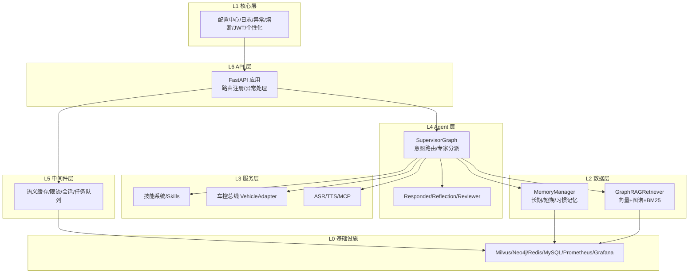
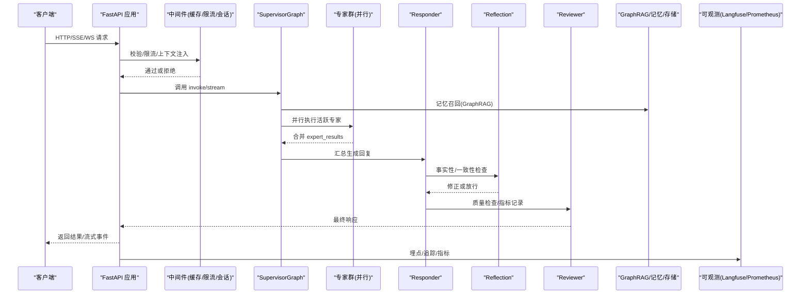
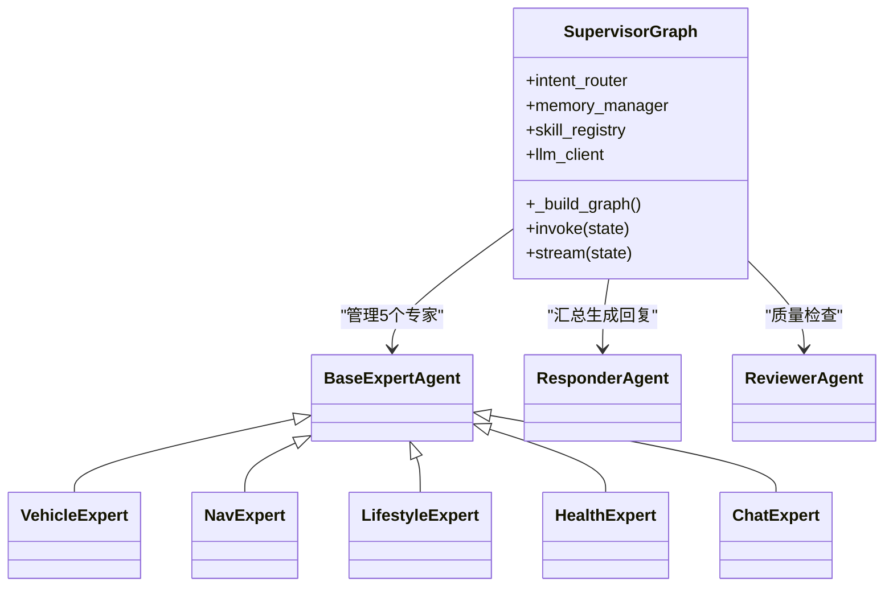
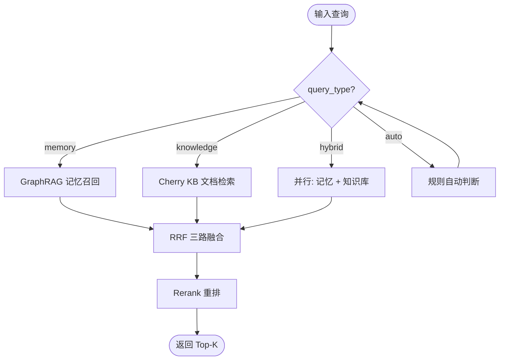
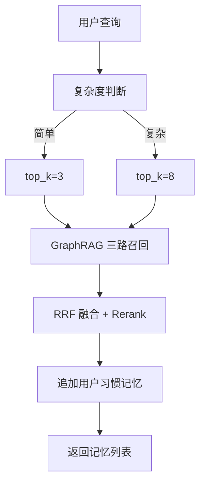
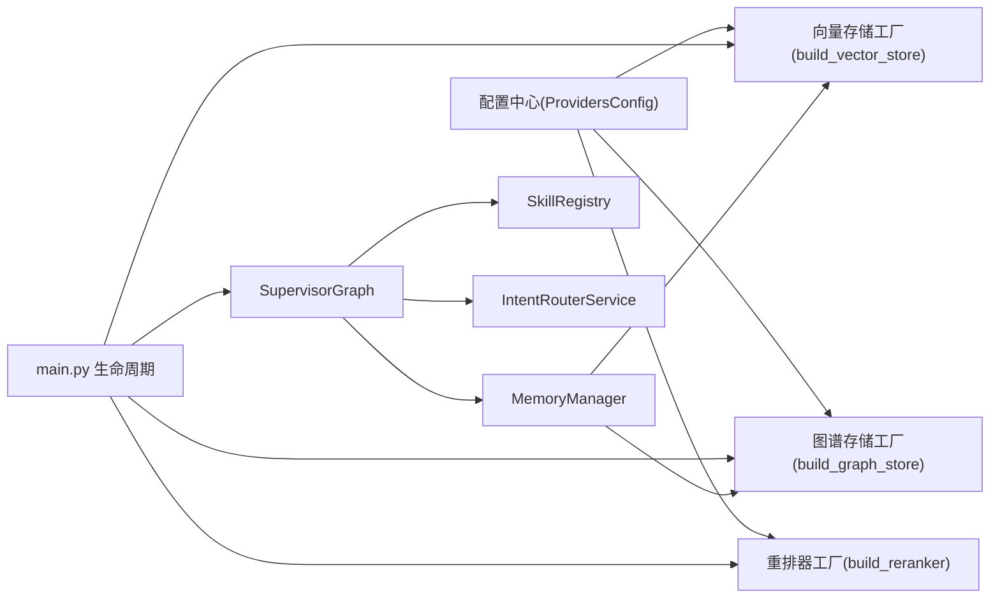

# 架构设计

<cite>
**本文引用的文件**   
- [backend_design/nexus/main.py](file://backend_design/nexus/main.py)
- [backend_design/nexus/config.py](file://backend_design/nexus/config.py)
- [backend_design/nexus/agent/supervisor_graph.py](file://backend_design/nexus/agent/supervisor_graph.py)
- [backend_design/nexus/rag/retriever.py](file://backend_design/nexus/rag/retriever.py)
- [backend_design/nexus/rag/unified_retriever.py](file://backend_design/nexus/rag/unified_retriever.py)
- [backend_design/nexus/memory/manager.py](file://backend_design/nexus/memory/manager.py)
- [docs/architecture/README.md](file://docs/architecture/README.md)
- [docs/architecture/L0-infrastructure.md](file://docs/architecture/L0-infrastructure.md)
- [docs/architecture/L1-core.md](file://docs/architecture/L1-core.md)
- [docs/architecture/L2-data.md](file://docs/architecture/L2-data.md)
- [docs/architecture/L3-service.md](file://docs/architecture/L3-service.md)
- [docs/architecture/L4-agent.md](file://docs/architecture/L4-agent.md)
- [docs/architecture/L5-middleware.md](file://docs/architecture/L5-middleware.md)
- [docs/architecture/L6-api.md](file://docs/architecture/L6-api.md)
- [docs/architecture/L7-observability.md](file://docs/architecture/L7-observability.md)
</cite>

## 目录
1. [引言](#引言)
2. [项目结构](#项目结构)
3. [核心组件](#核心组件)
4. [架构总览](#架构总览)
5. [详细组件分析](#详细组件分析)
6. [依赖关系分析](#依赖关系分析)
7. [性能与可扩展性](#性能与可扩展性)
8. [故障恢复与降级策略](#故障恢复与降级策略)
9. [结论](#结论)
10. [附录：部署与双模式切换](#附录部署与双模式切换)

## 引言
本架构设计文档面向 NexusCockpit 的 7 层分层架构（L0-L7），系统阐述各层职责、边界与交互，重点覆盖以下主题：
- 多智能体工作流：Supervisor + 5 Expert Agents 的编排与执行路径
- GraphRAG 三路融合检索：向量 + 图谱 + BM25 的 RRF 融合与 Rerank 重排
- 双模式部署：本地 Docker 与云端托管服务的可插拔切换
- 系统边界、组件交互、数据流向、技术选型与权衡
- 可扩展性与故障恢复策略

## 项目结构
NexusCockpit 采用“按功能域分层”的组织方式，后端以 FastAPI 为入口，Agent 层基于 LangGraph 构建多智能体工作流，数据层提供 GraphRAG 检索与记忆管理，中间件层提供缓存、限流与会话存储，可观测层集成 Langfuse、Prometheus、Grafana、Loki。

图表来源
- [docs/architecture/README.md:23-36](file://docs/architecture/README.md#L23-L36)
- [docs/architecture/L6-api.md:74-94](file://docs/architecture/L6-api.md#L74-L94)
- [docs/architecture/L4-agent.md:81-117](file://docs/architecture/L4-agent.md#L81-L117)
- [docs/architecture/L2-data.md:90-166](file://docs/architecture/L2-data.md#L90-L166)
- [docs/architecture/L5-middleware.md:1-172](file://docs/architecture/L5-middleware.md#L1-L172)
- [docs/architecture/L1-core.md:1-131](file://docs/architecture/L1-core.md#L1-L131)
- [docs/architecture/L0-infrastructure.md:1-75](file://docs/architecture/L0-infrastructure.md#L1-L75)

章节来源
- [docs/architecture/README.md:23-36](file://docs/architecture/README.md#L23-L36)
- [docs/architecture/L6-api.md:74-94](file://docs/architecture/L6-api.md#L74-L94)

## 核心组件
- 配置中心：集中管理 LLM、向量库、图谱、缓存、数据库、车控、ASR/TTS、可观测性等配置，支持本地/云端 Provider 切换。
- 应用启动器：统一初始化 Embedding、向量/图谱存储、车控适配器、语义缓存、限流、会话、Langfuse、Agent 工作流、数据库、座舱管理器、数据保留策略等。
- 多智能体编排：Supervisor 负责记忆召回、意图路由、澄清判断与专家分派；5 个专家并行执行；Responder 汇总生成回复；Reflection 做事实性/一致性检查；Reviewer 质量把关与指标统计。
- GraphRAG 检索：三路召回（向量/图谱/BM25）→ RRF 融合 → Rerank 重排；统一检索路由支持 memory/knowledge/hybrid/auto。
- 中间件：Redis 语义缓存（KNN）、Lua 原子化限流、会话持久化、进程内异步任务。
- API 网关：REST/SSE/WebSocket、JWT 认证、全局异常处理、跨域与时序头注入。
- 可观测：Langfuse 追踪、Prometheus 指标、Grafana 面板、结构化日志。

章节来源
- [backend_design/nexus/config.py:458-489](file://backend_design/nexus/config.py#L458-L489)
- [backend_design/nexus/main.py:61-291](file://backend_design/nexus/main.py#L61-L291)
- [backend_design/nexus/agent/supervisor_graph.py:69-173](file://backend_design/nexus/agent/supervisor_graph.py#L69-L173)
- [backend_design/nexus/rag/retriever.py:38-84](file://backend_design/nexus/rag/retriever.py#L38-L84)
- [backend_design/nexus/rag/unified_retriever.py:33-92](file://backend_design/nexus/rag/unified_retriever.py#L33-L92)
- [docs/architecture/L5-middleware.md:13-58](file://docs/architecture/L5-middleware.md#L13-L58)
- [docs/architecture/L6-api.md:74-94](file://docs/architecture/L6-api.md#L74-L94)
- [docs/architecture/L7-observability.md:1-55](file://docs/architecture/L7-observability.md#L1-L55)

## 架构总览
下图展示从请求进入 API 层到最终返回的全链路交互，包括中间件、Agent、数据层与可观测层的协作。

图表来源
- [backend_design/nexus/main.py:318-343](file://backend_design/nexus/main.py#L318-L343)
- [backend_design/nexus/agent/supervisor_graph.py:127-173](file://backend_design/nexus/agent/supervisor_graph.py#L127-L173)
- [backend_design/nexus/rag/retriever.py:141-178](file://backend_design/nexus/rag/retriever.py#L141-L178)
- [docs/architecture/L7-observability.md:13-55](file://docs/architecture/L7-observability.md#L13-L55)

## 详细组件分析

### 多智能体系统（Supervisor + 5 Expert Agents）
- Supervisor 节点：记忆召回（GraphRAG）、用户画像加载、意图路由、澄清判断、专家分派决策。
- 专家并行：vehicle/nav/lifestyle/health/chat 五类专家，通过 asyncio.gather 并行执行，expert_results 自动累加。
- Responder：根据分支（澄清/工具合成/搜索专用提示/闲聊兜底）生成自然语言回复。
- Reflection：对工具/搜索结果进行事实性/一致性/无幻觉检查，必要时修正回复。
- Reviewer：质量检查、记忆存储、延迟统计。

图表来源
- [backend_design/nexus/agent/supervisor_graph.py:69-173](file://backend_design/nexus/agent/supervisor_graph.py#L69-L173)
- [docs/architecture/L4-agent.md:119-166](file://docs/architecture/L4-agent.md#L119-L166)

章节来源
- [backend_design/nexus/agent/supervisor_graph.py:175-400](file://backend_design/nexus/agent/supervisor_graph.py#L175-L400)
- [docs/architecture/L4-agent.md:81-117](file://docs/architecture/L4-agent.md#L81-L117)

### GraphRAG 三路融合检索
- 三路召回：向量路（Milvus）、图谱路（Neo4j）、BM25路（全文关键词）。
- 融合排序：RRF（Reciprocal Rank Fusion）将三路分数聚合。
- 后处理：Rerank 模型重排 Top-N，提升相关性。
- 统一检索路由：根据 query_type 分发至 memory/knowledge/hybrid/auto。

图表来源
- [backend_design/nexus/rag/retriever.py:141-178](file://backend_design/nexus/rag/retriever.py#L141-L178)
- [backend_design/nexus/rag/unified_retriever.py:63-155](file://backend_design/nexus/rag/unified_retriever.py#L63-L155)

章节来源
- [backend_design/nexus/rag/retriever.py:38-84](file://backend_design/nexus/rag/retriever.py#L38-L84)
- [docs/architecture/L2-data.md:90-166](file://docs/architecture/L2-data.md#L90-L166)

### 记忆系统与渐进式披露
- 三层记忆：短期（Redis 会话历史）、长期（Milvus 向量 + Neo4j 图谱）、习惯（MySQL user_habits）。
- 渐进式披露：简单指令减少召回数量以降低延迟，复杂查询增加深度以提升相关性。
- 非阻塞存储：在 Reviewer 中通过 asyncio.create_task 异步写入，避免阻塞主流程。

图表来源
- [backend_design/nexus/memory/manager.py:95-173](file://backend_design/nexus/memory/manager.py#L95-L173)
- [backend_design/nexus/memory/manager.py:309-360](file://backend_design/nexus/memory/manager.py#L309-L360)

章节来源
- [backend_design/nexus/memory/manager.py:41-94](file://backend_design/nexus/memory/manager.py#L41-L94)
- [docs/architecture/L2-data.md:167-241](file://docs/architecture/L2-data.md#L167-L241)

### 中间件与横切关注点
- 语义缓存：基于 Redis KNN 向量检索，相似度阈值命中即返回；副作用隔离确保车控指令不命中缓存。
- 限流器：Redis Lua 脚本原子化滑动窗口计数，防止并发超限。
- 会话存储：Redis 持久化会话历史，不可用时降级内存。
- 任务队列：使用 asyncio.create_task 替代 Celery/RabbitMQ，简化部署。

章节来源
- [docs/architecture/L5-middleware.md:13-137](file://docs/architecture/L5-middleware.md#L13-L137)

### API 层与网关
- REST/SSE/WebSocket：文本对话、流式响应、实时双向通信。
- JWT 认证：令牌签发与验证，保护敏感接口。
- 全局异常处理：RateLimitError(429)、AuthError(401)、NexusError(500)。
- 中间件：CORS、计时头注入、Metrics 挂载。

章节来源
- [docs/architecture/L6-api.md:15-71](file://docs/architecture/L6-api.md#L15-L71)
- [backend_design/nexus/main.py:318-343](file://backend_design/nexus/main.py#L318-L343)

### 可观测层
- Langfuse：全链路追踪，记录 LLM 调用、Agent 节点、检索与技能执行。
- Prometheus：业务指标采集（请求量、缓存命中率、LLM 延迟等）。
- Grafana：预置面板可视化。
- 结构化日志：JSON 格式，便于 Loki 收集与分析。

章节来源
- [docs/architecture/L7-observability.md:1-134](file://docs/architecture/L7-observability.md#L1-L134)

## 依赖关系分析
- 配置驱动：ProvidersConfig 控制向量/图谱/缓存/重排器的本地或云端实现，main.py 通过工厂函数按需实例化。
- 启动顺序：先初始化基础服务（Embedding、向量/图谱、车控、缓存、限流、会话、Langfuse），再构建 Agent 工作流与数据库连接。
- 数据流向：API → 中间件 → Supervisor → 专家/Responder/Reflection/Reviewer → 数据层（GraphRAG/记忆/存储）→ 可观测埋点。

图表来源
- [backend_design/nexus/config.py:458-489](file://backend_design/nexus/config.py#L458-L489)
- [backend_design/nexus/main.py:85-117](file://backend_design/nexus/main.py#L85-L117)
- [backend_design/nexus/main.py:145-217](file://backend_design/nexus/main.py#L145-L217)

章节来源
- [backend_design/nexus/config.py:458-489](file://backend_design/nexus/config.py#L458-L489)
- [backend_design/nexus/main.py:61-291](file://backend_design/nexus/main.py#L61-L291)

## 性能与可扩展性
- 并行优化：Supervisor 的记忆召回、画像加载、意图路由并行执行；专家并行执行，显著降低端到端延迟。
- 渐进式披露：根据查询复杂度动态调整召回数量，平衡精度与延迟。
- 缓存与限流：语义缓存命中直接返回，Lua 原子化限流保障稳定性。
- 可扩展设计：
  - 新增专家：继承 BaseExpertAgent 并在 SupervisorGraph.experts 中注册即可。
  - 新增检索源：扩展 UnifiedRetriever 的路由策略与混合检索逻辑。
  - 中间件可插拔：缓存/限流/会话均可独立开关与降级。

[本节为通用指导，无需源码引用]

## 故障恢复与降级策略
- 启动期容错：向量/图谱连接失败不阻止服务启动，后续重试；Agent 初始化失败仅禁用聊天功能。
- 运行时降级：
  - 语义缓存：RediSearch 不可用时回退 O(n) 遍历；云 Redis 无 RediSearch 时自动 scan 降级。
  - 记忆召回：GraphRAG 失败回退向量-only。
  - 反思校验：可通过配置关闭以减少 LLM 调用；即使关闭也执行幻觉兜底检测。
  - 会话存储：Redis 不可用时降级内存 dict。
- 熔断与限流：CircuitBreaker 保护外部 API；RateLimiter 防止过载。

章节来源
- [backend_design/nexus/main.py:89-117](file://backend_design/nexus/main.py#L89-L117)
- [backend_design/nexus/main.py:145-217](file://backend_design/nexus/main.py#L145-L217)
- [docs/architecture/L5-middleware.md:50-58](file://docs/architecture/L5-middleware.md#L50-L58)
- [backend_design/nexus/memory/manager.py:117-124](file://backend_design/nexus/memory/manager.py#L117-L124)
- [backend_design/nexus/agent/supervisor_graph.py:534-582](file://backend_design/nexus/agent/supervisor_graph.py#L534-L582)

## 结论
NexusCockpit 以清晰的 7 层分层架构为基础，结合多智能体编排与 GraphRAG 三路融合检索，实现了高可用、高性能、可观测的车载语音助手平台。通过 ProvidersConfig 的双模式设计与完善的降级策略，系统在本地与云端之间灵活切换，满足多样化部署需求。

[本节为总结，无需源码引用]

## 附录：部署与双模式切换
- 本地 Docker：一键启动 Milvus、Neo4j、Redis、MySQL、Prometheus、Grafana 等中间件。
- 云端托管：通过环境变量切换 VECTOR_STORE_PROVIDER、GRAPH_STORE_PROVIDER、CACHE_PROVIDER、RERANKER_PROVIDER 为 cloud，并配置对应 AK/SK。
- 快速启动：make up/api/monitor 命令组合，前后端联调便捷。

章节来源
- [docs/architecture/L0-infrastructure.md:30-75](file://docs/architecture/L0-infrastructure.md#L30-L75)
- [docs/architecture/README.md:82-96](file://docs/architecture/README.md#L82-L96)
- [backend_design/nexus/config.py:458-489](file://backend_design/nexus/config.py#L458-L489)